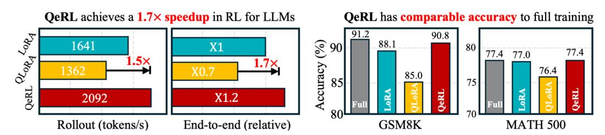

# ABSTRACT

We propose QeRL, a Quantization-enhanced Reinforcement Learning framework for large language models (LLMs). While RL is essential for LLMs' reasoning capabilities, it is resource-intensive, requiring substantial GPU memory and long rollout durations. QeRL addresses these issues by combining NVFP4 quantization with Low-Rank Adaptation (LoRA), accelerating rollout phase of RL while reducing memory overhead. Beyond efficiency, our findings show that quantization noise increases policy entropy, enhancing exploration, and enabling the discovery of better strategies during RL. To further optimize exploration, QeRL introduces an Adaptive Quantization Noise (AQN) mechanism, which dynamically adjusts noise during training. Experiments demonstrate that QeRL delivers over 1.5× speedup in the rollout phase. Moreover, this is the first framework to enable RL training of a 32B LLM on a single H100 80GB GPU, while delivering overall speedups for RL training. It also achieves faster reward growth and higher final accuracy than 16-bit LoRA and QLoRA, while matching the performance of full-parameter fine-tuning on mathematical benchmarks such as GSM8K (90.8%) and MATH 500 (77.4%) in the 7B model. These results establish QeRL as an efficient and effective framework for RL training in LLMs.

Figure 1: Rollout speedup and accuracy of QeRL on Qwen2.5-7B-Instruct. QeRL achieves faster RL rollout and end-to-end training speeds (batch=8), while delivering performance superior to vanilla LoRA and QLoRA, also comparable to full-parameter RL on mathematical benchmarks.

