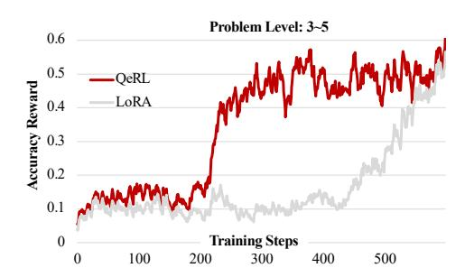
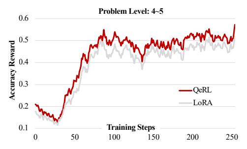
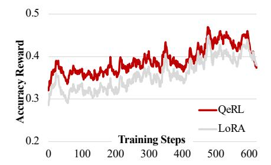
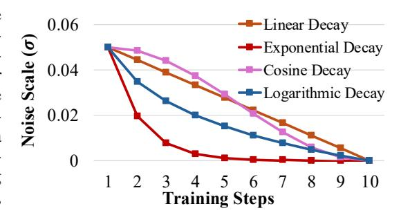
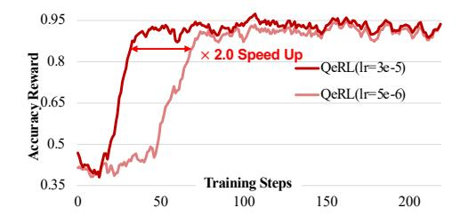
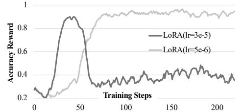

# <span id="page-15-1"></span>F DEPLOYMENT OF QERL

In Algorithm [1,](#page-16-2) we provide a detailed explanation of how QeRL is deployed within the GRPO framework. During the steps in stage 0, the added noise σ is set to 0, where only quantization noise effects. At stage 1, σ is initialized to σstart, and by the final stage (K-1) σ gradually transitions to σstart. This progressive adjustment of noise ensures a structured and controlled exploration process throughout the training stages, balancing stability and exploration effectively.

#### <span id="page-16-2"></span>Algorithm 1 Deploy GRPO with QeRL and Adaptive Quantization Noise

```
Input NVFP4 policy model \pi_{\theta}; reward function r_{\phi}; task prompts \mathcal{D}; hyperparameters; LoRA rank, LoRA
alpha; number of stages K; \sigma_{\text{start}}, \sigma_{\text{end}};
  1: policy model \pi_{\theta} \leftarrow \pi_{\tilde{\theta} + \theta_{lora}}
  2: for iteration = 1, \ldots, I do
 3:
            reference model \pi_{ref} \leftarrow \pi_{\theta}
 4:
             for step = 1, \ldots, M do
  5:
                   Divide total steps M into K equal stages: steps per stage = \lfloor M/K \rfloor
                  Determine current stage k: k = \lfloor \frac{\text{step}-1}{\text{steps per stage}} \rfloor
 6:
                  Set noise level \sigma \leftarrow \begin{cases} 0 & \text{if } k = 0 \\ \sigma_{\text{start}} \cdot \left(\frac{\sigma_{\text{end}}}{\sigma_{\text{start}}}\right)^{\frac{k-1}{K-1}} & \text{otherwise (exponential decay)} \end{cases}
 7:
 8:
                   Sample a batch \mathcal{D}_b from \mathcal{D}
                   Update the old policy model with AQN: \pi_{\theta_{old}} \leftarrow \pi_{\theta} + \mathcal{N}(0, \sigma^2)
 9.
                   Sample G outputs \{o_i\}_{i=1}^G \sim \pi_{\theta_{old}}(\cdot \mid q) for each question q \in \mathcal{D}_b Compute rewards \{r_i\}_{i=1}^G for each sampled output o_i by running r_\phi
10:
11:
12:
                   Compute \hat{A}_{i,t} for the t-th token of o_i through group relative advantage estimation.
13:
                   for GRPO iteration = 1, ..., \mu do
14:
                         Update the policy model \pi_{\theta} by maximizing the GRPO objective (Equation 3)
15:
                   end for
16:
             end for
17: end for
Output \pi_{\theta}
```

#### <span id="page-16-0"></span>G PROOF OF NOISE SHARING

In this section, we further demonstrate the effectiveness of the noise-sharing operation proposed in Eq.10, detailing the process by which additive noise is transformed into multiplicative noise. With AQN, input of each block follows:

$$RMSNorm_{noise}(\mathbf{X}) = (\frac{\mathbf{Z}_{noise}}{\mathbf{w}} + I) \odot RMSNorm(\mathbf{X}), \tag{11}$$

where  $RMSNorm(\cdot)$  denotes the vanilla RMSNorm operation and w is the original scaling factor in  $RMSNorm(\cdot)$ . The element-wise multiplication  $(\odot)$  will be auto-broadcast during computing. Then, the operation of the following linear computation is defined as:

$$((\frac{\mathbf{Z}_{noise}}{\mathbf{w}} + I) \odot \text{RMSNorm}(\mathbf{X})) \cdot \hat{\mathbf{W}} = \text{RMSNorm}(\mathbf{X}) \cdot ((\frac{\mathbf{Z}_{noise}}{\mathbf{w}} + I)^{\top} \odot \hat{\mathbf{W}}), \tag{12}$$

Thus, the additive Gaussian noise, when incorporated into the noise-sharing mechanism of Layer-Norm, can be equivalently regarded as multiplicative Gaussian noise (denoted as  $(\frac{\mathbf{Z}_{noise}}{\mathbf{w}}+I)$ ) and applied row-wise to the weight matrix  $\hat{\mathbf{W}}$ . Since RMSNorm is only applied to the inputs of each attention block and feed-forward network (FFN) block, this mechanism ensures that the Q, K, and V matrices in the attention block share the same noise, while the down and up layers in the FFN block also share a single, identical noise set. This noise-injection strategy avoids disrupting the multiplication kernels of NVFP4 and BF16 in QeRL or introducing additional matrix multiplication operations.

Both additive and multiplicative noise have been shown to positively contribute to exploration in RL (Plappert et al., 2017; Higuera et al., 2018; Chen et al., 2025b). However, multiplicative noise tends to be more sensitive, especially in deep networks like LLMs. To address this, we initialize the noise standard deviation ( $\sigma$ ) to 1e-2, which is smaller than the typical 1e-1 used in traditional noise-based networks.

#### H ADDITIONAL EXPERIMENTS OF TRAINING

<span id="page-16-1"></span>**Training Rewards of Different Model** Fig.12 and Fig.13 further compare the performance of QeRL and 16-bit LoRA training on complex reasoning datasets. In Fig.12, we present the training

<span id="page-17-2"></span>



Figure 12: Training reward of 7B model.

Figure 13: Training reward of 32B model.

rewards of the Qwen2.5-7B-Instruct model on the BigMath dataset with difficulty levels ranging from 3 to 5, as an extension of Fig.7. Leveraging the exploration benefits of QeRL in quantized models, a rapid increase in reward is observed after approximately 200 steps, whereas 16-bit LoRA requires over 500 steps to achieve a similar rise. Meanwhile, as shown in Fig.13, we trained the Qwen2.5-32B-Instruct model on the highest difficulty data (levels 4–5). Although the difference in reward growth between QeRL and LoRA is less pronounced in the 32B model compared to the smaller 3B, 7B, and 14B models, QeRL still consistently performs better than LoRA.

<span id="page-17-0"></span>More Experiments of Entropy As an extension of Fig.5, Fig.14 illustrates the entropy curve of the Qwen2.5-14B-Instruct model at various training steps. Notably, the entropy of QeRL remains consistently higher than that of LoRA throughout the RL process, particularly during the initial steps. This observation highlights the advantage of QeRL in promoting exploration during RL, as higher entropy indicates a broader search of the solution space. The increased exploratory capacity facilitated by quantization appears to enable the model to navigate complex environments more effectively, ultimately supporting improved

<span id="page-17-3"></span>

Figure 14: Entropy in RL steps.

optimization. These results further validate the role of quantization in enhancing the exploration-exploitation balance in RL tasks.

<span id="page-17-1"></span>Noise Scheduler Fig. 15 illustrates the noise scheduler employed in our experiments, showing four distinct decay strategies: linear, exponential, cosine, and logarithmic. The scheduler adjusts the noise level in 10 stages to guide the training process. The linear decay method reduces noise uniformly across stages, ensuring a consistent rate of change. The exponential decay rapidly decreases the noise at the beginning and uses smaller noise scales in later stages, which we found effective for achieving stable and higher rewards in later stages of training. The cosine decay follows a smooth oscillatory

<span id="page-17-4"></span>

Figure 15: Noise curve of different schedulers.

pattern, gradually reducing noise with a cosine curve, whereas the logarithmic decay decreases noise sharply in early stages and stabilizes in later ones. Among these, we chose the exponential decay strategy due to its ability to maintain smaller noise scales during the later stages, resulting in a more stable and higher reward curve. This flexibility in controlling noise levels plays a critical role in balancing exploration and convergence during training.

#### I ADDITIONAL ABLATION STUDY

**Ablation of Learning Rate** We examine the impact of learning rate variations on the performance of quantized models compared to 16-bit models. As illustrated in Fig. 16 and Fig. 17, with a relatively small learning rate of 5e-6, QeRL marginally outperforms LoRA, achieving a reward close to 0.95.

<span id="page-18-1"></span>



Figure 16: Ablation of learning rate in QeRL (Qwen2.5-7B-Instruct).

Figure 17: Ablation of learning rate in LoRA (Qwen2.5-7B-Instruct).

<span id="page-18-2"></span>

| Method              | <b>W</b> #           | Model Size       | BS#    | Throughput (            | E2E RL Speedup |        |       |
|---------------------|----------------------|------------------|--------|-------------------------|----------------|--------|-------|
| Wichiou             | *****                | Widdel Size      |        | Rollout Phase           | Speedup        | w/o GC | w/ GC |
| LoRA<br><b>QeRL</b> | BF16<br><b>NVFP4</b> | 6.2 GB<br>2.8 GB | 2<br>2 | 151.2<br><b>157.0</b>   | ×1.0           | ×1.1   | ×1.0  |
| LoRA<br><b>QeRL</b> | BF16<br><b>NVFP4</b> | 6.2 GB<br>2.8 GB | 8<br>8 | 2226.3<br><b>2271.4</b> | ×1.0           | ×1.1   | ×1.1  |

Table 5: Memory Saving and Speedup of Qwen2.5-3B-Instruct Model. The table reports the throughput (tokens/s) for the rollout phase under two batch size settings (2 and 8). Each input has a length of 256 tokens, and each max completion length is 2048. "W#" denotes the data format, "BS#" is the number of batch size, and "E2E" denotes the end-to-end speed of GRPO training. "GC" denotes gradient checkpointing.

<span id="page-18-3"></span>

| Method      | W#           | Model Size | BS# | Throughput (  | E2E RL Speedup |        |       |
|-------------|--------------|------------|-----|---------------|----------------|--------|-------|
| Witting     | ****         |            |     | Rollout Phase | Speedup        | w/o GC | w/ GC |
| LoRA        | BF16         | 15.2 GB    | 2   | 115.4         | -              | -      | -     |
| <b>QeRL</b> | <b>NVFP4</b> | 5.9 GB     | 2   | <b>151.6</b>  | ×1.3↑          | ×1.2↑  | ×1.2↑ |
| LoRA        | BF16         | 15.2 GB    | 8   | 1641.1        | -              | -      | -     |
| <b>QeRL</b> | <b>NVFP4</b> | 5.9 GB     | 8   | <b>2091.8</b> | ×1.3↑          | ×1.1↑  | ×1.1↑ |

Table 6: Memory Saving and Speedup of Qwen2.5-7B-Instruct Model. The table reports the throughput (tokens/s) for the rollout phase under two batch size settings (2 and 8). Each input has a length of 256 tokens, and each max completion length is 2048. "W#" denotes the data format, "BS#" is the number of batch size, and "E2E" denotes the end-to-end speed of GRPO training. "GC" denotes gradient checkpointing.

When the learning rate is increased to 3e-5, the larger update magnitude in the adapter results in faster reward growth and quicker model convergence. However, in 16-bit models, the excessive update magnitude leads to instability, often causing the training process to collapse. In contrast, QeRL demonstrates remarkable robustness to larger learning rates due to the presence of NVFP4 quantization noise, which helps stabilize updates. This robustness enables QeRL to maintain stable training even under high learning rates, achieving a reward growth rate nearly twice as fast as the 16-bit model. These results underscore QeRL's superior adaptability and efficiency, particularly in challenging training scenarios with high learning rates.

#### <span id="page-18-0"></span>J MORE EFFICIENCY EXPERIMENTS

Tab.5, Tab.6, Tab.7, and Tab.8 provide additional speed benchmarks for the Qwen2.5-3B-Instruct, Qwen2.5-7B-Instruct, Qwen2.5-14B-Instruct, and Qwen2.5-32B-Instruct models, evaluated under batch sizes of 2 and 8. For the 3B and 7B models, we did not enable memory-efficient techniques such as gradient checkpointing (Chen et al., 2016) or Liger loss (Hsu et al., 2025) in order to maximize training speed. However, due to the substantial size of the 14B and 32B models and the computational overhead introduced by importance sampling with gradients during RL training, we

<span id="page-19-0"></span>

| Method | W#    | Model Size | BS# | Throughput (Tokens/s) | E2E RL Speedup |        |        |
|--------|-------|------------|-----|-----------------------|----------------|--------|--------|
|        |       |            |     | Rollout Phase         | Speedup        | w/o GC | w/ GC  |
| LoRA   | BF16  | 29.6 GB    | 2   | 65.4                  | -              | -      | -      |
| QeRL   | NVFP4 | 10.6 GB    | 2   | 95.3                  | ×1.3 ↑         | ×1.4 ↑ | ×1.4 ↑ |
| LoRA   | BF16  | 29.6 GB    | 8   | 737.2                 | -              | OOM    | -      |
| QeRL   | NVFP4 | 10.6 GB    | 8   | 1091.1                | ×1.5 ↑         | OOM    | ×1.3 ↑ |

Table 7: Memory Saving and Speedup of Qwen2.5-14B-Instruct Model. The table reports the throughput (tokens/s) for the rollout phase under two batch size settings (2 and 8). Each input has a length of 256 tokens, and each max completion length is 2048. "W#" denotes the data format, "BS#" is the number of batch size, and "E2E" denotes the end-to-end speed of GRPO training. "GC" denotes gradient checkpointing.

<span id="page-19-1"></span>

| Method | W#    | Model Size | BS# | Throughput (Tokens/s) |         | E2E RL Speedup |             |  |
|--------|-------|------------|-----|-----------------------|---------|----------------|-------------|--|
|        |       |            |     | Rollout Phase         | Speedup | w/o GC         | w/ GC       |  |
| LoRA   | BF16  | 62.3 GB    | 2   | 34.0                  | -       | OOM            | OOM         |  |
| QeRL   | NVFP4 | 20.7 GB    | 2   | 60.0                  | ×1.8    | OOM            | 10.6 s/step |  |
| LoRA   | BF16  | 62.3 GB    | 8   | 344.3                 | -       | OOM            | OOM         |  |
| QeRL   | NVFP4 | 20.7 GB    | 8   | 688.2                 | ×2.0    | OOM            | 12.2 s/step |  |

Table 8: Memory Saving and Speedup of Qwen2.5-32B-Instruct Model. The table reports the throughput (tokens/s) for the rollout phase under two batch size settings (2 and 8). Each input has a length of 256 tokens, and each max completion length is 2048. "W#" denotes the data format, "BS#" is the number of batch size, and "E2E" denotes the end-to-end speed of GRPO training. "GC" denotes gradient checkpointing.

<span id="page-19-2"></span>

| Model | BF16 (Tokens/s) |         |         | Model | NVFP4 (Tokens/s) |         |         |
|-------|-----------------|---------|---------|-------|------------------|---------|---------|
|       | Rank 16         | Rank 32 | Rank 64 |       | Rank 16          | Rank 32 | Rank 64 |
| 3B    | 151.2           | 148.8   | 138.6   | 3B    | 157.0            | 153.1   | 140.0   |
| 7B    | 115.4           | 113.2   | 108.3   | 7B    | 151.6            | 149.9   | 137.7   |
| 14B   | 65.4            | 63.1    | 61.2    | 14B   | 95.3             | 92.9    | 86.0    |
| 32B   | 34.0            | 33.3    | 31.9    | 32B   | 58.0             | 56.0    | 51.3    |

Table 9: Throughput under different LoRA ranks in the rollout stage. We test the tokens/s for each model in the vLLM engine, and the setting is aligned with Tab[.7.](#page-19-0) We set the batch size as 1.

employ gradient checkpoint to accelerate computation. For training on GPUs with smaller memory capacity, enabling gradient checkpointing is recommended to reduce memory usage, although this may come at the cost of slower overall training speed. During the rollout phase, the precision of NVFP4, optimized by the Marlin kernel [\(Frantar et al.,](#page-10-4) [2024\)](#page-10-4), demonstrates a significant acceleration, achieving speeds of 1.0 to 2.0×. In particular, performance gains become more pronounced as model size increases, with the 32B model achieving up to a 2.0× speedup. This indicates that NVFP4's advantages are particularly impactful for large-scale models, where computational demands are higher.

In end-to-end RL efficiency evaluation, we report the per-step latency of GRPO training, defined as the wall clock time to complete an optimization step including rollout generation, log-probability computation, and parameter updates. We benchmark with rollout batch sizes of 2 and 8 while fixing the maximum input length to 256 tokens and the maximum completion length to 2,048 tokens. For fairness, we match the vLLM memory budget between BF16 and NVFP4 variants by setting the same gpu memory utilization in the engine: 0.20 for Qwen2.5-3B-Instruct, 0.30 for 7B, 0.45 for 14B, and 0.40 for 32B (the latter to enable single-GPU training). Under these controlled settings, the E2E latency reductions mirror the rollout phase acceleration and become more pronounced as the model size grows, with the largest gains observed on Qwen2.5-14B-Instruct.

Additionally, Tab[.9](#page-19-2) provides a comparison of inference speeds between 16-bit and NVFP4 main models across various LoRA ranks. NVFP4 consistently outperforms 16-bit models in terms of speed at all adapter ranks, showcasing its ability to maintain efficiency across diverse configurations. However, as the rank increases, both NVFP4 and BF16 experience a gradual decline in rollout speed within the vLLM engine, likely due to the increased computational overhead associated with higher ranks. Despite this, NVFP4 continues to demonstrate superior performance, highlighting its robustness and adaptability for both small-scale and large-scale setups. These findings underscore NVFP4's potential to optimize inference efficiency, particularly when combined with advanced kernels and varying adapter configurations.

