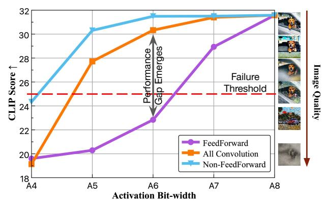

# 3.3.2. Temporal Layer Alignment

The inference process of diffusion models is highly dependent on the temporal information. Specifically, integer time steps are transformed into time embeddings through one or two linear layers, then added to the intermediate model features. Motivated by this observation, we make the following analysis that is consistent with previous works [\[16,](#page-8-10) [33\]](#page-9-3):

*Property* ❶*: Although time embeddings depend solely on time steps and are easily obtainable, precise temporal information is crucial for optimal quantization.*

| TE Setting (W8A8 Model) | FID ↓ | sFID ↓ | TE Setting (W4A8 Model) | FID ↓ | sFID ↓ |
|----------------------------|-------|--------|----------------------------|-------|--------|
| PTQ                        | 7.58  | 22.07  | PTQ                        | 8.59  | 22.74  |
| FP                         | 6.77  | 22.03  | FP                         | 7.55  | 21.69  |
| Ours                       | 5.61  | 21.22  | Ours                       | 6.95  | 23.17  |

Table 2. Ablations on time embedding (TE) settings. Finetuning the TE layers with our method surpasses full-precision embeddings, while the latter outperforms standard quantized ones.

Tab. [2](#page-3-1) provides an empirical justification, where we quantitatively show the performance drop when quantizing time embeddings to different bit-width. Under W8A8 and W4A8 bit-width settings, solely quantizing the time embeddings can lead to an increase of 0.81 and 1.04 (relatively 15%) in FID, respectively. We infer the reason is that inaccurate time embeddings can cause mismatched input and model functionality, resulting in possible oscillations in the sequence of noise removal. Previous works either propose to learn dynamic quantization parameters across different time steps through a simple network [\[33\]](#page-9-3), or calibrate the time embedding layers and projection layers across all time steps [\[16\]](#page-8-10). We instead focus on finetuning the time embedding layers, adjusting fewer modules without introducing additional parameters. The results in Tab. [2](#page-3-1) also suggest that our method can improve the quantization performance, even surpassing the full-precision baseline.

Concretely, in a single forward process, identical time embeddings are injected into different parts of the model, passed through projection layers, and merged with the latent image representations. This implies that the time information operates independently from the primary network flow. Thus, we refine the time embedding layer l's weight wl along with its activation quantization parameters sl :

$$\mathcal{L}_{\text{TLA}} = \sum_{l \in \mathbb{C}_{\text{TE}}} \mathbb{E}_t[||O(t; \mathbf{w}_l) - \tilde{O}(t; \mathbf{w}_l, \mathbf{s}_l)||^2], \quad (4)$$

where CTE represents the set of time embedding layers. O(t; wl) is the intermediate activation of the full-precision model representing the ground truth, and O˜(t; wl , sl) is the quantized activation. This objective function indicates that the chosen weight parameters are consistently updated across different time steps, so as to ensure robustness to diverse temporal inputs. Different from other methods [\[10,](#page-8-6) [16\]](#page-8-10) that obtain different sets of quantization parameters for each time step, we only use a single set for varying time steps, improving time efficiency and memory storage.

#### 3.3.3. Critical Module Alignment

While inaccurate time embedding quantization reduces performance under low-bit settings, it does not cause the complete generation failure observed in fully quantized models. Through careful layer-wise empirical study, we make the following observation:

*Property* ❷*: Not all activations respond equally to reduced bit-width, as different activations exhibit varying levels of sensitivity, with certain critical layers being especially sensitive to quantization.*

Figure 3. Effect of decreasing different activations' bit-width on the model performance. The generation failure of FeedForward layers emerges at 6 bits, while all other linear layers barely fail at 4 bits and all convolution layers only fail at 4 bits.

Fig. [3](#page-4-1) illustrates the sensitivity of different activations to quantization. Specifically, we quantize three different types of activations to lower bits while maintaining the others' bit-width to 8-bit, and observe how the decreasing bit-width affects generation performance. Compared to weights that only fall into linear and convolutional layers, activations are more diverse and complex, making their effective quantization more challenging. Surprisingly, we observe that the FeedForward layer [\[7\]](#page-8-20) activations cause generation failure at as early as 6 bits, whereas the activations of all other linear layers (containing 5 times more layers) barely fail at 4 bits and all convolution layers (containing 3 times more layers) only fail at 4 bits. This indicates that these activations are especially sensitive to low-bit quantization, making them essential to be specially dealt with.

Denote CA as the set containing all attention-related [\[9\]](#page-8-21) layers and given their image calibration inputs zt,l, we optimize the corresponding weights and all quantization parameters s, except for the ones already updated:

$$\mathcal{L}_{\text{CMA}} = \sum_{l \in \mathbb{C}_A} \mathbb{E}_t[||O(z_{t,l}; \mathbf{w}_l) - \tilde{O}(\tilde{z}_{t,l}; \mathbf{w}_l, \hat{\mathbf{s}})||^2], \quad (5)$$

where wl are the weight parameters of the lth layer, z˜t,l is the quantized layer input, ˆs = s \ sl , l ∈ CTE, which represents all the quantization parameters without the ones already finetuned in Eq. [\(4\)](#page-4-2). Note that we use different inputs to optimize each module, so as to enhance the robustness of the modules to the input perturbations.

#### 3.3.4. Progressive Alignment with Global Loss

As investigated in the previous sections, two crucial types of layers are identified and selected for weight finetuning to enable quantization efficiency: time embedding layers and attention-related layers. We progressively align these components with the full-precision model due to their distinct, non-overlapping functionalities. Since temporal information is independent of the image input and determined early in the model, we first finetune the time embedding layers to provide accurate time step guidance for each subsequent module. Then we optimize the attention-related modules with the refined time embeddings.

However, the above selective finetuning strategy only aligns the local information in the model, but is unaware of the global error reduction of the quantized model and the quantization parameters of the unselected layers. To improve the final generated images' quality, we further aim to minimize the target task loss to provide global supervision:

$$\mathcal{L}_{G} = \mathbb{E}_{t}[||O(x_{t}; \mathbf{w}) - \tilde{O}(x_{t}; \mathbf{w}, \mathbf{s})||^{2}], \tag{6}$$

where w represents all the model weights, O(xt; w) represents the final output of the full-precision counterpart and O˜(xt; w, s) is the final output of the quantized model.

By integrating Eq. [\(4\)](#page-4-2), Eq. [\(5\)](#page-4-3) and Eq. [\(6\)](#page-4-4), the final objective is formulated as:

$$\arg\min_{\mathbf{w}_l} (\mathcal{L}_{TLA} + \mathcal{L}_{CMA} + 2\mathcal{L}_G), \ l \in \mathbb{C}_{TE} \cup \mathbb{C}_A.$$
 (7)

