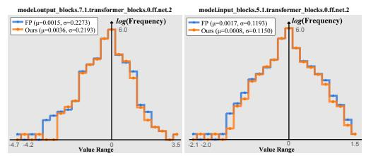
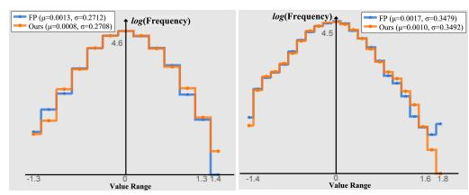

# 7. Low-resolution dataset comparison

We further include experiments on CIFAR10 in Tab. 11.

|             | W8A8 | W4A4  |
|-------------|------|-------|
| Q-Diffusion | 3.75 | N/A   |
| EfficientDM | 3.75 | 10.48 |
| QuEST       | 3.71 | 9.37  |

Table 11. FID comparison on CIFAR10.

(a) Activation Distribution on Conditional LDM4 (ImageNet 256 × 256)

(b) Activation Distribution on Unconditional LDM4 (LSUN-Bedrooms  $256 \times 256$ )

Figure 5. Illustrations of imbalanced activation distributions on conditional LDM4 (ImageNet  $256 \times 256$ ) and unconditional LDM4 (LSUN-Bedrooms  $256 \times 256$ ).

#### 8. Proof for Theorem 3.2

We provide the detailed proof for Theorem 3.2 here. The notations are consistent with the ones in the main paper.

Since the perturbation  $\Delta$  is too large for accurate Taylor expansion, we can resolve it by introducing a new perturbation  $\epsilon = \Delta/K$ , where we divide  $\Delta$  by a constant K so that  $\epsilon$  is small enough for approximation. Then, Eq. (8) is rewritten as follows:

$$\mathbb{E}[L(z_{n,t} + \Delta; \mathbf{w})] - \mathbb{E}[L(z_{n,t}; \mathbf{w})]$$

$$= \sum_{i=1}^{K} \left( \mathbb{E}[L(z_{n,t} + \frac{i}{K}\Delta; \mathbf{w})] - \mathbb{E}[L(z_{n,t} + \frac{i-1}{K}\Delta; \mathbf{w})] \right)$$

$$\approx \sum_{i=1}^{K} \left( \epsilon^{T} \overline{\mathbf{g}}^{(z_{n,t} + (i-1)\epsilon)} + \frac{1}{2} \epsilon^{T} \overline{\mathbf{H}}^{(z_{n,t} + (i-1)\epsilon)} \epsilon \right), \quad (11)$$

where the approximation step follows Taylor expansion and only the first two main components are kept. The first term in Eq. (11) cannot be ignored because samples such as  $z_{n,t}+(i-1)\epsilon$  may not be included in the learned distribution of the model. The second term can still be minimized by reconstruction since only the difference between quantized model output and ground-truth matters. In the following, we temporarily exclude the second term for simplicity since it can always be minimized through aligning the activation outputs.

Randomly corrupt 1 token

Corrupt 1 maximum value token

Randomly corrupt 3 tokens

Corrupt 3 maximum value tokens

Figure 6. Comparison of different corruptions made on different tokens.

Given the objective function (MSE loss) of diffusion models, we analyze that:

 $\sum_{i=1}^{K} \epsilon^{T} \overline{\mathbf{g}}^{(z_{n,t}+(i-1)\epsilon)} = 2\epsilon^{T} \sum_{i=1}^{K} (\tilde{z}_{n-1,t}^{i} \cdot \mathbf{w}_{n} - \overline{z}_{n,t})$   $\approx 2\epsilon^{T} \sum_{i=1}^{K} (\tilde{z}_{n-1,t}^{i} \cdot \mathbf{w}_{n} - z_{\text{FP}}), \quad (12)$ 

where  $\mathbf{w}_n$  is the weight for layer n,  $\tilde{z}_{n-1,t}^i$  is the activation of the (n-1)th layer in a quantized model to get  $z_{n,t}+(i-1)\epsilon$ . Ground-truth  $\overline{z}_{n,t}$  can be approximated by the full-precision output  $z_{\mathrm{FP}}$ . We see that  $\tilde{z}_{n-1,t}^i$  and  $z_{\mathrm{FP}}$  cannot be changed, thus to minimize Eq. (12), we need to finetune  $\mathbf{w}_n$ . From a general perspective, Eq. (12) also indicates that the model has not converged well to a local minimum given the perturbed inputs, thus when we finetune the model layers given the quantized inputs, we are actually training the model towards convergence over new samples and increasing its robustness.

