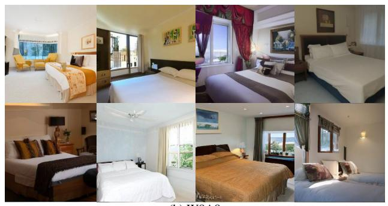
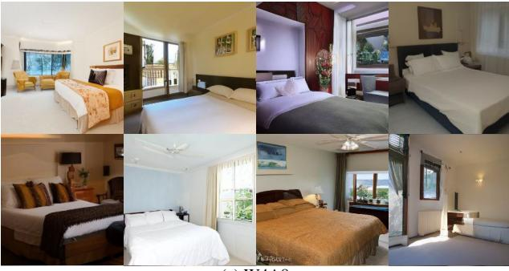
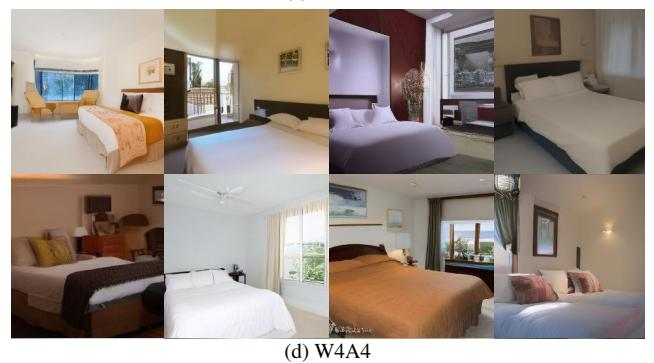

# 9. Examples of Imbalanced Activation Distributions

Apart from Fig. 2, we show that the imbalance in the activation distribution is a common phenomenon in different model structures and datasets. In Fig. 5, we show more re-

sults of activation distributions of latent diffusion models on ImageNet 256  $\times$  256 and LSUN-Bedrooms 256  $\times$  256.

### 10. Importance of large values in activations

As shown in Fig. 2, quite a few values are rather large and diversely distributed. These values pose difficulties on activation quantization, and being rather important and not negligible. To demonstrate this, we corrupt certain tokens in the activation outputs of the diffusion model and check the corresponding generated images. The corruption is done by setting the token values as all zeros. As shown in Fig. 6, we compare two settings: (1) corrupt a certain number of tokens randomly; (2) corrupt the same number of the tokens with the largest values.

We see that when corrupting randomly, generation performance is hardly effected. However, corrupting the same amount of tokens (even only one token) with the largest values leads to significantly degenerated images.

#### 11. More generated image examples

#### 11.1. Unconditional Image Generation

The generated images for LSUN-Bedrooms  $256 \times 256$  under different bit-widths are shown in Fig. 7. Images for LSUN-Churches  $256 \times 256$  are shown in Fig. 9.

(a) Full Precision

(b) W8A8

(c) W4A8

Figure 7. Unconditional image generation examples for LSUN-Bedrooms 256×256.

