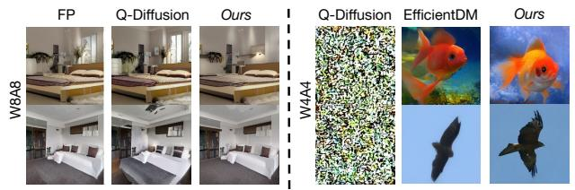

# 3.4. Finetuning from a Theoretical Perspective

The above proposed method is motivated by the intuition that finetuning the model weights can adjust the activation distribution such that the imbalanced activation phenomenon can be alleviated. In this part, we *attempt to explain why finetuning may be a feasible solution*, offering additional insights for readers. However, we note that this is not a theoretical guarantee of the proposed method.

We first review the underlying theory underpinning conventional post-training-quantization methods, which typically employ the reconstruction-based approach. Denote the full-precision diffusion model's activations at time t as  $\mathbf{z}_t = [z_{1,t}, z_{2,t}, ..., z_{n,t}]$ , the final loss as  $L(\mathbf{z}_t; \mathbf{w})$ , where n is the number of layers. L can be any loss function and here we use the mean squared error (MSE). We treat quantization as a type of perturbation and formulate the influence of activation quantization using Taylor expansion, assuming model weight  $\mathbf{w}$  is frozen:

$$\mathbb{E}[L(z_{n,t} + \Delta; \mathbf{w})] - \mathbb{E}[L(z_{n,t}; \mathbf{w})]$$

$$\approx \Delta^{\mathrm{T}} \overline{\mathbf{g}}^{(z_{n,t})} + \frac{1}{2} \Delta^{\mathrm{T}} \overline{\mathbf{H}}^{(z_{n,t})} \Delta, \qquad (8)$$

where  $\Delta$  is the activation perturbation,  $\overline{\mathbf{g}}^{(\mathbf{z})}$  is the gradient and  $\overline{\mathbf{H}}^{(z_{n,t})}$  is the Hessian matrix. According to [20, 41], for a well-trained model,  $\overline{\mathbf{g}}^{(z_{n,t})} = \nabla_{z_{n,t}} L$  approaches 0. Thus the above equation can be simplified to:

$$\frac{1}{2}\Delta^{\mathrm{T}}\overline{\mathbf{H}}^{(z_{n,t})}\Delta = \frac{1}{2}(\tilde{z}_{n,t} - z_{n,t})^{\mathrm{T}}\overline{\mathbf{H}}^{(z_{n,t})}(\tilde{z}_{n,t} - z_{n,t}). (9)$$

However, under low-bit settings, the reasoning from Eq. (8) to Eq. (9) is inaccurate, where the activation perturbation  $\Delta$  is too large for a meaningful Taylor expansion. Thus we have the following proposition:

**Proposition 3.1.** Reconstruction-based post-training quantization methods may lose their theoretical guarantee due to the large value perturbations under low-bit quantization.

Since the inaccuracy arises from the large activation perturbation  $\Delta$ , we transform  $\Delta$  into a smaller perturbation  $\epsilon$  and derive the following theorem:

**Theorem 3.2.** Given an n layer diffusion model at time t with quantized activations as  $\tilde{\mathbf{z}}_t = [\tilde{z}_{1,t}, \tilde{z}_{2,t}, ..., \tilde{z}_{n,t}]$  and  $\tilde{z}_{n,t} = z_{n,t} + \Delta$ , where  $z_{n,t}$  is the ground truth and  $\Delta$  is the large perturbation caused by low-bit quantization. Denote the target task MSE loss as  $L(\mathbf{z}_t; \mathbf{w})$ , the quantization error can be transformed into:

$$\mathbb{E}[L(z_{n,t} + \Delta; \mathbf{w})] - \mathbb{E}[L(z_{n,t}; \mathbf{w})]$$

$$\approx 2\epsilon^{\mathrm{T}} \sum_{i=1}^{K} (\tilde{z}_{n-1,t}^{i} \cdot \mathbf{w}_{n} - z_{n,t})$$

$$+ \frac{1}{2} \sum_{i=1}^{K} (\tilde{z}_{n,t}^{i} - z_{n,t})^{\mathrm{T}} \overline{\mathbf{H}}^{(z_{n,t}+(i-1)\epsilon)} (\tilde{z}_{n,t}^{i} - z_{n,t}) \quad (10)$$

where  $\mathbf{w}_n$  is the weight for layer n and  $\tilde{z}_{n,t}^i = \tilde{z}_{n-1,t}^i \cdot \mathbf{w}_n$ , K is a large constant and  $\Delta = K\epsilon$ .

| Dataset  | Method       | Bit-width (W/A) | Size (MB) | FID↓  |
|----------|--------------|-----------------|--------------|-------|
|          | FP           | 32/32           | 1045.6       | 2.95  |
|          | PTQ4DM       | 8/8             | 279.1        | 4.75  |
|          | Q-Diffusion  | 8/8             | 279.1        | 4.53  |
|          | PTQ-D        | 8/8             | 279.1        | 3.75  |
|          | EfficientDM* | 8/8             | 279.1        | N/A   |
|          | Ours         | 8/8             | 279.1        | 3.03  |
| LSUN-    | PTQ4DM       | 4/8             | 148.4        | N/A   |
| Bedrooms | Q-Diffusion  | 4/8             | 148.4        | 5.37  |
| (LDM-4)  | PTQ-D        | 4/8             | 148.4        | 5.94  |
|          | EfficientDM* | 4/8             | 148.4        | 15.15 |
|          | Ours         | 4/8             | 148.4        | 3.26  |
|          | PTQ4DM       | 4/4             | 148.4        | N/A   |
|          | Q-Diffusion  | 4/4             | 148.4        | N/A   |
|          | PTQ-D        | 4/4             | 148.4        | N/A   |
|          | EfficientDM* | 4/4             | 148.4        | 10.60 |
|          | Ours         | 4/4             | 148.4        | 5.64  |
|          | FP           | 32/32           | 1125.4       | 4.02  |
|          | PTQ4DM*      | 8/8             | 330.6        | 63.93 |
|          | Q-Diffusion  | 8/8             | 330.6        | 6.94  |
|          | PTQ-D*       | 8/8             | 330.6        | 10.76 |
|          | EfficientDM* | 8/8             | 330.6        | N/A   |
|          | Ours         | 8/8             | 330.6        | 6.55  |
| LSUN-    | PTQ4DM*      | 4/8             | 189.9        | N/A   |
| Churches | Q-Diffusion  | 4/8             | 189.9        | 7.80  |
| (LDM-8)  | PTQ-D*       | 4/8             | 189.9        | 7.33  |
|          | EfficientDM* | 4/8             | 189.9        | 9.29  |
|          | Ours         | 4/8             | 189.9        | 7.33  |
|          | PTQ4DM*      | 4/4             | 189.9        | N/A   |
|          | Q-Diffusion  | 4/4             | 189.9        | N/A   |
|          | PTQ-D*       | 4/4             | 189.9        | N/A   |
|          | EfficientDM* | 4/4             | 189.9        | 14.34 |
|          | Ours         | 4/4             | 189.9        | 11.76 |

Table 3. Quantization performance on LSUN-Bedrooms/Churches 256×256. "N/A" denotes generation failure. "\*" denotes the results obtained by re-implementing the open-source code. More baseline and metric comparisons are included in the Appendix.

Theorem 3.2 indicates that, to minimize quantization error,  $\mathbf{w}_n$  should ideally be fine-tuned so that, for any i, the weights fit the corresponding input  $\tilde{z}_{n-1,t}^i + (i-1)\epsilon$ . This adjustment captures variations that the full-precision model may overlook. In other words, fine-tuning optimizes model weights for better robustness towards large input activation perturbations, facilitating easier quantization. Moreover, since the finetuned and quantized model is aligned with the original full-precision model, the potential impact on generation performance can be avoided. Note that the second term in Eq. (10) can be ignored within an acceptable upper bound, as it is of second order and shares a common zero-loss solution with the first term.

| Bit-width (W/A) | Method                                       | Size (MB)                     | FID↓                              | sFID↓                             | IS↑                                   |
|-----------------|----------------------------------------------|----------------------------------|-----------------------------------|-----------------------------------|---------------------------------------|
| 32/32           | FP                                           | 1529.7                           | 11.28                             | 7.70                              | 364.73                                |
| 8/8             | Q-Diffusion PTQ-D EfficientDM*         | 428.7 428.7 435.0          | 10.60 <b>10.05</b> 11.38    | 9.29 9.01 8.04              | 350.93 359.78 362.34            |
|                 | Ours                                         | 428.7                            | 10.43                             | 6.07                              | 365.12                                |
| 4/8             | Q-Diffusion PTQ-D EfficientDM*         | 237.5 237.5 243.8          | 9.29 8.74 9.93              | 9.29 7.98 7.34              | 336.80 344.72 353.83            |
|                 | Ours                                         | 237.5                            | 8.48                              | 6.55                              | 354.97                                |
| 4/4             | Q-Diffusion PTQ-D EfficientDM* Ours | 237.5 237.5 243.8 237.5 | N/A N/A 6.97 <b>5.98</b> | N/A N/A 9.28 <b>7.93</b> | N/A N/A 199.96 <b>202.45</b> |

Table 4. Quantization performance on ImageNet 256×256. "\*" denotes the results obtained by re-running the open-source code.

## 4. Experiments

#### 4.1. Experiment Settings

To verify the effectiveness of our proposed method, we conduct experiments on three types of generation tasks: Unconditional image generation on LSUN-Bedrooms and LSUN-Churches datasets [40], class-conditional image generation on ImageNet [4], and text-to-image generation. The model architectures we quantize include LDMs and Stable Diffusion [30], and use "WnAm" to represent the quantization setting: n-bit weight quantization and m-bit activation quantization. DDIM samplers [14] are adopted for LDMs and the PLMS sampler [26] is used for Stable Diffusion. We generate 256 samples per time step for constructing the calibration set. The Adam optimizer [18] is adopted and the learning rate for weight finetuning and scaling factor finetuning is set as  $1e^{-5}$  and  $1e^{-4}$  respectively.

We compare with popular PTQ methods including PTQ4DM [32], Q-Diffusion [19] and PTQ-D [11], as well as the state-of-the-art efficient finetuning method EfficientDM [10]. The performance of different quantized LDMs is evaluated using the Fréchet Inception Distance (FID) [13], spatial FID (sFID) [29] and Inception Score (IS) [1]. Unless specified, quantitative results are obtained by sampling 50,000 images and evaluated using the official evaluation scripts [6]. For Stable Diffusion, we use the CLIP Score [12] for evaluation. All experiments are conducted on A6000 GPUs.

#### 4.2. Experiment Results and Analysis

**Unconditional Generation:** We evaluate the performance of our method over LDM-4 (LSUN-Bedrooms  $256 \times 256$ ) and LDM-8 (LSUN-Churches  $256 \times 256$ ) using the DDIM sampler with 200 and 500 time steps, respectively. Results are shown in Tab. 3 using FID, where our method outperforms the other baselines by a good margin. Note that the

| Bit-width (W/A) | Method      | Size (MB) | CLIP Score↑  |
|-----------------|-------------|-----------|--------------|
| 32/32           | FP          | 3279.1    | 31.50        |
| 8/8             | Q-Diffusion | 949.0     | 31.43        |
|                 | Ours        | 949.0     | <b>31.47</b> |
| 4/8             | Q-Diffusion | 539.1     | 31.39        |
|                 | Ours        | 539.1     | <b>31.50</b> |
| 4/4             | Q-Diffusion | 539.1     | N/A          |
|                 | Ours        | 539.1     | 28.85        |

Table 5. Quantization performance on Stable Diffusion v1.4  $(512\times512)$  using COCO2014 prompts.

Inception Score is not a reasonable metric for datasets that have significantly different domains and categories from ImageNet [19], thus not included. We further provide comparison with TFMQ-DM [16] in Appendix 6.

Class-conditional Generation: We evaluate the performance using LDM-4 on ImageNet 256×256 using the DDIM sampler (20 steps). As shown in Tab. 4, three metrics are used for evaluation. Note that sFID uses additional intermediate spatial features for calculation compared with FID. We can also see that FID is not a valid metric for ImageNet LDM-4 evaluation: All methods have lower FID when quantized to lower bits, conflicting with human perception. We show that our method not only succeeds in W4A4 quantization, but also improves the generation quality under higher bit settings. Under all three kinds of bitwidth settings, our method is able to outperform the SOTA PTQ methods and EfficientDM in both sFID and IS. Examples of our generated images are included in Appendix 11. **Text-to-image Generation:** We use Stable Diffusion v1.4 as the model for quantization with the PLMS sampler sampling 50 time steps. Tab. 5 shows the results. Images are generated based on the 10,000 prompts sampled from the COCO2014 [24] validation set, and CLIP Score is calculated based on the ViT-B/16 backbone. Given the limited works done on Stable Diffusion, we can only compare with O-Diffusion and the full-precision baseline.

Figure 4. Visual comparison with Q-Diffusion and EfficientDM. QuEST outperforms the baselines with better visual quality.

#### 4.3. Ablations and Discussions

Efficiency comparison with PTQ methods and the impact of individual components. Tab. 6 compares the efficiency and performance against the post-training quantization (PTQ) approach on the LSUN-Bedrooms dataset. Although our method uses the same amount of calibration data

| Method      | Bit-width (W/A) | Calibration data size | Time cost (GPU hours) | Memory cost (MB) | Model size (MB) | FID↓ |
|-------------|-----------------|-----------------------|--------------------------|---------------------|--------------------|------|
| FP          | 32/32           | -                     | -                        | -                   | 1045.6             | 2.95 |
| PTQ [19]    | 4/8             | 5120                  | 23.08                    | 10334               | 148.4              | 5.37 |
| Baseline    | 4/8             | 5120                  | 11.52                    | 9822                | 148.4              | 6.95 |
| + TLA       | 4/8             | 5120                  | 13.13                    | 11862               | 148.4              | 4.41 |
| + TLA + CMA | 4/8             | 5120                  | 15.25                    | 12178               | 148.4              | 3.26 |

| TLA           | w/o $\mathcal{L}_G$   | w/ $\mathcal{L}_G$   |
|---------------|-----------------------|----------------------|
| FID↓ sFID↓ | 8.99 15.23         | 6.41 11.18        |
|               |                       |                      |
| CMA           | w/o $\mathcal{L}_{G}$ | w/ $\mathcal{L}_{G}$ |

Table 6. Component and efficiency comparisons on LDM-4 (LSUN-Bedrooms 256  $\times$  256). The baseline method is direct quantization with the Adaptive Rounding [28] strategy.

Table 7. Influence of global loss supervision on performance.

as the PTQ approach, it achieves better time efficiency with only a 20% increase in GPU memory usage. We also illustrate the contribution of each component to generation performance. The results indicate that sequentially finetuning the time embedding layers, followed by attention-related layers, yields consistent performance improvements.

Tab. 7 presents a comparison of performance with and without the global loss  $\mathcal{L}_G$ . The results indicate that supervising the quantized model using the output difference from the full-precision counterpart is essential for performance improvement, enhancing the FID by 2.58 and 5.21 for TLA and CMA, respectively. However, when the learning process is only supervised by the global loss, we find that the performance degrades by 7.13 FID and 9.39 sFID for TLA, suggesting that the global loss alone is insufficient for optimal performance.

| Bit-width | Method                               | Time (h)             | Memory (MB)          | Iters               | FID↓                         |
|-----------|--------------------------------------|----------------------|-------------------------|---------------------|------------------------------|
| W4A8      | EfficientDM Full-finetune Ours | 2.60 0.85 0.45 | 12004 15076 12178 | 32k 2.2k 2.2k | 15.15 5.38 <b>3.82</b> |
| W4A4      | EfficientDM Full-finetune Ours       | 2.60 0.85 0.45 | 12004 15076 12178 | 32k 2.2k 2.2k | 10.60 6.36 <b>6.12</b> |

Table 8. Efficiency comparison with other finetuning methods.

How QuEST adjusts the activation distribution. Our approach is motivated by the imbalanced activation distribution in diffusion models, hence we aim to analyze how our fine-tuning strategy addresses this challenge. As shown in Fig. 2, our method refines the activation distribution, making it more conducive to quantization. Specifically, the activation value ranges shrink from [-10, 34] to [-4, 14] and from [-11, 20] to [-4, 4]. Additionally, the standard deviations decrease from 0.171 to 0.157 and from 0.073 to 0.071, while the mean remains consistent. This results in a more compact activation distribution, effectively reducing both rounding and clipping errors during quantization.

Comparison with precomputed time embeddings. In diffusion models, time embeddings are independent of input conditions and noise. A potential approach is to precompute these embeddings and reuse them directly. However, this strategy overlooks the compatibility between different mod-

ules in a quantized model. We take this into consideration and optimize the time embeddings with  $\arg\min_{\mathbf{w}_l}(\mathcal{L}_{TLA} + \mathcal{L}_G), \quad l \in \mathbb{C}_{TE}$  so that the time embedding layers are also trained to minimize the final prediction error. As shown in Tab. 2, adding this optimization objective enhances quantization performance, even surpassing the full-precision baseline (which uses precomputed features).

Integration with LoRA finetuning. Different ways exist for finetuning quantized models. We further employ QALoRA [10] to finetune on the ImageNet 256×256 dataset. A rank of 32 is used for the LoRA weights, and the parameters are trained over 100 time steps for 160 epochs. We find that integrating the QALoRA technique leads to a 5.62 increase in FID, indicating that finetuning the original layers is a better solution for performance preservation.

Efficiency comparison with other finetuning methods. We compare with EfficientDM and full-finetuning in terms of actual training costs on LDM-4 in Tab. 8. The setting of full-finetuning is aligned with our method. We observe that: compared with EfficientDM, our method requires fewer training iterations and time to obtain better performance with comparable GPU memory cost. Compared with full-finetuning, our method costs less time and memory, as well as achieving better performance. The bottleneck in computational costs becomes more severe when scaled to larger models such as Stable Diffusion. We find that while full-finetuning quickly encounters OOM, our method is able to finetune SD on a single GPU with 48GB memory.

#### 5. Conclusion

We have proposed QuEST, an efficient data-free finetuning framework for low-bit diffusion model quantization. Our method is motivated by the current challenge in low-bit diffusion model quantization and guided by the two underlying properties found in quantized diffusion models. To alleviate the performance degradation, we propose to finetune the time embedding layers and the attention-related layers under the supervision of the full-precision counterpart. Experimental results on three high-resolution image generation tasks (including Stable Diffusion) demonstrate the effectiveness and efficiency of QuEST, achieving low-bit compatibility with less time and memory cost.

Acknowledgments: This research is supported by NSF IIS-2525840, CNS-2432534, ECCS-2514574, NIH 1RF1MH133764-01 and Cisco Research unrestricted gift. This article solely reflects opinions and conclusions of authors and not funding agencies.

