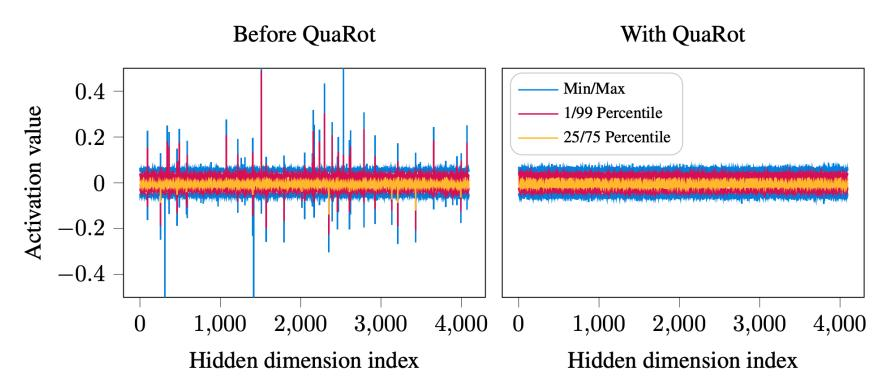

# 1 Introduction

Large language models (LLMs) have become increasingly important due to their countless applications. However, using these models in practice, known as inference, requires a significant amount of computation, memory, and energy, specifically during the *prefill* phase, in which the model is supposed to process large prompts and cache them in each layer. Quantization is among the most important techniques to improve both memory and compute issues by keeping the data types at lower precision during the forward pass.

As the prefill stage is known to be compute-bound [\[Ashkboos et al.,](#page-9-0) [2023\]](#page-9-0), joint quantization aims to reduce the precision of parameters and KV cache (which results in lower memory usage) as well as inputs (known as activations) and compute the forward pass in low precision. However, quantizing the activations is hard as they have large outlier elements (see Figure [1](#page-1-0) for an illustrative example) with much larger values, making activation quantization more difficult than weight quantization, especially for the 4-bit case. Previous work relies on using a calibration set to characterize the outlier features and keeping them in higher precision for inference [\[Zhao et al.,](#page-11-0) [2023,](#page-11-0) [Ashkboos et al.,](#page-9-0) [2023\]](#page-9-0).

Figure 1: The distributions of activations at the input to the FFN block in LLAMA2-7B model, in the tenth layer. Left: using the default configuration as downloaded from Hugging Face. Right: after processing using QuaRot. The processed distribution has no outliers, leading to superior quantization.

In this work, we address the issue of outlier features by rotating the inputs of the model using randomized Hadamard transformations. We do this using the *computational invariance* idea [\[Ashkboos et al.,](#page-9-1) [2024\]](#page-9-1) and fuse Hadamard transformations into the weight matrices, resulting in an equivalent network without outlier features. This enables the weights, activations, and KV caches to be quantized to 4 bits with minimal accuracy drop. Our main contributions are:

- We show that randomized Hadamard transformations can be applied to the weight matrices without additional model modifications. In turn, this completely eliminates outlier features and makes the activations easy to quantize, without changing the output of the model. This can be seen as an extension of the *computational invariance* idea, proposed in SliceGPT [\[Ashkboos et al.,](#page-9-1) [2024\]](#page-9-1) in the context of structured pruning.
- We extend this approach to apply *online* Hadamard transformations to the attention module to remove outlier features in keys and values, enabling the KV cache to be quantized.
- Using the above modifications, QuaRot enables 4-bit LLM inference by quantizing all weights, activations, and KV caches using integer quantization. We provide efficient kernel support for QuaRot: on a LLAMA2-70B model, QuaRot achieves up to 3.33× prefill speedups (on a batch size 64 with 2048 sequence length), and 3.89× memory saving during the decoding stage, with at most 0.47 WikiText-2 perplexity loss. QuaRot preserves 99% of the accuracy of zero-shot tasks and we show that our 6 and 8-bit quantization is lossless with simple round-to-nearest quantization.

