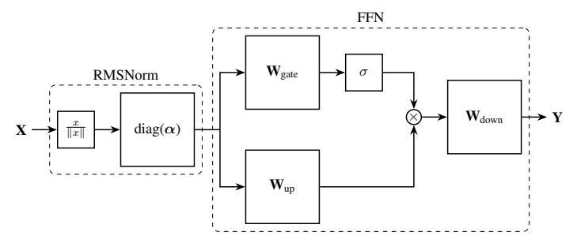
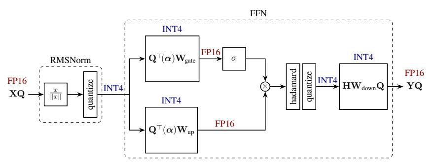

# 2 Related Work

The majority of quantization schemes focus on compressing LLMs by using *weight-only quantization*, [\[Frantar et al.,](#page-10-0) [2022,](#page-10-0) [Dettmers et al.,](#page-9-2) [2023,](#page-9-2) [Lin et al.,](#page-10-1) [2023,](#page-10-1) [Egiazarian et al.,](#page-10-2) [2024,](#page-10-2) [Tseng et al.,](#page-11-1) [2024\]](#page-11-1). These methods downcast each weight into a low-precision representation and upcast it before the actual computation. The main computation is still performed in high precision. Several works show that, unlike weights, quantizing the activations is hard due to the outlier features [\[Wei et al.,](#page-11-2) [2022,](#page-11-2) [Dettmers et al.,](#page-9-3) [2022,](#page-9-3) [Xiao et al.,](#page-11-3) [2023\]](#page-11-3). For 8-bit case, LLM.int8() [\[Dettmers et al.,](#page-9-3) [2022\]](#page-9-3) identifies the outlier features during inference and keeps them in 16 bits which results in poor performance. SmoothQuant [\[Xiao et al.,](#page-11-3) [2023\]](#page-11-3) normalizes the features using some scaling factors from a calibration set, solving the issue for the 8-bit case at the cost of introducing extra hyper-parameters. For 4-bit quantization, recent studies identify the outlier features offline and keep them in high precision. Atom [\[Zhao et al.,](#page-11-0) [2023\]](#page-11-0) developed a complex kernel for mixed-precision MatMul in the presence of outliers while QUIK [\[Ashkboos et al.,](#page-9-0) [2023\]](#page-9-0) keeps the down-projection layer in 8 bits.

Two weight-only quantization methods, QuIP [\[Chee et al.,](#page-9-4) [2024\]](#page-9-4) and QuIP# [\[Tseng et al.,](#page-11-1) [2024\]](#page-11-1) have previously considered improving quantization by applying rotations. [Chee et al.](#page-9-4) [\[2024\]](#page-9-4) introduced the idea of *incoherence processing* which applies rotation matrices to the left and right of each weight matrix, as well as the Hessian, which is used in minimizing the weight-quantization objective. [Xi](#page-11-4)

et al. [2023] uses a similar idea during training, using exact Hadamard transformations for each linear layer in the forward pass.

Finally, KV cache quantization is another line of research that aims to compress the cached keys and values during the generation phase. This is crucial for large batch size and long-context length generation as the KV cache will be the main memory bottleneck in such problems. Sheng et al. [2023] quantizes the KV cache using 4-bit group-wise quantization. KVQuant [Hooper et al., 2024] pushes this limit to 3-bit quantization and KIVI [Liu et al., 2024] shows promising results on 2-bit KV cache quantization. Such methods show that outliers also exist in the keys, and apply a set of complex ideas (like feature-wise quantization, non-uniform representation, and keeping high precision outliers) to recover the accuracy of a quantized KV cache.

In this work we also adopt the Hadamard transform to improve quantization of weights through incoherence processing. Instead of undoing the Hadamard transform during the forward pass, we adopt the computational invariance theorem from SliceGPT [Ashkboos et al., 2024] to fuse the transformations into the weights where possible. Instead of requiring two Hadamard transforms per weight-matrix in the forward pass, QuaRot requires just  $1\frac{1}{2}$  Hadamard transforms per transformer layer. Computational invariance also means that the *activations* are incoherence-processed, enabling them to be effectively quantized. We also apply a similar technique to the attention block and quantize the KV cache in 4 bits with minimal accuracy loss.

### 3 Background

Here we introduce some mathematical concepts and notation that are necessary for QuaRot.

#### 3.1 Orthogonal, Rotation and Hadamard Matrices

An orthogonal matrix  $\mathbf{Q}$  is a square matrix such that  $\mathbf{Q}\mathbf{Q}^{\top} = \mathbf{I}$ . In this work, we consider only real orthogonal matrices. A rotation matrix is an orthogonal matrix. A Hadamard matrix is an orthogonal matrix with entries drawing from  $\{+1,-1\}$ . A Walsh-Hadamard matrix is a square matrix of size  $d=2^n$ , with

$$\mathbf{H}_2 = \frac{1}{\sqrt{2}} \begin{bmatrix} 1 & 1 \\ 1 & -1 \end{bmatrix} \quad \text{and} \quad \mathbf{H}_{2^n} = \mathbf{H}_2 \otimes \mathbf{H}_{2^{n-1}}. \tag{1}$$

These identities give rise to the Walsh-Hadamard transform, which computes the matrix-vector product  $\mathbf{H}\boldsymbol{x}$  in  $\mathcal{O}(d\log_2(d))$  operations.

For matrix sizes that are not  $2^n$ , the existence of a Hadamard matrix is not guaranteed. A useful list of known Hadamard matrices is made available by Sloane [2024]. Where we require a Hadamard matrix of size  $d \neq 2^n$ , we factorize  $d = 2^n m$ , where m is the size of a known Hadamard matrix. Then we use a Kronecker construction  $\mathbf{H}_d = \mathbf{H}_{2^n} \otimes \mathbf{H}_m$ . This allows computation of  $\mathbf{H}_d \mathbf{x}$  in  $\mathcal{O}(d(m+n))$  operations.

Following Tseng et al. [2024] we make use of *randomized* Hadamard matrices where convenient. Let s be a vector containing random draws from  $\{+1,-1\}$ , and  $\tilde{\mathbf{H}} = \mathbf{H} \operatorname{diag}(s)$ . It is straightforward to see that  $\tilde{\mathbf{H}}$  is also an orthogonal matrix.

#### 3.2 Incoherence Processing

The idea of *incoherence processing* was introduced by [Chee et al., 2024] in the context of weight normalization for weight-only LLM quantization. We define a weight matrix  $\mathbf{W}$  to be  $\mu$ -incoherent if

$$\max(\mathbf{W}) \le \mu \|\mathbf{W}\|_F / \sqrt{mn} \tag{2}$$

where max is the element-wise max of the matrix, and mn is the number of elements. A weight matrix that has high incoherence is hard to quantize: the largest element is an outlier relative to the magnitude of the average element. Chee et al. [2024] showed that multiplying a weight matrix on the left and right by an orthogonal matrix can reduce the incoherence, making matrices easier to quantize. In this work we adopt a similar technique, multiplying weight matrices by orthogonal matrices to improve incoherence, though we add fewer operations to the forward pass. Importantly, we additionally apply incoherence processing to the activations, enabling improved weight and activation quantization. Figure 1 shows the effect of applying incoherence processing to the activations of LLAMA-2.

Figure 2: The gated feed-forward network used in most LMs, including the pre-positioned RMSNorm. The input signal is divided by its norm, and re-scaled by parameters  $\alpha$ . Two linear blocks,  $\mathbf{W}_{up}$  and  $\mathbf{W}_{gate}$  are applied. The activation function  $\sigma$  is applied to the gated signal, and the two signals are element-wise multiplied together. The final linear block  $\mathbf{W}_{down}$  produces the output signal  $\mathbf{Y}$ . Before quantization, different operations are performed either in single (32 bit) or half (16 bit) precision.

#### 3.3 Transformer structures

Large Language Models are neural networks with repeating attention and feed-forward layers. We introduce our notation through Figures 2 and 5, which show the construction of these blocks. We assume that the construction of the network is "pre-norm", in that each block is preceded by a LayerNorm or RMSNorm operation. We also assume that the feed-forward network uses a gated architecture, as in LLAMA-2, though our methodology is straightforwardly applied to MLP architectures also.

#### 3.4 Computational Invariance

The computational invariance theorem [Ashkboos et al., 2024, Theorem 1] states that the weights and between-block activations in a transformer can be transformed using an orthogonal matrix with no change to the model output. Here we sketch the main idea. If  $\mathbf{W}_{in}$  is a weight matrix that appears on the left of a transformer block (i.e.,  $\mathbf{W}_{gate}$ ,  $\mathbf{W}_{up}$  in Figure 2, or  $\mathbf{W}_k$ ,  $\mathbf{W}_q$ ,  $\mathbf{W}_v$  in Figure 5) then we can multiply on the left by an orthogonal matrix  $\mathbf{Q}$ , and cancel out this effect by multiplying the output matrix ( $\mathbf{W}_{down}$ ,  $\mathbf{W}_{out}$ ) by  $\mathbf{Q}^{\top}$ . This applies despite the fact that RMSNorm is applied between the two blocks, so long as no re-scaling happens in the RMSNorm block (and in practice, we absorb any re-scaling into adjacent weight matrices first). Conceptually, this is because RMSNorm divides the activations by their norm, and applying a rotation  $\mathbf{Q}$  to the activations does not affect the norm. We have the commutation property

$$RMSNorm(\mathbf{X}) = RMSNorm(\mathbf{X}\mathbf{Q}^{\top})\mathbf{Q}, \tag{3}$$

where we assume here that RMSNorm applied to each row of the activations  $\mathbf{X}$  as  $\mathbf{x}_i \leftarrow \mathbf{x}_i/\|\mathbf{x}_i\|$ . This means that multiplying an output matrix by  $\mathbf{Q}^{\top}$  makes the linear layer output  $\mathbf{X}\mathbf{Q}^{\top}$ , which is normalized and then passed into the next block whose input weight matrix is now  $\mathbf{Q}\mathbf{W}$ , and so *this* linear layer outputs the original activations without modification.

#### 4 Method

QuaRot consists of two stages. In the first stage, the model weights are manipulated (in full precision), and two additional Hadamard operations are inserted into the model's forward pass. In the second stage, the weights are quantized using some existing method, and quantization operations are added to the forward pass to enable on-line quantization of the activations (and caches). By default, we use GPTQ [Frantar et al., 2022] for quantizing weights, whilst activations are quantized on-the-fly using a simple round-to-nearest scheme. Figures 3 and 6 show updated block diagrams for the forward pass with QuaRot modifications, including updated weight matrices, inserted blocks and the bit-width of weights and activations.

**Stage 1a: Weight Modification.** We first make use of computational invariance to multiply each weight matrix by an orthogonal matrix. To enable this, the linear parts of LayerNorm or RMSNorm are fused into adjacent weight matrices. Figure 3 shows how the feed-forward block of a transformer is modified by removing the scaling operation from RMSNorm  $(diag(\alpha))$  and absorbing into the

Figure 3: QuaRot applied to a LLaMa-style FFN. The RMSNorm scaling  $(\alpha)$  has been absorbed into the weight matrices  $((\alpha)$  is a diagonal matrix with RMSNorm parameters). The hidden state **X** has been rotated by **Q**, which is canceled out by the absorption of  $\mathbf{Q}^{\top}$  into the first two weight matrices. All weights are stored in INT4, and all activations immediately before the weights are also quantized to INT4. The result of the matmul between the INT4 weights and activations on a TensorCore is INT32, which we immediately cast (and scale) to FP16 which is the default precision of the model. Whilst the signal is still in FP16, we perform a single on-the-fly Hadamard transform before quantizing and computing a (modified) down-proj, which results in a rotated output **YQ**.

subsequent weight matrices. We select a randomized Hadamard matrix with size that matches the hidden dimension of the model and pre- or post-multiply each weight matrix. In Figures 3 and 6 this matrix is denoted  $\mathbf{Q}$ . For example the key-projection weight matrix  $\mathbf{W}_k$  is modified as

$$\mathbf{W}_k \leftarrow \mathbf{Q}^{\top} \operatorname{diag}(\boldsymbol{\alpha}) \mathbf{W}_k \,, \tag{4}$$

and similarly for other weight matrices. Matrices that appear on the *output* side of a block are post-multipled by  $\mathbf{Q}$ .

This weight modification does not affect the output of the model (assuming sufficient precision) as per the computational invariance theorem [Ashkboos et al., 2024]. We note that the modified weights resemble the modifications used in QuIP# [Tseng et al., 2024], reducing the incoherence of the weights, though our modification does not require any additional processing at run-time. Additionally, the activation matrix passed between blocks of the transformer is also incoherence processed, becoming  $\mathbf{X} \leftarrow \mathbf{XQ}$ . Figure 1 shows the result of this processing: we see that the processed activations no longer contain any outliers.

**Stage 1b: Rotate FFN activations.** With the above weight-modifications in place, we have multiplied many weight matrices on one side by a Hadamard matrix and the activations have been changed. It remains to improve the quantization of the activations *within* each block, which we achieve by inserting on-line Hadamard operations.

We first insert a Hadamard operation into the feed-forward network, before the down-projection matrix. This operation is performed in full precision, and implemented using a fast kernel following Tseng et al. [2024]. This operation is implicitly reversed by fusing a Hadamard matrix into the down-projection matrix of the network:  $\mathbf{W}_{down} \leftarrow \mathbf{H}\mathbf{W}_{down}$ . Combined with the global matrix  $\mathbf{Q}$ , this means that the down-projection matrix now becomes  $\mathbf{H}\mathbf{W}_{down}\mathbf{Q}$  (see Figure 3).

**Stage 1c: Attention Value Projection.** Next, we apply an additional Hadamard operation to each attention block. This modification is partially on-line, and partially fused into the weight matrices as we will now detail.

First, note that in the computation of attention, the  $W_v$  and  $W_{out}$  matrices are implicitly multiplied together within each head. To see this, note that the attention computation consists of

$$\mathbf{Y} = \operatorname{concat}[(\mathbf{P}_1 \mathbf{V}_1) \dots (\mathbf{P}_{n_h} \mathbf{V}_{n_h})] \mathbf{W}_{\operatorname{out}}$$
 (5)

$$= \sum_{h=1}^{H} \mathbf{P}_h \mathbf{X} \mathbf{W}_v^{(h)} \mathbf{W}_{\text{out}}^{(h)}$$
 (6)

where  $\mathbf{P}_h$  is a sequence-length sized square matrix computed by softmaxing keys and values, and  $\mathbf{V}_h = \mathbf{X}\mathbf{W}_v^{(h)}$  is the value matrix for one head. This presents an opportunity to perform additional

processing on  $\mathbf{W}_v$  and  $\mathbf{W}_{\text{out}}$  using a Hadamard matrix  $\mathbf{H}_{d_h}$  which matches the dimension of each head:

$$\mathbf{W}_{v}^{(h)} \leftarrow \mathbf{W}_{v}^{(h)} \mathbf{H}_{d_{h}}, \qquad \mathbf{W}_{\text{out}}^{(h)} \leftarrow \mathbf{H}_{d_{h}} \mathbf{W}_{\text{out}}^{(h)}. \tag{7}$$

Substituting these modifications into equation (6), we see that the computed result of attention remains unchanged. Since the weights for each head are concatenated in the weight representation, we can equivalently perform a single Kronecker structured multiplication:

$$\mathbf{W}_v \leftarrow \mathbf{W}_v(\mathbf{I} \otimes \mathbf{H}_{d_h}), \qquad \mathbf{W}_{\text{out}} \leftarrow (\mathbf{I} \otimes \mathbf{H}_{d_h}) \mathbf{W}_{\text{out}}.$$
 (8)

This transformation has now been applied head-wise to the weight matrices, and results in computed activations (emitted by the block *multi-head attention*) rotated head-wise also. To complete a "full" Hadamard operation on the attention-activations, sharing the transform across heads, we make use of the identity

$$\mathbf{H}_{n_h \times d_h} = (\mathbf{I} \otimes \mathbf{H}_{d_h})(\mathbf{H}_{n_h} \otimes \mathbf{I}) \tag{9}$$

which holds when the number of heads  $n_h$  and the dimension of each head  $d_h$  are both powers of 2. Since we have already applied  $(\mathbf{I} \otimes \mathbf{H}_{d_h})$  to both  $\mathbf{W}_v$  and  $\mathbf{W}_{\text{out}}$ , it remains to apply  $(\mathbf{H}_{d_h} \otimes \mathbf{I})$  to  $\mathbf{W}_{\text{out}}$ , which results in a complete transformation of  $\mathbf{W}_{\text{out}} \leftarrow \mathbf{H}\mathbf{W}_{\text{out}}$ , and to insert a block into the forward pass that computes  $\mathbf{Z} \leftarrow \mathbf{Z}(\mathbf{H}_{n_h} \otimes \mathbf{I})$  where  $\mathbf{Z}$  is the attention activation. This block is denoted *Hadamard heads* in Figure 6 and can be computed efficiently using a reshape to deal with the Kronecker structure, and a Walsh-Hadamard transform on the reshaped data.

**Stage 1d: Key Rotation.** Using the method above, we can successfully quantize the value vectors. However, key vectors in the attention module are also known to suffer from outliers [Hooper et al., 2024, Liu et al., 2024]. Similar to above, we can use a Hadamard rotation to alleviate this issue, allowing us to have a fully quantized KV cache. First note that the attention scores  $\mathbf{P}_1, \dots, \mathbf{P}_h$  are computed as:

$$\mathbf{Q} \leftarrow \operatorname{Pos}(\mathbf{XW}_q) = \operatorname{concat}[\operatorname{Pos}(\mathbf{Q}_1), \dots, \operatorname{Pos}(\mathbf{Q}_{n_h})]$$
 (10)

$$\mathbf{K} \leftarrow \operatorname{Pos}(\mathbf{X}\mathbf{W}_k) = \operatorname{concat}[\operatorname{Pos}(\mathbf{K}_1), \dots, \operatorname{Pos}(\mathbf{K}_{n_h})]$$
 (11)

$$\mathbf{P}_h \leftarrow \operatorname{Softmax}(\alpha \operatorname{Pos}(\mathbf{Q}_h) \operatorname{Pos}(\mathbf{K}_h^{\top}) \odot \mathbf{M}), \tag{12}$$

where  $\alpha$  is the Softmax scale usually set to  $\frac{1}{\sqrt{d_h}}$ , M is the attention mask (e.g., causal), and Pos denotes the positional embedding. Previously, positional embedding was only added before the first layer to the input, in which case Pos is an identity function. However, recent methods such as RoPE [Su et al., 2021] add position information directly to the key and query vectors.

We can now observe the same interaction between  $\mathbf{Q}$  and  $\mathbf{K}$  as we observed between  $\mathbf{W}_v$  and  $\mathbf{W}_{\text{out}}$ . However, the existence of Pos prevents us from directly fusing the Hadamard matrix into  $\mathbf{W}_q$  and  $\mathbf{W}_k$ . Therefore, we use online head-wise Hadamard rotation to rotate both the queries and keys. As a result, the computation of query and key matrices is altered as follows:

$$\mathbf{Q} \leftarrow \operatorname{Pos}(\mathbf{XW}_q)(\mathbf{I} \otimes \mathbf{H}_{d_h}) = \operatorname{concat}[\operatorname{Pos}(\mathbf{Q}_1)\mathbf{H}_{d_h}, \dots, \operatorname{Pos}(\mathbf{Q}_{n_h})\mathbf{H}_{d_h}]$$
(13)

$$\mathbf{K} \leftarrow \operatorname{Pos}(\mathbf{X}\mathbf{W}_k)(\mathbf{I} \otimes \mathbf{H}_{d_h}) = \operatorname{concat}[\operatorname{Pos}(\mathbf{K}_1)\mathbf{H}_{d_h}, \dots, \operatorname{Pos}(\mathbf{K}_{n_h})\mathbf{H}_{d_h}]. \tag{14}$$

Since both queries and keys are rotated, the final attention scores  $\mathbf{P}_1, \dots, \mathbf{P}_h$  remain unchanged. We note that an alternative to the above process is caching the keys before applying the positional encoding. This approach (called Pre-RoPE Caching [Hooper et al., 2024]) needs the inverse rotation to be applied online before applying the positional encoding but removes the need to rotate the query vector. It also adds the overhead of rotating the keys and values for every query. Given that at the time of decoding there is a single query vector and many cached key vectors, we use Post-RoPE caching. This helps us to apply a Hadamard transformation on a single token at each decoding step.

Overall, our modifications to the forward pass, including the insertion of special Hadamard blocks and adjustments to the weights do not change the forward pass of the model. The effect is that the activations between blocks have been multiplied by a Hadamard matrix, and the activations within blocks are processed on-line using Hadamard transforms in a way that is undone by corresponding weight matrix modifications. We are now ready to quantize the weights and activations.

**Stage 2a: Weight Quantization.** We apply GPTQ [Frantar et al., 2022] to quantize the weights of the network. We note that after the above forward-pass modifications, any quantization method could be applied. In subsequent sections, we show that a simple round-to-nearest (RTN) scheme can be applied instead of GPTQ, at the cost of some accuracy.

Stage 2b: Online Quantization Operations. With the weights quantized, we are ready to apply operations to the forward pass that quantize the activations. Following PyTorch implementation, we leave the computation of RMSNorm (without scaling) in FP32. We quantize the input of the linear layers using symmetric per-token (rows of the input matrix). During symmetric quantization, the row scales are computed by dividing the maximum absolute value of each token by 7 (largest representable number in INT4). We then divide each row to its corresponding scale and round the result to its nearest integer. The dequantization is also done by casting the INT32 output of GEMM into FP16, multiply the corresponding scale for the row (from input scales) and column (from weight scales).

Stage 2c: Quantized Attention. Attention is significantly memory bound for longer sequences and larger batch sizes. Having rotated both keys and values, we can successfully quantize the cache into low bit-width. This reduces the number of IO operations needed. We keep the queries in FP16 and use online softmax calculation similar to Flash Attention [\[Dao et al.,](#page-9-5) [2022\]](#page-9-5). After a segment of the KV vectors are loaded from the memory, we dequantize and compute the dot product in FP16.

