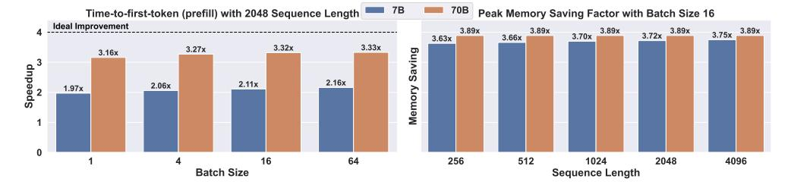

# 5 Experimental Validation

Setup. We implement QuaRot using Hugging Face [\[Wolf et al.,](#page-11-5) [2019\]](#page-11-5) on top of the PyTorch framework [\[Paszke et al.,](#page-10-8) [2019\]](#page-10-8). To quantize the inputs, we use per-token symmetric quantization (a single scale for every row) with a constant clipping ratio of 0.9 in all our experiments. We quantize the KV caches using asymmetric quantization with a group size 128 with a constant clipping ratio of 0.95. For weight quantization, we use round-to-nearest (RTN) and GPTQ [\[Frantar et al.,](#page-10-0) [2022\]](#page-10-0) with per-column (also known as per-channel) symmetric quantization, where we extract the clipping ratio using a linear search over the squared error. We use 128 samples from WikiText-2 [\[Merity et al.,](#page-10-9) [2016\]](#page-10-9) training set with 2048 sequence length as the calibration set during GPTQ quantization. On a single NVIDIA A100 GPU, modifying LLAMA2-70B with QuaRot takes 5 minutes and quantizing the model with GPTQ takes a further 2 hours. We present LLAMA-3 results in Appendix [A.8.](#page-15-0)

Models, Tasks, and GPUs. We evaluate QuaRot on the LLAMA-2 family [\[Touvron et al.,](#page-10-10) [2023\]](#page-10-10) on both language generation and zero-shot tasks. We implement our low-level CUDA kernel to perform 4-bit matrix-multiplication using the CUTLASS [\[NVIDIA,](#page-10-11) [2023\]](#page-10-11) library. We use the FlashInfer [\[Ye,](#page-11-6) [2023\]](#page-11-6) library for implementing our KV cache quantization. As we target consumer-type GPUs, we evaluate all the performance experiments on NVIDIA RTX 3090 GPUs.

#### 5.1 Accuracy Results

Language Generation Tasks. First, we evaluate the accuracy of QuaRot on the language generation task. Table [1](#page-7-0) shows the perplexity of LLAMA-2 models on WikiText-2 when we quantize the weights using GPTQ. We compare against 4-bit SmoothQuant [\[Xiao et al.,](#page-11-3) [2023\]](#page-11-3) and OmniQuant [\[Shao](#page-10-12) [et al.,](#page-10-12) [2023\]](#page-10-12). We also include the QUIK [\[Ashkboos et al.,](#page-9-0) [2023\]](#page-9-0) results when they keep all the layers (including down-projection) in 4 bits. QuaRot outperforms all previous work with at most 0.63 perplexity loss (0.47 on LLAMA2-70B model) without any re-training (as in OmniQuant) nor higher precision outlier features and asymmetric quantization (as in QUIK). We also apply group-wise quantization to compare against Atom [\[Zhao et al.,](#page-11-0) [2023\]](#page-11-0) on the same number of groups for weight and activations. In this setting, QuaRot doesn't need to keep any higher precision features and related operations (like re-ordering). QuaRot outperforms Atom with 0.1 perplexity points in the 7B model. On the 13B model, we get the same perplexity number as Atom.

Zero-Shot Tasks. Next, we focus on evaluating QuaRot on six important zero-shot tasks: PIQA [\[Bisk et al.,](#page-9-6) [2020\]](#page-9-6), WinoGrande [\[Sakaguchi et al.,](#page-10-13) [2021\]](#page-10-13), HellaSwag [\[Zellers et al.,](#page-11-7) [2019\]](#page-11-7), LAMBADA (OpenAI) [\[Radford et al.,](#page-10-14) [2019\]](#page-10-14), and Arc (Easy and Challenge) [\[Clark et al.,](#page-9-7) [2018\]](#page-9-7). We use the LM Evaluation Harness [\[Gao et al.,](#page-10-15) [2021\]](#page-10-15) with default parameters for our experiments. Table [2](#page-7-1) shows the accuracy of our scheme on the above tasks as well as the average score. On LLAMA-2 family, QuaRot preserves the accuracy with at most 4.18% average score loss (1.09% for 70B model).

#### 5.2 Performance Analysis

We implement QuaRot using CUDA/12.1 on top of PyTorch and use CUTLASS for performing INT-4 matrix multiplication on TensorCore (where the results will be saved in an INT32 accumulator). In this section, we evaluate the performance of our kernels for both prefill and decoding steps on NVIDIA RTX 3090 GPU. We provide all our experiments on a single transformer block as the whole

Table 1: WikiText-2 perplexity results on 4-bit quantization of LLAMA-2 models with 2048 sequence length. We extract the results for SmoothQuant and OmniQuant results of [Shao et al., 2023]. 128G shows the group-wise quantization with group size 128.Here, we quantize all weights, activations, and caches in 4-bits in QuaRot.

| Method                   | Weight Quantization |     |                     |              | 70B  |
|--------------------------|------------------------|-----|---------------------|--------------|------|
| Baseline                 | -                      | -   | 5.47                | 4.88         | 3.32 |
| SmoothQuant              | RTN                    | 0   | 83.12               | 35.88        | -    |
| OmniQuant                | RTN                    | 0   | 14.26               | 12.30        | -    |
| QUIK-4B                  | GPTQ                   | 256 | 8.87                | 7.78         | 6.91 |
| QuaRot                   | GPTQ                   | 0   | 6.10                | 5.40         | 3.79 |
| Atom-128G QuaRot-128G | GPTQ-128G              | 128 | 6.03 <b>5.93</b> | 5.26 5.26 | 3.61 |

Table 2: Zero-shot accuracy of LLAMA-2 models with 4-bit (A4W4KV4) QuaRot on PIQA (PQ), WinoGrande (WG), HellaSwag (HS), Arc-Easy (A-e), Arc-Challenge (A-c), and LAMBADA (LA).

| Model      | Method | PQ    | WG    | HS    | А-е   | A-c   | LA    | Avg.  |
|------------|--------|-------|-------|-------|-------|-------|-------|-------|
| LLAMA2-7B  | FP16   | 79.11 | 69.06 | 75.99 | 74.58 | 46.25 | 73.90 | 69.82 |
|            | QuaRot | 76.77 | 63.77 | 72.16 | 69.87 | 40.87 | 70.39 | 65.64 |
| LLAMA2-13B | FP16   | 80.47 | 72.22 | 79.39 | 77.48 | 49.23 | 76.75 | 72.59 |
|            | QuaRot | 78.89 | 70.24 | 76.37 | 72.98 | 46.59 | 73.67 | 69.79 |
| LLAMA2-70B | FP16   | 82.70 | 77.98 | 83.84 | 80.98 | 57.34 | 79.58 | 77.07 |
|            | QuaRot | 82.43 | 76.24 | 81.82 | 80.43 | 56.23 | 78.73 | 75.98 |

Figure 4: Performance of the QuaRot kernel on a single transformer block of LLAMA-2 models using NVIDIA RTX 3090 GPU. **Left**: For the speedup results, we evaluate using sequence length 2048 with different batch sizes. **Right**: Peak memory saving during decoding of 50 tokens with different prefill sequence lengths using batch size 16.

model does not fit on our GPU cluster for large batch sizes. We provide more performance analysis of our kernels (as well as complete results) in Appendix A.10.

**Prefill Stage Performance Increases.** For the compute-bound prefill stage, we present the speedups of using QuaRot on 2048 sequence length with different batch sizes in Figure 4 **Left**. On LLAMA2-7B model, we get 1.97x-2.16x speedup over the FP16 implementation using our QuaRot kernel. The speedup increases with batch sizes as the computation will become a bottleneck in larger batch sizes. on LLAMA2-70B model, we get up to 3.33x speedup. Note that our performance results could be improved by optimizing our kernels (e.g., fusing the quantization operations into the MatMul).

**Decoding Stages Memory Saving.** Finally, we evaluate the memory improvement which is the main bottleneck of the decoding stage. Figure 4 **Right** shows the peak memory saving on LLAMA-2 models. We provide results for LLAMA2-7B and LLAMA2-70B models. In both models, we get at least 3.63x peak memory saving compared to FP16 case during the decoding stage. Note that the KV cache is larger in LLAMA2-7B model as the LLAMA2-70B uses grouped-query attention [Ainslie et al., 2023]. In the LLAMA2-7B model, the memory saving increases with the sequence length, resulting in up to 3.75x memory saving. on LLAMA2-70B model, we get 3.89x savings in almost all the cases. We expect these values to be larger for the whole model (instead of just the single layer

Table 3: WikiText-2 Perplexity and zero-shot accuracy of QuaRot on the LLAMA-2 family using 4 and 8-bits with Round-to-Nearest (RTN) weights and activation quantization. For zero-shot tasks, we use PIQA (PQ), WinoGrande (WG), HellaSwag (HS), Arc-Easy (A-e), Arc-Challenge (A-c), and LAMBADA (LA). We quantize all weights, activations, and caches.

| Model | Method     | Precision    | PPL ↓        | PQ ↑           | WG ↑           | HS ↑           | A-e ↑          | A-c ↑          | LA ↑           | Avg. ↑         |
|-------|------------|--------------|--------------|----------------|----------------|----------------|----------------|----------------|----------------|----------------|
|       | Baseline   | FP16         | 5.47         | 79.11          | 69.06          | 75.99          | 74.58          | 46.25          | 73.90          | 69.82          |
| 7B    | QuaRot-RTN | INT4 INT8 | 8.37 5.50 | 72.09 78.94 | 60.69 68.67 | 65.40 75.80 | 58.88 74.79 | 35.24 45.39 | 57.27 74.33 | 58.26 69.65 |
|       | Baseline   | FP16         | 3.32         | 82.70          | 77.98          | 83.84          | 80.98          | 57.34          | 79.58          | 77.07          |
| 70B   | QuaRot-RTN | INT4 INT8 | 4.14 3.33 | 80.69 82.97 | 75.14 77.98 | 79.63 83.67 | 77.57 80.77 | 51.71 58.11 | 77.02 79.53 | 73.63 77.17 |

Table 4: WikiText-2 perplexity of 4-bit QuaRot with various group-sizes on LLAMA-2 models. We use GPTQ during the weight quantization. In all cases, we keep the KV cache group-size to 128 (same as the head dimension). 128G shows the group-wise quantization with 128 group size.

|             | LLAMA-2 |      |      |  |  |  |  |
|-------------|---------|------|------|--|--|--|--|
| Method      | 7B      | 13B  | 70B  |  |  |  |  |
| Baseline    | 5.47    | 4.88 | 3.32 |  |  |  |  |
| QuaRot      | 6.10    | 5.40 | 3.79 |  |  |  |  |
| QuaRot-256G | 5.98    | 5.28 | 3.63 |  |  |  |  |
| QuaRot-128G | 5.93    | 5.26 | 3.61 |  |  |  |  |
| QuaRot-64G  | 5.88    | 5.25 | 3.58 |  |  |  |  |

here) since as the number of layers increases the effect of constant size objects in memory becomes much less significant.

#### 5.3 Ablation Studies

To evaluate different aspects of QuaRot, we evaluate the use of Round-to-Nearest Weight Quantization, Group-wise Quantization (with different group sizes), and KV cache Quantization with different bit-width combinations (Appendix [A.3\)](#page-13-0). In addition, we investigate the role of applying Hadamard transformation on the Weight-only Quantization schemes (Appendix [A.4\)](#page-13-1) as well as using Random Orthogonal Matrices (Appendix [A.5\)](#page-14-0) instead of Hadamard matrices. Finally, we evaluate the accuracy of our quantized models when we apply FP16 Hadamard Transformation (Appendix [A.7\)](#page-14-1).

Round-to-Nearest Weight Quantization. GPTQ is our default choice for weight quantization in QuaRot. Here, we study the role of quantizing the weights using Round-to-Nearest (RTN). Table [3](#page-8-0) shows that applying RTN weight quantization fully maintains the FP16 model accuracy in 8 bits. We note that RTN does not need any calibration set or hyper-parameter during the quantization. Comparing Table [3](#page-8-0) and [2,](#page-7-1) we conclude that in 4 bits, the gap between QuaRot-RTN and QuaRot-GPTQ decreases when the model size is increased (2.27 on LLAMA2-7B and 0.34 on LLAMA2-70B ) showing that GPTQ is a better option in smaller models. For more detailed results see Appendix [A.6.](#page-14-2)

Group-wise Quantization. Table [4](#page-8-1) shows the accuracy of applying QuaRot with various group-sizes for the activations and weights. The results show a clear trade-off between the accuracy and the group-sizes: smaller group-sizes give better accuracy (but require more bits to store scales for each group and more complex matrix-multiplication kernels).

