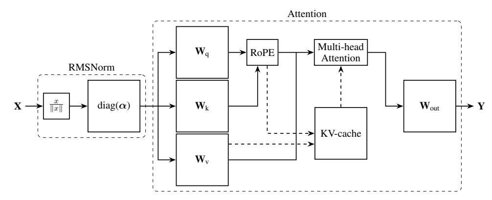
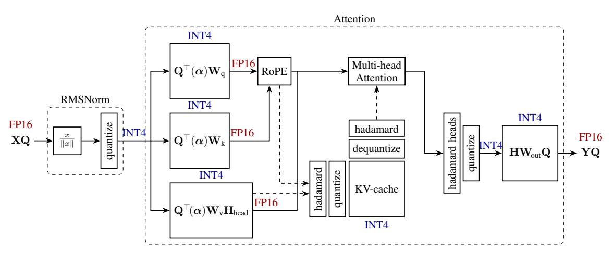
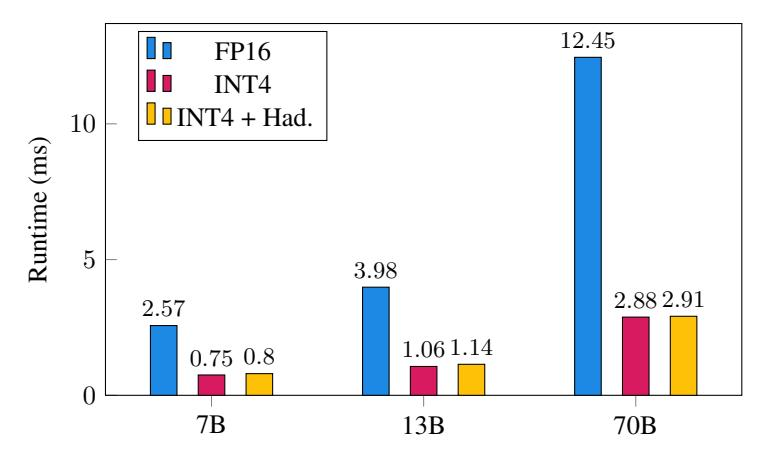

# References

- Marah Abdin, Sam Ade Jacobs, Ammar Ahmad Awan, Jyoti Aneja, Ahmed Awadallah, Hany Awadalla, Nguyen Bach, Amit Bahree, Arash Bakhtiari, Harkirat Behl, Alon Benhaim, Misha Bilenko, Johan Bjorck, Sébastien Bubeck, Martin Cai, Caio César Teodoro Mendes, Weizhu Chen, Vishrav Chaudhary, Parul Chopra, Allie Del Giorno, Gustavo de Rosa, Matthew Dixon, Ronen Eldan, Dan Iter, Amit Garg, Abhishek Goswami, Suriya Gunasekar, Emman Haider, Junheng Hao, Russell J. Hewett, Jamie Huynh, Mojan Javaheripi, Xin Jin, Piero Kauffmann, Nikos Karampatziakis, Dongwoo Kim, Mahoud Khademi, Lev Kurilenko, James R. Lee, Yin Tat Lee, Yuanzhi Li, Chen Liang, Weishung Liu, Eric Lin, Zeqi Lin, Piyush Madan, Arindam Mitra, Hardik Modi, Anh Nguyen, Brandon Norick, Barun Patra, Daniel Perez-Becker, Thomas Portet, Reid Pryzant, Heyang Qin, Marko Radmilac, Corby Rosset, Sambudha Roy, Olatunji Ruwase, Olli Saarikivi, Amin Saied, Adil Salim, Michael Santacroce, Shital Shah, Ning Shang, Hiteshi Sharma, Xia Song, Masahiro Tanaka, Xin Wang, Rachel Ward, Guanhua Wang, Philipp Witte, Michael Wyatt, Can Xu, Jiahang Xu, Sonali Yadav, Fan Yang, Ziyi Yang, Donghan Yu, Chengruidong Zhang, Cyril Zhang, Jianwen Zhang, Li Lyna Zhang, Yi Zhang, Yue Zhang, Yunan Zhang, and Xiren Zhou. Phi-3 technical report: A highly capable language model locally on your phone, 2024.
- Joshua Ainslie, James Lee-Thorp, Michiel de Jong, Yury Zemlyanskiy, Federico Lebrón, and Sumit Sanghai. Gqa: Training generalized multi-query transformer models from multi-head checkpoints. *arXiv preprint arXiv:2305.13245*, 2023.
- Saleh Ashkboos, Ilia Markov, Elias Frantar, Tingxuan Zhong, Xincheng Wang, Jie Ren, Torsten Hoefler, and Dan Alistarh. Towards end-to-end 4-bit inference on generative large language models. *arXiv preprint arXiv:2310.09259*, 2023.
- Saleh Ashkboos, Maximilian L Croci, Marcelo Gennari do Nascimento, Torsten Hoefler, and James Hensman. Slicegpt: Compress large language models by deleting rows and columns. *arXiv preprint arXiv:2401.15024*, 2024.
- Yonatan Bisk, Rowan Zellers, Ronan Le Bras, Jianfeng Gao, and Yejin Choi. Piqa: Reasoning about physical commonsense in natural language. In *Thirty-Fourth AAAI Conference on Artificial Intelligence*, 2020.
- Jerry Chee, Yaohui Cai, Volodymyr Kuleshov, and Christopher M De Sa. Quip: 2-bit quantization of large language models with guarantees. *Advances in Neural Information Processing Systems*, 36, 2024.
- Peter Clark, Isaac Cowhey, Oren Etzioni, Tushar Khot, Ashish Sabharwal, Carissa Schoenick, and Oyvind Tafjord. Think you have solved question answering? try arc, the ai2 reasoning challenge. *ArXiv*, abs/1803.05457, 2018. URL [https://api.semanticscholar.org/CorpusID:](https://api.semanticscholar.org/CorpusID:3922816) [3922816](https://api.semanticscholar.org/CorpusID:3922816).
- Tri Dao, Daniel Y. Fu, Stefano Ermon, Atri Rudra, and Christopher Ré. FlashAttention: Fast and memory-efficient exact attention with IO-awareness. In *Advances in Neural Information Processing Systems*, 2022.
- Tim Dettmers, Mike Lewis, Younes Belkada, and Luke Zettlemoyer. Gpt3. int8 (): 8-bit matrix multiplication for transformers at scale. *Advances in Neural Information Processing Systems*, 35: 30318–30332, 2022.
- Tim Dettmers, Ruslan Svirschevski, Vage Egiazarian, Denis Kuznedelev, Elias Frantar, Saleh Ashkboos, Alexander Borzunov, Torsten Hoefler, and Dan Alistarh. Spqr: A sparse-quantized representation for near-lossless llm weight compression. *arXiv preprint arXiv:2306.03078*, 2023.

- Vage Egiazarian, Andrei Panferov, Denis Kuznedelev, Elias Frantar, Artem Babenko, and Dan Alistarh. Extreme compression of large language models via additive quantization. *arXiv preprint arXiv:2401.06118*, 2024.
- Elias Frantar, Saleh Ashkboos, Torsten Hoefler, and Dan Alistarh. GPTQ: Accurate post-training quantization for generative pre-trained transformers. *arXiv preprint arXiv:2210.17323*, 2022.
- Leo Gao, Jonathan Tow, Stella Biderman, Sid Black, Anthony DiPofi, Charles Foster, Laurence Golding, Jeffrey Hsu, Kyle McDonell, Niklas Muennighoff, et al. A framework for few-shot language model evaluation. *Version v0. 0.1. Sept*, 2021.
- Coleman Hooper, Sehoon Kim, Hiva Mohammadzadeh, Michael W Mahoney, Yakun Sophia Shao, Kurt Keutzer, and Amir Gholami. Kvquant: Towards 10 million context length llm inference with kv cache quantization. *arXiv preprint arXiv:2401.18079*, 2024.
- Ji Lin, Jiaming Tang, Haotian Tang, Shang Yang, Xingyu Dang, and Song Han. Awq: Activationaware weight quantization for llm compression and acceleration. *arXiv preprint arXiv:2306.00978*, 2023.
- Zirui Liu, Jiayi Yuan, Hongye Jin, Shaochen Zhong, Zhaozhuo Xu, Vladimir Braverman, Beidi Chen, and Xia Hu. Kivi: A tuning-free asymmetric 2bit quantization for kv cache. *arXiv preprint arXiv:2402.02750*, 2024.
- Stephen Merity, Caiming Xiong, James Bradbury, and Richard Socher. Pointer sentinel mixture models, 2016.
- NVIDIA. Nvidia cutlass library, 2023. URL <https://github.com/NVIDIA/cutlass/>.
- Adam Paszke, Sam Gross, Francisco Massa, Adam Lerer, James Bradbury, Gregory Chanan, Trevor Killeen, Zeming Lin, Natalia Gimelshein, Luca Antiga, et al. PyTorch: An imperative style, high-performance deep learning library. *Advances in neural information processing systems*, 32, 2019.
- Alec Radford, Jeff Wu, Rewon Child, David Luan, Dario Amodei, and Ilya Sutskever. Language models are unsupervised multitask learners. 2019.
- Keisuke Sakaguchi, Ronan Le Bras, Chandra Bhagavatula, and Yejin Choi. Winogrande: An adversarial winograd schema challenge at scale. *Communications of the ACM*, 64(9):99–106, 2021.
- Wenqi Shao, Mengzhao Chen, Zhaoyang Zhang, Peng Xu, Lirui Zhao, Zhiqian Li, Kaipeng Zhang, Peng Gao, Yu Qiao, and Ping Luo. Omniquant: Omnidirectionally calibrated quantization for large language models. *arXiv preprint arXiv:2308.13137*, 2023.
- Ying Sheng, Lianmin Zheng, Binhang Yuan, Zhuohan Li, Max Ryabinin, Beidi Chen, Percy Liang, Christopher Ré, Ion Stoica, and Ce Zhang. Flexgen: High-throughput generative inference of large language models with a single gpu. In *International Conference on Machine Learning*, pages 31094–31116. PMLR, 2023.
- Neil J A Sloane. A library of hadamard matrices, 2024. URL [http://neilsloane.com/](http://neilsloane.com/hadamard/) [hadamard/](http://neilsloane.com/hadamard/).
- Jianlin Su, Yu Lu, Shengfeng Pan, Bo Wen, and Yunfeng Liu. Roformer: Enhanced transformer with rotary position embedding. *CoRR*, abs/2104.09864, 2021. URL [https://arxiv.org/abs/](https://arxiv.org/abs/2104.09864) [2104.09864](https://arxiv.org/abs/2104.09864).
- Hugo Touvron, Louis Martin, Kevin Stone, Peter Albert, Amjad Almahairi, Yasmine Babaei, Nikolay Bashlykov, Soumya Batra, Prajjwal Bhargava, Shruti Bhosale, Dan Bikel, Lukas Blecher, Cristian Canton Ferrer, Moya Chen, Guillem Cucurull, David Esiobu, Jude Fernandes, Jeremy Fu, Wenyin Fu, Brian Fuller, Cynthia Gao, Vedanuj Goswami, Naman Goyal, Anthony Hartshorn, Saghar Hosseini, Rui Hou, Hakan Inan, Marcin Kardas, Viktor Kerkez, Madian Khabsa, Isabel Kloumann, Artem Korenev, Punit Singh Koura, Marie-Anne Lachaux, Thibaut Lavril, Jenya Lee, Diana Liskovich, Yinghai Lu, Yuning Mao, Xavier Martinet, Todor Mihaylov, Pushkar Mishra,

- Igor Molybog, Yixin Nie, Andrew Poulton, Jeremy Reizenstein, Rashi Rungta, Kalyan Saladi, Alan Schelten, Ruan Silva, Eric Michael Smith, Ranjan Subramanian, Xiaoqing Ellen Tan, Binh Tang, Ross Taylor, Adina Williams, Jian Xiang Kuan, Puxin Xu, Zheng Yan, Iliyan Zarov, Yuchen Zhang, Angela Fan, Melanie Kambadur, Sharan Narang, Aurelien Rodriguez, Robert Stojnic, Sergey Edunov, and Thomas Scialom. Llama 2: Open foundation and fine-tuned chat models, 2023.
- Albert Tseng, Jerry Chee, Qingyao Sun, Volodymyr Kuleshov, and Christopher De Sa. Quip#: Even better llm quantization with hadamard incoherence and lattice codebooks. *arXiv preprint arXiv:2402.04396*, 2024.
- Xiuying Wei, Yunchen Zhang, Xiangguo Zhang, Ruihao Gong, Shanghang Zhang, Qi Zhang, Fengwei Yu, and Xianglong Liu. Outlier suppression: Pushing the limit of low-bit transformer language models. *Advances in Neural Information Processing Systems*, 35:17402–17414, 2022.
- Thomas Wolf, Lysandre Debut, Victor Sanh, Julien Chaumond, Clement Delangue, Anthony Moi, Pierric Cistac, Tim Rault, Rémi Louf, Morgan Funtowicz, et al. Huggingface's transformers: State-of-the-art natural language processing. *arXiv preprint arXiv:1910.03771*, 2019.
- Haocheng Xi, Changhao Li, Jianfei Chen, and Jun Zhu. Training transformers with 4-bit integers. *Advances in Neural Information Processing Systems*, 36:49146–49168, 2023.
- Guangxuan Xiao, Ji Lin, Mickael Seznec, Hao Wu, Julien Demouth, and Song Han. Smoothquant: Accurate and efficient post-training quantization for large language models. In *International Conference on Machine Learning*, pages 38087–38099. PMLR, 2023.
- Zihao Ye. FlashInfer: Kernel Library for LLM Serving. [https://github.com/flashinfer-ai/](https://github.com/flashinfer-ai/flashinfer) [flashinfer](https://github.com/flashinfer-ai/flashinfer), 2023.
- Rowan Zellers, Ari Holtzman, Yonatan Bisk, Ali Farhadi, and Yejin Choi. Hellaswag: Can a machine really finish your sentence? *arXiv preprint arXiv:1905.07830*, 2019.
- Yilong Zhao, Chien-Yu Lin, Kan Zhu, Zihao Ye, Lequn Chen, Size Zheng, Luis Ceze, Arvind Krishnamurthy, Tianqi Chen, and Baris Kasikci. Atom: Low-bit quantization for efficient and accurate llm serving. *arXiv preprint arXiv:2310.19102*, 2023.

### A Appendix

#### A.1 OuaRot on the Attention Module

Figure 5 shows the original attention module in large language models with RoPE. The input of the attention module is already rotated using the randomized Hadamard matrix **Q** (see Section 4) and in the first step, we fuse the inverse of such matrices into the input linear layers of the attention. In the next step, we fuse the exact Hadamard matrices on each block of the columns (proportional to each head) on the V\_projection layer to make sure that the Values will be rotated at the output of that layer. In the next step, we apply exact Hadamard transformations on the Keys and Queries and quantize the KV after RoPE operation (note that the Keys and Queries Hadamard transformations will be canceled during the attention operation). Finally, we apply another Hadamard transformation between heads before Out\_projection layer and fuse the inverse into the weights. Figure 6 shows the result of applying QuaRot on the attention module.

Figure 5: Flow diagram of a self-attention block as used in most LMs, including the pre-positioned RMSNorm. Solid arrows represent flow during training, prefill and inference of each token. Dashed arrows show access to and from the KV cache, used at generation-time. The RoPE block computes relative positional embeddings.

Figure 6: QuaRot applied to an attention component. The RMSNorm scaling  $\alpha$  is absorbed into the input weight matrices, and the hidden state has been rotated by  $\mathbf{Q}$  in the same way as for the FFN block (see previous figure). Colored labels show the bit-width of each flow, and dashed lines show the flow to/from the KV cache.

#### A.2 Clipping Ratio Ablation

We use the clipping ratio for both weights and activations during the quantization. During the weight quantization, we apply a linear search over the MSE error to extract the best clipping ratio for each

column of the weight matrix. However, this is not possible as we quantize the inputs on the fly during the inference and we need to use a constant clipping ratio for such quantization. We conclude that using 0.95 and 0.9 are suitable during asymmetric (KV cache) and symmetric (inputs) quantization which matches the finding from [\[Zhao et al.,](#page-11-0) [2023\]](#page-11-0).

Table 5: WikiText perplexity of LLAMA2-7B with different clipping ratio. To study the effect of various clipping ratios, we keep the rest of the model in full precision.

|                       | 1.0   | 0.95  | 0.9   | 0.85  |
|-----------------------|-------|-------|-------|-------|
| Input Quantization    | 5.938 | 5.910 | 5.828 | 5.850 |
| KV Cache Quantization | 5.513 | 5.510 | 5.517 | 5.532 |

#### A.3 KV Cache Quantization Ablation

We keep the rest of the model (including weights and activations) in high precision and apply our group-wise asymmetric quantization (with group-size 128) with various precision to keys and values. Table [6](#page-13-2) shows the results of using various precision during KV cache quantization. The results show a negligible (at most 0.21) perplexity degradation up to 3-bit KV cache (0.07 for LLAMA2-70B model). In addition, by comparing the 3 and 4-bit quantization, we can see that compared to the values, keys are more sensitive to quantization as keeping the keys in 4-bits and values in 3-bits has 0.03 perplexity loss (0.18 for 3-bit keys and 4-bit values) on the LLAMA2-7B model. This matches the previous study on KV cache quantization [\[Hooper et al.,](#page-10-4) [2024,](#page-10-4) [Liu et al.,](#page-10-5) [2024\]](#page-10-5). The results show that using 3-bit KV-caches results in a better accuracy (5.68 on LLAMA2-7B model) compared to keeping the keys in 4-bits and quantizing the values using 2-bits (with 5.75 perplexity on LLAMA2-7B model).

Table 6: WikiText-2 perplexity with various KV cache precision using QuaRot.

| K bits | V bits |      | LLAMA-2 |      |
|--------|--------|------|---------|------|
|        |        | 7B   | 13B     | 70B  |
| 16     | 16     | 5.47 | 4.88    | 3.32 |
| 4      | 4      | 5.51 | 4.91    | 3.33 |
| 4      | 3      | 5.54 | 4.93    | 3.35 |
| 4      | 2      | 5.75 | 5.09    | 3.43 |
| 3      | 4      | 5.65 | 5.01    | 3.38 |
| 3      | 3      | 5.68 | 5.02    | 3.39 |
| 3      | 2      | 5.93 | 5.21    | 3.48 |
| 2      | 4      | 8.06 | 6.42    | 3.89 |
| 2      | 3      | 8.18 | 6.50    | 3.92 |
| 2      | 2      | 9.23 | 7.07    | 4.13 |

### A.4 Weight-only Quantization Ablation

QuaRot improves the quality of quantized models by removing the outlier features during the Hadamard transformations. As we fuse the Hadamard matrices into the weights, we study the role of these transformations for weight-only quantization (we keep the rest of the data-types in FP16). Table [7](#page-14-3) shows the WikiText-2 perplexity results with asymmetric quantization. Using GPTQ quantization, QuaRot improves the perplexity by up to 2.65 in 4 bits. In addition, applying QuaRot improves the quality more in lower precision (2-3 bits) in all models. QuaRot also improves the RTN quantization up to 0.24 perplexity points. GPTQ still has a lower perplexity in 2-3 bits. However, applying QuaRot improves the quality of GPTQ in 2 bits to a non-trivial value (5.6 on the LLAMA2-70B model).

Table 7: Weight-only quantization results on WikiText-2 on LLAMA-2 models. We use asymmetric per-column quantization and keep the inputs and KV cache in FP16. We show the perplexity results >100 by Inf. We show the failed GPTQ experiments using NaN.

| Method                    |              | 7B          |              |              |               | LLAMA-2 13B |              |               | 70B          |  |  |
|---------------------------|--------------|-------------|--------------|--------------|---------------|----------------|--------------|---------------|--------------|--|--|
| Baseline                  |              | 5.47        |              |              | 4.88          |                |              | 3.32          |              |  |  |
|                           | A16W4        | A16W3       | A16W2        | A16W4        | A16W3         | A16W2          | A16W4        | A16W3         | A16W2        |  |  |
| RTN GPTO               | 6.99 8.25 | Inf NaN  | Inf NaN   | 6.32 5.65 | Inf 9.51   | Inf Inf     | 4.45 3.87 | 42.11 5.91 | Inf 25.30 |  |  |
| QuaRot-RTN QuaRot-GPTQ | 6.76 5.60 | Inf 6.09 | Inf 22.07 | 5.48 5.00 | 48.89 5.37 | Inf 10.41   | 3.66 3.41 | 5.25 3.72  | Inf 5.60  |  |  |

#### A.5 Random Orthogonal Matrices Ablation

QuaRot fuses Hadamard transformations into weight matrices to eliminate outliers. However, due to the computational invariance property in LLMs, any orthogonal matrix can be fused to the model and we only need to apply an online  $1\frac{1}{2}$  Hadamard transformations in each layer (see Section 4). Here, we study the use of random orthogonal matrices in QuaRot. We start with a uniformly random matrix and apply QR decomposition to make it orthogonal before fusing it into the weights.

Table 8: WikiText-2 perplexity of 4-bit QuaRot on LLAMA-2 models with different orthogonal matrices.

| Method                               | LLAMA-2      |              |              |  |  |  |
|--------------------------------------|--------------|--------------|--------------|--|--|--|
| Method                               | 7B           | 13B          | 70B          |  |  |  |
| Baseline                             | 5.47         | 4.88         | 3.32         |  |  |  |
| QuaRot (Random) QuaRot (Hadamard) | 7.45 6.10 | 5.84 5.40 | 4.07 3.79 |  |  |  |

Table 8 shows the results of applying random orthogonal matrices on LLAMA-2 models. Random orthogonal matrices are not as good as random Hadamard transformations and we have up 1.35 perplexity gap on LLAMA2-7B . However, as the model size increases, the gap decreases, resulting in a perplexity change of 0.28 in the LLAMA2-70B model. Note that using the above matrices does not change the computation as we still use a fast Hadamard kernel for the down-projection and out-projection layers.

### A.6 Round-to-Nearest Weight Quantization: Detailed Results

Table 9 shows the detailed results of QuaRot with GPTQ and round-to-nearest (RTN) weight quantization for both 6 and 8 bits on various tasks for LLAMA-2 models.

#### A.7 FP16 Hadamard Transformation Ablation

We use FP32 online Hadamard transformation across all our experiments. Table 10 shows the results of using FP16 Hadamard transformation during the inference (for *down-projection* and *out-projection* layers). On LLAMA2-7B model, the results show <0.1 perplexity change on WikiText-2 and <0.6% averaged accuracy change on the zero-shot tasks, which we consider as noise. On LLAMA2-13B model, different Hadamard precisions have the same perplexities with 0.07% difference in the averaged zero-shot results. We conclude that the model will not be changed using different Hadamard precision.

Table 9: WikiText-2 Perplexity and zero-shot accuracy of QuaRot on the LLAMA-2 family using 4, 6 and 8-bits with GPTQ and RTN weight quantization and RTN activation quantization. For zero-shot tasks, we use PIQA (PQ), WinoGrande (WG), HellaSwag (HS), Arc-Easy (A-e), Arc-Challenge (A-c), and LAMBADA (LA).The Precision column shows the bitwidth for all inputs, weights, and KV-caches.

| Model | Method      | Precision    | PPL ↓        | PQ ↑           | WG ↑           | HS ↑           | A-e ↑          | A-c ↑          | LA ↑           | Avg. ↑         |
|-------|-------------|--------------|--------------|----------------|----------------|----------------|----------------|----------------|----------------|----------------|
|       | Baseline    | FP16         | 5.47         | 79.11          | 69.06          | 75.99          | 74.58          | 46.25          | 73.90          | 69.82          |
|       | QuaRot-RTN  | INT4 INT6 | 8.37 5.56 | 72.09 78.73 | 60.69 67.80 | 65.40 75.92 | 58.88 74.16 | 35.24 46.08 | 57.27 73.86 | 58.26 69.42 |
| 7B    | INT8        | 5.50         | 78.94        | 68.67          | 75.80          | 74.79          | 45.39          | 74.33          | 69.65          |                |
|       |             | INT4         | 6.10         | 76.77          | 63.77          | 72.16          | 69.87          | 40.87          | 70.39          | 65.64          |
|       | QuaRot-GPTQ | INT6 INT8 | 5.52 5.50 | 78.45 78.94 | 69.46 68.90 | 75.60 75.79 | 74.45 74.66 | 46.50 46.16 | 74.19 74.44 | 69.77 69.81 |
|       | Baseline    | FP16         | 4.88         | 80.47          | 72.22          | 79.39          | 77.48          | 49.23          | 76.75          | 72.59          |
|       |             | INT4         | 6.09         | 77.37          | 67.32 72.22 | 73.11 79.10 | 70.83 77.27 | 43.69 50.34 | 70.66 76.75 | 67.16 72.56 |
| 13B   | QuaRot-RTN  | INT6 INT8 | 4.95 4.90 | 79.65 80.52 | 71.59          | 79.38          | 77.31          | 49.32          | 76.63          | 72.46          |
|       |             | INT4         | 5.40         | 78.89          | 70.24          | 76.37          | 72.98          | 46.59          | 73.67          | 69.79          |
|       | QuaRot-GPTQ | INT6 INT8 | 4.92 4.90 | 79.98 80.36 | 72.69 71.98 | 79.17 79.38 | 77.78 77.31 | 49.74 49.15 | 76.27 76.79 | 72.60 72.49 |
|       | Baseline    | FP16         | 3.32         | 82.70          | 77.98          | 83.84          | 80.98          | 57.34          | 79.58          | 77.07          |
|       |             | INT4         | 4.14         | 80.69          | 75.14 77.90 | 79.63 83.47 | 77.57 80.93 | 51.71 58.28 | 77.02 79.41 | 73.63 77.21 |
| 70B   | QuaRot-RTN  | INT6 INT8 | 3.36 3.33 | 83.24 82.97 | 77.98          | 83.67          | 80.77          | 58.11          | 79.53          | 77.17          |
|       |             | INT4         | 3.79         | 82.43          | 76.24          | 81.82          | 80.43          | 56.23          | 78.73          | 75.98          |
|       | QuaRot-GPTQ | INT6 INT8 | 3.35 3.33 | 82.13 83.13 | 77.66 78.06 | 83.63 83.72 | 80.89 80.85 | 57.08 58.19 | 79.70 79.72 | 77.02 77.28 |

Table 10: Ablation on the precision of online Hadamard transformations for QuaRot. We use WikiText-2 perplexity as well as zero-shot tasks, explained in Section [5.3.](#page-8-2)

| Model | Method   | Hadamard Precision | PPL ↓        | PQ ↑           | WG ↑           | HS ↑           | A-e ↑          | A-c ↑          | LA ↑           | Avg. ↑         |
|-------|----------|-----------------------|--------------|----------------|----------------|----------------|----------------|----------------|----------------|----------------|
|       | Baseline | -                     | 5.47         | 79.11          | 69.06          | 75.99          | 74.58          | 46.25          | 73.90          | 69.82          |
| 7B    | QuaRot   | FP32 FP16          | 6.10 6.08 | 76.77 76.99 | 63.77 66.46 | 72.16 72.59 | 69.87 69.07 | 40.87 41.21 | 70.39 70.59 | 65.64 66.21 |
|       | Baseline | -                     | 4.88         | 80.47          | 72.22          | 79.39          | 77.48          | 49.23          | 76.75          | 72.59          |
| 13B   | QuaRot   | FP32 FP16          | 5.40 5.40 | 78.89 77.69 | 70.24 70.09 | 76.37 75.75 | 72.98 73.95 | 46.59 47.61 | 73.67 73.22 | 69.79 69.72 |

#### A.8 LLAMA-3 Results

In this section, we show the accuracy of applying QuaRot for quantizing the LLAMA3-8B and LLAMA3-70B models. Table [11](#page-16-1) shows the WikiText-2 perplexity of quantizing the LLAMA-3 models with QuaRot using 4-bit quantization. Compared to Table [1,](#page-7-0) we conclude that LLAMA-3 is more sensitive to quantization as we can see a higher gap between the quantized and FP16 models. Table [12](#page-16-2) shows the accuracy results of those models on zero-shot tasks.

Table 11: WikiText-2 perplexity results on 4-bit quantization of LLAMA-3 models with 2048 sequence length. 128G shows the group-wise quantization with group size 128.

| Method      | Weight Quantization | #Outlier Features | 8B   | LLAMA-3 70B |
|-------------|------------------------|----------------------|------|----------------|
| Baseline    | -                      | -                    | 6.14 | 2.86           |
| QuaRot      | GPTQ                   | 0                    | 8.16 | 6.66           |
| QuaRot-128G | GPTQ-128G              | 0                    | 7.36 | 5.51           |

Table 12: Zero-shot accuracy of LLAMA-3 models with 4-bit QuaRot on PIQA (PQ), WinoGrande (WG), HellaSwag (HS), Arc-Easy (A-e), Arc-Challenge (A-c), and LAMBADA (LA).

| Model      | Method | PQ    | WG    | HS    | A-e   | A-c   | LA    | Avg.  |
|------------|--------|-------|-------|-------|-------|-------|-------|-------|
| LLAMA3-8B  | FP16   | 80.74 | 72.77 | 79.06 | 77.82 | 53.33 | 75.63 | 73.22 |
|            | QuaRot | 75.14 | 65.82 | 72.94 | 68.01 | 43.34 | 65.81 | 65.18 |
| LLAMA3-70B | FP16   | 84.66 | 80.51 | 84.89 | 85.86 | 64.25 | 79.47 | 79.94 |
|            | QuaRot | 78.07 | 69.30 | 77.33 | 73.44 | 47.53 | 69.57 | 69.21 |

### A.9 Phi-3-mini-4k-instruct Results

In this section, we show the accuracy of applying QuaRot for quantizing the Phi-3-mini-4k-instruct model [\[Abdin et al.,](#page-9-9) [2024\]](#page-9-9). Table [13](#page-16-3) shows the accuracy results of the model in terms of perplexity and on zero-shot tasks.

Table 13: WikiText-2 Perplexity and zero-shot accuracy of QuaRot on the Phi-3-mini-4k-instruct model (revision = ff07dc01) using 4, 6 and 8-bits with GPTQ and RTN weight quantization and RTN activation quantization. For zero-shot tasks, we use PIQA (PQ), WinoGrande (WG), HellaSwag (HS), Arc-Easy (A-e), Arc-Challenge (A-c), and LAMBADA (LA).

| Model      | Method      | Precision            | PPL ↓                 | PQ ↑                    | WG ↑                    | HS ↑                    | A-e ↑                   | A-c ↑                   | LA ↑                    | Avg. ↑                  |
|------------|-------------|----------------------|-----------------------|-------------------------|-------------------------|-------------------------|-------------------------|-------------------------|-------------------------|-------------------------|
| Phi-3-mini | Baseline    | FP16                 | 6.35                  | 80.47                   | 73.72                   | 78.45                   | 80.13                   | 57.51                   | 68.37                   | 73.11                   |
|            | QuaRot-RTN  | INT4 INT6 INT8 | 11.69 6.78 6.58 | 68.39 79.54 79.71 | 58.64 73.01 74.11 | 60.60 77.46 78.63 | 65.87 79.21 80.47 | 39.25 55.12 56.66 | 43.99 67.53 68.56 | 56.12 71.98 73.02 |
|            | QuaRot-GPTQ | INT4 INT6 INT8 | 7.85 6.63 6.58  | 75.35 79.54 80.25 | 67.88 72.69 74.19 | 72.95 78.50 78.54 | 72.98 79.42 80.35 | 48.12 56.74 57.08 | 60.78 68.85 68.64 | 66.34 72.67 73.18 |

### A.10 Performance Analysis

We implement the attention mechanism using three routines: 1) Init: During the prefill stage, this routine initializes the cache from all the key and value vectors in the prefill. The attention output during prefill is computed directly using Flash Attention [\[Dao et al.,](#page-9-5) [2022\]](#page-9-5) since we already have access to dequantized keys and values. 2) Append: During decoding, this routine is called first to quantize the current keys and values and append them to the cache. 3) Decode: Finally, this routine is called during decoding with the current query vector. The routine computes the attention output using a quantized implementation of flash attention which can load the quantized cache and compute the final value vector.

4-bit Linear and Attention Layers. We benchmark our 4-bit linear layer which involves 4-bit matrix multiplication. For a given input of FP16, the layer optionally computes the Hadamard operation, then calls the quantization kernel to quantize and save the input in a sub-byte format. In the next step, the quantized weights and input are passed to the CUTLASS 4-bit GEMM kernel. Finally, the output is dequantized and cast back to FP16. Figure [7](#page-17-0) shows the speedup of our 4-bit layer for different layer sizes where the layer sizes match the FFN linear layer sizes in LLAMA-2 models.

Figure 7: Performance of 16-bit and 4-bit linear layer for 2048 sequence lengths with and without online Hadamard transformation on a NVIDIA RTX 3090 GPU, averaged over 1000 runs. The matrix sizes correspond to the linear layer sizes in LLAMA-2 FFN blocks (i.e. Wdown). Here the batch size is 1, but the performance ratio holds for larger batches (see Table [14\)](#page-18-0).

Our 4-bit linear layer gets 3.2x speedup relative to FP16 in the LLAMA2-7B model, and 4.3x on the LLAMA2-70B model. These numbers are for a batch size of 1, we find that scaling is approximately linear with batch size: more results in Table [14.](#page-18-0) We include the runtime with and without Hadamard operations, as Wup and Wgate do not require Hadamard transforms, whilst Wdown does. We see that the Hadamard transform adds very little overhead to the forward pass at most 7% overhead.

We also compare the speed of performing append and decode routines for a single token given a cache of size 2047. This is equivalent to the cost of decoding the 2048-th token in a sequence. The comparison between the speed of FP16 and INT4 for different batch sizes and layer sizes is reported in Table [15.](#page-19-0) For the layer size used in LLAMA2-7B , our 4-bit implementation gets up to 1.72x improvement in speed for the larger batch sizes (e.g. from 16 onwards). The 4-bit cache is slower than FP16 for smaller batch sizes (e.g. up to 8). Note that this is intuitive as the main benefit of the 4-bit cache is reducing the I/O cost. A speed up is only visible if this reduction is more significant than the quantization overhead which happens for either larger batch sizes or longer sequences.

Table [14](#page-18-0) shows the results of benchmarking our 4-bit linear layer. The layer sizes are extracted based on the linear layer sizes in LLAMA-2 models (for out-projection and down-projections). We apply both FP16 and FP32 Hadamard transformations and show the runtime on NVIDIA RTX GPU using 2048 sequence lengths. Table [15](#page-19-0) shows the results of decoding a single token in the attention layer when we apply KV-cache quantization. We extract the size of the attention layer based on the LLAMA-2 models.

| Layer Size | Batch Size | FP16    | INT4   | INT4 + FP32 Had | INT4 + FP16 Had |
|------------|------------|---------|--------|-----------------|-----------------|
|            | 1          | 1.043   | 0.370  | 0.409           | 0.403           |
| 4096x4096  | 2          | 1.902   | 0.696  | 0.790           | 0.789           |
|            | 4          | 3.715   | 1.361  | 1.522           | 1.529           |
|            | 8          | 7.200   | 2.675  | 2.999           | 3.011           |
|            | 16         | 14.508  | 5.357  | 5.973           | 5.976           |
|            | 32         | 29.029  | 10.641 | 11.900          | 11.911          |
|            | 1          | 1.418   | 0.464  | 0.552           | 0.547           |
|            | 2          | 2.918   | 0.937  | 1.100           | 1.097           |
|            | 4          | 5.852   | 1.888  | 2.206           | 2.207           |
| 5120x5120  | 8          | 11.465  | 3.809  | 4.428           | 4.422           |
|            | 16         | 22.807  | 7.547  | 8.755           | 8.759           |
|            | 32         | 45.312  | 15.019 | 17.417          | 17.440          |
|            | 1          | 3.696   | 0.997  | 1.084           | 1.083           |
|            | 2          | 7.191   | 1.944  | 2.099           | 2.099           |
|            | 4          | 14.236  | 3.918  | 4.208           | 4.207           |
| 8192x8192  | 8          | 28.508  | 7.944  | 8.460           | 8.415           |
|            | 16         | 57.814  | 15.793 | 16.859          | 16.871          |
|            | 32         | 115.462 | 31.693 | 33.780          | 33.791          |
|            | 1          | 2.569   | 0.749  | 0.798           | 0.801           |
|            | 2          | 5.027   | 1.478  | 1.555           | 1.558           |
|            | 4          | 9.752   | 2.990  | 3.140           | 3.144           |
| 11008x4096 | 8          | 19.696  | 6.031  | 6.296           | 6.306           |
|            | 16         | 38.883  | 11.978 | 12.503          | 12.527          |
|            | 32         | 78.320  | 23.874 | 24.935          | 24.974          |
|            | 1          | 3.983   | 1.063  | 1.142           | 1.139           |
|            | 2          | 7.869   | 2.148  | 2.291           | 2.293           |
|            | 4          | 15.410  | 4.340  | 4.616           | 4.614           |
| 13824x5120 | 8          | 30.761  | 8.719  | 9.231           | 9.240           |
|            | 16         | 61.203  | 17.318 | 18.345          | 18.343          |
|            | 32         | 122.926 | 34.816 | 36.953          | 36.940          |
|            | 1          | 12.450  | 2.881  | 2.911           | 2.911           |
|            | 2          | 25.391  | 5.828  | 5.892           | 5.896           |
|            | 4          | 50.742  | 11.938 | 11.947          | 11.976          |
| 28672x8192 | 8          | 101.290 | 24.186 | 24.202          | 24.216          |
|            | 16         | 202.909 | 48.238 | 48.325          | 48.356          |
|            | 32         | 406.344 | 96.761 | 97.044          | 96.892          |

Table 14: Performance of 4-bit linear layer for 2048 sequence lengths with and without online Hadamard transformation on a NVIDIA RTX 3090 GPU. The matrix sizes correspond to the linear layer sizes in LLAMA-2 models. We averaged over 100 runs and report the numbers in milliseconds.

| head_num x head_dim | Batch Size | FP16  | INT4  | INT4 + FP32 Had | INT4 + FP16 Had |
|---------------------|------------|-------|-------|-----------------|-----------------|
|                     | 1          | 0.713 | 1.033 | 1.163           | 1.117           |
|                     | 2          | 0.723 | 1.035 | 1.168           | 1.122           |
| 32x128              | 4          | 0.781 | 1.033 | 1.168           | 1.118           |
|                     | 8          | 0.984 | 1.042 | 1.173           | 1.126           |
|                     | 16         | 1.348 | 1.018 | 1.153           | 1.102           |
|                     | 32         | 2.098 | 1.168 | 1.247           | 1.216           |
|                     | 1          | 0.712 | 1.026 | 1.157           | 1.106           |
|                     | 2          | 0.726 | 1.035 | 1.173           | 1.121           |
| 40x128              | 4          | 0.831 | 1.038 | 1.166           | 1.115           |
|                     | 8          | 1.065 | 1.048 | 1.181           | 1.128           |
|                     | 16         | 1.525 | 1.021 | 1.153           | 1.102           |
|                     | 32         | 2.480 | 1.244 | 1.320           | 1.287           |
|                     | 1          | 0.715 | 1.028 | 1.160           | 1.108           |
|                     | 2          | 0.780 | 1.034 | 1.171           | 1.117           |
| 64x128              | 4          | 0.984 | 1.034 | 1.171           | 1.120           |
|                     | 8          | 1.361 | 1.048 | 1.182           | 1.130           |
|                     | 16         | 2.071 | 1.147 | 1.223           | 1.192           |
|                     | 32         | 3.563 | 1.566 | 1.645           | 1.612           |

Table 15: Performance of decoding a single token with 4-bit KV cache for the attention layer for 2048 sequence lengths with and without online Hadamard transformation on an NVIDIA RTX 3090 GPU. We evaluate generating the last token when the 2047 tokens are already cached in the attention. We extract the number of heads (head\_num) and their dimensions (head\_dim) based on different LLAMA-2 models. We averaged over 100 runs to report the numbers in milliseconds.

Tables [16](#page-19-1) and [17](#page-20-0) show the detailed speedups and memory saving of a single transformer block for QuaRot on LLAMA2-7B model using NVIDIA RTX 3090 GPU.

| Model      | Batch Size         | Speedup                          |  |
|------------|--------------------|----------------------------------|--|
| LLAMA2-7B  | 1 4 16 32 | 1.97× 2.06× 2.11× 2.14× |  |
|            | 64                 | 2.16×                            |  |
| LLAMA2-70B | 1 4 16 32 | 3.16× 3.27× 3.32× 3.33× |  |

Table 16: Time-to-first-token (prefill) speedup of each transformation block of LLAMA-2 models in QuaRot (over the FP16 model) on NVIDIA RTX 3090 GPU. We use 2048 sequence lengths with different batch sizes.

| Model      | Batch Size | Sequence Length | Baseline (GB) | QuaRot (GB) | Saving Factor |
|------------|---------------|--------------------|------------------|----------------|------------------|
|            | 1             | 256                | 0.392GB          | 0.108GB        | 3.63×            |
|            |               | 512                | 0.396GB          | 0.108GB        | 3.66×            |
|            |               | 1024               | 0.404GB          | 0.110GB        | 3.66×            |
|            |               | 2048               | 0.419GB          | 0.114GB        | 3.67×            |
| LLAMA2-7B  |               | 4096               | 0.451GB          | 0.125GB        | 3.60×            |
|            | 16            | 256                | 0.464GB          | 0.128GB        | 3.63×            |
|            |               | 512                | 0.528GB          | 0.144GB        | 3.66×            |
|            |               | 1024               | 0.655GB          | 0.177GB        | 3.70×            |
|            |               | 2048               | 0.908GB          | 0.244GB        | 3.72×            |
|            |               | 4096               | 1.416GB          | 0.378GB        | 3.75×            |
|            | 1             | 256                | 1.605GB          | 0.409GB        | 3.92×            |
|            |               | 512                | 1.606GB          | 0.409GB        | 3.92×            |
|            |               | 1024               | 1.608GB          | 0.410GB        | 3.92×            |
|            |               | 2048               | 1.612GB          | 0.411GB        | 3.92×            |
| LLAMA2-70B |               | 4096               | 1.620GB          | 0.413GB        | 3.92×            |
|            | 16            | 256                | 1.626GB          | 0.418GB        | 3.89×            |
|            |               | 512                | 1.642GB          | 0.422GB        | 3.89×            |
|            |               | 1024               | 1.674GB          | 0.430GB        | 3.89×            |
|            |               | 2048               | 1.738GB          | 0.447GB        | 3.89×            |
|            |               | 4096               | 1.865GB          | 0.480GB        | 3.89×            |

Table 17: Peak Memory usage (in GB) for decoding a single token on a single transformation block of LLAMA-2 models with KV caches of different lengths and with different batch size.