# Quamba2: A Robust and Scalable Post-training Quantization Framework for Selective State Space Models

Hung-Yueh Chiang1 , Chi-Chih Chang2 , Natalia Frumkin1 , Kai-Chiang Wu3 , Mohamed S. Abdelfattah2 , and Diana Marculescu1

1 Chandra Family Department of Electrical and Computer Engineering, The University of Texas at Austin

2 Department of Electrical and Computer Engineering, Cornell University

3 Department of Computer Science, National Yang Ming Chiao Tung University {hungyueh.chiang, nfrumkin, dianam}@utexas.edu, {cc2869, mohamed}@cornell.edu, kcw@cs.nycu.edu.tw

#### Abstract

State Space Models (SSMs) are emerging as a compelling alternative to Transformers because of their consistent memory usage and high performance. Despite this, scaling up SSMs on cloud services or limited-resource devices is challenging due to their storage requirements and computational power. To overcome this, quantizing SSMs with low bit-width data formats can reduce model size and benefit from hardware acceleration. As SSMs are prone to quantization-induced errors, recent efforts have focused on optimizing a particular model or bit-width for efficiency without sacrificing performance. However, distinct bit-width configurations are essential for different scenarios, like W4A8 for boosting large-batch decoding speed, and W4A16 for enhancing generation speed in short prompt applications for a single user. To this end, we present Quamba2, compatible with W8A8, W4A8, and W4A16 for both Mamba1 and Mamba2 backbones, addressing the growing demand for SSM deployment on various platforms. Based on the channel order preserving and activation persistence of SSMs, we propose an offline approach to quantize inputs of a linear recurrence in 8-bit by sorting and clustering for input , combined with a per-state-group quantization for input-dependent parameters and . To ensure computeinvariance in the SSM output, we rearrange weights offline according to the clustering sequence. The experiments show that Quamba2-8B outperforms two state-of-the-art SSM quantization methods and delivers 1.3× and 3× speed-ups in the pre-filling and generation stages, respectively, while offering 4× memory reduction with only a 1.6% average accuracy drop. The evaluation on MMLU shows the generalizability and robustness of our framework. The code and quantized models will be released at: <https://github.com/enyac-group/Quamba>.

### 1 Introduction

State Space Models (SSMs) [\[Gu et al.,](#page-11-0) [2020,](#page-11-0) [Smith et al.,](#page-12-0) [2023,](#page-12-0) [Gu and Dao,](#page-11-1) [2024,](#page-11-1) [Dao and Gu,](#page-10-0) [2024\]](#page-10-0), offering constant memory complexity, are emerging as efficient alternatives to Transformers [\[Vaswani,](#page-12-1) [2017\]](#page-12-1) in various areas such as language modeling [\[Wang et al.,](#page-12-2) [2024,](#page-12-2) [Waleffe et al.,](#page-12-3) [2024\]](#page-12-3), vision [\[Zhu et al.,](#page-13-0) [2024a,](#page-13-0) [Liu et al.,](#page-11-2) [2024a,](#page-11-2) [Li et al.,](#page-11-3) [2025\]](#page-11-3), and audio [\[Goel et al.,](#page-11-4) [2022,](#page-11-4) [Saon et al.,](#page-12-4) [2023\]](#page-12-4). Some studies expand the size of the models and demonstrate their performance on par with Transformers of the same scale [\[Lieber et al.,](#page-11-5) [2024,](#page-11-5) [Team et al.,](#page-12-5) [2024,](#page-12-5) [Waleffe et al.,](#page-12-3) [2024\]](#page-12-3). However, the large size of SSMs limits the hardware options and increases the deployment costs.

Post-training quantization (PTQ) offers an attractive solution to efficient deployment by eliminating the needs of fine-tuning large models. PTQ reduces the bit-width of pre-trained weights and activations to lower-bit formats (such as 8-bit), cutting down memory use for weight storage and leveraging advanced hardware units. Recent studies [\[Xu et al.,](#page-13-1) [2025,](#page-13-1) [Chiang](#page-10-1) [et al.,](#page-10-1) [2025\]](#page-10-1) reveal that quantization techniques that are effective in Transformers struggle with SSMs due to the sensitivity of linear recurrence to quantization-induced errors. This prior work introduces PTQ algorithms tailored for SSMs to bridge

Table 1: (Supported models.) Our framework supports W8A8, W4A8, and W4A16 for both Mamba1 [\[Gu and Dao,](#page-11-1) [2024\]](#page-11-1) and Mamba2 [\[Dao and Gu,](#page-10-0) [2024\]](#page-10-0).

|                        |   | Models                        | Bitwidth |   |   |
|------------------------|---|-------------------------------|----------|---|---|
| Methods                |   | Mamba1 Mamba2 W8A8 W4A8 W4A16 |          |   |   |
| MambaQuant (Xu et al.) | ✓ | -                             | ✓        | ✓ | - |
| Quamba (Chiang et al.) | ✓ | -                             | ✓        | - | - |
| Quamba2 (Ours)         | ✓ | ✓                             | ✓        | ✓ | ✓ |

Table 2: (Supported bit-widths.) Quamba2 supports headto-toe (H2T) 4/8-bit from the embedding layer, SSM blocks, to the final output layer (i.e., lm head).

| Methods                |         | Embed. SSM blocks lm head H2T |         |   |
|------------------------|---------|-------------------------------|---------|---|
| MambaQuant (Xu et al.) | 16-bit  | 4/8-bit                       | 16-bit  | ✗ |
| Quamba (Chiang et al.) | 16-bit  | 8-bit                         | 16-bit  | ✗ |
| Quamba2 (Ours)         | 4/8-bit | 4/8-bit                       | 4/8-bit | ✓ |

the performance gap between low and half-precision models. However, they either do not explore diverse bit-widths [\[Chiang et al.,](#page-10-1) [2025\]](#page-10-1) or fail to achieve satisfactory performance at lower bit-widths [\[Xu et al.,](#page-13-1) [2025\]](#page-13-1), such as W4A8.

Specific bit-width setups are crucial for certain scenarios. For instance, W4A8 enhances cloud service throughput with large-batch inputs [\[Lin et al.,](#page-11-6) [2024b\]](#page-11-6), whereas W4A16 improves the efficiency of short prompt applications [\[Lin et al.,](#page-11-7) [2024a\]](#page-11-7). As a result, current SSM-based quantization methods [\[Xu et al.,](#page-13-1) [2025,](#page-13-1) [Chiang et al.,](#page-10-1) [2025\]](#page-10-1) may underperform on edge devices or fail to maximize throughput on cloud services. Moreover, a recent study [\[Zhao et al.,](#page-13-2) [2024a,](#page-13-2) [Kumar](#page-11-8) [et al.,](#page-11-8) [2025,](#page-11-8) [Gong et al.,](#page-11-9) [2024\]](#page-11-9) reveals that heavy quantization of model weights and activations (e.g., W4A4) impairs model generalization on multi-step reasoning tasks. Previous SSM-based studies overlook the generalizability of quantized models.

To address these issues, we present Quamba2, a robust and scalable post-training quantization framework for selective SSMs. As shown in Table [1](#page-1-0) and [2,](#page-1-0) our framework supports head-to-toe W8A8, W4A8, and W4A16 for both Mamba1 [\[Gu and Dao,](#page-11-1) [2024\]](#page-11-1) and Mamba2 [\[Dao and Gu,](#page-10-0) [2024\]](#page-10-0), meeting the demands for SSM deployment on cloud and edge platforms. Based on channel order preserving and activation persistence of the SSM computation, as shown in Figure [2](#page-2-0) and [3,](#page-2-1) we employ an offline cluster-aware weight reordering approach to group SSM heads and channels with similar value ranges, allowing them to share a quantization scaling factor and boost quantization precision. For selective SSM input-dependent parameters (, ), we identify state persistence in activations and apply quantization per state group. Our sort-and-cluster and per-state-group quantization methods improve quantization accuracy, closing the accuracy gap in half-precision models. In Figure [1](#page-1-1) and the rest of our experiments, we show that Quamba2-8B surpasses two leading SSM quantization methods, achieving up to 1.3× and 3× higher speeds in prefilling and generation, respectively, and offering a 4× memory reduction, with only a 1.6% accuracy loss across six zero-shot tasks. Additionally, we tested Quamba2 on MMLU [\[Hendrycks et al.,](#page-11-10) [2020\]](#page-11-10), a large multitasking dataset, demonstrating the generalizability and robustness of our framework.

### 2 Related Work

Model quantization. Representing model weights and activations with low bit-width data types reduces the cost of storing and loading parameters and benefits from advanced low bit-width computing units (i.e., Tensor Cores). Quantization methods are generally divided into two categories: Quantization-aware training (QAT) [\[Liu et al.,](#page-12-6) [2024b,](#page-12-6) [Dettmers et al.,](#page-10-2) [2024,](#page-10-2) [Yu et al.,](#page-13-3) [2025,](#page-13-3) [Tang et al.,](#page-12-7) [2024\]](#page-12-7) and post-training quantization (PTQ) [\[Zhu et al.,](#page-13-4) [2024b,](#page-13-4) [Zhou et al.,](#page-13-5) [2024\]](#page-13-5). QAT requires additional GPU resources and training efforts to adapt models to low bit-width. PTQ is an attractive option for large language models (LLMs) since it eliminates the need for training. Our work falls under PTQ and minimizes GPU requirements. Our framework provides bit-width configurations of W8A8, W4A8, and W4A16 for SSM-based

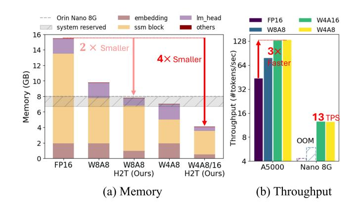

Figure 1: (Quamba2-8B memory and throughput.) The head-totoe (H2T) quantization enables the deployment of Mamba2-8B on edge platforms. Quamba2 delivers 3× throughput on Nvidia A5000 and 13 tokens-per-second (TPS) on Nvidia Nano 8G.

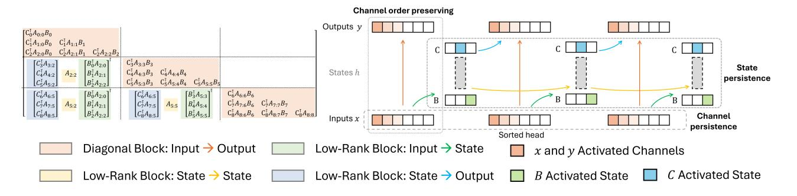

Figure 2: **(SSD flows with sorted heads and the activation persistence.)** We sort the head channels prior to applying quantization scaling factors. The orange blocks on the right indicate the activated channels with higher values in the input and output SSD heads. The SSD performs *channel-wise* calculation thereby retaining the channel order between input *x* and output *y*, which we call *channel order preserving*. The blue and green blocks represent the activated states of input-dependent parameters *B* and *C*. Our study shows that activated channels and states remain *consistent* across time steps and input samples, a property we denote as *channel persistence* and *state persistence*.

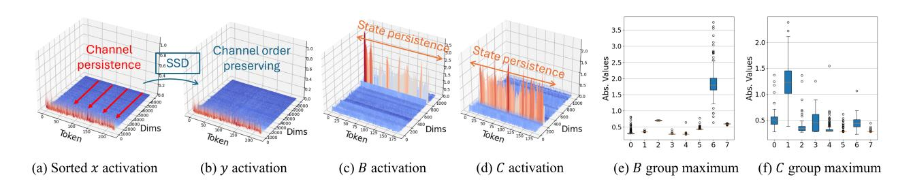

Figure 3: **(Channel order preserving and activation persistence.)** We show the activations in the last block of Mamba2-8B. For an input with t tokens, we demonstrate that the x remains sorted by the maximum of the calibrated channel (a). The SSD calculation is *channel-wise*, so the output channel order y matches the input order x (b). For B and C, the activated states remain consistent over time steps t (c-d) and input samples (e-f). We leverage the observations and design our techniques, *sort-and-cluster* and *per-state-group quantization*, to increase the quantization precisions for x (a), B, and C (c-f).

language models, delivering generic memory and latency reduction on all target platforms.

PTQ and weight reordering for Transformers. Post-training quantization (PTQ) techniques are generally classified into two categories: weight-only quantization (e.g., W4A16) and weight-activation quantization (e.g., W8A8) [Zhu et al., 2024b]. Weight-only quantization [Frantar et al., 2023, Lin et al., 2024a] minimizes weight storage, while weight-activation quantization [Zhao et al., 2024b, Ashkboos et al., 2024b] optimizes throughput with low bit-width operations. Reordering weights is frequently used to enhance quantization precision [Zhao et al., 2024b, Yuan et al., 2024] or efficiency [Lin et al., 2024b] of Transformers, but its use and its subsequent effectiveness in SSMs is unclear. Our study shows that the selective State Space Duality (SSD) computing [Dao and Gu, 2024] preserves channel order between input and output, with activated channels and states consistent over time.

PTQ and mixed-precision for SSMs. Xu et al. [2025] and Chiang et al. [2025] highlight that standard quantization techniques for Transformers are not effective for SSMs and propose PTQ algorithms tailored for SSMs. Despite this, these strategies do not offer a variety of bit-width configurations [Chiang et al., 2025] and struggle to perform well at reduced bit-widths such as W4A8 [Xu et al., 2025]. Moreover, Zhao et al. [2024a] show that 4-bit models lose generalizability, and Kumar et al. [2025] indicate the best performance under memory constraints for a bit-width of 6-8, with worse results for a bit-width of 4. Also, previous mixed-precision research focuses soly on Convolutional Neural Networks (CNNs) [Wang et al., 2019, Dong et al., 2019] and Transformers [Zhao et al., 2021]. We aim to fill the missing point of low bit-width and mixed-precision SSMs. Our framework provides W8A8, W4A8, and W4A16 for both Mamba1 [Gu and Dao, 2024] and

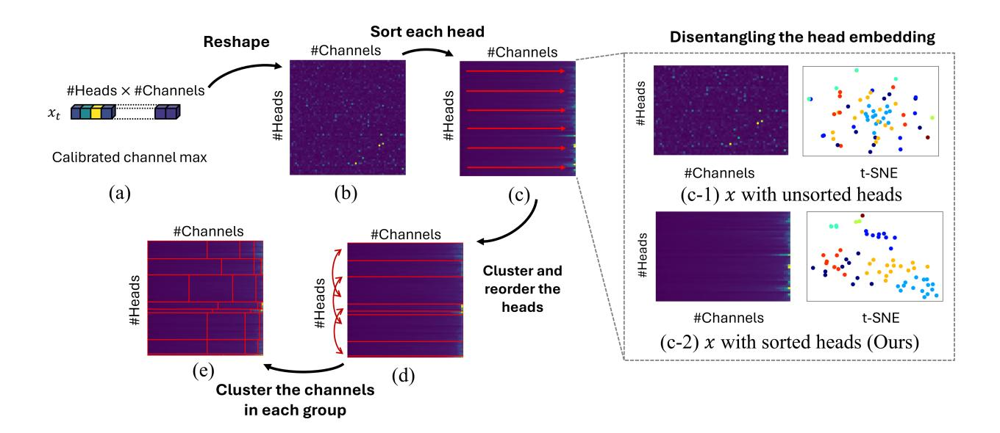

Figure 4: **(Sort-and-cluster.)** We leverage the *channel-persistent* property in SSMs to sort the channel with the calibrated maximum (a-c). The sorted heads disentangle the embedding, as shown in (c-1) and (c-2), enabling the clustering on the heads. We cluster the sorted heads into m groups (m = 8 in (d)), and reorder the weights offline to match the clustering results. Then, we apply the clustering again in each head group to cluster the channels into n groups (n = 4 in (e)). For each group, a scaling factor is calculated, resulting in  $m \times n$  factors used to quantize  $x_t$  to 8-bit.

Mamba2 [Dao and Gu, 2024] with practical speed-up and memory reduction, addressing the growing demand for the deployment of SSMs both in the cloud and on the edge. We evaluate Quamba2 on a large and challenging multitasking dataset, MMLU [Hendrycks et al., 2020], to show the robustness of our framework.

### 3 Background

#### 3.1 Model Quantization

**Notations.** We follow the notation in Chiang et al. [2025]. We use X to represent the floating-point matrices, and  $\overline{X}$  to represent their quantized matrices with their floating-point scaling factors  $s_x$ . For operators, we use  $\overline{f}(\cdot)$  to represent the quantized version of the function  $f(\cdot)$  (*i.e.*, the weights are quantized in the function  $\overline{f}$ ).

**Quantization.** We focus on *symmetric uniform quantization* to approximate floating-point weights and activations with discrete *N*-bit signed integers (*i.e.*, INT8 or INT4) due to its *hardware compatibility*. The general symmetric uniform quantization function is defined as

$$\overline{X} = \operatorname{Clamp}\left(\left\lfloor \frac{X}{s} \right\rfloor, -2^{N-1}, 2^{N-1} - 1\right),\tag{1}$$

where  $s = \text{Max}(|X|)/(2^{N-1}-1)$ .  $\overline{X}$  represents the quantized weights or activations, X is the input matrix in floating point, and s is the scaling factor (*i.e.*, quantization step) that is determined by the target bit-width N ( $N = \{4, 8\}$  in our setting). The *static* scaling factor s is pre-calibrated and *fixed* during inference.

#### 3.2 Selective State Space Models

The selective SSM [Gu and Dao, 2024, Dao and Gu, 2024] transforms the time-invariant SSM [Gu et al., 2020] to a time-varying system. The system dynamics is defined by

$$h_t = \dot{A}_t h_{t-1} + \dot{B}_t x_t, \quad y_t = C_t h_t + D x_t$$
 (2)

where  $(\dot{A}_t, \dot{B}_t, C_t)$  are input-dependent.  $\dot{A}_t$  and  $\dot{B}_t$  are discrete parameters of A and B. The discretization function for  $\dot{A}_t$  and  $\dot{B}_t$  with a given input-dependent  $\Delta_t$  is defined as  $\dot{A}_t = \exp(\Delta_t A)$ ,  $\dot{B}_t = (\Delta_t A)^{-1}(\exp(\Delta_t A) - I) \cdot \Delta_t B_t \approx \Delta_t B_t$ . (A, D) are trainable parameters, and D is an optional residual parameter. An optional residual branch  $z_t$  is applied to the SSM output such that  $y_t \cdot \text{SiLU}(z_t)$  before the output projection. We follow Dao and Gu [2024] and abstract the selective SSM computation at the time step t with the function

$$y_t = SSM(\dot{A}_t, \dot{B}_t, C_t)(x_t). \tag{3}$$

Optional  $z_t$  and D are omitted in the function. We omit the subscript t to represent the computation for the entire sequence. The abstract SSM block is shown in Figure 5.

**Mamba 1.** Gu and Dao [2024] presents selective SSMs in which the parameters B, C, and  $\Delta$  vary with input (*i.e.*, time-varying), allowing the model to selectively prioritize or ignore inputs based on their content. The interaction with the input  $x_t$  is specified as  $B_t = F_B(x_t)$ ,  $C_t = F_C(x_t)$ ,  $\Delta_t = \text{softplus}(F_{\Delta}(x_t))$ , where  $F_B$  and  $F_C$  are linear transformations mapping  $x_t$  to  $B_t$  and  $C_t$ . The function  $F_{\Delta}$  involves two sequential projection layers, formulated as  $F_{\Delta} = \text{Proj}(\text{Proj}(x_t)) + \text{bias}$ . The  $x_t$  is calculated from the input of the block  $u_t$  with a projection layer at the time step t.

**Mamba2.** Dao and Gu [2024] establish a theoretical link, Structured State Space Duality (SSD), between selective SSMs and self-attention. They also introduce an efficient algorithm that utilizes matrix multiplication units on contemporary hardware to perform linear recurrence calculations. Mamba2 simplifies block design by removing sequential linears where  $x_t$ ,  $B_t$ ,  $C_t$ , and  $\Delta_t$  are produced in parallel with a single projection layer such that  $(x_t, B_t, C_t, \Delta_t) = F(u_t)$ , where  $u_t$  is the block input at the time step t. The modified block design is better suited to tensor parallelism [Shoeybi et al., 2019] in the context of larger models.

#### 3.3 Quantizing Selective SSMs

**SSM input parameters.** The SSM defined in Equation 3 receives an input in the form of  $(\dot{A}_t, \dot{B}_t, C_t; x_t)$ . Recent efforts [Xu et al., 2025, Chiang et al., 2025] show that the SSM block is extremely sensitive to quantization-induced errors in  $x_t$  due to the linear recurrence mechanism in Mamba1 [Gu and Dao, 2024]. Our work indicates that the phenomenon persists in Mamba2 [Dao and Gu, 2024]. To address this issue, we propose sort-and-cluster to quantize the input  $x_t$  with 8-bit. Our method groups the channels across the heads with the same value range to create a smoother landscape in the group, and therefore increases the quantization precision.

et al., 2022, Xiao et al., 2023] have detected channel-persistent outliers. A common method for outlier elimination is applying the Hadamard transform [Ashkboos et al., 2024b, Liu et al., 2024c]. In SSM quantization [Xu et al., 2025, Chiang et al., 2025], *online* Hadamard matrices transform the input of output projection into a smoother space, enhancing the quantization precision. Although the fast Walsh–Hadamard transform (FWHT) can be executed in parallel with a *n*log*n* complexity [Dao, 2024b, Sloane, 1999], we adhere to Xu et al. [2025] and Chiang et al. [2025] to quantize the output projection input, with the aim of minimizing *online* Hadamard transform overheads.

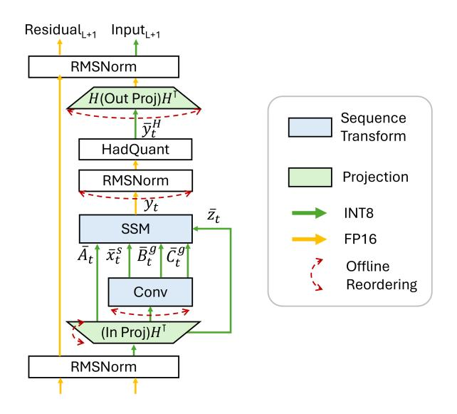

Figure 5: (Quamba2 precision.) The detailed precision mapping of W4A8 and W8A8 Quamba2. We reorder the weights offline to match the sorting and clustering indices of  $\bar{x}_t^s$ , and apply per-state-group quantization on  $\bar{B}_t^g$  and  $\bar{C}_t^g$ .

Table 3: **(SSD latency.)** We profile SSD latency of Mamba2-8B in milliseconds (*ms*) across sequence lengths with different input bit-width. We set batch size to eight.

| Inputs              | L = 256      | 512          | 1024         | 2048         |
|---------------------|--------------|--------------|--------------|--------------|
| FP16 Int8 (Ours) | 0.82 0.76 | 1.61 1.47 | 3.51 2.97 | 7.22 6.07 |
| Speedup             | 1.08×        | 1.10×        | 1.18×        | 1.19×        |

Table 4: **(Quamba2 model size in GB.)** We profile the model size in GB of different bit-width configurations for Mamba1 and Mamba2 in our framework.

| Models | Size | FP16    | W8A8   | W4A8   | W4A16  |
|--------|------|---------|--------|--------|--------|
|        |      | 5.3 GB  | •      |        |        |
| Mamba2 | 2.7B | 5.2 GB  | 2.7 GB | 1.4 GB | 1.4 GB |
|        |      | 15.7 GB |        |        |        |

### 4 Proposed Method: Quamba2

#### 4.1 Quantizing SSM Parameters

Our method is based on two findings in SSM activations: *channel persistence* and *state persistence*, together with a computational property of SSM: *channel order preserving*. The notation follows the definition from Equation 3.

**Sort-and-cluster.** We observe the *persistence* of the channel magnitude and the *preservation* of channel order in the SSM input x and output y, as shown in Figure 2. Although x is sensitive to quantization-induced errors in Mamba2 [Dao and Gu, 2024], with the findings of Chiang et al. [2025] still applicable, Chiang et al. [2025] overlook the persistence characteristic and order-preserving of the SSM channel. In contrast, we leverage these two properties to first sort the head channels and group both heads and channels. Specifically, we first obtain the channel maximum from a calibration dataset. In Figure 3 (a), we visualize the x sorted by the *offline* calibrated channel maximum of the last block of Mamba2-8B. x remains sorted input with an *online* t-token sample. The sorted x disentangles the head embedding, allowing head grouping. Figure 4 (c1-c2) shows that heads with similar characteristics are closely grouped, leading to the use of unsupervised clustering into m groups. For each group of heads, we apply the clustering algorithm again to group channels into n groups. The scaling factor is calculated for every group, leading to a total of  $m \times n$  scaling factors, which are then utilized to quantize  $x_t$  to 8-bit precision. The detailed sort-and-cluster process is shown in Figure 4. We find that m = 4 and n = 4 provide sufficiently good results throughout all experiments. The  $\bar{x}_t^s$  in Figure 5 refers to the activation applied with sort-and-cluster.

**Per-state-group quantization.** Dao and Gu [2024] relax the number of state group size and introduce a Multi-input SSM where  $B_t$ ,  $C_t$  matrices are shared across all channels of the input  $x_t$ , akin to grouped-query attention [Ainslie et al., 2023] in Transformers. Our findings indicate that the activated states (with larger numerical values) are the same across time steps t and input samples. In Figure 3 (c-f), we visualize the activation distribution of B and C in the last block of Mamba2-8B. The number of groups in B and C is set to 8, where each group has 128 channels. Figure 3 (c-d) shows that only a few groups are activated with larger values. For example, in Figure 3 (e-f), group six in B is mostly activated, while group seven in both B and C has minimal variations. Thus, we apply per-state-group quantization to B and C, where each group utilizes a single scaling factor. The  $\bar{B}_t^g$  and  $\bar{C}_t^g$  in Figure 5 refer to the activations applied with per-state-group quantization. The per-state-group quantization largely increases the quantization precision in the groups where the value range is small, e.g, group seven in both B and C. We show that per-state-group quantization is key to mitigating the performance gaps with the FP16 model for Mamba2-8B.

#### 4.2 System and Framework Design

Cluster-aware weight reordering. We create a new channel and head sequence in *sort-and-cluster*, where the heads within the same cluster are grouped and their channels are arranged by the pre-calibrated maximum. To produce the activations with the sorting and clustering orders, we use clustering and sorting indices to reorder *offline* the input projection, causal convolution, normalization, and output projection in the block. The output column of input projection weights and the channel of causal convolution weights are reordered. As SSD computing maintains channel order (see Figure 2 right), we reorder normalization weights and apply fused Hadamard quantization. Finally, input rows of the output projection are rearranged using the same indices to keep the output the same. The *offline* cluster-aware weight reordering is depicted in Figure 5.

**Offline Hadamard matrix fusion.** Hadamard matrices have the computational property  $\mathbf{H}_n\mathbf{H}_n^{\top}=n\mathbf{I}_n$  where n denotes n-dimensional square matrices. We therefore fuse *offline* the Hadamard matrices into the input and output linear projections. For the output projection, the Hadamard matrices are multiplied at both sides of the weight matrix, such that  $\mathbf{W}_{\text{out}}^H = \mathbf{H}_n\mathbf{W}_{\text{out}}\mathbf{H}_n^{\top}$ . We fuse a Hadamard matrix at the input side of the input projection weight, such that  $\mathbf{W}_{\text{in}}^H = \mathbf{W}_{\text{in}}\mathbf{H}_n^{\top}$ . Thus, pairing Hadamard matrices in input/output projections with online Hadamard quantization results in compute-invariance [Ashkboos et al., 2024a,b], yielding an identical block output. The *offline* Hadamard matrix fusion is shown in Figure 5. We apply the 4-bit/8-bit quantization on the weights after matrix fusion.

Efficient 4-bit/8-bit Mamba blocks. Our framework accommodates W8A8, W4A8, and W4A16 projection kernels, a W8A8 causal convolution kernel, 4-bit and 8-bit embedding kernels, and 8-bit selective scan and SSD kernels. For projection layers, we reorder the weights and their per-group scaling factors [Lin et al., 2024b, Frantar et al., 2024, Zhang et al., 2024] to maximize the Tensor Core loading throughput. The output scaling factors are fused to the input scaling factors such that  $\bar{Y} = s_W s_{\text{fused}} \bar{W} \bar{X}$  where  $s_{\text{fused}} = s_X/s_Y$ . We implement W4A8 and W4A16 fused matmul-transpose kernels for the Mamba1 block. For sequence transformations, we load the 8-bit activations and 8-bit cached states to reduce memory pressure, thus improving latency, as shown in Table 3. In the forward Hadamard transform, the scaling factor  $s_y$  is integrated, making  $\bar{y}^H = \frac{1}{s_y} \mathbf{H}_n y$ , thereby avoiding extra computational load during quantization. The efficient kernels of our framework provide generic speed-up and memory reduction, addressing the increasing demands for the deployment of SSM on the cloud and on the edge.

**Head-to-toe quantization.** Quantizing from embedding to the output head (*i.e.*, Head-to-toe quantization) brings additional memory and latency reduction, which is necessary on edge computing platforms with limited memory capacity. As shown in Figure 1, our head-to-toe (H2T) quantization enables the deployment of Mamba2-8B on Nano 8G. Specifically, we employ *per-token* quantization to the embedding layer, and *per-group* quantization to the weight of the head. As shown in Table 2, we implement the CUDA kernels and support the 4-bit/8-bit embedding layer and 4-bit/8-bit output head. Therefore, our framework achieves generic 4× memory reduction.

Improving robustness via W4AX-mixed. Zhao et al. [2024a] demonstrate that applying W4A4 to all blocks compromises generalizability of Transformers. We extend such analysis to verify SSM robustness and generalizability on MMLU [Hendrycks et al., 2020] dataset. Our findings indicate that while full W4A8 quantization maximizes prefilling speedup, it suffers from a notable generalization gap (-5.8% on MMLU vs. -2.1% on LAMBADA). In contrast, full W4A16 quantization demonstrate robustness but comes at the cost of increased prefilling latency. To address this, we introduce mixed-precision support in our framework. We automatically search salient blocks based on their performance sensitivity and assign them a higher precision. Our W4A{8/16}-mixed SSM achieves a 2.9% accuracy improvement on MMLU while incurring only a 10% increase in prefilling latency.

### 5 Experiments

#### 5.1 Experimental Setup

We provide framework design details in Appendix C.

**Evaluations.** We use LM-EVAL [Gao et al., 2023] to evaluate Quamba2 and baselines on six zero-shot downstream tasks: LAMBADA [Paperno et al., 2016], HellaSwag [Zellers et al., 2019], PIQA [Bisk et al., 2020], ARC [Clark et al., 2018] and WinoGrande [Sakaguchi et al., 2020], and show the average accuracy over five runs in each table. To compare with MambaQuant [Xu et al., 2025], we average the accuracy across five datasets: ARC-easy, ARC-challenge, PIQA, WinoGrande and HellaSwag. The full evaluation is in Appendix Section A, where we follow the evaluation protocol in Mamba1 [Gu and Dao, 2024], and report the accuracy for LAMBADA, WinoGrande, PIQA, and ARC-easy, and accuracy normalized by sequence length for HellaSwag and ARC-challenge. To show generalizability and robustness, we evaluate the 8B models on MMLU [Hendrycks et al., 2020], a large multitask test consisting of multiple-choice questions from various domains.

**Baselines.** In our W8A8 setting, we compare our framework with the latest quantization methods for SSM, MambaQuant [Xu et al., 2025] (W8A8, W4A8) and Quamba [Chiang et al., 2025] (W8A8) on zero-shot downstream tasks. In the Quamba setting [Chiang et al., 2025], we applied the Hadamard transform to the output projection input and implemented percentile clipping on the input SSM, establishing our W8A8 Mamba2 baseline for latency and accuracy. We also provide the latency for W4A8 and W4A16.

#### 5.2 Latency and Model Size

We test all methods on the A5000 for cloud applications and on the Orin Nano 8G for edge applications. Time-per-outputtoken (TPOT) and time-to-first-token (TTFT) are measured for a batch size of one, recorded in milliseconds (ms). TTFT is profiled with 1024 input tokens. The results are shown in Table 5 and Figure 1. In the W8A8 setting, head-to-toe quantization of our framework improves the TPOT latency for Mamba2-8B by 1.80× (22.73 ms vs. 12.61 ms), outperforming Quamba 1.61× [Chiang et al., 2025] (22.73 ms vs. 14.12 ms). In the W4A8 configuration, Quamba2 achieves 3.89× less memory use, 1.39× prefilling, and 3.05× faster generation speed for Mamba2-8B on A5000. W4A8 and W4A16 slow down TTFT compared to W8A8 and FP16 due to dequantization overhead. However, 4-bit weights bring latency benefits in the memory-bound generation stage. Our approach allows the deployment of Mamba2-8B on Nano 8G with a speed of generating 13 tokens per second, while FP16 and W8A8 fail, as illustrated in Figure 1 and Table 5. For the SSD kernel, we load the 8-bit activations  $(\bar{x}, \bar{A}, \bar{B}, \bar{C}, \bar{z})$  to reduce memory pressure and improve latency by 1.18×, as shown in Table 3.

Table 5: (Mamba2-8B latency.) TPOT and TTFT on Nvidia A5000 GPU and Orin Nano 8G are measured in milliseconds (*ms*) with one batch. TTFT is profiled with 1024 tokens. (OOM: out-of-memory)

| Methods           | Bitwidth | Bitwidth A5000 |        |       | Orin Nano 8G |  |  |
|-------------------|----------|----------------|--------|-------|--------------|--|--|
|                   |          | ТРОТ           | TTFT   | TPOT  | TTFT         |  |  |
| -                 | FP16     | 22.73          | 197.80 | OOM   | OOM          |  |  |
| Quamba            | W8A8     | 14.12          | 124.01 | OOM   | OOM          |  |  |
| 0 1 0             | W8A8     | 12.61          | 122.33 | OOM   | OOM          |  |  |
| Quamba2 (Ours) | W4A8     | 7.43           | 140.78 | 79.91 | 2088.03      |  |  |
| (Cars)            | W4A16    | 7.58           | 209.19 | 78.77 | 2316.23      |  |  |

#### 5.3 Zero-shot Evaluation on Downstream Tasks

We present the average accuracy for Quamba2 over five datasets: ARC-easy, ARC-challenge, PIQA, WinoGrande, and HellaSwag, allowing a fair comparison with MambaQuant [Xu et al., 2025]. The full evaluation is in the Appendix, where we follow the evaluation protocol in Mamba1 [Gu and Dao, 2024]. In contrast to Quamba [Chiang et al., 2025], when applied to Mamba1, our approach utilizes Hadamard transforms on input and output projections to increase quantization precision, thus enhancing accuracy for Mamba1. As illustrated in Table 6, our techniques sort-and-cluster and per-state-group quantization surpass clipping in Mamba2 [Dao and Gu, 2024]. Our framework performs head-to-toe quantization, outperforming Quamba in latency and memory usage (refer to Table 5 and 4) for both W8A8 Mamba1 and Mamba2. Quamba2 also outperforms MambaQuant in W4A8 Mamba1 and delivers real speedup on computing platforms. Moreover, our framework supports W8A8, W4A8, and W4A16 precisions for both Mamba1 and Mamba2 with satisfactory accuracy and latency.

Table 6: (Zero-shot evaluation.) We compare our framework with Quamba [Chiang et al., 2025] and MambaQuant [Xu et al., 2025] on the average accuracy of five zero-shot downstream tasks.

| Bitwidth | Methods        | Mar           | nba1          | Mamba2 |       |  |
|----------|----------------|---------------|---------------|--------|-------|--|
| Bitwidth | Methods        | 1.4B          | 2.8B          | 2.7B   | 8B    |  |
| FP16     | -              | 58.6%         | 62.2%         | 62.4%  | 70.8% |  |
|          | Quamba         | 57.3%         | 61.5%         | 57.3%  | 67.0% |  |
| W8A8     | MambaQuant     | 58.3%         | 62.1%         | -      | -     |  |
|          | Quamba2 (Ours) | <u>57.5</u> % | 61.8%         | 62.1%  | 69.9% |  |
| W4A8     | MambaQuant     | 54.3%         | <u>58.5</u> % | -      | -     |  |
| W 1110   | Quamba2 (Ours) | 56.7%         | 61.0%         | 61.4%  | 69.4% |  |
| W4A16    | Quamba2 (Ours) | 57.5%         | 61.9%         | 62.3%  | 70.2% |  |

Table 7: **(Five-shot evaluation of Quamba2-8B on MMLU.)** We evaluate W4A8, W4A16, and W4AX-mixed on MMLU. Our W4AX-mixed model outperforms mixed by handcrafting (HC) and pure W4A8 models.

| Bitwidth | Method   | LAMB (0-shot) | MMLU (5-shot)     | W4A{X} (A8:A16) | TTFT   |
|----------|----------|---------------|----------------------|-----------------|--------|
| FP16     | -        | 70.9%         | 47.0%                | -               | 197.80 |
| W4A8     | -        | 68.8%         | 41.2%                | 56:0            | 140.78 |
| W4A16    | -        | 70.6%         | 45.3%                | 0:56            | 209.19 |
| Mixed    | HC-last  | 68.3%         | 42.1%                | 42:14           |        |
| Mixed    | HC-first | 68.9%         | $\underline{43.1}\%$ | 42:14           | 158.36 |
| Mixed    | Auto     | 69.1%         | 44.0%                | 42:14           |        |

#### 5.4 Evaluation on Large Multitasking Dataset

We evaluate W4A16 and W4A8 Quamba2-8B in the MMLU dataset [Hendrycks et al., 2020], a large multitasking dataset, covering 57 subject ranges at different difficulty levels. Our study shows that previous quantization methods may overlook the generalizability of low bit-width models. W4A8 strikes a balance between prefilling and generation speed but falls short in MMLU generalization, whereas W4A16 maintains a better generalization despite an increased prefilling latency, as shown in Table 7. We handcraft two mixed-precision models that replace the last 14 layers and the first 14 layers with W4A16 denoted as HC-last and HC-first in the table, respectively. However, they show marginal improvements on MMLU dataset. To this end, we employ an evolutionary search approach to identify sensitive layers and assign W4A16 to these blocks. The resulting mixed-precision model mitigates the loss of generalizability (+2.9%) in the MMLU dataset, outperforming naive mixed-presion by handcrafting and pure W4A8 models, with only a 10% increase in prefilling latency.

#### **6** Ablation Studies

#### 6.1 Ablation study on W4A8

We conduct an ablation study on the W4A8 Quamba2-8B in Table 8. In the W4A8 setting, it is essential to apply the Hadamard transform to the input of the output projection. The model fails without applying Hadamard transforms. However, due to the sensitivity of the SSM to quantization-induced errors, even with per-group quantization and GPTQ [Frantar et al., 2023] (second-order information) applied on top of the Hadamard transform, the results remain unsatisfactory. Our proposed methods *per-state-group quantization* (PerSG) and *sort-and-cluster* (SnC) address this issue in SSMs by quantizing the *x*, *B*, and *C* in 8 bits with minimal accuracy drop. It is noted that *x* continues to be vulnerable to quantization errors in SSMs, consistent with the findings in Chiang et al. [2025]. our sort-and-cluster technique outperforms clipping in addressing this issue (*ref.* Table 6 and 11).

#### 6.2 Ablation study on W4A16

We study the impact of each component in the case of W4A16 Quamba2-8B (weight-only quantization, *i.e.*,  $\overline{W}X$ ), and show the results in Table 9. The table demonstrates that the Hadamard transform combined with per-group weight quantization (PerG + Had.) yields greater accuracy than GPTQ [Frantar et al., 2023] (PerG + GPTQ). Our analysis indicates that the use of the Hadamard transform in the input of the out projection is crucial to narrowing the performance gap in weight-only quantization of SSMs. Specifically, the Hadamard transform *eliminates outliers* in the *half-precision* activation, thereby avoiding the amplification of quantization errors from 4-bit weights by large outliers in the output projection such that  $||W_{\text{out}}X_{\text{out}} - \overline{W}_{\text{out}}X_{\text{out}}|| < ||W_{\text{out}}X_{\text{out}} - \overline{W}_{\text{out}}X_{\text{out}}||$ . By combining all methods (PerG + GPTQ + Had.), the W4A16 models close the performance gap between the half-precision on LAMBADA dataset.

Table 8: **(Ablation study on W4A8 Quamba2-8B.)** The accuracy on LAMBADA dataset is reported. (PerSG: perstate-group quantization for *B* and *C*, SnC: sort-and-cluster for *x*, PerG: per-group weight quantization, GPTQ: Frantar et al. [2023], and Had: Hadamard transforms)

| Size | Bitwidth | We PerG | ights GPTQ | Had. | B/C PerSG | x SnC     | Acc.  |
|------|----------|------------|---------------|------|--------------|--------------|-------|
|      | FP16     | -          | -             | -    | -            | -            | 71.2% |
|      |          | ✓          |               |      |              |              | fail  |
| οD   |          | ✓          |               | <    |              |              | 53.8% |
| 8B   | W4A8     | ✓          | $\checkmark$  | /    |              |              | 55.1% |
|      |          | ✓          | $\checkmark$  | /    | ✓            |              | 60.7% |
|      |          | ✓          | ✓             | ✓    | ✓            | $\checkmark$ | 68.8% |

Table 9: **(Ablation study on W4A16 Quamba2-8B.)** The accuracy on LAMBADA dataset is reported. The Hadamard transform eliminates the large outliers from the half-precision activation, avoiding the amplification of quantization errors from 4-bit weights. (PerG: pergroup quantization, GPTQ: Frantar et al. [2023], and Had: Hadamard transforms)

| Size | Bitwidth | We PerG | Weights PerG GPTQ |          |       |  |  |  |  |  | Acc. |
|------|----------|------------|----------------------|----------|-------|--|--|--|--|--|------|
|      | FP16     | -          | -                    | -        | 71.2% |  |  |  |  |  |      |
|      |          | <b>/</b>   |                      |          | 64.7% |  |  |  |  |  |      |
| 8B   |          | ✓          |                      | ✓        | 69.6% |  |  |  |  |  |      |
|      | W4A16    | ✓          | ✓                    |          | 69.2% |  |  |  |  |  |      |
|      |          | <b></b> ✓  | ✓                    | <b>/</b> | 71.2% |  |  |  |  |  |      |

### 6.3 Quantizing the embedding and output head

In Table [10,](#page-9-0) we perform an analysis of quantizing the embedding and output head in addition to W4A8 blocks. As the weights in all layers are represented in 4-bit, the halfprecision embedding layer and the output head become the memory bottlenecks, preventing the W4A8 models from being deployed to edge devices (ref. Figure [1](#page-1-1) W4A8). As a result, we experiment on quantizing the embedding and output head in addition to W4A8 blocks and show the results in Table [10.](#page-9-0) We show that larger models present more resilience to quantizing both the embedding layer and the output head, as the accuracy on the LAMBADA dataset remains nearly unchanged. This finding is particularly useful for deploying large models onto a device with limited memory. Our framework provides different bit-width configurations (i.e., 4-bit and 8-bit) for the embedding layer and output head, addressing the needs for deploying large models on edge devices.

Table 10: (Ablation study on the embedding and output head.) We experiment on quantizing the embedding and output head in addition to W4A8 blocks. The accuracy on the LAMBADA dataset is reported.

| size | FP16  | W4A8 blocks | + 4-bit lm_head | + 4-bit embed. | + both |
|------|-------|----------------|--------------------|-------------------|--------|
| 130M | 43.7% | 37.6%          | 37.0%              | 33.4%             | 33.4%  |
| 370M | 53.1% | 50.5%          | 50.3%              | 46.2%             | 46.6%  |
| 2.7B | 69.5% | 65.8%          | 66.1%              | 66.0%             | 65.7%  |
| 8B   | 70.9% | 68.5%          | 68.3%              | 69.0%             | 68.8%  |

### 7 Conclusion

We introduce Quamba2, a robust post-training quantization framework tailored for selective State Space Models, compatible with W4A8, W4A16, and W8A8 on Mamba1 and Mamba2. Using channel order preservation and activation persistence observed in SSMs, we propose sort-and-cluster and per-state-group quantization techniques for the quantization of 8-bit activation. Experiments demonstrate that Quamba2 surpasses previous methods, offering significant reductions in latency and memory for both cloud and edge applications, addressing deployment challenges for emerging SSM-based applications on various platforms.

### Impact Statement

This paper aims to enhance the efficiency of machine learning and expand the accessibility of large language models. We find that the accuracy degradation is not negligible. Despite this, the performance trade-off is acceptable given the significant improvements in latency and resource efficiency. Our work enables large language models to be deployed on resource-limited devices. As a positive feature, our method may push the development of privacy-centric on-device applications, where sensitive data can be processed locally without relying on cloud services. However, our work may also present challenges such as increased device resource usage and potential security vulnerabilities if the local devices are compromised.

## Acknowledgments

This work was supported in part by the ONR Minerva program, NSF CCF Grant No. 2107085, iMAGiNE - the Intelligent Machine Engineering Consortium at UT Austin, UT Cockrell School of Engineering Doctoral Fellowships, NSF CAREER Grant No. 2339084, and Taiwan's NSTC Grant No. 111-2221-E-A49-148-MY3.

### References

- Joshua Ainslie, James Lee-Thorp, Michiel de Jong, Yury Zemlyanskiy, Federico Lebrón, and Sumit Sanghai. Gqa: Training generalized multi-query transformer models from multi-head checkpoints. In Conference on Empirical Methods in Natural Language Processing (EMNLP), 2023.
- Saleh Ashkboos, Maximilian L Croci, Marcelo Gennari do Nascimento, Torsten Hoefler, and James Hensman. Slicegpt: Compress large language models by deleting rows and columns. In International Conference on Learning Representations (ICLR), 2024a.
- Saleh Ashkboos, Amirkeivan Mohtashami, Maximilian L Croci, Bo Li, Martin Jaggi, Dan Alistarh, Torsten Hoefler, and James Hensman. Quarot: Outlier-free 4-bit inference in rotated llms. Advances in Neural Information Processing Systems (NeurIPS), 2024b.
- Yonatan Bisk, Rowan Zellers, Ronan Le Bras, Jianfeng Gao, and Yejin Choi. PIQA: reasoning about physical commonsense in natural language. In The Thirty-Fourth AAAI Conference on Artificial Intelligence (AAAI), 2020.
- Hung-Yueh Chiang, Chi-Chih Chang, Natalia Frumkin, Kai-Chiang Wu, and Diana Marculescu. Quamba: A post-training quantization recipe for selective state space models. In International Conference on Learning Representations (ICLR), 2025.
- Peter Clark, Isaac Cowhey, Oren Etzioni, Tushar Khot, Ashish Sabharwal, Carissa Schoenick, and Oyvind Tafjord. Think you have solved question answering? try arc, the AI2 reasoning challenge. CoRR, 2018.
- Tri Dao. Causal depthwise conv1d in cuda with a pytorch interface, 2024a. URL [https://github.com/Dao-AILab/](https://github.com/Dao-AILab/causal-conv1d) [causal-conv1d](https://github.com/Dao-AILab/causal-conv1d).
- Tri Dao. Fast hadamard transform in cuda, with a pytorch interface, 2024b. URL [https://github.com/Dao-AILab/](https://github.com/Dao-AILab/fast-hadamard-transform) [fast-hadamard-transform](https://github.com/Dao-AILab/fast-hadamard-transform).
- Tri Dao and Albert Gu. Transformers are ssms: Generalized models and efficient algorithms through structured state space duality. In International Conference on Machine Learning (ICML), 2024.
- Tim Dettmers, Mike Lewis, Younes Belkada, and Luke Zettlemoyer. Gpt3. int8 (): 8-bit matrix multiplication for transformers at scale. Advances in Neural Information Processing Systems (NeurIPS), 35:30318–30332, 2022.
- Tim Dettmers, Artidoro Pagnoni, Ari Holtzman, and Luke Zettlemoyer. Qlora: Efficient finetuning of quantized llms. Advances in Neural Information Processing Systems (NeurIPS), 2024.
- Zhen Dong, Zhewei Yao, Amir Gholami, Michael W Mahoney, and Kurt Keutzer. Hawq: Hessian aware quantization of neural networks with mixed-precision. In ICCV, 2019.
- Elias Frantar, Saleh Ashkboos, Torsten Hoefler, and Dan Alistarh. Gptq: Accurate post-training quantization for generative pre-trained transformers. International Conference on Learning Representations (ICLR), 2023.

- Elias Frantar, Roberto L Castro, Jiale Chen, Torsten Hoefler, and Dan Alistarh. Marlin: Mixed-precision auto-regressive parallel inference on large language models. arXiv preprint arXiv:2408.11743, 2024.
- Leo Gao, Stella Biderman, Sid Black, Laurence Golding, Travis Hoppe, Charles Foster, Jason Phang, Horace He, Anish Thite, Noa Nabeshima, Shawn Presser, and Connor Leahy. The pile: An 800gb dataset of diverse text for language modeling. CoRR, abs/2101.00027, 2021.
- Leo Gao, Jonathan Tow, Baber Abbasi, Stella Biderman, Sid Black, Anthony DiPofi, Charles Foster, Laurence Golding, Jeffrey Hsu, Alain Le Noac'h, Haonan Li, Kyle McDonell, Niklas Muennighoff, Chris Ociepa, Jason Phang, Laria Reynolds, Hailey Schoelkopf, Aviya Skowron, Lintang Sutawika, Eric Tang, Anish Thite, Ben Wang, Kevin Wang, and Andy Zou. A framework for few-shot language model evaluation, 2023. URL <https://zenodo.org/records/10256836>.
- Karan Goel, Albert Gu, Chris Donahue, and Christopher Ré. It's raw! audio generation with state-space models. In International Conference on Machine Learning (ICML), 2022.
- Ruihao Gong, Yang Yong, Shiqiao Gu, Yushi Huang, Chengtao Lv, Yunchen Zhang, Dacheng Tao, and Xianglong Liu. Llmc: Benchmarking large language model quantization with a versatile compression toolkit. In Conference on Empirical Methods in Natural Language Processing (EMNLP), 2024.
- Aaron Grattafiori, Abhimanyu Dubey, Abhinav Jauhri, Abhinav Pandey, Abhishek Kadian, Ahmad Al-Dahle, Aiesha Letman, Akhil Mathur, Alan Schelten, Alex Vaughan, et al. The llama 3 herd of models. arXiv preprint arXiv:2407.21783, 2024.
- Albert Gu and Tri Dao. Mamba: Linear-time sequence modeling with selective state spaces. In Conference on Language Modeling (COLM), 2024.
- Albert Gu, Tri Dao, Stefano Ermon, Atri Rudra, and Christopher Ré. Hippo: Recurrent memory with optimal polynomial projections. In Advances in neural information processing systems (NeurIPS), 2020.
- Zichao Guo, Xiangyu Zhang, Haoyuan Mu, Wen Heng, Zechun Liu, Yichen Wei, and Jian Sun. Single path one-shot neural architecture search with uniform sampling. In The European Conference on Computer Vision (ECCV), 2020.
- Dan Hendrycks, Collin Burns, Steven Basart, Andy Zou, Mantas Mazeika, Dawn Song, and Jacob Steinhardt. Measuring massive multitask language understanding. arXiv preprint arXiv:2009.03300, 2020.
- Tanishq Kumar, Zachary Ankner, Benjamin F Spector, Blake Bordelon, Niklas Muennighoff, Mansheej Paul, Cengiz Pehlevan, Christopher Ré, and Aditi Raghunathan. Scaling laws for precision. In International Conference on Learning Representations (ICLR), 2025.
- Woosuk Kwon, Zhuohan Li, Siyuan Zhuang, Ying Sheng, Lianmin Zheng, Cody Hao Yu, Joseph E. Gonzalez, Hao Zhang, and Ion Stoica. Efficient memory management for large language model serving with pagedattention. In Proceedings of the ACM SIGOPS 29th Symposium on Operating Systems Principles (SOSP), 2023.
- Kenton Lee, Ming-Wei Chang, and Kristina Toutanova. Latent retrieval for weakly supervised open domain question answering. arXiv preprint arXiv:1906.00300, 2019.
- Kunchang Li, Xinhao Li, Yi Wang, Yinan He, Yali Wang, Limin Wang, and Yu Qiao. Videomamba: State space model for efficient video understanding. In European Conference on Computer Vision (ECCV), 2025.
- Opher Lieber, Barak Lenz, Hofit Bata, Gal Cohen, Jhonathan Osin, Itay Dalmedigos, Erez Safahi, Shaked Meirom, Yonatan Belinkov, Shai Shalev-Shwartz, et al. Jamba: A hybrid transformer-mamba language model. arXiv preprint arXiv:2403.19887, 2024.
- Ji Lin, Jiaming Tang, Haotian Tang, Shang Yang, Wei-Ming Chen, Wei-Chen Wang, Guangxuan Xiao, Xingyu Dang, Chuang Gan, and Song Han. Awq: Activation-aware weight quantization for on-device llm compression and acceleration. Proceedings of Machine Learning and Systems (MLSYS), 2024a.
- Yujun Lin, Haotian Tang, Shang Yang, Zhekai Zhang, Guangxuan Xiao, Chuang Gan, and Song Han. Qserve: W4a8kv4 quantization and system co-design for efficient llm serving. arXiv preprint arXiv:2405.04532, 2024b.
- Yue Liu, Yunjie Tian, Yuzhong Zhao, Hongtian Yu, Lingxi Xie, Yaowei Wang, Qixiang Ye, and Yunfan Liu. Vmamba: Visual state space model. In Advances in neural information processing systems (NeurIPS), 2024a.

- Zechun Liu, Barlas Oguz, Changsheng Zhao, Ernie Chang, Pierre Stock, Yashar Mehdad, Yangyang Shi, Raghuraman Krishnamoorthi, and Vikas Chandra. Llm-qat: Data-free quantization aware training for large language models. The 62nd Annual Meeting of the Association for Computational Linguistics (ACL), 2024b.
- Zechun Liu, Changsheng Zhao, Igor Fedorov, Bilge Soran, Dhruv Choudhary, Raghuraman Krishnamoorthi, Vikas Chandra, Yuandong Tian, and Tijmen Blankevoort. Spinquant–llm quantization with learned rotations. arXiv preprint arXiv:2405.16406, 2024c.
- Bruce Lee LY. Cuda hgemm, 2024a. URL [https://github.com/Bruce-Lee-LY/cuda\\_hgemm](https://github.com/Bruce-Lee-LY/cuda_hgemm).
- Bruce Lee LY. Cuda hgemv, 2024b. URL [https://github.com/Bruce-Lee-LY/cuda\\_hgemv](https://github.com/Bruce-Lee-LY/cuda_hgemv).
- Denis Paperno, Germán Kruszewski, Angeliki Lazaridou, Quan Ngoc Pham, Raffaella Bernardi, Sandro Pezzelle, Marco Baroni, Gemma Boleda, and Raquel Fernández. The LAMBADA dataset: Word prediction requiring a broad discourse context. In Proceedings of the 54th Annual Meeting of the Association for Computational Linguistics, (ACL). The Association for Computer Linguistics, 2016.
- Pranav Rajpurkar, Robin Jia, and Percy Liang. Know what you don't know: Unanswerable questions for squad. arXiv preprint arXiv:1806.03822, 2018.
- Keisuke Sakaguchi, Ronan Le Bras, Chandra Bhagavatula, and Yejin Choi. Winogrande: An adversarial winograd schema challenge at scale. In The Thirty-Fourth AAAI Conference on Artificial Intelligence (AAAI), 2020.
- George Saon, Ankit Gupta, and Xiaodong Cui. Diagonal state space augmented transformers for speech recognition. In ICASSP 2023-2023 IEEE International Conference on Acoustics, Speech and Signal Processing (ICASSP), 2023.
- Mohammad Shoeybi, Mostofa Patwary, Raul Puri, Patrick LeGresley, Jared Casper, and Bryan Catanzaro. Megatron-lm: Training multi-billion parameter language models using model parallelism. arXiv preprint arXiv:1909.08053, 2019.
- Neil JA Sloane. A library of hadamard matrices, 1999. URL <http://www.neilsloane.com/hadamard/index.html>.
- Jimmy T.H. Smith, Andrew Warrington, and Scott Linderman. Simplified state space layers for sequence modeling. In International Conference on Learning Representations (ICLR), 2023.
- Shengkun Tang, Liqun Ma, Haonan Li, Mingjie Sun, and Zhiqiang Shen. Bi-mamba: Towards accurate 1-bit state space models. arXiv preprint arXiv:2411.11843, 2024.
- Jamba Team, Barak Lenz, Alan Arazi, Amir Bergman, Avshalom Manevich, Barak Peleg, Ben Aviram, Chen Almagor, Clara Fridman, Dan Padnos, et al. Jamba-1.5: Hybrid transformer-mamba models at scale. arXiv preprint arXiv:2408.12570, 2024.
- Vijay Thakkar, Pradeep Ramani, Cris Cecka, Aniket Shivam, Honghao Lu, Ethan Yan, Jack Kosaian, Mark Hoemmen, Haicheng Wu, Andrew Kerr, Matt Nicely, Duane Merrill, Dustyn Blasig, Fengqi Qiao, Piotr Majcher, Paul Springer, Markus Hohnerbach, Jin Wang, and Manish Gupta. CUTLASS, January 2023. URL <https://github.com/NVIDIA/cutlass>.
- Hugo Touvron, Louis Martin, Kevin Stone, Peter Albert, Amjad Almahairi, Yasmine Babaei, Nikolay Bashlykov, Soumya Batra, Prajjwal Bhargava, Shruti Bhosale, et al. Llama 2: Open foundation and fine-tuned chat models. arXiv preprint arXiv:2307.09288, 2023.
- A Vaswani. Attention is all you need. Advances in Neural Information Processing Systems (NeurIPS), 2017.
- Roger Waleffe, Wonmin Byeon, Duncan Riach, Brandon Norick, Vijay Korthikanti, Tri Dao, Albert Gu, Ali Hatamizadeh, Sudhakar Singh, Deepak Narayanan, et al. An empirical study of mamba-based language models. arXiv preprint arXiv:2406.07887, 2024.
- Junxiong Wang, Tushaar Gangavarapu, Jing Nathan Yan, and Alexander M Rush. Mambabyte: Token-free selective state space model. In Conference on Language Modeling (COLM), 2024.
- Kuan Wang, Zhijian Liu, Yujun Lin, Ji Lin, and Song Han. Haq: Hardware-aware automated quantization with mixed precision. In CVPR, 2019.
- Guangxuan Xiao, Ji Lin, Mickael Seznec, Hao Wu, Julien Demouth, and Song Han. Smoothquant: Accurate and efficient post-training quantization for large language models. In International Conference on Machine Learning (ICML), 2023.

- Zukang Xu, Yuxuan Yue, Xing Hu, Zhihang Yuan, Zixu Jiang, Zhixuan Chen, Jiangyong Yu, Chen Xu, Sifan Zhou, and Dawei Yang. Mambaquant: Quantizing the mamba family with variance aligned rotation methods. In International Conference on Learning Representations (ICLR), 2025.
- Zhenxuan Yu, Takeshi Kojima, Yutaka Matsuo, and Yusuke Iwasawa. Slender-mamba: Fully quantized mamba in 1.58 bits from head to toe. In Proceedings of the 31st International Conference on Computational Linguistics (COLING), 2025.
- Zhihang Yuan, Lin Niu, Jiawei Liu, Wenyu Liu, Xinggang Wang, Yuzhang Shang, Guangyu Sun, Qiang Wu, Jiaxiang Wu, and Bingzhe Wu. Rptq: Reorder-based post-training quantization for large language models. Advances in Neural Information Processing Systems (NeurIPS), 2024.
- Rowan Zellers, Ari Holtzman, Yonatan Bisk, Ali Farhadi, and Yejin Choi. Hellaswag: Can a machine really finish your sentence? In Anna Korhonen, David R. Traum, and Lluís Màrquez, editors, Proceedings of the 57th Conference of the Association for Computational Linguistics (ACL), 2019.
- Ying Zhang, Peng Zhang, Mincong Huang, Jingyang Xiang, Yujie Wang, Chao Wang, Yineng Zhang, Lei Yu, Chuan Liu, and Wei Lin. Qqq: Quality quattuor-bit quantization for large language models. arXiv preprint arXiv:2406.09904, 2024.
- Changsheng Zhao, Ting Hua, Yilin Shen, Qian Lou, and Hongxia Jin. Automatic mixed-precision quantization search of bert. arXiv preprint arXiv:2112.14938, 2021.
- Juntao Zhao, Wenhao Lu, Sheng Wang, Lingpeng Kong, and Chuan Wu. Qspec: Speculative decoding with complementary quantization schemes. arXiv preprint arXiv:2410.11305, 2024a.
- Yilong Zhao, Chien-Yu Lin, Kan Zhu, Zihao Ye, Lequn Chen, Size Zheng, Luis Ceze, Arvind Krishnamurthy, Tianqi Chen, and Baris Kasikci. Atom: Low-bit quantization for efficient and accurate llm serving. Proceedings of Machine Learning and Systems (MLSYS), 2024b.
- Zixuan Zhou, Xuefei Ning, Ke Hong, Tianyu Fu, Jiaming Xu, Shiyao Li, Yuming Lou, Luning Wang, Zhihang Yuan, Xiuhong Li, et al. A survey on efficient inference for large language models. Transactions on Machine Learning Research (TMLR), 2024.
- Lianghui Zhu, Bencheng Liao, Qian Zhang, Xinlong Wang, Wenyu Liu, and Xinggang Wang. Vision mamba: Efficient visual representation learning with bidirectional state space model. In International Conference on Machine Learning (ICML), 2024a.
- Xunyu Zhu, Jian Li, Yong Liu, Can Ma, and Weiping Wang. A survey on model compression for large language models. Transactions of the Association for Computational Linguistics (TACL), 2024b.

### A Full Results for Six Zero-shot Downstream Tasks

In Table [11,](#page-14-1) we follow the evaluation protocol in Mamba [\[Gu and Dao,](#page-11-1) [2024\]](#page-11-1), and report the accuracy for LAMBADA [\[Paperno et al.,](#page-12-13) [2016\]](#page-12-13), WinoGrande [\[Sakaguchi et al.,](#page-12-14) [2020\]](#page-12-14), PIQA [\[Bisk et al.,](#page-10-10) [2020\]](#page-10-10) and ARC-easy [\[Clark et al.,](#page-10-11) [2018\]](#page-10-11), and the accuracy normalized by the sequence length for HellaSwag [\[Zellers et al.,](#page-13-10) [2019\]](#page-13-10) and ARC-challenge [\[Clark et al.,](#page-10-11) [2018\]](#page-10-11). Given the slight variation in accuracy across runs, we present the average accuracy over five runs in each table. Our frame work outperforms Quamba [\[Chiang et al.,](#page-10-1) [2025\]](#page-10-1) in the Mamba1 backbone, providing with more quantization flavors such as W8A8, W4A8 and W4A16 for different use cases. Our method also outperforms Quamba in the Mamba2 backbone, where we apply the clipping technique to Mamba2, by a large gap in the average accuracy.

Table 11: (Zero-shot accuracy.) We evaluate our framework on six common sense tasks and report the average of five runs. Our framework surpass previous baseline, Quamba [\[Chiang et al.,](#page-10-1) [2025\]](#page-10-1), in average accuracy on both Mamba1 and Mamba2 backbones, with supporting more quantization flavors.

| Model  | Size | Methods | Bitwidth | LA    | HS    | PIQA  | Arc-E | Arc-C | WG    | Avg.  |
|--------|------|---------|----------|-------|-------|-------|-------|-------|-------|-------|
|        |      | -       | FP16     | 64.9% | 59.1% | 74.2% | 65.5% | 32.8% | 61.5% | 59.7% |
|        |      | Quamba  | W8A8     | 61.4% | 58.3% | 72.7% | 64.0% | 32.3% | 58.8% | 57.9% |
|        | 1.4B | Quamba2 | W8A8     | 62.3% | 58.6% | 73.1% | 64.0% | 32.2% | 58.5% | 58.1% |
|        |      | (Ours)  | W4A8     | 61.5% | 57.6% | 72.0% | 63.0% | 32.2% | 58.7% | 57.5% |
|        |      |         | W4A16    | 63.6% | 58.1% | 72.6% | 64.3% | 32.4% | 60.5% | 58.5% |
| Mamba  |      | -       | FP16     | 69.1% | 65.9% | 75.6% | 69.2% | 35.8% | 63.0% | 63.1% |
|        |      | Quamba  | W8A8     | 65.4% | 65.1% | 74.2% | 68.9% | 35.9% | 62.6% | 62.0% |
|        | 2.8B |         | W8A8     | 65.7% | 65.4% | 74.5% | 68.9% | 36.7% | 61.8% | 62.2% |
|        |      | Quamba2 | W4A8     | 63.5% | 64.9% | 74.2% | 68.2% | 35.3% | 62.2% | 61.4% |
|        |      | (Ours)  | W4A16    | 66.0% | 65.3% | 74.6% | 69.2% | 36.6% | 63.6% | 62.6% |
|        |      | -       | FP16     | 65.6% | 59.9% | 73.3% | 64.1% | 33.3% | 60.8% | 59.5% |
|        |      | Quamba  | W8A8     | 49.8% | 58.5% | 71.2% | 61.9% | 32.1% | 58.1% | 55.2% |
|        | 1.3B |         | W8A8     | 62.0% | 59.2% | 72.5% | 63.4% | 32.7% | 60.0% | 58.3% |
|        |      | Quamba2 | W4A8     | 61.0% | 58.8% | 72.4% | 62.7% | 32.6% | 59.1% | 57.7% |
|        |      | (Ours)  | W4A16    | 64.3% | 59.2% | 72.6% | 63.8% | 33.1% | 60.3% | 58.9% |
|        |      | -       | FP16     | 69.5% | 66.6% | 76.4% | 69.5% | 36.4% | 64.2% | 63.8% |
|        |      | Quamba  | W8A8     | 52.4% | 60.4% | 71.6% | 62.9% | 33.7% | 58.0% | 56.5% |
| Mamba2 | 2.7B |         | W8A8     | 66.1% | 65.5% | 74.4% | 68.4% | 37.1% | 63.7% | 62.5% |
|        |      | Quamba2 | W4A8     | 65.6% | 65.1% | 74.7% | 68.1% | 36.1% | 62.8% | 62.1% |
|        |      | (Ours)  | W4A16    | 68.8% | 65.6% | 75.5% | 68.6% | 36.6% | 64.9% | 63.3% |
|        |      | -       | FP16     | 70.9% | 77.7% | 79.7% | 76.0% | 48.0% | 72.0% | 70.7% |
|        |      | Quamba  | W8A8     | 54.0% | 74.6% | 77.1% | 73.5% | 44.2% | 65.5% | 64.8% |
|        | 8B   |         | W8A8     | 69.8% | 77.8% | 79.1% | 75.9% | 46.9% | 69.0% | 69.8% |
|        |      | Quamba2 | W4A8     | 68.8% | 77.1% | 79.1% | 75.0% | 46.0% | 68.7% | 69.1% |
|        |      | (Ours)  | W4A16    | 71.2% | 76.8% | 79.1% | 75.2% | 45.9% | 70.8% | 69.8% |

### B Evaluation Results on Generation Tasks

We evaluate Mamba2-8B with all bit-widths on the generation-based tasks Natural Questions (NQ) (exact match) [\[Lee et al.,](#page-11-13) [2019\]](#page-11-13) and SquadV2 (F1) [\[Rajpurkar](#page-12-15) [et al.,](#page-12-15) [2018\]](#page-12-15) on the open-source LM-EVAL [\[Gao et al.,](#page-11-12) [2023\]](#page-11-12). We show the results in Table [12.](#page-15-1) The W4A16 model closely matches the FP16 model, whereas the W4A8 and W8A8 models, with 8-bit SSM states, preserve the meaningful generation outputs. We show that the searched W4A also improves the generation scores and outperforms the W4A8 model. This result reveals an interesting observation that cached SSM states are redundant, which can be carefully quantized to 8 bits. Our framework supports 8-bit SSM states for W4A8 and W8A8 models and improves their generation speeds with large batch-size inputs, as the cached states are the major memory and latency bottlenecks. Please refer to Section [E](#page-16-0) for more details.

Table 12: (Generation tasks.) We evaluate Mamba2-8B with different precisions on the generation tasks.

| Bit-width | NQ   | SquadV2 |
|-----------|------|---------|
| FP16      | 17.2 | 51.9    |
| W8A8      | 15.0 | 43.6    |
| W4A8      | 14.2 | 45.9    |
| W4A16     | 16.6 | 50.7    |
| W4AX      | 14.9 | 47.4    |

### C Implementation and Evaluation Details of Quamba2 Framework

Quantization setup. The calibration set is constructed by randomly sampling 512 sentences from the Pile dataset [\[Gao](#page-11-14) [et al.,](#page-11-14) [2021\]](#page-11-14), where we fixed the random seed in the sampling process. We collect the static scaling factors for each operator based on the absolute maximum value observed from the calibration set to quantize the activations and cached SSM states in both W4A8 and W8A8 settings. The same scaling factors are applied in all our experiments.

Implementation. We implement our framework based on CUTLASS [\[Thakkar et al.,](#page-12-16) [2023\]](#page-12-16), vLLM [\[Kwon et al.,](#page-11-15) [2023\]](#page-11-15). Our 4-bit and 8-bit matrix multiplication (matmul) kernels are adapted from [\[Xiao et al.,](#page-12-10) [2023,](#page-12-10) [Frantar et al.,](#page-11-11) [2024,](#page-11-11) [Zhang](#page-13-9) [et al.,](#page-13-9) [2024,](#page-13-9) [LY,](#page-12-17) [2024b,](#page-12-17)[a\]](#page-12-18). We implement W4A8 and W4A16 fused matmul-transpose kernels for the Mamba1 architecture. We apply GPTQ [\[Frantar et al.,](#page-10-3) [2023\]](#page-10-3) to the projection layers in the 4-bit weight settings. Quantization is integrated and adapted to the CUDA kernels of both the fast Hadamard transform [\[Dao,](#page-10-7) [2024b\]](#page-10-7) and causal convolution [\[Dao,](#page-10-12) [2024a\]](#page-10-12). Furthermore, the selective scan and SSD kernels [\[Gu and Dao,](#page-11-1) [2024,](#page-11-1) [Dao and Gu,](#page-10-0) [2024\]](#page-10-0) are modified to accommodate inputs with quantized weights, activations, and their scaling factors.

Latency and model size profiling. We evaluate all methods on the A5000, a widely used GPU for AI workloads with 24GB of memory, emulating the setting for cloud applications. For edge applications, we profile all methods on the Nvidia Orin Nano 8G. We perform a few warm-up iterations and then report the average latency of the next 100 iterations. We report the size of the model that includes all quantized parameters and buffers for calculation.

### D Details for Mixed Precision Quamba2

In Table [7,](#page-7-1) we outline the generalizability issue when utilizing the precision of W4A8 only. We show that our W4A mixed-precision models mitigate accuracy degradation while incurring only a marginal latency overhead. Figure [6](#page-16-1) visualizes the detailed layer-wise bit-width configuration of Quamba2-8B-W4A.

The handcrafted mixed-precision models. We explored two types of handcrafted (HC) configurations, referred to as HC\_first and HC\_last, where we apply W4A16 blocks at the beginning and end of the network, respectively. Handcrafted configurations only deliver marginal improvements in the average accuracy (approximately 1% on MMLU), and still fall behind in the upper bound scenario, where all blocks utilize the precision of W4A16, as shown in Table [7.](#page-7-1)

The automated W4A models. We implement evolutionary search to identify the best mix of precision levels [\[Guo](#page-11-16) [et al.,](#page-11-16) [2020\]](#page-11-16). We set the population size to 40 and the number of generations to 5. In each generation, the top performing half of the candidates are retained, with 10 mutation and crossover operations applied, respectively, to generate new candidate precision configurations. The search algorithm identifies the sensitive blocks and assigns W4A16 to these blocks. This automated approach searches the best mix-precision configurations and balances between the precision and performance. Our W4A models addresses the performance gaps in the MMLU dataset, as shown in Table [7,](#page-7-1) compared to naive mixed-precision and pure W4A8 models.

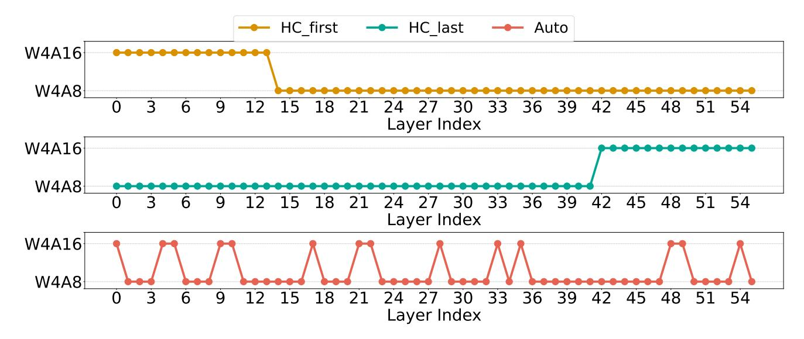

Figure 6: **(The layer-wise bit-width for Quamba2-8B-W4A***X.***)** We search the bit-width for Quamba2-8B-W4A*X* (the last row in red), which outperforms the handcraft counterparts shown in the first (HC\_first) and the second (HC\_last) rows.

Analysis on W4AX latency and accuracy trade-off. In Figure 7, we show our W4AX models outperform naive handcrafted models in MMLU [Hendrycks et al., 2020] fiveshot accuracy, and place at the Pareto-frontier of prefilling latency (time-to-first-token, TTFT) trade-off. In this experiment, we adjusted the ratios of W4A16 and W4A8 (e.g., 1:2) in Quamba2-8B and used evolutionary search to find the mixed precision configuration. As shown in the figure, the searched W4AX models in different ratios improve the accuracy of the 5-shot evaluation on MMLU compared to W4A8, introducing marginal pre-filling latency overheads (i.e., 140.7 vs. 158.3 ms). Moreover, the automatic designed W4AX models by our search algorithm are above naive handcrafted W4AX models in accuracy. This finding highlights the *challenges* of designing *mixed-precision* models for SSMs, as well as the limits of generalization [Zhao et al., 2024a, Kumar et al., 2025] of low-bit SSMs on large-scale datasets. We expect more advanced search algorithms to address the generalization issue in the future.

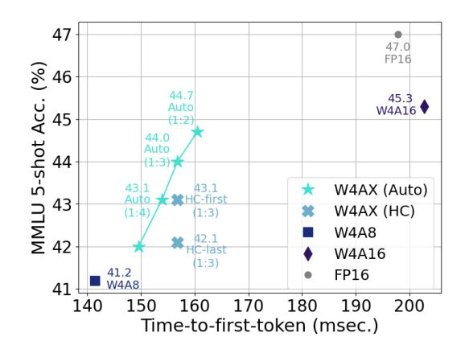

Figure 7: (Pareto front analysis for mixed-precision models.) Our W4AX models by searched (Auto) outperform naive handcrafted (HC) models in MMLU accuracy and prefilling latency trade-off.

### **E** Investigating Memory and Latency with Large Batch Sizes

**The cached state sizes.** Although the constant state nature of SSMs, the cached states grow *linearly* with respect to the input *batch size*. We show theoretical memory breakdowns versus batch size in Figure 8 (a). As the batch size increased, cached states occupied most of the total memory, making state loading and updating the bottleneck during generation. Our framework (W4A8) compresses and updates the states with 8-bit, thus decreasing overall memory usage and generation latency for cloud applications with large batch sizes.

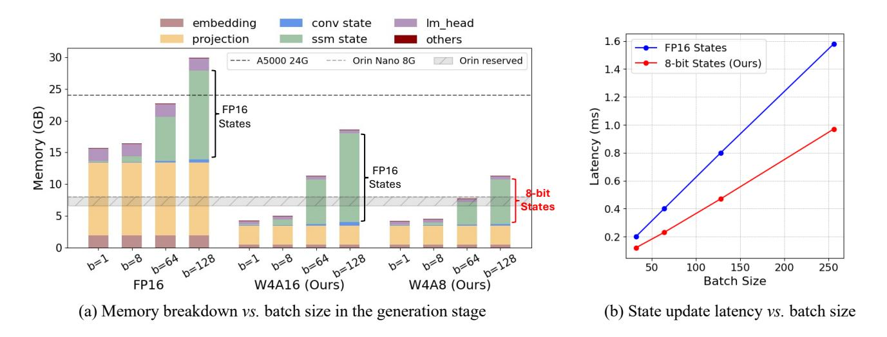

Figure 8: (Large batch inputs.) The cached states grow linearly with respect to the input batch size. For a batch size of 128, half-precision cached states use most of the memory (a), making state loading and updating the bottleneck during generation. Our framework (W4A8) compresses the states to 8-bit, thereby reducing the total memory and generation latency (b) with large batch size inputs for cloud-based applications.

Quantizing cached SSM states. We reduce generation latency by quantizing the cached SSM states to 8-bit for W4A8 and W8A8 models. Since the cached SSM states follow the head reordering and channel grouping indices from the SSM input (ref. Figure [4\)](#page-3-0), we apply the same head and channel groups to quantize each SSM state before caching them in memory. This finding eliminates the need for additional online reordering of SSM states and only requires calibrating the SSM quantization scales. Our approach introduces dstate × × floating-point scales with minimal latency overhead, while significantly reducing the state update latency, as shown in Figure [8](#page-17-0) (b).

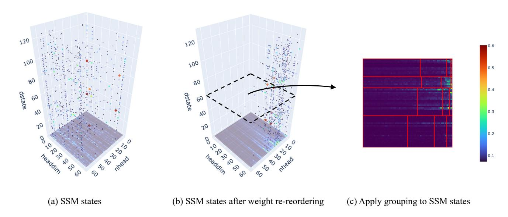

Figure 9: (SSM states.) The states are quantized before cached in memory. We apply the same head and channel groups from the SSM input to SSM states (b-c).

The roofline model. We show the roofline model of A5000 GPU in Figure [10](#page-18-0) (w-bit×a-bit in the figure), and profile the generation latency (i.e., time-per-output-token, TPOT) of Mamba2-8B on a A5000 with different batch sizes in Table [11.](#page-18-0) When the input batch size is small (e.g., b=1 in the table), the generation is memory-bound and therefore loading 4-bit weights (e.g., W4A8 and W4A16) improves the roofline model. As the batch size increased (e.g., b=64 in the table), the W4A16 models are bounded by hardware performance in terms of trillions of operations per second (TOPS). In contrast, the W4A8 and W8A8 models leverage 8-bit computation and deliver better TOPS. The ultimate TOPS of W4A8 is lower than W8A8 due to the extra steps for dequantizing weights from 4-bit to 8-bit (e.g., b=256 in the table). Our framework supports W8A8, W4A8, and W4A16 that are at the frontier of the roofline model to satisfy the deployment needs of most applications for both Mamba1 and Mamba2.

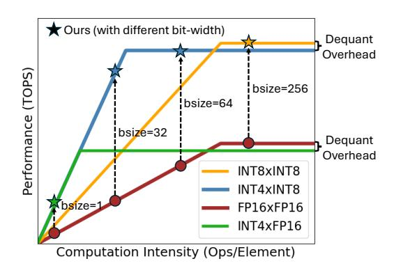

Figure 10: (Roofline model of A5000.)

Figure 11: (Mamba2-8B TPOT on A5000 24GB.) We compress the cached SSM states with 8-bit, enabling larger batch size inputs under the same memory constraints. We report latency in milliseconds (ms). OOM denotes out-of-memory.

| Bitwidth | b=1   | b=32  | b=64  | b=128 | b=256 |
|----------|-------|-------|-------|-------|-------|
| FP16     | 22.73 | 35.74 | 49.63 | OOM   | OOM   |
| W8A8     | 12.61 | 23.83 | 30.82 | 44.85 | 79.65 |
| W4A8     | 7.43  | 15.05 | 24.65 | 44.54 | 85.26 |
| W4A16    | 7.58  | 20.58 | 38.48 | 74.25 | OOM   |

Batch size vs. time-to-last-token latency across bit-widths. Figure [12](#page-18-1) shows the time-to-last-token (TTLT) of Mamba2-8B quantized with different bit-widths (e.g., W8A8, W4A8, and W4A16) supported by our framework on a A5000. We vary the batch size of the input from 1 to 64, and profile the end-to-end latency of pre-filling 2024 tokens and generating 2048 tokens (i.e., TTLT). The latency is estimated for the batch sizes that empirically do not fit A5000 and is represented with dashed lines with unfilled markers. We show that the W4A8 Mamba-8B model is suited for most latency-sensitive applications, serving with general batch sizes (i.e., range from 1 to 64) on both cloud and edge devices. In contrast, W4A16 serves as a better option for personal applications (i.e., batch size equal to one) on mobile platforms as it features higher average accuracy (ref. Table [11](#page-14-1) and [7\)](#page-7-1). For large batch size (i.e., greater than 128), the W8A8 model delivers the highest performance in terms of latency. Our framework supports all options on the frontier of the roofline model, as shown in Figure [10.](#page-18-0)

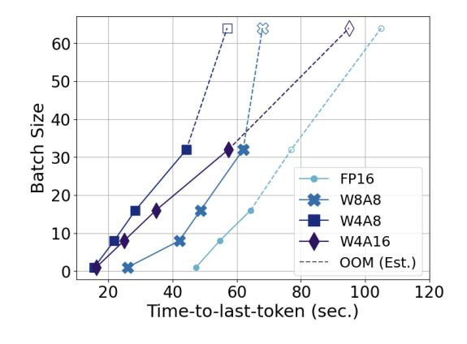

Figure 12: (Batch size vs. time-to-last-token.) W4A8 is suited for most applications serving with general batch sizes among all supported bit-widths.

## F Accuracy-latency Trade-off

Accuracy vs. latency across backbone models. Figure [13](#page-19-0) illustrates the average accuracy across six zero-shot tasks (y-axis) versus latency (x-axis, in log-scale) on a cloud-based A5000 GPU (a) and an Orin Nano 8G (b). We profile TTLT (time-to-last-token) in seconds (sec.), with 2K input tokens and 2K generated tokens on the A5000 GPU. For the Orin Nano 8G, we profile the TTLT with prefilling of 512 input tokens and 512 generated tokens. For QuaRot [\[Ashkboos et al.,](#page-10-4) [2024b\]](#page-10-4), we use the official implementation and profile latency for Llama2 [\[Touvron et al.,](#page-12-19) [2023\]](#page-12-19). We profile Llama3 [\[Grattafiori](#page-11-17) [et al.,](#page-11-17) [2024\]](#page-11-17) and use the official QServe implementation [\[Lin et al.,](#page-11-6) [2024b\]](#page-11-6) to quantize it to W4A8KV4. We note that the latencies and memory denoted with dashed lines and circles are merely estimated. For example, FP16 Llama2 13B is too

large for the A5000's 24GB GPU memory, and W4A4 Llama2 13B also exceeds the capacity of Orina Nano. Quamba2 models are on the Pareto frontier and offer the best trade-off between average accuracy and latency, as well as smallest memory footprints, outperforming other low bit-width SSM and Transformer baselines.

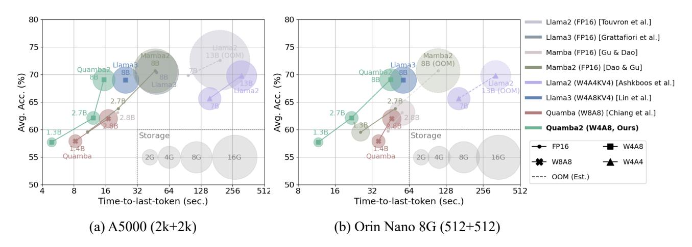

Figure 13: (Pareto front analysis for accuracy vs. latency.) Quamba2 models (green) are on the Pareto front over other low bit-width SSM (red) and Transformer (purple) baselines, while also featuring lower memory footprints as evidenced in the size of the circle.

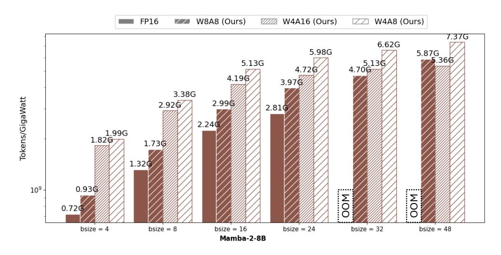

Figure 14: (Energy efficiency analysis on A5000.) Each request is prefilled with 1024 tokens and generates 1024 new tokens. The energy efficiency is measured with token per Gigawatt.

To assess the practical efficiency of Quamba2, we conduct energy profiling on an A5000 GPU and an Orin Nano 8G, both of which are representative of cloud and edge platforms. On Orin Nano, each request is prefilled with 512 tokens and generates 512 new tokens, where we record the total energy consumption in joules per request (Js/req.). As shown in Table [13,](#page-19-1) full-precision (FP16) models exceed the device's 8 GB memory limit, resulting in out-of-memory (OOM) errors

G Energy Profiling Table 13: (Energy profiling on Nano.) Joules per request (Js/req.) is reported. Each request is prefilled with 512 tokens and 512 generated tokens. Lower is better (↓).

| Method            | Bit-width     | Mamba2-8B        |  |
|-------------------|---------------|------------------|--|
| -                 | FP16          | OOM              |  |
| Quamba2 (Ours) | W4A8 W4A16 | 231.23 225.46 |  |

during inference. In contrast, quantized models like W4A8 and W4A16 handle each request with 231.23 J and 225.46 J, respectively, while remaining deployable.

On cloud GPUs, we evaluate energy efficiency in terms of tokens per Gigawatt to align with the industrial computing power metric. In Figure [14,](#page-19-2) we visualize the energy efficiency of Mamba2-8B on an A5000 GPU with 24GB memory under different batch sizes and quantization settings. Each request is prefilled with 1024 tokens and generates 1024 new tokens. Quamba2 consistently achieves higher throughput-per-energy than the FP16 model. This shows Quamba2 as an effective deployment framework for both resource-constrained and cloud-serving scenarios.