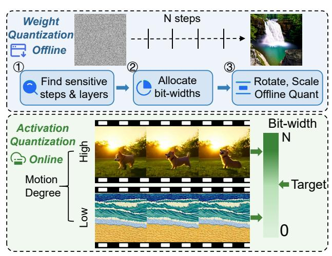

# 3.2. Joint Optimization of HLC and AIGQ

To enhance the efficiency of Diffusion Transformers (DiTs) in video generation, we propose a joint optimization framework that integrates *Hierarchical Latent Caching* with *Adaptive Importance-Guided Quantization*, as shown in Figure 2. This framework stems from a novel observation: within the iterative denoising process, the relative importance of different layers and timesteps fluctuates dynamically, depending on the evolution of latent representations and cross-step feature interactions. Crucially, we find that certain layers play a pivotal role in refining spatial structure, while others primarily contribute to temporal smoothness. Similarly, the degree of information retention across timesteps varies non-uniformly, creating opportunities for selectively caching features and adjusting quantization granularity based on their functional relevance.

**Hierarchical Latent Caching.** Unlike conventional caching mechanisms relying on static cache intervals, inspired by [3, 15, 22, 28], our approach leverages an adaptive refresh strategy that dynamically determines where recomputation is necessary. Given that DiTs lack the explicit skip connections found in U-Net architectures, we model cache decisions using an importance-aware metric that considers inter-step feature variations. Specifically, at timestep t, we compute a timestep-wise feature divergence score  $\mathcal{D}_t^{(l)}$ :

$$\mathcal{D}_{t}^{(l)} = \frac{\|p_{t}^{(l)} - p_{t-k}^{(l)}\|_{1}}{k} \cdot \|\nabla_{t} m_{t}^{(l)}\|, \tag{5}$$

where  $p_t^{(l)}$  represents the activation at layer l and timestep t, k is the last cached step, and  $\nabla_t m_t^{(l)}$  denotes the inter-frame gradient of the feature map, capturing the rate of change in motion across consecutive timesteps.

Based on the feature divergence score, we establish a *cache-refresh decision function*:

$$\tau_t^{(l)} = \begin{cases} \tau_{\text{max}}, & \text{if } \mathcal{D}_t^{(l)} < \delta_1, \\ \tau_{\text{mid}}, & \text{if } \delta_1 \le \mathcal{D}_t^{(l)} < \delta_2, \\ \tau_{\text{min}}, & \text{if } \mathcal{D}_t^{(l)} \ge \delta_2, \end{cases}$$
(6)

where  $\tau_t^{(l)}$  determines the number of steps before recomputation, adapting caching frequency to content variations.

Figure 3. AIGQ: adaptive importance-guided quantization.

Adaptive Importance-Guided Quantization. While caching effectively reduces redundant computations, quantization offers an orthogonal opportunity to optimize inference efficiency. However, naive low-bit quantization risks degrading spatial and temporal coherence, particularly in critical layers. To address this, we introduce an importance-driven mixed-precision quantization scheme that dynamically assigns bit-widths to both weights and activations based on their perceptual relevance, as shown in Figure 3.

(1) Weight Quantization: Instead of applying a uniform bit-width across all layers, inspired by [14, 39, 48], we allocate a quantization budget  $B_{\rm total}$  by first estimating layer sensitivity. Specifically, we evaluate each layer based on its numerical error, perceptual distortion, and temporal dynamics. Layers that contribute significantly to fine-grained texture reconstruction or motion continuity are assigned higher precision, whereas those with minimal impact on perceptual quality are allocated lower bit-widths.

To further mitigate quantization-induced artifacts, we incorporate a channel-balancing mechanism that combines scaling and rotation. The scaling-based approach corrects static imbalances originating from pretrained scale shift tables, while the rotation-based method addresses dynamic variations caused by timestep embeddings. By first applying scaling to stabilize the initial activation distribution, followed by a lightweight rotation transformation, we ensure a more uniform data distribution across channels, reducing extreme outliers that could degrade quantization performance. Given the total bit-width budget, we iteratively allocate precision levels while satisfying:

$$\sum_{l} B(l) \le B_{\text{total}},\tag{7}$$

where bit-widths are assigned to layers that exhibit higher sensitivity to quantization. This adaptive allocation ensures that critical layers retain sufficient precision while computational efficiency is maximized, enabling effective compression with minimal impact on generative quality. (2) Activation Quantization: Beyond optimizing weight precision, we extend our quantization strategy to activation, where bit-widths are dynamically modulated based on timestep-level redundancy. Inspired by [3, 6, 15], We observe that not all timesteps contribute equally to the final output quality. In early stages or during redundant intermediate steps, feature representations often exhibit high similarity, suggesting that lower precision is sufficient without compromising perceptual fidelity. Conversely, during critical transitions—such as the emergence of fine details or significant structural changes—higher precision is essential to capture the complexity of the evolving content.

Based on the observation, we propose a novel timestepwise content-adaptive bit allocation function that tailors activation bit-widths to the specific demands of each step, thereby optimizing both computational efficiency and output quality. Formally, our allocation function is defined as:

$$\text{bit-width}(t) = \begin{cases} Bit_{\text{max}}, & \text{if } \mathcal{D}_t < \theta_1, \\ Bit_{\text{mid}}, & \text{if } \theta_1 \leq \mathcal{D}_t < \theta_2, \\ Bit_{\text{min}}, & \text{if } \mathcal{D}_t \geq \theta_2, \end{cases}$$
(8)

where  $\mathcal{D}_t$  represents a timestep-specific redundancy metric (e.g. distance between consecutive feature maps), and  $\theta_1$  and  $\theta_2$  are empirically determined thresholds that delineate low, medium, and high redundancy regimes. Here,  $Bit_{\max}$ ,  $Bit_{\min}$ , and  $Bit_{\min}$  denote the maximum, intermediate, and minimum bit-widths, respectively.

The intuition behind this design is straightforward yet powerful: steps with high feature redundancy (i.e.,  $\mathcal{D}_t \geq \theta_2$ ) can tolerate aggressive quantization to  $Bit_{\min}$ , as the information loss is minimal and does not degrade the generative process. In video generation, consecutive frames with subtle changes—like a static background—require less precision in activations, allowing us to allocate fewer bits without sacrificing visual coherence. In contrast, steps with low redundancy (i.e.,  $\mathcal{D}_t < \theta_1$ ), such as those involving abrupt scene transitions or the refinement of intricate textures, demand  $Bit_{\max}$  to preserve the fidelity of complex features. The intermediate range  $(Bit_{\min})$  serves as a balanced compromise for timesteps with moderate complexity, ensuring a smooth trade-off between efficiency and quality.

This adaptive strategy reduces memory footprint and computational overhead, and aligns quantization decisions with the intrinsic dynamics of the generative model. By adjusting activation precision dynamically, we avoid pitfalls of uniform quantization, which over-allocates resources to redundant steps or under-allocates to critical ones.

#### **Unified Optimization for Efficient Video Generation.**

By integrating *Hierarchical Latent Caching* (HLC) with *Adaptive Importance-Guided Quantization* (AIGQ), we construct a self-adaptive compute allocation strategy that minimizes unnecessary computation while preserving video generation quality. HLC uses  $\mathcal{D}_t^{(l)}$  in Equation (5) to assess

Figure 4. Spatial and temporal differences across adjacent layers for spatial-temporal attention, cross-attention, and feed-forward network.

feature divergence at timestep t, guiding adaptive caching. AIGQ leverages a related timestep-wise metric  $\mathcal{D}_t$ , derived from  $\mathcal{D}_t^{(l)}$  via feature similarity, to dynamically adjust activation bit-widths. For smaller skips (low  $\tau_t^{(l)}$  in Equation (6)), we use smaller bit-widths to exploit redundancy, while for larger skips (high  $\tau_t^{(l)}$  in Equation (6)), we apply smaller bit-widths to enhance precision in post-skip steps, ensuring video quality. This cohesive timestep-wise strategy optimizes computation and precision.

## 3.3. Structural Redundancy-Aware Pruning

To further enhance the efficiency of DiTs, we propose a novel *Structural Redundancy-Aware Pruning (SRAP)* mechanism. In Figure 4, SRAP adaptively prunes layers within a single timestep based on their internal feature similarity. Unlike conventional static layer pruning strategies that predefine a fixed subset of layers to be pruned, SRAP dynamically determines layer importance *at runtime* by analyzing the intrinsic similarity of intermediate representations. This allows us to minimize redundant computations.

Motivation: Layer-Wise Redundancy in DiTs. Studies in vision transformers show that early layers capture coarse-grained details, while deeper layers refine high-frequency components [9, 47]. However, in DiTs, Feature evolution is highly iterative across timesteps. We observe that certain layers within a single timestep exhibit significant representational overlap. This phenomenon suggests that some computations can be pruned without information loss. By quantifying this redundancy, we introduce a data-driven mechanism to selectively prune layers at inference time.

Quantifying Redundancy with Cosine Similarity. To determine which layers can be pruned, inspired by [7, 32], we compute a layer-wise cosine similarity score between consecutive layers at timestep t (Figure 4):

$$S_t^{(l,l+1)} = \frac{\langle p_t^{(l)}, p_t^{(l+1)} \rangle}{\|p_t^{(l)}\| \|p_t^{(l+1)}\|}, \tag{9}$$

where  $p_t^{(l)}$  and  $p_t^{(l+1)}$  represent the feature representations at layers l and l+1 within timestep t. The closer this score is to 1, the higher the redundancy between layers.

Based on the cosine similarity measure, we define a *layer* pruning probability function:

$$P_{\text{prune}}^{(l)} = \begin{cases} 1, & \text{if } S_t^{(l,l+1)} > \tau_{\text{high}}, \\ P_{\text{base}}, & \text{if } \tau_{\text{low}} \le S_t^{(l,l+1)} \le \tau_{\text{high}}, \\ 0, & \text{if } S_t^{(l,l+1)} < \tau_{\text{low}}, \end{cases}$$
(10)

where  $\tau_{\rm high}$  and  $\tau_{\rm low}$  define redundancy thresholds, and  $P_{\rm base}$  is a baseline probability allowing occasional pruning when similarity is moderate. If two layers exhibit strong redundancy  $(S_t^{(l,l+1)} > \tau_{\rm high})$ , we completely bypass computations for  $p_t^{(l+1)}$ , reducing the inference cost.

**Adaptive Layer Pruning Strategy.** Rather than applying uniform layer pruning across all timesteps, we introduce an *adaptive pruning mechanism* that considers temporal feature dynamics. Specifically, we track the cumulative feature variation across previous timesteps:

$$\mathcal{V}_t = \sum_{i=0}^k \|p_t - p_{t-i}\|_1. \tag{11}$$

If  $\mathcal{V}_t$  is below a threshold  $\delta_{\text{low}}$ , indicating that the diffusion process is carefully refining rather than radically transforming content, we increase the layer pruning probability across all redundant layers. Conversely, if  $\mathcal{V}_t$  exceeds  $\delta_{\text{high}}$ , meaning that drastic changes are actively occurring, we reduce layer pruning to maintain information flow.

