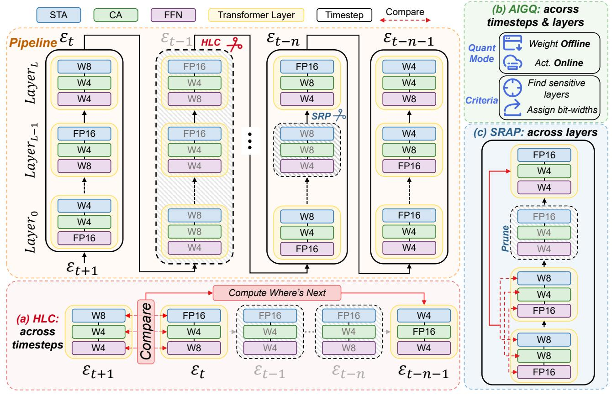

# 2.2. Model Quantization

Model quantization [5, 21, 44] is a pivotal technique for enhancing the efficiency of deep learning models by converting full-precision weights and activations into lower-bit representations, thereby reducing both memory footprint and computational load. Post-Training Quantization (PTO) [25] stands out as a particularly effective approach, enabling the compression of pre-trained models without necessitating extensive retraining. In the realm of diffusion models, PTQ has been successfully applied to U-Net-based architectures [38]. The advent of Diffusion Transformers (DiTs) has further propelled advancements in generative modeling, offering superior scalability and performance. However, the application of PTQ to DiTs presents unique challenges due to their architectural distinctions from U-Net-based models. Addressing this, ViDiT-Q [48] proposed a quantization scheme tailored for DiTs that achieves lossless 8-bit weight and activation quantization, resulting in significant memory and latency improvements. These advancements underscore the critical role of specialized PTQ methods in optimizing the performance and efficiency of diffusion models, particularly as architectures evolve from U-Net-based structures to transformer-based designs.

#### 2.3. Cache Mechanism

In the realm of diffusion models, cache-based acceleration techniques have been developed to enhance inference efficiency by reusing computations across timesteps. For instance, DeepCache [31] leverages temporal redundancy in U-Net architectures by caching high-level features during the denoising process, achieving significant speedups without necessitating model retraining. For DiT architectures, AdaCache [15] introduces a training-free method tailored for video Diffusion Transformers (DiTs), implementing a content-dependent caching schedule that adapts to each video's complexity, thereby optimizing the quality-latency  $\Delta$ -DiT [3] introduces a specialized caching mechanism known as  $\Delta$ -Cache, designed specifically for DiT architectures. This approach involves analyzing the role of each DiT block in image generation and selectively reuses feature offsets, accelerating inference without compromising image quality. However, optimizing these cache strategies remains challenging, particularly in balancing efficiency gains with the preservation of generation quality.

### 3. Method

#### 3.1. Preliminary

**Diffusion Models.** Diffusion models [4, 11, 16, 19, 34, 37, 40] are a class of generative models inspired by the process of diffusion in physics, where particles spread out over time due to random motion. In the context of generative modeling, diffusion models operate by gradually adding noise to data in a forward process, and then reversing this process to reconstruct the original data.

The forward diffusion process starts with a clean data sample  $x_0 \sim q(x)$  and progressively adds noise over T timesteps. The noisy data at timestep t is defined as:

$$x_t = \sqrt{\overline{\alpha}_t} x_0 + \sqrt{1 - \overline{\alpha}_t} \epsilon_t, \quad \epsilon_t \sim \mathcal{N}(0, I),$$
 (1) where  $\overline{\alpha}_t$  is a schedule controlling the noise level at timestep  $t$ , and  $\epsilon_t$  is Gaussian noise. As the diffusion process progresses,  $x_t$  becomes increasingly noisy, and by the final timestep  $T$ , it is pure Gaussian noise.

The reverse diffusion process aims to recover the clean data  $x_0$  from the noisy data  $x_t$ . The model learns a parameterized distribution  $p_{\theta}(x_{t-1}|x_t)$ , which predicts the clean data at timestep t-1 based on the noisy data at timestep t. This is typically modeled as a Gaussian distribution:

$$p_{\theta}(x_{t-1}|x_t) = \mathcal{N}\left(x_{t-1}; \mu_{\theta}(x_t, t), \Sigma_{\theta}(x_t, t)\right), \quad (2)$$
 where  $\mu_{\theta}(x_t, t)$  and  $\Sigma_{\theta}(x_t, t)$  are the mean and covariance predicted by the model at timestep  $t$ .

In a typical Diffusion Transformers [10, 17, 20, 27, 35, 45], the noisy data  $x_t$  is processed through a sequence of Transformer blocks. Each block consists of self-attention (SA), cross-attention (CA), and feed-forward networks (FFN). The self-attention mechanism allows the model to capture complex dependencies within the data, while the cross-attention layers integrate additional conditional information, like class labels or textual descriptions. **Model Quantization.** Quantization [33] is a technique employed to reduce the computational and memory demands by representing weights and activations with lower precision. This process involves approximating high-precision values with low-bit representations, thereby ac-

celerating inference and decreasing storage requirements. Formally, consider a neural network with L layers, where each layer l has weights  $W^{(l)}$  and activations  $X^{(l)}$ . The objective of quantization is to find proper bit-widths that minimizes the discrepancy between the original and quantized models. In uniform quantization, both weights and activations are mapped to discrete levels within a fixed range. The quantization function Q for a tensor x with b-bit representation is defined as:

$$x_{\text{int}} = Q(x; s, z, b) = \text{clamp}\left(\left\lfloor \frac{x}{s} \right\rceil + z, 0, 2^b - 1\right), \quad (3)$$

where s is the scaling factor, z is the zero point,  $\lfloor \cdot \rceil$  denotes rounding to the nearest integer, and  $\operatorname{clamp}(\cdot, a, c)$  restricts the values to the interval [a, c]. The scaling factor s is typically determined by the range of x:

$$s = \frac{\max(x) - \min(x)}{2^b - 1}.$$
(4)

Quantization error arises from two primary sources: clipping (or clamping) error and rounding error. Clipping error occurs when the dynamic range of x exceeds the representable range, leading to saturation. Rounding error results from mapping continuous values to discrete levels. These errors are influenced by factors such as the bit-width b, the distribution of x, and the chosen quantization parameters.

Figure 2. The overview of QuantCache with (a) HLC, (b) AIGQ, (c) SRAP. STA, CA, and FFN respectively refer to spatial-temporal attention, cross attention, and feedforward network in a Transformer layer.

In Diffusion Transformers (DiTs), quantization presents unique challenges. The isotropic architecture of DiTs [3], lacking the skip connections found in U-Net structures, makes traditional feature map caching methods less effective. We propose QuantCache, a novel training-free inference acceleration framework that jointly optimizes hierarchical latent caching, adaptive importance-guided quantization, and structural redundancy-aware pruning.

