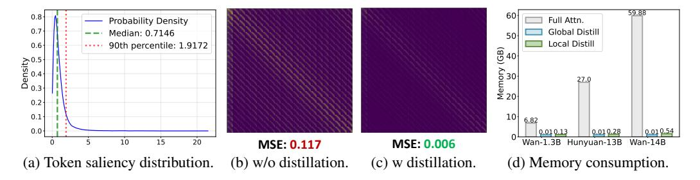

# 3.1.1 POST-TRAINING QUANTIZATION (PTQ)

Model Quantization (Gholami et al., 2022; Chitty-Venkata et al., 2023) reduces weights/activations from floating-point (FP32) to low-bit integers (e.g., INT8). Given an floating-point tensor  $\mathbf{X} \in \mathbb{R}^d$  with dimension d, quantization maps  $\mathbf{X}$  to a discrete representation  $\mathbf{X}_{\mathbf{Q}} \in \{0, 1, \dots, 2^b - 1\}^d$  as:

$$\mathbf{X}_{Q} = \operatorname{clip}\left(\left\lfloor \frac{\mathbf{X}}{s} \right\rfloor + z, 0, 2^{b} - 1\right), \quad Q(\mathbf{X}) = s \cdot (\mathbf{X}_{Q} - z), \tag{1}$$

with scale s, zero-point z, and bit-width b,  $Q(\mathbf{X})$  denotes the de-quantized value. Post-training Quantization (PTQ) (Wei et al., 2024; Wu et al., 2024) calibrates (s,z) on a small dataset by minimizing reconstruction error:

$$\mathcal{L}_{\text{quant}} = \min_{s,z} \sum_{\mathbf{X}_i \in \mathcal{D}_{\text{cal}}} \|\mathbf{X}_i - Q(\mathbf{X}_{Q_i}; s, z)\|_2^2.$$
 (2)

Notably, PTQ avoids retraining the model weights, thus being computationally efficient.

### 3.1.2 Sparse Attention

Sparse attention (Zhang et al., 2025b; Xi et al., 2025; Yuan et al., 2024) prunes token pairs via a mask  $\mathbf{M} \in \{0,1\}^{L \times L}$ , reducing complexity from  $\mathcal{O}(L^2)$  to near-linear (L is the sequence length). Given  $\mathbf{X} \in \mathbb{R}^{L \times d_{\mathrm{in}}}$  and query, key, value projection matrices  $\mathbf{W}_q, \mathbf{W}_k, \mathbf{W}_v \in \mathbb{R}^{d_{\mathrm{out}} \times d_{\mathrm{in}}}$ , sparse attention computes:

$$\mathbf{Q} = \mathbf{X} \mathbf{W}_{q}^{\top}, \quad \mathbf{K} = \mathbf{X} \mathbf{W}_{k}^{\top}, \quad \mathbf{V} = \mathbf{X} \mathbf{W}_{v}^{\top},$$

$$\operatorname{SparseAttention}(\mathbf{Q}, \mathbf{K}, \mathbf{V}; \mathbf{M}) = \operatorname{softmax} \left( \frac{\mathbf{Q} \mathbf{K}^{\top}}{\sqrt{d_{k}}} \odot \mathbf{M} \right) \mathbf{V}, \tag{3}$$

where  $\odot$  denotes element-wise multiplication.

Figure 3: **The motivation and effect of Multi-Scale Salient Attention Distillation.** (a): Token saliency distribution of Wan2.1-1.3B (Wan et al., 2025) *block19 head1*. Only less than 10% tokens are salient. (b)(c): Visualization of attention difference between quantized model and FP model. (d): Memory consumption of different attention distillation.

