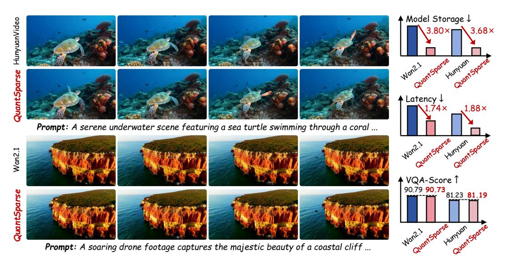

# QUANTSPARSE: COMPREHENSIVELY COMPRESSING VIDEO DIFFUSION TRANSFORMER WITH MODEL QUANTIZATION AND ATTENTION SPARSIFICATION

Weilun Feng $^{1,2}$ , Chuanguang Yang $^{1}$ , Haotong Qin $^{3}$ , Mingqiang Wu $^{1,2}$ , Yuqi Li $^{4}$ , Xiangqi Li $^{1,2}$ , Zhulin An $^{1}$ , Libo Huang $^{1}$ , Yulun Zhang $^{5}$ , Michele Magno $^{3}$ , Yongjun Xu $^{1}$ 

&lt;sup>4City College of New York, City University of New York, USA 5Shanghai Jiao Tong University {fengweilun24s, yangchuanguang, lixiangqi24s, anzhulin, xyj}@ict.ac.cn {haotong.qin, michele.magno}@pbl.ee.ethz.ch, wumingqiang25@mails.ucas.ac.cn, {yuqili010602, www.huanglibo, yulun100}@gmail.com

Figure 1: **QuantSparse** effectively quantizes Wan2.1-14B (Wan et al., 2025) and Hunyuan-Video (Kong et al., 2024) to W4A8 with 15% attention density without compromising visual quality.

