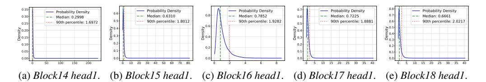
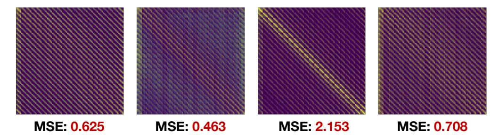
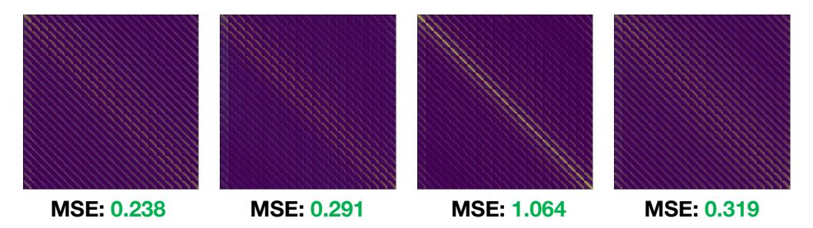
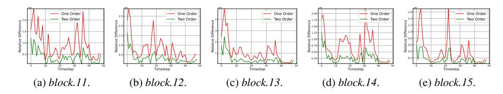

# E VBENCH EVALUATION RESULTS

We present the VBench (Huang et al., 2024b) evaluation results in Tab. 7. Under the comprehensive evaluation of all 8 dimensions, the naive combination of Q-VDiT (Feng et al., 2025c), Quarot (Ashkboos et al., 2024) and SVG (Xi et al., 2025) all show significant performance degradation, which fully demonstrates the disadvantage of simply combining existing quantization and sparse attention methods. While QuantSparse achieves comprehensive SOTA performance in all bit settings of all models, and is almost lossless compared with FP model, even better in some dimensions. For Wan2.1-14B (Wan et al., 2025) under W4A8, QuantSparse achieves 63.55 and 63.81 under 25% and 15% attention density, respectively, surpassing 63.38 of FP model.

Figure 6: More token saliency distribution of Wan2.1-1.3B (Wan et al., 2025).

Figure 7: More token saliency distribution of HunyuanVideo-13B (Kong et al., 2024).

### F MORE ANALYSIS OF MULTI-SCALE SALIENT ATTENTION DISTILLATION

We present more analysis of the proposed Multi-Scale Salient Attention Distillation (MSAD) here.

We conducted quantitative experiments to test the impact of quantization and sparsification on attention shift by measuring the attention Mean Square Error (MSE). The results are collected from 1000 random samples on Wan2.1-1.3B (Wan et al., 2025) under W4A8 and 40% attention density. The results are presented in Tab. 8. The attention shift caused by the simple combination of quantization and sparsification methods is much greater than the sum of individual shifts. This proves the joint effect of quantization and sparsification on attention error, and our core motivation "amplified attention shift".

Table 8: Quantitative experiment on attention shift caused by different compression techniques.

| Method                                        | Attention Shift |
|-----------------------------------------------|-----------------|
| Quantization (QuaRot (Ashkboos et al., 2024)) | 0.216           |
| Sparsification (SVG (Xi et al., 2025))        | 0.134           |
| Quantization+Sparsification                   | 0.685           |

We supplement 4 additional attention map comparisons in Fig. 8 and Fig. 9, showing the attention distribution difference between the FP model and quantized model. The results are collected from Wan2.1-1.3B under W4A8.

Each column in Fig. 8 and Fig. 9 corresponds to the attention difference between the same attention map before and after the proposed distillation MSAD. This indicates that our MSAD effectively alleviates the attention shift.

Figure 8: Attention differences between FP model and quantized model without distillation.

Figure 9: Attention differences between FP model and quantized model with distillation.

We present more visualization of heavy-tail token saliency distribution in Fig. 6 and Fig. 7. It can be seen that a significantly heavy-tailed token saliency phenomenon appears in different blocks of Wan2.1 (Wan et al., 2025) and HunyuanVideo (Kong et al., 2024), which fully shows that our salient local distillation is meaningful.

To further prove the effect of top-k salient queries selection, we compare with random selection methods and present the results in Tab. 9. Compared with random selection, our top-k salient selection further improves the PSNR from 15.49 to 16.82, fully demonstrating the effectiveness of our local distillation.

Table 9: Ablation results of local distillation.

| Method  | VQA↑                   | PSNR↑           | SSIM↑            | LPIPS↓           |
|---------|------------------------|-----------------|------------------|------------------|
| None    | 81.92                  | 14.35           | 0.486            | 0.425            |
| Random  | 83.17                  | 15.49           | 0.523            | 0.372            |
| Salient | 86.95 +5.03 | $16.82_{+2.47}$ | $0.561_{+0.075}$ | $0.325_{-0.100}$ |

Figure 10: More residual temporal difference distribution of HunyuanVideo-13B (Kong et al., 2024).

