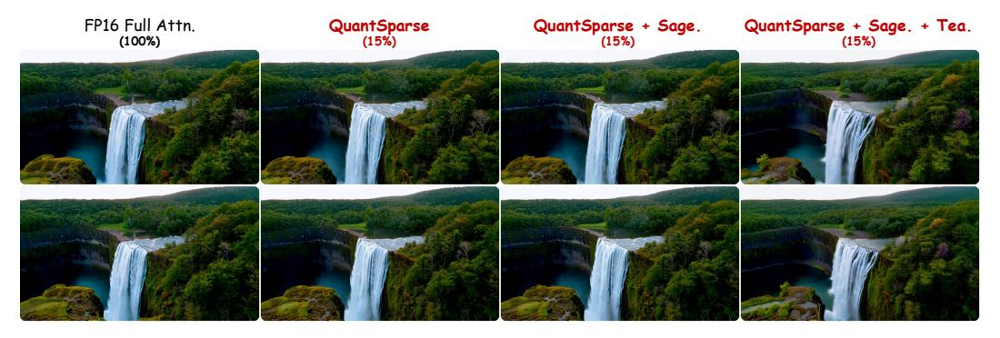

# J COMBINATION WITH OTHER ACCELERATION TECHNIQUES

To further validate the integration ability of QuantSparse with other acceleration techniques, we combined it with existing attention quantization techniques SageAttention (Zhang et al., 2024b) and cache techniques TeaCache (Liu et al., 2024a), and presented the results in Tab. 16. All the experiments are conducted on Wan2.1-14B (Wan et al., 2025) under W4A8 quantization setting. We apply SageAttention by quantizing attention into 8-bit. For TeaCache, we set the threshold as 0.16 to ensure performance.

It can be seen that, despite retaining only 15% attention density under W4A8 quantization, the combination of QuantSparse and SageAttention still incurs almost no performance loss. This indicates that QuantSparse is highly friendly to sparsification and quantization, fully demonstrating the necessity of attention distillation and second-order reparameterization. Although further adding TeaCache may result in a slight performance decrease, it can bring significant additional inference acceleration. This provides a further trade-off between performance and inference speed, and also demonstrates the effectiveness of combining QuantSparse with cache-based methods.

Table 15: Sparse attention reparameterization resource report. 'None' denotes Non-Reparameterization.

| Method           | Inference Ov          | erload                 | Performance     |                  |  |  |  |
|------------------|-----------------------|------------------------|-----------------|------------------|--|--|--|
|                  | GPU Memory (GB)↓      | DiT Time (s)↓          | PSNR↑           | LPIPS↓           |  |  |  |
| Wan2.1 1.3B      |                       |                        |                 |                  |  |  |  |
| None             | 5.44                  | 312                    | 10.57           | 0.587            |  |  |  |
| +First           | 5.84 +7%   | $313_{+0.3\%}$         | 12.76           | 0.493            |  |  |  |
| +Second          | 5.93 +9%   | $313_{+0.3\%}$         | 13.55           | 0.427            |  |  |  |
| QuantSparse      | 5.93 +9%   | 313 +0.3 %  | $15.22_{+4.65}$ | $0.338_{-0.249}$ |  |  |  |
| HunyuanVideo 13B |                       |                        |                 |                  |  |  |  |
| None             | 24.34                 | 725                    | 16.27           | 0.472            |  |  |  |
| +First           | 26.51 +9%  | 729 +0.6%   | 18.25           | 0.381            |  |  |  |
| +Second          | 27.02 +11% | $730_{+0.7\%}$         | 19.03           | 0.317            |  |  |  |
| QuantSparse      | 27.02 +11% | $731_{+0.8\%}$         | $20.86_{+4.59}$ | $0.272_{-0.200}$ |  |  |  |
| Wan2.1 14B       |                       |                        |                 |                  |  |  |  |
| None             | 26.04                 | 2589                   | 14.16           | 0.445            |  |  |  |
| +First           | 27.86 +7%  | $2593_{+0.2\%}$        | 17.08           | 0.285            |  |  |  |
| +Second          | 28.14 +8%  | 2594 +0.2 % | 18.68           | 0.258            |  |  |  |
| QuantSparse      | 28.14 +8%  | 2594 +0.2 % | $18.72_{+4.56}$ | $0.240_{-0.205}$ |  |  |  |

We further provide more visualization results in Fig. 13. It can be seen that the combination of QuantSparse and other acceleration techniques not only shows almost no decrease in metrics but also maintains good visual effects without producing any decrease in visual quality.

Table 16: More efficiency comparison under W4A8 quantization setting. Sage. denotes SageAttention (Zhang et al., 2024b). Tea. denotes TeaCache (Liu et al., 2024a).

| Method                                                                |               | Density  | Quality |                      |       | Latency & Speed              |           |               |
|-----------------------------------------------------------------------|---------------|----------|---------|----------------------|-------|------------------------------|-----------|---------------|
| QuantSparse                                                           | SageAttention | TeaCache | Density | CLIPSIM ↑ | VQA↑  | $\Delta$ FSCore $\downarrow$ | DiT Time↓ | Speedup↑      |
| Wan $2.114\mathrm{B}(\text{CFG}=5.0,720\times1280p,\text{frames}=80)$ |               |          |         |                      |       |                              |           |               |
|                                                                       | Full Prec.    |          | 100%    | 0.182                | 90.79 | 0.000                        | 4031s     | 1.00×         |
| <b>/</b>                                                              |               |          |         | 0.183                | 91.98 | 0.056                        | 2594s     | 1.55×         |
| ✓                                                                     | ✓             |          | 25%     | 0.181                | 91.70 | 0.240                        | 2480s     | 1.63×         |
| ✓                                                                     | ✓             | ✓        |         | 0.180                | 84.01 | 0.211                        | 1802s     | $2.24 \times$ |
| <b>/</b>                                                              |               |          |         | 0.182                | 90.73 | 0.042                        | 2315s     | 1.74×         |
| ✓                                                                     | ✓             |          | 15%     | 0.180                | 90.58 | 0.046                        | 2201s     | 1.83×         |
|                                                                       | ✓             | ✓        |         | 0.179                | 86.24 | 0.249                        | 1629s     | $2.47 \times$ |

Figure 13: Combining with other acceleration techniques visualization on Wan2.1-14B under W4A8 quantization setting.

