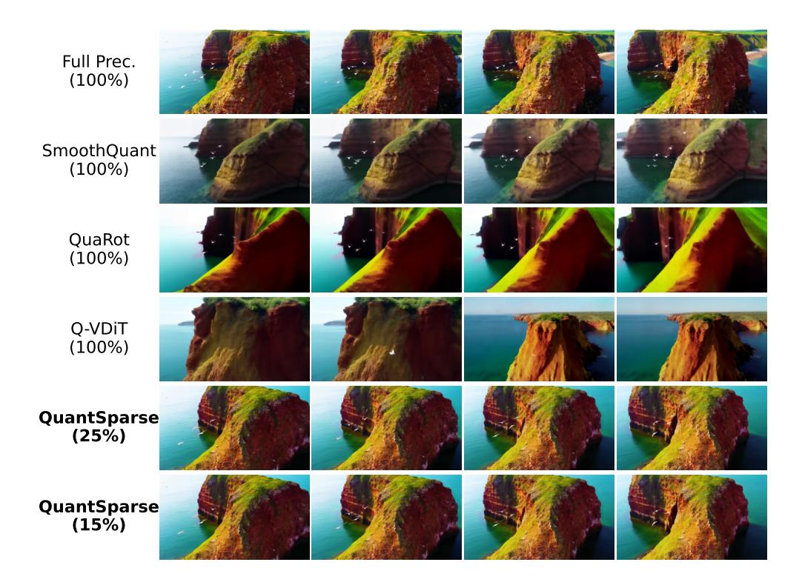
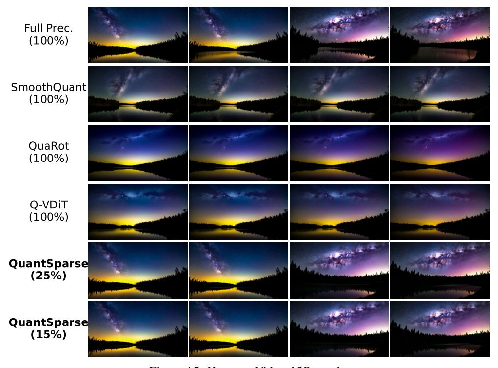
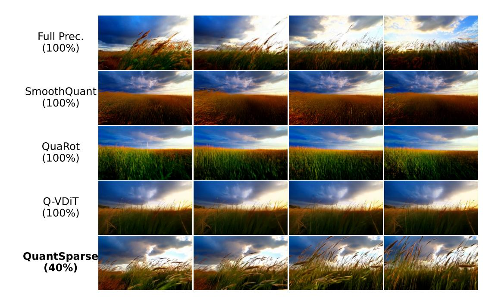

# M MORE VISUAL COMPARISON

In the following pages, we provide more visual comparisons of different-scale video-generation models. 'Full Prec.' denotes the Full Precision model. (xx%) denotes the attention density.

We also provide the used text prompt for each figure:

- 1. Fig. [14:](#page-27-0) *A soaring drone footage captures the majestic beauty of a coastal cliff, its red and yellow stratified rock faces rich in color and against the vibrant turquoise of the sea. Seabirds can be seen taking flight around the cliff's precipices. As the drone slowly moves from different angles, the changing sunlight casts shifting shadows that highlight the rugged textures of the cliff and the surrounding calm sea. The water gently laps at the rock base and the greenery that clings to the top of the cliff, and the scene gives a sense of peaceful isolation at the fringes of the ocean. The video captures the essence of pristine natural beauty untouched by human structures.*
- 2. Fig. [15:](#page-27-1) *A serene night scene in a forested area. The first frame shows a tranquil lake reflecting the star-filled sky above. The second frame reveals a beautiful sunset, casting a warm glow over the landscape. The third frame showcases the night sky, filled with stars and a vibrant Milky Way galaxy. The video is a time-lapse, capturing the transition from day to night, with the lake and forest serving as a constant backdrop. The style of the video is naturalistic, emphasizing the beauty of the night sky and the peacefulness of the forest.*
- 3. Fig. [16:](#page-28-0) *A serene underwater scene featuring a sea turtle swimming through a coral reef. The turtle, with its greenish-brown shell, is the main focus of the video, swimming gracefully towards the right side of the frame. The coral reef, teeming with life, is visible in the background, providing a vibrant and colorful backdrop to the turtle's journey. Several small fish, darting around the turtle, add a sense of movement and dynamism to the scene. The video is shot from a slightly elevated angle, providing a comprehensive view of the turtle's surroundings. The overall style of the video is calm and peaceful, capturing the beauty and tranquility of the underwater world.*

- 4. Fig. [17:](#page-28-1) *The video captures the majestic beauty of a waterfall cascading down a cliff into a serene lake. The waterfall, with its powerful flow, is the central focus of the video. The surrounding landscape is lush and green, with trees and foliage adding to the natural beauty of the scene. The camera angle provides a bird's eye view of the waterfall, allowing viewers to appreciate the full height and grandeur of the waterfall. The video is a stunning representation of nature's power and beauty.*
- 5. Fig. [18:](#page-29-0) *The dynamic movement of tall, wispy grasses swaying in the wind. The sky above is filled with clouds, creating a dramatic backdrop. The sunlight pierces through the clouds, casting a warm glow on the scene. The grasses are a mix of green and brown, indicating a change in seasons. The overall style of the video is naturalistic, capturing the beauty of the landscape in a realistic manner. The focus is on the grasses and their movement, with the sky serving as a secondary element. The video does not contain any human or animal elements.*
- 6. Fig. [19:](#page-29-1) *The video captures the majestic beauty of a waterfall cascading down a cliff into a serene lake. The waterfall, with its powerful flow, is the central focus of the video. The surrounding landscape is lush and green, with trees and foliage adding to the natural beauty of the scene. The camera angle provides a bird's eye view of the waterfall, allowing viewers to appreciate the full height and grandeur of the waterfall. The video is a stunning representation of nature's power and beauty.*

Figure 14: HunyuanVideo-13B results.

Figure 15: HunyuanVideo-13B results.

Figure 16: Wan2.1-14B results.

Figure 17: Wan2.1-14B results.

Figure 18: Wan2.1-1.3B results.

Figure 19: Wan2.1-1.3B results.