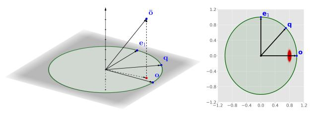

# 2 ANN QUERY AND QUANTIZATION

**ANN Query.** Suppose that we have a database of N data vectors in the D-dimensional Euclidean space. The approximate nearest neighbor (ANN) search query is to retrieve the nearest vector from the database for a given query vector  $\mathbf{q}$ . The question is usually extended to the query of retrieving the K nearest neighbors. For the ease of narrative, we assume that K=1 in our algorithm description, while all of the proposed techniques can be easily adapted to a general K. We focus on the in-memory ANN, which assumes that all the raw data vectors and indexes can be hosted in the main memory [4-6, 30, 32, 58, 65].

**Product Quantization.** Product Quantization (PQ) and its variants are a family of popular methods for ANN [8, 34, 36, 45, 66–68, 83, 85, 95] (for the discussion on a broader range of quantization methods, see Section 6). For a query vector and a data vector, these methods target to efficiently estimate their distance based on some pre-computed short quantization codes. Specifically, for PQ, it splits the D-dimensional vectors into M sub-segments (each sub-segment has D/M dimensions). For each sub-segment, it performs KMeans clustering on the D/M-dimensional vectors to obtain  $2^k$  clusters and then takes the centroids of the clusters as a sub-codebook where k is a tunable parameter which controls the size of the sub-codebook

 $^2{\rm The~error}$  bound is sharp in the sense that it achieves the asymptotic optimality shown in [3]. Detailed discussions can be found in Section 3.2.2.

&lt;sup>3We note that we do not explicitly materialize the codebook, but maintain it conceptually, as existing quantization methods such as PQ do.

|                         | RaBitQ (new)                               | PQ and its variants                          |
|-------------------------|--------------------------------------------|----------------------------------------------|
| Codebook                | Randomly transformed bi-valued vectors.    | Cartesian product of sub-codebooks.          |
| Quantization Code       | A bit string.                              | A sequence of 4-bit/8-bit unsigned integers. |
| Distance Estimator      | Unbiased and provides a sharp error bound. | Biased and provide no error bound.           |
| Implementation (single) | Bitwise operations. ★★                     | Looking up tables in RAM. ★                  |
| Implementation (batch)  | Fast SIMD-based operations. ★★★            | Fast SIMD-based operations. ★★★              |

Table 1: Comparison between RaBitQ and PQ and its variants. More ★'s indicates better efficiency.

(k=8) by default). The codebook of PQ is then formed by the Cartesian product of the sub-codebooks of the sub-segments and thus has the size of  $(2^k)^M$ . Correspondingly each quantization code can be represented as an M-sized sequence of k-bit unsigned integers. During the query phase, asymmetric distance computation is adopted to estimate the distance [45]. In particular, it pre-processes M look-up-tables (LUTs) for each sub-codebook when a query comes. The ith LUT contains  $2^k$  numbers which represent the squared distances between the vectors in the ith sub-codebook and ith sub-segment of the query vector. For a given quantization code, by looking up and accumulating the values in the LUTs for M times, PQ can compute an estimated distance.

Recently, [4, 5] propose a SIMD-based fast implementation for PQ (PQ Fast Scan, PQx4fs in short). They speed up the look-up and accumulation operations significantly, making PQ an important component in many popular libraries for in-memory ANN search such as Faiss from Meta [48], ScaNN from Google [37] and NGT-QG from Yahoo Japan [43]. At its core, unlike the original implementation of PQ which relies on looking up the LUTs in RAM, [4, 5] propose to host the LUTs in SIMD registers and look up the LUTs with the SIMD shuffle instructions. To achieve so, the method makes several modifications on PQ. First, in order to fit the LUTs into the AVX2 256-bit registers, it modifies the original setting of k = 8 to k = 4 so that in each LUT, there are only  $2^4$  floating-point numbers. It further quantizes the numbers in the LUT to be 8-bit unsigned integers so that one LUT takes the space of only 128  $(2^4 \times 8)$  bits. Thus, one AVX2 256-bit register is able to host two LUTs. Second, in order to look up the LUTs efficiently, the method packs every 32 quantization codes in a batch and reorganizes their layout. In this case, a series of operations can estimate the distances for 32 data vectors all at once. Without further specification, by PQ, we refer to PQx4fs by default because without the fast SIMD-based implementation, the efficiency of PQ is much less competitive in the in-memory ANN search [4, 5] (see Section 5.2.1).

Nevertheless, none of PQ and its variants provide a theoretical error bound on the errors of the estimated distances [8, 34, 36, 45, 66–68, 83, 85, 95], as explained in Section 1. Indeed, we find that the accuracy of PQ can be disastrous (see Section 5.2.3), e.g., on the dataset MSong, PQ cannot achieve  $\geq$  60% recall even with reranking applied. We note that Locality Sensitive Hashing (LSH) is a family of methods which promise rigorous theoretical guarantee [18, 38, 39, 78–80]. However, as is widely reported [6, 58, 85], these methods can hardly produce competitive empirical performance. Furthermore, their guarantees are on the accuracy of *c*-approximate NN query. In particular, LSH guarantees to return a data vector whose distance from the query is at most (1+c) times of a fixed radius *r* with high probability (if there exists a data vector

Table 2: Notations.

| 10010 21110101101            |                                                                                                     |  |  |
|------------------------------|-----------------------------------------------------------------------------------------------------|--|--|
| Notation                     | Definition                                                                                          |  |  |
| $\mathbf{o}_r, \mathbf{q}_r$ | The raw data and query vectors.                                                                     |  |  |
| o, q                         | The normalized data and query vectors.                                                              |  |  |
| $C, C_{rand}$                | The quantization codebook, its randomized version.                                                  |  |  |
| P                            | A random orthogonal transformation matrix.                                                          |  |  |
| $\bar{\mathbf{x}}$           | The code in $C$ s.t. $P\bar{\mathbf{x}}$ is the quantized vector of $\mathbf{o}$ .                  |  |  |
| Ō                            | The quantized vector of $\mathbf{o}$ in $C_{rand}$ , i.e., $\bar{\mathbf{o}} = P\bar{\mathbf{x}}$ . |  |  |
| $\bar{\mathbf{x}}_b$         | The quantization code of <b>o</b> as a <i>D</i> -bit string.                                        |  |  |
| $\mathbf{q'}$                | The inversely transformed query vector, i.e., $P^{-1}\mathbf{q}$ .                                  |  |  |
| $\bar{\mathbf{q}}$           | The quantized query vector of $\mathbf{q}'$ .                                                       |  |  |
| $\bar{\mathbf{q}}_{u}$       | The unsigned integer representation of $\bar{\mathbf{q}}$ .                                         |  |  |

whose distance from the query is within the radius r). Due to the relaxation factor c, there can be many that satisfy the statement. The guarantee of returning any of them does not help to produce high recall for ANN search. In contrast, a guarantee on the distance estimation can help to decide whether a data vector should be re-ranked for achieving high recall (see Section 4).

#### 3 THE RABITO METHOD

In this section, we present the details of RaBitQ. In Section 3.1, we present the index phase of RaBitQ, which normalizes the data vectors (Section 3.1.1), constructs a codebook (Section 3.1.2) and computes the quantized vectors of data vectors (Section 3.1.3). In Section 3.2, we introduce the distance estimator of RaBitQ, which is unbiased and provides a rigorous theoretical error bound. In Section 3.3, we illustrate how to efficiently compute the value of the estimator. In Section 3.4, we summarize the RaBitQ method. Table 2 lists the frequently used notations and their definitions.

#### 3.1 Quantizing the Data Vectors with RaBitQ

3.1.1 Converting the Raw Vectors into Unit Vectors via Normalization. We note that directly constructing a codebook for the raw data vectors is challenging for achieving the theoretical error bound because the Euclidean space is unbounded and the raw data vectors may appear anywhere in the infinitely large space. To deal with this issue, a natural idea is to normalize the raw vectors into unit vectors. Specifically, let  $\mathbf{c}$  be the centroid of the raw data vectors. We normalize the raw data vectors  $\mathbf{o}_r$  to be  $\mathbf{o} := \frac{\mathbf{o}_r - \mathbf{c}}{\|\mathbf{o}_r - \mathbf{c}\|}$ . Similarly, we normalize the raw query vector  $\mathbf{q}_r$  (when it comes in the query phase) to be  $\mathbf{q} := \frac{\mathbf{q}_r - \mathbf{c}}{\|\mathbf{q}_r - \mathbf{c}\|}$ . The following expressions bridge the distance between the raw vectors (i.e., our target) and the inner product of the normalized vectors.

$$\|\mathbf{o}_r - \mathbf{q}_r\|^2 = \|(\mathbf{o}_r - \mathbf{c}) - (\mathbf{q}_r - \mathbf{c})\|^2$$
 (1)

$$= \|\mathbf{o}_r - \mathbf{c}\|^2 + \|\mathbf{q}_r - \mathbf{c}\|^2 - 2 \cdot \|\mathbf{o}_r - \mathbf{c}\| \cdot \|\mathbf{q}_r - \mathbf{c}\| \cdot \langle \mathbf{q}, \mathbf{o} \rangle$$
 (2)

We note that  $\|\mathbf{o}_r - \mathbf{c}\|$  is the distance from the data vector to the centroid, which can be pre-computed during the index phase.  $\|\mathbf{q}_r - \mathbf{c}\|$ is the distance from the query vector to the centroid. It can be computed during the query phase and its cost can be shared by all the data vectors. Thus, based on Equation (2), the question of computing  $\|\mathbf{o}_r - \mathbf{q}_r\|^2$  is reduced to that of computing the inner product of two unit vectors  $\langle \mathbf{q}, \mathbf{o} \rangle$ . We note that in practice we can cluster the data vectors first (e.g., via KMeans clustering) and perform the normalization for data vectors within a cluster individually based on the centroid of the cluster. When considering the data vectors within a cluster, we normalize the query vector based on the corresponding centroid. In this way, the normalized data vectors are expected to spread evenly on the unit hypersphere, removing the skewness of the data (if any) to some extent. For the sake of convenience, in the following parts without further clarification, by the data and query vector, we refer to their corresponding unit vectors. With this conversion, we next focus on estimating the inner product of the unit vectors, i.e.,  $\langle \mathbf{q}, \mathbf{o} \rangle$ .

Constructing the Codebook. As mentioned in Section 3.1.1, the data vectors are supposed, to some extent, to be evenly spreading on the unit hypersphere due to the normalization. By intuition, our codebook should also spread evenly on the unit hypersphere. To this end, a natural construction of the codebook is given as follows.

$$C := \left\{ +\frac{1}{\sqrt{D}}, -\frac{1}{\sqrt{D}} \right\}^D \tag{3}$$

It is easy to verify that the vectors in C are unit vectors and the codebook has the size of  $|C| = 2^D$ .

However, such construction may favor some certain vectors and perform poorly for others. For example, for the data vector  $(1/\sqrt{D},...,1/\sqrt{D})$ , its quantized data vector (which corresponds to the vector in C closest from the data vector) is  $(1/\sqrt{D}, ..., 1/\sqrt{D})$ , and its squared distance to the quantized data vector is 0. In contrast, for the vector (1,0,...,0), its quantized data vector is also  $(1/\sqrt{D},...,1/\sqrt{D})$ , and its squared distance to the quantized data vector equals to  $2 - 2/\sqrt{D}$ . To deal with this issue, we inject the codebook some randomness. Specifically, let P be a random orthogonal matrix. We propose to apply the transformation P to the codebook (which is one type of the Johnson-Lindenstrauss Transformation [49]). Our final codebook is given as follows.

$$C_{rand} := \{ P\mathbf{x} | \mathbf{x} \in C \} \tag{4}$$

Geometrically, the transformation simply rotates the codebook because the matrix P is orthogonal, and thus, the vectors in  $C_{rand}$ are still unit vectors. Moreover, the rotation is uniformly sampled from "all the possible rotations" of the space. Thus, for a unit vector in the codebook C, it has equal probability to be rotated to anywhere on the unit hypersphere. This step thus removes the preference of the deterministic codebook C on specific vectors.

We note that to construct the codebook  $C_{rand}$ , we only need to sample a random transformation matrix *P*. To store the codebook  $C_{rand}$ , we only need to physically store the sampled P but not all the transformed vectors. The codebook constructed by this operation is much simpler than its counterpart in PQ and its variants which rely on approximately solving an optimization problem.

3.1.3 Computing the Quantized Codes of Data Vectors. With the constructed codebook, the next step is to find the nearest vector from  $C_{rand}$  for each data vector as its quantized vector. For a *unit* vector o, to find its nearest vector, it is equivalent to find the one which has the largest inner product with it. Let  $P\bar{\mathbf{x}} \in C_{rand}$  be the quantized data vector (where  $\bar{\mathbf{x}} \in C$ ). The following equations illustrate the idea rigorously.

$$\bar{\mathbf{x}} = \underset{\mathbf{x} \in C}{\operatorname{arg min}} \|\mathbf{o} - P\mathbf{x}\|^2 \tag{5}$$

$$= \underset{\mathbf{x} \in C}{\operatorname{arg min}} (\|\mathbf{o}\|^2 + \|P\mathbf{x}\|^2 - 2\langle \mathbf{o}, P\mathbf{x} \rangle)$$
(6)  
$$= \underset{\mathbf{x} \in C}{\operatorname{arg min}} (2 - 2\langle \mathbf{o}, P\mathbf{x} \rangle) = \underset{\mathbf{x} \in C}{\operatorname{arg max}} \langle \mathbf{o}, P\mathbf{x} \rangle$$
(7)

$$= \arg\min(2 - 2\langle \mathbf{o}, P\mathbf{x} \rangle) = \arg\max_{\mathbf{x} \in C} \langle \mathbf{o}, P\mathbf{x} \rangle \tag{7}$$

Equation (5) is based on the definition of the quantized data vector. Equation (6) is due to elementary linear algebra operations. Equation (7) is because Px and o are unit vectors. However, by Equation (7), it is costly to find the quantized data vector by physically transforming the huge codebook and finding the nearest vector via enumeration. We note that the inner product is invariant to orthogonal transformation (i.e., rotation). Thus, instead of transforming the huge codebook, we inversely transform the data vector o. The following expressions formally present the idea.

$$\langle \mathbf{o}, P\mathbf{x} \rangle = \langle P^{-1}\mathbf{o}, P^{-1}P\mathbf{x} \rangle = \langle P^{-1}\mathbf{o}, \mathbf{x} \rangle$$
 (8)

Recall that the entries of  $\mathbf{x} \in C$  are  $\pm 1/\sqrt{D}$ . To maximize the inner product, we only need to pick the  $\bar{\mathbf{x}} \in C$  whose signs of the entries match those of  $P^{-1}$ **o**. Then  $P\bar{\mathbf{x}}$  is the quantized data vector.

In summary, to find the nearest vector of a data vector o from  $C_{rand}$ , we can inversely transform **o** with  $P^{-1}$  and store the signs of its entries as a *D*-bit string  $\bar{\mathbf{x}}_b \in \{0,1\}^D$ . We call the stored binary string  $\bar{\mathbf{x}}_b$  as the *quantization code*, which can be used to re-construct the quantized vector  $\bar{\mathbf{x}}$ . Let  $\mathbf{1}_D$  be the D-dimensional vector which has all its entries being ones. The relationship between  $\bar{\mathbf{x}}_h$  and  $\bar{\mathbf{x}}$  is given as  $\bar{\mathbf{x}} = (2\bar{\mathbf{x}}_b - \mathbf{1}_D)/\sqrt{D}$ , i.e., when the *i*th coordinate  $\bar{\mathbf{x}}_b[i] = 1$ , we have  $\bar{\mathbf{x}}[i] = 1/\sqrt{D}$  and when  $\bar{\mathbf{x}}_b[i] = 0$ , we have  $\bar{\mathbf{x}}[i] = -1/\sqrt{D}$ . For the sake of convenience, we denote the quantized data vector as  $\bar{\mathbf{o}} := P\bar{\mathbf{x}}$ .

Till now, we have finished the pre-processing in the index phase. We note that the time cost in the index phase is not a bottleneck for our method, which is the same as in the cases of PQ and OPQ (a popular variant of PQ) [34]. For example, on the dataset GIST with one million 960-dimensional vectors, with 32 threads on CPU, our method, PQ and OPQ take 117s, 105s and 291s respectively. The space complexity of the methods is not a bottleneck for the inmemory ANN either, because the space consumption is largely due to the space for storing the raw vectors. As a comparison, each raw vector takes 32D bits (i.e., D floating-point numbers). Our method by default has D bits for a quantization code. PQ and OPQ by default have 2D bits for a quantization code (i.e., M = D/2) according to [25, 37], which is significantly smaller than the space for storing

### 3.2 Constructing an Unbiased Estimator

Recall that the problem of computing  $\|\mathbf{o}_r - \mathbf{q}_r\|^2$  can be reduced to that of computing the inner product of two unit vectors  $\langle \mathbf{o}, \mathbf{q} \rangle$ . In this section, we introduce an unbiased estimator for  $\langle o, q \rangle$ . Unlike PQ and its variants which simply treat the quantized data vector as the data vector for estimating the distances without theoretical error bounds, we first explicitly derive the relationship between  $\langle \mathbf{o}, \mathbf{q} \rangle$  and  $\langle \bar{\mathbf{o}}, \mathbf{q} \rangle$  in Section 3.2.1. We then construct an unbiased estimator for  $\langle \mathbf{o}, \mathbf{q} \rangle$  based on the derived relationships and present its rigorous error bound in Section 3.2.2.

Figure 1: Geometric Relationship among the Vectors.

3.2.1 Analyzing the Explicit Relationship between  $\langle \mathbf{o}, \mathbf{q} \rangle$  and  $\langle \bar{\mathbf{o}}, \mathbf{q} \rangle$ . We note that the relationship between  $\langle \mathbf{o}, \mathbf{q} \rangle$  and  $\langle \bar{\mathbf{o}}, \mathbf{q} \rangle$  depends only on the projection of  $\bar{\mathbf{o}}$  on the two-dimensional subspace spanned by o and q, which is illustrated on the left panel of Figure 1. For the component of  $\bar{\mathbf{o}}$  which is perpendicular to the subspace, it has no effect on the inner product  $\langle \bar{\mathbf{o}}, \mathbf{q} \rangle$ . The following lemma presents the specific result. The proof can be found in the technical report [33].

Lemma 3.1 (Geometric Relationship). Let o, q and o be any three unit vectors. When  $\mathbf{o}$  and  $\mathbf{q}$  are collinear (i.e.,  $\mathbf{o} = \mathbf{q}$  or  $\mathbf{o} = -\mathbf{q}$ ), we have

$$\langle \bar{\mathbf{o}}, \mathbf{q} \rangle = \langle \bar{\mathbf{o}}, \mathbf{o} \rangle \cdot \langle \mathbf{o}, \mathbf{q} \rangle \tag{9}$$

When o and q are non-collinear, we have

$$\langle \mathbf{\bar{o}}, \mathbf{q} \rangle = \langle \mathbf{\bar{o}}, \mathbf{o} \rangle \cdot \langle \mathbf{o}, \mathbf{q} \rangle + \langle \mathbf{\bar{o}}, \mathbf{e}_1 \rangle \cdot \sqrt{1 - \langle \mathbf{o}, \mathbf{q} \rangle^2} \tag{10}$$

where  $e_1$  is  $q-\langle q,o\rangle\,o$  with its norm normalized to be 1, i.e.,  $e_1$  :=  $\frac{q-\langle q,o\rangle o}{\|q-\langle q,o\rangle o\|}. \ \textit{We note that } o\perp e_1 \ (\textit{since}\ \langle o,e_1\rangle=0) \ \textit{and} \ \|e_1\|=1.$ 

Recall that we target to estimate  $\langle \mathbf{o}, \mathbf{q} \rangle$ . If we exactly know the values of all the variables other than  $\langle \mathbf{o}, \mathbf{q} \rangle$ , we can compute the exact value of  $\langle \mathbf{o}, \mathbf{q} \rangle$  by solving Equations (9) and (10). In particular, in Equations (9) and (10),  $\langle \bar{\mathbf{o}}, \mathbf{o} \rangle$  is the inner product between the quantized data vector and the data vector. Its value can be precomputed in the index phase.  $\langle \bar{\mathbf{o}}, \mathbf{q} \rangle$  is the inner product between the quantized data vector and the query vector. Its value can be efficiently computed in the query phase (we will specify in Section 3.3 how it can be efficiently computed). Thus, when o and q are collinear, we can compute the value of  $\langle \mathbf{o}, \mathbf{q} \rangle$  exactly by solving Equation (9), i.e.,  $\langle \mathbf{o}, \mathbf{q} \rangle = \frac{\langle \bar{\mathbf{o}}, \mathbf{q} \rangle}{\langle \bar{\mathbf{o}}, \mathbf{o} \rangle}$ 

When o and q are non-collinear (which is a more common case), in order to exactly solve the Equation (10), we need to know the value of  $\langle \bar{\mathbf{o}}, \mathbf{e}_1 \rangle$ . However, as  $\mathbf{e}_1$  depends on both  $\mathbf{o}$  and  $\mathbf{q}$  (which can be seen by its definition),  $\langle \bar{\mathbf{o}}, \mathbf{e}_1 \rangle$  can be neither pre-computed in the index phase (because it depends on q) nor computed efficiently in the query phase without accessing o.

We notice that although we cannot efficiently compute the exact value of  $\langle \bar{\mathbf{o}}, \mathbf{e}_1 \rangle^4$ , given the random nature of  $\bar{\mathbf{o}}$ , we explicitly know its distribution. Specifically, recall that we have sampled a random orthogonal matrix P, applied it to the codebook C and generated a randomized codebook  $C_{rand}$ .  $\bar{\mathbf{o}}$  is a vector picked from the randomized codebook  $C_{rand}$  and thus, it is a random vector.  $\langle \bar{\mathbf{o}}, \mathbf{o} \rangle$  and  $\langle \bar{\mathbf{o}}, \mathbf{e}_1 \rangle$  correspond to the projection of the random vector  $\bar{\mathbf{o}}$  onto two fixed directions (i.e., the directions are  $\mathbf{o}$  and  $\mathbf{e}_1$ , where  $\mathbf{o} \perp \mathbf{e}_1$ ). Thus, they are mutually correlated random variables.

We rigorously analyze the distributions of the random variables. The core conclusions of the analysis are briefly summarized as follows while the detailed presentation and proof are left in the technical report [33] due to the page limit. Specifically, our analysis indicates that when D ranges from  $10^2$  to  $10^6$ , it is always true that  $\langle \bar{\textbf{o}}, \textbf{o} \rangle$  has the expectation  $^5$  of around 0.8 and  $\langle \bar{\textbf{o}}, \textbf{e}_1 \rangle$  has the expectation of exactly 0. It further indicates that, with high probability, these random variables would not deviate from their expectation by  $\Omega(1/\sqrt{D})$ . This conclusion quantitatively presents the extent that the random variables concentrate around their expected values, which will be used later for analyzing the error bound of our estimator. To empirically verify our analysis, we repeatedly and independently sample the random orthogonal matrices P 105 times for a pair of fixed o, q in the 128-dimensional space. The right panel of Figure 1 visualizes the projection of  $\bar{\boldsymbol{o}}$  on the 2-dimensional space spanned by o, q with the red point cloud (each point represents the projection of an  $\bar{\mathbf{o}}$  based on a sampled random matrix P). In particular,  $\langle \bar{\mathbf{o}}, \mathbf{o} \rangle$  (the x-axis) is shown to be concentrated around 0.8.  $\langle \bar{\mathbf{o}}, \mathbf{e}_1 \rangle$  (the y-axis) is concentrated and symmetrically distributed around 0, which verifies our theoretical analysis perfectly.

3.2.2 Constructing an Unbiased Estimator for  $\langle \mathbf{o}, \mathbf{q} \rangle$ . Based on our analysis on Equation (9), for the case that  $\mathbf{o}$ ,  $\mathbf{q}$  are collinear,  $\langle \mathbf{o}, \mathbf{q} \rangle$  can be explicitly solved by  $\langle o,q\rangle=\frac{\langle \bar{o},q\rangle}{\langle \bar{o},o\rangle}$  . Thus, it is natural to conjecture that for the case that o,q are non-collinear,  $\frac{\langle \bar{o},q\rangle}{\langle \bar{o},o\rangle}$  should also be a good estimator for  $\langle o,q\rangle.$  We thus deduce from it as follows.

$$\frac{\langle \bar{\mathbf{o}}, \mathbf{q} \rangle}{\langle \bar{\mathbf{o}}, \mathbf{o} \rangle} = \frac{\langle \bar{\mathbf{o}}, \mathbf{o} \rangle \cdot \langle \mathbf{o}, \mathbf{q} \rangle + \langle \bar{\mathbf{o}}, \mathbf{e}_1 \rangle \cdot \sqrt{1 - \langle \mathbf{o}, \mathbf{q} \rangle^2}}{\langle \bar{\mathbf{o}}, \mathbf{o} \rangle}$$

$$= \langle \mathbf{o}, \mathbf{q} \rangle + \sqrt{1 - \langle \mathbf{o}, \mathbf{q} \rangle^2} \cdot \frac{\langle \bar{\mathbf{o}}, \mathbf{e}_1 \rangle}{\langle \bar{\mathbf{o}}, \mathbf{o} \rangle}$$
(11)

$$= \langle \mathbf{o}, \mathbf{q} \rangle + \sqrt{1 - \langle \mathbf{o}, \mathbf{q} \rangle^2} \cdot \frac{\langle \bar{\mathbf{o}}, \mathbf{e}_1 \rangle}{\langle \bar{\mathbf{o}}, \mathbf{o} \rangle}$$
(12)

where Equation (11) is by Equation (10) and Equation (12) simplifies Equation (11). We note that the last term in Equation (12) can be viewed as the error term of the estimator. Recall that based on our analysis in Section 3.2.1,  $\langle \bar{\mathbf{o}}, \mathbf{o} \rangle$  is concentrated around 0.8.  $\langle \bar{\mathbf{o}}, \mathbf{e}_1 \rangle$ has the expectation of 0 and is concentrated. It implies that the error term has 0 expectation and will not deviate largely from 0 due to the concentration. The following theorem presents the specific results. The rigorous proof can be found in the technical report [33].

THEOREM 3.2 (ESTIMATOR). The unbiasedness is given as

$$\mathbb{E}\left[\frac{\langle \bar{\mathbf{o}}, \mathbf{q} \rangle}{\langle \bar{\mathbf{o}}, \mathbf{o} \rangle}\right] = \langle \mathbf{o}, \mathbf{q} \rangle \tag{13}$$

&lt;sup>4In particular, when we say "computing the value" of a random variable, it refers to computing its observed value based on a certain sampled P.

&lt;sup>5The exact expected value is  $\mathbb{E}\left[\langle \bar{\mathbf{o}}, \mathbf{o} \rangle\right] = \sqrt{\frac{D}{\pi}} \frac{2\Gamma(\frac{D}{2})}{(D-1)\Gamma(\frac{D-1}{2})}$ , where  $\Gamma(\cdot)$  is the

The error bound of the estimator is given as

$$\mathbb{P}\left\{\left|\frac{\langle \bar{\mathbf{o}}, \mathbf{q} \rangle}{\langle \bar{\mathbf{o}}, \mathbf{o} \rangle} - \langle \mathbf{o}, \mathbf{q} \rangle\right| > \sqrt{\frac{1 - \langle \bar{\mathbf{o}}, \mathbf{o} \rangle^2}{\langle \bar{\mathbf{o}}, \mathbf{o} \rangle^2}} \cdot \frac{\epsilon_0}{\sqrt{D - 1}}\right\} \le 2\epsilon^{-c_0\epsilon_0^2} \quad (14)$$

where  $\epsilon_0$  is a parameter which controls the failure probability.  $c_0$  is a constant factor. The error bound can be concisely presented as

$$\left| \frac{\langle \bar{\mathbf{o}}, \mathbf{q} \rangle}{\langle \bar{\mathbf{o}}, \mathbf{o} \rangle} - \langle \mathbf{o}, \mathbf{q} \rangle \right| = O\left(\frac{1}{\sqrt{D}}\right) \text{ with high probability}$$
 (15)

Due to Equations (2) and (13), the unbiased estimator of  $\langle o,q\rangle$  can further induce an unbiased estimator of the squared distance between the raw data and query vectors. We provide empirical verification on the unbiasedness in Section 5.2.6. Besides, we would like to highlight that based on similar analysis, an alternative estimator  $\langle o,q\rangle \approx \langle \bar{o},q\rangle$ , i.e., by simply treating the quantized data vector as the data vector as PQ does, can be easily proved to be *biased*.

Equation (14) presents the error bound of our estimator. In particular, it presents a  $1-2\exp(-c_0\epsilon_0^2)$  confidence interval

$$\frac{\langle \bar{\mathbf{o}}, \mathbf{q} \rangle}{\langle \bar{\mathbf{o}}, \mathbf{o} \rangle} \pm \sqrt{\frac{1 - \langle \bar{\mathbf{o}}, \mathbf{o} \rangle^2}{\langle \bar{\mathbf{o}}, \mathbf{o} \rangle^2}} \cdot \frac{\epsilon_0}{\sqrt{D - 1}}$$
(16)

We note that the failure probability (i.e., the probability that the confidence interval does not cover the true value of  $\langle o, q \rangle$  is  $2\exp(-c_0\epsilon_0^2)$ . It decays in a quadratic-exponential trend wrt  $\epsilon_0$ , which is extremely fast. The length of the confidence interval grows linearly wrt  $\epsilon_0$ . Thus,  $\epsilon_0 = \Theta(\sqrt{\log(1/\delta)})$  corresponds to a failure probability of at most  $\delta$ , which indicates that a short confidence interval can correspond to a high confidence level. In practice,  $\epsilon_0$ is fixed to be 1.9 in pursuit of nearly perfect confidence (see Section 5.2.4 for the empirical verification study). Recall that  $\langle \bar{\mathbf{o}}, \mathbf{o} \rangle$  is concentrated around 0.8. Based on the values of  $\epsilon_0$  and  $\langle \bar{\mathbf{o}}, \mathbf{o} \rangle$ , the error bound can be further concisely presented as Equation (15), i.e., it guarantees an error bound of  $O(1/\sqrt{D})$ . According to a recent theoretical study [3], for D-dimensional vectors, with a short code of D bits, it is *impossible* in theory for a method to provide a bound which is tighter than  $O(1/\sqrt{D})$  (the failure probability is viewed as a constant). Thus, Equation (15) indicates that RaBitQ's error bound is sharp, i.e., it achieves the asymptotic optimality. The error bound will be later used in ANN search to determine whether a data vector should be re-ranked (see Section 4).

Furthermore, we note that RaBitQ provides an error bound in an additive form [3] (i.e., absolute error). When the data vectors are well normalized (recall that in Section 3.1.1 we normalize the data vectors), the bound can be pushed forward to a multiplicative form [41] (i.e., relative error). We leave the detailed discussion in the technical report [33] because it is based on an assumption that the data vectors are well normalized. Note that all other theoretical results introduced in this paper do not rely on any assumptions on the data, i.e., the additive bound holds regardless of the data distribution. In the present work, we adopt a simple and natural method of normalization (i.e., with the centroids of IVF as will be introduced in Section 4) to instantiate our scheme of quantization, while we have yet to extensively explore the normalization step itself. We shall leave it as future work to rigorously study the normalization problem.

