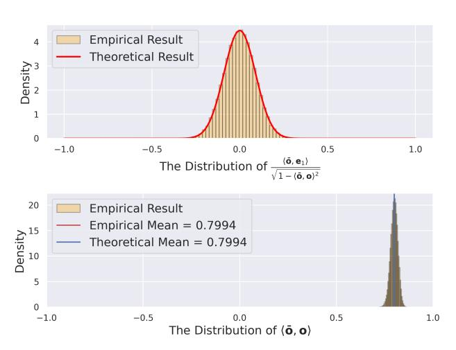

# The Joint Distribution of $(\langle \bar{o}, o \rangle, \langle \bar{o}, e_1 \rangle)$

We next analyze the distribution of  $\langle \bar{\mathbf{o}}, \mathbf{e}_1 \rangle$ . Recall that the randomness of both  $\langle \bar{o}, o \rangle$  and  $\langle \bar{o}, e_1 \rangle$  is due to the randomness of  $\bar{o}$  (which is further due to the randomness of P). These random variables are correlated with each other, which is undesirable for subsequent analysis. We first consider decorrelating the random variables by representing  $\langle \bar{\mathbf{o}}, \mathbf{e}_1 \rangle$  with a function of  $\langle \bar{\mathbf{o}}, \mathbf{o} \rangle$  and a random variable which is independent to  $\langle \bar{\mathbf{o}}, \mathbf{o} \rangle$ . In particular, we will show that the joint distribution of  $(\langle \bar{\mathbf{o}}, \mathbf{o} \rangle, \langle \bar{\mathbf{o}}, \mathbf{e}_1 \rangle)$  is identical to that of

$$\left(\langle \bar{\mathbf{o}}, \mathbf{o} \rangle, \sqrt{1 - \langle \bar{\mathbf{o}}, \mathbf{o} \rangle^2} \cdot X_1\right) \tag{44}$$

where  $X_1$  follows the distribution of  $p_{D-1}$  in Lemma B.1 and is independent to  $\langle \bar{\mathbf{o}}, \mathbf{o} \rangle$ .

PROOF. Let  $\mathbf{u}_1 = (1, 0, 0, ..., 0), \mathbf{u}_2 = (0, 1, 0, ..., 0)$ . For  $\mathbf{o}$  and  $\mathbf{e}_1$ where  $\mathbf{o} \perp \mathbf{e}_1$ , there exists an orthogonal matrix U to align them on  $\mathbf{u}_1$  and  $\mathbf{u}_2$ , i.e.,  $U\mathbf{o} = \mathbf{u}_1, U\mathbf{e}_1 = \mathbf{u}_2$ . Then by applying the orthogonal matrix U to both sides of the inner products, we have  $\bar{\mathbf{x}} = \arg \max_{\mathbf{x} \in C} \langle UP\mathbf{x}, \mathbf{u}_1 \rangle, \langle P\bar{\mathbf{x}}, \mathbf{o} \rangle = \langle UP\bar{\mathbf{x}}, \mathbf{u}_1 \rangle \text{ and } \langle P\bar{\mathbf{x}}, \mathbf{e}_1 \rangle =$  $\langle UP\bar{\mathbf{x}},\mathbf{u}_2\rangle$ . Thus, to prove the original statement, it is equivalent to

prove that the joint distribution of  $(\langle UP\bar{\mathbf{x}},\mathbf{u}_1\rangle,\langle UP\bar{\mathbf{x}},\mathbf{u}_2\rangle)$  is identical to that of

$$\left( \langle UP\bar{\mathbf{x}}, \mathbf{u}_1 \rangle, \sqrt{1 - \langle UP\bar{\mathbf{x}}, \mathbf{u}_1 \rangle^2} \cdot X_1 \right) \tag{45}$$

where  $X_1$  is independent to  $\langle UP\bar{\mathbf{x}}, \mathbf{u}_1 \rangle$  and  $X_1 \sim p_{D-1}$ . Because the random orthogonal transformation is rotation-invariant, i.e., the distribution of UP is identical to the distribution of P, we can substitute all the *UP* with *P*. Then the statement reduces to the same form as the original one while replacing  $\mathbf{o}$  and  $\mathbf{e}_1$  with  $\mathbf{u}_1$  and u2, respectively. Thus, in order to prove the statement for a general pair of o and  $e_1$ , it suffices to prove the case of  $o = u_1$  and  $e_1 = u_2$ without loss of generality. We next prove the case of  $\mathbf{u}_1, \mathbf{u}_2$ .

We consider analyzing the distribution based on the Principle of Deferred Decision [70]. The basic idea of the Principle of Deferred Decision is that for a randomized algorithm which needs sample several random numbers, we assume that the sampling operation happens at the time when the algorithm accesses the sampled numbers instead of happening in the very beginning. In our case, recall that we will sample a random orthogonal matrix P. Its generation involves sampling  $D \times D$  of standard Gaussian random variables as its entries and orthonormalizing the matrix with the Gram-Schmidt orthonormalization. We note that the Gram-Schmidt orthonormalization proceeds row by row. In particular, assuming that the first i-1 rows of P, i.e.,  $p_1, ..., p_{i-1}$ , have been orthonormalized (i.e.,  $||\mathbf{p}_{i}|| \perp ||\mathbf{p}_{k}|| = ||\mathbf{p}_{k}|| = 1, \forall 1 \leq j < k \leq i - 1$ ), we orthonormalize the first i row by letting  $\mathbf{p}_i$  be

$$\mathbf{p}_{i} = \frac{\mathbf{g} - \sum_{j=1}^{i-1} \langle \mathbf{g}, \mathbf{p}_{j} \rangle \mathbf{p}_{j}}{\left\| \mathbf{g} - \sum_{j=1}^{i-1} \langle \mathbf{g}, \mathbf{p}_{j} \rangle \mathbf{p}_{j} \right\|}$$
(46)

where the entries of g are sampled from a standard random Gaussian distribution. Thus, due to the process of Gram-Schmidt orthonormalization, the sampling process can be viewed as a sequential process of D steps where in each step we sample a new row.

In our algorithm, we note that the joint distribution of  $(\langle P\bar{\mathbf{x}}, \mathbf{u}_1 \rangle, \langle P\bar{\mathbf{x}}, \mathbf{u}_2 \rangle)$  depends only on the first two row of P. Let us first sample the first row of P, i.e.,  $\mathbf{p}_1$ . Then  $\bar{\mathbf{x}}$  is determined

$$\bar{\mathbf{x}} = \underset{\mathbf{x} \in C}{\arg \max} \langle P\mathbf{x}, \mathbf{u}_1 \rangle = \underset{\mathbf{x} \in C}{\arg \max} \langle \mathbf{x}, P^{-1}\mathbf{u}_1 \rangle$$

$$= \underset{\mathbf{x} \in C}{\arg \max} \langle \mathbf{x}, P^{\top}\mathbf{u}_1 \rangle = \underset{\mathbf{x} \in C}{\arg \max} \langle \mathbf{x}, \mathbf{p}_1 \rangle$$

$$(47)$$

$$= \underset{\mathbf{x} \in C}{\arg \max} \left\langle \mathbf{x}, P^{\top} \mathbf{u}_{1} \right\rangle = \underset{\mathbf{x} \in C}{\arg \max} \left\langle \mathbf{x}, \mathbf{p}_{1} \right\rangle \tag{48}$$

where (48) is because the inverse of an orthogonal matrix equals to its transpose. For the fixed  $\bar{\mathbf{x}}$ , we next analyze the distribution of  $\langle P\bar{\mathbf{x}}, \mathbf{u}_2 \rangle$ . We note that similarly, it depends only on the first two rows of *P* because  $\langle P\bar{\mathbf{x}}, \mathbf{u}_2 \rangle = \langle \bar{\mathbf{x}}, \mathbf{p}_2 \rangle$  (recall that  $\bar{\mathbf{x}}$  depends on  $\mathbf{p}_1$ ). For the vector  $\mathbf{p}_1$  and  $\bar{\mathbf{x}}$ , there exists an orthogonal matrix V to align

them on  $\mathbf{v}_1 = (1, 0, 0, ..., 0)$  and  $\mathbf{v}_2 = (\langle \bar{\mathbf{x}}, \mathbf{p}_1 \rangle, \sqrt{1 - \langle \bar{\mathbf{x}}, \mathbf{p}_1 \rangle^2}, 0, ..., 0),$ i.e.,  $\mathbf{v}_1 = V\mathbf{p}_1$  and  $\mathbf{v}_2 = V\bar{\mathbf{x}}$ . Then

$$\langle \bar{\mathbf{x}}, \mathbf{p}_2 \rangle = \left\langle \bar{\mathbf{x}}, \frac{\mathbf{g} - \langle \mathbf{g}, \mathbf{p}_1 \rangle \mathbf{p}_1}{\|\mathbf{g} - \langle \mathbf{g}, \mathbf{p}_1 \rangle \mathbf{p}_1 \|} \right\rangle \tag{49}$$

$$= \left\langle V\bar{\mathbf{x}}, \frac{V\mathbf{g} - \left\langle V\mathbf{g}, V\mathbf{p}_{1} \right\rangle V\mathbf{p}_{1}}{\left\| V\mathbf{g} - \left\langle V\mathbf{g}, V\mathbf{p}_{1} \right\rangle V\mathbf{p}_{1} \right\|} \right\rangle \tag{50}$$

$$= \left\langle \mathbf{v}_{2}, \frac{\mathbf{g} - \left\langle \mathbf{g}, \mathbf{v}_{1} \right\rangle \mathbf{v}_{1}}{\|\mathbf{g} - \left\langle \mathbf{g}, \mathbf{v}_{1} \right\rangle \mathbf{v}_{1}\|} \right\rangle \tag{51}$$

where (49) is by Gram-Schmidt orthonormalization. (50) is because inner product and Euclidean distance are invariant to orthogonal transformation. (51) is because standard Gaussian random vector is rotational-invariant [82], i.e.,  $V\mathbf{g}$  and  $\mathbf{g}$  are identically distributed. We note that  $\mathbf{v}_1$  only has its first entry non-zero. Thus,  $\mathbf{g} - \langle \mathbf{g}, \mathbf{v}_1 \rangle \mathbf{v}_1$  has the first dimension of 0 and has its remaining D-1 dimensions to be independent standard Gaussian variables. After normalization, the remaining D-1 dimensions follow the uniform distribution on unit sphere in the (D-1)-dimensional space and are independent to  $\mathbf{p}_1$ . Recall that  $\mathbf{v}_2 = (\langle \mathbf{p}_1, \bar{\mathbf{x}} \rangle, \sqrt{1-\langle \mathbf{p}_1, \bar{\mathbf{x}} \rangle^2}, 0, ..., 0)$ . Thus,  $\langle \bar{\mathbf{x}}, \mathbf{p}_2 \rangle = \sqrt{1-\langle \mathbf{p}_1, \bar{\mathbf{x}} \rangle^2} \cdot X_1$  where  $X_1$  follows the distribution of  $p_{D-1}$ .

We summarize our conclusions about the distribution of  $(\langle \delta, o \rangle, \langle \delta, e_1 \rangle)$  with the following lemma.

LEMMA B.3 (DISTRIBUTION). Let o and  $e_1$  be two unit vectors, where  $o \perp e_1$ . Let P be a random orthogonal transformation matrix, C be our constructed deterministic codebook and  $\bar{x} = \arg\max_{x \in C} \langle Px, o \rangle$ ,  $\bar{o} = P\bar{x}$ . Then the joint distribution of  $(\langle \bar{o}, o \rangle, \langle \bar{o}, e_1 \rangle)$  is identical to that of

$$\left(\langle \bar{\mathbf{o}}, \mathbf{o} \rangle, \sqrt{1 - \langle \bar{\mathbf{o}}, \mathbf{o} \rangle^2} \cdot X_1\right) \tag{52}$$

where  $X_1$  is independent to  $\langle \bar{\mathbf{o}}, \mathbf{o} \rangle$  and  $X_1 \sim p_{D-1}$ . The expected value of  $\langle \bar{\mathbf{o}}, \mathbf{o} \rangle$  is

$$\mathbb{E}\left[\langle \bar{\mathbf{o}}, \mathbf{o} \rangle\right] = \sqrt{\frac{D}{\pi}} \cdot \frac{2\Gamma(\frac{D}{2})}{(D-1)\Gamma(\frac{D-1}{2})} \tag{53}$$

where  $\Gamma(\cdot)$  is the Gamma function. Its concentration bound is

$$\mathbb{P}\left\{ \left| \left\langle \bar{\mathbf{o}}, \mathbf{o} \right\rangle - \mathbb{E}\left[ \left\langle \bar{\mathbf{o}}, \mathbf{o} \right\rangle \right] \right| > \frac{u}{\sqrt{D}} \right\} \le 2 \exp\left(-cu^2\right) \tag{54}$$

where c in a constant.

Figure 8: Verification of Lemma B.3.

We next provide empirical verification for the theorem in Figure 8. <u>First</u>, in the upper panel of Figure 8, the orange histogram represents the empirical distribution of  $\frac{\langle \bar{\mathbf{o}}, \mathbf{e}_1 \rangle}{\sqrt{1 - \langle \bar{\mathbf{o}}, \mathbf{o} \rangle^2}}$  based on the  $10^5$  samples of P in Section 3.2.1. Due to (52), it follows the distribution of  $p_{D-1}$ . The red curve plots the theoretical density function

of  $p_{D-1}$  as is specified in Lemma B.1. It shows that the empirical results and the theoretical results match perfectly, which verifies the correctness of our analysis. Second, in the lower panel of Figure 8, the orange histogram represents the empirical distribution of  $\langle P\bar{\mathbf{x}}, \mathbf{o} \rangle$  based on the aforementioned 105 samples. It shows that  $\langle P\bar{\mathbf{x}}, \mathbf{o} \rangle$  is indeed highly concentrated around its mean value and the empirical mean value matches the theoretical expectation perfectly, which verifies our theoretical analysis.

#### C THE PROOF OF THEOREM 3.2

Based on the lemma above, we prove the unbiaseness and the error bound of the estimator.

Proof. We first prove the unbiasedness. When o and q are collinear, the unbiasedness can be trivially verified by definition. When o and q are non-collinear, in order to prove the unbiasedness, it suffices to prove that the error term of the estimator in (12) equals to 0 in expectation. Letting  $e_1 := \frac{q - \langle q, o \rangle o}{\|q - \langle q, o \rangle o\|}$ , we deduce from  $\mathbb{E}\left[\frac{\langle \tilde{o}, e_1 \rangle}{\langle \tilde{o}, o \rangle}\right]$  as follows.

$$\mathbb{E}\left[\frac{\langle \bar{\mathbf{o}}, \mathbf{e}_1 \rangle}{\langle \bar{\mathbf{o}}, \mathbf{o} \rangle}\right] = \mathbb{E}\left[\sqrt{1 - \langle \bar{\mathbf{o}}, \mathbf{o} \rangle^2} \cdot X_1 / \langle \bar{\mathbf{o}}, \mathbf{o} \rangle\right]$$
(55)

$$= \mathbb{E}\left[\sqrt{1 - \langle \bar{\mathbf{o}}, \mathbf{o} \rangle^2} / \langle \bar{\mathbf{o}}, \mathbf{o} \rangle\right] \cdot \mathbb{E}\left[X_1\right]$$
 (56)

$$=\mathbb{E}\left[\sqrt{1-\langle\bar{\mathbf{o}},\mathbf{o}\rangle^2}/\langle\bar{\mathbf{o}},\mathbf{o}\rangle\right]\cdot 0=0 \tag{57}$$

where (55) is by Lemma B.3. (56) is due to the independence between  $\langle \bar{\mathbf{o}}, \mathbf{o} \rangle$  and  $X_1$ . (57) is because the distribution of  $X_1$  (i.e.,  $p_{D-1}$ ) has the mean of 0. Finally, based on (12), we finish the proof of the unbiasedness.

We then prove the error bound. When o and q are collinear, the error is zero as is specified by Section 3.2.2. We prove the error bound for the non-collinear case as follows.

$$\mathbb{P}\left\{\left|\frac{\langle \bar{\mathbf{o}}, \mathbf{q} \rangle}{\langle \bar{\mathbf{o}}, \mathbf{o} \rangle} - \langle \mathbf{o}, \mathbf{q} \rangle\right| > \sqrt{\frac{1 - \langle \bar{\mathbf{o}}, \mathbf{o} \rangle^2}{\langle \bar{\mathbf{o}}, \mathbf{o} \rangle^2}} \cdot \frac{\epsilon_0}{\sqrt{D - 1}}\right\}$$
(58)

$$=\mathbb{P}\left\{\sqrt{1-\langle \mathbf{o}, \mathbf{q}\rangle^2} \left| \frac{\langle \bar{\mathbf{o}}, \mathbf{e}_1 \rangle}{\langle \bar{\mathbf{o}}, \mathbf{o}\rangle} \right| > \sqrt{\frac{1-\langle \bar{\mathbf{o}}, \mathbf{o}\rangle^2}{\langle \bar{\mathbf{o}}, \mathbf{o}\rangle^2}} \cdot \frac{\epsilon_0}{\sqrt{D-1}} \right\}$$
(59)

$$\leq \mathbb{P}\left\{ \left| \frac{\langle \bar{\mathbf{o}}, \mathbf{e}_1 \rangle}{\langle \bar{\mathbf{o}}, \mathbf{o} \rangle} \right| > \sqrt{\frac{1 - \langle \bar{\mathbf{o}}, \mathbf{o} \rangle^2}{\langle \bar{\mathbf{o}}, \mathbf{o} \rangle^2}} \cdot \frac{\epsilon_0}{\sqrt{D - 1}} \right\}$$
 (60)

$$= \mathbb{P} \left\{ \sqrt{\frac{1 - \langle \bar{\mathbf{o}}, \mathbf{o} \rangle^2}{\langle \bar{\mathbf{o}}, \mathbf{o} \rangle^2}} \cdot |X_1| > \sqrt{\frac{1 - \langle \bar{\mathbf{o}}, \mathbf{o} \rangle^2}{\langle \bar{\mathbf{o}}, \mathbf{o} \rangle^2}} \cdot \frac{\epsilon_0}{\sqrt{D - 1}} \right\}$$
(61)

$$=\mathbb{P}\left\{|X_1| > \frac{\epsilon_0}{\sqrt{D-1}}\right\} \le 2e^{-c_0\epsilon_0^2} \tag{62}$$

where (59) is by Lemma 3.1. (60) relaxes  $\sqrt{1-\langle \mathbf{o},\mathbf{q}\rangle^2}$  to 1. (61) is due to Lemma B.3. (62) applies Lemma B.1.

|         | Error                      | Δ                                    | Overall Error                        | Target          | $B_q$                 |
|---------|----------------------------|--------------------------------------|--------------------------------------|-----------------|-----------------------|
| Trivial | $O(\sqrt{D} \cdot \Delta)$ | $O(1/2^{B_q})$                       | $O(\sqrt{D}/2^{B_q})$                | $O(1/\sqrt{D})$ | $\Theta(\log D)$      |
| Ours    | $O(\Delta)$                | $O(\sqrt{\frac{\log D}{D}}/2^{B_q})$ | $O(\sqrt{\frac{\log D}{D}}/2^{B_q})$ | $O(1/\sqrt{D})$ | $\Theta(\log \log D)$ |

Table 5: The Summary of the Analysis for  $B_q$ .

