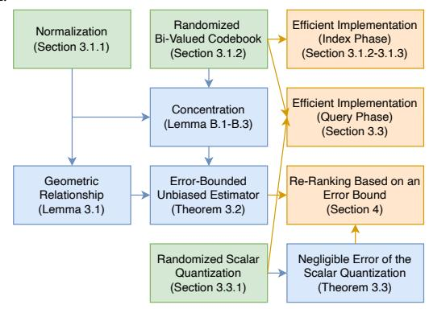
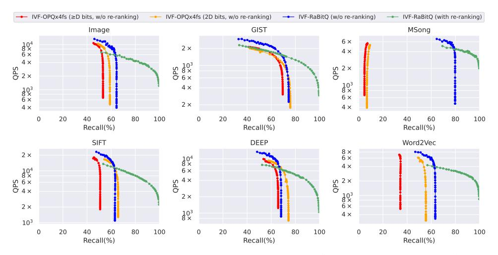
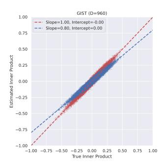

# **D.2** The Analysis for $\Delta$

Next we prove  $\Delta = O(\sqrt{\frac{\log D}{D}}/2^{B_q})$  with high probability. Recall that  $\Delta = (\max_{1 \le i \le D} \mathbf{q}'[i] - \min_{1 \le i \le D} \mathbf{q}'[i])/(2^{B_q} - 1)$ . Note that  $\max_{1 \le i \le D} (\mathbf{q}'[i]) - \min_{1 \le i \le D} (\mathbf{q}'[i]) \le 2 \max_{1 \le i \le D} |\mathbf{q}'[i]|$ . In order to prove the original statement, it suffices to prove that  $\max_{1 \le i \le D} |\mathbf{q}'[i]| = O(\sqrt{\frac{\log D}{D}})$  with high probability, which we prove as follows.

$$\mathbb{P}\left\{\max_{1\leq i\leq D}|\mathbf{q}'[i]|\geq\sqrt{\frac{\log D+t}{c_0D}}\right\} \tag{67}$$

$$= \mathbb{P}\left\{\exists 1 \le i \le D, |\mathbf{q}'[i]| \ge \sqrt{\frac{\log D + t}{c_0 D}}\right\}$$
 (68)

$$\leq D \cdot \mathbb{P} \left\{ |\mathbf{q'}[1]| \geq \sqrt{\frac{\log D + t}{c_0 D}} \right\}$$
 (69)

$$\leq 2 \exp\left(-c_0 \cdot \frac{\log D + t}{c_0} + \log D\right) = 2 \exp(-t) \tag{70}$$

where (69) is by union bound. (70) is by Lemma B.1. The conclusion shows that  $\Delta = O(\sqrt{\frac{\log D}{D}}/2^{B_q})$  with high probability.

## **E DISCUSSION ON THE NORMALIZATION**

We note that our current theoretical analysis (without any assumptions on the data) provides an additive error bound like [3]. Let  $dist'^2$  be the estimated squared distance based on our estimator, where  $dist'^2 = \|\mathbf{o}_r - \mathbf{c}\|^2 + \|\mathbf{q}_r - \mathbf{c}\|^2 - 2 \cdot \|\mathbf{o}_r - \mathbf{c}\| \cdot \|\mathbf{q}_r - \mathbf{c}\| \cdot \frac{\langle \bar{\mathbf{o}}, \mathbf{q} \rangle}{\langle \bar{\mathbf{o}}, \mathbf{o} \rangle}$ . Considering that we do not normalize the dataset with the centroids but with the origin of the space, then based on the Equation (15) in

Theorem 3.2, we immediately have

$$\left| dist'^{2} - \|\mathbf{o}_{r} - \mathbf{q}_{r}\|^{2} \right| = \|\mathbf{o}_{r}\| \cdot \|\mathbf{q}_{r}\| \cdot O\left(\frac{1}{\sqrt{D}}\right) w.h.p. \tag{71}$$

where w.h.p. is short for "with high probability".

When the data vectors are well normalized and spread evenly on the unit hypersphere, we assume that the data vector after normalization, i.e.,  $\mathbf{o} = \frac{\mathbf{o}_r - \mathbf{c}}{\|\mathbf{o}_r - \mathbf{c}\|}$ , follows the uniform distribution on the unit hypersphere. Then we can derive the following corollary which presents a multiplicative error bound like [41].

COROLLARY E.1. Assuming that **o** follows the uniform distribution on the unit hypersphere. We have

$$\left| \frac{dist'^2 - \|\mathbf{o}_r - \mathbf{q}_r\|^2}{\|\mathbf{o}_r - \mathbf{q}_r\|^2} \right| = O\left(\frac{1}{\sqrt{D}}\right) w.h.p.$$
 (72)

PROOF

$$\left| \frac{dist'^{2} - \|\mathbf{q}_{r} - \mathbf{o}_{r}\|^{2}}{\|\mathbf{q}_{r} - \mathbf{o}_{r}\|^{2}} \right| = \left| \frac{2\|\mathbf{q}_{r} - \mathbf{c}\|\|\mathbf{o}_{r} - \mathbf{c}\|}{\|\mathbf{q}_{r} - \mathbf{o}_{r}\|^{2}} \right| \cdot O\left(\frac{1}{\sqrt{D}}\right)$$
(73)

$$= \left| \frac{2\|\mathbf{q}_r - \mathbf{c}\|\|\mathbf{o}_r - \mathbf{c}\|}{\|\mathbf{q}_r - \mathbf{c}\|^2 + \|\mathbf{o}_r - \mathbf{c}\|^2 - 2\langle\mathbf{o}_r - \mathbf{c}, \mathbf{q}_r - \mathbf{c}\rangle} \right| \cdot O\left(\frac{1}{\sqrt{D}}\right)$$
(74)

$$= \left| \frac{1}{\frac{1}{2} \left( \frac{\|\mathbf{q}_r - \mathbf{c}\|}{\|\mathbf{o}_r - \mathbf{c}\|} + \frac{\|\mathbf{o}_r - \mathbf{c}\|}{\|\mathbf{q}_r - \mathbf{c}\|} \right) - \langle \mathbf{o}, \mathbf{q} \rangle} \right| \cdot O\left( \frac{1}{\sqrt{D}} \right)$$
(75)

$$\leq \left| \frac{1}{1 - \langle \mathbf{o}, \mathbf{q} \rangle} \right| \cdot O\left( \frac{1}{\sqrt{D}} \right) = O\left( \frac{1}{\sqrt{D}} \right) w.h.p. \tag{76}$$

where (73) is due to (71). (74) is by elementary linear algebra. (75) simplifies (74). The first inequality of (76) is due to the numerical inequality that  $\left(x+\frac{1}{x}\right) \geq 2$ ,  $\forall x>0$ . The second equality of (76) holds because **o** follows the uniform distribution on the unit hypersphere. In particular, due to the concentration inequality (Lemma B.1),  $\langle \mathbf{o}, \mathbf{q} \rangle$  is highly concentrated around 0, e.g., it has sufficiently high probability to be upper bounded by  $\frac{1}{2}$ .

We emphasize that the corollary is not fully rigorous as it depends on the assumption that **o** follows the uniform distribution on the unit hypersphere. Note that all our other theoretical results do not rely on any assumptions on the data, i.e., the additive bound holds regardless of the data distribution. In the present work, we only adopt a simple and natural method of normalization (i.e., with the centroids of IVF) to instantiate our scheme of quantization, while we have yet to extensively explore the normalization step itself. We shall leave it as future work to thoroughly and rigorously study the normalization problem.

To verify the effectiveness of the current method of normalization, we measure the empirical uniformity of the normalized data vectors with the entropy of each bit in our quantization codes 9. The larger the entropy is, the more uniform the normalized dataset is (and at the same time, the more informative the quantization codes are). We report that on all the datasets, the entropy is over 99.9% of the length of the quantization codes (in other word, for every bit in the quantization codes, the number of 1's is almost the

same as the number of 0's), indicating that normalizing the dataset with the centroids of IVF is empirically effective.

## F DISCUSSION ON THE ABLATION STUDY

We emphasize that RaBitQ is a method with rigorous theoretical guarantee. The newly proposed codebook construction and distance estimation are an integral whole. The ablation of any component will cause the loss of the theoretical guarantee (i.e., the performance is no more theoretically predictable) and further disable the errorbound-based re-ranking for ANN (Section 4). We summarize the dependency of the theoretical conclusions and efficient implementations on our algorithm components in detail in Figure 9. The green, blue and orange boxes represent the components in our algorithm, the theoretical conclusions and the implementations respectively. An arrow indicates that a particular component or theoretical conclusion is used for achieving the downstream conclusion or implementation. In addition, we would also like to highlight that although RaBitQ achieves the asymptotic optimality in terms of the worst-case error bound, for datasets which have certain promising properties, it is still possible to obtain better empirical performance via further (possibly heuristic) optimization. We believe this is an interesting research topic and we would like to leave it as future work.

Figure 9: Dependency among Algorithm Components, Theoretical Conclusions, and Efficient Implementations

Despite that the ablation is irrational in view of theory, we provide several empirical studies to discuss how each component empirically affects the performance 10. We investigate the effects of removing a certain component from RaBitQ while keeping the others.

#### F.1 The Ablation of the Codebook Construction

Recall that in Section 3.1, for quantizing a set of normalized data vectors, we construct a quantization codebook by randomly rotating a set of bi-valued vectors. We consider replacing our randomized codebook with a learned heuristic codebook of PQ while keeping other components. We note that with our randomized codebook, RaBitQ has rigorous theoretical guarantee and achieves asymptotic

&lt;sup>9In our quantization codes, let p be the proportion of 1's in the ith bit of the whole dataset. Then the entropy of the ith bit equals to  $-[p\log_2(p)+(1-p)\log_2(1-p)]$  We report the summation of the entropy over all the bits. The result is normalized by the length of the quantization codes for the ease of study.

&lt;sup>10Recall that the error-bound-based re-ranking would be disabled when any of the components is ablated. Using it for ANN entails exhaustive tuning of the parameters of re-ranking, which would heavily affect the results of ANN search. Thus, the results of ANN would be less insightful for an ablation study. We only report the results of distance estimation.

Figure 10: Time-Accuracy Trade-Off for ANN Search (with and w/o re-ranking).

optimality. However, with a learned heuristic codebook, the performance of the method will be no more theoretically predictable. Though it is often intuitive to expect that replacing a randomized algorithm with a learned algorithm may improve the performance, in RaBitQ, whose design is an integral whole, a learned codebook could be less suitable than a randomized codebook. Table 6 presents the average relative error and maximum relative error of the ablation study on the GIST dataset. It clearly shows that replacing a randomized codebook with a learned one degrades both the general quality and the robustness of distance estimation. The results imply that despite that PQ, as a learning-based method, has a large search space of codebooks, the heuristic learning process (which is based on a heuristic objective function and an approximate optimization algorithm) only finds a suboptimal solution among the search space. Similar findings can be observed in the main experiments (Section 5.2.1), i.e., LSQ has its search space of codebooks even larger than PQ, yet it has worse performance in most cases.

Table 6: Ablation Study of the Codebook Construction (GIST).

|                  | Ave. Rel. Error (%) | Max. Rel. Error (%) |
|------------------|---------------------|---------------------|
| Rand. Codebook   | 1.675               | 13.043              |
| Learned Codebook | 3.049               | 34.375              |

## F.2 The Ablation of the Estimator

Recall that as is discussed in Section 3.2, unlike PQ which simply treats the quantized data vector as the data vector, our method explicitly analyzes the geometric relationship between the vectors and constructs an unbiased estimator accordingly. In this part, we ablate our estimator and adopt an alternative estimator  $\langle \bar{\mathbf{o}}, \mathbf{q} \rangle$  by treating the quantized data vector as the data vector as PQ does. In particular, we collect  $10^7$  pairs of the estimated inner products and the true inner products from the first 10 query vectors and the  $10^6$  data vectors of the GIST dataset. Figure 11 shows the scatter plots of the true inner product and the estimated inner product. The red points represent the results based our unbiased estimator  $\langle \bar{\mathbf{o}}, \mathbf{q} \rangle$ . The blue points represent the results based on the estimator  $\langle \bar{\mathbf{o}}, \mathbf{q} \rangle$ . We fit the two set of points with linear regression. The results clearly show that our estimator is unbiased while the estimator

 $\langle \bar{\mathbf{o}}, \mathbf{q} \rangle$  is biased by a ratio of around 0.8. Table 7 further presents the average relative error and maximum relative error of the estimated distances on the GIST dataset. It clearly shows that taking  $\langle \bar{\mathbf{o}}, \mathbf{q} \rangle$  as the estimator degrades both the general quality and the robustness of the distance estimation. Moreover, we note that based on the estimator  $\langle \bar{\mathbf{o}}, \mathbf{q} \rangle$ , the original theoretical error bound (Theorem 3.2) does not hold anymore. Thus, it is inapplicable for the error-bound-based re-ranking for in-memory ANN search (Section 4).

Figure 11: Ablation Study of the Estimator. The red points represent the results based on the estimator  $\frac{\langle \bar{o}, q \rangle}{\langle \bar{o}, o \rangle}$ . The blue points represent the results based on the estimator  $\langle \bar{o}, q \rangle$ .

Table 7: Ablation Study of the Estimator (GIST).

|                                                                                                                                                                                                                                                                                                                                                                                                                                                                                                                                                                                                                                                                                                                                                                                                                                                                                                                                                                                                                                                                                                                                                                                                                                                                                                                                                                                                                                                                                                                                                                                                                                                                                                                                                                                                                                                                                                                                                                                                                                                                                                                                                                                                                                                                                                                                                                                                                                                                                                                                                                                                                                                                                                                                                                                                                                                                                                                                                                                                                                                                                                                                                                                                                                                                                                                                                                                                                                                                                                                                                                                                                                                                                                                                                                                                                                                                               |                                 | Ave. Rel. Error (%) | Max. Rel. Error (%) |
|-------------------------------------------------------------------------------------------------------------------------------------------------------------------------------------------------------------------------------------------------------------------------------------------------------------------------------------------------------------------------------------------------------------------------------------------------------------------------------------------------------------------------------------------------------------------------------------------------------------------------------------------------------------------------------------------------------------------------------------------------------------------------------------------------------------------------------------------------------------------------------------------------------------------------------------------------------------------------------------------------------------------------------------------------------------------------------------------------------------------------------------------------------------------------------------------------------------------------------------------------------------------------------------------------------------------------------------------------------------------------------------------------------------------------------------------------------------------------------------------------------------------------------------------------------------------------------------------------------------------------------------------------------------------------------------------------------------------------------------------------------------------------------------------------------------------------------------------------------------------------------------------------------------------------------------------------------------------------------------------------------------------------------------------------------------------------------------------------------------------------------------------------------------------------------------------------------------------------------------------------------------------------------------------------------------------------------------------------------------------------------------------------------------------------------------------------------------------------------------------------------------------------------------------------------------------------------------------------------------------------------------------------------------------------------------------------------------------------------------------------------------------------------------------------------------------------------------------------------------------------------------------------------------------------------------------------------------------------------------------------------------------------------------------------------------------------------------------------------------------------------------------------------------------------------------------------------------------------------------------------------------------------------------------------------------------------------------------------------------------------------------------------------------------------------------------------------------------------------------------------------------------------------------------------------------------------------------------------------------------------------------------------------------------------------------------------------------------------------------------------------------------------------------------------------------------------------------------------------------------------------|---------------------------------|---------------------|---------------------|
| $\frac{\langle \bar{\mathbf{o}},   \bar{\mathbf{o}},   \bar{\mathbf{o}},   \bar{\mathbf{o}},   \bar{\mathbf{o}},   \bar{\mathbf{o}},   \bar{\mathbf{o}},   \bar{\mathbf{o}},   \bar{\mathbf{o}},   \bar{\mathbf{o}},   \bar{\mathbf{o}},   \bar{\mathbf{o}},   \bar{\mathbf{o}},   \bar{\mathbf{o}},   \bar{\mathbf{o}},   \bar{\mathbf{o}},   \bar{\mathbf{o}},   \bar{\mathbf{o}},   \bar{\mathbf{o}},   \bar{\mathbf{o}},   \bar{\mathbf{o}},   \bar{\mathbf{o}},   \bar{\mathbf{o}},   \bar{\mathbf{o}},   \bar{\mathbf{o}},   \bar{\mathbf{o}},   \bar{\mathbf{o}},   \bar{\mathbf{o}},   \bar{\mathbf{o}},   \bar{\mathbf{o}},   \bar{\mathbf{o}},   \bar{\mathbf{o}},   \bar{\mathbf{o}},   \bar{\mathbf{o}},   \bar{\mathbf{o}},   \bar{\mathbf{o}},   \bar{\mathbf{o}},   \bar{\mathbf{o}},   \bar{\mathbf{o}},   \bar{\mathbf{o}},   \bar{\mathbf{o}},   \bar{\mathbf{o}},   \bar{\mathbf{o}},   \bar{\mathbf{o}},   \bar{\mathbf{o}},   \bar{\mathbf{o}},   \bar{\mathbf{o}},   \bar{\mathbf{o}},   \bar{\mathbf{o}},   \bar{\mathbf{o}},   \bar{\mathbf{o}},   \bar{\mathbf{o}},   \bar{\mathbf{o}},   \bar{\mathbf{o}},   \bar{\mathbf{o}},   \bar{\mathbf{o}},   \bar{\mathbf{o}},   \bar{\mathbf{o}},   \bar{\mathbf{o}},   \bar{\mathbf{o}},   \bar{\mathbf{o}},   \bar{\mathbf{o}},   \bar{\mathbf{o}},   \bar{\mathbf{o}},   \bar{\mathbf{o}},   \bar{\mathbf{o}},   \bar{\mathbf{o}},   \bar{\mathbf{o}},   \bar{\mathbf{o}},   \bar{\mathbf{o}},   \bar{\mathbf{o}},   \bar{\mathbf{o}},   \bar{\mathbf{o}},   \bar{\mathbf{o}},   \bar{\mathbf{o}},   \bar{\mathbf{o}},   \bar{\mathbf{o}},   \bar{\mathbf{o}},   \bar{\mathbf{o}},   \bar{\mathbf{o}},   \bar{\mathbf{o}},   \bar{\mathbf{o}},   \bar{\mathbf{o}},   \bar{\mathbf{o}},   \bar{\mathbf{o}},   \bar{\mathbf{o}},   \bar{\mathbf{o}},   \bar{\mathbf{o}},   \bar{\mathbf{o}},   \bar{\mathbf{o}},   \bar{\mathbf{o}},   \bar{\mathbf{o}},   \bar{\mathbf{o}},   \bar{\mathbf{o}},   \bar{\mathbf{o}},   \bar{\mathbf{o}},   \bar{\mathbf{o}},   \bar{\mathbf{o}},   \bar{\mathbf{o}},   \bar{\mathbf{o}},   \bar{\mathbf{o}},   \bar{\mathbf{o}},   \bar{\mathbf{o}},   \bar{\mathbf{o}},   \bar{\mathbf{o}},   \bar{\mathbf{o}},   \bar{\mathbf{o}},   \bar{\mathbf{o}},   \bar{\mathbf{o}},   \bar{\mathbf{o}},   \bar{\mathbf{o}},   \bar{\mathbf{o}},   \bar{\mathbf{o}},   \bar{\mathbf{o}},   \bar{\mathbf{o}},   \bar{\mathbf{o}},   \bar{\mathbf{o}},   \bar{\mathbf{o}},   \bar{\mathbf{o}},   \bar{\mathbf{o}},   \bar{\mathbf{o}},   \bar{\mathbf{o}},   \bar{\mathbf{o}},   \bar{\mathbf{o}},   \bar{\mathbf{o}},   \bar{\mathbf{o}},   \bar{\mathbf{o}},   \bar{\mathbf{o}},   \bar{\mathbf{o}},   \bar{\mathbf{o}},   \bar{\mathbf{o}},   \bar{\mathbf{o}},   \bar{\mathbf{o}},   \bar{\mathbf{o}},   \bar{\mathbf{o}},   \bar{\mathbf{o}},   \bar{\mathbf{o}},   \bar{\mathbf{o}},   \bar{\mathbf{o}},   \bar{\mathbf{o}},   \bar{\mathbf{o}},   \bar{\mathbf{o}},   \bar{\mathbf{o}},   \bar{\mathbf{o}},   \bar{\mathbf{o}},   \bar{\mathbf{o}},   \bar{\mathbf{o}},   \bar{\mathbf{o}},   \bar{\mathbf{o}},   \bar{\mathbf{o}},   \bar{\mathbf{o}},   \bar{\mathbf{o}},   \bar{\mathbf{o}},   \bar{\mathbf{o}},   \bar{\mathbf{o}},   \bar{\mathbf{o}},   \bar{\mathbf{o}},   \bar{\mathbf{o}},   \bar{\mathbf{o}},   \bar{\mathbf{o}},   \bar{\mathbf{o}},   \bar{\mathbf{o}},   \bar{\mathbf{o}},   \bar{\mathbf{o}},   \bar{\mathbf{o}},   \bar{\mathbf{o}},   \bar{\mathbf{o}},   \bar{\mathbf{o}},   \bar{\mathbf{o}},   \bar{\mathbf{o}},   \bar{\mathbf{o}},   \bar{\mathbf{o}},   \bar{\mathbf{o}},   \bar{\mathbf{o}},   \bar{\mathbf{o}},   \bar{\mathbf{o}},   \bar{\mathbf{o}},   \bar{\mathbf{o}},   \bar{\mathbf{o}},   \bar{\mathbf{o}},   \bar{\mathbf{o}},   \bar{\mathbf{o}},   \bar{\mathbf{o}},   \bar{\mathbf{o}},   \bar{\mathbf{o}},   \mathbf{o$ | $\frac{\mathbf{q}}{\mathbf{o}}$ | 1.675               | 13.043              |
| $\langle \bar{\mathbf{o}},$                                                                                                                                                                                                                                                                                                                                                                                                                                                                                                                                                                                                                                                                                                                                                                                                                                                                                                                                                                                                                                                                                                                                                                                                                                                                                                                                                                                                                                                                                                                                                                                                                                                                                                                                                                                                                                                                                                                                                                                                                                                                                                                                                                                                                                                                                                                                                                                                                                                                                                                                                                                                                                                                                                                                                                                                                                                                                                                                                                                                                                                                                                                                                                                                                                                                                                                                                                                                                                                                                                                                                                                                                                                                                                                                                                                                                                                   | $\overline{\mathbf{q}}$         | 2.196               | 52.400              |

## F.3 The Ablation of the Re-Ranking

As is discussed in Section 4, despite that RaBitQ provides the guarantee on the distance estimation, when the distances (to the query) of two different data vectors are extremely close to each other, the guaranteed accuracy might be insufficient for ranking them correctly. Re-ranking, in this case, is necessary for producing high recall. Figure 10 plots the "QPS"-"recall" curves of RaBitQ with and without re-ranking. It shows that re-ranking is indeed necessary for achieving the robust performance of ANN search.