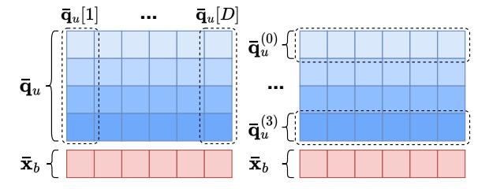

# 3.3 Computing the Estimator Efficiently

Recall that  $\frac{\langle \bar{\mathbf{o}}, \mathbf{q} \rangle}{\langle \bar{\mathbf{o}}, \mathbf{o} \rangle}$  is the estimator. Since  $\langle \bar{\mathbf{o}}, \mathbf{o} \rangle$  has been pre-computed during the index phase, the remaining question is to compute the value of  $\langle \bar{\mathbf{o}}, \mathbf{q} \rangle$  efficiently. For the sake of convenience, we denote  $P^{-1}\mathbf{q}$  as  $\mathbf{q}'$ . Like what we do in Section 3.1.3, in order to compute  $\langle \bar{\mathbf{o}}, \mathbf{q} \rangle$ , we can compute  $\langle \bar{\mathbf{x}}, \mathbf{q}' \rangle$ , which can be verified as follows.

$$\langle \bar{\mathbf{o}}, \mathbf{q} \rangle = \langle P\bar{\mathbf{x}}, \mathbf{q} \rangle = \langle P^{-1}P\bar{\mathbf{x}}, P^{-1}\mathbf{q} \rangle = \langle \bar{\mathbf{x}}, \mathbf{q}' \rangle$$
 (17)

3.3.1 Quantizing the Transformed Query Vector. Recall that  $\bar{\mathbf{x}}$  is a bivalued vector whose entries are  $\pm 1/\sqrt{D}$ . It is represented and stored as a binary quantization code  $\bar{\mathbf{x}}_b$  as is discussed in Section 3.1.3.  $\mathbf{q}'$  is a real-valued vector, whose entries are conventionally represented by floating-point numbers (floats in short). We note that in our method, representing the entries of  $\mathbf{q}'$  with floats is an overkill. Specifically, recall that our method adopts  $\frac{\langle \bar{\mathbf{o}}, \mathbf{q} \rangle}{\langle \bar{\mathbf{o}}, \mathbf{o} \rangle}$  as an estimator of  $\langle \mathbf{o}, \mathbf{q} \rangle$ . Even if we obtain a perfectly accurate result in the computation of  $\langle \bar{\mathbf{o}}, \mathbf{q} \rangle$ , our estimation of  $\langle \mathbf{o}, \mathbf{q} \rangle$  is still approximate. Thus, instead of exactly computing  $\langle \bar{\mathbf{o}}, \mathbf{q} \rangle$ , we aim to guarantee that the error produced in the computation of  $\langle \bar{\mathbf{o}}, \mathbf{q} \rangle$  is much smaller than the error of the estimator itself.

Specifically, we apply uniform scalar quantization on the entries of  ${\bf q}'$  and represent them as  $B_q$ -bit unsigned integers. We denote the ith entry of the vector  ${\bf q}'$  as  ${\bf q}'[i]$ . Let  $v_l:=\min_{1\leq i\leq D}{\bf q}'[i], v_r:=\max_{1\leq i\leq D}{\bf q}'[i]$  and  $\Delta:=(v_r-v_l)/(2^{B_q}-1)$ . The uniform scalar quantization uniformly splits the range of the values  $[v_l,v_r]$  into  $2^{B_q}-1$  segments, where each segment has the length of  $\Delta$ . Then for a value  $v=v_l+m\cdot\Delta+t, m=0,1,...,2^{B_q}-1, t\in[0,\Delta)$ , the method quantizes it by rounding it up to its nearest boundary of the segments (i.e.,  $v_l+m\cdot\Delta$  or  $v_l+(m+1)\cdot\Delta$ ) and representing it with the corresponding  $B_q$ -bit unsigned integer (i.e., m or m+1). Let  $\bar{\bf q}$  be the vector whose entries are equal to the quantized values of the entries of  ${\bf q}'$  (we term it as the quantized query vector) and  $\bar{\bf q}_u$  be its  $B_q$ -bit unsigned integer representation, where  $\bar{\bf q}=\Delta\cdot\bar{\bf q}_u+v_l\cdot {\bf 1}_D$  (recall that  ${\bf 1}_D$  is the D-dimensional vector with all its entries as ones). Then, we can compute  $\langle \bar{\bf x}, \bar{\bf q} \rangle$  as an approximation of  $\langle \bar{\bf x}, {\bf q}' \rangle$ .

Furthermore, to retain the theoretical guarantee, we adopt the trick of randomizing the uniform scalar quantization [3, 93]. Specifically, unlike the conventional method which rounds up a value to its nearest boundary of the segments, the randomized method rounds it to its left or right boundary randomly. The rationale is that for a value  $v = v_l + m \cdot \Delta + t$ ,  $m = 0, 1, ..., 2^{B_q} - 1$ ,  $t \in [0, \Delta)$ , when it is rounded to  $v_l + m \cdot \Delta$ , it will cause an error of under-estimation -t < 0. When it is rounded to  $v_l + (m+1) \cdot \Delta$ , it will cause an error of over-estimation  $\Delta - t > 0$ . If we assign  $1 - t/\Delta$  probability to the former event and  $t/\Delta$  probability to the latter event, the expected error would be 0, which makes the computation unbiased. We note that this operation can be easily achieved by letting

$$\bar{\mathbf{q}}_{u}[i] := \left| \frac{\mathbf{q}'[i] - v_{l}}{\Lambda} + u_{i} \right| \tag{18}$$

where  $u_i$  is sampled from the uniform distribution on [0, 1]. Moreover, based on the randomized method, we can analyze the minimum  $B_q$  needed for making the error introduced by the uniform scalar quantization negligible. The result is presented with the following theorem. The detailed proof can be found in the technical report [33].

THEOREM 3.3.  $B_q = \Theta(\log \log D)$  suffices to guarantee that  $|\langle \bar{\mathbf{x}}, \mathbf{q}' \rangle - \langle \bar{\mathbf{x}}, \bar{\mathbf{q}} \rangle| = O(1/\sqrt{D})$  with high probability.

Recall that the estimator has the error of  $O(1/\sqrt{D})$  (see Section 3.2.2). The above theorem shows that setting  $B_q = \Theta(\log\log D)$  suffices to guarantee that the error introduced by the uniform scalar quantization is at the same order as the error introduced by estimator. Because the error decreases exponentially wrt  $B_q$ , increasing  $B_q$  by a small constant (i.e.,  $B_q$  is still at the order of  $\Theta(\log\log D)$ ) guarantees that the error is much smaller than that of the estimator. We provide the empirical verification study for  $B_q$  in Section 5.2.5. The result shows that when  $B_q = 4$ , the error introduced by the uniform scalar quantization would be negligible.

3.3.2 Computing  $\langle \bar{\mathbf{x}}, \bar{\mathbf{q}} \rangle$  Efficiently. We next present how to compute  $\langle \bar{\mathbf{x}}, \bar{\mathbf{q}} \rangle$  efficiently. We first express  $\langle \bar{\mathbf{x}}, \bar{\mathbf{q}} \rangle$  with  $\bar{\mathbf{x}}_b, \bar{\mathbf{q}}_u$  as follows.

$$\langle \bar{\mathbf{x}}, \bar{\mathbf{q}} \rangle = \left\langle \frac{2\bar{\mathbf{x}}_b - \mathbf{1}_D}{\sqrt{D}}, \Delta \cdot \bar{\mathbf{q}}_u + v_l \cdot \mathbf{1}_D \right\rangle \tag{19}$$

$$= \frac{2\Delta}{\sqrt{D}} \langle \bar{\mathbf{x}}_b, \bar{\mathbf{q}}_u \rangle + \frac{2v_l}{\sqrt{D}} \sum_{i=1}^{D} \bar{\mathbf{x}}_b[i] - \frac{\Delta}{\sqrt{D}} \sum_{i=1}^{D} \bar{\mathbf{q}}_u[i] - \sqrt{D} \cdot v_l \quad (20)$$

Note that the factors  $\Delta$  and  $v_l$  are known when we quantize the query vector.  $\sum_{i=1}^D \bar{\mathbf{x}}_b[i]$  corresponds to the number of 1's in the bit string  $\bar{\mathbf{x}}_b$ , which can be pre-computed during the index phase.  $\sum_{i=1}^D \bar{\mathbf{q}}_u[i]$  depends only on the query vector. Its cost of computation can be shared by all the data vectors. The remaining task is to compute  $\langle \bar{\mathbf{x}}_b, \bar{\mathbf{q}}_u \rangle$  where the coordinates of  $\bar{\mathbf{x}}_b$  are 0 or 1 and those of  $\bar{\mathbf{q}}_u$  are unsigned  $B_q$ -bit integers.

We provide two versions of fast computation for  $\langle \bar{\mathbf{x}}_b, \bar{\mathbf{q}}_u \rangle$ . The first version targets the case of a *single* quantization code, as the original implementation of PQ [45] does. The second version targets the case of a packed *batch* of quantization codes, as the fast SIMD-based implementation of PQ [4, 5] does. We note that in general, both our method and PQ have higher throughput in the second case than that in the first case, i.e., they estimate the distances for more quantization codes within certain time. We note that the second case requires the quantization codes to be packed in a batch, which is feasible in some certain scenarios only.

Figure 2: Bitwise Decomposition of  $\bar{q}_u$ .

For the first case where the estimation of the distance is for a query vector and a *single* quantization code, we note that an unsigned  $B_q$ -bit integer can be decomposed into  $B_q$  binary values as shown in Figure 2. The left panel represents the naive computation of  $\langle \bar{\mathbf{x}}_b, \bar{\mathbf{q}}_u \rangle$ . The right panel represents the proposed bitwise computation of  $\langle \bar{\mathbf{x}}_b, \bar{\mathbf{q}}_u \rangle$ . Let  $\bar{\mathbf{q}}_u^{(j)}[i] \in \{0,1\}$  be the jth bit of  $\bar{\mathbf{q}}_u[i]$  where

 $0 \le j < B_q$ . The following expression specifies the idea.

$$\langle \bar{\mathbf{x}}_b, \bar{\mathbf{q}}_u \rangle = \sum_{i=1}^D \bar{\mathbf{x}}_b[i] \cdot \bar{\mathbf{q}}_u[i] = \sum_{i=1}^D \bar{\mathbf{x}}_b[i] \cdot \sum_{j=0}^{B_q - 1} \bar{\mathbf{q}}_u^{(j)}[i] \cdot 2^j$$
 (21)

$$= \sum_{j=0}^{B_q-1} 2^j \cdot \sum_{i=1}^D \bar{\mathbf{x}}_b[i] \cdot \bar{\mathbf{q}}_u^{(j)}[i] = \sum_{j=0}^{B_q-1} 2^j \cdot \left\langle \bar{\mathbf{x}}_b, \bar{\mathbf{q}}_u^{(j)} \right\rangle$$
(22)

Equation (22) shows that  $\langle \bar{\mathbf{x}}_b, \bar{\mathbf{q}}_u \rangle$  can be expressed as a weighted sum of the inner product of the binary vectors, i.e.,  $\left\langle \bar{\mathbf{x}}_b, \bar{\mathbf{q}}_u^{(j)} \right\rangle$  for  $0 \leq j < B_q$ . In particular, we note that the inner product of binary vectors can be efficiently achieved by bitwise operations, i.e., bitwise-and and popcount (a.k.a., bitcount). Thus, the computation of  $\langle \bar{\mathbf{o}}, \mathbf{q} \rangle$  is finally reduced to  $B_q$  bitwise-and and popcount operations on D-bit strings, which are well supported by virtually all platforms. As a comparison, we note that, as is comprehensively studied in [4], PQ relies on looking up LUTs in RAM, which cannot be implemented efficiently. Based on our experiments in Section 5.2.1, on average our method runs 3x faster than PQ and OPQ (a popular variant of PQ [34]) while reaching the same accuracy.

For the second case where the estimation of the distance is for a query vector and a packed batch of quantization codes, we note that our method can seamlessly adopt the same fast SIMD-based implementation [4, 5] as PQ does. In particular, for a D-bit string, we split it into D/4 sub-segments where each sub-segment has 4 bits. We then pre-process D/4 LUTs where each LUT has  $2^4$ unsigned integers corresponding to the inner products between a sub-segment of  $\bar{\mathbf{q}}_u$  and the  $2^4$  possible binary strings of a 4-bit subsegment. For a quantization code of a data vector, we can compute  $\langle \bar{\mathbf{x}}_b, \bar{\mathbf{q}}_u \rangle$  by looking up and accumulating the values in the LUTs for D/4 times. We note that the computation is reduced to exactly the form of PQ and thus can adopt the fast SIMD-based implementation seamlessly. Recall that our method has the quantization codes of D bits by default while PQ and OPQ have the codes of 2D bits by default. Therefore, our method has better efficiency than PQ and OPQ for computing approximate distances based on quantized vectors. Furthermore, as is shown in Section 5.2.1, in the default setting, our method also achieves consistently better accuracy than PQ and OPQ despite that our method uses a shorter quantization code (i.e., D v.s. 2D).

