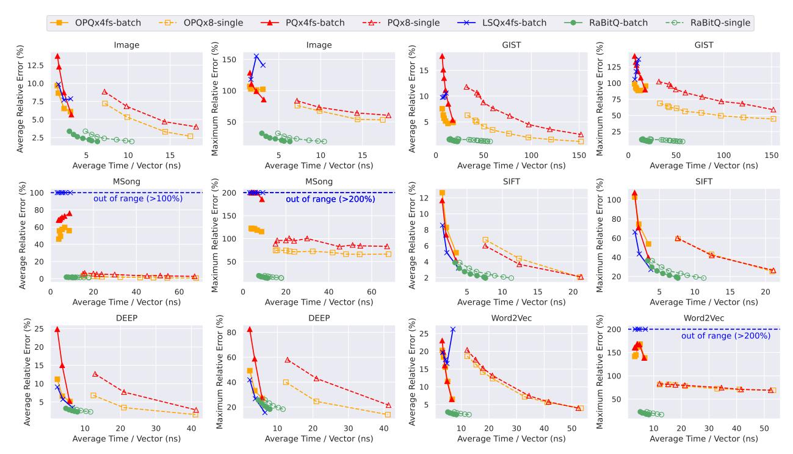
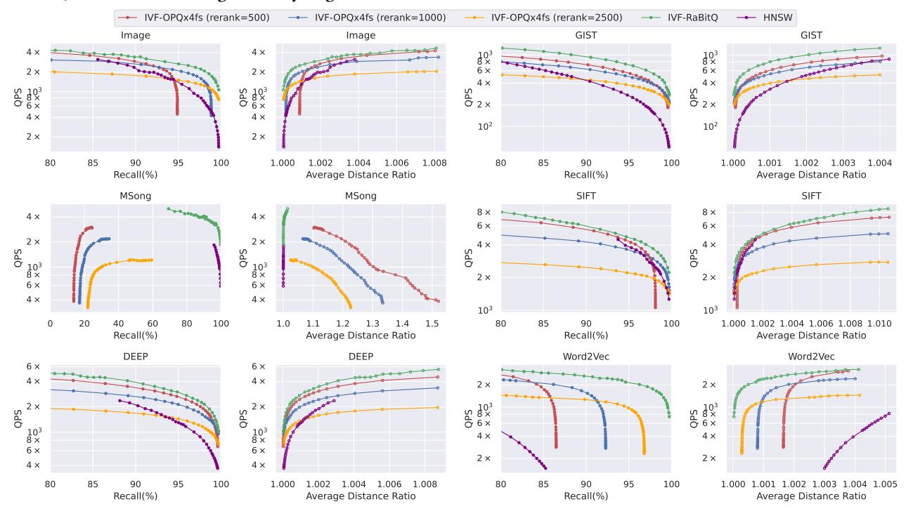
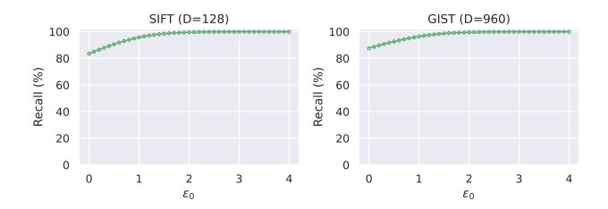
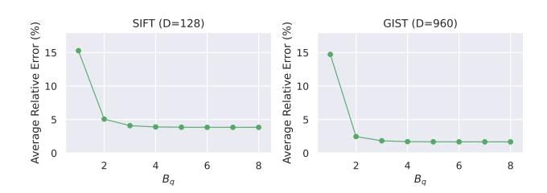
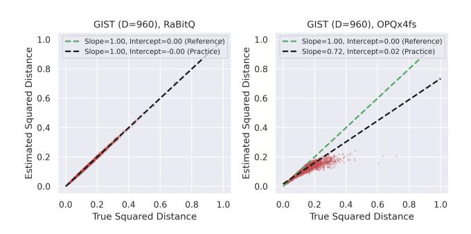

# **5 EXPERIMENTS**

#### 5.1 Experimental Setup

Our experiments involve three folds. <u>First</u>, we compare our method with the conventional quantization methods in terms of the time-accuracy trade-off of distance estimation and time cost of index phase (with results shown in Section 5.2.1 and Section 5.2.2). <u>Second</u>, we compare the methods when applied for in-memory ANN (with

100 nearest neighbors for each query, i.e., K = 100, by following [30]. Third, we empirically verify our theoretical analysis (with results shown in Section 5.2.4 to 5.2.6). Finally, we note that RaBitQ is a method with rigorous theoretical guarantee. Its components are an integral whole and together explain its asymptotically optimal performance. The ablation of any component would cause the loss of the theoretical guarantee (i.e., the method becomes heuristic and the performance is no more theoretically predictable) and further disables the error-bound-based re-ranking (Section 4). Despite this, we include empirical ablation studies in the technical report [33]. Datasets. We use six public real-world datasets with varying sizes and dimensionalities, whose details can be found in Table 3. These datasets have been widely used to benchmark ANN algorithms [6, 58, 62, 67]. In particular, it has been reported that on the datasets SIFT, DEEP and GIST, PQx4fs and OPQx4fs have good empirical performance [5]. We note that all these public datasets provide both data and query vectors.

results shown in Section 5.2.3). For ANN, we target to retrieve the

**Table 3: Dataset Statistics** 

| Dataset  | Size      | D   | Query Size | Data Type |
|----------|-----------|-----|------------|-----------|
| Msong    | 992,272   | 420 | 200        | Audio     |
| SIFT     | 1,000,000 | 128 | 10,000     | Image     |
| DEEP     | 1,000,000 | 256 | 1,000      | Image     |
| Word2Vec | 1,000,000 | 300 | 1,000      | Text      |
| GIST     | 1,000,000 | 960 | 1,000      | Image     |
| Image    | 2,340,373 | 150 | 200        | Image     |

Algorithms. First, for estimating the distances between data vectors and query vectors, we consider three baselines, PQ [45], OPQ [34] and LSQ [66, 67]. In particular, (1) PQ and (2) OPQ are the most popular methods among the quantization methods [34, 45]. They are widely deployed in industry [48, 69, 84, 92]. The popularity of PQ and OPQ indicates that they have been empirically evaluated to the widest extent and are expected to have the best known stability. Thus, we adopt PQ and OPQ as the primary baseline methods representing the quantization methods which have no theoretical error bounds. There is another line of the quantization methods named the additive quantization [8, 66, 67, 95]. Compared with PQ, these methods target extreme accuracy at the cost of much higher time for optimizing the codebook and mapping the data vectors into quantization codes in the index phase. (3) LSQ [66, 67] is the state-of-the-art method of this line. Thus, we adopt LSQ as the baseline method representing the quantization methods which pursue extreme performance in the query phase. The baseline methods are taken from the 1.7.4 release version of the open-source library Faiss [48], which is well-optimized with the SIMD instructions of AVX2. Second, for ANN, we compare our method with the most competitive baseline method OPQ according to the results in Section 5.2.1. For both our method and OPQ, we combine them with the IVF index as specified in Section 4. We also include the comparison with HNSW [65] as a reference. It is one of the state-of-the-art graph-based methods as is benchmarked in [6, 86] and is also widely adopted in industry [48, 69, 84, 92]. The implementation is taken from the hnswlib [65] optimized with the SIMD instructions of AVX2. We note that a recent quantization method ScaNN [37] proposes a new objective function for constructing the quantization codebook of PQ and claims better empirical performance. However,

as has been reported 6, its superior performance is mainly due to the fast SIMD-based implementation [5]. The advantage vanishes when PQ is implemented with the same technique. Thus, we exclude it from the comparison. Furthermore, we exclude the comparison with the LSH methods because it has been reported that the quantization methods outperform these methods empirically by orders of magnitudes in efficiency when reaching the same recall [58]. The latest advances in LSH have not changed this trend [80]. Thus, comparable performance with the quantization methods indicates significant improvement over the LSH methods.

Performance Metrics. First, for estimating the distances between data vectors and query vectors, we use two metrics to measure the accuracy and one metric to measure the efficiency. In particular, we measure the accuracy with (1) the average relative error and (2) the maximum relative error on the estimated squared distances. The former measures the general quality of the estimated distances while the latter measures the robustness of the estimated distances. We measure the efficiency with the time for distance estimation per vector. We note that due to the effects of cache, the efficiency depends on the order of estimating distances for the vectors. To simulate the order when the methods are used in practice, we build the IVF index for all methods and estimate the distances in the order that the IVF index probes the clusters. We measure the endto-end time of estimating distances for all the quantization codes in a dataset and divide it by the size of the dataset. We take the preprocessing time in the query phase (e.g., the time for normalizing, transforming and quantizing the query vector for our method) into account, thus making the comparisons fair. We also measure the time costs of the methods in the index phase. Second, for ANN, we adopt recall and average distance ratio for measuring the accuracy of ANN search. Specifically, recall is the ratio between the number of retrieved true nearest neighbors over K. Average distance ratio is the average of the distance ratios of the returned K data vectors wrt the ground truth nearest neighbors. These metrics are widely adopted to measure the accuracy of ANN algorithms [6, 31, 38, 58, 78]. We adopt query per second (QPS), i.e., the number of queries a method can handle in a second, to measure the efficiency. It is widely adopted to measure the efficiency of ANN algorithms [6, 58, 86]. Following [6, 58, 86], the query time is evaluated in a single thread and the search is conducted for each query individually (instead of queries in a batch). All the metrics are measured on every single query and averaged over the whole query set.

**Parameter Setting.** As is suggested by Faiss [25], the number of clusters for IVF is set to be 4,096 as the datasets are at the million-scale. For our method, there are two parameters, i.e.,  $\epsilon_0$  and  $B_q$ . The theoretical analysis in Section 3.2.2 and Section 3.3.1 has provided clear suggestions that  $\epsilon_0 = \Theta(\sqrt{\log(1/\delta)})$  and  $B_q = \Theta(\log\log D)$ , where  $\delta$  is the failure probability. In practice, the parameters are fixed to be  $\epsilon_0 = 1.9$  and  $B_q = 4$  across all the datasets. The empirical parameter study can be found in Section 5.2.4 and Section 5.2.5. As for the length of the quantization code, it equals to D by definition, but it can also be varied by padding the raw vectors with 0's before generating the quantization codes  $^7$ . More padded 0's

 $^6 https://github.com/facebookresearch/faiss/wiki/Indexing-1 M-vectors$ 

&lt;sup>7We emphasize that the padded dimensions will not be retained after the generation, and thus, will not affect the space and time costs related to the raw vectors.

indicate longer quantization codes and higher accuracy due to Theorem 3.2 (recall that the error is bounded by  $O(1/\sqrt{D})$ ). By default, the length of the quantization code is set to be the smallest multiple of 64 which is no smaller than D (it is equal to or slightly larger than *D*) in order to make it possible to store the bit string with a sequence of 64-bit unsigned integers. For the conventional quantization methods (including PQ, OPQ and LSQ), there are two parameters, namely the number of sub-segments of quantization codes M and the number of candidates for re-ranking which should be tuned empirically. Following the default parameter setting [25, 37], we set the number of partitions to be M = D/2. We note that it cannot be further increased as D should be divisible by M for PQ and OPQ. The number of candidates for re-ranking is varied among 500, 1,000 and 2,500. The experimental results in Section 5.2.3 show that none of the parameters work consistently well across different datasets. For HNSW, we follow its original paper [65] by setting the number of maximum out-degree of each vertex in the graph as 32 (corresponding to  $M_{HNSW} = 16$ ) and a parameter which controls the construction of the graph named *efConstruction* as 500.

The C++ source codes are compiled by g++ 9.4.0 with -0fast -march=core-avx2 under Ubuntu 20.04LTS. The Python source codes are run on Python 3.8. All experiments are run on a machine with AMD Threadripper PRO 3955WX 3.9GHz processor (with Zen2 microarchitecture which supports the SIMD instructions till AVX2) and 64GB RAM. The code and datasets are available at https://github.com/gaoj0017/RaBitQ.

## 5.2 Experimental Results

5.2.1 Time-Accuracy Trade-Off per Vector for Distance Estimation. We estimate the distance between a data vector (from the set of data vectors) and a query vector (from the set of query vectors) with different quantization methods including PQ, OPQ, LSQ and our RaBitQ method. We plot the "average relative error"-"time per vector" curve (left panels, bottom-left is better) and the "maximum relative error"-"time per vector" curve (right panels, bottom-left is better) by varying the length of the quantization codes in Figure 3. In particular, for our method, to plot the curve, we vary the length by padding different number of 0's in the vectors when generating the quantization codes. For PQ, OPQ and LSQ, we vary the length by setting different M (note that D must be divisible by M for PQ and OPQ).

Based on the results in Figure 3, we have the following observations. (1) LSQ has much less stable performance than PQ and OPQ. Except for the dataset SIFT and DEEP, LSQx4fs has its accuracy worse than PQx4fs and OPQx4fs. (2) Comparing the solid curves, we find that under the default setting of the number of bits (which corresponds to the last point in the red and orange solid curves and the first point in the green solid curve), our method shows consistently better accuracy than PQ and OPQ while having comparable efficiency on all the tested datasets. We emphasize that in the default setting, the length of the quantization code of our method is only around a half of those of PQ and OPQ (i.e., *D* v.s. 2*D*). (3) Comparing the dashed curves, we find that our method has significantly better efficiency than PQ and OPQ when reaching the same accuracy. (4) On the dataset Msong, PQx8 and OPQx8 have normal accuracy while PQx4fs and OPQx4fs have disastrous

accuracy. It indicates that the reasonable accuracy of the conventional quantization methods with k = 8 does not indicate its normal performance with k = 4. Thus, it is not always feasible to speed up a conventional quantization method with the fast SIMD-based implementation [5]. On the other hand, the efficiency of the conventional quantization methods with k = 8 is hardly comparable with those with k = 4 on the other datasets. It indicates that the recent success of PQ in the in-memory ANN is largely attributed to the fast SIMD-based implementation. Thus, it is not a choice to replace the fast SIMD-based implementation with the original one in pursuit of the stability. (5) Except for the dataset SIFT and DEEP, POx4fs and OPOx4fs have their maximum relative error of around 100%. It indicates that PQ and OPQ do not robustly produce highaccuracy estimated distances even on the datasets they perform well in general. As a comparison, our method has its maximum relative error at most 40% on all the tested datasets.

Table 4: The Indexing Time for the GIST Dataset

|      | RaBitQ | PQ   | OPQ  | LSQ                  |
|------|--------|------|------|----------------------|
| Time | 117s   | 105s | 291s | time-out (>24 hours) |

5.2.2 Time in the Indexing Phase. In Table 4, we report the indexing time of the quantization methods (k=4 for PQ, OPQ and LSQ) under the default parameter setting on the GIST dataset with 32 threads on CPU. The results show that the indexing time is not a bottleneck for our method, PQ and OPQ since all of them can finish the indexing phase within a few mins. However, for LSQ, it takes more than 24 hours. This is because in LSQ, the step of mapping a data vector to its quantization code is NP-Hard [66, 67]. Although several techniques have been proposed for approximately solving the NP-Hard problem [66, 67], the time cost is still much larger than that of PQ, which largely limits its usage in practice.

5.2.3 Time-Accuracy Trade-Off for ANN Search. We then measure the performance of the algorithms when they are used in combination with the IVF index for ANN search. Considering the results in Section 5.2.1, we only include OPQx4fs-batch and RaBitQ-batch for the comparison as other methods or implementations are in general dominated when the quantization codes are allowed to be packed in batch. As a reference, we also include HNSW for comparison. We then plot the "QPS"-"recall" curve (left panel, upper-right is better) and the "QPS"-"average distance ratio" curve (right panel, upper-left is better) by varying the number of buckets to probe in the IVF index for the quantization methods in Figure 4. The curves for HNSW are plotted by varying a parameter named ef Search which controls the QPS-recall tradeoff of HNSW. For OPQ, we show three curves which correspond to three different numbers of candidates for re-ranking. Based on Figure 4, we have the following observations. (1) On all the tested datasets, our method has consistently better performance than OPQ regardless of the re-ranking parameter. We emphasize that it has been reported that on the datasets SIFT, DEEP and GIST, OPQx4fs has good empirical performance [5]. Our method also consistently outperforms HNSW on all the tested datasets. (2) On the dataset MSong, the performance of OPQ is disastrous even with re-ranking applied. In particular, as the IVF index probes more buckets, the recall abnormally decreases because OPQ introduces too much error on the estimated distances. The poor accuracy shown in Figure 3 can explain the disastrous

Figure 3: Time-Accuracy Trade-Off for Distance Approximation. For baseline methods, (1) "x4fs-batch" means that the SIMD-based fast implementation is adopted (where 4 bits encode a quantized code and approximate distances for a batch of 32 data vectors are computed each time), and (2) "x8-single" means that 8 bits encode a quantized code and the approximate distance of one data vector is computed each time. In addition, the results of LSQx8-single are omitted since it, with the implementation from Faiss, has the time cost significantly larger than others.

Figure 4: Time-Accuracy Trade-Off for ANN Search. The parameter rerank represents the number of candidates for re-ranking.

failure. (3) No single re-ranking parameter for OPQ works well across all the datasets. On SIFT, DEEP and GIST, 1,000 of candidates for re-ranking suffice to produce a nearly perfect recall while on Image and Word2Vec, a larger number of candidates for re-ranking is needed. We note that the tuning of the re-ranking parameter is often exhaustive as the parameters are intertwined with many factors such as the datasets and the other parameters. Prior to the testing, there is no reliable way to predict the optimal setting of parameters in practice. In contrast, recall that as is discussed in Section 3.2.2 and Section 3.3.1, in our method, the theoretical analysis provides explicit suggestions on the parameters. Thus, our method requires no tuning.

Figure 5: Verification Study on  $\epsilon_0$ .

5.2.4 Results for Verifying the Statement about  $\epsilon_0$ .  $\epsilon_0$  is a parameter which controls the confidence interval of the error bound (see Section 3.2.2). When the RaBitO method is applied in ANN search, it further controls the probability that we correctly send the NN to re-ranking (see Section 4). In particular, to make sure the failure probability be no greater than  $\delta$ , the theoretical analysis in Section 3.2.2 suggests to set  $\epsilon_0 = \Theta(\sqrt{\log(1/\delta)})$ . We emphasize that the statement is independent of any other factors such as the datasets or the setting of other parameters. This is the reason that the parameter needs no tuning. In Figure 5, we provide the empirical verification on the statement. In particular, we plot the "recall"-" $\epsilon_0$ " curve by varying  $\epsilon_0$  from 0.0 to 4.0. The recall is measured by estimating the distances for all the data vectors and decide the vectors to be re-ranked based on the strategy in Section 4 (note that if a true nearest neighbor is not re-ranked, it will be missed). Thus, the factors (other than the error of quantization methods) which may affect the recall are eliminated. Figure 5 shows that on two different datasets, both curves show highly similar trends that it achieves nearly perfect recall at around  $\epsilon_0 = 1.9$ .

Figure 6: Verification Study on  $B_q$ .

5.2.5 Results for Verifying the Statement about  $B_q$ .  $B_q$  is a parameter which controls the error introduced in the computation of  $\langle \bar{\mathbf{o}}, \mathbf{q} \rangle$ . Due to our analysis in Section 3.3.1,  $B_q = \Theta(\log \log D)$  suffices to make sure that the error introduced in the computation of  $\langle \bar{\mathbf{o}}, \mathbf{q} \rangle$  is much smaller than the error of the estimator. We note that  $\Theta(\log \log D)$  varies extremely slowly with respect to D, and thus, it can be viewed as a constant when the dimensionality does not vary largely. In Figure 6, we provide the empirical verification on the statement. In particular, we plot the "average relative error"-" $B_q$ " curve by varying  $B_q$  from 1 to 8. Figure 6 shows that on two different datasets, both curves show highly similar trends that the error converges quickly at around  $B_q = 4$ . On the other hand, we would also like to highlight that further reducing  $B_q$  would produce unignorable error in the computation of  $\langle \bar{\mathbf{o}}, \mathbf{q} \rangle$ . In particular, when  $B_q = 1$ , i.e., both query and data vectors are quantized into binary strings, the error is much larger than the error when  $B_q = 4$ . This result may help to explain why the binary hashing methods cannot achieve good empirical performance.

Figure 7: Verification Study for Unbiasedness.

5.2.6 Results for Verifying the Unbiasedness. In Figure 7, we verify the unbiasedness of our method and show the biasedness of OPQ. We collect 107 pairs of the estimated squared distances and the true squared distances between the query and data vectors (i.e., the first 10 query vectors in the query set and the 106 data vectors in the full dataset of GIST) to verify the unbiasedness. The values of the distances are normalized by the maximum true squared distances. We fit the 107 pairs with linear regression and plot the result with the black dashed line. We note that if a method is unbiased, the result of the linear regression should have the slope of 1 and the y-axis intercept of 0 (the green dashed line as a reference). Figure 7 clearly shows that our method is unbiased, which verifies the theoretical analysis in Section 3.2.2. On the other hand, the estimated distances produced by OPQ is clearly biased.

#### 6 RELATED WORK

**Approximate Nearest Neighbor Search.** Existing studies on ANN search are usually categorized into four types: (1) graph-based methods [29, 30, 58, 64, 65, 74], (2) quantization-based methods [8, 34, 36, 37, 45, 66, 67, 73, 95], (3) tree-based methods [10, 15, 17, 71] and (4) hashing-based methods [18, 31, 35, 38, 39, 54, 56, 63, 78–80, 97]. We refer readers to recent tutorials [23, 75] and benchmarks/surveys [6, 7, 19, 58, 86, 88] for a comprehensive review. We note that recently, many studies design algorithms or systems by

jointly considering different types of methods so that a method can enjoy the merits of both sides [1, 12, 13, 21, 43, 62, 96]. Our work proposes a quantization method which provides a sharp error bound and good empirical performance at the same time. Just like the conventional quantization methods, it can work as a component in an integrated algorithm or system. Our method has two additional advantages: (1) it involves no parameter tuning and (2) it supports efficient distance estimation for a single quantization code. These advantages may further smoothen its combination with other types of methods. Recently, there are a thread of methods which apply machine learning (ML) on ANN [9, 20, 26, 55, 57, 87, 91].

Quantization. There is a vast literature about the quantization of high-dimensional vectors from different communities including machine learning, computer vision and data management [8, 27, 34, 36, 45, 66, 67, 73, 81, 90, 95]. We refer readers to comprehensive surveys [24, 68, 83, 85] and reference books [76, 94]. It is worth of mentioning that in [81], a quantization method called Split-VO was mentioned. The method covers the major idea of PQ, i.e., it splits the vectors into sub-segments, constructs subcodebooks for each sub-segment and forms the codebook with Cartesian product. Besides PQ and its variants, there are other types of quantization methods, e.g., scalar quantization [1, 27, 90]. These methods quantize the scalar values of each dimension separately, which often adopt more moderate compression rates than PQ in exchange for better accuracy. In particular, VA+ File [27], a scalar quantization method, has shown leading performance on the similarity search of data series according to a recent benchmark [24]. Besides the studies on the quantization algorithms, we note that hardware-aware optimization (with SIMD, GPU, FPGA, etc) also makes significant contributions to the performance of these methods [4, 5, 47, 48, 61]. To inherit the merits of the well-developed hardware-aware optimization, in this work, we reduce our computation to the computation of PQ (Section 3.3). However, RaBitQ, in its nature, can be implemented with much simpler bitwise operations (which is not possible for PQ and its variants). It remains to be an interesting question whether dedicated hardware-aware optimization can further improve the performance of RaBitQ.

Theoretical Studies on High-Dimensional Vectors. The theoretical studies on high-dimensional vectors are primarily about the seminal Johnson-Lindenstrauss (JL) Lemma [49]. It presents that reducing the dimensionality of a vector to  $O(\epsilon^{-2} \log(1/\delta))$  suffices to guarantee the error bound of  $\epsilon$ . Recent advances improve the JL Lemma in different aspects. For example, [53] proves the optimality of the JL Lemma. [2, 50] propose fast algorithms to do the dimension reduction. We refer readers to a comprehensive survey [28]. Our method fits into a recent line of studies [3, 40, 41, 72], which target to improve the JL Lemma by compressing high-dimensional vectors into short codes. As a comparison, to guarantee an error bound of  $\epsilon$ , the JL Lemma requires a vector of  $O(\epsilon^{-2} \log(1/\delta))$  dimensions while these studies prove that a short code with  $O(\epsilon^{-2} \log(1/\delta))$ bits would be sufficient. In practical terms, we note that although the existing studies achieve the improvement in theory in terms of the space complexity (i.e., the minimum number of bits needed for guaranteeing a certain error bound), they care less about the improvement in efficiency. In particular, these methods do not suit the in-memory ANN search because, for estimating the distance during

the query phase, they need decompress the short codes and compute the distances with the decompressed vectors, which degrades to the brute force in efficiency. For this reason, these methods have not been adopted in practice. In contrast, our method supports practically efficient computation as is specified in Section 3.3.

Signed Random Projection. We note that there are a line of studies named signed random projection (SRP) which generate a short code for estimating the angular values between vectors via binarizing the vectors after randomization [11, 22, 46, 51]. We note that our method is different from these studies in the following aspects. (1) Problem-wise, SRP targets to unbiasedly estimate the angular value while RaBitQ targets to unbiasedly estimate the inner product (and further, the squared distances). Note that the relationship between the angular value and the inner product is non-linear. The unbiased estimator for one does not trivially derive an unbiased estimator for the other. (2) Theory-wise, RaBitQ has a stronger type of guarantee than SRP. In particular, RaBitQ guarantees that every data vector has its distance within the bounds with high probability. In contrast, SRP only bounds the variance, i.e., the "average" squared error, and it does not provide a bound for every estimated value. Thus, it cannot help with the re-ranking in similarity search. (3) Technique-wise, in SRP the bit strings are viewed as some hashing codes while in RaBitQ, the bit strings are the binary representations of bi-valued vectors. Moreover, SRP maps both the data and query vectors to bit strings, which introduces error from both sides. In contrast, RaBitQ quantizes the data vectors to be bit strings and the query vectors to be vectors of 4-bit unsigned integers. Theorem 3.3 proves that quantizing the query vectors only introduces negligible error. Thus, RaBitQ only introduces the error from the side of the

#### 7 CONCLUSION

In conclusion, we propose a novel randomized quantization method RaBitQ which has clear advantages in both empirical accuracy and rigorous theoretical error bound over PQ and its variants. The proposed efficient implementations based on simple bitwise operations or fast SIMD-based operations further make it stand out in terms of the time-accuracy trade-off for the in-memory ANN search. Extensive experiments on real-world datasets verify both (1) the empirical superiority of our method in terms of the time-accuracy trade-off and (2) the alignment of the empirical performance with the theoretical analysis. Some interesting research directions include applying our method in other scenarios of ANN search (e.g., with graph-based indexes or on other storage devices [14, 42, 44, 59]). Besides, RaBitQ can also be trivially applied to unbiasedly estimate cosine similarity and inner product 8, which further implies its potential in maximum inner product search and neural network quantization.

### **ACKNOWLEDGEMENTS**

We would like to thank the anonymous reviewers for providing constructive feedback and valuable suggestions. This research is

 $^8$  The cosine similarity of two vectors exactly equals to the inner product of their unit vectors. The inner product of o and q can be expressed as  $\langle o,q\rangle=\langle o-c+c,q-c+c\rangle=\|o-c\|\cdot\|q-c\|\cdot\langle(o-c)/\|o-c\|,(q-c)/\|q-c\|\rangle+\langle o,c\rangle+\langle q,c\rangle-\|c\|^2,$  where c is the centroid of the data vectors, and it reduces to the estimation of inner product between unit vectors as we do in Section 3.1.1.

supported by the Ministry of Education, Singapore, under its Academic Research Fund (Tier 2 Award MOE-T2EP20221-0013, Tier 2 Award MOE-T2EP20220-0011, and Tier 1 Award (RG77/21)). Any opinions, findings and conclusions or recommendations expressed in this material are those of the author(s) and do not reflect the views of the Ministry of Education, Singapore.

#### REFERENCES

-  Cecilia Aguerrebere, Ishwar Singh Bhati, Mark Hildebrand, Mariano Tepper, and Theodore Willke. 2023. Similarity Search in the Blink of an Eye with Compressed Indices. Proc. VLDB Endow. 16, 11 (aug 2023), 3433–3446. https://doi.org/10. 14778/3611479.3611537
- [2] Nir Ailon and Bernard Chazelle. 2009. The Fast Johnson-Lindenstrauss Transform and Approximate Nearest Neighbors. SIAM J. Comput. 39, 1 (2009), 302–322. https://doi.org/10.1137/060673096 arXiv:https://doi.org/10.1137/060673096
- [3] Noga Alon and Bo'az Klartag. 2017. Optimal Compression of Approximate Inner Products and Dimension Reduction. In 2017 IEEE 58th Annual Symposium on Foundations of Computer Science (FOCS). 639–650. https://doi.org/10.1109/FOCS. 2017.65
- [4] Fabien André, Anne-Marie Kermarrec, and Nicolas Le Scouarnec. 2015. Cache Locality is Not Enough: High-Performance Nearest Neighbor Search with Product Quantization Fast Scan. Proc. VLDB Endow. 9, 4 (dec 2015), 288–299. https://doi.org/10.14778/2856318.2856324
- [5] Fabien André, Anne-Marie Kermarrec, and Nicolas Le Scouarnec. 2017. Accelerated Nearest Neighbor Search with Quick ADC. In Proceedings of the 2017 ACM on International Conference on Multimedia Retrieval (Bucharest, Romania) (ICMR '17). Association for Computing Machinery, New York, NY, USA, 159–166. https://doi.org/10.1145/3078971.3078992
- [6] Martin Aumüller, Erik Bernhardsson, and Alexander Faithfull. 2020. ANN-Benchmarks: A Benchmarking Tool for Approximate Nearest Neighbor Algorithms. Inf. Syst. 87, C (jan 2020), 13 pages. https://doi.org/10.1016/j.is.2019.02.006
- [7] Martin Aumüller and Matteo Ceccarello. 2023. Recent Approaches and Trends in Approximate Nearest Neighbor Search, with Remarks on Benchmarking. *Data Engineering* (2023), 89.
- [8] Artem Babenko and Victor Lempitsky. 2014. Additive Quantization for Extreme Vector Compression. In 2014 IEEE Conference on Computer Vision and Pattern Recognition. 931–938. https://doi.org/10.1109/CVPR.2014.124
- [9] Dmitry Baranchuk, Dmitry Persiyanov, Anton Sinitsin, and Artem Babenko. 2019. Learning to Route in Similarity Graphs. In Proceedings of the 36th International Conference on Machine Learning (Proceedings of Machine Learning Research, Vol. 97), Kamalika Chaudhuri and Ruslan Salakhutdinov (Eds.). PMLR, 475–484. https://proceedings.mlr.press/v97/baranchuk19a.html
- [10] Alina Beygelzimer, Sham Kakade, and John Langford. 2006. Cover trees for nearest neighbor. In Proceedings of the 23rd international conference on Machine learning. 97–104.
- [11] Moses S. Charikar. 2002. Similarity Estimation Techniques from Rounding Algorithms. In Proceedings of the Thiry-Fourth Annual ACM Symposium on Theory of Computing (Montreal, Quebec, Canada) (STOC '02). Association for Computing Machinery, New York, NY, USA, 380–388. https://doi.org/10.1145/509907.509965
- [12] Patrick H. Chen, Wei-Cheng Chang, Jyun-Yu Jiang, Hsiang-Fu Yu, Inderjit S. Dhillon, and Cho-Jui Hsieh. 2023. FINGER: Fast inference for graph-based approximate nearest neighbor search. In *The Web Conference 2023*. https://www.amazon.science/publications/finger-fast-inference-for-graph-based-approximate-nearest-neighbor-search
- [13] Qi Chen, Haidong Wang, Mingqin Li, Gang Ren, Scarlett Li, Jeffery Zhu, Jason Li, Chuanjie Liu, Lintao Zhang, and Jingdong Wang. 2018. SPTAG: A library for fast approximate nearest neighbor search. https://github.com/Microsoft/SPTAG
- [14] Qi Chen, Bing Zhao, Haidong Wang, Mingqin Li, Chuanjie Liu, Zengzhong Li, Mao Yang, and Jingdong Wang. 2021. SPANN: Highly-efficient Billion-scale Approximate Nearest Neighbor Search. In 35th Conference on Neural Information Processing Systems (NeurIPS 2021).
- [15] Paolo Ciaccia, Marco Patella, and Pavel Zezula. 1997. M-Tree: An Efficient Access Method for Similarity Search in Metric Spaces. In Proceedings of the 23rd International Conference on Very Large Data Bases (VLDB '97). Morgan Kaufmann Publishers Inc., San Francisco, CA, USA, 426–435.
- [16] T. Cover and P. Hart. 1967. Nearest neighbor pattern classification. IEEE Transactions on Information Theory 13, 1 (1967), 21–27. https://doi.org/10.1109/TIT. 1967.1053964
- [17] Sanjoy Dasgupta and Yoav Freund. 2008. Random projection trees and low dimensional manifolds. In Proceedings of the fortieth annual ACM symposium on Theory of computing. 537–546.
- [18] Mayur Datar, Nicole Immorlica, Piotr Indyk, and Vahab S Mirrokni. 2004. Locality-sensitive hashing scheme based on p-stable distributions. In Proceedings of the twentieth annual symposium on Computational geometry. 253–262.

- [19] Magdalen Dobson, Zheqi Shen, Guy E Blelloch, Laxman Dhulipala, Yan Gu, Harsha Vardhan Simhadri, and Yihan Sun. 2023. Scaling Graph-Based ANNS Algorithms to Billion-Size Datasets: A Comparative Analysis. arXiv preprint arXiv:2305.04359 (2023).
- [20] Yihe Dong, Piotr Indyk, Ilya Razenshteyn, and Tal Wagner. 2020. Learning Space Partitions for Nearest Neighbor Search. In *International Conference on Learning Representations*. https://openreview.net/forum?id=rkenmREFDr
- [21] Matthijs Douze, Alexandre Sablayrolles, and Hervé Jégou. 2018. Link and Code: Fast Indexing with Graphs and Compact Regression Codes. In 2018 IEEE/CVF Conference on Computer Vision and Pattern Recognition. 3646–3654. https://doi. org/10.1109/CVPR.2018.00384
- [22] Punit Pankaj Dubey, Bhisham Dev Verma, Rameshwar Pratap, and Keegan Kang. 2022. Improving sign-random-projection via count sketch. In Proceedings of the Thirty-Eighth Conference on Uncertainty in Artificial Intelligence (Proceedings of Machine Learning Research, Vol. 180), James Cussens and Kun Zhang (Eds.). PMLR, 599–609. https://proceedings.mlr.press/v180/dubey22a.html
- [23] Karima Echihabi, Kostas Zoumpatianos, and Themis Palpanas. 2021. New Trends in High-D Vector Similarity Search: Al-Driven, Progressive, and Distributed. Proc. VLDB Endow. 14, 12 (jul 2021), 3198–3201. https://doi.org/10.14778/3476311. 3476407
- [24] Karima Echihabi, Kostas Zoumpatianos, Themis Palpanas, and Houda Benbrahim. 2018. The Lernaean Hydra of Data Series Similarity Search: An Experimental Evaluation of the State of the Art. Proc. VLDB Endow. 12, 2 (oct 2018), 112–127. https://doi.org/10.14778/3282495.3282498
- [25] Faiss. 2023. Faiss. https://github.com/facebookresearch/faiss.
- [26] Chao Feng, Defu Lian, Xiting Wang, Zheng Liu, Xing Xie, and Enhong Chen. 2022. Reinforcement Routing on Proximity Graph for Efficient Recommendation. ACM Trans. Inf. Syst. (jan 2022). https://doi.org/10.1145/3512767 Just Accepted.
- [27] Hakan Ferhatosmanoglu, Ertem Tuncel, Divyakant Agrawal, and Amr El Abbadi. 2000. Vector Approximation Based Indexing for Non-Uniform High Dimensional Data Sets. In Proceedings of the Ninth International Conference on Information and Knowledge Management (McLean, Virginia, USA) (CIKM '00). Association for Computing Machinery, New York, NY, USA, 202–209. https://doi.org/10.1145/ 354756.354820
- [28] Casper Benjamin Freksen. 2021. An Introduction to Johnson-Lindenstrauss Transforms. CoRR abs/2103.00564 (2021). arXiv:2103.00564 https://arxiv.org/abs/ 2103.00564
- [29] Cong Fu, Changxu Wang, and Deng Cai. 2021. High dimensional similarity search with satellite system graph: Efficiency, scalability, and unindexed query compatibility. IEEE Transactions on Pattern Analysis and Machine Intelligence (2021).
- [30] Cong Fu, Chao Xiang, Changxu Wang, and Deng Cai. 2019. Fast Approximate Nearest Neighbor Search with the Navigating Spreading-out Graph. Proc. VLDB Endow. 12, 5 (jan 2019), 461–474. https://doi.org/10.14778/3303753.3303754
- [31] Junhao Gan, Jianlin Feng, Qiong Fang, and Wilfred Ng. 2012. Locality-Sensitive Hashing Scheme Based on Dynamic Collision Counting. In Proceedings of the 2012 ACM SIGMOD International Conference on Management of Data (Scottsdale, Arizona, USA) (SIGMOD '12). Association for Computing Machinery, New York, NY, USA, 541–552. https://doi.org/10.1145/2213836.2213898
- [32] Jianyang Gao and Cheng Long. 2023. High-Dimensional Approximate Nearest Neighbor Search: With Reliable and Efficient Distance Comparison Operations. Proc. ACM Manag. Data 1, 2, Article 137 (jun 2023), 27 pages. https://doi.org/10. 1145/3589282
- [33] Jianyang Gao and Cheng Long. 2024. RaBitQ: Quantizing High-Dimensional Vectors with Theoretical Error Bound for Approximate Nearest Neighbor Search (Technical Report). https://github.com/gaoj0017/RaBitQ/technical\_report.pdf.
- [34] Tiezheng Ge, Kaiming He, Qifa Ke, and Jian Sun. 2013. Optimized product quantization for approximate nearest neighbor search. In Proceedings of the IEEE Conference on Computer Vision and Pattern Recognition. 2946–2953.
- [35] Long Gong, Huayi Wang, Mitsunori Ogihara, and Jun Xu. 2020. IDEC: Indexable Distance Estimating Codes for Approximate Nearest Neighbor Search. Proc. VLDB Endow. 13, 9 (may 2020), 1483–1497. https://doi.org/10.14778/3397230.3397243
- [36] Yunchao Gong, Svetlana Lazebnik, Albert Gordo, and Florent Perronnin. 2013. Iterative Quantization: A Procrustean Approach to Learning Binary Codes for Large-Scale Image Retrieval. IEEE Transactions on Pattern Analysis and Machine Intelligence 35, 12 (2013), 2916–2929. https://doi.org/10.1109/TPAMI.2012.193
- [37] Ruiqi Guo, Philip Sun, Erik Lindgren, Quan Geng, David Simcha, Felix Chern, and Sanjiv Kumar. 2020. Accelerating Large-Scale Inference with Anisotropic Vector Quantization. In Proceedings of the 37th International Conference on Machine Learning (ICML'20). JMLR.org, Article 364, 10 pages.
- [38] Qiang Huang, Jianlin Feng, Yikai Zhang, Qiong Fang, and Wilfred Ng. 2015. Query-aware locality-sensitive hashing for approximate nearest neighbor search. Proceedings of the VLDB Endowment 9, 1 (2015), 1–12.
- [39] Piotr Indyk and Rajeev Motwani. 1998. Approximate nearest neighbors: towards removing the curse of dimensionality. In Proceedings of the thirtieth annual ACM symposium on Theory of computing. 604–613.

- [40] Piotr Indyk, Ilya Razenshteyn, and Tal Wagner. 2017. Practical Data-Dependent Metric Compression with Provable Guarantees. In Proceedings of the 31st International Conference on Neural Information Processing Systems (Long Beach, California, USA) (NIPS'17). Curran Associates Inc., Red Hook, NY, USA, 2614–2623.
- [41] Piotr Indyk and Tal Wagner. 2022. Optimal (Euclidean) Metric Compression. SIAM J. Comput. 51, 3 (2022), 467–491. https://doi.org/10.1137/20M1371324 arXiv:https://doi.org/10.1137/20M1371324
- [42] Junhyeok Jang, Hanjin Choi, Hanyeoreum Bae, Seungjun Lee, Miryeong Kwon, and Myoungsoo Jung. 2023. CXL-ANNS: Software-Hardware Collaborative Memory Disaggregation and Computation for Billion-Scale Approximate Nearest Neighbor Search. In 2023 USENIX Annual Technical Conference (USENIX ATC 23). USENIX Association, Boston, MA, 585–600. https://www.usenix.org/conference/atc23/presentation/jang
- [43] Yahoo Japan. 2022. NGT-QG. https://github.com/yahoojapan/NGT.
- [44] Suhas Jayaram Subramanya, Fnu Devvrit, Harsha Vardhan Simhadri, Ravishankar Krishnawamy, and Rohan Kadekodi. 2019. DiskANN: Fast Accurate Billion-point Nearest Neighbor Search on a Single Node. In Advances in Neural Information Processing Systems, H. Wallach, H. Larochelle, A. Beygelzimer, F. d'Alché-Buc, E. Fox, and R. Garnett (Eds.), Vol. 32. Curran Associates, Inc. https://proceedings. neurips.cc/paper/2019/file/09853c7fb1d3f8ee67a61b6bf4a7f8e6-Paper.pdf
- [45] Herve Jegou, Matthijs Douze, and Cordelia Schmid. 2010. Product quantization for nearest neighbor search. IEEE transactions on pattern analysis and machine intelligence 33, 1 (2010), 117–128.
- [46] Jianqiu Ji, Jianmin Li, Shuicheng Yan, Bo Zhang, and Qi Tian. 2012. Super-Bit Locality-Sensitive Hashing. In Proceedings of the 25th International Conference on Neural Information Processing Systems - Volume 1 (Lake Tahoe, Nevada) (NIPS'12). Curran Associates Inc., Red Hook, NY, USA, 108–116.
- [47] Wenqi Jiang, Shigang Li, Yu Zhu, Johannes De Fine Licht, Zhenhao He, Runbin Shi, Cedric Renggli, Shuai Zhang, Theodoros Rekatsinas, Torsten Hoefler, and Gustavo Alonso. 2023. Co-design Hardware and Algorithm for Vector Search. In Proceedings of the International Conference for High Performance Computing, Networking, Storage and Analysis (Denver, CO, USA) (SC '23). Association for Computing Machinery, New York, NY, USA, Article 87, 15 pages. https://doi.org/10.1145/3581784.3607045
- [48] Jeff Johnson, Matthijs Douze, and Hervé Jégou. 2019. Billion-scale similarity search with GPUs. IEEE Transactions on Big Data 7, 3 (2019), 535–547.
- [49] William B Johnson and Joram Lindenstrauss. 1984. Extensions of Lipschitz mappings into a Hilbert space 26. Contemporary mathematics 26 (1984), 28.
- [50] Daniel M. Kane and Jelani Nelson. 2014. Sparser Johnson-Lindenstrauss Transforms. J. ACM 61, 1, Article 4 (jan 2014), 23 pages. https://doi.org/10.1145/2559902
- [51] Keegan Kang and Weipin Wong. 2018. Improving Sign Random Projections With Additional Information. In Proceedings of the 35th International Conference on Machine Learning (Proceedings of Machine Learning Research, Vol. 80), Jennifer Dy and Andreas Krause (Eds.). PMLR, 2479–2487. https://proceedings.mlr.press/ v80/kang18b.html
- [52] V. I. Khokhlov. 2006. The Uniform Distribution on a Sphere in  $\mathbb{R}^S$ . Properties of Projections. I. Theory of Probability & Its Applications 50, 3 (2006), 386–399. https://doi.org/10.1137/S0040585X97981846 arXiv:https://doi.org/10.1137/S0040585X97981846
- [53] Kasper Green Larsen and Jelani Nelson. 2017. Optimality of the Johnson-Lindenstrauss lemma. In 2017 IEEE 58th Annual Symposium on Foundations of Computer Science (FOCS). IEEE, 633–638.
- [54] Yifan Lei, Qiang Huang, Mohan Kankanhalli, and Anthony K. H. Tung. 2020. Locality-Sensitive Hashing Scheme Based on Longest Circular Co-Substring. In Proceedings of the 2020 ACM SIGMOD International Conference on Management of Data (Portland, OR, USA) (SIGMOD '20). Association for Computing Machinery, New York, NY, USA, 2589–2599. https://doi.org/10.1145/3318464.3389778
- [55] Conglong Li, Minjia Zhang, David G. Andersen, and Yuxiong He. 2020. Improving Approximate Nearest Neighbor Search through Learned Adaptive Early Termination. In Proceedings of the 2020 ACM SIGMOD International Conference on Management of Data (Portland, OR, USA). Association for Computing Machinery, New York, NY, USA, 2539–2554. https://doi.org/10.1145/3318464.3380600
- [56] Jinfeng Li, Xiao Yan, Jian Zhang, An Xu, James Cheng, Jie Liu, Kelvin K. W. Ng, and Ti-chung Cheng. 2018. A General and Efficient Querying Method for Learning to Hash. In Proceedings of the 2018 International Conference on Management of Data (Houston, TX, USA) (SIGMOD '18). Association for Computing Machinery, New York, NY, USA, 1333–1347. https://doi.org/10.1145/3183713.3183750
- [57] Mingjie Li, Yuan-Gen Wang, Peng Zhang, Hanpin Wang, Lisheng Fan, Enxia Li, and Wei Wang. 2023. Deep Learning for Approximate Nearest Neighbour Search: A Survey and Future Directions. IEEE Transactions on Knowledge and Data Engineering 35, 9 (2023), 8997–9018. https://doi.org/10.1109/TKDE.2022.3220683
- [58] Wen Li, Ying Zhang, Yifang Sun, Wei Wang, Mingjie Li, Wenjie Zhang, and Xuemin Lin. 2019. Approximate nearest neighbor search on high dimensional data—experiments, analyses, and improvement. IEEE Transactions on Knowledge and Data Engineering 32, 8 (2019), 1475–1488.
- [59] Yingfan Liu, Hong Cheng, and Jiangtao Cui. 2017. PQBF: I/O-Efficient Approximate Nearest Neighbor Search by Product Quantization. In Proceedings of the

- 2017 ACM on Conference on Information and Knowledge Management (Singapore, Singapore) (CIKM '17). Association for Computing Machinery, New York, NY, USA, 667–676. https://doi.org/10.1145/3132847.3132901
- [60] Ying Liu, Dengsheng Zhang, Guojun Lu, and Wei-Ying Ma. 2007. A survey of content-based image retrieval with high-level semantics. *Pattern Recognition* 40, 1 (2007), 262–282. https://doi.org/10.1016/j.patcog.2006.04.045
- [61] Zihan Liu, Wentao Ni, Jingwen Leng, Yu Feng, Cong Guo, Quan Chen, Chao Li, Minyi Guo, and Yuhao Zhu. 2023. JUNO: Optimizing High-Dimensional Approximate Nearest Neighbour Search with Sparsity-Aware Algorithm and Ray-Tracing Core Mapping. arXiv:2312.01712 [cs.DC]
- [62] Kejing Lu, Mineichi Kudo, Chuan Xiao, and Yoshiharu Ishikawa. 2021. HVS: Hierarchical Graph Structure Based on Voronoi Diagrams for Solving Approximate Nearest Neighbor Search. Proc. VLDB Endow. 15, 2 (oct 2021), 246–258. https://doi.org/10.14778/3489496.3489506
- [63] Kejing Lu, Hongya Wang, Wei Wang, and Mineichi Kudo. 2020. VHP: approximate nearest neighbor search via virtual hypersphere partitioning. Proceedings of the VLDB Endowment 13, 9 (2020), 1443–1455.
- [64] Yury Malkov, Alexander Ponomarenko, Andrey Logvinov, and Vladimir Krylov. 2014. Approximate nearest neighbor algorithm based on navigable small world graphs. *Information Systems* 45 (2014), 61–68. https://doi.org/10.1016/j.is.2013. 10.006
- [65] Yu A. Malkov and D. A. Yashunin. 2020. Efficient and Robust Approximate Nearest Neighbor Search Using Hierarchical Navigable Small World Graphs. IEEE Transactions on Pattern Analysis and Machine Intelligence 42, 4 (2020), 824– 836. https://doi.org/10.1109/TPAMI.2018.2889473
- [66] Julieta Martinez, Joris Clement, Holger H. Hoos, and James J. Little. 2016. Revisiting Additive Quantization. In Computer Vision – ECCV 2016, Bastian Leibe, Jiri Matas, Nicu Sebe, and Max Welling (Eds.). Springer International Publishing, Cham, 137–153.
- [67] Julieta Martinez, Shobhit Zakhmi, Holger H. Hoos, and James J. Little. 2018. LSQ++: Lower Running Time and Higher Recall in Multi-Codebook Quantization. In Computer Vision – ECCV 2018: 15th European Conference, Munich, Germany, September 8-14, 2018, Proceedings, Part XVI (Munich, Germany). Springer-Verlag, Berlin, Heidelberg, 508–523. https://doi.org/10.1007/978-3-030-01270-0\_30
- [68] Yusuke Matsui, Yusuke Uchida, Hervé Jégou, and Shin'ichi Satoh. 2018. A Survey of Product Quantization. ITE Transactions on Media Technology and Applications 6. 1 (2018). 2–10.
- [69] Jason Mohoney, Anil Pacaci, Shihabur Rahman Chowdhury, Ali Mousavi, Ihab F. Ilyas, Umar Farooq Minhas, Jeffrey Pound, and Theodoros Rekatsinas. 2023. High-Throughput Vector Similarity Search in Knowledge Graphs. Proc. ACM Manag. Data 1, 2, Article 197 (jun 2023), 25 pages. https://doi.org/10.1145/3589777
- [70] Rajeev Motwani and Prabhakar Raghavan. 1995. Randomized Algorithms. Cambridge University Press. https://doi.org/10.1017/CBO9780511814075
- [71] Marius Muja and David G Lowe. 2014. Scalable nearest neighbor algorithms for high dimensional data. IEEE transactions on pattern analysis and machine intelligence 36, 11 (2014), 2227–2240.
- [72] Rasmus Pagh and Johan Sivertsen. 2020. The Space Complexity of Inner Product Filters. In 23rd International Conference on Database Theory (ICDT 2020) (Leibniz International Proceedings in Informatics (LIPIcs), Vol. 155), Carsten Lutz and Jean Christoph Jung (Eds.). Schloss Dagstuhl-Leibniz-Zentrum für Informatik, Dagstuhl, Germany, 22:1–22:14. https://doi.org/10.4230/LIPIcs.ICDT.2020.22
- [73] John Paparrizos, Ikraduya Edian, Chunwei Liu, Aaron J. Elmore, and Michael J. Franklin. 2022. Fast Adaptive Similarity Search through Variance-Aware Quantization. In 2022 IEEE 38th International Conference on Data Engineering (ICDE). 2969–2983. https://doi.org/10.1109/ICDE53745.2022.00268
- [74] Yun Peng, Byron Choi, Tsz Nam Chan, Jianye Yang, and Jianliang Xu. 2023. Efficient Approximate Nearest Neighbor Search in Multi-Dimensional Databases. Proc. ACM Manag. Data 1, 1, Article 54 (may 2023), 27 pages. https://doi.org/10. 1145/3588908
- [75] Jianbin Qin, Wei Wang, Chuan Xiao, Ying Zhang, and Yaoshu Wang. 2021. High-Dimensional Similarity Query Processing for Data Science. In Proceedings of the 27th ACM SIGKDD Conference on Knowledge Discovery and Data Mining (Virtual Event, Singapore) (KDD '21). Association for Computing Machinery, New York, NY, USA, 4062–4063. https://doi.org/10.1145/3447548.3470811
- [76] Hanan Samet. 2005. Foundations of Multidimensional and Metric Data Structures (The Morgan Kaufmann Series in Computer Graphics and Geometric Modeling). Morgan Kaufmann Publishers Inc., San Francisco, CA, USA.
- [77] J. Ben Schafer, Dan Frankowski, Jon Herlocker, and Shilad Sen. 2007. Collaborative Filtering Recommender Systems. Springer Berlin Heidelberg, Berlin, Heidelberg, 291–324. https://doi.org/10.1007/978-3-540-72079-9\_9
- [78] Yifang Sun, Wei Wang, Jianbin Qin, Ying Zhang, and Xuemin Lin. 2014. SRS: solving c-approximate nearest neighbor queries in high dimensional euclidean space with a tiny index. Proceedings of the VLDB Endowment (2014).
- [79] Yufei Tao, Ke Yi, Cheng Sheng, and Panos Kalnis. 2010. Efficient and accurate nearest neighbor and closest pair search in high-dimensional space. ACM Transactions on Database Systems (TODS) 35, 3 (2010), 1–46.
- [80] Y. Tian, X. Zhao, and X. Zhou. 2022. DB-LSH: Locality-Sensitive Hashing with Query-based Dynamic Bucketing. In 2022 IEEE 38th International Conference

- on Data Engineering (ICDE). IEEE Computer Society, Los Alamitos, CA, USA, 2250–2262. https://doi.org/10.1109/ICDE53745.2022.00214
- [81] Ertem Tuncel, Hakan Ferhatosmanoglu, and Kenneth Rose. 2002. VQ-Index: An Index Structure for Similarity Searching in Multimedia Databases. In Proceedings of the Tenth ACM International Conference on Multimedia (Juan-les-Pins, France) (MULTIMEDIA '02). Association for Computing Machinery, New York, NY, USA, 543-552. https://doi.org/10.1145/641007.641117
- [82] Roman Vershynin. 2018. High-Dimensional Probability: An Introduction with Applications in Data Science. Cambridge University Press. https://doi.org/10. 1017/9781108231596
- [83] Jun Wang, Wei Liu, Sanjiv Kumar, and Shih-Fu Chang. 2016. Learning to Hash for Indexing Big Data - A Survey. Proc. IEEE 104, 1 (2016), 34–57. https://doi. org/10.1109/JPROC.2015.2487976
- [84] Jianguo Wang, Xiaomeng Yi, Rentong Guo, Hai Jin, Peng Xu, Shengjun Li, Xiangyu Wang, Xiangzhou Guo, Chengming Li, Xiaohai Xu, Kun Yu, Yuxing Yuan, Yinghao Zou, Jiquan Long, Yudong Cai, Zhenxiang Li, Zhifeng Zhang, Yihua Mo, Jun Gu, Ruiyi Jiang, Yi Wei, and Charles Xie. 2021. Milvus: A Purpose-Built Vector Data Management System. In Proceedings of the 2021 International Conference on Management of Data (Virtual Event, China) (SIGMOD '21). Association for Computing Machinery, New York, NY, USA, 2614–2627. https://doi.org/10.1145/3448016.3457550
- [85] Jingdong Wang, Ting Zhang, jingkuan song, Nicu Sebe, and Heng Tao Shen. 2018. A Survey on Learning to Hash. IEEE Transactions on Pattern Analysis and Machine Intelligence 40, 4 (2018), 769–790. https://doi.org/10.1109/TPAMI.2017.2699960
- [86] Mengzhao Wang, Xiaoliang Xu, Qiang Yue, and Yuxiang Wang. 2021. A Comprehensive Survey and Experimental Comparison of Graph-Based Approximate Nearest Neighbor Search. Proc. VLDB Endow. 14, 11 (jul 2021), 1964–1978. https://doi.org/10.14778/3476249.3476255
- [87] Yifan Wang, Haodi Ma, and Daisy Zhe Wang. 2022. LIDER: An Efficient High-Dimensional Learned Index for Large-Scale Dense Passage Retrieval. Proc. VLDB Endow. 16, 2 (oct 2022), 154–166. https://doi.org/10.14778/3565816.3565819
- [88] Zeyu Wang, Peng Wang, Themis Palpanas, and Wei Wang. 2023. Graph-and Tree-based Indexes for High-dimensional Vector Similarity Search: Analyses, Comparisons, and Future Directions. Data Engineering (2023), 3–21.
- [89] Zeyu Wang, Qitong Wang, Peng Wang, Themis Palpanas, and Wei Wang. 2023. Dumpy: A compact and adaptive index for large data series collections. Proceedings of the ACM on Management of Data 1, 1 (2023), 1–27.
- [90] Roger Weber, Hans-Jörg Schek, and Stephen Blott. 1998. A Quantitative Analysis and Performance Study for Similarity-Search Methods in High-Dimensional Spaces. In Proceedings of the 24rd International Conference on Very Large Data Bases (VLDB '98). Morgan Kaufmann Publishers Inc., San Francisco, CA, USA, 194–205.
- [91] Shitao Xiao, Zheng Liu, Weihao Han, Jianjin Zhang, Defu Lian, Yeyun Gong, Qi Chen, Fan Yang, Hao Sun, Yingxia Shao, and Xing Xie. 2022. Distill-VQ: Learning Retrieval Oriented Vector Quantization By Distilling Knowledge from Dense Embeddings. In Proceedings of the 45th International ACM SIGIR Conference on Research and Development in Information Retrieval (Madrid, Spain) (SIGIR '22). ACM, New York, NY, USA, 1513–1523. https://doi.org/10.1145/3477495.3531799
- [92] Wen Yang, Tao Li, Gai Fang, and Hong Wei. 2020. PASE: PostgreSQL Ultra-High-Dimensional Approximate Nearest Neighbor Search Extension. In Proceedings of the 2020 ACM SIGMOD International Conference on Management of Data (Portland, OR, USA) (SIGMOD '20). Association for Computing Machinery, New York, NY, USA, 2241–2253. https://doi.org/10.1145/3318464.3386131
- [93] R. Zamir and M. Feder. 1992. On universal quantization by randomized uniform/lattice quantizers. *IEEE Transactions on Information Theory* 38, 2 (1992), 428–436. https://doi.org/10.1109/18.119699
- [94] Pavel Zezula, Giuseppe Amato, Vlastislav Dohnal, and Michal Batko. 2010. Similarity Search: The Metric Space Approach (1st ed.). Springer Publishing Company, Incorporated.
- [95] Ting Zhang, Chao Du, and Jingdong Wang. 2014. Composite Quantization for Approximate Nearest Neighbor Search. In Proceedings of the 31st International Conference on Machine Learning (Proceedings of Machine Learning Research, Vol. 32), Eric P. Xing and Tony Jebara (Eds.). PMLR, Bejing, China, 838–846. https://proceedings.mlr.press/v32/zhangd14.html
- [96] Xi Zhao, Yao Tian, Kai Huang, Bolong Zheng, and Xiaofang Zhou. 2023. Towards Efficient Index Construction and Approximate Nearest Neighbor Search in High-Dimensional Spaces. Proc. VLDB Endow. 16, 8 (jun 2023), 1979–1991. https://doi.org/10.14778/3594512.3594527
- [97] Bolong Zheng, Zhao Xi, Lianggui Weng, Nguyen Quoc Viet Hung, Hang Liu, and Christian S Jensen. 2020. PM-LSH: A fast and accurate LSH framework for high-dimensional approximate NN search. *Proceedings of the VLDB Endowment* 13, 5 (2020), 643–655.

#### **APPENDIX**

#### A THE PROOF OF LEMMA 3.1

Proof. When  $\mathbf{o}$  and  $\mathbf{q}$  are collinear, i.e.,  $\mathbf{q} = -\mathbf{o}$  or  $\mathbf{q} = \mathbf{o}$ , (9) can be easily verified by definition. When  $\mathbf{o}$  and  $\mathbf{q}$  are non-collinear, they can be hosted in a two-dimensional subspace. We first find a pair of (mutually orthogonal unit) coordinate vectors of the subspace, i.e.,  $\mathbf{o}$  and  $\mathbf{e}_1 := \frac{\mathbf{q} - \langle \mathbf{q}, \mathbf{o} \rangle \mathbf{o}}{\|\mathbf{q} - \langle \mathbf{q}, \mathbf{o} \rangle \mathbf{o}\|}$ , which can be verified by

$$\langle \mathbf{o}, \mathbf{e}_1 \rangle = \left\langle \mathbf{o}, \frac{\mathbf{q} - \langle \mathbf{q}, \mathbf{o} \rangle \mathbf{o}}{\|\mathbf{q} - \langle \mathbf{q}, \mathbf{o} \rangle \mathbf{o}\|} \right\rangle = \frac{\langle \mathbf{q}, \mathbf{o} \rangle - \langle \mathbf{q}, \mathbf{o} \rangle \cdot \|\mathbf{o}\|^2}{\|\mathbf{q} - \langle \mathbf{q}, \mathbf{o} \rangle \mathbf{o}\|} = 0$$
 (23)

We next decompose  $\bar{\mathbf{o}}$  and  $\mathbf{q}$  based on the coordinate vectors  $\mathbf{o}$  and  $\mathbf{e}_1$  as follows.

$$\bar{\mathbf{o}} = (\bar{\mathbf{o}} - \langle \bar{\mathbf{o}}, \mathbf{o} \rangle \mathbf{o} - \langle \bar{\mathbf{o}}, \mathbf{e}_1 \rangle \mathbf{e}_1) + \langle \bar{\mathbf{o}}, \mathbf{o} \rangle \mathbf{o} + \langle \bar{\mathbf{o}}, \mathbf{e}_1 \rangle \mathbf{e}_1$$
 (24)

$$\mathbf{q} = \langle \mathbf{q}, \mathbf{o} \rangle \mathbf{o} + \langle \mathbf{q}, \mathbf{e}_1 \rangle \mathbf{e}_1 \tag{25}$$

where (25) is because **q** is in the subspace. Then because  $(\bar{\mathbf{o}} - \langle \bar{\mathbf{o}}, \mathbf{o} \rangle \mathbf{o} - \langle \bar{\mathbf{o}}, \mathbf{e}_1 \rangle \mathbf{e}_1)$  is orthogonal to the subspace and  $\mathbf{o} \perp \mathbf{e}_1$ , we have

$$\langle \bar{\mathbf{o}}, \mathbf{q} \rangle = \langle \bar{\mathbf{o}}, \mathbf{o} \rangle \cdot \langle \mathbf{o}, \mathbf{q} \rangle + \langle \bar{\mathbf{o}}, \mathbf{e}_1 \rangle \cdot \langle \mathbf{q}, \mathbf{e}_1 \rangle \tag{26}$$

$$= \langle \bar{\mathbf{o}}, \mathbf{o} \rangle \cdot \langle \mathbf{o}, \mathbf{q} \rangle + \langle \bar{\mathbf{o}}, \mathbf{e}_1 \rangle \cdot \sqrt{1 - \langle \mathbf{o}, \mathbf{q} \rangle^2}$$
 (27)

where (27) is due to the Pythagorean Theorem.

