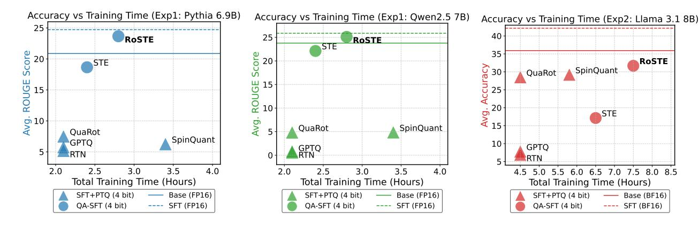

# 1. Introduction

LLMs have shifted a significant step toward achieving artificial general intelligence [\(Bubeck et al.,](#page-9-0) [2023\)](#page-9-0) and exhibit remarkable capabilities across different domains, including text generation [\(Anil et al.,](#page-8-0) [2023;](#page-8-0) [Touvron et al.,](#page-10-0) [2023;](#page-10-0) [Thoppilan et al.,](#page-10-1) [2022\)](#page-10-1), code generation [\(Chen et al.,](#page-9-1) [2021;](#page-9-1) [Austin et al.,](#page-9-2) [2021;](#page-9-2) [Li et al.,](#page-10-2) [2022\)](#page-10-2), and mathematical problem-solving [\(Cobbe et al.,](#page-9-3) [2021;](#page-9-3) [Trinh et al.,](#page-11-0) [2024;](#page-11-0) [Wei](#page-11-1) [et al.,](#page-11-1) [2022;](#page-11-1) [Lewkowycz et al.,](#page-10-3) [2022\)](#page-10-3). To adapt LLMs to various applications and scenarios, supervised fine-tuning (SFT) is a standard approach, enabling models to leverage diverse training data and align with specific tasks based on pre-trained models.

While fine-tuned models excel in domain-specific tasks, their substantial computational and storage demands present challenges for efficient deployment, particularly in resourceconstrained environments [\(Xu et al.,](#page-11-2) [2024a\)](#page-11-2). To address these limitations, various model compression techniques have been developed, including quantization [\(Lin et al.,](#page-10-4) [2023;](#page-10-4) [Frantar et al.,](#page-9-4) [2022\)](#page-9-4), pruning [\(Ma et al.,](#page-10-5) [2023;](#page-10-5) [Sun](#page-10-6) [et al.,](#page-10-6) [2023\)](#page-10-6), distillation [\(Xu et al.,](#page-11-3) [2024b\)](#page-11-3), and low-rank approximation [\(Wang et al.,](#page-11-4) [2024a;](#page-11-4) [Yuan et al.,](#page-11-5) [2023\)](#page-11-5). Among these, quantization is particularly effective for compressing LLMs, as it significantly reduces memory consumption, inference latency and power usage. Additionally, its compatibility with specialized hardware accelerators enhances its practical deployment across diverse devices. Quantization techniques generally fall into two categories: post-training quantization (PTQ) and quantization-aware training (QAT). PTQ is well-suited for quick deployment with minimal resources but often sacrifices accuracy in low-bit settings. In contrast, QAT achieves effective compression with minimal performance loss but requires retraining the entire LLM on a large corpus, incurring substantial computational costs.

For efficient deployment of task-specific LLMs, combining quantization with fine-tuning techniques offers a promising solution. A straightforward approach to obtaining quantized fine-tuned LLMs involves a two-step process: first fine-tune the pre-trained models, then apply quantization. However, applying quantization through PTQ in the second step often degrades the performance of the fine-tuned models, while

Figure 1. RoSTE surpasses the performance of SOTA quantization methods on fine-tuning benchmark. Horizontal axis represents the total amount of hours needed to fine-tune pre-trained LLMs on a server of  $8 \times A100$  NVIDIA GPUs.

QAT introduces an additional training phase, substantially increasing computational costs. Treating fine-tuning and quantization as separate steps can lead to suboptimal results, as it fails to exploit the synergy between these processes.

This work presents one of the first studies on *quantization-aware supervised fine-tuning (QA-SFT)* to obtain effective fine-tuned and quantized LLM through a single training phase. To maximize the hardware capability of modern GPUs, we concentrate on designs utilizing the 4-bit quantization of weights, activations, and KV cache in LLMs. However, low-bit quantization presents a major challenge on models with weight and activation outliers: they expand the quantization range and increase the quantization error, degrading the quantized model accuracy. This partly explains why high-performance data-free QAT methods (Liu et al., 2023) fail at 4-bit activation quantization.

The first key aspect of our work is to leverage rotation-based quantization in QA-SFT. Our work is inspired by recent findings on rotation-based PTQ methods (Ashkboos et al., 2024b; Liu et al., 2024), which demonstrate that applying offline and online rotations to linear projection layers and KV caches in LLMs effectively mitigates weight and activation outliers in post-trained models. However, it is not clear whether one-shot PTQ appraoches should be performed before or after fine-tuning. To address this, we propose a joint training method combining an adaptive selection of rotation matrices and QA-SFT. The second key aspect of our work is to utilize a bilevel optimization formulation that simultaneously tackles QA-SFT and selects the rotation matrices based on the weights and activations.

This paper proposes the Rotated Straight-Through-Estimator (RoSTE) algorithm that integrates the aforementioned ingredients. Our contributions are summarized as:

 We introduce a novel SFT training problem that directly optimizes quantized weights and rotation matrices within a single model architecture. To tame the non-smooth manifold optimization, we propose a bilevel optimization formulation, where *upper level subproblem* optimizes weight matrices, while *lower level subproblem* employs a surrogate loss to guide the selection of rotation matrix.

- To tackle the bilevel QA-SFT optimization, we propose the RoSTE algorithm which alternates between (i) a QAT subroutine incorporating a rotation-enabled straightthrough-estimator (STE) update, and (ii) a low complexity heuristic for selecting rotation matrices based on the random Walsh-Hadamard matrix.
- We provide a theoretical analysis of the benefits of rotation-enabled quantization in QA-SFT by examining the prediction error resulted from the QAT stage of RoSTE. This analysis directly motivates the use of quantization error-based surrogate loss and justifies the adoption of the low-complexity Walsh-Hadamard rotation.

We conduct experiments on fine-tuning Pythia, Qwen and Llama models, demonstrating the effectiveness of RoSTE. An accuracy-vs-training-time plot in Figure 1 illustrates that RoSTE finds quantized fine-tuned models with improved downstream tasks accuracy at the cost of a marginally longer training time. Overall, we believe this is the first work that develops an efficient quantization algorithm for the SFT process, with theoretical justification and practical effectiveness.

#### 1.1. Related Works

The quest on quantizing modern LLMs for efficient deployment started with weight-only quantization. GPTQ (Frantar et al., 2022) stood out as a robust postprocessing algorithm that matches the layer output between a quantized model and a full-precision target model. Soon after, a new trend turned to tackling outlier values in weight matrices and activations due to their incompatibility with quantization (Lin et al., 2023; Lee et al., 2023; Chee et al., 2024; Tseng et al., 2024), pushing the limit of accurately quantized models

below 2-bits. While the memory consumption of storing the model parameters is reduced by weight-only quantization, their activations remain in full precision during inference which prohibits the application of long context LLMs on consumer-grade accelerators with limited memory storage.

This motivates the development of weight-activation quantization. It allows weights and activations to be directly multiplied using discrete arithmetic units that accelerate inference and reduce the inference memory requirement. Existing methods can be categorized as follows: (1) mixedprecision quantization (Dettmers et al., 2022; Zhao et al., 2024) that assigns extra bit-widths to outlier values; (2) scaling-based quantization (Xiao et al., 2022; Shao et al., 2023) that employs scaling to balance the representation range between activations and weights; (3) rotated quantization (Ashkboos et al., 2024b; Liu et al., 2024) that utilizes orthogonal transformation to remove activation outliers; (4) knowledge distillation (Liu et al., 2023; Du et al., 2024; Xu et al., 2024c) that re-trains a quantized model to match the behavior of a full-precision target model. Among these methods, rotated quantization methods demonstrate superior performance in 4-bit weight-activation quantization.

