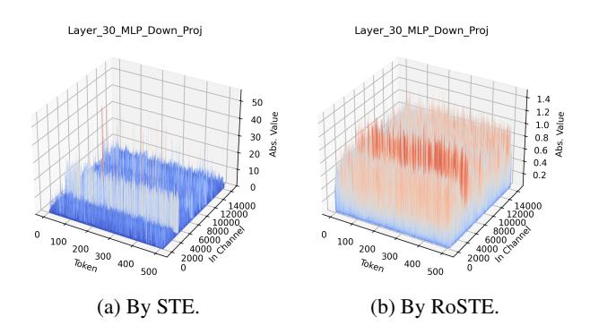

# 5.1. Accuracy of Quantized Models

For Exp.1, we present the accuracies of 4-bits (weights & activation) quantized, fine-tuned Pythia 6.9B and Qwen2.5 7B in Table [1.](#page-7-0) On quantizing Pythia 6.9B, the best baseline is STE (without rotation). In comparison, RoSTE produces a quantized model that improves the average ROUGE score by +3.01. It recovers the performance of the full-precision SFT model with a gap of only -1.06 ROUGE score. Similarly on Qwen2.5 7B model, RoSTE improves upon the best baseline by +1.78 ROUGE score, with a gap of -0.77 below the full-precision SFT model. For Exp.2, we present the accuracies of 4-bits (weights & activation) quantized, fine-tuned Llama 3.1 8B in Table [2.](#page-8-1) Observe that RoSTE improved the average accuracy by +2.56 over the best baseline SpinQuant, despite a gap of -10.47 below the full-precision fine-tuned model.

Figure 3. Visualizations of input activations at layer 30 of converged Llama model trained for QA-SFT using STE and RoSTE.

Lastly, in the appendix, we provide additional results of W4A4K4 and W4A8K4 quantization on Pythia 1B in Table [7,](#page-17-0) Qwen2.5 0.5B in Table [8,](#page-18-0) and Llama 3.1 8B in Table [9.](#page-19-1)

#### 5.2. Ablation Study

We now concentrate on the effects of optimal rotation configuration as practiced in line [5](#page-4-5) of Algorithm [1.](#page-4-1) In Table [3,](#page-8-2) we compare the performance on Exp.1 with Pythia 1B when the random Walsh-Hadamard rotation matrix is applied with different strategies. Notice that the adaptive rotation strategy deployed in RoSTE delivered the best performance.

| Table 2. Results on Exp. 2. Accuracies of the 4-bit quantized Llama 3.1 8B model fine-tuned on the Tulu 3 SFT mixture dataset. BF16        |
|--------------------------------------------------------------------------------------------------------------------------------------------|
| refers to using 16-bit brain floating points format, and W4A4KV4 refers to using 4-bit quantizations on weights, activation, and KV cache. |

| Bit-width    | Method    | TruthfulQA   | MMLU-Pro     | BigBenchHard | AGIEval      | GSM8K        | Math         | Avg.         |
|--------------|-----------|--------------|--------------|--------------|--------------|--------------|--------------|--------------|
| BF16         | Base      | 28.51        | 19.57        | 62.26        | 30.16        | 56.86        | 18.20        | 35.92        |
|              | SFT       | 31.82        | 33.07        | 65.67        | 34.86        | 64.89        | 22.66        | 42.16        |
| W/4 A 4978/4 | RTN       | 23.01        | 0            | 0            | 17.03        | 1.03         | 0            | 6.85         |
|              | GPTQ      | 25.34        | 0.02         | 2.55         | 16.48        | 2.05         | 0            | 7.74         |
|              | QuaRot    | <b>27.66</b> | 21.53        | 47.69        | 29.05        | 37.91        | 6.90         | 28.46        |
| W4A4KV4      | SpinQuant | 26.19        | 21.58        | 49.56        | 28.50        | 38.36        | 10.56        | 29.13        |
|              | STE       | 26.68        | 9.13         | 24.58        | 17.63        | 22.82        | 1.90         | 17.14        |
|              | RoSTE     | 26.44        | <b>25.12</b> | <b>52.00</b> | <b>30.11</b> | <b>44.50</b> | <b>11.94</b> | <b>31.69</b> |

Table 3. Effects of rotation matrix strategies for STE training in Exp. 1 with Pythia 1B that is W4A4KV4 quantized.

| Rotation Strategy         | ROUGE (Avg.) |
|---------------------------|--------------|
| No Rotation               | 22.37        |
| Complete Rotation         | 13.09        |
| RoSTE (Adaptive Rotation) | 23.07        |

Figure 4. The evolution of quantization error (12) against the QAT stage iterations.

When no rotation matrix is applied, we observe a drop in ROUGE score by -0.70, and importantly, the complete rotation setting, i.e., applying rotation matrix on every module regardless of whether empirical quantization error is reduced, suffers a drop in ROGUE score by -9.98. This shows that while it is beneficial to apply rotation in the STE training, an adaptive strategy such as the one in RoSTE is necessary to guarantee good performance.

Secondly, we take a closer look at the effects of outlier reduction to justify our claims on the use of random Walsh-Hadamard rotation matrices. Fig. 3 compares the distribution of the input activations of fine-tuned models trained by STE and RoSTE at layer 30. We observe that the model produced by RoSTE exhibits no activation outliers, while STE suffers from activation outliers even at convergence.

For a more detailed and comprehensive comparison, see Fig. 6 and 7 in the appendix. Furthermore, Fig. 4 shows the trajectory of the quantization error (12) during training. As expected, we see that the quantization error of RoSTE is much lower than that in STE, thus suggesting a lower bias in the solution obtained [cf. Theorem 4.3].

#### 6. Conclusion

This paper proposed the RoSTE algorithm for quantization-aware SFT training with an adaptive rotation strategy. Besides achieving state-of-the-art performance, we also provide theoretical insights to justify the practical efficacy of RoSTE. To the best of our knowledge, this is the first algorithm that leverage adaptive rotation and the fine-tuning objective to produce an accurate quantized model.

### Acknowledgements

M. Hong and Q. Wei are supported in part by NSF grants ECCS-2426064 and CIF-2414372. Q. Wei is also supported by an Amazon Machine Learning Systems Fellowship. C.-Y. Yau and H.-T. Wai are supported by the Shun Hing Institute of Advanced Engineering, CUHK, under Project #MMT-p5-23.

### **Impact Statement**

This paper presents work whose goal is to advance the field of Machine Learning. There are many potential societal consequences of our work, none of which we feel must be specifically highlighted here.

#### References

Anil, R., Dai, A. M., Firat, O., Johnson, M., Lepikhin, D., Passos, A., Shakeri, S., Taropa, E., Bailey, P., Chen, Z., et al. Palm 2 technical report. arXiv preprint arXiv:2305.10403, 2023.

- Ashkboos, S., Croci, M. L., Nascimento, M. G. d., Hoefler, T., and Hensman, J. Slicegpt: Compress large language models by deleting rows and columns. *arXiv preprint arXiv:2401.15024*, 2024a.
- Ashkboos, S., Mohtashami, A., Croci, M. L., Li, B., Jaggi, M., Alistarh, D., Hoefler, T., and Hensman, J. Quarot: Outlier-free 4-bit inference in rotated llms. *arXiv preprint arXiv:2404.00456*, 2024b.
- Austin, J., Odena, A., Nye, M., Bosma, M., Michalewski, H., Dohan, D., Jiang, E., Cai, C., Terry, M., Le, Q., et al. Program synthesis with large language models. *arXiv preprint arXiv:2108.07732*, 2021.
- Bai, Y., Wang, Y.-X., and Liberty, E. Proxquant: Quantized neural networks via proximal operators. *arXiv preprint arXiv:1810.00861*, 2018.
- Biderman, S., Schoelkopf, H., Anthony, Q. G., Bradley, H., O'Brien, K., Hallahan, E., Khan, M. A., Purohit, S., Prashanth, U. S., Raff, E., et al. Pythia: A suite for analyzing large language models across training and scaling. In *International Conference on Machine Learning*, pp. 2397–2430. PMLR, 2023.
- Bondarenko, Y., Del Chiaro, R., and Nagel, M. Lowrank quantization-aware training for llms. *arXiv preprint arXiv:2406.06385*, 2024.
- Bubeck, S., Chandrasekaran, V., Eldan, R., Gehrke, J., Horvitz, E., Kamar, E., Lee, P., Lee, Y. T., Li, Y., Lundberg, S., et al. Sparks of artificial general intelligence: Early experiments with gpt-4. *arXiv preprint arXiv:2303.12712*, 2023.
- Chee, J., Cai, Y., Kuleshov, V., and De Sa, C. M. Quip: 2-bit quantization of large language models with guarantees. *Advances in Neural Information Processing Systems*, 36, 2024.
- Chen, M., Tworek, J., Jun, H., Yuan, Q., Pinto, H. P. D. O., Kaplan, J., Edwards, H., Burda, Y., Joseph, N., Brockman, G., et al. Evaluating large language models trained on code. *arXiv preprint arXiv:2107.03374*, 2021.
- Chen, Z., Deng, Y., Yuan, H., Ji, K., and Gu, Q. Self-play fine-tuning converts weak language models to strong language models. *arXiv preprint arXiv:2401.01335*, 2024.
- Chung, H. W., Hou, L., Longpre, S., Zoph, B., Tay, Y., Fedus, W., Li, Y., Wang, X., Dehghani, M., Brahma, S., et al. Scaling instruction-finetuned language models. *Journal of Machine Learning Research*, 25(70):1–53, 2024.
- Cobbe, K., Kosaraju, V., Bavarian, M., Chen, M., Jun, H., Kaiser, L., Plappert, M., Tworek, J., Hilton, J., Nakano, R., et al. Training verifiers to solve math word problems. *arXiv preprint arXiv:2110.14168*, 2021.

- Courbariaux, M., Bengio, Y., and David, J.-P. Binaryconnect: Training deep neural networks with binary weights during propagations. *Advances in neural information processing systems*, 28, 2015.
- Dettmers, T., Lewis, M., Belkada, Y., and Zettlemoyer, L. Gpt3. int8 (): 8-bit matrix multiplication for transformers at scale. *Advances in Neural Information Processing Systems*, 35:30318–30332, 2022.
- Dettmers, T., Pagnoni, A., Holtzman, A., and Zettlemoyer, L. Qlora: Efficient finetuning of quantized llms. *Advances in Neural Information Processing Systems*, 36, 2023.
- Du, D., Zhang, Y., Cao, S., Guo, J., Cao, T., Chu, X., and Xu, N. Bitdistiller: Unleashing the potential of sub-4-bit llms via self-distillation. *arXiv preprint arXiv:2402.10631*, 2024.
- Dubey, A., Jauhri, A., Pandey, A., Kadian, A., Al-Dahle, A., Letman, A., Mathur, A., Schelten, A., Yang, A., Fan, A., et al. The llama 3 herd of models. *arXiv preprint arXiv:2407.21783*, 2024.
- Egiazarian, V., Panferov, A., Kuznedelev, D., Frantar, E., Babenko, A., and Alistarh, D. Extreme compression of large language models via additive quantization. *arXiv preprint arXiv:2401.06118*, 2024.
- Fino and Algazi. Unified matrix treatment of the fast walshhadamard transform. *IEEE Transactions on Computers*, 100(11):1142–1146, 1976.
- Frantar, E., Ashkboos, S., Hoefler, T., and Alistarh, D. Gptq: Accurate post-training quantization for generative pretrained transformers. *arXiv preprint arXiv:2210.17323*, 2022.
- Gao, L., Tow, J., Biderman, S., Black, S., DiPofi, A., Foster, C., Golding, L., Hsu, J., McDonell, K., Muennighoff, N., et al. A framework for few-shot language model evaluation. *Version v0. 0.1. Sept*, 10:8–9, 2021.
- Hendrycks, D., Burns, C., Basart, S., Zou, A., Mazeika, M., Song, D., and Steinhardt, J. Measuring massive multitask language understanding. *arXiv preprint arXiv:2009.03300*, 2020.
- Huang, S., Noukhovitch, M., Hosseini, A., Rasul, K., Wang, W., and Tunstall, L. The n+ implementation details of rlhf with ppo: A case study on tl; dr summarization. *arXiv preprint arXiv:2403.17031*, 2024.
- Jacob, B., Kligys, S., Chen, B., Zhu, M., Tang, M., Howard, A., Adam, H., and Kalenichenko, D. Quantization and training of neural networks for efficient integerarithmetic-only inference. In *Proceedings of the IEEE conference on computer vision and pattern recognition*, pp. 2704–2713, 2018.

- Lambert, N., Morrison, J., Pyatkin, V., Huang, S., Ivison, H., Brahman, F., Miranda, L. J. V., Liu, A., Dziri, N., Lyu, S., et al. T\" ulu 3: Pushing frontiers in open language model post-training. *arXiv preprint arXiv:2411.15124*, 2024.
- Lee, C., Jin, J., Kim, T., Kim, H., and Park, E. Owq: Outlieraware weight quantization for efficient fine-tuning and inference of large language models. *arXiv preprint arXiv:2306.02272*, 2023.
- Lee, J., Park, S., Hong, S., Kim, M., Chang, D.-S., and Choi, J. Improving conversational abilities of quantized large language models via direct preference alignment. *arXiv preprint arXiv:2407.03051*, 2024.
- Lewkowycz, A., Andreassen, A., Dohan, D., Dyer, E., Michalewski, H., Ramasesh, V., Slone, A., Anil, C., Schlag, I., Gutman-Solo, T., et al. Solving quantitative reasoning problems with language models. *Advances in Neural Information Processing Systems*, 35:3843–3857, 2022.
- Li, H., De, S., Xu, Z., Studer, C., Samet, H., and Goldstein, T. Training quantized nets: A deeper understanding. *Advances in Neural Information Processing Systems*, 30, 2017.
- Li, J., Zeng, S., Wai, H.-T., Li, C., Garcia, A., and Hong, M. Getting more juice out of the sft data: Reward learning from human demonstration improves sft for llm alignment. *arXiv preprint arXiv:2405.17888*, 2024.
- Li, Y., Choi, D., Chung, J., Kushman, N., Schrittwieser, J., Leblond, R., Eccles, T., Keeling, J., Gimeno, F., Dal Lago, A., et al. Competition-level code generation with alphacode. *Science*, 378(6624):1092–1097, 2022.
- Liang, T. and Rakhlin, A. Just interpolate: Kernel "Ridgeless" regression can generalize. *The Annals of Statistics*, 48(3):1329 – 1347, 2020.
- Lin, C.-Y. Rouge: A package for automatic evaluation of summaries. In *Text summarization branches out*, pp. 74–81, 2004.
- Lin, H., Xu, H., Wu, Y., Cui, J., Zhang, Y., Mou, L., Song, L., Sun, Z., and Wei, Y. Duquant: Distributing outliers via dual transformation makes stronger quantized llms. *Advances in Neural Information Processing Systems*, 37: 87766–87800, 2024.
- Lin, J., Tang, J., Tang, H., Yang, S., Chen, W.-M., Wang, W.-C., Xiao, G., Dang, X., Gan, C., and Han, S. Awq: Activation-aware weight quantization for llm compression and acceleration. *arXiv preprint arXiv:2306.00978*, 2023.

- Lin, S., Hilton, J., and Evans, O. Truthfulqa: Measuring how models mimic human falsehoods. *arXiv preprint arXiv:2109.07958*, 2021.
- Liu, Z., Oguz, B., Zhao, C., Chang, E., Stock, P., Mehdad, Y., Shi, Y., Krishnamoorthi, R., and Chandra, V. Llm-qat: Data-free quantization aware training for large language models. *arXiv preprint arXiv:2305.17888*, 2023.
- Liu, Z., Zhao, C., Fedorov, I., Soran, B., Choudhary, D., Krishnamoorthi, R., Chandra, V., Tian, Y., and Blankevoort, T. Spinquant–llm quantization with learned rotations. *arXiv preprint arXiv:2405.16406*, 2024.
- Ma, S., Bassily, R., and Belkin, M. The power of interpolation: Understanding the effectiveness of sgd in modern over-parametrized learning. In *International Conference on Machine Learning*, pp. 3325–3334. PMLR, 2018.
- Ma, X., Fang, G., and Wang, X. Llm-pruner: On the structural pruning of large language models. *Advances in neural information processing systems*, 36:21702–21720, 2023.
- Ouyang, L., Wu, J., Jiang, X., Almeida, D., Wainwright, C., Mishkin, P., Zhang, C., Agarwal, S., Slama, K., Ray, A., et al. Training language models to follow instructions with human feedback. *Advances in neural information processing systems*, 35:27730–27744, 2022.
- Panferov, A., Chen, J., Tabesh, S., Castro, R. L., Nikdan, M., and Alistarh, D. Quest: Stable training of llms with 1-bit weights and activations. *arXiv preprint arXiv:2502.05003*, 2025.
- Shao, W., Chen, M., Zhang, Z., Xu, P., Zhao, L., Li, Z., Zhang, K., Gao, P., Qiao, Y., and Luo, P. Omniquant: Omnidirectionally calibrated quantization for large language models. *arXiv preprint arXiv:2308.13137*, 2023.
- Sun, M., Liu, Z., Bair, A., and Kolter, J. Z. A simple and effective pruning approach for large language models. *arXiv preprint arXiv:2306.11695*, 2023.
- Suzgun, M., Scales, N., Scharli, N., Gehrmann, S., Tay, ¨ Y., Chung, H. W., Chowdhery, A., Le, Q. V., Chi, E. H., Zhou, D., et al. Challenging big-bench tasks and whether chain-of-thought can solve them. *arXiv preprint arXiv:2210.09261*, 2022.
- Thoppilan, R., De Freitas, D., Hall, J., Shazeer, N., Kulshreshtha, A., Cheng, H.-T., Jin, A., Bos, T., Baker, L., Du, Y., et al. Lamda: Language models for dialog applications. *arXiv preprint arXiv:2201.08239*, 2022.
- Touvron, H., Martin, L., Stone, K., Albert, P., Almahairi, A., Babaei, Y., Bashlykov, N., Batra, S., Bhargava, P.,

- Bhosale, S., et al. Llama 2: Open foundation and finetuned chat models. *arXiv preprint arXiv:2307.09288*, 2023.
- Trinh, T. H., Wu, Y., Le, Q. V., He, H., and Luong, T. Solving olympiad geometry without human demonstrations. *Nature*, 625(7995):476–482, 2024.
- Tseng, A., Chee, J., Sun, Q., Kuleshov, V., and De Sa, C. Quip#: Even better llm quantization with hadamard incoherence and lattice codebooks. *arXiv preprint arXiv:2402.04396*, 2024.
- Vaswani, S., Mishkin, A., Laradji, I., Schmidt, M., Gidel, G., and Lacoste-Julien, S. Painless stochastic gradient: Interpolation, line-search, and convergence rates. *Advances in neural information processing systems*, 32, 2019.
- Wang, X., Zheng, Y., Wan, Z., and Zhang, M. Svdllm: Truncation-aware singular value decomposition for large language model compression. *arXiv preprint arXiv:2403.07378*, 2024a.
- Wang, Y., Ma, X., Zhang, G., Ni, Y., Chandra, A., Guo, S., Ren, W., Arulraj, A., He, X., Jiang, Z., et al. Mmlu-pro: A more robust and challenging multi-task language understanding benchmark. *arXiv preprint arXiv:2406.01574*, 2024b.
- Wei, J., Wang, X., Schuurmans, D., Bosma, M., Xia, F., Chi, E., Le, Q. V., Zhou, D., et al. Chain-of-thought prompting elicits reasoning in large language models. *Advances in neural information processing systems*, 35:24824–24837, 2022.
- Xiao, G., Lin, J., Seznec, M., Wu, H., Demouth, J., and Han, S. Smoothquant: Accurate and efficient post-training quantization for large language models. *arXiv preprint arXiv:2211.10438*, 2022.
- Xu, M., Yin, W., Cai, D., Yi, R., Xu, D., Wang, Q., Wu, B., Zhao, Y., Yang, C., Wang, S., et al. A survey of resourceefficient llm and multimodal foundation models. *arXiv preprint arXiv:2401.08092*, 2024a.
- Xu, X., Li, M., Tao, C., Shen, T., Cheng, R., Li, J., Xu, C., Tao, D., and Zhou, T. A survey on knowledge distillation of large language models. *arXiv preprint arXiv:2402.13116*, 2024b.
- Xu, Y., Xie, L., Gu, X., Chen, X., Chang, H., Zhang, H., Chen, Z., Zhang, X., and Tian, Q. Qa-lora: Quantizationaware low-rank adaptation of large language models. *arXiv preprint arXiv:2309.14717*, 2023.
- Xu, Y., Han, X., Yang, Z., Wang, S., Zhu, Q., Liu, Z., Liu, W., and Che, W. Onebit: Towards extremely low-bit large language models. *arXiv preprint arXiv:2402.11295*, 2024c.

- Yang, A., Yang, B., Zhang, B., Hui, B., Zheng, B., Yu, B., Li, C., Liu, D., Huang, F., Wei, H., et al. Qwen2. 5 technical report. *arXiv preprint arXiv:2412.15115*, 2024.
- Yin, P., Lyu, J., Zhang, S., Osher, S., Qi, Y., and Xin, J. Understanding straight-through estimator in training activation quantized neural nets. *arXiv preprint arXiv:1903.05662*, 2019.
- Yuan, Z., Shang, Y., Song, Y., Wu, Q., Yan, Y., and Sun, G. Asvd: Activation-aware singular value decomposition for compressing large language models. *arXiv preprint arXiv:2312.05821*, 2023.
- Zhao, Y., Lin, C.-Y., Zhu, K., Ye, Z., Chen, L., Zheng, S., Ceze, L., Krishnamurthy, A., Chen, T., and Kasikci, B. Atom: Low-bit quantization for efficient and accurate llm serving. *Proceedings of Machine Learning and Systems*, 6:196–209, 2024.
- Zhong, W., Cui, R., Guo, Y., Liang, Y., Lu, S., Wang, Y., Saied, A., Chen, W., and Duan, N. Agieval: A human-centric benchmark for evaluating foundation models. *arXiv preprint arXiv:2304.06364*, 2023.

### A. Proof of Theorem 4.3

*Proof.* In this proof, we will use the following equality interchangeably:

$$\widehat{\mathcal{L}}(\mathbf{m}_{Q,\mathbf{R}}^t) = \mathbb{E}\left[\left(\left\langle Q_x(\mathbf{R}\mathbf{x}_{\xi}) \mid Q_w(\mathbf{R}\mathbf{w}^t)\right\rangle - \mathbf{y}_{\xi}\right)^2\right] = \mathbb{E}\left[\left\|Q_w(\mathbf{R}\mathbf{w}^t) - \mathbf{w}_{\mathbf{R}}^{\star}\right\|_{\mathbf{G}}^2\right]$$
(23)

Consider the update rule of our algorithm as  $\mathbf{w}^{t+1} = \mathbf{w}^t - \eta(\langle Q_x(\mathbf{R}\mathbf{x}_t) \mid Q_w(\mathbf{R}\mathbf{w}^t) \rangle - \mathbf{y}_t)\mathbf{R}^\top Q_x(\mathbf{R}\mathbf{x}_t)$ , we compute

$$\mathbb{E}\left[\left(\left\langle Q_x(\mathbf{R}\mathbf{x}_{\xi}) \mid Q_w(\mathbf{R}\mathbf{w}^{t+1})\right\rangle - \mathbf{y}_{\xi}\right)^2\right]$$
(24)

$$= \mathbb{E}\left[\left\langle Q_x(\mathbf{R}\mathbf{x}_{\xi}) \mid Q_w(\mathbf{R}\mathbf{w}^{t+1}) - \mathbf{w}_{\mathbf{R}}^{\star} + Q_w(\mathbf{R}\mathbf{w}^t) - Q_w(\mathbf{R}\mathbf{w}^t)\right\rangle^2\right]$$
(25)

$$= \mathbb{E}\left[\left(\underbrace{\left\langle Q_x(\mathbf{R}\mathbf{x}_{\xi}) \mid Q_w(\mathbf{R}\mathbf{w}^t) - \mathbf{w}_{\mathbf{R}}^{\star}\right\rangle}_{p_1^t} + \underbrace{\left\langle Q_x(\mathbf{R}\mathbf{x}_{\xi}) \mid Q_w(\mathbf{R}\mathbf{w}^{t+1}) - Q_w(\mathbf{R}\mathbf{w}^t)\right\rangle}_{p_2^t}\right)^2\right]$$
(26)

Now observe that

$$\mathbb{E}\left[(p_2^t)^2\right] \tag{27}$$

$$= \mathbb{E}\left[\|Q_w(\mathbf{R}\mathbf{w}^{t+1}) - Q_w(\mathbf{R}\mathbf{w}^t)\|_{\mathbf{G}}^2\right]$$
(28)

$$\leq 3\mathbb{E}\left[\|\mathbf{R}\mathbf{w}^{t+1} - \mathbf{R}\mathbf{w}^{t}\|_{\mathbf{G}}^{2}\right] + 3\mathbb{E}\left[\|\mathbf{e}(\mathbf{R}\mathbf{w}^{t+1})\|_{\mathbf{G}}^{2}\right] + 3\mathbb{E}\left[\|\mathbf{e}(\mathbf{R}\mathbf{w}^{t})\|_{\mathbf{G}}^{2}\right]$$
(29)

$$=3\eta^{2}\mathbb{E}\left[\|Q_{x}(\mathbf{R}\mathbf{x}_{t})\|_{\mathbf{G}}^{2}\left\langle Q_{x}(\mathbf{R}\mathbf{x}_{t})\mid Q_{w}(\mathbf{R}\mathbf{w}^{t})-\mathbf{w}_{\mathbf{R}}^{\star}\right\rangle^{2}\right]+3\mathbb{E}\left[\|\mathbf{e}(\mathbf{R}\mathbf{w}^{t+1})\|_{\mathbf{G}}^{2}\right]+3\mathbb{E}\left[\|\mathbf{e}(\mathbf{R}\mathbf{w}^{t})\|_{\mathbf{G}}^{2}\right]$$
(30)

$$\leq 3\eta^{2}\rho\mathbb{E}\left[\|Q_{w}(\mathbf{R}\mathbf{w}^{t}) - \mathbf{w}_{\mathbf{R}}^{\star}\|_{\mathbf{G}}^{2}\right] + 3\mathbb{E}\left[\|\mathbf{e}(\mathbf{R}\mathbf{w}^{t+1})\|_{\mathbf{G}}^{2}\right] + 3\mathbb{E}\left[\|\mathbf{e}(\mathbf{R}\mathbf{w}^{t})\|_{\mathbf{G}}^{2}\right]$$
(31)

where the last inequality is due to the independence  $\mathbf{x}_{\xi} \perp \mathbf{x}_{t} \perp \mathbf{w}^{t}$  and uses Assumption 4.1. Furthermore,

$$2\mathbb{E}\left[p_1^t p_2^t\right] \tag{32}$$

$$= 2\mathbb{E}\left[p_1^t \left\langle Q_x(\mathbf{R}\mathbf{x}_{\mathcal{E}}) \mid \mathbf{R}\mathbf{w}^{t+1} - \mathbf{R}\mathbf{w}^t + \mathbf{e}(\mathbf{R}\mathbf{w}^{t+1}) - \mathbf{e}(\mathbf{R}\mathbf{w}^t)\right\rangle\right]$$
(33)

$$=-2\eta \mathbb{E}\left[\left\langle Q_x(\mathbf{R}\mathbf{x}_{\xi}) \mid Q_w(\mathbf{R}\mathbf{w}^t) - \mathbf{w}_{\mathbf{R}}^{\star} \right\rangle \left\langle Q_x(\mathbf{R}\mathbf{x}_{\xi}) \mid Q_x(\mathbf{R}\mathbf{x}_{t}) \right\rangle \left\langle Q_x(\mathbf{R}\mathbf{x}_{t}) \mid Q_w(\mathbf{R}\mathbf{w}^t) - \mathbf{w}_{\mathbf{R}}^{\star} \right\rangle\right]$$

$$+2\mathbb{E}\left[\left\langle Q_x(\mathbf{R}\mathbf{x}_{\xi}) \mid Q_w(\mathbf{R}\mathbf{w}^t) - \mathbf{w}_{\mathbf{R}}^{\star} \right\rangle \left\langle Q_x(\mathbf{R}\mathbf{x}_{\xi}) \mid \mathbf{e}(\mathbf{R}\mathbf{w}^{t+1}) - \mathbf{e}(\mathbf{R}\mathbf{w}^t) \right\rangle\right]$$
(34)

$$\leq -2\eta \mathbb{E}\left[\|Q_w(\mathbf{R}\mathbf{w}^t) - \mathbf{w}_{\mathbf{R}}^{\star}\|_{\mathbf{G}^2}^2\right] + \eta \lambda_{\min} \mathbb{E}\left[\|Q_w(\mathbf{R}\mathbf{w}^t) - \mathbf{w}_{\mathbf{R}}^{\star}\|_{\mathbf{G}}^2\right]$$
(35)

$$+\frac{2}{\eta \lambda_{\min}} \mathbb{E}\left[\|\mathbf{e}(\mathbf{R}\mathbf{w}^{t+1})\|_{\mathbf{G}}^{2}\right] + \frac{2}{\eta \lambda_{\min}} \mathbb{E}\left[\|\mathbf{e}(\mathbf{R}\mathbf{w}^{t})\|_{\mathbf{G}}^{2}\right]$$
(36)

$$\leq -\eta \lambda_{\min} \mathbb{E}\left[\|Q_w(\mathbf{R}\mathbf{w}^t) - \mathbf{w}_{\mathbf{R}}^{\star}\|_{\mathbf{G}}^2\right] + \frac{2}{\eta \lambda_{\min}} \mathbb{E}\left[\|\mathbf{e}(\mathbf{R}\mathbf{w}^{t+1})\|_{\mathbf{G}}^2\right] + \frac{2}{\eta \lambda_{\min}} \mathbb{E}\left[\|\mathbf{e}(\mathbf{R}\mathbf{w}^t)\|_{\mathbf{G}}^2\right]$$
(37)

where the last step is due to the independence  $\mathbf{x}_{\xi} \perp \mathbf{x}_{t} \perp \mathbf{w}^{t}$  and (17). Therefore, we obtain

$$\mathbb{E}\left[\|Q_w(\mathbf{R}\mathbf{w}^{t+1}) - \mathbf{w}_{\mathbf{R}}^{\star}\|_{\mathbf{G}}^2\right] \tag{38}$$

$$\leq (1 - \eta \lambda_{\min} + 3\eta^{2} \rho) \mathbb{E}\left[\|Q_{w}(\mathbf{R}\mathbf{w}^{t}) - \mathbf{w}_{\mathbf{R}}^{\star}\|_{\mathbf{G}}^{2}\right] + (3 + \frac{2}{\eta \lambda_{\min}}) \left(\mathbb{E}\left[\|\mathbf{e}(\mathbf{R}\mathbf{w}^{t+1})\|_{\mathbf{G}}^{2}\right] + \mathbb{E}\left[\|\mathbf{e}(\mathbf{R}\mathbf{w}^{t})\|_{\mathbf{G}}^{2}\right]\right)$$
(39)

$$\stackrel{(i)}{\leq} (1 - \eta \lambda_{\min}/2) \mathbb{E} \left[ \|Q_w(\mathbf{R}\mathbf{w}^t) - \mathbf{w}_{\mathbf{R}}^{\star}\|_{\mathbf{G}}^2 \right] + (3 + \frac{2}{\eta \lambda_{\min}}) \left( \mathbb{E} \left[ \|\mathbf{e}(\mathbf{R}\mathbf{w}^{t+1})\|_{\mathbf{G}}^2 \right] + \mathbb{E} \left[ \|\mathbf{e}(\mathbf{R}\mathbf{w}^t)\|_{\mathbf{G}}^2 \right] \right)$$
(40)

$$\leq (1 - \eta \lambda_{\min}/2)^{t+1} \mathbb{E}\left[ \|Q_w(\mathbf{R}\mathbf{w}^0) - \mathbf{w}_{\mathbf{R}}^{\star}\|_{\mathbf{G}}^2 \right]$$
(41)

$$+ \left(3 + \frac{2}{\eta \lambda_{\min}}\right) \sum_{k=0}^{t} (1 - \eta \lambda_{\min}/2)^{t-k} \left( \mathbb{E}\left[ \|\mathbf{e}(\mathbf{R}\mathbf{w}^{k+1})\|_{\mathbf{G}}^{2} \right] + \mathbb{E}\left[ \|\mathbf{e}(\mathbf{R}\mathbf{w}^{k})\|_{\mathbf{G}}^{2} \right] \right)$$
(42)

where (i) uses the step size condition  $\eta \leq \lambda_{\min}/(6\rho)$ . Choosing the step size  $\eta = \lambda_{\min}/(6\rho)$  completes the proof.

#### B. Proof of Proposition 4.4

*Proof.* By the definition of  $Q_w$  in (2) and (3), we notice

$$\|Q_w(\mathbf{w}) - \mathbf{w}\|^2 = \left\| s(\mathbf{w}) \left[ \frac{\mathbf{w}}{s(\mathbf{w})} \right] - s(\mathbf{w}) \frac{\mathbf{w}}{s(\mathbf{w})} \right\|^2 = s(\mathbf{w})^2 \left\| \left[ \frac{\mathbf{w}}{s(\mathbf{w})} \right] - \frac{\mathbf{w}}{s(\mathbf{w})} \right\|^2$$
(43)

$$\stackrel{(i)}{\leq} s(\mathbf{w})^2 \frac{d}{4} = \frac{d \max_i \mathbf{w}_i^2}{4(2^{b_w - 1} - 1)^2} \tag{44}$$

where (i) is a worst-case error bound of nearest rounding. This proves [\(20\)](#page-6-4). Further applying [\(Tseng et al.,](#page-11-6) [2024,](#page-11-6) Lemma 3.1) in our last step gives [\(21\)](#page-6-2). □

