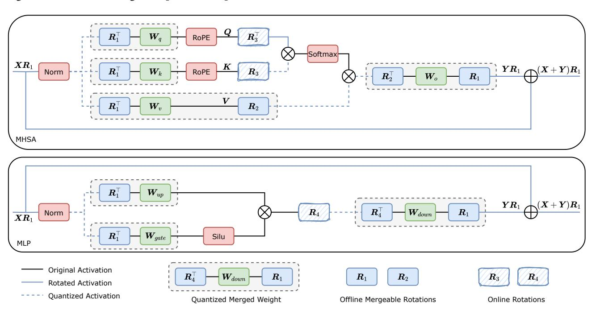

# D. Implementation Details of the Rotated-and-Quantized LLM

Our architecture for inserting rotation matrices and quantization on transformer models follows from (Liu et al., 2024). For completeness, an illustration is provided in Figure 5. In the following sections, we describe the details of the RoSTE algorithm under the setting of Exp.1 and Exp.2.

Figure 5. An illustration of the rotation workflow in a transformer-based model.  $\mathbf{R}_1$  represents the between-block rotation, which eliminates activation outliers between blocks.  $\mathbf{R}_2$ ,  $\mathbf{R}_3$ ,  $\mathbf{R}_4$  are in-block rotations designed to remove outliers within the MHSA and MLP blocks. Among these,  $\mathbf{R}_1$ ,  $\mathbf{R}_1^{\top}$ ,  $\mathbf{R}_2$ ,  $\mathbf{R}_2^{\top}$ ,  $\mathbf{R}_4^{\top}$  can be merged into weights while  $\mathbf{R}_3$ ,  $\mathbf{R}_3^{\top}$ ,  $\mathbf{R}_4$  are not mergeable and serve as online rotations during training and inference.

**Quantization on LLMs.** We adopt the asymmetric uniform quantizer (4) for all the experiments. For instance, to quantize the activations  $\mathbf{X}$  of dimensions [batch size, sequence length, embedding size], we employ per-token quantization such that each embedding  $\mathbf{X}_{ij}$  forms a quantization group. To quantize the linear weight values  $\mathbf{W}$ , we employ per-channel quantization such that each i-th output channel's weights  $\mathbf{W}_i$  form a quantization group.

**Modifying Normalization Layer.** We modify the model to maintain computational invariance before and after applying rotation. This requires ensuring that there are no mean subtraction, scaling, or shifting operations in the normalization module. For models with LayerNorm, such as Pythia, the process involves absorbing the mean subtraction operation into the weight matrix before LayerNorm and absorbing the LayerNorm scaling and shifting parameters into the weight matrix after the LayerNorm layer (Ashkboos et al., 2024a). Similarly, for models using RMSNorm, such as Llama, this can be achieved by absorbing the RMSNorm scaling parameter into the weight matrix immediately following the RMSNorm layer.

**Between-Block & In-Block Rotation.** We perform between-block rotation  $\mathbf{R}_1$  to eliminate the activation outliers between blocks. As illustrated in Fig. 5,  $\mathbf{R}_1$  is applied to all linear layers in MHSA and MLP blocks. In particular, the weight

matrices in the Q, K, and V projection layers of MHSA, as well as the Up and Gate projection layers of MLP, are rotated along with their corresponding input activations to preserve computational invariance. Similarly, the weight matrices in the O projection layer of MHSA and the Down projection layer of MLP, along with their corresponding outputs, are also rotated using R1. Additionally, we also rotate the embedding and lm head layers so that the final output of the model will be identical to the original model. Next, we perform in-block rotations R2, R3, R4 to eliminate the activation outliers within blocks. Specially, R2 is applied to the Value and the O projection layer of MHSA. R3 works for the Query and Key. R2 and R3 can remove the activation outliers for KV caches. We apply R4 to the Down projection layer of MLP.

R1, R2 are offline mergeable rotations, which can be merged into the weight matrices before training. R3, R4 are online rotations, which are implemented in the fast Hadamard kernel and can be seen as a layer dynamically rotating the input activation. This online operation is highly efficient by leveraging the fast Hadamard CUDA kernel, resulting in negligible overhead during both training and inference.

