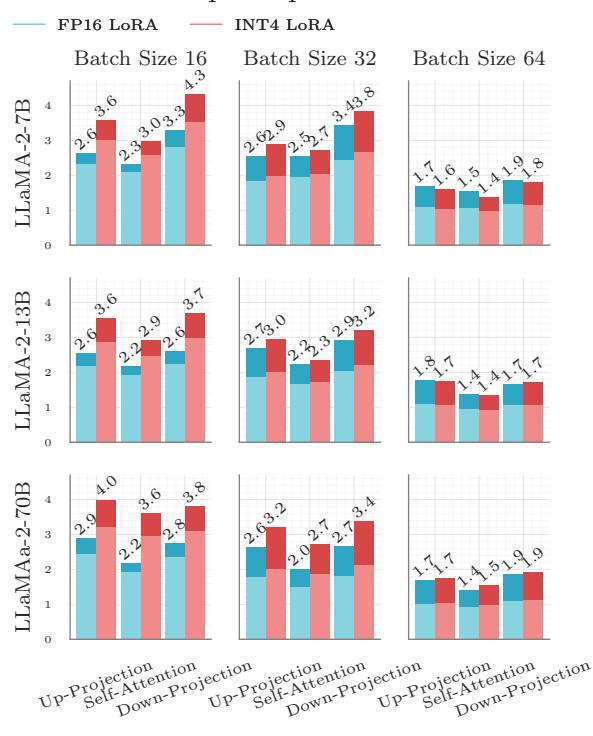

# **Algorithm 2** SLIM-LoRA Saliency-based Low-rank Adapter Computation

```
1: Input: Original Weight: \mathcal{W}, Compressed Weight: \mathcal{W}^C Calibration Input: \mathcal{X}
2: Output: \mathcal{L}, \mathcal{R}: Saliency-based Low-rank Adapters
3: E_C = E_Q + E_S = \mathcal{W}^C - \mathcal{W} // Compute Error
4: \tilde{\mathbf{x}} = mean(\mathcal{X}) // Average over all the samples
5: \mathbf{x} = \tilde{\mathbf{x}} + min(|\tilde{\mathbf{x}}|) // Shift values to avoid zeros in \mathbf{x}
6: S_C = diag(\mathbf{x})E_C // Compute error saliency
7: \tilde{\mathcal{L}}, \tilde{\mathcal{R}} = SVD(\mathcal{S}_C) // Low-rank approximation
8: \mathcal{L} = diag(1/\mathbf{x})\tilde{\mathcal{L}} // Converting saliency to weight
9: \mathcal{R} = \tilde{\mathcal{R}}
```

a comprehensive overview of the steps involved in computing saliency-based low-rank adapters using SLIM-LoRA, ensuring reproducibility and clarity.

#### 3.3. Low-rank Adapter Quantization

While pruning and quantizing the weights significantly reduce the model's computation and memory requirements ( $\sim 8 \times$  memory footprint reduction), incorporating full-precision low-rank adapters reintroduces overhead, partially offsetting these gains. To address this, we applied 4-bit quantization to compress the adapters. This step ensures that the compression efficiency achieved through weight pruning and quantization is preserved, while maintaining the performance benefits of the low-rank adapters.

Quantizing low-rank adapters poses unique challenges due to the long-tailed distribution of their elements, which limits the effectiveness of advanced non-group quantization methods, such as SLIM-Quant. To address this, we adopt an AbsMax group quantization scheme for the adapters, where groups of 128 elements share the same quantization parameter. By grouping elements, this method effectively captures the distribution's variability while minimizing quantization error, striking a balance between accuracy and compression. This approach not only reduces the adapter overhead by  $4\times$  but ensures that their contribution to overall model compression and performance is retained; as demonstrated in our experimental evaluation.

#### 3.4. Optional Post-compression Fine-tuning

Fine-tuning large language models post-compression has many challenges because the high parameter count and memory demands of traditional methods make them computationally prohibitive. For example, using a simple optimizer such as ADAMW leads to  $4\times$  additional memory overhead to store gradient and optimizer states, rendering these approaches impractical for compressed models. Thus, parameter-efficient fine-tuning is essential for preserving the benefits of compression while avoiding excessive computational and memory costs. This necessity is further highlighted by the results in Section 4, which illustrate the overheads of traditional fine-tuning and the advantages of

parameter-efficient alternatives.

To overcome the challenges of fine-tuning compressed models, SLIM employs parameter-efficient low-rank adapters as the only tunable components during the fine-tuning phase. During this optional phase, SLIM freezes the sparse and quantized weights, enabling focused fine-tuning solely on the adapters. If the adapters are quantized, SLIM uses a straight-through estimator (STE) for quantization-aware fine-tuning and reduces its overheads with custom quantization and dequantization kernels implemented in Triton. This parameter-efficient fine-tuning method allows rapid accuracy improvements for the compressed model, requiring only a short phase over thousands of tokens. By limiting the fine-tuning process to a small subset of parameters, SLIM significantly reduces computational requirements while ensuring the model can adapt effectively to new data or tasks. This approach maintains the benefits of compression while enabling efficient adaptation, as demonstrated by the significant improvements achieved during fine-tuning.

#### <span id="page-5-1"></span>4. Experimental Results

Models, Datasets, and Evaluation.<sup>3</sup> We evaluate SLIM on the OPT (Zhang et al., 2022) and LLaMA-2 (Touvron et al., 2023) model families, both of which serve as standard baselines in model compression studies (Ma et al., 2024; Frantar & Alistarh, 2023; Sun et al., 2023). Model accuracy is assessed on a range of zero-shot downstream tasks, including MMLU (Hendrycks et al., 2020), Piqa (Bisk et al., 2020), Arc-Easy, Arc-Challenge (Clark et al., 2018), WinoGrande (Sakaguchi et al., 2021), and OpenBookQA (Mihaylov et al., 2018). For zero-shot evaluations, we utilize the Language Model Evaluation Harness (Gao et al., 2024) framework. In line with prior work (Sun et al., 2023; Frantar & Alistarh, 2023; Ma et al., 2024), we also report the perplexity of the models on a language modeling task on the WikiText2 (Merity et al., 2016) dataset, provided in Appendix G.

Baselines. We compare SLIM against state-of-the-art one-shot pruning methods, including Wanda (Sun et al., 2023), SparseGPT (Frantar & Alistarh, 2023), and Magnitude Pruning (Han et al., 2015), as well as one-shot quantization techniques like OPTQ (Frantar et al., 2022), OmniQuant (Shao et al., 2023), AffineQuant (Ma et al., 2024), L<sup>2</sup>QER (Zhang et al., 2024a), and AbsMax. Additionally, we extend Joint Sparsification and Quantization (JSQ) (Guo et al., 2024) to support 4-bit weight quantization and include it in our experiments. To ensure fairness, we use the optimal hyperparameters reported for each method, or the default hyperparameters if not explicitly reported. For a thorough **description of the notations** used to show the dif-

<span id="page-5-2"></span><sup>&</sup>lt;sup>3</sup>All the experiments in the paper were run at the University of Toronto

ferent variants of SLIM, please see Table [4](#page-12-0) in Appendix [A.](#page-12-1) For more details about the hyperparameters used in different experiments, please see Appendix [T.](#page-24-0)

L <sup>2</sup>QER [\(Zhang et al.,](#page-11-7) [2024a\)](#page-11-7) and OATS [\(Zhang & Papyan,](#page-11-13) [2024\)](#page-11-13) are the two independent and concurrent compression methods utilizing zero-shot low-rank adapters to enhance model accuracy. Our approach, SLIM, significantly diverges from them in several key aspects. First, we employ saliency-based low-rank adapters to mitigate compression loss in *quantized and sparse* models, whereas L<sup>2</sup>QER is tailored exclusively for quantization, resulting in reduced accuracy when combined with sparsity, as demonstrated in the subsequent subsections, and OATS is designed for unstructured sparsity only without quantization, which does not have acceleration support on NVIDIA GPUs. Second, we introduce SLIM-Quant , which lowers the overhead and complexity of group quantization compared to methods like L<sup>2</sup>QER. Finally, SLIM compresses and fine-tunes lowrank adapters efficiently to minimize overhead. In contrast, L <sup>2</sup>QER and OATS rely on full-precision low-rank adapters, which incur additional overhead and do not benefit from the parameter-efficient fine-tuning proposed in our work.

Accuracy Results. We evaluate the accuracy of SLIM and other state-of-the-art pruning and quantization methods across 2:4 and unstructured sparsity benchmarks, highlighting SLIM's superiority in Table [1.](#page-7-0) SparseGPT and Group OPTQ, designed to work together, achieve competitive performance. For other advanced quantization methods, we pruned models using Wanda and quantized the sparse checkpoints with Group AbsMax, AWQ, OmniQuant, and AffineQuant, reporting the best results (detailed in Appendix [H\)](#page-17-0). In particular, methods such as OmniQuant and AffineQuant struggle to quantize OPT-350M, often resulting in NaN values. Moreover, AWQ, OmniQuant, AffineQuant, and L<sup>2</sup>QER encounter out-of-memory (OOM) errors when compressing models on a single A100-40GB GPU. While JSQ performs well for the LLaMA-2 family, its difficulty compressing the OPT family limits its broader applicability.

The progression from Naive-LoRA to SLIM-LoRA and SLIM-LoRA<sup>Q</sup> demonstrates the benefits of incorporating weight saliency into low-rank adapters and applying quantization for reducing overhead. While Naive-LoRA improves model accuracy across different sizes, SLIM-LoRA achieves additional gains by effectively leveraging the saliency of the weights in the adapter design. Extending this, SLIM-LoRA<sup>Q</sup> applies quantization to the low-rank adapters, further minimizing overhead with minimal impact on accuracy, adding negligible improvements or degradation to the accuracy of the model.

Table [2](#page-7-1) demonstrates how lightweight fine-tuning (FT) improves the accuracy of both SLIM-LoRA and Naive-LoRA, with SLIM-LoRA exhibiting greater gains due to

its saliency-aware design. Further details on the fine-tuning process and its overhead are provided in Appendix [K,](#page-20-0) illustrating its practicality for enhancing compressed model performance.

SLIM with MaskLLM. MaskLLM is the state-of-the-art pruning method designed for 2:4 sparsity. It keeps the original weights in the model intact, while finding the optimal 2:4 masks for the model through a mask training phase. As a result, it can be combined with SLIM to boost the accuracy of the models even further. Table [3](#page-7-2) summarizes the average accuracy results of MaskLLM on six zero-shot downstream tasks and its perplexity on WikiText2 dataset.

Large Compressed vs. Small Dense Models. This section compares large compressed models with dense models of equivalent parameter size, offering guidelines for configuration selection under hardware constraints. We focus on 2:4 sparsity due to its hardware acceleration support and evaluate the OPT model family, which spans a wide range of sizes for comprehensive analysis.

We analyze model performance by plotting average accuracy against parameter size, calculated as detailed in Appendix [L.](#page-20-1) This visualization enables a direct performance comparison between models with an equal number of bits.

Figure [2](#page-8-0) presents the accuracy results of the OPT model family across different compression methods. The x-axis represents the model parameter size in gigabytes, while the y-axis denotes accuracy (higher is better). The results demonstrate that SLIM-LoRA<sup>Q</sup>, both with and without finetuning, consistently outperforms dense models and other compression techniques at the same parameter size. Notably, compressed models achieve higher accuracy than dense models of equivalent size, highlighting the effectiveness of the proposed method. This trend underscores the advantage of SLIM-LoRA<sup>Q</sup> in maximizing model efficiency under strict hardware constraints.

Speedup. Leveraging sparsity and quantization enhances GPU resource utilization, enabling faster model inference. Following Wanda's experimental setup, we evaluate the speedup achieved across different model layers and sizes. Similar to Wanda, AWQ, and QuaRot [\(Ashkboos et al.,](#page-9-11) [2024\)](#page-9-11), we focus on consumer-grade GPUs and conduct our experiments on NVIDIA RTX 3060 GPUs. Speedup results for NVIDIA A100 GPUs are provided in Appendix [J.](#page-19-0)

SLIM achieves notable speedups through optimized sparse and quantized matrix multiplication, utilizing Sparse Marlin [\(Frantar et al.,](#page-9-12) [2024\)](#page-9-12) integrated with vLLM [\(Kwon et al.,](#page-10-14) [2023\)](#page-10-14). For inference, we adopt small batch sizes during decoding, as recommended by prior works [\(Xia et al.,](#page-11-14) [2023;](#page-11-14) [Zheng et al.,](#page-11-15) [2022\)](#page-11-15). Dense Quantized Marlin or PyTorch kernels handle the low-rank adapters based on their quantization status. Figure [3](#page-8-1) highlights the speedup achieved

<span id="page-7-0"></span>Table 1. Average zero-shot accuracy of LLaMA-2 and OPT models with 50% sparsity and 4-bit weight quantization. *Best Method*<sup>∗</sup> indicates the best quantization method out of Group AbsMax, AWQ, OmniQuant, and AffineQuant. ↑ indicates better performance.

| Pruning/LoRA     | Weight       |       |       |       | OPT   |       |       |       | LLaMA-2 |
|------------------|--------------|-------|-------|-------|-------|-------|-------|-------|---------|
| Method           | Quantization | 125M  | 350M  | 1.3B  | 2.7B  | 6.7B  | 13B   | 7B    | 13B     |
| Dense            | -            | 35.9  | 37.1  | 43.4  | 45.5  | 48.3  | 48.7  | 56.6  | 60.8    |
| 2:4 Sparsity     |              |       |       |       |       |       |       |       |         |
| Magnitude        | Group AbsMax | 32.19 | 31.94 | 33.82 | 33.43 | 34.81 | 34.68 | 44.64 | 44.18   |
| SparseGPT        | Group OPTQ   | 33.70 | 33.38 | 38.75 | 40.15 | 44.32 | 45.64 | 45.49 | 51.05   |
| Wanda            | Best Method∗ | 33.39 | 32.79 | 38.43 | 40.00 | 43.41 | 44.07 | 44.86 | 48.94   |
| JSQ              | JSQ          | 32.30 | 31.84 | 35.23 | 32.89 | 38.06 | 37.24 | 44.80 | 50.20   |
| 2QER<br>L        | Group AbsMax | 33.34 | 31.68 | 36.68 | 38.11 | 41.37 | OOM   | 43.77 | OOM     |
| Naive-LoRA       | SLIM-QuantW  | 34.28 | 33.38 | 38.36 | 41.21 | 44.91 | 45.25 | 48.45 | 51.94   |
| SLIM-LoRA        | SLIM-QuantW  | 34.62 | 34.36 | 40.61 | 42.73 | 45.99 | 46.09 | 51.15 | 54.94   |
| SLIM-LoRAQ       | SLIM-QuantW  | 34.43 | 34.30 | 40.11 | 42.37 | 46.33 | 46.24 | 51.02 | 53.55   |
| 50% Unstructured |              |       |       |       |       |       |       |       |         |
| Magnitude        | Group AbsMax | 33.34 | 33.51 | 32.12 | 39.90 | 36.44 | 32.33 | 47.03 | 51.04   |
| SparseGPT        | OPTQ         | 35.10 | 35.13 | 38.72 | 43.43 | 46.97 | 47.38 | 51.09 | 55.94   |
| Wanda            | Best Method∗ | 35.11 | 33.89 | 41.02 | 42.89 | 46.52 | 46.84 | 53.62 | 56.76   |
| JSQ              | JSQ          | 32.14 | 30.34 | 38.86 | 35.48 | 42.75 | 30.73 | 52.25 | 57.00   |
| 2QER<br>L        | Group AbsMax | 34.45 | 34.45 | 38.38 | 41.28 | 45.08 | OOM   | 50.60 | OOM     |
| Naive-LoRA       | SLIM-QuantW  | 34.77 | 34.23 | 40.40 | 43.37 | 46.64 | 47.30 | 51.52 | 55.33   |
| SLIM-LoRA        | SLIM-QuantW  | 35.20 | 35.32 | 41.85 | 43.48 | 47.08 | 47.96 | 54.26 | 57.85   |
| SLIM-LoRAQ       | SLIM-QuantW  | 35.35 | 35.13 | 41.74 | 43.63 | 47.16 | 47.86 | 54.18 | 57.33   |

<span id="page-7-1"></span>Table 2. Effects of fine-tuning on the average zero-shot accuracy of LLaMA-2 models with. ↑ indicates better performance.

| Pruning/LoRA     | Weight       |       | LLaMA-2 |
|------------------|--------------|-------|---------|
| Method           | Quantization | 7B    | 13B     |
| Dense            | -            | 56.6  | 60.8    |
| 50% 2:4          |              |       |         |
| Naive-LoRA + FT  | SLIM-QuantW  | 50.89 | 55.70   |
| SLIM-LoRA + FT   | SLIM-QuantW  | 52.12 | 56.60   |
| SLIM-LoRAQ + FT  | SLIM-QuantW  | 48.31 | 56.50   |
| 50% Unstructured |              |       |         |
| Naive-LoRA + FT  | SLIM-QuantW  | 52.90 | 57.08   |
| SLIM-LoRA + FT   | SLIM-QuantW  | 54.69 | 57.96   |
| SLIM-LoRAQ + FT  | SLIM-QuantW  | 53.57 | 57.78   |

across different LLaMA-2 layers compared to dense, unquantized models. The breakdown of the speedup, showing the contribution of the quantization and sparsity, is demonstrated using brighter and darker colors respectively. Larger matrices, such as those in feed-forward modules, consistently yield greater speedups, aligning with trends detailed in Appendix [J.](#page-19-0)

Model Memory Reduction. We evaluate SLIM's memory reduction on A100 GPUs and our experiments show that SLIM<sup>Q</sup> achieves 0.23× and 0.23× memory reduction on LLaMA-2-7B and LLaMa-2-13B respectively. The reductions for SLIM are 0.33× and 0.34× respectively.

<span id="page-7-2"></span>Table 3. Accuracy (Acc) and perplexity (PPL) of MaskLLM combined with SLIM on LLaMA-2-7B.

| Pruning/LoRA<br>Method | Weight<br>Quantization | Acc  | LLaMA-2-7B<br>PPL |
|------------------------|------------------------|------|-------------------|
| Dense                  | -                      | 56.6 | 5.47              |
| MaskLLM                | -                      | 49.7 | 7.3               |
| Naive-LoRA             | -                      | 52.3 | 6.6               |
| SLIM-LoRA              | -                      | 52.2 | 7.0               |
| Naive-LoRA + FT        | -                      | 52.6 | 6.6               |
| SLIM-LoRA + FT         | -                      | 52.9 | 6.6               |
|                        |                        |      |                   |
| MaskLLM                | Group AbsMax           | 49.2 | 7.6               |
| Naive-LoRA             | SLIM-Quant             | 50.5 | 7.3               |
| SLIM-LoRA              | SLIM-Quant             | 51.4 | 7.5               |
| Naive-LoRA + FT        | SLIM-Quant             | 51.2 | 6.9               |
| SLIM-LoRA + FT         | SLIM-Quant             | 52.1 | 6.8               |

Additional Experiments. Due to the page limit, we provide additional experiments for a comprehensive evaluation in the appendix.

An evaluation of SLIM with input quantization using FP8 is provided in Input Quantizatoin (Appendix [B\)](#page-12-2). The results show that input quantization has a minimal impact on the accuracy of the models using SLIM .

A comparison between weight error minimization and activation error minimization in SLIM-Quant is provided in SLIM-Quant<sup>W</sup> vs. SLIM-Quant<sup>O</sup> (Appendix [C\)](#page-12-3). The exper-


<span id="page-8-0"></span>Figure 2. Accuracy results of the OPT family across different compression methods († indicates better performance). At equal parameter size, SLIM outperforms both dense models and other compression techniques, demonstrating that model compression with SLIM yields superior performance under the same budget.

iments show that the gap between output error minimization and weight error minimization is not significant.

We evaluate SLIM on sparse-only and quantized-only models to isolate their effectiveness. Results in Additional Sparse-only Results (Appendix D) and Additional Quantization-only Results (Appendix E) demonstrate that SLIM and SLIM-Quant consistently outperform state-of-the-art compression methods.

The [Language Modeling Experiments (Appendix G)] evaluates SLIM across sparse and quantized, sparse-only, and quantized-only models on WikiText-2. The results align with the accuracy trends reported in the main paper, further validating the effectiveness of SLIM.

The Fine-tuning Costs (Appendix K) shows that SLIM reduces fine-tuning overhead from over 36 days for 13B parameter models to just 14 hours on a single GPU, demonstrating its practicality and efficiency.

We provide a comparison between Sparsity vs. Quantization (Appendix I) to show that combining 50% sparsity and 4-bit quantization helps achieve better compression results in comparison to solely using 2-bit quantization, while maintaining a similar compression ratio  $(\sim 8\times)$ .

Additional speedup results for SLIM on NVIDIA A100-40GB GPUs are provided in the Additional Speedup Results (Appendix J). A theoretical analysis of computation and memory reductions can be found in the Computation Reduction Analysis (Appendix M) and Memory Reduction Analysis (Appendix L), highlighting the efficiency of SLIM.

#### SLiM Speedup on RTX 3060



<span id="page-8-1"></span>Figure 3. LLaMA-2 family of models speedup ( $\times$ ) using SLIM compared to original dense unquantized model on NVIDIA RTX-3060.  $\uparrow$  shows higher speedup. The brighter color shows the contribution of quantization to the total speedup.

Compression Costs (Appendix N) details the time required to compress models of various sizes across different methods. Rank Analysis (Appendix O) explores how rank choices in low-rank adapters impact computational and memory costs, as well as model accuracy. Sparsity Analysis (Appendix D) analyzes the effects of different sparsity ratios on model compression. Lastly, Effects of Calibration Sample Count (Appendix P) evaluates the influence of calibration sample counts on the accuracy of calibration-based methods.

Finally, more details on per-task accuracy results on down-stream tasks reported in different tables, please refer to our Weights & Biases report at [https://bit.ly/4oAsWhr].

#### 5. Conclusion

We introduced SLIM, a one-shot quantized sparse plus low-rank approximation method for large language models, optimizing both efficiency and accuracy. By combining quantization, sparsity, and saliency-based low-rank adapters, SLIM achieves substantial reductions in memory and computation while preserving competitive performance. SLIM outperforms state-of-the-art methods in accuracy.

## Impact Statement

The SLIM framework advances model compression by enabling efficient, one-shot quantization and sparsity for large language models (LLMs) while maintaining accuracy through low-rank approximation. This has the potential to make LLMs more accessible and sustainable by reducing their computational and energy requirements, thereby enabling deployment on a wider range of devices, such as smartphones and edge computing platforms, and contributing to environmental sustainability. However, the increased accessibility of compressed models raises important considerations regarding potential accuracy trade-offs in critical applications, such as healthcare or legal systems, and the ethical implications of broader AI deployment, including risks of bias propagation and misuse. To address these challenges, it is crucial to ensure that efficiency gains do not compromise model reliability and that appropriate safeguards, such as transparency and rigorous evaluation, are in place for responsible AI development.

## Acknowledgments

This work was also supported in part by NSERC Discovery Grants (RGPIN-06516, DGECR00303), the Canada Research Chairs program, Ontario Early Researcher award, the Canada Research Chairs program, the Ontario Early Researcher Award, and the Digital Research Alliance of Canada (<www.alliancecan.ca>). We extend our gratitude towards Ray Hung, Behrooz Zarebavani, Joan Puigcerver, James Laudon, Suvinay Subramanian, and Cliff Young for reviewing the paper and providing insightful feedback. We also thank the extended team at Google DeepMind who enabled and supported this research direction.

## References

- <span id="page-9-6"></span>Alistarh, D., Grubic, D., Li, J., Tomioka, R., and Vojnovic, M. Qsgd: Randomized quantization for communicationefficient stochastic gradient descent. In *NeurIPS*, 2017.
- <span id="page-9-11"></span>Ashkboos, S., Mohtashami, A., Croci, M. L., Li, B., Cameron, P., Jaggi, M., Alistarh, D., Hoefler, T., and Hensman, J. Quarot: Outlier-free 4-bit inference in rotated llms. *arXiv preprint arXiv:2404.00456*, 2024.
- <span id="page-9-14"></span>Bambhaniya, A. R., Yazdanbakhsh, A., Subramanian, S., Kao, S.-C., Agrawal, S., Evci, U., and Krishna, T. Progressive gradient flow for robust n: M sparsity training in transformers. *arXiv preprint arXiv:2402.04744*, 2024.
- <span id="page-9-8"></span>Bisk, Y., Zellers, R., Gao, J., Choi, Y., et al. Piqa: Reasoning about physical commonsense in natural language. In *AAAI*, 2020.
- <span id="page-9-9"></span>Clark, P., Cowhey, I., Etzioni, O., Khot, T., Sabharwal, A.,

- Schoenick, C., and Tafjord, O. Think you have solved question answering? try arc, the ai2 reasoning challenge. *arXiv preprint arXiv:1803.05457*, 2018.
- <span id="page-9-15"></span>Dettmers, T., Lewis, M., Belkada, Y., and Zettlemoyer, L. Llm.int8(): 8-bit matrix multiplication for transformers at scale. *NeurIPS*, 2022.
- <span id="page-9-5"></span>Dettmers, T., Pagnoni, A., Holtzman, A., and Zettlemoyer, L. QLoRA: Efficient Finetuning of Quantized LLMs. *arXiv preprint arXiv:2305.14314*, 2023.
- <span id="page-9-0"></span>Dubey, A., Jauhri, A., Pandey, A., Kadian, A., Al-Dahle, A., Letman, A., Mathur, A., Schelten, A., Yang, A., Fan, A., et al. The llama 3 herd of models. *arXiv preprint arXiv:2407.21783*, 2024.
- <span id="page-9-4"></span>Fang, G., Yin, H., Muralidharan, S., Heinrich, G., Pool, J., Kautz, J., Molchanov, P., and Wang, X. Maskllm: Learnable semi-structured sparsity for large language models. *arXiv preprint arXiv:2409.17481*, 2024.
- <span id="page-9-13"></span>Frantar, E. and Alistarh, D. Optimal brain compression: A framework for accurate post-training quantization and pruning. *NeurIPS*, 2022.
- <span id="page-9-1"></span>Frantar, E. and Alistarh, D. Sparsegpt: Massive language models can be accurately pruned in one-shot. In *ICML*, 2023.
- <span id="page-9-3"></span>Frantar, E., Ashkboos, S., Hoefler, T., and Alistarh, D. Optq: Accurate quantization for generative pre-trained transformers. In *ICLR*, 2022.
- <span id="page-9-12"></span>Frantar, E., Castro, R. L., Chen, J., Hoefler, T., and Alistarh, D. Marlin: Mixed-precision auto-regressive parallel inference on large language models. *arXiv preprint arXiv:2408.11743*, 2024.
- <span id="page-9-10"></span>Gao, L., Tow, J., Abbasi, B., Biderman, S., Black, S., DiPofi, A., Foster, C., Golding, L., Hsu, J., Le Noac'h, A., Li, H., McDonell, K., Muennighoff, N., Ociepa, C., Phang, J., Reynolds, L., Schoelkopf, H., Skowron, A., Sutawika, L., Tang, E., Thite, A., Wang, B., Wang, K., and Zou, A. A framework for few-shot language model evaluation, 07 2024. URL [https://zenodo.org/records/](https://zenodo.org/records/12608602) [12608602](https://zenodo.org/records/12608602).
- <span id="page-9-2"></span>Gholami, A., Kim, S., Dong, Z., Yao, Z., Mahoney, M. W., and Keutzer, K. A survey of quantization methods for efficient neural network inference. In *Low-Power Computer Vision*. Chapman and Hall/CRC, 2022.
- <span id="page-9-7"></span>Gunho, P., Baeseong, P., Se Jung, K., Byeongwook, K., Youngjoo, L., and Dongsoo, L. nuqmm: Quantized matmul for efficient inference of large-scale generative language models. *arXiv preprint arXiv:2206.09557*, 2022.

- <span id="page-10-5"></span>Guo, H., Greengard, P., Xing, E. P., and Kim, Y. LQ-LoRA: Low-rank Plus Quantized Matrix Decomposition for Efficient Language Model Finetuning. *arXiv preprint arXiv:2311.12023*, 2023.
- <span id="page-10-1"></span>Guo, J., Wu, J., Wang, Z., Liu, J., Yang, G., Ding, Y., Gong, R., Qin, H., and Liu, X. Compressing large language models by joint sparsification and quantization. In *ICML*, 2024.
- <span id="page-10-13"></span>Han, S., Pool, J., Tran, J., and Dally, W. Learning both weights and connections for efficient neural network. *NeurIPS*, 2015.
- <span id="page-10-22"></span>Harma, S. B., Chakraborty, A., Kostenok, E., Mishin, D., Ha, D., Falsafi, B., Jaggi, M., Liu, M., Oh, Y., Subramanian, S., et al. Effective interplay between sparsity and quantization: From theory to practice. *arXiv preprint arXiv:2405.20935*, 2024.
- <span id="page-10-9"></span>Hassibi, B., Stork, D., and Wolff, G. Optimal brain surgeon: Extensions and performance comparisons. *NeurIPS*, 1993.
- <span id="page-10-10"></span>Hendrycks, D., Burns, C., Basart, S., Zou, A., Mazeika, M., Song, D., and Steinhardt, J. Measuring massive multitask language understanding. *arXiv preprint arXiv:2009.03300*, 2020.
- <span id="page-10-23"></span>Hu, E. J., Shen, Y., Wallis, P., Allen-Zhu, Z., Li, Y., Wang, S., Wang, L., and Chen, W. LoRA: Low-rank Adaptation of Large Language Models. *arXiv preprint arXiv:2106.09685*, 2021.
- <span id="page-10-21"></span>Jacob, B., Kligys, S., Chen, B., Zhu, M., Tang, M., Howard, A., Adam, H., and Kalenichenko, D. Quantization and training of neural networks for efficient integerarithmetic-only inference. In *CVPR*, 2018.
- <span id="page-10-14"></span>Kwon, W., Li, Z., Zhuang, S., Sheng, Y., Zheng, L., Yu, C. H., Gonzalez, J. E., Zhang, H., and Stoica, I. Efficient memory management for large language model serving with pagedattention. In *SOSP*, 2023.
- <span id="page-10-17"></span>LeCun, Y., Denker, J., and Solla, S. Optimal brain damage. *NeurIPS*, 1989.
- <span id="page-10-6"></span>Li, Y., Yu, Y., Zhang, Q., Liang, C., He, P., Chen, W., and Zhao, T. Losparse: Structured compression of large language models based on low-rank and sparse approximation. In *ICML*, 2023.
- <span id="page-10-2"></span>Lin, J., Tang, J., Tang, H., Yang, S., Chen, W.-M., Wang, W.-C., Xiao, G., Dang, X., Gan, C., and Han, S. Awq: Activation-aware weight quantization for on-device llm compression and acceleration. *MLSys*, 2024.

- <span id="page-10-19"></span>Lu, Y., Agrawal, S., Subramanian, S., Rybakov, O., De Sa, C., and Yazdanbakhsh, A. Step: learning n: M structured sparsity masks from scratch with precondition. In *International Conference on Machine Learning*, pp. 22812– 22824. PMLR, 2023.
- <span id="page-10-0"></span>Ma, Y., Li, H., Zheng, X., Ling, F., Xiao, X., Wang, R., Wen, S., Chao, F., and Ji, R. Affinequant: Affine transformation quantization for large language models. *arXiv preprint arXiv:2403.12544*, 2024.
- <span id="page-10-12"></span>Merity, S., Xiong, C., Bradbury, J., and Socher, R. Pointer sentinel mixture models, 2016.
- <span id="page-10-15"></span>Micikevicius, P., Stosic, D., Burgess, N., Cornea, M., Dubey, P., Grisenthwaite, R., Ha, S., Heinecke, A., Judd, P., Kamalu, J., et al. Fp8 formats for deep learning. *arXiv preprint arXiv:2209.05433*, 2022.
- <span id="page-10-11"></span>Mihaylov, T., Clark, P., Khot, T., and Sabharwal, A. Can a suit of armor conduct electricity? a new dataset for open book question answering. *arXiv preprint arXiv:1809.02789*, 2018.
- <span id="page-10-4"></span>Mishra, A., Latorre, J. A., Pool, J., Stosic, D., Stosic, D., Venkatesh, G., Yu, C., and Micikevicius, P. Accelerating sparse deep neural networks. *arXiv preprint arXiv:2104.08378*, 2021.
- <span id="page-10-18"></span>Mozaffari, M., Li, S., Zhang, Z., and Dehnavi, M. M. MKOR: Momentum-Enabled Kronecker-Factor-Based Optimizer Using Rank-1 Updates. In *NeurIPS*, 2023.
- <span id="page-10-20"></span>Mozaffari, M., Yazdanbakhsh, A., Zhang, Z., and Dehnavi, M. M. Slope: Double-pruned sparse plus lazy lowrank adapter pretraining of llms. *arXiv preprint arXiv:2405.16325*, 2024.
- <span id="page-10-8"></span>Nagel, M., Fournarakis, M., Amjad, R. A., Bondarenko, Y., Van Baalen, M., and Blankevoort, T. A white paper on neural network quantization. *arXiv preprint arXiv:2106.08295*, 2021.
- <span id="page-10-7"></span>Nikdan, M., Tabesh, S., and Alistarh, D. Rosa: Accurate parameter-efficient fine-tuning via robust adaptation. *arXiv preprint arXiv:2401.04679*, 2024.
- <span id="page-10-24"></span>NVIDIA Corporation. NVIDIA CUTLASS. [https://](https://github.com/NVIDIA/cutlass) [github.com/NVIDIA/cutlass](https://github.com/NVIDIA/cutlass), 2025.
- <span id="page-10-3"></span>Park, E., Yoo, S., and Vajda, P. Value-aware quantization for training and inference of neural networks. In *ECCV*, 2018.
- <span id="page-10-16"></span>Raffel, C., Shazeer, N., Roberts, A., Lee, K., Narang, S., Matena, M., Zhou, Y., Li, W., and Liu, P. J. Exploring the limits of transfer learning with a unified text-to-text transformer. *arXiv e-prints*, 2019.

- <span id="page-11-9"></span>Saha, R., Sagan, N., Srivastava, V., Goldsmith, A., and Pilanci, M. Compressing large language models using low rank and low precision decomposition. *NeurIPS*, 2024.
- <span id="page-11-12"></span>Sakaguchi, K., Bras, R. L., Bhagavatula, C., and Choi, Y. Winogrande: An adversarial winograd schema challenge at scale. *Communications of the ACM*, 64(9):99–106, 2021.
- <span id="page-11-5"></span>Sanh, V., Wolf, T., and Rush, A. Movement pruning: Adaptive sparsity by fine-tuning. *NeurIPS*, 2020.
- <span id="page-11-3"></span>Shao, W., Chen, M., Zhang, Z., Xu, P., Zhao, L., Li, Z., Zhang, K., Gao, P., Qiao, Y., and Luo, P. Omniquant: Omnidirectionally calibrated quantization for large language models. *arXiv preprint arXiv:2308.13137*, 2023.
- <span id="page-11-19"></span>Shazeer, N. and Stern, M. Adafactor: Adaptive learning rates with sublinear memory cost. In *ICML*, 2018.
- <span id="page-11-17"></span>Singh, S. P. and Alistarh, D. Woodfisher: Efficient secondorder approximation for neural network compression. *NeurIPS*, 2020.
- <span id="page-11-16"></span>Soboleva, D., Al-Khateeb, F., Myers, R., Steeves, J. R., Hestness, J., and Dey, N. SlimPajama: A 627B token cleaned and deduplicated version of RedPajama. <https://bit.ly/slimpajamas>, 2023. URL [https://huggingface.co/datasets/](https://huggingface.co/datasets/cerebras/SlimPajama-627B) [cerebras/SlimPajama-627B](https://huggingface.co/datasets/cerebras/SlimPajama-627B).
- <span id="page-11-4"></span>Sun, M., Liu, Z., Bair, A., and Kolter, J. Z. A simple and effective pruning approach for large language models. *arXiv preprint arXiv:2306.11695*, 2023.
- <span id="page-11-1"></span>Suzgun, M., Scales, N., Scharli, N., Gehrmann, S., Tay, ¨ Y., Chung, H. W., Chowdhery, A., Le, Q. V., Chi, E. H., Zhou, D., , and Wei, J. Challenging big-bench tasks and whether chain-of-thought can solve them. *arXiv preprint arXiv:2210.09261*, 2022.
- <span id="page-11-0"></span>Team, G., Georgiev, P., Lei, V. I., Burnell, R., Bai, L., Gulati, A., Tanzer, G., Vincent, D., Pan, Z., Wang, S., et al. Gemini 1.5: Unlocking multimodal understanding across millions of tokens of context. *arXiv preprint arXiv:2403.05530*, 2024.
- <span id="page-11-21"></span>Tillet, P., Kung, H. T., and Cox, D. Triton: an intermediate language and compiler for tiled neural network computations. In *MAPL 2019: Proceedings of the 3rd ACM SIGPLAN International Workshop on Machine Learning and Programming Languages*, 2019.
- <span id="page-11-11"></span>Touvron, H., Martin, L., Stone, K., Albert, P., Almahairi, A., Babaei, Y., Bashlykov, N., Batra, S., Bhargava, P., Bhosale, S., et al. Llama 2: Open foundation and finetuned chat models. *arXiv preprint arXiv:2307.09288*, 2023.

- <span id="page-11-20"></span>Wang, S. and Kanwar, P. BFloat16: The secret to high performance on Cloud TPUs. [http://bit.ly/](http://bit.ly/3WEtCGm) [3WEtCGm](http://bit.ly/3WEtCGm), 2019.
- <span id="page-11-18"></span>Wolf, T. Huggingface's transformers: State-of-theart natural language processing. *arXiv preprint arXiv:1910.03771*, 2019.
- <span id="page-11-14"></span>Xia, H., Zheng, Z., Li, Y., Zhuang, D., Zhou, Z., Qiu, X., Li, Y., Lin, W., and Song, S. L. Flash-llm: Enabling cost-effective and highly-efficient large generative model inference with unstructured sparsity. *arXiv preprint arXiv:2309.10285*, 2023.
- <span id="page-11-6"></span>Xiao, G., Lin, J., Seznec, M., Wu, H., Demouth, J., and Han, S. Smoothquant: Accurate and efficient post-training quantization for large language models. In *ICML*, 2023.
- <span id="page-11-7"></span>Zhang, C., Cheng, J., Constantinides, G. A., and Zhao, Y. Lqer: Low-rank quantization error reconstruction for llms. *arXiv preprint arXiv:2402.02446*, 2024a.
- <span id="page-11-8"></span>Zhang, C., Wong, J. T., Xiao, C., Constantinides, G. A., and Zhao, Y. Qera: an analytical framework for quantization error reconstruction. *arXiv preprint arXiv:2410.06040*, 2024b.
- <span id="page-11-13"></span>Zhang, S. and Papyan, V. Oats: Outlier-aware pruning through sparse and low rank decomposition. *arXiv preprint arXiv:2409.13652*, 2024.
- <span id="page-11-10"></span>Zhang, S., Roller, S., Goyal, N., Artetxe, M., Chen, M., Chen, S., Dewan, C., Diab, M., Li, X., Lin, X. V., et al. Opt: Open pre-trained transformer language models. *arXiv preprint arXiv:2205.01068*, 2022.
- <span id="page-11-15"></span>Zheng, N., Lin, B., Zhang, Q., Ma, L., Yang, Y., Yang, F., Wang, Y., Yang, M., and Zhou, L. {SparTA}:{Deep-Learning} model sparsity via {Tensor-with-Sparsity-Attribute}. In *OSDI*, 2022.
- <span id="page-11-2"></span>Zhou, J., Lu, T., Mishra, S., Brahma, S., Basu, S., Luan, Y., Zhou, D., and Hou, L. Instruction-following evaluation for large language models. *arXiv preprint arXiv:2311.07911*, 2023.

