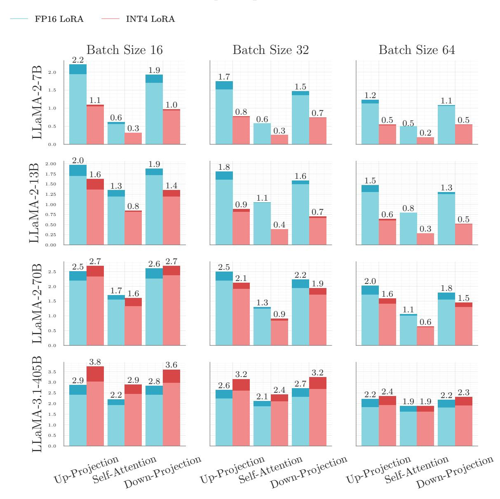
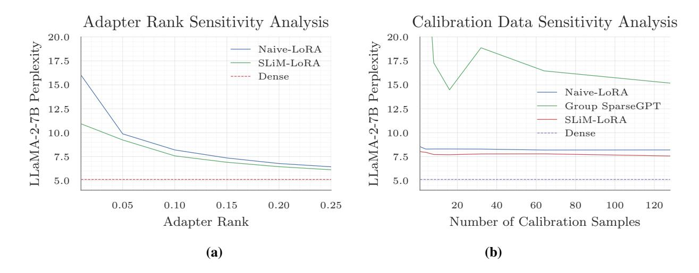

# Appendix

## A. Notations

Table [4](#page-12-0) details the key notations, particularly for Section [4.](#page-5-1)

| Table 4. Group quantization slow-down on different LLaMA-2 and LLaMA 3.1 models. |  |  |
|----------------------------------------------------------------------------------|--|--|
|                                                                                  |  |  |

| Term            | Description                                                                          |
|-----------------|--------------------------------------------------------------------------------------|
| Naive-LoRA      | A one-shot low-rank adapter that minimizes the norm of the difference between the    |
|                 | original and the compressed weights.                                                 |
| SLIM-LoRA       | A saliency-based one-shot low-rank adapter that minimizes the saliency of the differ |
|                 | ence between the original and the compressed weights.                                |
| Q (Superscript) | Q indicates that the compression method quantizes the low-rank adapters as well.     |
| + FT            | + FT shows a short fine-tuning phase on 300,000 tokens from the C4 dataset.          |

## B. Input Quantization

We evaluate SLIM with 8-bit input quantization to assess its impact on accuracy. We use AbsMax uniform quantization with a single parameter per input tensor and apply FP8 format [\(Micikevicius et al.,](#page-10-15) [2022\)](#page-10-15) for weight quantization. The choice between E4M3 and E5M2 depends on the tensor's maximum value; if it exceeds E4M3's range, we switch to E5M2 for greater expressivity. Next, we examine how input quantization affects model accuracy.

Table [5](#page-12-4) presents accuracy results for different SLIM variants with input quantization. A comparison with Table [9,](#page-15-0) which reports accuracy without input quantization, reveals minimal accuracy loss, demonstrating SLIM's robustness. For further validation, we extend these experiments to language modeling tasks (Appendix [G\)](#page-14-0).

Table 5. Average zero-shot accuracy of LLaMA-2 and OPT models with 4-bit weight quantization and 8-bit input quantization with 50% weight sparsity. ↑ indicates better performance.

| Pruning/LoRA     | Weight       |       | OPT   |       |       |       |       |       | LLaMA-2 |
|------------------|--------------|-------|-------|-------|-------|-------|-------|-------|---------|
| Method           | Quantization | 125M  | 350M  | 1.3B  | 2.7B  | 6.7B  | 13B   | 7B    | 13B     |
| Dense            | -            | 35.9  | 37.1  | 43.4  | 45.5  | 48.3  | 48.7  | 56.6  | 60.8    |
| 50% 2:4          |              |       |       |       |       |       |       |       |         |
| SLIM-LoRA        | SLIM-QuantW  | 34.85 | 34.27 | 40.29 | 42.58 | 45.78 | 46.21 | 50.99 | 54.66   |
| SLIM-LoRA + FT   | SLIM-QuantW  | 35.28 | 34.33 | 41.14 | 43.29 | 46.44 | 47.33 | 51.77 | 56.28   |
| SLIM-LoRAQ       | SLIM-QuantW  | 34.30 | 33.85 | 39.92 | 41.99 | 46.08 | 45.94 | 50.70 | 53.56   |
| SLIM-LoRAQ + FT  | SLIM-QuantW  | 34.92 | 34.80 | 41.66 | 43.69 | 46.03 | 46.87 | 50.26 | 56.28   |
| 50% Unstructured |              |       |       |       |       |       |       |       |         |
| SLIM-LoRA        | SLIM-QuantW  | 35.12 | 34.86 | 41.94 | 43.53 | 47.27 | 47.70 | 54.28 | 57.82   |
| SLIM-LoRA + FT   | SLIM-QuantW  | 35.18 | 35.30 | 42.37 | 44.02 | 47.01 | 48.52 | 54.43 | 57.70   |
| SLIM-LoRAQ       | SLIM-QuantW  | 35.26 | 34.67 | 41.48 | 43.46 | 47.25 | 47.76 | 53.91 | 57.16   |
| SLIM-LoRAQ + FT  | SLIM-QuantW  | 35.52 | 35.31 | 42.66 | 44.50 | 47.08 | 48.53 | 53.23 | 57.55   |

## C. SLIM-QuantW vs. SLIM-QuantO

Table [6](#page-13-1) compares the average accuracy of different models when using SLIM-Quant with weight error minimization (SLIM-QuantW ) and activation-aware output error minimization (SLIM-QuantO). SLIM-QuantO outperforms SLIM-QuantW by a small gap, while adding computational overhead with irregular memory access patterns at inference time.

Table 6. Average zero-shot accuracy of LLaMA-2 and OPT models with 50% sparsity and 4-bit weight quantization for SLIM-QuantW and SLIM-QuantO.

| Pruning/LoRA     | Weight       |       | OPT   |       |       |       |       |       | LLaMA-2 |
|------------------|--------------|-------|-------|-------|-------|-------|-------|-------|---------|
| Method           | Quantization | 125M  | 350M  | 1.3B  | 2.7B  | 6.7B  | 13B   | 7B    | 13B     |
| Dense            | -            | 35.9  | 37.1  | 43.4  | 45.5  | 48.3  | 48.7  | 56.6  | 60.8    |
| 2:4 Sparsity     |              |       |       |       |       |       |       |       |         |
| SLIM-LoRA        | SLIM-QuantW  | 34.62 | 34.36 | 40.61 | 42.73 | 45.99 | 46.09 | 51.15 | 54.94   |
| SLIM-LoRA        | SLIM-QuantO  | 34.63 | 34.36 | 40.29 | 42.45 | 45.71 | 46.24 | 51.22 | 55.05   |
| 50% Unstructured |              |       |       |       |       |       |       |       |         |
| SLIM-LoRA        | SLIM-QuantW  | 35.20 | 35.32 | 41.85 | 43.48 | 47.08 | 47.96 | 54.26 | 57.85   |
| SLIM-LoRA        | SLIM-QuantO  | 35.20 | 34.78 | 41.29 | 43.31 | 47.09 | 47.86 | 54.46 | 57.97   |

## D. Additional Sparse-only Results

To evaluate the isolated impact of sparsity on model accuracy, we disable quantization and benchmark Magnitude Pruning, SparseGPT, and Wanda, alongside low-rank approximations like Wanda-SVD and SLIM . Our experiments assess both 50% unstructured sparsity and 2:4 structured sparsity patterns.

Table [7](#page-13-2) shows the accuracy results for sparse models. Magnitude Pruning performs the worst, while Wanda and SparseGPT achieve comparable results, with larger accuracy gaps for semi-structured sparsity. Low-rank adapters improve accuracy, with SLIM leveraging saliency-based approximation for superior performance. A brief fine-tuning phase further boosts the accuracy of low-rank approximations.

Table 7. Average zero-shot accuracy of LLaMA-2 and OPT models with pruning. The quantization is disabled in this experiment. ↑ indicates better performance.

| Pruning/LoRA     |       | OPT  |      |      |      |      |      |      |  |  |  |
|------------------|-------|------|------|------|------|------|------|------|--|--|--|
| Method           | 125M  | 350M | 1.3B | 2.7B | 6.7B | 13B  | 7B   | 13B  |  |  |  |
| Dense            | 35.9  | 37.1 | 43.4 | 45.5 | 48.3 | 48.7 | 56.6 | 60.8 |  |  |  |
| 2:4 Sparsity     |       |      |      |      |      |      |      |      |  |  |  |
| Magnitude        | 32.6  | 31.8 | 35.4 | 33.9 | 36.4 | 30.7 | 31.2 | 32.0 |  |  |  |
| SparseGPT        | 33.8  | 33.2 | 37.7 | 41.3 | 45.2 | 45.6 | 47.3 | 52.3 |  |  |  |
| Wanda            | 34.0  | 32.5 | 38.3 | 40.5 | 43.2 | 44.1 | 46.1 | 49.7 |  |  |  |
| SLIM-Naive       | 34.1  | 34.1 | 40.4 | 42.8 | 46.0 | 45.9 | 51.6 | 55.8 |  |  |  |
| SLIM-Naive + FT  | 34.8  | 34.5 | 41.3 | 43.4 | 46.5 | 47.2 | 52.4 | 56.9 |  |  |  |
| SLIM-LoRA        | 34.5  | 32.9 | 40.7 | 43.1 | 46.4 | 46.3 | 51.4 | 56.1 |  |  |  |
| SLIM-LoRA + FT   | 35.1  | 34.9 | 41.5 | 43.8 | 46.5 | 47.3 | 51.6 | 56.4 |  |  |  |
| 50% Unstructured |       |      |      |      |      |      |      |      |  |  |  |
| Magnitude        | 33.3  | 33.7 | 34.0 | 40.6 | 35.8 | 30.9 | 32.6 | 31.9 |  |  |  |
| SparseGPT        | 35.5  | 35.1 | 39.6 | 43.5 | 47.4 | 47.8 | 53.3 | 57.3 |  |  |  |
| Wanda            | 35.0  | 34.5 | 41.1 | 42.9 | 46.5 | 46.8 | 52.7 | 57.2 |  |  |  |
| SLIM-Naive       | 35.3  | 35.2 | 41.9 | 44.1 | 47.5 | 47.8 | 54.9 | 58.5 |  |  |  |
| SLIM-Naive + FT  | 35.74 | 35.7 | 42.7 | 44.6 | 47.8 | 48.4 | 54.9 | 58.7 |  |  |  |
| SLIM -LoRA       | 35.2  | 35.1 | 42.0 | 44.1 | 47.7 | 48.2 | 55.0 | 58.8 |  |  |  |
| SLIM -LoRA + FT  | 35.9  | 35.7 | 42.5 | 44.7 | 47.7 | 48.4 | 55.0 | 58.8 |  |  |  |

## E. Additional Quantization-only Results

To evaluate the impact of SLIM-Quant and low-rank compensation in SLIM, we conduct experiments without sparsity, testing quantization schemes like Group AbsMax, OPTQ, AWQ, OmniQuant, AffineQuant, L2QER, and SLIM-Quant . To enhance accuracy, we add low-rank adapters to SLIM-Quant and Group AbsMax, optimizing either error saliency (SLIM-LoRA) or reconstruction error norm (Naive-LoRA). Other quantization methods cannot incorporate low-rank adapters due to conflicting weight/activation update rules.

Table [8](#page-14-2) presents the quantization results. Adding low-rank adapters to Group AbsMax significantly boosts model accuracy, outperforming most advanced methods. While SLIM-Quant alone is not designed for high accuracy, its integration with SLIM variants achieves results comparable to or better than Group AbsMax with low-rank adapters, highlighting the value of co-design in compression methods. Furthermore, a lightweight fine-tuning phase with SLIM-Quant delivers state-of-the-art accuracy.

Table 8. Average zero-shot accuracy of LLaMA-2 and OPT models with quantization. The sparsity is disabled in this experiment. ↑ indicates better performance.

| Quantization | Low-rank       |       |       | OPT   |       |       |       |       | LLaMA-2 |
|--------------|----------------|-------|-------|-------|-------|-------|-------|-------|---------|
| Method       | Adapter        | 125M  | 350M  | 1.3B  | 2.7B  | 6.7B  | 13B   | 7B    | 13B     |
|              |                |       |       |       |       |       |       |       |         |
| Dense        | -              | 35.9  | 37.1  | 43.4  | 45.5  | 48.3  | 48.7  | 56.6  | 60.8    |
|              |                |       |       |       |       |       |       |       |         |
| OPTQ         | -              | 35.64 | 36.46 | 42.83 | 44.20 | 47.46 | 48.24 | 53.53 | 59.80   |
| AWQ          | -              | 36.16 | 31.83 | 42.98 | 45.28 | 48.45 | 48.76 | 53.97 | OOM     |
| OmniQuant    | -              | 35.46 | NaN   | 42.15 | 44.71 | 46.65 | OOM   | 54.33 | OOM     |
| AffineQuant  | -              | 35.73 | NaN   | 42.62 | 44.92 | 47.91 | OOM   | 54.52 | OOM     |
|              |                |       |       |       |       |       |       |       |         |
| Group AbsMax | -              | 35.45 | 36.67 | 42.57 | 44.79 | 48.30 | 48.49 | 55.56 | 60.12   |
| Group AbsMax | L2QER          | 34.75 | 35.63 | 40.60 | 44.22 | 46.90 | OOM   | 55.95 | OOM     |
| Group AbsMax | SLIM-Naive     | 36.30 | 36.58 | 43.07 | 45.13 | 48.26 | 48.72 | 56.23 | 60.53   |
| Group AbsMax | SLIM-LoRA      | 36.18 | 36.72 | 42.89 | 45.65 | 48.45 | 48.89 | 55.99 | 60.16   |
|              |                |       |       |       |       |       |       |       |         |
| SLIM-QuantW  | -              | 31.98 | 36.46 | 36.19 | 40.08 | 45.61 | 38.27 | 31.11 | 30.51   |
| SLIM-QuantW  | SLIM-Naive     | 35.29 | 36.02 | 42.48 | 45.01 | 47.75 | 48.38 | 55.96 | 60.85   |
| SLIM-QuantW  | SLIM-LoRA      | 35.69 | 36.42 | 42.59 | 45.26 | 48.18 | 48.52 | 56.26 | 60.59   |
| SLIM-QuantW  | SLIM-LoRA + FT | 35.91 | 36.61 | 43.29 | 45.58 | 48.29 | 49.04 | 56.51 | 60.65   |

## F. Additional Fine-tuning Results

To complement the results in Section [4,](#page-5-1) we provide accuracy measurements for PEFT-based fine-tuning of low-rank adapters on the OPT and LLaMA-2 model families in Table [9](#page-15-0) while showing the accuracy results without fine-tuning for comparison. The results confirm the previously observed trend: lightweight fine-tuning enhances the accuracy of all baselines, with SLIM-LoRA achieving the most significant improvements due to its saliency-based design.

## G. Language Modeling Experiments

We evaluate all benchmarks from Section [4](#page-5-1) and Appendix [B](#page-12-2) [,D,](#page-13-0) and [E](#page-14-1) on the WikiText2 language modeling task. Tables [10](#page-15-1) and [11](#page-16-0) show perplexity results for 4-bit quantized models with 2:4 and unstructured sparsity, respectively. Table [12](#page-16-1) summarizes the results for 8-bit input quantization. To examine sparsity and quantization independently, Tables [13](#page-17-1) and [14](#page-17-2) report results for pruning-only and quantization-only models. Consistent with Section [4,](#page-5-1) SLIM achieves superior performance across all settings.

Table 9. Effects of fine-tuning on the average zero-shot accuracy of LLaMA-2 and OPT models with. ↑ indicates better performance.

| Pruning/LoRA     | Weight       |       |       | OPT   |       |       |       |       | LLaMA-2 |
|------------------|--------------|-------|-------|-------|-------|-------|-------|-------|---------|
| Method           | Quantization | 125M  | 350M  | 1.3B  | 2.7B  | 6.7B  | 13B   | 7B    | 13B     |
| Dense            | -            | 35.9  | 37.1  | 43.4  | 45.5  | 48.3  | 48.7  | 56.6  | 60.8    |
| 50% 2:4          |              |       |       |       |       |       |       |       |         |
| Naive-LoRA       | SLIM-QuantW  | 34.28 | 33.38 | 38.36 | 41.21 | 44.91 | 45.25 | 48.45 | 51.94   |
| Naive-LoRA + FT  | SLIM-QuantW  | 34.41 | 34.70 | 39.72 | 42.88 | 46.16 | 46.76 | 50.89 | 55.70   |
| SLIM-LoRA        | SLIM-QuantW  | 34.62 | 34.36 | 40.61 | 42.73 | 45.99 | 46.09 | 51.15 | 54.94   |
| SLIM-LoRA + FT   | SLIM-QuantW  | 35.03 | 34.58 | 41.11 | 43.35 | 46.71 | 47.25 | 52.12 | 56.60   |
| SLIM-LoRAQ       | SLIM-QuantW  | 34.43 | 34.30 | 40.11 | 42.37 | 46.33 | 46.24 | 51.02 | 53.55   |
| SLIM-LoRAQ + FT  | SLIM-QuantW  | 34.92 | 34.85 | 41.84 | 43.87 | 46.31 | 46.91 | 48.31 | 56.50   |
| 50% Unstructured |              |       |       |       |       |       |       |       |         |
| Naive-LoRA       | SLIM-QuantW  | 34.77 | 34.23 | 40.40 | 43.37 | 46.64 | 47.30 | 51.52 | 55.33   |
| Naive-LoRA + FT  | SLIM-QuantW  | 35.70 | 35.47 | 41.89 | 44.16 | 47.08 | 47.78 | 52.90 | 57.08   |
| SLIM-LoRA        | SLIM-QuantW  | 35.20 | 35.32 | 41.85 | 43.48 | 47.08 | 47.96 | 54.26 | 57.85   |
| SLIM-LoRA + FT   | SLIM-QuantW  | 35.59 | 35.71 | 42.37 | 44.58 | 47.69 | 48.26 | 54.69 | 57.96   |
| SLIM-LoRAQ       | SLIM-QuantW  | 35.35 | 35.13 | 41.74 | 43.63 | 47.16 | 47.86 | 54.18 | 57.33   |
| SLIM-LoRAQ + FT  | SLIM-QuantW  | 35.65 | 35.67 | 42.74 | 44.54 | 47.48 | 48.40 | 53.57 | 57.78   |

Table 10. Perplexity of LLaMA-2 and OPT models with 2:4 sparsity and 4-bit weight quantization on WikiText-2 dataset language modeling task. ↓ indicates better performance.

| Pruning/LoRA    | Weight       |       |       |       | OPT   |       |       |       | LLaMA-2 |
|-----------------|--------------|-------|-------|-------|-------|-------|-------|-------|---------|
| Method          | Quantization | 125M  | 350M  | 1.3B  | 2.7B  | 6.7B  | 13B   | 7B    | 13B     |
|                 |              |       |       |       |       |       |       |       |         |
| Dense           | -            | 27.66 | 22.00 | 14.62 | 12.47 | 10.86 | 10.13 | 5.47  | 4.89    |
|                 |              |       |       |       |       |       |       |       |         |
| Magnitude       | Group AbsMax | 5.1E2 | 4.4E2 | 1.2E3 | 1.3E3 | 3.6E2 | 4.9E2 | 86.34 | 8.98    |
| SparseGPT       | Group OPTQ   | 78.18 | 59.86 | 27.36 | 18.62 | 15.31 | 13.25 | 12.07 | 9.46    |
| Wanda           | Group AbsMax | 1.8E2 | 1.3E2 | 32.76 | 24.48 | 17.29 | 16.86 | 14.36 | 9.38    |
| Wanda           | AWQ          | 9.3E1 | 8.1E5 | 29.56 | 22.91 | 16.28 | 16.72 | 12.79 | OOM     |
| Wanda           | OmniQuant    | 9.7E1 | NaN   | 33.61 | 25.89 | 19.09 | OOM   | 12.77 | OOM     |
| Wanda           | AffineQuant  | 9.7E1 | NaN   | 30.32 | 1.6E3 | 16.85 | OOM   | 12.21 | OOM     |
| JSQ             | JSQ          | 3.5E3 | 1.7E4 | 1.1E2 | 6.6E2 | 36.94 | 2.3E2 | 12.68 | 8.70    |
|                 |              |       |       |       |       |       |       |       |         |
| Naive-LoRA      | Group AbsMax | 69.23 | 50.02 | 20.52 | 16.05 | 12.83 | 13.12 | 8.04  | 6.38    |
| Naive-LoRA      | SLIM-QuantW  | 83.08 | 58.69 | 27.06 | 20.92 | 14.29 | 13.20 | 8.19  | 7.09    |
| Naive-LoRA + FT | SLIM-QuantW  | 51.82 | 38.84 | 20.59 | 16.19 | 13.13 | 12.55 | 6.96  | 6.01    |
|                 |              |       |       |       |       |       |       |       |         |
| SLIM-LoRA       | SLIM-QuantW  | 57.91 | 50.09 | 19.64 | 15.65 | 12.71 | 12.13 | 7.77  | 6.80    |
| SLIM-LoRA + FT  | SLIM-QuantW  | 44.03 | 37.32 | 18.25 | 14.89 | 12.68 | 12.06 | 6.70  | 6.60    |
| SLIM-LoRAQ      | SLIM-QuantW  | 53.09 | 46.96 | 19.62 | 16.01 | 12.48 | 12.15 | 7.75  | 6.96    |
| SLIM-LoRAQ + FT | SLIM-QuantW  | 42.80 | 37.39 | 18.38 | 15.40 | 12.65 | 12.35 | 7.08  | 6.36    |

Table 11. Perplexity of LLaMA-2 and OPT models with unstructured sparsity and 4-bit weight quantization on WikiText-2 dataset language modeling task. ↓ indicates better performance.

| Pruning/LoRA    | Weight       |       |       |       | OPT   |       |       |       | LLaMA-2 |
|-----------------|--------------|-------|-------|-------|-------|-------|-------|-------|---------|
| Method          | Quantization | 125M  | 350M  | 1.3B  | 2.7B  | 6.7B  | 13B   | 7B    | 13B     |
|                 |              |       |       |       |       |       |       |       |         |
| Dense           | -            | 27.66 | 22.00 | 14.62 | 12.47 | 10.86 | 10.13 | 5.47  | 4.89    |
|                 |              |       |       |       |       |       |       |       |         |
| Magnitude       | Group AbsMax | 3.2E2 | 1.1E2 | 3.2E3 | 3.6E2 | 7.2E2 | 5.4E3 | 17.18 | 6.77    |
| SparseGPT       | Group OPTQ   | 42.60 | 34.19 | 21.41 | 14.30 | 12.15 | 11.26 | 8.28  | 5.92    |
| Wanda           | Group AbsMax | 62.64 | 39.60 | 19.93 | 15.01 | 12.31 | 12.46 | 6.80  | 5.75    |
| Wanda           | AWQ          | 42.49 | 3.8E5 | 18.80 | 14.67 | 12.17 | 12.34 | 7.28  | OOM     |
| Wanda           | OmniQuant    | 43.55 | NaN   | 20.58 | 15.82 | 13.29 | OOM   | 7.40  | OOM     |
| Wanda           | AffineQuant  | 43.66 | NaN   | 19.40 | 14.94 | 12.39 | OOM   | 7.21  | OOM     |
| JSQ             | JSQ          | 4.2E3 | 3.3E4 | 31.78 | 1.7E2 | 19.97 | 8.9E5 | 7.17  | 6.19    |
|                 |              |       |       |       |       |       |       |       |         |
| Naive-LoRA      | Group AbsMax | 40.37 | 30.99 | 17.02 | 13.91 | 11.68 | 11.38 | 6.12  | 5.28    |
| Naive-LoRA      | SLIM-QuantW  | 46.66 | 33.90 | 19.46 | 15.36 | 12.16 | 11.41 | 6.56  | 5.58    |
| Naive-LoRA + FT | SLIM-QuantW  | 38.05 | 29.27 | 17.52 | 14.39 | 12.28 | 11.84 | 6.10  | 5.28    |
|                 |              |       |       |       |       |       |       |       |         |
| SLIM-LoRA       | SLIM-QuantW  | 39.62 | 31.51 | 16.52 | 13.65 | 11.42 | 10.82 | 6.16  | 5.36    |
| SLIM-LoRA + FT  | SLIM-QuantW  | 34.92 | 28.67 | 16.16 | 13.66 | 11.83 | 11.47 | 5.36  | 5.19    |
| SLIM-LoRAQ      | SLIM-QuantW  | 38.79 | 30.16 | 16.64 | 13.82 | 11.43 | 10.80 | 6.26  | 5.58    |
| SLIM-LoRAQ + FT | SLIM-QuantW  | 35.17 | 28.31 | 16.46 | 13.96 | 11.42 | 10.80 | 5.94  | 5.46    |

Table 12. Perplexity of LLaMA-2 and OPT models with 4-bit weight quantization and 8-bit input quantization. ↓ indicates better performance.

| Pruning/LoRA     | Weight       |       |       |       | LLaMA-2 |       |       |      |      |
|------------------|--------------|-------|-------|-------|---------|-------|-------|------|------|
| Method           | Quantization | 125M  | 350M  | 1.3B  | 2.7B    | 6.7B  | 13B   | 7B   | 13B  |
| Dense            | -            | 27.66 | 22.00 | 14.62 | 12.47   | 10.86 | 10.13 | 5.47 | 4.89 |
| 50% 2:4          |              |       |       |       |         |       |       |      |      |
| SLIM-LoRA        | SLIM-QuantW  | 48.4  | 49.6  | 16.6  | 16.2    | 12.9  | 12.3  | 7.2  | 6.5  |
| SLIM-LoRA + FT   | SLIM-QuantW  | 39.8  | 37.5  | 18.3  | 15.5    | 12.8  | 12.1  | 6.6  | 5.8  |
| SLIM-LoRAQ       | SLIM-QuantW  | 54.2  | 50.8  | 20.8  | 16.8    | 13.0  | 12.4  | 7.8  | 7.0  |
| SLIM-LoRAQ + FT  | SLIM-QuantW  | 43.4  | 39.1  | 19.3  | 16.0    | 13.1  | 12.6  | 7.1  | 5.8  |
| 50% Unstructured |              |       |       |       |         |       |       |      |      |
| SLIM-LoRA        | SLIM-QuantW  | 36.8  | 31.1  | 16.8  | 14.0    | 11.7  | 10.9  | 6.1  | 5.4  |
| SLIM-LoRA + FT   | SLIM-QuantW  | 33.8  | 28.6  | 16.5  | 14.0    | 12.0  | 11.5  | 5.9  | 5.2  |
| SLIM-LoRAQ       | SLIM-QuantW  | 39.5  | 31.3  | 17.3  | 14.2    | 11.8  | 10.9  | 6.3  | 5.6  |
| SLIM-LoRAQ + FT  | SLIM-QuantW  | 35.6  | 29.1  | 17.0  | 14.3    | 12.2  | 11.7  | 6.2  | 5.5  |

Table 13. Perplexity of LLaMA-2 and OPT models with pruning on WikiText-2 dataset language modeling task. The quantization is disabled in this experiment. ↓ indicates better performance.

| Pruning/LoRA     |       |       |             | LLaMA-2 |       |       |       |       |
|------------------|-------|-------|-------------|---------|-------|-------|-------|-------|
| Method           | 125M  | 350M  | OPT 1.3B | 2.7B    | 6.7B  | 13B   | 7B    | 13B   |
| Dense            | 27.66 | 22.00 | 14.62       | 12.47   | 10.86 | 10.13 | 5.47  | 4.89  |
| 2:4 Sparsity     |       |       |             |         |       |       |       |       |
| Magnitude        | 341.5 | 417.1 | 427.2       | 1.2E3   | 264.1 | 4.0E4 | 9.1E4 | 2.0E5 |
| SparseGPT        | 60.7  | 50.7  | 23.8        | 17.2    | 14.1  | 12.9  | 10.2  | 8.3   |
| Wanda            | 81.6  | 116.0 | 27.8        | 21.4    | 16.0  | 16.4  | 12.0  | 8.5   |
| Naive-LoRA       | 46.9  | 45.0  | 18.8        | 15.2    | 12.5  | 12.9  | 8.1   | 6.5   |
| Naive-LoRA + FT  | 39.6  | 35.1  | 15.0        | 16.3    | 12.7  | 12.3  | 6.5   | 5.7   |
| SLIM-LoRA        | 45.2  | 43.6  | 18.6        | 15.0    | 12.4  | 12.6  | 7.3   | 6.2   |
| SLIM-LoRA + FT   | 37.1  | 33.7  | 17.0        | 14.2    | 12.4  | 12.1  | 6.4   | 5.8   |
| 50% Unstructured |       |       |             |         |       |       |       |       |
| Magnitude        | 193.4 | 97.8  | 1.7E3       | 265.2   | 968.7 | 2.4E4 | 9.9E4 | 1.1E5 |
| SparseGPT        | 36.7  | 31.8  | 17.6        | 13.4    | 11.5  | 11.1  | 6.5   | 5.6   |
| Wanda            | 39.3  | 36.4  | 18.3        | 14.3    | 12.0  | 12.3  | 6.4   | 5.4   |
| Naive-LoRA       | 33.3  | 29.1  | 16.3        | 13.5    | 11.5  | 11.2  | 6.2   | 5.4   |
| Naive-LoRA + FT  | 31.9  | 27.5  | 16.3        | 13.8    | 12.0  | 11.6  | 5.8   | 5.1   |
| SLIM -LoRA       | 32.7  | 29.0  | 15.9        | 13.2    | 11.2  | 10.8  | 5.9   | 5.2   |
| SLIM -LoRA + FT  | 31.0  | 26.8  | 15.5        | 13.1    | 11.6  | 11.0  | 5.8   | 4.7   |

Table 14. Perplexity of LLaMA-2 and OPT models with quantization on WikiText-2 dataset language modeling task. The sparsity is disabled in this experiment. ↑ indicates better performance.

| Quantization | Low-rank       |       |       |             | LLaMA-2 |       |       |       |       |
|--------------|----------------|-------|-------|-------------|---------|-------|-------|-------|-------|
| Method       | Adapter        | 125M  | 350M  | OPT 1.3B | 2.7B    | 6.7B  | 13B   | 7B    | 13B   |
|              |                |       |       |             |         |       |       |       |       |
| Dense        | -              | 27.66 | 22.00 | 14.62       | 12.47   | 10.86 | 10.13 | 5.47  | 4.89  |
|              |                |       |       |             |         |       |       |       |       |
| OPTQ         | -              | 33.0  | 24.4  | 16.0        | 13.0    | 11.3  | 10.3  | 6.1   | 4.9   |
| AWQ          | -              | 29.1  | 2.7E5 | 14.9        | 12.7    | 11.0  | 10.2  | 6.0   | OOM   |
| OmniQuant    | -              | 30.2  | NaN   | 15.8        | 13.3    | 11.6  | OOM   | 5.7   | OOM   |
| AffineQuant  | -              | 28.7  | NaN   | 14.9        | 12.6    | 11.0  | OOM   | 5.7   | OOM   |
|              |                |       |       |             |         |       |       |       |       |
| Group AbsMax | -              | 35.1  | 23.3  | 15.5        | 12.9    | 11.1  | 10.3  | 5.4   | 4.7   |
| Group AbsMax | Naive-LoRA     | 30.4  | 22.9  | 15.1        | 12.7    | 11.0  | 10.2  | 5.3   | 4.7   |
| Group AbsMax | SLIM-LoRA      | 29.3  | 22.8  | 15.0        | 12.7    | 10.9  | 10.2  | 5.2   | 4.7   |
|              |                |       |       |             |         |       |       |       |       |
| SLIM-QuantW  | -              | 1.4E3 | 26.0  | 1.7E3       | 33.1    | 31.0  | 6.7E2 | 1.3E5 | 7.8E4 |
| SLIM-QuantW  | Naive-LoRA     | 32.1  | 24.1  | 15.6        | 13.4    | 11.2  | 10.5  | 5.4   | 4.8   |
| SLIM-QuantW  | SLIM-LoRA      | 30.8  | 23.1  | 15.2        | 12.9    | 11.1  | 10.3  | 5.4   | 4.8   |
| SLIM-QuantW  | SLIM-LoRA + FT | 30.7  | 23.5  | 15.3        | 13.3    | 11.6  | 10.0  | 5.3   | 4.7   |

## H. Additional Sparse and Quantized Results

In Section [4,](#page-5-1) we provided the accuracy results for different pruning and quantization methods. When using Wanda for pruning, we only reported the best quantization method out of Group AbsMax, AWQ, OmniQuant, and AffineQuant. For completeness, we have provided the accuracy achieved by each of these quantization methods separately in Table [15.](#page-18-1)

Methods like OmniQuant and AffineQuant encounter difficulties in quantizing OPT-350M, resulting in NaN values. Additionally, approaches such as AWQ, OmniQuant, and AffineQuant cause memory issues (OOM) when attempting to compress the models on a single A100-40GB GPU.

Table 15. Average zero-shot accuracy of LLaMA-2 and OPT models with 2:4 sparsity and 4-bit weight quantization. ↑ indicates better performance.

| Pruning/LoRA     | Weight       |       |       |       | LLaMA-2 |       |       |       |       |
|------------------|--------------|-------|-------|-------|---------|-------|-------|-------|-------|
| Method           | Quantization | 125M  | 350M  | 1.3B  | 2.7B    | 6.7B  | 13B   | 7B    | 13B   |
| Dense            | -            | 35.9  | 37.1  | 43.4  | 45.5    | 48.3  | 48.7  | 56.6  | 60.8  |
| 2:4 Sparsity     |              |       |       |       |         |       |       |       |       |
| Wanda            | Group AbsMax | 33.27 | 32.79 | 37.47 | 39.45   | 42.95 | 43.64 | 43.89 | 48.94 |
| Wanda            | AWQ          | 33.33 | 31.50 | 38.43 | 40.00   | 43.41 | 44.07 | 44.86 | OOM   |
| Wanda            | OmniQuant    | 33.37 | NaN   | 37.35 | 39.39   | 41.50 | OOM   | 43.95 | OOM   |
| Wanda            | AffineQuant  | 33.39 | NaN   | 37.48 | 33.51   | 42.88 | OOM   | 44.62 | OOM   |
| 50% Unstructured |              |       |       |       |         |       |       |       |       |
| Wanda            | Group AbsMax | 34.67 | 33.89 | 40.38 | 42.77   | 45.88 | 46.60 | 51.76 | 56.76 |
| Wanda            | AWQ          | 35.11 | 31.57 | 41.02 | 42.89   | 46.52 | 46.84 | 50.68 | OOM   |
| Wanda            | OmniQuant    | 34.85 | NaN   | 39.84 | 42.16   | 44.67 | OOM   | 50.51 | OOM   |
| Wanda            | AffineQuant  | 34.64 | NaN   | 41.23 | 42.68   | 46.05 | OOM   | 53.62 | OOM   |

## I. Sparsity vs. Quantization

A natural question that arises compressing models is whether it is more efficient to reduce the model size through pruning or quantization. To answer this question, we conduct a set of experiments, which evaluate the perplexity of different models under three different conditions, all with around 8× model size reduction factor: (1) 2-bit weight quantization with no sparsity, (2) 4-bit weight quantization with 50% unstructured sparsity, and (3) 4-bit weight quantization with 50% 2:4 sparsity. We have used SLIM-LoRA with SLIM-Quant in all the experiments. The accuracy and perplexity results of these experiments are summarized in Tables [16](#page-18-2) and [17,](#page-18-3) showing that combining sparsity and quantization yields better results in comparison to quantization-only settings with lower bitwidth.

Table 16. Average accuracy of different models on WikiText-2 dataset using different pruning and quantization schemes. ↑ indicates better performance. Combining sparsity and quantization provides better accuracy results in comparison to solely using quantization.

|              |                  | OPT LLaMA-2 |      |      |      |      |      |      |      |
|--------------|------------------|----------------|------|------|------|------|------|------|------|
| Quantization | Sparsity         | 125M           | 350M | 1.3B | 2.7B | 6.7B | 13B  | 7B   | 13B  |
| 2-bit        | -                | 33.5           | 32.5 | 38.5 | 39.2 | 43.8 | 44.4 | 42.4 | 44.9 |
| 4-bit        | 2:4              | 34.6           | 34.4 | 40.6 | 42.7 | 46.0 | 46.1 | 51.2 | 54.9 |
| 4-bit        | 50% Unstructured | 35.2           | 35.3 | 41.9 | 43.5 | 47.1 | 48.0 | 54.3 | 57.9 |

Table 17. Perplexity of different models on WikiText-2 dataset using different pruning and quantization schemes. ↓ indicates better performance. Combining sparsity and quantization provides better accuracy results in comparison to solely using quantization.

|              |                  | OPT LLaMA-2 |       |      |      |      |      |      |      |
|--------------|------------------|----------------|-------|------|------|------|------|------|------|
| Quantization | Sparsity         | 125M           | 350M  | 1.3B | 2.7B | 6.7B | 13B  | 7B   | 13B  |
| 2-bit        | -                | 116.2          | 169.7 | 35.1 | 27.1 | 16.2 | 15.0 | 12.5 | 11.7 |
| 4-bit        | 2:4              | 47.5           | 45.6  | 18.8 | 15.7 | 12.4 | 12.1 | 7.2  | 6.5  |
| 4-bit        | 50% Unstructured | 36.3           | 29.9  | 16.3 | 13.7 | 11.4 | 10.8 | 6.0  | 5.4  |

## J. Additional Speedup Results

Section 4 presents the speedup of SLIM on consumer-grade GPUs, while this section provides results on NVIDIA A100-40GB GPUs. Figure 4 summarizes the speedup for the LLaMA-2 and LLaMA-3.1 model families, including LLaMA-3.1-405B, highlighting SLIM 'scalability to large models. As with consumer-grade devices, larger models achieve higher speedups.

Additionally, the breakdown of the speedup, showing the contribution of quantization and sparsity, is demonstrated using brighter and darker colors, respectively.

## SLiM Speedup on A100-40GB

Figure 4. SLIM speedup for LLaMA-2 family of models on NVIDIA A100-40GB GPUs. The brighter color shows the contribution of quantization to the total speedup.

#### K. Fine-tuning Costs

Fine-tuning compressed models can recover lost accuracy, but the high parameter count leads to substantial time and memory costs. In our experiments, we fine-tuned models with low-rank adapters, where the quantized weights are frozen and only the adapters are fine-tuned. This results in a more parameter-efficient approach, reducing both memory and computational costs. When no low-rank adapter is used, the straight-through estimator (STE) fine-tunes the quantized weights.

Table 18 presents the fine-tuning results for 300,000 tokens from the C4 dataset, using a batch size of 64 and sequence length of 1024 on a single H100 GPU. Fine-tuning models without low-rank adapters took 12 hours for 125M parameter models and over 36 days for 13B parameter models. Given these high costs, completing fine-tuning was challenging with our limited resources. In contrast, using low-rank adapters and freezing the sparse quantized weights made fine-tuning more efficient, enabling us to report accuracy results in Table 1.

Table 18. The required time for fine-tuning the models with a single H100 GPU on 300,000 tokens from the C4 dataset with a batch size of 64 and a sequence length of 1024.

| Pruning                         | Weight                                                  | OPT  |      |      |      |      |      | LLaMA-2 |      |  |
|---------------------------------|---------------------------------------------------------|------|------|------|------|------|------|---------|------|--|
| Method                          | Quantization                                            | 125M | 350M | 1.3B | 2.7B | 6.7B | 13B  | 7B      | 13B  |  |
| Magnitude SparseGPT Wanda | Group AbsMax OPTQ Group AbsMax                    | 12h  | 43h  | 164h | 361h | 866h | 867h | 842h    | 844h |  |
| SLIM-Naive SLIM-LoRA         | ${\rm SLiM\text{-}Quant}^W$ ${\rm SLiM\text{-}Quant}^W$ | 1.5h | 3h   | 6h   | 8h   | 16h  | 18h  | 14h     | 14h  |  |

#### L. Memory Reduction Analysis

SLIM prunes and quantizes the models and adds additional low-rank adapters to them. Additionally, it supports quantization methods for the low-rank adapters to reduce their overhead. In the following, we propose an analysis of the reduced memory when using SLIM and other pruning and quantization methods.

Assuming the hidden dimension of a model is d and the low-rank adapter ratio used in the model is of rank r < 1. Furthermore, by denoting the number of transformer blocks with n and the vocabulary size of the model by V and by denoting the ratio of the up-projection and down-projection layers in the model by a, we can get the memory reduction as the ratio of  $\frac{\text{Compressed Model Size}}{\text{Dense Model Size}}$  from equation 12.

$$\text{Memory Reduction} = \frac{n(4d^2 + 2d^2a) + dV}{n(4d^2/2 + 4 \times 2d^2r + 2d^2a/2 + 2d(dr + dra)) + dV} \tag{12}$$

Table 19 summarizes the memory reduction of different pruning and quantization methods. Please note that when using low-rank adapters (in Naive-LoRA and SLIM-LoRA), we assume a rank of r = 0.1.

Table 19. Theoretical memory reduction  $(\times)$  of different compression methods across various OPT and LLaMA models. In Quantized SLIM, the low-rank adapters are also quantized.  $(\downarrow)$  indicates better performance.)

| Compression                       |      | OP'  |      | LLaMA-2 |      |      |      |      |
|-----------------------------------|------|------|------|---------|------|------|------|------|
| Method                            | 125M | 350M | 1.3B | 2.7B    | 6.7B | 13B  | 7B   | 13B  |
| SparseGPT + OPTQ                  | 0.40 | 0.30 | 0.25 | 0.17    | 0.15 | 0.14 | 0.15 | 0.14 |
| Wanda + AbsMax                    | 0.40 | 0.30 | 0.25 | 0.17    | 0.15 | 0.14 | 0.15 | 0.14 |
| Naive-LoRA + AbsMax               | 0.50 | 0.42 | 0.38 | 0.31    | 0.30 | 0.29 | 0.31 | 0.30 |
| SLIM-LoRA + SLIM-Quant            | 0.50 | 0.42 | 0.38 | 0.31    | 0.30 | 0.29 | 0.31 | 0.30 |
| $SLiM$ -LoRA $^Q$ + $SLiM$ -Quant | 0.42 | 0.33 | 0.28 | 0.20    | 0.19 | 0.18 | 0.19 | 0.18 |

#### M. Computation Reduction Analysis

SLIM and other compression methods reduce the number of floating point operations (FLOPs) at the inference of models. Additionally, the low-rank adapters used in SLIM and Wanda SVD can add additional computational overheads to the inference of the models. Following JSQ (Guo et al., 2024), in this section, we provide an analysis on the FLOP reduction in the inference of different methods. It is noteworthy that even though quantization can reduce the memory overhead of models, since all the computations are done in floating point format, it does not lead to a reduction in the computation of the inference.

Assuming the hidden dimension of a model is d and the low-rank adapter ratio used in the model is of rank r < 1. Furthermore, by denoting the number of transformer blocks with n and the vocabulary size of the model by V and by denoting the ratio of the up-projection and down-projection layers in the model by a, we can get the memory reduction as the ratio of  $\frac{Dense\ Inference\ FLOP\ Count}{Compressed\ Inference\ FLOP\ Count}$  from equation 13, where b is the batch size, and is canceled in the numerator and the denominator of the equation.

$$\text{FLOP Reduction} = \frac{n(4bd^2 + 2bd^2a) + bdV}{n(4bd^2/2 + 4 \times 2bd^2r + 2bd^2a/2 + 2b(d^2r + d^2ra)) + bdV} \tag{13}$$

Table 20 summarizes the FLOP reduction of different compression methods. As it can be seen, the overhead of adding the low-rank adapters (r = 0.1) in SLIM-LoRA and Naive-LoRA is not significant.

Table 20. Compute (FLOP) reduction ratios ( $\times$ ) of different compression methods across various OPT and LLaMA models. In Quantized SLIM , the low-rank adapters are also quantized. ( $\uparrow$  indicates better performance.)

| Compression                       |      | OP'  |      | LLaMA-2 |      |      |      |      |
|-----------------------------------|------|------|------|---------|------|------|------|------|
| Method                            | 125M | 350M | 1.3B | 2.7B    | 6.7B | 13B  | 7B   | 13B  |
| SparseGPT + OPTQ                  | 1.52 | 1.66 | 1.75 | 1.91    | 1.94 | 1.96 | 1.95 | 1.97 |
| Wanda + AbsMax                    | 1.52 | 1.66 | 1.75 | 1.91    | 1.94 | 1.96 | 1.95 | 1.97 |
| Naive-LoRA + AbsMax               | 1.32 | 1.39 | 1.43 | 1.50    | 1.51 | 1.52 | 1.49 | 1.49 |
| SLIM-LoRA + SLIM-Quant            | 1.32 | 1.39 | 1.43 | 1.50    | 1.51 | 1.52 | 1.49 | 1.49 |
| $SLiM$ -LoRA $^Q$ + $SLiM$ -Quant | 1.32 | 1.39 | 1.43 | 1.50    | 1.51 | 1.52 | 1.49 | 1.49 |

#### **N. Compression Costs**

The computational cost of compression methods varies depending on their complexity. While all approaches can compress a single layer at a time, the memory usage is similar across methods, as each stores only one layer in the GPU's global memory. Techniques like Wanda, which rely on matrix multiplication, are faster than more complex methods like SparseGPT, which computes the inverse Hessian matrix for each layer. Adding low-rank adapters to Wanda-SVD and SLIM increases computational complexity due to the need for singular value decomposition (SVD), making them comparable to SparseGPT in terms of computation.

Table 21 summarizes the time required to compress various models using the discussed methods. Methods incorporating low-rank adapters (SLIM and Wanda-SVD) generally take longer to compress due to their higher complexity. Interestingly, SparseGPT's compression time is comparable to methods with low-rank adapters, despite only performing pruning and quantization. The saliency-based approach in SLIM does not add significant overhead compared to Wanda-SVD, maintaining efficiency despite its added complexity.

| Pruning   | Weight       | OPT LLaMA-2 |      |      |      |      |     |     |     |
|-----------|--------------|-------------|------|------|------|------|-----|-----|-----|
| Method    | Quantization | 125M        | 350M | 1.3B | 2.7B | 6.7B | 13B | 7B  | 13B |
|           |              |             |      |      |      |      |     |     |     |
| Magnitude | AbsMax       | 1s          | ls   | 1s   | 1s   | 2s   | 4s  | 2s  | 4s  |
| SparseGPT | OPTQ         | 1m          | 2m   | 5m   | 11m  | 22m  | 41m | 25m | 46m |
| Wanda     | SLIM-Quant   | 0.5m        | 1m   | 3m   | 5m   | 8m   | 13m | 8m  | 14m |
|           |              |             |      |      |      |      |     |     |     |
| Wanda-SVD | SLIM-Quant   | 1m          | 2m   | 7m   | 13m  | 33m  | 60m | 38m | 67m |
| SLIM      | SLIM-Quant   | 1m          | 2m   | 7m   | 13m  | 34m  | 63m | 39m | 68m |

Table 21. The required compression time for different models and compression methods using a single H100 GPU.

#### O. Rank Analysis

The key hyperparameter in low-rank approximation is the rank of the adapters. While increasing the rank reduces approximation error, it also leads to higher computational and memory overhead. Therefore, it is crucial to analyze the trade-off between the accuracy improvements and the overhead introduced by the chosen approximation rank.

Assuming the rank of the low-rank adapter is rd, where r<1 is a fixed factor and d is the dimension of the weights in a square feed-forward layer, the low-rank adapters are represented as  $\mathcal{L}, \mathcal{R}^T \in \mathbb{R}^{d \times rd}$ , resulting in a memory overhead of  $\mathcal{O}(2rd^2)$  for storing them. To compute  $\mathcal{XLR}$ , where  $\mathcal{X} \in \mathbb{R}^{b \times d}$  is the input with a batch size of b, the computational complexity is  $\mathcal{O}(2brd^2)$ . Given that the original memory and computational complexity of the layer are  $\mathcal{O}(d^2)$  and  $\mathcal{O}(bd^2)$ , respectively, the overhead introduced by the low-rank adapters becomes negligible when  $r \ll 1$ .

Figure O-a shows the average zero-shot accuracy of the OPT-6.7B and LLaMA-2-7B models for various ranks. As expected, increasing the rank leads to improved model accuracy. Based on these results, a rank of r=0.1 provides a substantial boost in accuracy without introducing significant overhead to inference.

Figure 5. Sensitivity analysis for the rank of the adapter (a) and the number of calibration samples (b) for different one-shot compression methods. For Naive-LoRA and SLIM-LoRA, we have used the SLIM-Quant quantization method, and for the SparseGPT, we have used the Group quantization version of OPTQ.

#### P. Effects of Calibration Sample Count

Similar to previous work (SparseGPT, Wanda, AWQ, OmniQuant, and AffineQuant), SLIM leverages a set of calibration data from the C4 dataset to assess weight saliency for pruning and low-rank approximations. Figure O-b illustrates the perplexity of LLaMA-2-7B using varying numbers of calibration samples. As shown, SLIM demonstrates low sensitivity to the number of calibration samples, making it effective even in scenarios with limited data.

## Q. Sensitivity to Calibration Dataset

Similar to other pruning and quantization methods such as Wanda, SparseGPT, OPTQ, and AWQ, SLIM relies on a calibration dataset to evaluate weight saliency. The C4 [\(Raffel et al.,](#page-10-16) [2019\)](#page-10-16) and SlimPajama [\(Soboleva et al.,](#page-11-16) [2023\)](#page-11-16) datasets are among the most commonly used calibration sets for LLM compression. Table [22](#page-23-1) presents the perplexity results for SLIM-LoRA and SLIM-Quant across different calibration datasets. The results indicate that SLIM is largely insensitive to the choice of dataset, achieving comparable accuracy regardless of the calibration dataset used.

Table 22. Perplexity of different models on WikiText-2 dataset using SLIM-LoRA with 4-bit quantization using SLIM-Quant with different calibration datasets. ↓ indicates better performance.

| Calibration      |       |       |             | LLaMA-2 |       |       |      |      |
|------------------|-------|-------|-------------|---------|-------|-------|------|------|
| Dataset          | 125M  | 350M  | OPT 1.3B | 2.7B    | 6.7B  | 13B   | 7B   | 13B  |
| 50% 2:4          |       |       |             |         |       |       |      |      |
| C4               | 57.91 | 50.09 | 19.64       | 15.65   | 12.71 | 12.13 | 7.56 | 6.50 |
| SlimPajama       | 46.27 | 44.77 | 19.35       | 16.04   | 12.56 | 12.32 | 7.15 | 6.49 |
| 50% Unstructured |       |       |             |         |       |       |      |      |
| C4               | 39.62 | 31.51 | 16.52       | 13.65   | 11.42 | 10.82 | 6.16 | 5.36 |
| SlimPajama       | 36.49 | 29.94 | 16.64       | 14.08   | 11.61 | 11.02 | 5.99 | 5.34 |

## R. Sparsity Analysis

To analyze the impact of sparsity on model accuracy, we conduct experiments on LLaMA-2-13B with 4-bit quantization, pruning it to varying sparsity ratios. Figure [6](#page-23-2) presents the perplexity results for SLIM-LoRA with SLIM-Quant , SparseGPT with OPTQ, and Wanda with Group AbsMax. As expected, increasing the sparsity ratio leads to higher perplexity, indicating a trade-off between compression and accuracy. Notably, SLIM-LoRA combined with SLIM-Quant maintains competitive accuracy up to 60% sparsity, whereas other methods experience noticeable degradation at lower sparsity levels.

Figure 6. Sparsity analysis on LLaMA-2-13B model using perplexity on WikiText-2 dataset. ↓ indicates better performance.

## S. Related Work

SLIM combines model pruning and quantization for compression, complemented by zero-shot low-rank adapters to recover lost accuracy. This section reviews related work on these topics.

#### S.1. Pruning

Eliminating redundant weights reduces computation and memory costs during inference. Optimal Brain Damage (OBD) [\(LeCun et al.,](#page-10-17) [1989\)](#page-10-17) leverages second-order information of the loss function to identify the least important weights but is computationally prohibitive for large language models (LLMs) [\(Mozaffari et al.,](#page-10-18) [2023\)](#page-10-18). WoodFisher [\(Singh & Alistarh,](#page-11-17) [2020\)](#page-11-17) approximates the Hessian matrix using Kronecker Factorization to mitigate this overhead but struggles to scale to LLMs.

Optimal Brain Surgeon (OBS) [\(Hassibi et al.,](#page-10-9) [1993\)](#page-10-9) evaluates weight matrices layer-wise using the layer-wise Hessian matrix to preserve layer outputs. However, the cubic growth in the cost of inverting the layer-wise Hessian with model size renders this approach impractical for LLMs. Optimal Brain Compression (OBC) [\(Frantar & Alistarh,](#page-9-13) [2022\)](#page-9-13) addresses the OBS-defined compression problem using a greedy algorithm, while SparseGPT reformulates it as a sparse regression problem. Wanda introduces a lightweight method based on weight and activation magnitudes to identify unimportant weights without updating their values.

In addition to post-training sparsity, a recent line of work targets sparsity during training [\(Lu et al.,](#page-10-19) [2023;](#page-10-19) [Mozaffari et al.,](#page-10-20) [2024;](#page-10-20) [Bambhaniya et al.,](#page-9-14) [2024\)](#page-9-14); however, their applicability is limited because of the expensive costs of training.

#### S.2. Quantization

Quantizing all elements in a matrix is challenging due to the significant impact of outliers on the model [\(Dettmers et al.,](#page-9-15) [2022\)](#page-9-15). Group quantization [\(Alistarh et al.,](#page-9-6) [2017;](#page-9-6) [Gunho et al.,](#page-9-7) [2022\)](#page-9-7) addresses this by quantizing small groups of a weight matrix with a shared quantization parameter, but it introduces challenges discussed in Appendix [U.](#page-25-0)

AbsMax [\(Jacob et al.,](#page-10-21) [2018\)](#page-10-21) with round-to-nearest (RTN) is the simplest quantization scheme for matrix elements. OPTQ [\(Frantar et al.,](#page-9-3) [2022\)](#page-9-3) minimizes layer-wise error using an approach akin to OBS. AWQ [\(Lin et al.,](#page-10-2) [2024\)](#page-10-2) shifts the challenge of quantizing salient weights to activations, while SmoothQuant [\(Xiao et al.,](#page-11-6) [2023\)](#page-11-6) balances quantization error between weights and activations, enabling input quantization. OmniQuant [\(Shao et al.,](#page-11-3) [2023\)](#page-11-3) improves accuracy with learnable clipping and channel scaling. AffineQuant leverages equivalent affine transformations to reduce quantization error, and QuaRot [\(Ashkboos et al.,](#page-9-11) [2024\)](#page-9-11) uses rotations to eliminate outliers during quantization.

Advanced methods like JSQ [\(Guo et al.,](#page-10-1) [2024\)](#page-10-1) jointly prune and quantize weights to 8 bits but struggle to recover accuracy in low bit-width quantization, limiting their utility. An analysis of the interplay between sparsity and quantization can be found in [\(Harma et al.,](#page-10-22) [2024\)](#page-10-22).

#### S.3. Low-rank Adapters

Low-rank adapters were first introduced to LLMs to reduce the overhead of fine-tuning [\(Hu et al.,](#page-10-23) [2021;](#page-10-23) [Mozaffari et al.,](#page-10-20) [2024\)](#page-10-20). Q-LoRA [\(Dettmers et al.,](#page-9-5) [2023\)](#page-9-5) extended this approach by quantizing weights before fine-tuning, allowing the process to recover accuracy lost during quantization. LQ-LoRA [\(Guo et al.,](#page-10-5) [2023\)](#page-10-5) further improved Q-LoRA by initializing the adapters using the SVD of the quantization error. LoSparse [\(Li et al.,](#page-10-6) [2023\)](#page-10-6) has a similar approach as LQ-LoRA, but for sparsity, initializing the low-rank adapters to the norm of the pruning error. RoSA [\(Nikdan et al.,](#page-10-7) [2024\)](#page-10-7) expands the learning capability of the model by adding both low-rank and sparse adapters to the model. This approach adds an extra sparse matrix multiplication to the inference, increasing the adapter overhead even further. However, all these methods require hundreds of millions of tokens for fine-tuning, making them costly and not comparable to one-shot pruning and quantization methods, or methods that use much shorter fine-tuning phases.

L 2QER [\(Zhang et al.,](#page-11-7) [2024a\)](#page-11-7) avoids fine-tuning by using one-shot low-rank adapters to mitigate quantization error. However, it performs poorly when combined with sparsity, resulting in a significant accuracy gap between the compressed and dense models. More recent methods, QERA [\(Zhang et al.,](#page-11-8) [2024b\)](#page-11-8) and CALDERA [\(Saha et al.,](#page-11-9) [2024\)](#page-11-9) find closed-form solutions to the problem discussed in L2QER, but they still do not support sparsity.

## T. Settings and Hyperparameters

To ensure a fair comparison and robust performance, SLIM utilizes calibration data and fine-tuning datasets under the same conditions as leading one-shot pruning and quantization methods. Similar to Wanda, SparseGPT, and OPTQ, SLIM leverages calibration data to extract statistics and assess weight saliency. Specifically, we use 128 sequences sampled from the widelyused C4 (Raffel et al., 2019) dataset for calibration. Additionally, for all fine-tuning experiments, we employ 300,000 tokens from the C4 dataset to improve model accuracy post-compression. This standardized approach to data usage ensures that SLIM operates under the same conditions as its peers, enabling a fair evaluation of its compression and fine-tuning performance.

SLIM-Quant uses the histogram of the weight elements to find the optimal scaling factor. The use of the histogram reduces the overhead of finding the optimal parameter by sharing the error computations between the elements that fall into the same histogram bin. The number of histogram bins provides a trade-off between the computational overhead and the accuracy of the integration. We set the number of bins in the histogram to  $\max(512, \min(\frac{d_{in} \times d_{out}}{1000}, 20,000))$  to achieve an accurate approximation of the PDF of the data.

We standardize our experimental setup by detailing the quantization scheme, group quantization parameters, and low-rank adapter configurations to ensure reproducibility and comparability across methods. All quantization methods in the experiments follow a 4-bit weight-only quantization scheme. Consistent with prior work (OPTQ, OmniQuant, AffineQuant, etc.), group quantization uses a group size of 128. For experiments involving Naive-LoRA and SLIM-LoRA, we set the adapter rank to 10% of the model's hidden dimension unless stated otherwise. These standardized configurations ensure consistency with prior work and enable a fair comparison of SLIM against baseline methods.

For fine-tuning the models, we utilized the Hugging Face Trainer (Wolf, 2019). The AdaFactor (Shazeer & Stern, 2018) optimizer was employed during the fine-tuning process, accompanied by linear learning rate scheduling. The optimization and learning rate scheduling parameters were set to their default values in the Hugging Face Trainer. To prevent numerical overflow and divergence, we used BFloat-16 data types (Wang & Kanwar, 2019) available on NVIDIA A100 GPUs during fine-tuning. The training was conducted with a local batch size of 1 and a gradient accumulation factor of 64 to reduce memory overhead. Weight updates for the sparse and/or quantized weights, as well as the corresponding biases, were disabled. Due to our limited resources, we did not tune any of the hyperparameters aimed at improving fine-tuning speed or accuracy; tuning these parameters is planned for future work.

#### **U. Group Quantization Challenges**

Group quantization allows sharing the same quantization parameters for a small group of the elements in the quantized matrix, leading to smaller errors. But, using group quantization adds additional challenges to the training and inference of the model, e.g. **more complicated implementation** and **additional memory and compute overheads**.

The state-of-the-art group quantization GPU kernel, dense and sparse Marlin (Frantar et al., 2024), consists of thousands of lines of CUDA code optimized for only a limited number of GPU architectures, showcasing the amount of effort needed to implement a version of group quantization. Furthermore, other libraries and frameworks, such as Triton (Tillet et al., 2019) and CUTLASS (NVIDIA Corporation, 2025) do not provide support for 4-bit group quantization, limiting its flexibility and possibility of modification.

Furthermore, using group quantization can lead to an additional overhead during matrix multiplication, since more parameters need to be loaded for dequantizing each group. As an example, Table 23 shows the slow-down of using group quantization on the down-projection matrices in different LLaMA-2 and LLaMA-3.1 models on a NVIDIA A100-40GB GPU, with a batch size of 16.

*Table 23.* Group quantization slow-down (×) on different LLaMA-2 and LLaMA 3.1 models. ↓ indicates worse.

| Model          | LLaMA-2-7B | LLaMA-2-13B | LLaMA-2-70B | LLaMA-3.1-405B |
|----------------|------------|-------------|-------------|----------------|
| Slow-Down (×)  | 0.04       | 0.95        | 0.95        | 0.94           |
| Slow-Dowli (×) | 0.94       | 0.93        | 0.93        | 0.94           |