# SAGEATTENTION: ACCURATE 8-BIT ATTENTION FOR PLUG-AND-PLAY INFERENCE ACCELERATION

Jintao Zhang, Jia Wei, Haofeng Huang, Pengle Zhang, Jun Zhu, Jianfei Chen<sup>∗</sup> Dept. of Comp. Sci. & Tech., Institute for AI, BNRist Center, Tsinghua-Bosch Joint ML Center, THBI Lab, Tsinghua University {zhang-jt24@mails., jianfeic@, dcszj@}tsinghua.edu.cn

## ABSTRACT

The transformer architecture predominates across various models. As the heart of the transformer, attention has a computational complexity of O(N<sup>2</sup> ), compared to O(N) for linear transformations. When handling large sequence lengths, attention becomes the primary time-consuming component. Although quantization has proven to be an effective method for accelerating model inference, existing quantization methods primarily focus on optimizing the linear layer. In response, we first analyze the feasibility of quantization in attention detailedly. Following that, we propose SageAttention, a highly efficient and accurate quantization method for attention. The OPS (operations per second) of our approach outperforms FlashAttention2 and xformers by about 2.1x and 2.7x, respectively. SageAttention also achieves superior accuracy performance over FlashAttention3. Comprehensive experiments confirm that our approach incurs almost no end-to-end metrics loss across diverse models—including those for large language processing, image generation, and video generation. The code is available at <https://github.com/thu-ml/SageAttention>.

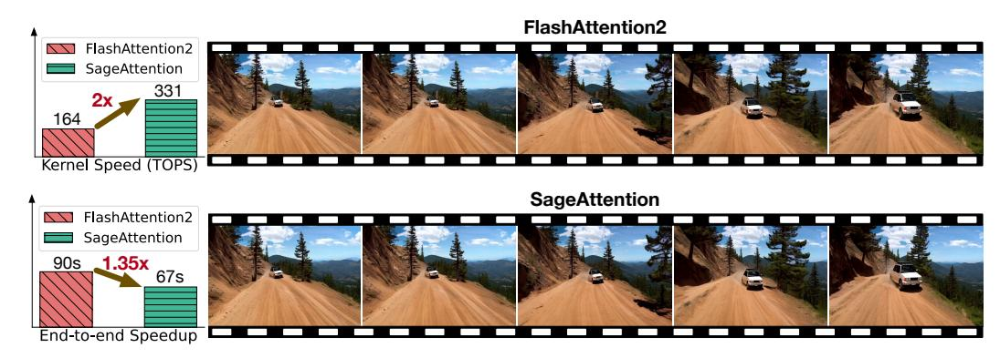

Figure 1: An example of SageAttention on video generation (CogvideoX on RTX4090).

## 1 INTRODUCTION

Attention is the fundamental component of transformers [\(Vaswani, 2017\)](#page-13-0), and efficiently computing attention is crucial for transformer-based applications. Moreover, there is a recent trend in processing longer sequences, which further strengthens the need for faster attention. In tasks like video generation [\(Yang et al., 2024\)](#page-14-0) and language model prefilling [\(Dubey et al., 2024\)](#page-10-0), the sequence length can easily go up to 8K∼ 128K. Due to its quadratic complexity, the cost of attention dominates all other operations in such scenarios, as illustrated in Figure [2.](#page-1-0)

Quantization is an effective strategy for enhancing neural networks' computational and memory efficiency by reducing the numerical precision. There are abundant works on accelerating training [\(Sun](#page-13-1) [et al., 2019;](#page-13-1) [Xi et al., 2024b;](#page-13-2) [Peng et al., 2023\)](#page-12-0) and inference [\(Jacob et al., 2018;](#page-11-0) [Xiao et al., 2023a\)](#page-13-3)

<sup>∗</sup>Corresponding author.

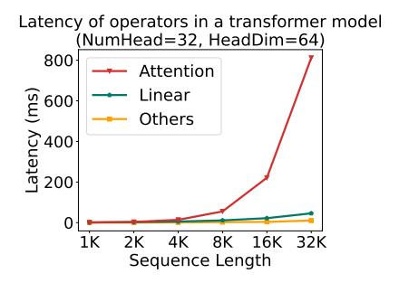

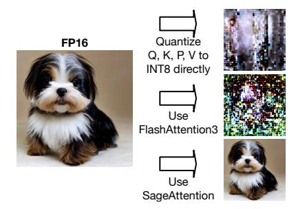

Figure 2: Latency of attention.

<span id="page-1-1"></span>Figure 3: A comparison example.

<span id="page-1-0"></span>with low-precision numerical formats such as FP8, INT8, or INT4. However, existing works primarily focused on quantizing the *linear* layer, where *attention* is left unaccelerated in high-precision, such as FP16. There is not yet a work that systematically investigates the quantization of attention. Moreover, many quantization methods require extra training, and the cost can be prohibitive for large-scale models. While FlashAttention3 (Shah et al., 2024) was released recently and offers an FP8 version, it is tailored to and can only be used with the Nvidia Hopper architecture. This exclusive optimization limits its broader applicability. Furthermore, our analysis demonstrates that directly implementing the FP8 version can lead to performance degradation, as detailed in Table 1.

Quantizing attention is challenging. The computation of attention is more complex than that of linear operations. Attention includes a softmax operation and two matrix multiplication (Matmul) operations:  $QK^{\top}$  and PV. Direct 8-bit quantization and dequantization of the matrices (Q,K,P,V) in attention will result in significantly degraded performance across various models. For example, the text-to-image model Unidiffuser (Bao et al., 2023) will generate a completely blurry image with both INT8 and FlashAttention3's FP8 implementation (See Figure 3), and Llama2 only achieves a random-guessing-level accuracy of 25.5% on the MMLU dataset with INT8 attention. After investigating deeply, we identified two primary challenges: (C1) The matrix K exhibits a significant channel-wise outlier, leading to substantial accuracy loss during quantization. (C2) Simply quantizing (P,V) into INT8 does not consistently ensure the accuracy of PV across various scenarios.

In this paper, we propose SageAttention, a quantization method to accelerate attention while preserving accuracy. SageAttention is easy-to-use. As a post-training quantization method, it can be used in a plug-and-play manner in inference time by simply replacing the original high-precision implementation. We propose several techniques to achieve this goal. First, we opt to quantize the tensors in attention to INT8 rather than FP8. This decision is based on the fact that INT8 Matmul on some commonly used GPUs, e.g., RTX4090 and 3090, are four times faster than in FP16 and two times faster than FP8. Moreover, INT8 quantization for matrices (Q,K) is more precise than FP8 in attention (See Table 2). To address (C1), we propose a method to smooth the K matrix. This method significantly enhances accuracy with a negligible time overhead (<0.2%). To address (C2), as an alternative to quantizing (P,V) to 8-bit, we propose a more accurate yet efficient method for the Matmul PV: we maintain (P,V) in FP16 and use a low-precision FP16 accumulator. This strategy doubles Matmul's speed without sacrificing any accuracy. Finally, we implement several versions of attention with different speed-accuracy tradeoffs and propose a method to select the fastest attention implementation for each layer while preserving accuracy.

We offer a high-performance implementation of SageAttention on RTX4090 and 3090 GPUs using Triton (Tillet et al., 2019). Our implementation contains a fused kernel combining ROPE with quantization and a fast self-attention kernel inspired by FlashAttention-style tiling. The implementation utilizes the fast INT8 mma(u8.u8.s32) and FP16-with-FP16-accumulator mma(f16.f16.f16) instructions of Nvidia Tensor Core. Our kernel is about  $2.1\times$  and  $2.7\times$  faster than FlashAttention2 and xformers, respectively. Notably, it achieves 340 TOPS on RTX4090 at headdim=64 and headdim=128, reaching 52% of the theoretical INT8 throughput. In contrast, the peak for the state-of-the-art FlashAttention2 is only 165 TOPS. Moreover, at headdim=64, our throughput on RTX 4090 is even close to the 490 TOPS throughput of FlashAttention3, which is exclusive to the much more powerful and expensive Hopper GPUs. We extensively evaluate the end-to-end metrics of our approach on state-of-the-art image/video generation, image classification, and language models. On all tasks, SageAttention can be directly adopted in a plug-and-play manner with negligible loss in model performance, while offering more than  $2\times$  speedup than FlashAttention2 and xformers.

#### 2 Related Work

We categorize efficient Attention works into three groups: (1) Sparse Attention. This strategy only selects parts of a sequence from a given context for processing with standard Attention. Implementations like Swin transformer (Liu et al., 2021), Twins (Chu et al., 2021), UniFormer (Li et al.), Attentionsinks (Xiao et al., 2023b), InfLLM (Xiao et al., 2024), LongLora (Chen et al., 2023), Minference (Jiang et al., 2024), and SkipAttention (Venkataramanan et al., 2023) show promise. However, these methods' limitations are that they only work in a few scenarios because omitted calculations are not always useless. (2) Linear Attention. Techniques that transform Attention computation to reduce time complexity, for example, Linformer (Wang et al., 2020), Performer (Choromanski et al., 2020), MetaFormer (Yu et al., 2022), and LinearAttention (Katharopoulos et al., 2020), which lower the time complexity of Attention from  $O(N^2)$  into O(N). These methods excel in specific scenarios while standard Attention remains prevalent. (3) Kernel Optimization. Rather than simplifying calculations, these methods exploit hardware capacities to enhance speed. The xformers (Lefaudeux et al., 2022) platform accelerates Attention with customizable blocks and dedicated CUDA kernels. FlashAttention (Dao et al., 2022) proposes tiling to reduce the memory reads/writes between GPU global memory and on-chip SRAM for significant speedups. FlashAttention2 (Dao, 2023) refine the parallelism and warps partition of FlashAttention. Bikshandi & Shah (2023) further optimize FlashAttention2 by kernel fusion. FlashAttention3 (Shah et al., 2024) is proposed for Hopper architecture. However, FlashAttention3 is exclusive to the Hopper GPU architecture, and the accuracy of its quantization version is significantly lower than our method (See Table 1). RingAttention (Liu et al.) scales FlashAttention across multiple GPUs. I-bert (Kim et al., 2021) quantizes all tensors in a transformer block into INT8 but is restricted to RoBERTa. Our method falls under the third category, and is **orthotopic** with the first and second categories.

#### 3 Preliminary

Our method builds on FlashAttention-2 and adopts dynamic quantization. We will begin by reviewing FlashAttention-2, followed by a brief introduction to dynamic quantization techniques.

#### <span id="page-2-0"></span>3.1 FLASHATTENTION

The computation of self-attention can be formulated as follows:  $S = QK^{\top}/\sqrt{d}, \ P = \sigma(S), \ O = PV$ , where  $\sigma(S)_{ij} = \exp(S_{ij})/\sum_k \exp(S_{ik})$  is the softmax operation. The matrices Q, K, and V each have dimensions  $N \times d$ , while the matrices S, P are  $N \times N$ . While d is typically small, e.g., 64 or 128, N can be thousands if not millions. Therefore, the  $N \times N$  matrices (S, P) are much larger than (Q, K, V), and a naive implementation suffers from the huge amount of global memory I/O for (S, P) reads/writes. FlashAttention (Dao, 2023) proposes to tile Q, K, and V from the token dimension into blocks  $\{Q_i\}, \{K_i\}, \{V_i\}$  with block sizes of  $b_q, b_{kv}, b_{kv}$ , respectively. Then, to avoid the memory I/O for (S, P), it uses online softmax (Milakov & Gimelshein, 2018) to progressively compute each block of O, i.e.,  $O_i$  as follows.

First, for each block of  $\{K_i\}$ ,  $\{V_i\}$ , it computes the following equations iteratively:

$$S_i^j = Q_i K_i^{\top} / \sqrt{d}, \quad (m_i^j, \tilde{P}_i^j) = \tilde{\sigma}(m_i^{j-1}, S_i^j),$$
 (1)

$$l_i^j = \exp(m_i^{j-1} - m_i^j)l_i^{j-1} + \operatorname{rowsum}(\widetilde{P}_i^j), \ O_i^j = \operatorname{diag}\left(\exp(m_i^{j-1} - m_i^j)\right)O_i^{j-1} + \widetilde{P}_i^j V_j$$
 (2)

Where  $m_i^j$  and  $l_i^j$  are  $b_q \times 1$  vectors, which are initialized to  $-\infty$  and 0 respectively.  $\tilde{\sigma}()$  is an online softmax operator:  $m_i^j = \max\{m_i^{j-1}, \operatorname{rowmax}(S_i^j)\}, \ \widetilde{P}_i^i = \exp(S_i^j - m_i^j).$ 

Finally, after all iterations, i.e.,  $j = b_{kv}$ , the output  $O_i$  can be computed by  $O_i = \operatorname{diag}(l_i^j)^{-1}O_i^j$ .

#### <span id="page-2-1"></span>3.2 Dynamic Quantization

A matrix multiplication C = AB can be accelerated with quantization as:

$$(\delta_A, \hat{A}) = \psi(A), \quad (\delta_B, \hat{B}) = \psi(B), \quad \hat{C} = \hat{A}\hat{B}, \quad C = \psi_{\delta_A \delta_B}^{-1}(\hat{C})$$
(3)

Here,  $\psi$  is a *quantizer* which converts a high-precision (e.g., FP32) matrix A to a low-precision format  $\hat{A}$  (e.g., INT8 or FP8) with a *scale*  $\delta_A$ , and  $\psi^{-1}$  is a *dequantizer* to convert back to high-precision. We should have  $\psi_{\delta_A}^{-1}(\hat{A}) \approx A$ . The actual matrix multiplication  $\hat{A}\hat{B}$  is carried in low-precision. In modern GPUs, low-precision matrix multiplication is usually multiple times faster than higher-precision ones.

Many quantizers depend on the numerical format and granularity, e.g., how many elements share a common scale factor. For example, an INT8 per-tensor dynamic quantizer first computes the scale as the maximum absolute value of the entire tensor, scales the elements to the maximum representable range of INT8 [-127, +127], and then casts to INT8 with rounding:  $\hat{A} = \lceil A/\delta_A \rfloor, \delta_A = \max(|A|)/127$ . Likewise, per-token quantizer assigns a scale factor for each token of a tensor:  $\hat{A}[i,:] = \lceil A[i,:]/\delta_A \rfloor, \delta_A[i,:] = \max(|A[i,:]|)/127$ . Also, per-channel quantizer assigns a scale factor for each channel of the tensor, i.e., along the channel dimension:  $A[:,i] = \lceil A[:,i]/\delta_A \rfloor, \delta_A = \max(|A[:,i]|)/127$ . Based on the tiling approach of FlashAttention, we can apply per-block quantization correspondingly. per-block quantizer assigns a scale factor for every b = m - n tokens:  $\hat{A}[m:n,:] = \lceil A[m:n,:]/\delta_A \rfloor, \delta_A = \max(|A[m:n,:]|)/127$ . Dequantization simply involves a element-wise scaling:  $\psi_{\delta_A}^{-1}(\hat{A}) = \delta_A \hat{A}$ .

#### 4 SAGE ATTENTION

In this section, we propose SageAttention, a fast yet accurate method to accelerate attention computation with 8-bit quantization. Considering that most networks are not natively trained with quantized attention, SageAttention is designed to be plug-and-play.

Unlike linear layers, which are easy to quantize, quantizing attention is more complicated. Extra treatment is required to ensure both good accuracy and fast speed. First, we will formulate quantized attention in Section 4.1, followed by introducing our approach.

#### <span id="page-3-0"></span>4.1 FORMULATION

Based on the description of FlashAttention and dynamic quantization in Section 3.1 and 3.2, we formulate the quantized attention as follows.

<span id="page-3-1"></span>Quantization: 
$$(\delta_Q, \hat{Q}) = \psi_Q(Q/\sqrt{d}), \ (\delta_K, \hat{K}) = \phi_K(K), \ (\delta_P, \hat{P}) = \psi_P(\tilde{P}), \ (\delta_V, \hat{V}) = \psi_V(V)$$
 (4)  
Attention:  $S = \psi_{\delta_Q \delta_K}^{-1}(\hat{Q}\hat{K}^\top), \ (m', P) = \tilde{\sigma}(m, S), \ O = \operatorname{diag}\left(\exp(m' - m)\right)O + \psi_{\delta_P \delta_V}^{-1}(\hat{P}\hat{V})$  (5)

 $\phi_K$  is a transformation to obtain quantized K, which we shall discuss in subsequent sections. For simplicity, we omit all superscripts and subscripts, but the matrices used in attention are still tiles, and the computation is still organized as FlashAttention described in Section 3.1. Compared to the original full-precision version, as shown in Eq. 4, 5, SageAttention adds quantizers to Q, K, P, V and dequantizers to the product to accelerate both Matmuls of  $QK^{\top}$  and PV. Online softmax is left in full-precision.

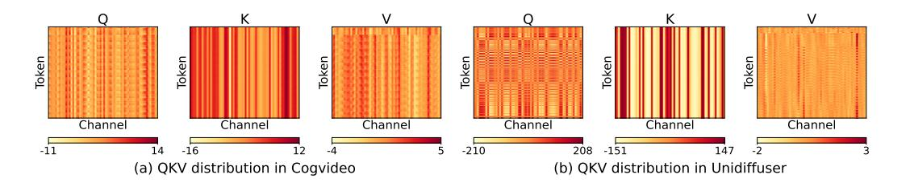

<span id="page-3-3"></span><span id="page-3-2"></span>Figure 4: Typical examples of data distribution of (Q, K, V).

| Quantization (Q, K)   | Smoothing<br>K | Llama<br>WikiText ↓ | CogVideo (Fscore) | $\begin{array}{c} \textbf{Unidiffuser} \\ \textbf{(FID)} \end{array} \downarrow$ | UltraPixel ↓ (FID) | TIMM   |
|-----------------------|----------------|---------------------|-------------------|----------------------------------------------------------------------------------|--------------------|--------|
| <b>Full-Precision</b> | -              | 5.823               | 3.768             | 163.33                                                                           | 179.78             | 84.79% |
| Per-token             | Х              | 5.824               | 1.924             | 221.18                                                                           | 193.36             | 84.21% |
| 1 CI-LUKCII           | ✓              | 5.824               | 3.734             | 166.52                                                                           | 179.79             | 84.74% |
| Per-block             | Х              | 5.825               | 2.014             | 229.08                                                                           | 195.67             | 84.18% |
| 1 CI-DIOCK            | ✓              | 5.824               | 3.718             | 166.93                                                                           | 179.98             | 84.76% |
| Per-tensor            | X              | 5.826               | 1.902             | 267.06                                                                           | 196.26             | 84.12% |
|                       | ✓              | 5.824               | 3.640             | 167.65                                                                           | 180.21             | 84.69% |
| FlashAttn3 (v         | vith quant)    | 5.850               | 3.394             | 394.13                                                                           | 383.61             | 84.70% |

<span id="page-4-0"></span>Table 1: End-to-end metrics comparison of different quantization methods.

#### 4.2 SMOOTH MATRIX K

Directly quantizing Q, K often results in a large error. Particularly, quantizing Q, K to INT8 yields completely blurry image/video in text-to-image/video tasks. As shown in Figure 4.1, we visualize two typical groups of Q, K, V from a text-to-image model Unidiffuser (Bao et al., 2023) and a text-to-video model CogvideoX (Yang et al., 2024). Notably, K exhibits distinct channel-wised outliers. However, per-channel quantization cannot be applied for K, because quantization can only be performed at the outer axis (token dim) of the Matmul  $QK^{\top}$ . Moreover, the previous smoothing technique proposed for linear layers (Xiao et al., 2023a) cannot be applied since Q is also heavily affected by outliers. Fortunately, the channel outliers of K have a pattern: Each token's key is actually a large bias shared by all tokens, plus a small token-wise signal. Therefore, the outlier is not from large variation across tokens, but simply the large bias. Based on this observation, we propose to smooth the matrix K by a transform  $\gamma$ , which subtracts averaged K across all tokens:

$$\gamma(K) = K - \text{mean}(K) \tag{6}$$

where  $\operatorname{mean}(K) = \frac{1}{N} \sum_{t=1}^{N} K[t,:]$  is the average key, with a shape  $1 \times d$ . Note that such a transformation does not change the attention score P, because for any query q, we have  $\sigma(q(K - \operatorname{mean}(K)^{\top})) = \sigma(qK^{\top} - q \cdot \operatorname{mean}(K)) = \sigma(qK^{\top})$ . Finally, the transformation from full-precision K to quantized  $\hat{K}$  can be written as  $\phi_K(K) = \psi_K \circ \gamma$ , where  $\psi_K$  is a quantizer. In other words, a full-precision K is substracted with the mean, before eventually being quantized.

Table 1 presents end-to-end metrics for different quantization methods with and without *smoothing* K on various models. The results demonstrate that *smoothing* K offers significant benefits of accuracy. Moreover, the speed overhead of smoothing K for attention is less than 0.2% (See Table 10).

<span id="page-4-1"></span>Table 2: **Average accuracy** using different data types across all layers of real models.

| Q, K | $\widetilde{P}, V$ | Cos Sim ↑ | Relative L1 ↓ | RMSE ↓  |
|------|--------------------|-----------|---------------|---------|
|      | E4M3               | 99.94%    | 0.0345        | 3.53e-3 |
| INT8 | E5M2               | 99.81%    | 0.0572        | 6.11e-3 |
|      | INT8               | 99.70%    | 0.1035        | 6.82e-3 |
|      | E4M3               | 99.81%    | 0.0607        | 5.93e-3 |
| E4M3 | E5M2               | 99.68%    | 0.0769        | 7.72e-3 |
|      | INT8               | 99.58%    | 0.1199        | 8.31e-3 |
|      | E4M3               | 99.37%    | 0.1107        | 1.09e-2 |
| E5M2 | E5M2               | 99.22%    | 0.1213        | 1.20e-2 |
|      | INT8               | 99.13%    | 0.1583        | 1.24e-2 |

<span id="page-4-2"></span>Table 3: **Worst accuracy** using different data types across all layers of real models.

| Q, K    | $ \widetilde{P}, V $ | Cos Sim ↑ | Relative L1 $\downarrow$ | $\textbf{RMSE}\downarrow$ |
|---------|----------------------|-----------|--------------------------|---------------------------|
| ·       | E4M3                 | 76.36%    | 0.5899                   | 0.4311                    |
| INT8    | E5M2                 | 78.98%    | 0.4233                   | 0.4371                    |
| 11N 1 8 | INT8                 | 56.40%    | 0.7921                   | 0.5405                    |
|         | FP16                 | 99.99%    | 0.0116                   | 0.0091                    |

#### <span id="page-4-3"></span>4.3 QUANTIZATION FOR Q, K, P, V

Quantization granularity for Q, K:  $\psi_Q(Q)$  and  $\psi_K(K)$  can be set with the granularity of pertoken, per-block or per-tensor. This is because per-channel quantization is not feasible, since the scale factors of the inner axis of  $QK^{\top}$  cannot be used to do dequantization (Xiao et al., 2023a).

Data type of Q,K: We choose INT8 for  $\psi_Q(Q)$  and  $\psi_K(K)$  for two reasons. First, Table 2 shows the average accuracy using different data types (INT8, E4M3, E5M2) for  $Q,K,\widetilde{P},V$  across all layers of Llama2 (7B) (Touvron et al., 2023) and Unidiffuser. It shows that quantizing Q,K to INT8 performs higher accuracy than using E4M3 and E5M2. Second, Matmul using INT8 is two times faster than using FP8 in many commonly used GPUs, e.g., RTX4090 and 3090.

Quantization granularity for  $\widetilde{P},V$ : We propose to use  $\psi_P(\widetilde{P})$  in per-block and  $\psi_V(V)$  in per-channel for three reasons. (1) Per-channel quantization for  $\widetilde{P}$  and per-token quantization for V are not viable because dequantization requires scale factors of the outer axis. (2)  $\widetilde{P}=\exp(S_i-\operatorname{rowmax}(S_i))$ , where  $S_i$  is the Matmul result of a block of Q and  $K^T$ , the max value in each row of  $\widetilde{P}$  is 1. Hence, we can assign a single static scale  $s=\frac{1}{127}$  to a block  $\widetilde{P}$ , whose accuracy equals per-token quantization. (3) Per-channel quantization can address the channel-wised outlier of V.

**Data type of**  $\widetilde{P}, V$ : We choose INT8 for  $\psi_P(\widetilde{P})$  and  $\psi_V(V)$  because Matmul using INT8 is two times faster than using FP8 in some commonly used GPUs, and although the accuracy using  $\psi_P(\widetilde{P})$  and  $\psi_V(V)$  in INT8 is worse than E4M3 and E5M2, the average accuracy is similar (See Table 2).

Accuracy metrics. We use three metrics to assess the accuracy of quantized attention output O' compared to attention output in full-precision O: First, we flatten O' and O into vectors in the shape of  $1 \times n$ . Then, Cosine Sim=  $\sum OO'/\sqrt{\sum O^2}\sqrt{\sum O'^2}$ , Relative L1=  $\sum |O-O'|/\sum |O|$ , RMSE=  $\sqrt{(1/n)\sum(O-O')^2}$ .

<span id="page-5-0"></span>Table 4: Average accuracy using different accumulators across all layers of real models.

<span id="page-5-1"></span>Table 5: **Worst accuracy** using different accumulators across all layers of real models.

| Accum.      | Cos Sim ↑ | Relative L1 ↓ | RMSE ↓  | Accum. | Cos Sim ↑ | Relative L1 ↓ | RMSE ↓   |
|-------------|-----------|---------------|---------|--------|-----------|---------------|----------|
| FP32        | 99.98%    | 0.0156        | 2.94e-3 | FP32   | 99.84%    | 0.0511        | 4.229e-3 |
| <b>FP16</b> | 99.98%    | 0.0156        | 2.94e-3 | FP16   | 99.84%    | 0.0511        | 4.229e-3 |

#### <span id="page-5-2"></span>4.4 FP16 ACCUMULATOR: MUCH MORE ACCURATE AND EFFICIENT SOLUTION

The above solution for  $\psi_P(\widetilde{P})$  and  $\psi_V(V)$  has one problem, that is, the accuracy using INT8 is very poor in some model layers. Table 3 shows the worst accuracy using different data types for  $Q,K,\widetilde{P},V$  across all layers of Llama2 and Unidiffuser. It shows that INT8  $\psi_P(\widetilde{P})$  and  $\psi_V(V)$  bring an unacceptable error. In response, we propose a very accurate and also efficient solution. Specifically, we propose to use FP16 as the data type of Matmul  $\widetilde{P}V$  with an FP16 accumulator.

The benefit of such a solution is obvious. First, in the context of some commonly used GPUs, e.g., RTX4090 and 3090, the speed of Matmul in FP16 with an FP16 accumulator is 2x faster than that with an FP32 accumulator. Moreover, using FP16 accumulators can save more register resources than using FP32 accumulators, accelerating the computation speed. Second, Table 3 shows that using FP16 for  $\widetilde{P}, V$  is much more accurate than using all the other 8-bit data types. Moreover, using FP16 accumulators incurs no accuracy loss than using FP32 accumulators. Specifically, Table 4 and 5 show the average and worst accuracy using FP16 or FP32 accumulators on all layers of Llama2 and Unidiffuser, showing that there is no accuracy loss of using the FP16 accumulator.

<span id="page-5-3"></span>Table 6: Four kernel implementations of SageAttention.  $| \psi_Q(Q), \psi_K(K) | \qquad \psi_P(P) |$ 

| Kernel                    | $\psi_Q(Q), \psi_K(K)$ | $\psi_P(P)$            | $\psi_V(V)$            |
|---------------------------|------------------------|------------------------|------------------------|
| SAGEAttn-T                | per-token, INT8        | FP16, FP16 Accumulator | FP16, FP16 Accumulator |
| SAGEAttn-B (Algorithm 1)  | per-block, INT8        | FP16, FP16 Accumulator | FP16, FP16 Accumulator |
| SAGEAttn-vT (Figure 5(a)) | per-token, INT8        | per-block, INT8        | per-channel, INT8      |
| SAGEAttn-vB               | per-block, INT8        | per-block, INT8        | per-channel, INT8      |

## 4.5 Adaptive Quantization

Based on the discussion in Section 4.3 and 4.4, we implement four attention kernels (See Table 6) based on two sets of choices: (1) Using  $\psi_O(Q)$  and  $\psi_K(K)$  in per-token or per-block.

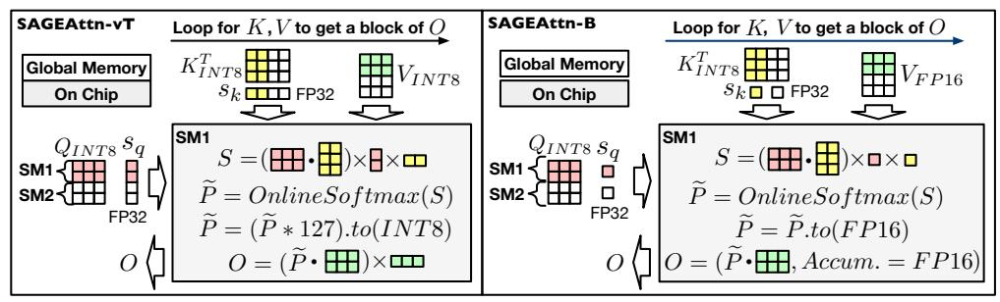

- (a) SageAttention (per-token quantize Q,K; INT8 V)
- (b) SageAttention (per-block quantize Q,K; FP16 V)

<span id="page-6-1"></span>Figure 5: Workflow of SageAttention.

```
Algorithm 1: Implementation of SAGEAttn-B.

Input: Matrices Q(\text{FP16}), K(\text{FP16}), V(\text{FP16}) \in \mathbb{R}^{N \times d}, block size b_q, b_{kv}.

Preprocessing: K = K - \text{mean}(K); // Subtracting the mean value across tokens

Quantization: (\delta_Q, \hat{Q}) = \psi_Q(Q/\sqrt{d}), (\delta_K, \hat{K}) = \psi_K(K); // INT8 per-block quant

Divide \hat{Q} into T_m = N/b_q blocks \{\hat{Q}_i\}, and divide \hat{K}, V into T_n = N/b_{kv} blocks \{\hat{K}_i\} and \{V_i\};

for i in [1, T_m] do; // Outer loop is paralleled in SMs (stream processors)

Load \hat{Q}_i and \delta_Q[i] into a SM;

for j in [1, T_n] do

Load \hat{K}_j, V_j, and \delta_K[j] into the SM;

S_i^j = \text{Matmul}(\hat{Q}_i, \hat{K}_j^T) \times \delta_Q[i] \times \delta_K[j];

m_j^i = \max(m_i^{j-1}, \text{rowmax}(S_i^j)), \tilde{P}_i^j = \exp(S_i^j - m_i^j), l_i^j = e^{m_i^{j-1} - m_i^j} l_i^{j-1} + \text{rowsum}(\tilde{P}_i^j);

O_i^j = \text{diag}(e^{m_i^{j-1} - m_i^j})O_i^{j-1} + \text{Matmul}(\tilde{P}_i^j, \text{to}(\text{FP16}), V_j, \text{Accum_type} = \text{FP16});

O_i = \text{diag}(l_i^{T_n})^{-1}O_i^{T_n};

Write O_i;

return O = \{O_i\};
```

(2) Using  $\psi_P(P)$  and  $\psi_V(V)$  in INT8 or retaining P,V in FP16 with an FP16 accumulator. SAGEAttn-B is accurate enough for all models and can achieve a 2x speedup (See Figure 6 and 7). However, SAGEAttn-vB is also accurate for some layers in a model and faster a little (about 4%) than SAGEAttn-B. Therefore, we use various inputs to test the cosine similarity of SAGEAttn-vB for each layer of a model. Then, we will select SAGEAttn-vB for those layers where SAGEAttn-vB's cosine similarity is bigger than 99.8% (the worst similarity of SAGEAttn-B), and the other layers are left for SAGEAttn-B.

#### 4.6 FUSION TRICKS AND PERFORMANCE ANALYSIS

**Fusion Tricks.** To reduce the overhead of quantization, we fuse the quantization process with the operator preceding the attention layer. For instance, we fuse quantization within the ROPE (Rotary Position Embedding) (Su et al., 2021) layer. Specifically, before the ROPE result (A) is written from shared memory into global memory, we perform  $\delta_A$ ,  $\hat{A} = \psi(A)$ . Subsequently, the  $\delta_A$ ,  $\hat{A}$  are written into global memory. Additionally, we also fuse the coefficient  $(1/\sqrt{d})$  of  $QK^T$  into the quantization process rather than leaving it in the attention layer. Specifically, we multiply Q by  $(1/\sqrt{d})$  on chip before quantizating Q. **Performance Analysis.** We will take SAGEAttn-B as an example to discuss the acceleration effects on actual hardware: (1) Matmul acceleration. Utilizing INT8 matrix multiplication units on current mainstream hardware can achieve 2-4× throughput. While FP16 accumulators do not offer throughput improvements on most compute cards, on-edge accelerators, such as the RTX4090, can still achieve a 2x improvement over FP32 accumulators. (2) Quantization overhead. Quantization and dequantization are considered the main overhead in current quantization methods (Lin et al., 2024). The computational overhead can not be avoided, but through fusing the quantization of Q, K with ROPE, we avoid the IO overhead of quantization. (3) Cache and registers. Currently, mainstream accelerators need to store data in a cache (such as SharedMemory) during computation. Using 8-bit data for calculations can reduce the usage of the

general cache, and using fp16 accumulators can also reduce the usage of accumulation registers. (4) <u>Dram access.</u> Using 8-bit data can halve the tensors transfer overhead from DRAM to the compute units. Although quantization introduces additional FP32 scales, these scales can be considered negligible compared to the tensors.

#### 5 EXPERIMENTS

Main results. The speed of SageAttention is approximately  $2.1 \times$  faster than FlashAttention-2. Furthermore, SageAttention achieves an average real speedup of  $2.83 \times$  compared to the original attention in various models, with negligible loss in end-to-end metrics.

#### 5.1 EXPERIMENTAL SETUP

Models. We validate the effectiveness of SageAttention across a diverse set of representative models from the fields of language, image, and video generation. Specifically, we conduct experiments on five models: Llama2 (7B) (Touvron et al., 2023) for text2text, CogvideoX (Yang et al., 2024) for text2video, Unidiffuser (Bao et al., 2023) and UltraPixel (Ren et al., 2024) for text2image, TIMM (Wightman, 2019) for image classification, and Llaval.6 (Liu et al., 2024a) for visual question answering.

**Datasets.** Llama2 is evaluated on three zero-shot tasks: WikiText (Merity et al., 2022) to assess the model's prediction confidence, LAMBADA (Paperno et al., 2016) evaluate contextual understanding, and MMLU (Hendrycks et al., 2020) for measuring knowledge across various subjects. CogvideoX is evaluated using the open-sora (Zheng et al., 2024c) prompt sets. Both UltraPixel and Unidiffuser are assessed on the COCO annotations (Lin et al., 2014), featuring (prompt, image) pairs. TIMM is evaluated on on three image datasets: ImageNet (Deng et al., 2009), ImageNet-Sketch (Sketch) (Wang et al., 2019), and ImageNet-Rendition (ImageNet-r) (Hendrycks et al., 2021). Llaval. 6 is evaluated on three datasets: TextVQA (Singh et al., 2019), POPE (Li et al., 2023b), and VQAv2 (Goyal et al., 2017).

Metrics. For Llama2, we use perplexity (ppl.) (Jelinek et al., 1977) for WikiText, and Accuracy (Acc.) for LAMBADA and MMLU. For CogvideoX, following (Zhao et al., 2024a), we evaluate the quality of generated videos on five metrics: CLIPSIM and CLIP-Temp (CLIP-T) (Liu et al., 2024b) to measure the text-video alignment; (VQA-a) and (VQA-t) to assess the video aesthetic and technical quality, respectively; and Flow-score (FScore) for temporal consistency (Wu et al., 2023). For UltraPixel and Unidiffuser, generated images are compared with the images in the COCO annotations dataset in three aspects: FID (Heusel et al., 2017) and sFID (Salimans et al., 2016) for fidelity evaluation, Clipscore (CLIP) (Hessel et al., 2021) for text-image alignment, and ImageReward (IR) (Xu et al., 2024) for human preference. For TIMM and Llaval. 6, we use Accuracy.

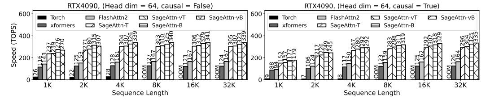

<span id="page-7-0"></span>Figure 6: Speed comparison between SageAttention and baselines (RTX4090, headdim=64).

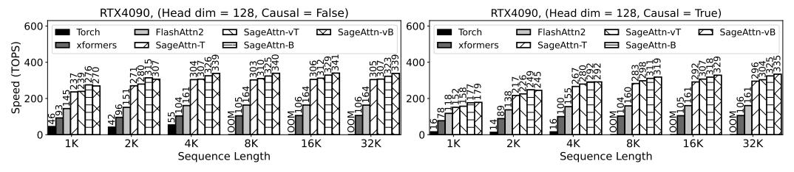

<span id="page-7-1"></span>Figure 7: Speed comparison between SageAttention and baselines (RTX4090, headdim=128).

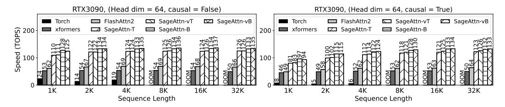

<span id="page-8-0"></span>Figure 8: Speed comparison between SageAttention and baselines (RTX3090, headdim=64).


<span id="page-8-1"></span>Figure 9: Speed comparison between SageAttention and baselines (RTX3090, headdim=128).

#### 5.2 SPEED AND ACCURACY OF ATTENTION KERNELS

**Speed.** We conduct experiments to compare the Speed of SageAttention against baselines using configurations with headdim=64 or headdim=128, both with and without Causal Mask Vaswani (2017). Specifically, Figure 6 and Figure 7 show the Speed of SageAttention and baselines across varying sequence lengths on RTX4090. These results indicate that SageAttention achieves a peak of **341** TOPS and is **2x** faster than FlashAttention2 and **2.9x** faster than xformers on average. Figure 8 and Figure 9 illustrate the results on RTX3090, showing a similar speedup performance.

Accuracy. Table 9 shows the numerical error of four implementations of SageAttention compared with attention in full-precision. This experiment is conducted using a set of (Q, K, V) conforming to a normal distribution. It shows the error of the four implementations is rather small. SAGEAttn-T and SAGEAttn-B achieve 100% cosine similarity and RMSE in the e-4 level.

| Model       | Shape of Q, K, V   | Original attention  | SageAttention | Speedup |
|-------------|--------------------|---------------------|---------------|---------|
| CogvideoX   | (2, 30, 17776, 64) | 163.37 (FlashAttn2) | 327.57        | 2.01x   |
| Llama2      | (4, 32, 1536, 128) | 130.99 (FlashAttn2) | 231.74        | 1.77x   |
| UltraPixel  | (2, 32, 7285, 64)  | 152.03 (FlashAttn2) | 325.18        | 2.14x   |
| Unidiffuser | (4, 24, 1105, 64)  | 105.68 (xformers)   | 246.93        | 2.34x   |
| TIMM        | (12, 64, 197, 64)  | 18.910 (Torch)      | 111.41        | 5.89x   |

<span id="page-8-2"></span>Table 7: Real speedup of SageAttention on RTX4090.

#### 5.3 END-TO-END PERFORMANCE

**Speedup.** We measure the real speed of SageAttention and the original attention on Unidiffuser, UltraPixel, CogvideoX, Llama2 and TIMM on RTX4090. Table 7 shows that SageAttention outperforms original attention across all models. Specifically, SageAttention yields **2.83x** speedup compared to the original attentions on average.

Metrics loss. We assessed the end-to-end metrics of various models using SageAttention compared to using attention in full-precision. Detailed evaluation results are presented in Table 8 for Llama2, CogvideoX, Unidiffuser, UltraPixel, and TIMM, respectively. The results indicate that SageAttention successfully matches the performance of attention in full-precision across all models. Specifically, on Llama2, CogvideoX, UltraPixel, and Unidiffuser, SageAttention resulted in only a minor average degradation of 0.2% compared to attention in full-precision. Moreover, on TIMM, SageAttention even surpasses attention in full-precision.

<span id="page-9-2"></span>Table 8: End-to-end metrics loss across text, image, and video generation models.

| Model        | Attention      | WikiText (P          | pl.) ↓          | Laml         | bda (Acc.) | ↑   M! | MLU (Acc.) ↑         |  |
|--------------|----------------|----------------------|-----------------|--------------|------------|--------|----------------------|--|
| T.1 0        | Full-Precision | 5.823                |                 |              | 0.886      |        | 0.46                 |  |
| Llama2       | SageAttention  | 5.824                |                 |              | 0.887      |        | 0.46                 |  |
|              |                |                      |                 |              |            |        |                      |  |
| Model        | Attention      | CLIPSIM ↑            | CLIP            | <b>'-T</b> ↑ | VQA-a↑     | VQA-   | t ↑   FScore ↑       |  |
| Cogradoov    | Full-Precision | 0.1837               | 0.99            | 76           | 68.962     | 75.92  | 25 3.7684            |  |
| CogvideoX    | SageAttention  | 0.1836               | 0.99            | 76           | 68.839     | 75.03  | 3.8339               |  |
|              |                |                      |                 |              |            |        |                      |  |
| Model        | Attention      | $ $ FID $\downarrow$ | sF              | `↓ dI        | CLI        | P ↑    | IR ↑                 |  |
| Unidiffuser  | Full-Precision | 163.33               | 145.08          |              | 0.31       | 152    | 0.1609               |  |
| Ullialliusei | SageAttention  | 166.49               | 14              | 3.18         | 0.31       | 154    | 0.1521               |  |
| UltraPixel   | Full-Precision | 179.78               | 14              | 1.35         | 0.31       | 132    | 0.6169               |  |
| UILLAPIXEI   | SageAttention  | 179.79               | 14              | 141.63 0.3   |            | 131    | 0.6110               |  |
|              |                |                      |                 |              |            |        |                      |  |
| Model        | Attention      | ImageNet (A          | cc.) †          | Sketc        | h (Acc.) ↑ | Image  | Net-r (Acc.) ↑       |  |
| TIMM         | Full-Precision | 84.79%               |                 | 45.32%       |            | 59.55% |                      |  |
| T TIMIM      | SageAttention  | 84.74%               |                 | 45.78%       |            |        | 60.32%               |  |
|              |                |                      |                 |              |            |        |                      |  |
| Model        | Attention      | TextVQA (A           | <b>\cc.</b> ) ↑ | PO           | PE (Acc.)  | ↑   V( | <b>QAv2</b> (Acc.) ↑ |  |
|              | Full-Precision | 60.25%               | ó               | 86.45%       |            |        | 77.55%               |  |
| Llava1.6     | SageAttention  | 60.09%               | Ó               |              | 86.44%     |        | 77.47%               |  |
|              |                |                      |                 |              |            |        |                      |  |

<span id="page-9-1"></span>Table 9: Accuracy of SageAttention kernels.

| attention   | Cos Sim ↑ | Relative L1 $\downarrow$ | RMSE ↓ |
|-------------|-----------|--------------------------|--------|
| SAGEAttn-T  | 1.0       | 0.019                    | 6.8e-4 |
| SAGEAttn-B  | 1.0       | 0.021                    | 7.3e-4 |
| SAGEAttn-vT | 99.9%     | 0.064                    | 0.065  |
| SAGEAttn-vB | 98.9%     | 0.138                    | 0.067  |

<span id="page-9-0"></span>Table 10: Overhead of smoothing K.

|        | Model         | Smooth K | <b>TOPS</b> ↑ |
|--------|---------------|----------|---------------|
| Coarri | CogvideoX     | Х        | 327.57        |
|        | cogvideox     | ✓        | 327.52        |
| UltraP | III+ maDireal | Х        | 325.18        |
|        | UICLAPIXEL    | ✓        | 324.56        |

<span id="page-9-3"></span>Table 11: Benefit of adaptive quantization.

| attention     | model     | <b>CLIPSIM</b> ↑ | <b>TOPS</b> ↑ | Model   | MMLU ↑ | <b>TOPS</b> ↑ |
|---------------|-----------|------------------|---------------|---------|--------|---------------|
| SAGEAttn-T    | Cogridoov | 0.1827           | 292.17        | Llama2  | 0.46   | 208.59        |
| SageAttention | CogvideoX | 0.1835           | 327.57        | LIallaZ | 0.46   | 231.74        |

#### 5.4 ABLATION STUDY

**Overhead of smoothing K.** Table 10 presents the overhead associated with smoothing K on the attention speed in real models. The results indicate a minimal reduction, less than 0.2%.

Benefit of adaptive quantization. We analyzed the performance differences between using only SAGEAttn-T and employing an adaptive strategy (SageAttention). Table 11 presents the metrics and average speed of attention on CogvideoX and Llama2. The results indicate that the adaptive strategy increases the speed of attention by 11.7% without any loss in metrics.

#### 6 CONCLUSION AND FUTURE WORK

We introduce SageAttention, an efficient and precise INT8 quantization method for attention. First, we propose a method to smooth matrix K, enhancing the accuracy with under 0.2% speed overhead. Second, we use FP16 accumulators in the Matmul of (P,V) to boost both accuracy and speed. Third, we use adaptive quantization to further improve OPS by 12% without sacrificing accuracy. Our method surpasses FlashAttention2 and xformers by approximately 2.1x and 2.7x, respectively. Extensive testing confirms that our approach maintains end-to-end metrics across various models, including language, image, and video generation models.

## ACKNKOWLEGEMENT

The authors would like to thank Haofeng Huang for his valuable help with the implementation. This work was supported by the NSFC Project (No. 62376131), Tsinghua Institute for Guo Qiang, and the High Performance Computing Center, Tsinghua University. J.Z is also supported by the XPlorer Prize.

## REFERENCES

- <span id="page-10-1"></span>Fan Bao, Shen Nie, Kaiwen Xue, Yue Cao, Chongxuan Li, Hang Su, and Jun Zhu. All are worth words: A vit backbone for diffusion models. In *CVPR*, 2023.
- <span id="page-10-7"></span>Ganesh Bikshandi and Jay Shah. A case study in cuda kernel fusion: Implementing flashattention-2 on nvidia hopper architecture using the cutlass library. *arXiv preprint arXiv:2312.11918*, 2023.
- <span id="page-10-3"></span>Yukang Chen, Shengju Qian, Haotian Tang, Xin Lai, Zhijian Liu, Song Han, and Jiaya Jia. Longlora: Efficient fine-tuning of long-context large language models. *arXiv preprint arXiv:2309.12307*, 2023.
- <span id="page-10-4"></span>Krzysztof Choromanski, Valerii Likhosherstov, David Dohan, Xingyou Song, Andreea Gane, Tamas Sarlos, Peter Hawkins, Jared Davis, Afroz Mohiuddin, Lukasz Kaiser, et al. Rethinking attention with performers. *arXiv preprint arXiv:2009.14794*, 2020.
- <span id="page-10-2"></span>Xiangxiang Chu, Zhi Tian, Yuqing Wang, Bo Zhang, Haibing Ren, Xiaolin Wei, Huaxia Xia, and Chunhua Shen. Twins: Revisiting the design of spatial attention in vision transformers. *Advances in neural information processing systems*, 34:9355–9366, 2021.
- <span id="page-10-6"></span>Tri Dao. Flashattention-2: Faster attention with better parallelism and work partitioning. *arXiv preprint arXiv:2307.08691*, 2023.
- <span id="page-10-5"></span>Tri Dao, Dan Fu, Stefano Ermon, Atri Rudra, and Christopher Re. Flashattention: Fast and memory- ´ efficient exact attention with io-awareness. *Advances in Neural Information Processing Systems*, 35:16344–16359, 2022.
- <span id="page-10-9"></span>Jia Deng, Wei Dong, Richard Socher, Li-Jia Li, Kai Li, and Li Fei-Fei. Imagenet: A large-scale hierarchical image database. In *2009 IEEE conference on computer vision and pattern recognition*, pp. 248–255. Ieee, 2009.
- <span id="page-10-0"></span>Abhimanyu Dubey, Abhinav Jauhri, Abhinav Pandey, Abhishek Kadian, Ahmad Al-Dahle, Aiesha Letman, Akhil Mathur, Alan Schelten, Amy Yang, Angela Fan, et al. The llama 3 herd of models. *arXiv preprint arXiv:2407.21783*, 2024.
- <span id="page-10-12"></span>Tianyu Fu, Haofeng Huang, Xuefei Ning, Genghan Zhang, Boju Chen, Tianqi Wu, Hongyi Wang, Zixiao Huang, Shiyao Li, Shengen Yan, Guohao Dai, Huazhong Yang, and Yu Wang. Moa: Mixture of sparse attention for automatic large language model compression, 2024a.
- <span id="page-10-13"></span>Tianyu Fu, Tengxuan Liu, Qinghao Han, Guohao Dai, Shengen Yan, Huazhong Yang, Xuefei Ning, and Yu Wang. Framefusion: Combining similarity and importance for video token reduction on large visual language models, 2024b. URL <https://arxiv.org/abs/2501.01986>.
- <span id="page-10-11"></span>Yash Goyal, Tejas Khot, Douglas Summers-Stay, Dhruv Batra, and Devi Parikh. Making the v in vqa matter: Elevating the role of image understanding in visual question answering. In *Proceedings of the IEEE conference on computer vision and pattern recognition*, pp. 6904–6913, 2017.
- <span id="page-10-8"></span>Dan Hendrycks, Collin Burns, Steven Basart, Andy Zou, Mantas Mazeika, Dawn Song, and Jacob Steinhardt. Measuring massive multitask language understanding. 2020.
- <span id="page-10-10"></span>Dan Hendrycks, Steven Basart, Norman Mu, Saurav Kadavath, Frank Wang, Evan Dorundo, Rahul Desai, Tyler Zhu, Samyak Parajuli, Mike Guo, Dawn Song, Jacob Steinhardt, and Justin Gilmer. The many faces of robustness: A critical analysis of out-of-distribution generalization. *ICCV*, 2021.

- <span id="page-11-7"></span>Jack Hessel, Ari Holtzman, Maxwell Forbes, Ronan Le Bras, and Yejin Choi. Clipscore: A reference-free evaluation metric for image captioning. In *Proceedings of the 2021 Conference on Empirical Methods in Natural Language Processing*, pp. 7514–7528, 2021.
- <span id="page-11-6"></span>Martin Heusel, Hubert Ramsauer, Thomas Unterthiner, Bernhard Nessler, and Sepp Hochreiter. Gans trained by a two time-scale update rule converge to a local nash equilibrium. *Advances in neural information processing systems*, 30, 2017.
- <span id="page-11-8"></span>Yuezhou Hu, Weiyu Huang, Zichen Liang, Chang Chen, Jintao Zhang, Jun Zhu, and Jianfei Chen. Identifying sensitive weights via post-quantization integral. *arXiv preprint arXiv:2503.01901*, 2025.
- <span id="page-11-11"></span>Weiyu Huang, Yuezhou Hu, Guohao Jian, Jun Zhu, and Jianfei Chen. Pruning large language models with semi-structural adaptive sparse training, 2024. URL [https://arxiv.org/abs/](https://arxiv.org/abs/2407.20584) [2407.20584](https://arxiv.org/abs/2407.20584).
- <span id="page-11-0"></span>Benoit Jacob, Skirmantas Kligys, Bo Chen, Menglong Zhu, Matthew Tang, Andrew Howard, Hartwig Adam, and Dmitry Kalenichenko. Quantization and training of neural networks for efficient integer-arithmetic-only inference. In *Proceedings of the IEEE conference on computer vision and pattern recognition*, pp. 2704–2713, 2018.
- <span id="page-11-5"></span>Fred Jelinek, Robert L Mercer, Lalit R Bahl, and James K Baker. Perplexity—a measure of the difficulty of speech recognition tasks. *The Journal of the Acoustical Society of America*, 62(S1): S63–S63, 1977.
- <span id="page-11-1"></span>Huiqiang Jiang, Yucheng Li, Chengruidong Zhang, Qianhui Wu, Xufang Luo, Surin Ahn, Zhenhua Han, Amir H Abdi, Dongsheng Li, Chin-Yew Lin, et al. Minference 1.0: Accelerating pre-filling for long-context llms via dynamic sparse attention. *arXiv preprint arXiv:2407.02490*, 2024.
- <span id="page-11-13"></span>Youhe Jiang, Ran Yan, Xiaozhe Yao, Yang Zhou, Beidi Chen, and Binhang Yuan. Hexgen: Generative inference of large language model over heterogeneous environment. In *Forty-first International Conference on Machine Learning*.
- <span id="page-11-12"></span>Youhe Jiang, Fangcheng Fu, Xiaozhe Yao, Guoliang He, Xupeng Miao, Ana Klimovic, Bin Cui, Binhang Yuan, and Eiko Yoneki. Demystifying cost-efficiency in llm serving over heterogeneous gpus. *arXiv preprint arXiv:2502.00722*, 2025a.
- <span id="page-11-14"></span>Youhe Jiang, Ran Yan, and Binhang Yuan. Hexgen-2: Disaggregated generative inference of llms in heterogeneous environment. In *International Conference on Learning Representations (ICLR)*, 2025b.
- <span id="page-11-2"></span>Angelos Katharopoulos, Apoorv Vyas, Nikolaos Pappas, and Franc¸ois Fleuret. Transformers are rnns: Fast autoregressive transformers with linear attention. In *International conference on machine learning*, pp. 5156–5165. PMLR, 2020.
- <span id="page-11-4"></span>Sehoon Kim, Amir Gholami, Zhewei Yao, Michael W Mahoney, and Kurt Keutzer. I-bert: Integeronly bert quantization. In *International conference on machine learning*, pp. 5506–5518. PMLR, 2021.
- <span id="page-11-3"></span>Benjamin Lefaudeux, Francisco Massa, Diana Liskovich, Wenhan Xiong, Vittorio Caggiano, Sean Naren, Min Xu, Jieru Hu, Marta Tintore, Susan Zhang, Patrick Labatut, Daniel Haziza, Luca Wehrstedt, Jeremy Reizenstein, and Grigory Sizov. xformers: A modular and hackable transformer modelling library. <https://github.com/facebookresearch/xformers>, 2022.
- <span id="page-11-9"></span>Bingrui Li, Jianfei Chen, and Jun Zhu. Memory efficient optimizers with 4-bit states. *Advances in Neural Information Processing Systems*, 36:15136–15171, 2023a.
- <span id="page-11-10"></span>Bingrui Li, Wei Huang, Andi Han, Zhanpeng Zhou, Taiji Suzuki, Jun Zhu, and Jianfei Chen. On the optimization and generalization of two-layer transformers with sign gradient descent. In *International Conference on Learning Representations (ICLR)*, 2025.

- <span id="page-12-3"></span>Kunchang Li, Yali Wang, Gao Peng, Guanglu Song, Yu Liu, Hongsheng Li, and Yu Qiao. Uniformer: Unified transformer for efficient spatial-temporal representation learning. In *International Conference on Learning Representations*.
- <span id="page-12-12"></span>Yifan Li, Yifan Du, Kun Zhou, Jinpeng Wang, Wayne Xin Zhao, and Ji-Rong Wen. Evaluating object hallucination in large vision-language models. *arXiv preprint arXiv:2305.10355*, 2023b.
- <span id="page-12-11"></span>Tsung-Yi Lin, Michael Maire, Serge Belongie, James Hays, Pietro Perona, Deva Ramanan, Piotr Dollar, and C Lawrence Zitnick. Microsoft coco: Common objects in context. In ´ *Computer Vision–ECCV 2014: 13th European Conference, Zurich, Switzerland, September 6-12, 2014, Proceedings, Part V 13*, pp. 740–755. Springer, 2014.
- <span id="page-12-6"></span>Yujun Lin, Haotian Tang, Shang Yang, Zhekai Zhang, Guangxuan Xiao, Chuang Gan, and Song Han. Qserve: W4a8kv4 quantization and system co-design for efficient llm serving, 2024. URL <https://arxiv.org/abs/2405.04532>.
- <span id="page-12-4"></span>Hao Liu, Matei Zaharia, and Pieter Abbeel. Ringattention with blockwise transformers for nearinfinite context. In *The Twelfth International Conference on Learning Representations*.
- <span id="page-12-8"></span>Haotian Liu, Chunyuan Li, Yuheng Li, Bo Li, Yuanhan Zhang, Sheng Shen, and Yong Jae Lee. Llava-next: Improved reasoning, ocr, and world knowledge, January 2024a. URL [https://](https://llava-vl.github.io/blog/2024-01-30-llava-next/) [llava-vl.github.io/blog/2024-01-30-llava-next/](https://llava-vl.github.io/blog/2024-01-30-llava-next/).
- <span id="page-12-13"></span>Yaofang Liu, Xiaodong Cun, Xuebo Liu, Xintao Wang, Yong Zhang, Haoxin Chen, Yang Liu, Tieyong Zeng, Raymond Chan, and Ying Shan. Evalcrafter: Benchmarking and evaluating large video generation models. In *Proceedings of the IEEE/CVF Conference on Computer Vision and Pattern Recognition*, pp. 22139–22149, 2024b.
- <span id="page-12-2"></span>Ze Liu, Yutong Lin, Yue Cao, Han Hu, Yixuan Wei, Zheng Zhang, Stephen Lin, and Baining Guo. Swin transformer: Hierarchical vision transformer using shifted windows. In *Proceedings of the IEEE/CVF international conference on computer vision*, pp. 10012–10022, 2021.
- <span id="page-12-9"></span>Stephen Merity, Caiming Xiong, James Bradbury, and Richard Socher. Pointer sentinel mixture models. In *International Conference on Learning Representations*, 2022.
- <span id="page-12-5"></span>Maxim Milakov and Natalia Gimelshein. Online normalizer calculation for softmax. *arXiv preprint arXiv:1805.02867*, 2018.
- <span id="page-12-10"></span>Denis Paperno, German Kruszewski, Angeliki Lazaridou, Ngoc-Quan Pham, Raffaella Bernardi, ´ Sandro Pezzelle, Marco Baroni, Gemma Boleda, and Raquel Fernandez. The lambada dataset: ´ Word prediction requiring a broad discourse context. In *Proceedings of the 54th Annual Meeting of the Association for Computational Linguistics (Volume 1: Long Papers)*, pp. 1525–1534, 2016.
- <span id="page-12-0"></span>Houwen Peng, Kan Wu, Yixuan Wei, Guoshuai Zhao, Yuxiang Yang, Ze Liu, Yifan Xiong, Ziyue Yang, Bolin Ni, Jingcheng Hu, et al. Fp8-lm: Training fp8 large language models. *arXiv preprint arXiv:2310.18313*, 2023.
- <span id="page-12-15"></span>PyTorch Contributors. Torch backend documentation. [https://pytorch.org/docs/](https://pytorch.org/docs/stable/backends.html#torch.backends.cuda.enable_math_sdp) [stable/backends.html#torch.backends.cuda.enable\\_math\\_sdp](https://pytorch.org/docs/stable/backends.html#torch.backends.cuda.enable_math_sdp).
- <span id="page-12-7"></span>Jingjing Ren, Wenbo Li, Haoyu Chen, Renjing Pei, Bin Shao, Yong Guo, Long Peng, Fenglong Song, and Lei Zhu. Ultrapixel: Advancing ultra-high-resolution image synthesis to new peaks. *arXiv preprint arXiv:2407.02158*, 2024.
- <span id="page-12-14"></span>Tim Salimans, Ian Goodfellow, Wojciech Zaremba, Vicki Cheung, Alec Radford, and Xi Chen. Improved techniques for training gans. *Advances in neural information processing systems*, 29, 2016.
- <span id="page-12-1"></span>Jay Shah, Ganesh Bikshandi, Ying Zhang, Vijay Thakkar, Pradeep Ramani, and Tri Dao. Flashattention-3: Fast and accurate attention with asynchrony and low-precision. *arXiv preprint arXiv:2407.08608*, 2024.

- <span id="page-13-12"></span>Amanpreet Singh, Vivek Natarajan, Meet Shah, Yu Jiang, Xinlei Chen, Dhruv Batra, Devi Parikh, and Marcus Rohrbach. Towards vqa models that can read. In *Proceedings of the IEEE/CVF conference on computer vision and pattern recognition*, pp. 8317–8326, 2019.
- <span id="page-13-9"></span>Jianlin Su, Yu Lu, Shengfeng Pan, Ahmed Murtadha, Bo Wen, and Yunfeng Liu. Roformer: Enhanced transformer with rotary position embedding. *arXiv preprint arXiv:2104.09864*, 2021.
- <span id="page-13-1"></span>Xiao Sun, Jungwook Choi, Chia-Yu Chen, Naigang Wang, Swagath Venkataramani, Vijayalakshmi Viji Srinivasan, Xiaodong Cui, Wei Zhang, and Kailash Gopalakrishnan. Hybrid 8-bit floating point (hfp8) training and inference for deep neural networks. *Advances in neural information processing systems*, 32, 2019.
- <span id="page-13-4"></span>Philippe Tillet, H. T. Kung, and David Cox. Triton: an intermediate language and compiler for tiled neural network computations. MAPL 2019, pp. 10–19, New York, NY, USA, 2019. Association for Computing Machinery. ISBN 9781450367196.
- <span id="page-13-8"></span>Hugo Touvron, Louis Martin, Kevin Stone, Peter Albert, Amjad Almahairi, Yasmine Babaei, Nikolay Bashlykov, Soumya Batra, Prajjwal Bhargava, Shruti Bhosale, et al. Llama 2: Open foundation and fine-tuned chat models. *arXiv preprint arXiv:2307.09288*, 2023.
- <span id="page-13-0"></span>A Vaswani. Attention is all you need. *Advances in Neural Information Processing Systems*, 2017.
- <span id="page-13-6"></span>Shashanka Venkataramanan, Amir Ghodrati, Yuki M Asano, Fatih Porikli, and Amirhossein Habibian. Skip-attention: Improving vision transformers by paying less attention. *arXiv preprint arXiv:2301.02240*, 2023.
- <span id="page-13-11"></span>Haohan Wang, Songwei Ge, Zachary Lipton, and Eric P Xing. Learning robust global representations by penalizing local predictive power. *Advances in Neural Information Processing Systems*, 32, 2019.
- <span id="page-13-7"></span>Sinong Wang, Belinda Z Li, Madian Khabsa, Han Fang, and Hao Ma. Linformer: Self-attention with linear complexity. *arXiv preprint arXiv:2006.04768*, 2020.
- <span id="page-13-14"></span>Ziteng Wang, Jianfei Chen, and Jun Zhu. Remoe: Fully differentiable mixture-of-experts with relu routing. In *International Conference on Learning Representations (ICLR)*, 2025.
- <span id="page-13-10"></span>Ross Wightman. Pytorch image models. [https://github.com/rwightman/](https://github.com/rwightman/pytorch-image-models) [pytorch-image-models](https://github.com/rwightman/pytorch-image-models), 2019.
- <span id="page-13-13"></span>Haoning Wu, Erli Zhang, Liang Liao, Chaofeng Chen, Jingwen Hou, Annan Wang, Wenxiu Sun, Qiong Yan, and Weisi Lin. Exploring video quality assessment on user generated contents from aesthetic and technical perspectives. In *Proceedings of the IEEE/CVF International Conference on Computer Vision*, pp. 20144–20154, 2023.
- <span id="page-13-15"></span>Haocheng Xi, Han Cai, Ligeng Zhu, Yao Lu, Kurt Keutzer, Jianfei Chen, and Song Han. Coat: Compressing optimizer states and activation for memory-efficient fp8 training. *arXiv preprint arXiv:2410.19313*, 2024a.
- <span id="page-13-2"></span>Haocheng Xi, Yuxiang Chen, Kang Zhao, KAI JUN TEH, Jianfei Chen, and Jun Zhu. Jetfire: Efficient and accurate transformer pretraining with int8 data flow and per-block quantization. In *Forty-first International Conference on Machine Learning*, 2024b.
- <span id="page-13-16"></span>Haocheng Xi, Shuo Yang, Yilong Zhao, Chenfeng Xu, Muyang Li, Xiuyu Li, Yujun Lin, Han Cai, Jintao Zhang, Dacheng Li, et al. Sparse videogen: Accelerating video diffusion transformers with spatial-temporal sparsity. *arXiv preprint arXiv:2502.01776*, 2025.
- <span id="page-13-5"></span>Chaojun Xiao, Pengle Zhang, Xu Han, Guangxuan Xiao, Yankai Lin, Zhengyan Zhang, Zhiyuan Liu, and Maosong Sun. Infllm: Training-free long-context extrapolation for llms with an efficient context memory. In *First Workshop on Long-Context Foundation Models@ ICML 2024*, 2024.
- <span id="page-13-3"></span>Guangxuan Xiao, Ji Lin, Mickael Seznec, Hao Wu, Julien Demouth, and Song Han. Smoothquant: Accurate and efficient post-training quantization for large language models. In *International Conference on Machine Learning*, pp. 38087–38099. PMLR, 2023a.

- <span id="page-14-1"></span>Guangxuan Xiao, Yuandong Tian, Beidi Chen, Song Han, and Mike Lewis. Efficient streaming language models with attention sinks. *arXiv preprint arXiv:2309.17453*, 2023b.
- <span id="page-14-4"></span>Jiazheng Xu, Xiao Liu, Yuchen Wu, Yuxuan Tong, Qinkai Li, Ming Ding, Jie Tang, and Yuxiao Dong. Imagereward: Learning and evaluating human preferences for text-to-image generation. *Advances in Neural Information Processing Systems*, 36, 2024.
- <span id="page-14-14"></span>Shuo Yang, Haocheng Xi, Yilong Zhao, Muyang Li, Jintao Zhang, Han Cai, Yujun Lin, Xiuyu Li, Chenfeng Xu, Kelly Peng, et al. Sparse videogen2: Accelerate video generation with sparse attention via semantic-aware permutation. *arXiv preprint arXiv:2505.18875*, 2025.
- <span id="page-14-0"></span>Zhuoyi Yang, Jiayan Teng, Wendi Zheng, Ming Ding, Shiyu Huang, Jiazheng Xu, Yuanming Yang, Wenyi Hong, Xiaohan Zhang, Guanyu Feng, et al. Cogvideox: Text-to-video diffusion models with an expert transformer. *arXiv preprint arXiv:2408.06072*, 2024.
- <span id="page-14-2"></span>Weihao Yu, Mi Luo, Pan Zhou, Chenyang Si, Yichen Zhou, Xinchao Wang, Jiashi Feng, and Shuicheng Yan. Metaformer is actually what you need for vision. In *Proceedings of the IEEE/CVF conference on computer vision and pattern recognition*, pp. 10819–10829, 2022.
- <span id="page-14-5"></span>Jintao Zhang, Haofeng Huang, Pengle Zhang, Jia Wei, Jun Zhu, and Jianfei Chen. Sageattention2: Efficient attention with thorough outlier smoothing and per-thread int4 quantization. In *International Conference on Machine Learning (ICML)*, 2025a.
- <span id="page-14-6"></span>Jintao Zhang, Haofeng Huang, Pengle Zhang, Jia Wei, Jun Zhu, and Jianfei Chen. Sageattention2: Efficient attention with smoothing q and per-thread quantization. 2025b.
- <span id="page-14-8"></span>Jintao Zhang, Guoliang Li, and Jinyang Su. Sage: A framework of precise retrieval for rag. In *2025 IEEE 41th International Conference on Data Engineering (ICDE)*. IEEE, 2025c.
- <span id="page-14-15"></span>Jintao Zhang, Jia Wei, Pengle Zhang, Xiaoming Xu, Haofeng Huang, Haoxu Wang, Kai Jiang, Jun Zhu, and Jianfei Chen. Sageattention3: Microscaling fp4 attention for inference and an exploration of 8-bit training. *arXiv preprint arXiv:2505.11594*, 2025d.
- <span id="page-14-12"></span>Jintao Zhang, Chendong Xiang, Haofeng Huang, Jia Wei, Haocheng Xi, Jun Zhu, and Jianfei Chen. Spargeattn: Accurate sparse attention accelerating any model inference. *arXiv preprint arXiv:2502.18137*, 2025e.
- <span id="page-14-13"></span>Jintao Zhang, Chendong Xiang, Haofeng Huang, Jia Wei, Haocheng Xi, Jun Zhu, and Jianfei Chen. Spargeattn: Training-free sparse attention accelerating any model inference. 2025f.
- <span id="page-14-16"></span>Jintao Zhang, Xiaoming Xu, Jia Wei, Haofeng Huang, Pengle Zhang, Chendong Xiang, Jun Zhu, and Jianfei Chen. Sageattention2++: A more efficient implementation of sageattention2. 2025g.
- <span id="page-14-7"></span>Pengle Zhang, Jia Wei, Jintao Zhang, Jun Zhu, and Jianfei Chen. Accurate int8 training through dynamic block-level fallback. *arXiv preprint arXiv:2503.08040*, 2025h.
- <span id="page-14-3"></span>Tianchen Zhao, Tongcheng Fang, Enshu Liu, Rui Wan, Widyadewi Soedarmadji, Shiyao Li, Zinan Lin, Guohao Dai, Shengen Yan, Huazhong Yang, et al. Vidit-q: Efficient and accurate quantization of diffusion transformers for image and video generation. *arXiv preprint arXiv:2406.02540*, 2024a.
- <span id="page-14-11"></span>Tianchen Zhao, Xuefei Ning, Tongcheng Fang, Enshu Liu, Guyue Huang, Zinan Lin, Shengen Yan, Guohao Dai, and Yu Wang. Mixdq: Memory-efficient few-step text-to-image diffusion models with metric-decoupled mixed precision quantization. In *European Conference on Computer Vision*, pp. 285–302. Springer, 2024b.
- <span id="page-14-9"></span>Kaiwen Zheng, Yongxin Chen, Hanzi Mao, Ming-Yu Liu, Jun Zhu, and Qinsheng Zhang. Masked diffusion models are secretly time-agnostic masked models and exploit inaccurate categorical sampling. *arXiv preprint arXiv:2409.02908*, 2024a.
- <span id="page-14-10"></span>Kaiwen Zheng, Guande He, Jianfei Chen, Fan Bao, and Jun Zhu. Diffusion bridge implicit models. *arXiv preprint arXiv:2405.15885*, 2024b.

<span id="page-15-1"></span>Kaiwen Zheng, Guande He, Jianfei Chen, Fan Bao, and Jun Zhu. Elucidating the preconditioning in consistency distillation. *arXiv preprint arXiv:2502.02922*, 2025.

<span id="page-15-0"></span>Zangwei Zheng, Xiangyu Peng, Tianji Yang, Chenhui Shen, Shenggui Li, Hongxin Liu, Yukun Zhou, Tianyi Li, and Yang You. Open-sora: Democratizing efficient video production for all, March 2024c. URL <https://github.com/hpcaitech/Open-Sora>.

## A EXPERIMENTAL DETAIL

#### A.1 ENVIRONMENT

We implemented our Attention kernels using OpenAI Triton [\(Tillet et al., 2019\)](#page-13-4) and conducted experiments on Ubuntu 22.04 servers. Tests on the RTX 4090 utilized a server with PCIE 5.0, a 16-core Xeon(R) 6430 CPU, and 120GB DDR4 RAM, while the RTX3090 tests employed a server with a 16-core Xeon(R) 8358P CPU and 80GB DDR4 RAM. To reproduce our results, experiments should be conducted in the environment of torch 2.4.0+cu121, triton-nightly (version of 20240816), python 3.11, and (gcc, g++) in version 9.

#### A.2 HYPER-PARAMETERS FOR ATTENTION KERNELS

We use 128 for a block size of Q, and 64 for a block size of K and V . The parameters Num Warps and Num Stages, which represent the number of warp schedulers and the number of processing stages in our GPU kernels, respectively, are detailed in Table [12.](#page-16-0)

| HeadDim | Causal Mask | Num Warps | Num Stages |  |  |  |  |  |
|---------|-------------|-----------|------------|--|--|--|--|--|
| 64      | False       | 4         | 3          |  |  |  |  |  |
| 64      | True        | 4         | 4          |  |  |  |  |  |
| 128     | False       | 8         | 3          |  |  |  |  |  |
| 128     | True        | 8         | 5          |  |  |  |  |  |

<span id="page-16-0"></span>Table 12: Hyper-parameters for our Attention Kernels.

## A.3 DETAILS OF DATASETS AND MODELS

We choose the first 256 annotations from the COCO 2014val dataset as the prompt set for UltraPixel and Unidiffuser image generation. We also used the corresponding 256 images of the 256 prompts as the ground truth images to calculate the FID and sFID. For CogvideoX, the model is trained on long texts, so we applied an open-sora prompt set, each consisting of more than 120 words. The specific model we used for TIMM is *vit base patch16 224.augreg2 in21k ft in1k*.

## A.4 ADDITIONAL EXPERIMENTS

<span id="page-16-1"></span>Table 13: Comparison of SageAttention with AWQ (W4A16) on Llama2.

|                               |        | Full-Precision SageAttention | AWQ    | AWQ+SageAttention |
|-------------------------------|--------|------------------------------|--------|-------------------|
| Perplexity↓                   | 5.4721 | 5.4729                       | 5.5988 | 5.5998            |
| Speedup of Linear Computation | 0      | 0                            | 0      | 0                 |
| Speedup of Attention          | 0      | 2x                           | 0      | 2x                |

<span id="page-16-2"></span>Table 14: Comparison of SageAttention with Q-diffusion (W8A8) on Unidiffuser.

|                    | FID↓   | sFID↓  | CLIP↑ | ImageReward↑ |
|--------------------|--------|--------|-------|--------------|
| Full Precision     | 163.33 | 145.08 | 31.52 | 0.1609       |
| SageAttention      | 166.49 | 143.18 | 31.54 | 0.1521       |
| Q-diffusion (W8A8) | 395.99 | 178.56 | 18.03 | -2.273       |

## A.5 COMPARISON WITH OTHER METHODS

There are some task-specific quantization methods, such as AWQ for LLMs, Q-diffusion for textto-image, and ViDiT-Q for text-to-video applications. SageAttention is orthogonal to them because those works are mainly used to quantize the linear layers. Second, AWQ is only used to compress the parameters of LLMs with no acceleration effect in computation. Q-diffusion has not reported its

<span id="page-17-0"></span>Table 15: Comparison of SageAttention with VIDIT-Q on CogvideoX.

|                | CLIPSIM↑ | CLIP-T↑ | VQA-a↑ | VQA-t↑ | FScore <sup>†</sup> | End-to-end Speedup↑       |
|----------------|----------|---------|--------|--------|---------------------|---------------------------|
| Full Precision | 0.1837   | 0.9976  | 68.962 | 75.925 | 3.7684              | -                         |
| SageAttention  | 0.1836   | 0.9976  | 68.839 | 75.037 | 3.8339              | 34.3%                     |
| VIDIT-Q (W8A8) | 0.1884   | 0.9974  | 68.185 | 71.011 | 3.7342              | 22% (theoretical maximum) |

acceleration effect in their paper and provided codes with acceleration effect in its official repository. ViDiT-Q has not provided the codes with acceleration effect in its official repository. Nonetheless, we compare SageAttention with those works as follows. (1) We compare the perplexity of Llama2-7B on WikiText and the speedup in the prefilling stage. The results are shown in Table 13. We compare SageAttention with Q-diffusion (W8A8) on Unidiffuser. The results are shown in Table 14. We compare SageAttention with VIDIT-Q on CogvideoX and the results are shown in Table 15. Since the official repository does not provide acceleration code, we estimate a theoretical maximum: the Linear layer accounts for 24% of Cogvideo's latency, and W8A8 offers at most 4x speedup for the Linear layer, resulting in a theoretical maximum end-to-end speedup of  $\frac{100}{100-24\times\frac{3}{4}}\%=22\%$ .

#### A.6 SOME INSIGHTS

Table 1 shows that the metric of Llama2 remains stable with quantization. The reason is that the distribution of Q, K, and V in the attention of Llama2-7B is relatively uniform. As a result, quantizing Q, K, and V to INT8 or FP8 does not significantly impact the accuracy of attention. This insight inspires the idea that better control over outlier activations in models could lead to more precise quantization results. As works like Fu et al. (2024a); Zhang et al. (2025a;b), we believe SageAttention can also be effectively applied to various applications related to Transformers, such as MOE systems (Wang et al., 2025), linear layer quantization (Hu et al., 2025; Zhang et al., 2025h; Zhao et al., 2024a), RAG systems (Zhang et al., 2025c), training optimization (Li et al., 2023a; 2025; Huang et al., 2024; Xi et al., 2024a), heterogeneous GPU systems (Jiang et al., 2025a; Jiang et al., 2025b), and diffusion models acceleration (Zheng et al., 2024a;b; 2025; Fu et al., 2024b; Zhao et al., 2024b; Xi et al., 2025; Zhang et al., 2025e;f; Yang et al., 2025; Zhang et al., 2025d;g).

<span id="page-17-1"></span>Table 16: SageAttention based on Torch Attention.

| Sequence Length | Torch Attention | SageAttention based on Torch Attention |
|-----------------|-----------------|----------------------------------------|
| 1024            | 46              | 48                                     |
| 2048            | 42              | 55                                     |
| 4096            | 55              | 87                                     |
| 8192            | OOM             | OOM                                    |

#### B IMPLEMENTATION BASED ON TORCH ATTENTION

FlashAttention is the state-of-the-art and most commonly used standard attention; another commonly used attention is Torch attention (PyTorch Contributors). We report the implementation speeds based on Torch in Table 16.

Table 17: Numerical error of  $Q \cdot K$  using different type of quantization.

<span id="page-17-2"></span>

| Data Type | Cosine Sim | Relative L1 |
|-----------|------------|-------------|
| INT8      | 99.54%     | 0.084       |
| E4M3      | 92.83%     | 0.342       |
| E5M2      | 77.95%     | 0.681       |

#### B.1 ADDITIONAL PRECISION COMPARISION

Table 17 shows the precision of  $Q \cdot K$  using per-token quantization in different data types compared to  $Q \cdot K$  in full precision. This experiment is conducted using Q, K from the 24th layer of

<span id="page-18-0"></span>

| Table 18: Error of quantized attention with or without smoothed K. |  |
|--------------------------------------------------------------------|--|
|--------------------------------------------------------------------|--|

| Quantization Type                    | Smoothed K | Cosine Sim ↑ | Relative L1 ↓ | RMSE ↓ |
|--------------------------------------|------------|--------------|---------------|--------|
|                                      | Without    | 62.24%       | 1.187         | 0.294  |
| Per-token (SAGEAttn-T)               | With       | 99.47%       | 0.045         | 0.031  |
| Per-block (SAGEAttn-B)               | Without    | 30.60%       | 1.286         | 0.464  |
|                                      | With       | 99.31%       | 0.072         | 0.035  |
|                                      | Without    | 41.40%       | 1.554         | 0.399  |
| Per-tensor                           | With       | 98.06%       | 0.126         | 0.059  |
| FlashAttention-3 (quantized version) |            | 26.76%       | 2.5354        | 0.5378 |


<span id="page-18-1"></span>

(a) Full-Precision (b) SAGE Attention

Figure 10: An image generation example of UltraPixel.

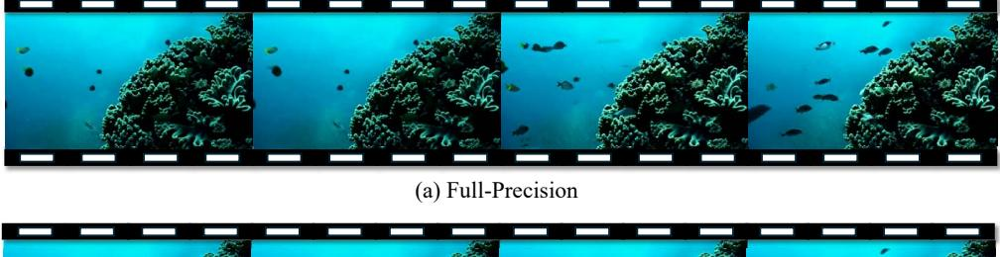


<span id="page-18-2"></span>(b) SAGE Attention

Figure 11: A video generation example of Open-Sora.

Table 19: Comparison of real speedup on RTX3090.

| Model       | Shape of Q, K, V   | Original Attention | SAGEAttention | Speedup |
|-------------|--------------------|--------------------|---------------|---------|
| CogvideoX   | (2, 30, 17776, 64) | 71.57 (FlashAttn2) | 129.87        | 1.81x   |
| Llama2      | (4, 32, 1536, 128) | 56.54 (FlashAttn2) | 108.91        | 1.93x   |
| UltraPixel  | (2, 32, 7285, 64)  | 65.86 (FlashAttn2) | 131.74        | 2.00x   |
| Unidiffuser | (4, 24, 1105, 64)  | 47.64 (xformers)   | 108.91        | 2.29x   |
| TIMM        | (12, 64, 197, 64)  | 12.33 (Torch)      | 66.34         | 5.38x   |

Unidiffuser. It shows that quantizing Q, K to INT8 performs higher precision than using E4M3 and E5M2.

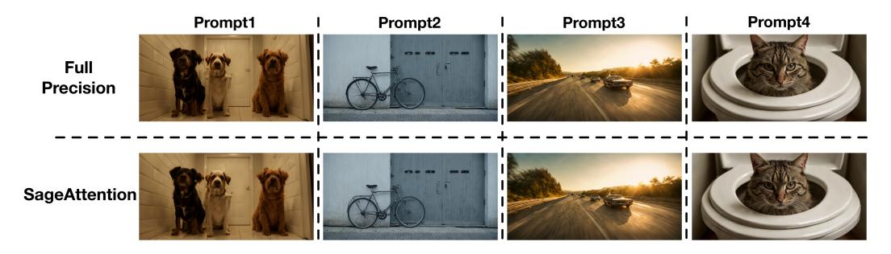

Figure 12: More image generation examples of UltraPixel, where prompt1="Two dogs are looking up while they stand near the toilet in the bathroom", prompt2="A gray bicycle is locked to some metal doors", prompt3="An image of a car driving on the highway", and prompt4="A cat on the lid of a toilet looking perturbed".

<span id="page-19-0"></span>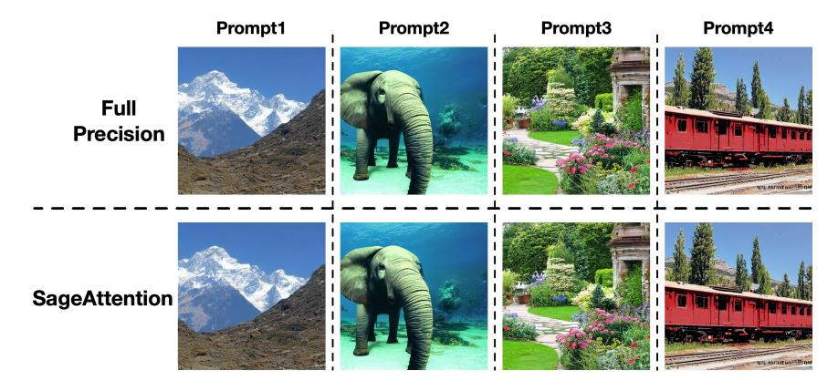

<span id="page-19-1"></span>Figure 13: More image generation examples of Unidiffuser, where prompt1="Beautiful view of the Himalayas", prompt2="An elephant under the sea", prompt3="English Country Garden Design", and prompt4="An old red electric rail train in Durango, Colorado".

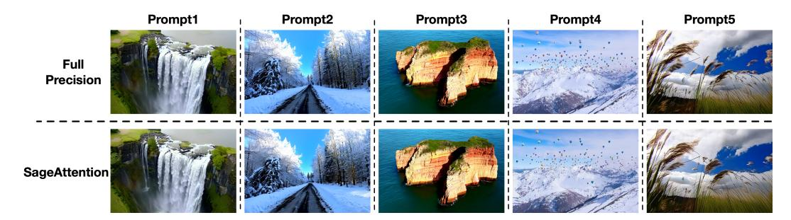

<span id="page-19-2"></span>Figure 14: More image generation examples of CogvideoX. For more details about the prompts and the full videos, refer to [https://anonymous.4open.science/r/image\\_video\\_](https://anonymous.4open.science/r/image_video_examples-3E44/README.md) [examples-3E44/README.md](https://anonymous.4open.science/r/image_video_examples-3E44/README.md).

Table [18](#page-18-0) shows the precision of different quantization methods with and without *smoothing K* on various models. The results demonstrate that *smoothing K* offers significant benefits of precision.

#### B.2 VISUALIZED RESULTS

Figure [10](#page-18-1) shows the high-resolution images (2560x1536) generated by UltraPixel using Attention of full precision and SageAttention. It can be seen that SageAttention matches the full precision in the high quality and highly detailed images. Figure [11](#page-18-2) shows the videos (720x1280) generated by Open-Sora [\(Zheng et al., 2024c\)](#page-15-0) in different precisions. SageAttention yields identically the same video as the full precision one.

Figure [12,](#page-19-0) Figure [13,](#page-19-1) and Figure [14](#page-19-2) show more visualized comparison results on UltraPixel, Unidiffuser, and CogvideoX.

### B.3 REAL SPEEDUP ON RTX3090

We further measure the real speed of SageAttention and the original Attention on Unidiffuser, UltraPixel, CogvideoX, Llama2 and TIMM on RTX3090. Table [7](#page-8-2) shows that SageAttention outperforms original attention across all models. Specifically, SageAttention yields 2.7× speedup compared to the original Attentions on average.