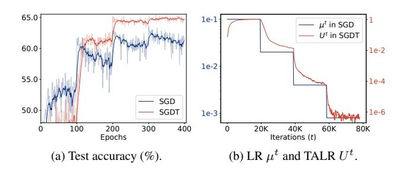
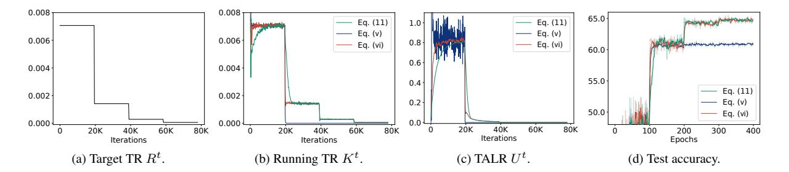

# S2.1. Analysis on TR scheduling

We show in Fig. [S3](#page-13-1) an in-depth analysis on how a TR scheduler works during QAT. We can see from Fig. [S3a](#page-13-1) that the running TR Kt roughly follows the target TR Rt , indicating that we can control the average effective step size of quantized weights (the red curve in Fig. 1c of the main paper) by scheduling the target TR. This is possible because the TALR U t is adjusted adaptively to match the running TR Kt with the target one Rt (Fig. [S3b\)](#page-13-1). We can see that the TALR U t increases initially, since the running TR Kt is much smaller than the target TR Rt . The TALR U t then decreases gradually to reduce the number of transitions, following the target TR Rt . Note that the TALR U t approaches zero rapidly near the 50K-th iteration. To figure out the reason, we show in Figs. [S3c](#page-13-1) and [S3d](#page-13-1) distributions of normalized latent weights and their average distances to the nearest transition points, respectively. We can observe in Fig. [S3c](#page-13-1) that latent weights tend to be concentrated near the transition points of a quantizer as the training progresses, similar to the case in Sec. 4.1 in the main paper using a user-defined LR. This implies that transitions occur more frequently in later training iterations if we do not properly reduce the degree of parameter change for latent weights. In particular, we can see in Fig. [S3d](#page-13-1) the average distances between the normalized latent weights and the nearest transition points are relatively small after the 50K-th iteration. Under such circumstance, the TALR should become much smaller in order to reduce the running TR, as in the sharp decline around the 50K-th iteration. We can thus conclude that our approach adjusts the TALR by considering the distribution of the latent weights implicitly.

Figure S3. Analysis on TR scheduling. We train ResNet-20 [12] on CIFAR-100 [25] using SGDT, where we quantize both weights and activations with 2-bit representations. We visualize distributions of normalized latent weights in the 16th layer in (c), and average distances between normalized latent weights and the nearest transition points in (d). The transition points in (c) are denoted by TPs in the x-axis. The top-1 test accuracy and average effective step sizes of quantized weights are shown by the red curves in Figs. 1d and 1c of the main paper, respectively. (Best viewed in color.)

Table S3. Quantitative comparison of optimization methods for QAT using a step decay scheduler on CIFAR-100/10 [25]. Both LRs and target TRs for SGD and SGDT are divided by 5 after every 50 and 100 epochs for ReActNet-18 [32] and ResNet-20 [12], respectively. Numbers in parentheses indicate accuracy drops compared to the models in Table 2 of the main paper trained with a cosine scheduler.

|           |                             | CIFAR-100                   |             | CIFAR-10                     |                             |                      |  |  |
|-----------|-----------------------------|-----------------------------|-------------|------------------------------|-----------------------------|----------------------|--|--|
| Optimizer | ReActNet-18 (W32A1: 69.6)   |                             |             | ReActNet-18 (W32A1: 91.3) |                             | Net-20 91.1)      |  |  |
|           | 1/1                         | 1/1                         | 2/2         | 1/1                          | 1/1                         | 2/2                  |  |  |
| SGD       | 69.0 (-0.7)                 | 45.8 (-9.1)                 | 61.3 (-2.8) | 90.9 (-0.0)                  | 82.9 (-2.3)                 | 89.8 (-0.4)          |  |  |
| SGDT      | <b>71.9</b> (- <b>0.3</b> ) | <b>55.3</b> ( <b>-0.5</b> ) | 64.9 (-0.6) | 93.0 (-0.0)                  | <b>85.2</b> ( <b>-0.4</b> ) | 90.3 (-0.4)          |  |  |
| Adam      | 68.1 (-1.4)                 | 49.9 (-4.9)                 | 60.9 (-2.4) | 82.5 (-7.9)                  | 82.4 (-2.4)                 | 89.6 ( <b>-0.6</b> ) |  |  |
| AdamT     | 71.7(-0.1)                  | 54.4 (-1.5)                 | 64.6 (-0.6) | 92.9(-0.0)                   | 85.3 (-0.4)                 | <b>90.3</b> (-0.8)   |  |  |

#### S2.2. Comparison using a step decay scheduler

We provide in Table S3 a quantitative comparison between plain optimization methods (SGD and Adam [23]) and ours (SGDT and AdamT) using a step scheduler. We use the same training setting in Table 2 of the main paper, while replacing a cosine scheduler [33] with the step scheduler. Both LRs and target TRs are divided by 5 after every 50 and 100 epochs for ReActNet-18 [32] and ResNet-20 [12], respectively. We can see from this table that the plain optimizers using the step scheduler suffer from significant accuracy drops, compared to the cases for the the cosine scheduler. The main reason is that it is difficult to control the average effective step size of quantized weights using a user-defined LR, especially when the LR is decayed by the step scheduler. On the other hand, the optimizers using our TR scheduling technique are relatively robust to the step scheduler, showing less performance drops than the plain ones for most cases. We can also observe that the performance degrades more severely for the models using the ResNet-20 [12] architecture, where the number of parameters is much less than that of the ReActNet-18 [32] architecture (276K for ResNet-20 vs. 11,235K for ReActNet-

Figure S4. Comparison between SGD and SGDT using a step scheduler. We train ResNet-20 [12] with 2-bit weights and activations on CIFAR-100 [25]. Both the LR for SGD and target TR for SGDT are divided by 5 after every 100 epochs. For comparison, we show in (b) the LR  $\mu^t$  in SGD and TALR  $U^t$  in SGDT, where both are used for updating latent weights in Eqs. (4) and (12) of the main paper. (Best viewed in color.)

18). This indicates that training a small quantized model with the step scheduler is more challenging, possibly because the scheduler can cause large parameter changes even at the end of the training.

To further analyze the difference between the LR and

Table S4. Quantitative comparison of different TR factors λ (*i.e*., initial target TRs). We quantize ResNet-20 [\[12\]](#page-8-0) using SGDT with 2-bit weights/activations, and report a top-1 test accuracy on CIFAR-100 [\[25\]](#page-8-15).

| TR factor λ                                                     |  |  |  |  | 1e-3 2e-3 3e-3 4e-3 5e-3 6e-3 7e-3 8e-3 9e-3 1e-2 |  |
|-----------------------------------------------------------------|--|--|--|--|---------------------------------------------------|--|
| Test accuracy 62.5 64.2 64.3 65.3 65.5 65.1 63.1 63.6 63.6 64.0 |  |  |  |  |                                                   |  |

TR scheduling techniques with the step scheduler, we compare in Fig. [S4](#page-13-3) the LR in SGD and TALR in SGDT during training, with corresponding test accuracies. We can observe from Fig. [S4a](#page-13-3) that SGDT provides better results in terms of both convergence rate and accuracy. As discussed in Sec. 4.1 of the main paper, latent weights approach transition points progressively during QAT, and thus it is difficult to adjust the number of transitions explicitly using a user-defined LR. This could be particularly problematic when the LR is fixed for a number of iterations. Recent QAT methods [\[10,](#page-8-4) [22,](#page-8-10) [26,](#page-8-11) [32,](#page-9-2) [46\]](#page-9-4) circumvent this issue by decaying a LR to zero gradually, *e.g*., using the cosine annealing technique [\[33\]](#page-9-13), but this does not fully address the problem. On the other hand, our method is relatively robust to the use of the step scheduler. Since we optimize latent weights using a TALR, we can control the degree of parameter changes for quantized weights by scheduling the target TR in our method. In contrast to the LR, the TALR decreases gradually even when the scheduler does not alter the target TR (Fig. [S4b\)](#page-13-3), confirming once more the fact that the TALR is adjusted adaptively considering the distribution of latent weights. This result demonstrates the robustness and generalization ability of our approach on various types of schedulers.

## S2.3. Analysis on initial target TRs

To better understand how an initial target TR influences the quantization performance, we present in Table [S4](#page-14-1) a quantitative comparison of different TR factors λ adjusting the initial TRs. We train ResNet-20 [\[12\]](#page-8-0) models on CIFAR-100 [\[25\]](#page-8-15) using 2-bit weights and activations with SGDT and report top-1 test accuracies. We can observe that the TR factors within a wide range of intervals (*i.e*., [4e-3, 6e-3]) provide satisfactory performance, outperforming the LR-based optimization strategy (*i.e*., SGD in Table 2 of the main paper) by significant margins (1.0∼1.4). Similar to the LR, extremely large or small TR factors degrade the quantization performance, which could make the training unstable. Therefore, setting an appropriate value for the TR factor is crucial in the TR scheduling technique, analogous to determining an initial LR to train full-precision models.

Table S5. Quantitative comparison for plain optimization methods and our TR scheduling technique with various optimizers. We report a top-1 test accuracy on CIFAR-100 [\[25\]](#page-8-15) using ResNet-20 [\[12\]](#page-8-0) with 2-bit weights/activations.

|       |      |      |      |      |      | SGD Adam NAdam Adamax AdamW RMSProp Adagrad |      |
|-------|------|------|------|------|------|---------------------------------------------|------|
| Plain | 64.1 | 63.3 | 63.3 | 62.4 | 63.8 | 64.6                                        | 54.2 |
| Ours  | 65.5 | 65.2 | 65.1 | 64.7 | 66.2 | 65.1                                        | 61.1 |

Table S6. Quantitative comparison of quantized models trained with SGDT using different final target TRs. We report mean and standard deviation of top-1 test accuracies on CIFAR-100 [\[25\]](#page-8-15) over five random runs, obtained with ResNet-20 [\[12\]](#page-8-0) using 2-bit weights and activations.

| Final target TR                             | 0                | 1e-5             | 1e-4             | 1e-3             |
|---------------------------------------------|------------------|------------------|------------------|------------------|
| Final target average effective step size | 0                | 5e-6             | 5e-5             | 5e-4             |
| Test accuracy                               | 65.61 (±0.21) | 65.34 (±0.26) | 64.63 (±0.59) | 62.12 (±0.70) |

Table S7. Training time comparison on ImageNet with 4 A5000 GPUs, in terms of GPU hours. We quantize ResNet-18 except for AdamW/-T, where we quantize DeiT-T.

|       | SGD | Adam | AdamW |
|-------|-----|------|-------|
| Plain | 174 | 175  | 477   |
| Ours  | 176 | 178  | 492   |

## S2.4. Comparison with different optimizers

To verify the generalization ability of our TR scheduling technique to other optimizers, we compare in Table [S5](#page-14-2) the quantization performance between plain optimization methods and ours with various optimizers, including SGD, Adam [\[23\]](#page-8-12), NAdam [\[8\]](#page-8-26), Adamax [\[23\]](#page-8-12), AdamW [\[34\]](#page-9-11), RM-SProp [\[43\]](#page-9-17), and Adagrad [\[9\]](#page-8-19). Specifically, we train ResNet-20 on CIFAR-100 [\[25\]](#page-8-15) with 2-bit weights and activations for comparison. For the optimizers other than SGD, we exploit the same hyperparameters as the ones for Adam in Table 2 of the main paper, while we change the weight decay to 1e-2 for AdamW. Note that AdamW decouples the weight decay from a parameter update step, suggesting that it requires a different hyperparameter for the weight decay. For RMSProp, we use the momentum gradient with a momentum value of 0.9, which is analogous to SGD. From the table, we can clearly see that the TR scheduling technique improves the quantization performance consistently across all optimizers. Our method achieves 0.5%∼6.9% gains over the plain optimization methods, which demonstrates the effectiveness of our method and its generalization ability to various optimizers. In particular, AdamW coupled with our TR scheduling technique shows the best performance, indicating that we could further improve the quantization

Figure S5. Comparison of different update schemes for a TALR. We train ResNet-20 [12] on CIFAR-100 [25] with 2-bit weights and activations, while adjusting the TALR based on different methods in Eqs. (11), (S1) and (S2). (Best viewed in color.)

performance by carefully selecting an optimizer and corresponding hyperparameters.

## **S2.5.** Training time comparison

We compare in Table S7 training time of optimization methods. Our method takes training time, similar to plain optimization methods, demonstrating its efficiency. The marginal overheads of ours is due to the computation of the TR and the adjustment of the TALR, both of which involve lightweight operations such as element-wise comparisons and scalar updates, which are computationally inexpensive compared to the overall training process.

#### S3. Discussion

