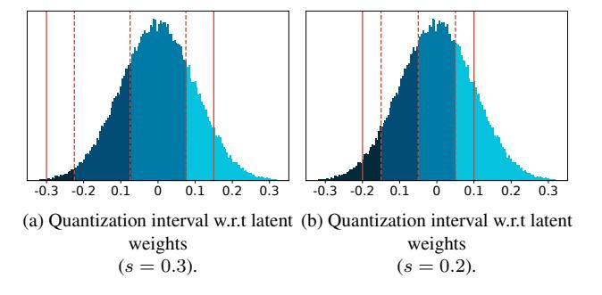

# S5. Detailed Description of a Quantizer

In this section, we explain the quantization process for a single quantizer. For simplicity, we consider a 2-bit weight quantizer based on Eq. (13) of the main paper, and use latent weights randomly drawn from the zero-mean Gaussian distribution with a standard deviation of 0.1. In the following,

|  |  | experiments. |
|--|--|--------------|
|  |  |              |

| Dataset      | Architecture                    | Optimizer | Epoch       | Batch size | LR   | Weight decay | Decay scheduler | TR factor $\lambda$ | TR momentum |
|--------------|---------------------------------|-----------|-------------|---------------|------|-----------------|--------------------|---------------------|-------------|
| CIFAR-10/100 | ResNet-20 (ReActNet-18)      | SGD       | 400 (200)   | 256           | 1e-1 | 1e-4            | cosine             | -                   | -           |
|              |                                 | SGDT      |             |               |      |                 |                    | 5e-3                | 0.99        |
|              |                                 | Adam      |             |               | 1 2  |                 |                    | _                   | -           |
|              |                                 | AdamT     |             |               | 1e-3 |                 |                    | 5e-3                | 0.99        |
| ImageNet     | ResNet-18                       | SGD       | - 120       | 256           | 1e-2 | 1e-4            | cosine             | -                   | -           |
|              |                                 | SGDT      |             |               |      |                 |                    | 1e-3                | 0.99        |
|              |                                 | Adam      |             |               | 1e-4 |                 |                    | -                   | -           |
|              |                                 | AdamT     |             |               |      |                 |                    | 1e-3                | 0.99        |
|              | ReActNet-18                     | SGD       | 120         | 256           | 1e-1 | 0               | linear             | -                   | -           |
|              |                                 | SGDT      |             |               |      |                 |                    | 5e-4                | 0.99        |
|              |                                 | Adam      |             |               | 1e-3 |                 |                    | -                   | -           |
|              |                                 | AdamT     |             |               |      |                 |                    | 5e-4                | 0.99        |
|              | MobileNetV2                     | SGD       | 120         | 256           | 1e-2 | 2.5e-5          | cosine             | -                   | -           |
|              |                                 | SGDT      |             |               |      |                 |                    | 1e-3                | 0.99        |
|              |                                 | Adam      |             |               | 1e-4 |                 |                    | -                   | -           |
|              |                                 | AdamT     |             |               |      |                 |                    | 1e-3                | 0.99        |
|              | DeiT-T/S                        | AdamW     | 300         | 256           | 3e-4 | 5e-2            | cosine             | -                   | -           |
|              |                                 | AdamWT    |             |               |      |                 |                    | 1e-3                | 0.99        |
| MS COCO      | RetinaNet w/ ResNet backbone | SGD       | 90K (iter.) | 16            | 1e-2 | 1e-4            | cosine             | -                   | -           |
|              |                                 | SGDT      |             |               |      |                 |                    | 1e-3                | 0.99        |

Figure S6. Visualization of the quantization process for a 2-bit weight quantizer. Solid vertical lines in (a) indicate clipping points w.r.t latent weights, which adjust a quantization interval. Dashed vertical lines in (a) and (b) represent transition points of the quantizer and a discretization function (i.e., a round function) w.r.t the latent weights and normalized ones, respectively. The weights with the same color belong to the same discrete level of the quantizer. We denote by  $\delta^t$  in (d) the distance between adjacent discrete levels of the quantizer at the t-th iteration step. (Best viewed in color.)

Figure S7. Comparison between quantization intervals for the same latent weights using different scale parameters. Solid and dashed vertical lines represent clipping and transition points of quantizers, respectively. The weights with the same color belong to the same discrete level of the quantizer. (Best viewed in color.)

we describe a detailed procedure of quantization according to the steps described in Eqs. (1)-(3) of the main paper. We visualize in Fig. S6 an overall quantization process for the quantizer. First, the latent weights  $\mathbf{w}$  (Fig. S6a) are normalized and clipped by a normalization function, producing normalized latent weights  $\mathbf{w}_n$  (Fig. S6b):

$$\mathbf{w}_n = \operatorname{clip}\left(\frac{\gamma \mathbf{w}}{s}, \alpha, \beta\right),\tag{S4}$$

where we set  $\alpha=-2$ ,  $\beta=1$ , and  $\gamma=2$  for 2-bit weight quantization. s is a learnable scale parameter adjusting a quantization interval. In Fig. S6, we set s=0.3 for the purpose of visualization. Second, the normalized latent weights  $\mathbf{w}_n$  are converted to discrete ones  $\mathbf{w}_d$  (Fig. S6c) using a round function:

$$\mathbf{w}_d = \lceil \mathbf{w}_n \rceil \,. \tag{S5}$$

Lastly, the discrete weights  $\mathbf{w}_d$  are fed into a denormalization function that applies post-scaling and outputs quantized weights  $\mathbf{w}_q$  (Fig. S6d):

$$\mathbf{w}_q = \frac{1}{\gamma} \mathbf{w}_d. \tag{S6}$$

Note that the post-scaling in Eq. (S6) is fixed, dividing the discrete weights with a constant value  $\gamma$  of 2. In this case, the distance between the adjacent discrete levels of the quantizer (i.e.,  $\delta^t$  in Fig. S6d) is fixed for all training iterations, i.e.,  $\delta^t = 0.5$  for all t.

#### **S5.1.** Counting transitions

In Eq. (5) in the main paper, we count the number of transitions by observing whether discrete weights, i.e., integer numbers resulting from a round or a signum function (e.g.,  $\mathbf{w}_d$  in Eq. (S5)), are changed or not after a single parameter update. As an example, suppose a case that a quantized weight at the t-th iteration step  $w_q^t$  belongs to the first level of the quantizer, e.g.,  $w_q^t = -2\delta^t$  in Fig. S6d, where corresponding discrete weight  $w_d^t$  in Fig. S6c is -2. If the quantized weight transits from the first to the second level of the quantizer after a parameter update (i.e.,  $w_a^{t+1} = -\delta^{t+1}$ ), we can detect the transition using the discrete weight, since it is changed from -2 to -1. Similarly, if the quantized weight remains in the same level after a parameter update (i.e.,  $w_q^{t+1}=-2\delta^{t+1}$ ), we can say that the transition does not occur, because the discrete weight retains the same value. Note that we could use quantized weights  $\mathbf{w}_q$  instead of discrete weights  $\mathbf{w}_d$  for counting the number of transitions in Eq. (5) in the main paper, only when  $\delta^t$  is fixed for all training iterations (e.g., as in our quantizer in Eq. (13) of the main paper). Otherwise this could be problematic. For example, even if a quantized weight does not transit the discrete level after a parameter update, e.g.,  $w_q^t = -2\delta^t$  and  $w_q^{t+1} = -2\delta^{t+1}$ , the quantized weight can be changed if  $\delta^t$  and  $\delta^{t+1}$  are not the same. This indicates that we cannot detect a transition with the condition of  $\mathbb{I}\left[w_q^{t+1} \neq w_q^t\right]$ , since the statement  $(w_q^{t+1} \neq w_q^t)$  could be always true, regardless of whether a transition occurs or not, if  $\delta^{t+1} \neq \delta^t$  for all training iterations. Consequently, we count the number of transitions using discrete weights in Eq. (5) in the main paper, which is valid for general quantizers.

#### S5.2. Quantization interval

Following the recent state-of-the-art quantization methods [10, 21, 26], we introduce in Eq. (13) of the main paper (or in Eq. (S4)) a learnable scale parameter s. Given that  $\alpha$ ,  $\beta$  and  $\gamma$  in Eq. (13) of the main paper are bit-specific constants, the scale parameter s is the only factor that controls a quantization interval (*i.e.*, a clipping range) w.r.t quantizer inputs. We can see from Fig. S6a that the scale parameter (s=0.3) is responsible for the positions of clipping

points w.r.t latent weights (solid vertical lines in Fig. S6a). It also decides transition points accordingly (dashed vertical lines in Figs. S6a), since the points are set by splitting the clipping range uniformly. This suggests that different scale parameters would give different sets of transition points. To verify this, we compare in Fig. S7 the quantization intervals using different scale parameters s for the same latent weights. We can see that the quantization interval shrinks if a smaller scale parameter (s = 0.2) is used, and the transition points are altered consequently. This again suggests that transitions could occur if the scale parameter s is changed during training, even when the latent weights are not updated. For example, a latent weight of -0.2 in Fig. S7a belongs to the second level of the quantizer, whereas that in Fig. S7b belongs to the first level. Within our TR scheduling technique, we attempt to control the number of transitions by updating latent weights with a TALR, but the transitions could also be affected by the scale parameter. For this reason, we do not train the scale parameters in weight quantizers, when the TR scheduling technique is adopted, fixing the transition points of the quantizers and controlling the transitions solely with the latent weights.