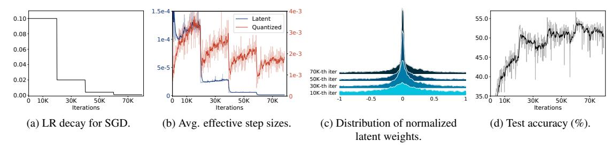

# 3. Preliminary

QAT inserts weight and/or activation quantizers into each layer of a neural network to simulate a quantization process at training time. Here we briefly describe a quantizer and an optimizer in QAT.

Quantizer. Weight and activation quantizers take fullprecision latent weights and activations in a layer, respectively, and produce low-bit representations. Here we mainly

Figure 2. Empirical analysis on QAT using SGD with a step LR decay. We binarize both weights and activations of ResNet-20 [12] and train the model on CIFAR-100 [25]. For the visualizations in (b) and (c), we track the latent and quantized weights in the 16th layer. We can see that the average effective step size of latent weights (the blue curve in (b)) is controlled by the LR in (a), while that for the quantized weights changes significantly even with a small LR (the red curve in (b)). This is because the change of quantized weights is also affected by the distribution of latent weights approaching the transition point (*i.e.*, zero in (c)). The large changes in the quantized weights at the end of training (the red curve in (b)) degrade the performance in (d). (Best viewed in color.)

explain the weight quantizer. The activation quantizer is similarly defined. Let us denote by w full-precision latent weights. The quantizer first normalizes and clips the latent weights to adjust their range:

$$\mathbf{w}_n = f(\mathbf{w}),\tag{1}$$

where we denote by  $\mathbf{w}_n$  normalized weights. f is a normalization function involving scaling and clipping operations, which can be either hand-designed [49] or be trainable [5, 10, 21]. The normalized weights  $\mathbf{w}_n$  are then converted to discrete ones  $\mathbf{w}_d$  using a discretization function g:

$$\mathbf{w}_d = g(\mathbf{w}_n). \tag{2}$$

The discretization function g is typically a signum or a round function for binary or multi-bit quantization schemes, respectively. Note that STE [2] is usually adopted in a backward pass to avoid a vanishing gradient problem, caused by the discretization function, propagating the same gradient from  $\mathbf{w}_d$  to  $\mathbf{w}_n$ . Lastly, the quantizer produces quantized weights  $\mathbf{w}_q$  by de-normalizing the discrete weights  $\mathbf{w}_d$ :

$$\mathbf{w}_q = h(\mathbf{w}_d),\tag{3}$$

where h is a de-normalization function for post-scaling. The de-normalization could possibly be omitted (or fixed) when the quantized layer is followed by a normalization layer (e.g., batch normalization [20]), since it imposes the scale invariance to the weights and activations [14, 15], suggesting that de-normalization has no effect on either the forward or backward pass.

**Optimizer.** In QAT, the latent weights  $\mathbf{w}$  are updated, instead of optimizing the quantized weights  $\mathbf{w}_q$  directly. That is, updating the latent weights in turn alters the quantized ones during training. More specifically, the quantized weights change their discrete levels if corresponding normalized latent weights  $\mathbf{w}_n$  pass transition points of the discretization function g (e.g., zero for the signum function) after updating the latent weights  $\mathbf{w}$ . Previous works typically use gradient-based optimizers with a user-defined LR to update the latent weights as follows:

$$\mathbf{w}^{t+1} = \mathbf{w}^t - \mu^t \mathbf{g}^t, \tag{4}$$

where the superscript t indicates an iteration step, and we denote by  ${\bf g}$  and  $\mu$  a gradient term and the LR, respectively. Note that the gradient term  ${\bf g}$  is computed differently depending on the types of optimizers. For example, SGD uses the first moment of gradients.

#### 4. Method

In this section, we first present a detailed analysis of a conventional optimization method using a manually scheduled LR in the context of QAT (Sec. 4.1). We then introduce a novel TR scheduling technique (Sec. 4.2).

#### 4.1. Empirical analysis

Conventional optimizers use a LR decay technique when training a full-precision model. They update model parameters gradually in a coarse-to-fine manner, which encourages a model to find a better local optimum in a loss space, and prevents overshooting from a local optimum [18, 24]. This suggests that the optimizers control an average effective step size (*i.e.*, the degree of parameter changes) of full-precision weights by adjusting the LR. We have empirically found that this does not hold for QAT. Namely, the average effective step size of quantized weights in QAT is hardly controlled by a conventional LR scheduling technique in gradient-based optimizers.

To understand this problem in detail, we show an empirical analysis on 1) how a gradient-based optimizer, coupled with a manually scheduled LR, changes latent and quantized weights within a framework of QAT, and 2) the influence of the changes on the classification accuracy of a quantized model (Fig. 2). We train ResNet-20 [12] with binary weights and activations on CIFAR-100 [25] using a SGD optimizer with a step LR decay method. We can see from Fig. 2a and the blue curve in Fig. 2b that the average effective step size of latent weights is controlled by a LR, which is consistent with the result in a full-precision model (e.g., Fig. 1a vs. Fig. 1b). The reason is that the latent weights in

QAT and the weights in a full-precision model are continuous values, and the LR is responsible directly for updating the weights, *e.g.*, as in Eq. (4). On the contrary, quantized weights alter significantly, even with a small LR (the red curve in Fig. 2b). Since QAT uses quantized weights in a forward propagation step to compute gradients w.r.t an objective function, the large changes of quantized weights at the end of training make a training process unstable, disturbing a quantized model to converge (Fig. 2d).

To delve deeper into this problem, let us suppose that a quantized weight needs to alter its discrete level (e.g., from a negative value to a positive one in the binary quantization) in order to minimize a training loss. A corresponding latent weight then keeps accumulating gradients to move towards a transition point, and once a transition occurs, the latent weight might stay near the transition point. We can observe in Fig. 2c that the normalized latent weights (i.e.,  $\mathbf{w}_n$  in Eq. (1)) are approaching the transition point (i.e., zero in this case) progressively according to the number of iterations. The quantized weight is hence likely to oscillate between adjacent discrete levels with small LRs in later training iterations (see the high peak at the 70K-th iteration in Fig. 2c). This coincides with the recent finding in [35, 36] that the quantized weights tend to oscillate during QAT, making it difficult to stabilize the batch normalization statistics [20], and degrading the performance at test time. This analysis indicates that 1) the average effective step size of quantized weights is largely affected by the distribution of latent weights, and 2) the reason why the LR is not a major factor for controlling the average effective step size in QAT, contrary to an optimization process of a full-precision model, is that the quantized weight alters only when the latent weight passes a transition point of a quantizer, but the LR cannot adjust the number of transitions explicitly. Consequently, our empirical analysis suggests the necessity of a training scheduler specific to QAT that allows to update latent weights adaptively considering the transitions in quantized weights.

#### 4.2. TR scheduler

Here we present a relationship between an effective step size and transitions in quantized weights, and describe our approach to TR scheduling in a single layer.

**TR** of quantized weights. We say that a transition occurs if a latent weight passes a transition point of a quantizer after a single update. The number of transitions is hence equal to that of quantized weights changing discrete levels after the update. We can count the number of transitions by observing whether discrete weights (*i.e.*,  $\mathbf{w}_d$  in Eq. (2)) are changed or not after the update. Here we focus on a TR, the number of transitions divided by the total number

of quantized weights, defined as follows:

$$k^{t} = \frac{\sum_{i=1}^{N} \mathbb{I}\left[w_d^{t}(i) \neq w_d^{t-1}(i)\right]}{N},$$
 (5)

where we denote by  $k^t$  and  $w_d^t(i)$  the TR and the i-th element of discrete weights at the t-th iteration step, respectively, and N is the total number of quantized weights.  $\mathbb{I}[\cdot]$  is an indicator function that outputs one if a given statement is true and zero otherwise.

#### Relation between an effective step size and a transition.

An effective step size [23] indicates the magnitude of a single parameter change. We can compute the effective step size of a quantized weight  $w_q$  by measuring its absolute difference before and after a single update as follows:

$$\left| \triangle w_a^t \right| = \left| w_a^t - w_a^{t-1} \right|,\tag{6}$$

where we denote by  $|\triangle w_q^t|$  an effective step size of the quantized weight at the t-th iteration step. We will show that the effective step size is related to a transition of the quantized weight. Let us denote by  $\delta^t$  a post-scaling factor of the de-normalization function h in Eq. (3) at the t-th iteration step. If the discretization function g in Eq. (2) is a rounding function for multi-bit quantization (i.e. a discrete weight  $w_d^t$  is an integer value), we can rewrite Eq. (6) as follows:

$$\left| \triangle w_d^t \right| = \left| \delta^t w_d^t - \delta^{t-1} w_d^{t-1} \right|. \tag{7}$$

If g is a signum function (i.e.,  $w_d^t \in \{-1, 1\}$ ) for binary quantization, Eq. (6) can be represented as follows:

$$\left| \triangle w_q^t \right| = \frac{1}{2} \left| \delta^t w_d^t - \delta^{t-1} w_d^{t-1} \right|. \tag{8}$$

Note that the change of  $\delta^t$  in a single update is typically small (i.e.,  $\delta^t \approx \delta^{t-1}$ ) or we can set the post-scaling factor  $\delta^t$  as a constant value if the quantized layer is followed by a normalization layer [14, 15] (e.g., as in [26]). Assuming that the change of  $\delta^t$  is negligible within a single update and a latent weight passes a single transition point when a transition occurs, we can approximate the effective step size of the quantized weight as follows:

$$\left| \triangle w_a^t \right| \approx \delta^t \mathbb{I} \left[ w_d^t \neq w_d^{t-1} \right].$$
 (9)

That is, the effective step size of the quantized weight is at most  $\delta^t$  if a transition occurs, and zero otherwise. This indicates that individual effective step sizes of quantized weights are discrete values (*i.e.*, zero or  $\delta^t$ ) determined by the quantizer. Note that the effective step size for each full-precision weight can be adjusted by a LR, since the weight is a continuous value, which is however not applicable for the quantized weight changing discretely. Accordingly, adjusting the number of transitions, or equivalently a TR, is

important to control an average effective step size of quantized weights. Based upon this, we design a TR scheduling technique adjusting a TR of quantized weights explicitly, allowing us to control the degree of parameter changes in the quantized weights accordingly.

TR scheduler. We incorporate our TR scheduling technique into an optimization process by introducing a transition-adaptive learning rate (TALR) to update latent weights, allowing to adjust a TR of quantized weights manually, w.r.t a target TR. To this end, we mainly apply three operations at every iteration: Estimating a running TR using a momentum estimator, adjusting a TALR w.r.t a target value, and updating latent weights. Specifically, we first compute a running TR of quantized weights for each iteration t using an exponential moving average with a momentum of m:

$$K^{t} = mK^{t-1} + (1-m)k^{t}, (10)$$

where we denote by Kt a running TR. Motivated by the running statistics in *e.g*., batch normalization [\[20\]](#page-8-21), we use the momentum estimator to obtain the running TR, which roughly averages the TRs over recent training iterations, instead of using the TR, k t in Eq. [\(5\)](#page-4-2), directly. This allows us to use a stable statistic of the TR, and alleviates the influence from outliers. We then adjust a TALR based on the running TR Kt and a target one:

$$U^{t} = \max(0, U^{t-1} + \eta(R^{t} - K^{t})), \qquad (11)$$

where we denote by U t and Rt the TALR and the target TR at the iteration step t, and η is a hyperparameter controlling the extent of the TALR update. Note that we can schedule the target TR Rt using typical schedulers (*e.g*., step decay), which is analogous to the LR scheduling technique. With the TALR U t at hand, we update the latent weights wt as follows:

$$\mathbf{w}^{t+1} = \mathbf{w}^t - U^t \mathbf{g}^t, \tag{12}$$

where g t is a gradient term computed depending on the type of an optimizer (*e.g*., the first moment of gradients in SGD). Updating the latent weights wt with the TALR U t enables controlling the running TR of quantized weights Kt w.r.t the target TR Rt . For example, if a current running TR Kt is smaller than the target one Rt , the TALR U t increases according to Eq. [\(11\)](#page-5-0). The latent weights in Eq. [\(12\)](#page-5-1) are then updated largely, compared to the previous iteration. This encourages more latent weights to pass transition points of a quantizer, which in turn raises the TR in the next step. Similarly, in the opposite case, the TALR decreases to reduce the TR. Note that one can adjust the TALR in a different way from Eq. [\(11\)](#page-5-0) while achieving the same effect, and we discuss the variants of update algorithms for TALR in the Sec. S3.2 of the supplement. Our approach connects the latent and quantized weights, in contrast to conventional optimization methods, making it possible to control an average effective step size of quantized weights via scheduling a target TR.

## 4.3. Quantization scheme

We apply the TR scheduler to QAT with various bit-width settings, including binary and multi-bit representations. In the following, we describe quantization schemes used in our experiments.

Multi-bit quantization. We modify LSQ [\[10\]](#page-8-4), the stateof-the-art method for multi-bit uniform quantization[1](#page-5-2) . We define our b-bit quantizer as follows:

$$\mathbf{x}_q = \frac{1}{\gamma} \left[ \text{clip}\left(\frac{\gamma \mathbf{x}}{s}, \alpha, \beta\right) \right],$$
 (13)

where xq is an output of the quantizer. We denote by x an input to the quantizer, which can be either latent weights or input activations. clip(·, α, β) is a clipping function with lower and upper bounds of α and β, respectively, and ⌈·⌋ is a round function. Following LSQ, we employ a learnable scale parameter s for each quantizer, adjusting the range of quantization interval[2](#page-5-3) . We set the bitspecific constants (α, β, γ) as −2 b−1 , 2 b−1 − 1, 2 b−1 and 0, 2 b − 1, 2 b for weight and activation quantizers, respectively. We do not perform a post-scaling with the learnable scale parameter s after the round function in contrast to LSQ. That is, we fix the output range of a quantizer, enforcing the output of the quantizer xq to be fixed-point numbers, regardless of the range of an input x, which is more suitable for hardware implementation. Note that the scale difference between the input and output of a quantizer does not matter if each convolutional/fully-connected layer is followed by a normalization layer (*e.g*., batch normalization [\[20\]](#page-8-21)), imposing the scale invariance after every quantized layer [\[14,](#page-8-22) [15\]](#page-8-23). This ensures that post-scaling does not affect either the forward or backward pass. When the normalization is not used, we optionally apply a learnable post-scaling technique to outputs of convolutional/fullyconnected layers [\[26\]](#page-8-11).

Binary quantization. We apply two binarization methods. First, we use the network architecture of ReAct-Net [\[32\]](#page-9-2) and its quantization scheme, which is the state of the art on binary quantization. ReActNet modifies the ResNet [\[12\]](#page-8-0) or MobileNet-V1 [\[16\]](#page-8-24) architectures by adopting the Bi-Real structure [\[31\]](#page-9-21) that adds more residual connections, while exploiting real-valued 1 × 1 convolutions in

1Using the same network architecture (*i.e*., a vanilla version of ResNet), our modifications provide similar or better baseline results on ImageNet [\[7\]](#page-8-16), compared to the performance of LSQ, reproduced in [\[3\]](#page-8-25).

2We train scale parameters in activation quantizers only, and do not train them in weight quantizers, when the TR scheduling technique is adopted. Otherwise, transitions could occur, even when the latent weights are not updated. For a fair comparison, we use learnable scale parameters for weight quantizers, when using plain optimizers without TR scheduling. See the Sec. S5.2 of the supplement for details.

Table 1. Quantitative comparison of quantized models on ImageNet [7] in terms of a top-1 validation accuracy. We train quantized models with plain optimization methods (SGD and Adam [23]) or ours using a TR scheduler (SGDT and AdamT). The bit-widths of weights (W) and activations (A) are represented in the form of W/A. For comparison, we report the performance of full-precision (FP) and activation-only binarized (W32A1) models. The results of ReActNet-18 [32] for the plain optimizers are reproduced with an official source code.

| Optimizer | MobileNetV2 (FP: 71.9) |      |      | ReActNet-18 (W32A1: 66.8) |      |      |      |      |
|-----------|---------------------------|------|------|------------------------------|------|------|------|------|
| •         | 2/2                       | 3/3  | 4/4  | 1/1                          | 1/1  | 2/2  | 3/3  | 4/4  |
| SGD       | 46.9                      | 65.6 | 69.9 | 65.0                         | 55.3 | 66.8 | 69.5 | 70.5 |
| SGDT      | 53.6                      | 67.0 | 70.5 | 65.3                         | 55.8 | 66.9 | 69.7 | 70.6 |
| Adam      | 49.6                      | 66.5 | 70.0 | 65.3                         | 56.1 | 66.7 | 69.5 | 70.1 |
| AdamT     | 53.8                      | 67.3 | 70.8 | 65.7                         | 56.3 | 67.2 | 69.7 | 70.4 |

Table 2. Quantitative comparison of quantized models on CIFAR-100/10 [25] in terms of a top-1 test accuracy.

|           | CIFAR                        | -100 |                 | CIFAR-10                     |                         |      |  |
|-----------|------------------------------|------|-----------------|------------------------------|-------------------------|------|--|
| Optimizer | ReActNet-18 (W32A1: 69.6) |      | let-20 65.1) | ReActNet-18 (W32A1: 91.3) | ResNet-20 (FP: 91.1) |      |  |
|           | 1/1                          | 1/1  | 2/2             | 1/1                          | 1/1                     | 2/2  |  |
| SGD       | 69.7                         | 54.9 | 64.1            | 90.9                         | 85.2                    | 90.2 |  |
| SGDT      | 72.2                         | 55.8 | 65.5            | 93.0                         | 85.6                    | 90.7 |  |
| Adam      | 69.5                         | 54.8 | 63.3            | 90.4                         | 84.8                    | 90.2 |  |
| AdamT     | 71.8                         | 55.9 | 65.2            | 92.9                         | 85.7                    | 91.1 |  |

Table 3. Quantitative comparison of quantized models on ImageNet [7] in terms of a top-1 validation accuracy. We train quantized models with plain optimization method (AdamW [34]) or ours using a TR scheduler (AdamWT).

| Optimizer |      | T-T 72.0) | DeiT-S (FP: 79.9) |      |  |
|-----------|------|--------------|----------------------|------|--|
|           | 2/2  | 3/3          | 2/2                  | 3/3  |  |
| AdamW     | 54.6 | 68.1         | 68.4                 | 77.6 |  |
| AdamWT    | 57.4 | 69.5         | 71.8                 | 78.5 |  |

the residual connections. This approach also uses learnable shift operations before quantization and activation functions. Second, we binarize vanilla ResNet models to compare binary and multi-bit quantization schemes under a fair training setting. To this end, we design a binary quantizer using Eq. (13). For a weight quantizer, we set  $\alpha$ ,  $\beta$ , and  $\gamma$ , to -1, 1, and 1, respectively, and replace the round operator with a signum function to obtain a binary value of -1 or 1. For an activation quantizer, we set those values as 0, 1, and 1, respectively, to generate a binary activation of 0 or 1.

## 5. Experiments

We describe our experimental settings (Sec. 5.1) and show results on image classification and object detection (Sec. 5.2). We then analyze the TR scheduling technique (Sec. 5.3). More detailed analyses and discussions are provided in the supplement.

Table 4. Quantitative results on object detection. We train RetinaNet [30] on the training split of MS COCO [29] using either the plain optimization method (SGD) or ours (SGDT). We report the average precision (AP) on the validation split.

| Backbone  | W/A | Optimizer   | AP                    | $AP_{50}$             | $AP_{75}$             | $AP_S$             | $AP_M$                | $AP_L$                |
|-----------|-----|-------------|-----------------------|-----------------------|-----------------------|--------------------|-----------------------|-----------------------|
|           | FP  | SGD         | 37.80                 | 57.62                 | 40.50                 | 23.12              | 41.39                 | 49.70                 |
| ResNet-50 | 4/4 | SGD SGDT |                       |                       | 40.23 <b>40.76</b> |                    |                       |                       |
| -         | 3/3 | SGD SGDT | 37.32 <b>37.59</b> | 56.87 <b>56.89</b> |                       | <b>21.90</b> 21.51 | 40.82 <b>40.98</b> | 48.97 <b>49.07</b> |

#### 5.1. Experimental settings

For image classification, we train quantized models for MobileNetV2 [38], ResNet families [12], ReActNet-18 [32], and DeiT-T/S [44] on CIFAR-10/100 [25] and/or ImageNet [7]. We train them using a cross-entropy loss, except for ReActNet-18 on ImageNet, where we use a distributional loss [32] following the work of [32]. For object detection, we adopt RetinaNet [30] with ResNet backbones on MS COCO [29]. Unlike the previous QAT methods [46, 50], we use a shared prediction head to handle features of different resolutions, analogous to the original RetinaNet [30]. For ease of activation quantization, we add a ReLU layer after each convolutional layer in the prediction head, so that all inputs of activation quantizers are nonnegative. For more details, please refer to the Sec. S4.1 of the supplement.

While our method requires additional computations (*i.e.*, element-wise comparison in Eq. (5) and scalar operations in Eqs. (10)-(11)), they are computationally cheap compared to the whole training process. The training time increases by only 2% compared to the plain optimization methods with the same machine (Sec. S2.5 of the supplement).

#### 5.2. Results

**Image classification.** We provide in Tables 1-3 quantitative comparisons of quantized models trained with optimizers using plain optimization methods and our approach. We report a top-1 classification accuracy on ImageNet [7] and CIFAR-100/10 [25] using the MobileNetV2 [38], ReActNet-18 [32], ResNet-18/20 [12], and DeiT-T/S [44] architectures. From these tables, we observe three things: (1) Our method provides substantial accuracy gains over the plain optimizers, regardless of the datasets, network architectures, and quantization bit-widths. This indicates that scheduling a target TR is a better choice for the optimization process in QAT compared to the conventional strategy scheduling a LR. (2) The performance gaps on ImageNet using light-weight MobileNetV2 (0.6~6.7%) are more significant than the ones using ReActNet-18 or ResNet-18 (0.1 $\sim$ 0.5%). Moreover, the performance gaps become larger for smaller bit-widths of MobileNetV2. These results suggest that the TR scheduling technique is especially useful for compressing networks aggressively, such as quantiz-

Figure 3. Analysis on TR scheduling. We train ResNet-20 [\[12\]](#page-8-0) on CIFAR-100 [\[25\]](#page-8-15) using SGDT, where we quantize both weights and activations with 2-bit representations. We visualize distributions of normalized latent weights in the 16th layer in [\(c\),](#page-7-1) and average distances between normalized latent weights and the nearest transition points in [\(d\).](#page-7-1) The transition points in [\(c\)](#page-7-1) are denoted by TPs in the x-axis. The top-1 test accuracy and average effective step sizes of quantized weights are shown by the red curves in Figs. [1d](#page-1-0) and [1c,](#page-1-0) respectively.

ing a light-weight model or extremely low-bit quantization. (3) Considering the results for ReActNet-18 and the ResNet families, our approach outperforms the conventional optimization methods by significant margins (0.4∼2.5%) on the small dataset (*i.e*., CIFAR-100/10). On the large-scale dataset (*i.e*., ImageNet), it also shows superior results, achieving 0.1∼0.5% accuracy gains. The overall performance gaps decrease on ImageNet, possibly because the plain optimizers with a gradually decaying LR (*e.g*., cosine annealing LR [\[33\]](#page-9-13)) benefit from lots of training iterations on ImageNet (roughly 600K). They, however, do not show satisfactory results within a small number of iterations on CIFAR-100/10 (roughly 80K), compared to ours.

Object detection. We compare in Table [4](#page-6-4) the quantization performance of detection models in terms of an average precision (AP) on the validation split of MS COCO [\[29\]](#page-9-12). We train RetinaNet [\[30\]](#page-9-8) with the ResNet-50 [\[12\]](#page-8-0) backbone using either SGD or SGDT on the training split of MS COCO. We can observe in Table [4](#page-6-4) that the TR scheduling technique boosts the AP consistently over the SGD baselines across different bit-widths, similar to the results on image classification. This suggests that the TR scheduling technique is also useful for the object detection task involving both regression and classification, demonstrating once more the effectiveness of our method and its generalization ability to various tasks. Additional quantitative results on object detection with different backbone networks (*e.g*., ResNet-18/34) and qualitative results are provided in the Sec. S1.2 of the supplement.

## 5.3. Analysis

We show in Fig. [3](#page-7-1) an in-depth analysis on how a TR scheduler works during QAT. We can see from Fig. [3a](#page-7-1) that the running TR Kt roughly follows the target TR Rt , indicating that we can control the average effective step size of quantized weights (the red curve in Fig. [1c\)](#page-1-0) by scheduling the target TR. This is possible because the TALR U t is adjusted adaptively to match the running TR Kt with the target one Rt (Fig. [3b\)](#page-7-1). We can see that the TALR U t increases initially, since the running TR Kt is much smaller than the target TR Rt . The TALR U t then decreases gradually to reduce the number of transitions, following the target TR Rt . Note that the TALR U t approaches zero rapidly near the 50K-th iteration. To figure out the reason, we show in Figs. [3c](#page-7-1) and [3d](#page-7-1) distributions of normalized latent weights and their average distances to the nearest transition points, respectively. We can observe in Fig. [3c](#page-7-1) that latent weights tend to be concentrated near the transition points of a quantizer as the training progresses, similar to the case in Sec. [4.1](#page-3-1) using a user-defined LR. This implies that transitions occur more frequently in later training iterations if we do not properly reduce the degree of parameter change for latent weights. In particular, we can see in Fig. [3d](#page-7-1) the average distances between the normalized latent weights and the nearest transition points are relatively small after the 50Kth iteration. Under such circumstance, the TALR should become much smaller in order to reduce the running TR, as in the sharp decline around the 50K-th iteration. We can thus conclude that our approach adjusts the TALR by considering the distribution of the latent weights implicitly.

