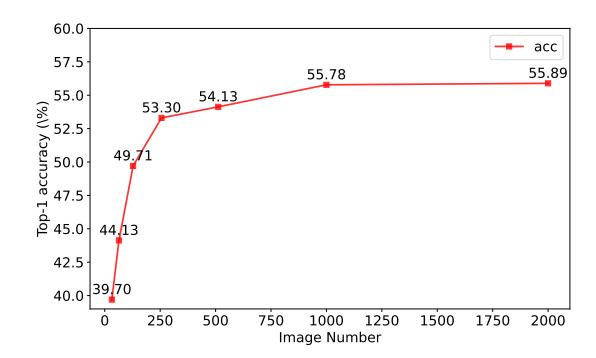

# **Appendix**

## A. Ablation Studies

Figure 5. The accuracy vs. image number on 3-bit DeiT.

Effect of image number Fig 5 reports the ablation study of different image numbers. As can be observed, when using 32 images, the top-1 accuracy is 39.70%. As the number increases, the performance is improved. For 512 images, the performance is 54.13%. When it comes to 1024 images, which also is the setting in our main paper, the top-1 accuracy is 55.78%. Afterward, continually using more images does not bring a significant performance boost as it presents only 55.89% for 2048 images.