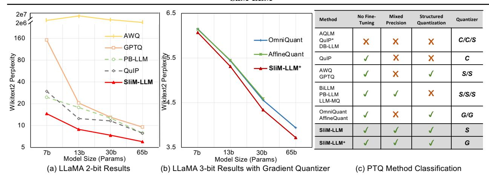
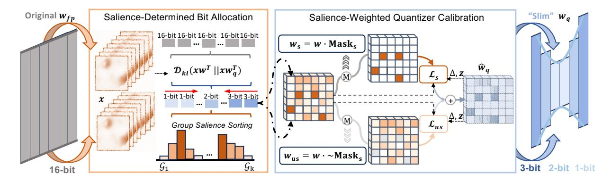
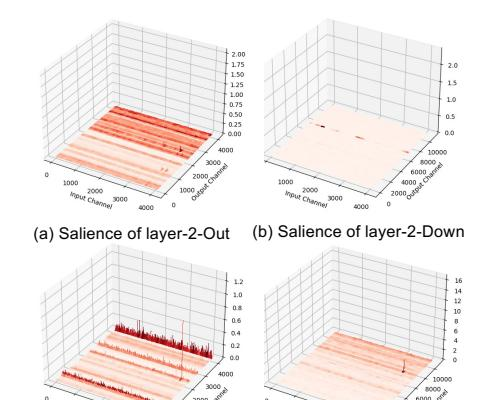
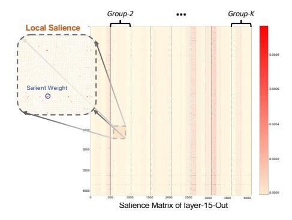
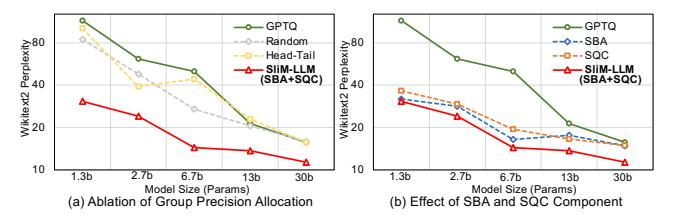

# 1. Introduction

LLMs have demonstrated remarkable performance on various natural language benchmarks [\(Brown et al.,](#page-8-0) [2020;](#page-8-0) [Hendrycks et al.,](#page-9-0) [2020\)](#page-9-0). Models like LLaMA [\(Touvron](#page-10-0) [et al.,](#page-10-0) [2023a\)](#page-10-0) and GPT [\(Brown et al.,](#page-8-0) [2020\)](#page-8-0) have driven progress toward universal language intelligence. Their capabilities have also extended to multi-modal domains [\(Li](#page-9-1) [et al.,](#page-9-1) [2024b;](#page-9-1) [Achiam et al.,](#page-8-1) [2023;](#page-8-1) [Team et al.,](#page-10-1) [2023;](#page-10-1) [Zhang](#page-10-2) [et al.,](#page-10-2) [2023;](#page-10-2) [Huang et al.,](#page-9-2) [2024b\)](#page-9-2), advancing efforts toward artificial general intelligence (AGI) [\(Bubeck et al.,](#page-8-2) [2023\)](#page-8-2). However, their high computational and memory demands remain a significant challenge for practical deployment.

To address resource constraints of LLMs, PTQ has emerged as an efficient yet effective compression technique [\(Dettmers et al.,](#page-8-3) [2022\)](#page-8-3), showing success in quantizing the weights of pre-trained LLMs [\(Frantar et al.,](#page-8-4) [2022;](#page-8-4) [Lin](#page-9-3) [et al.,](#page-9-3) [2023;](#page-9-3) [Shao et al.,](#page-10-3) [2023;](#page-10-3) [Lee et al.,](#page-9-4) [2023;](#page-9-4) [Chee et al.,](#page-8-5) [2024\)](#page-8-5). As LLMs continue to scale, the demand for more aggressive low-bit compression becomes critical due to limited computational and storage resources in application [\(Huang](#page-9-5) [et al.,](#page-9-5) [2024a;](#page-9-5) [Tseng et al.,](#page-10-4) [2024\)](#page-10-4). However, significant performance degradation remains a challenge in low-bit scenarios (⩽ 3-bit). To mitigate this, unstructured mixedprecision quantization [\(Shang et al.,](#page-10-5) [2023;](#page-10-5) [Huang et al.,](#page-9-5) [2024a;](#page-9-5) [Dettmers et al.,](#page-8-6) [2023\)](#page-8-6) and vector quantization [\(Chee](#page-8-5) [et al.,](#page-8-5) [2024;](#page-8-5) [Tseng et al.,](#page-10-4) [2024;](#page-10-4) [Egiazarian et al.,](#page-8-7) [2024\)](#page-8-7) methods have been developed to preserve performance. While these approaches have advanced the field, they are often hardware-unfriendly, introducing extra storage requirements such as storing bitmaps or code indices. This creates a bottleneck, limiting further reductions in memory and computational demands during deployments.

This paper presents a Salience-Driven Mixed-Group LLM (SliM-LLM) framework, an accurate and inference-efficient PTQ method for LLMs (⩽ 3-bit). Our approach is grounded in the key observation that *salient or important weights, which are critical to model performance, exhibit a structured distribution, often clustering within certain channels* (see Sec. [3.2.1](#page-3-0) and Fig. [3\)](#page-3-1). This insight, largely overlooked by prior research [\(Frantar et al.,](#page-8-4) [2022\)](#page-8-4), forms the basis for designing SliM-LLM as a structured, hardware-friendly

1The University of Hong Kong 2ETH Zürich 3Beihang University. Correspondence to: Haotong Qin, Shiming Zhang, Xiaojuan Qi <haotong.qin@pbl.ee.ethz.ch, beszahng@hku.hk, xjqi@eee.hku.hk>.

Figure 1. (a) The perplexity  $(\downarrow)$  of existing low-bit PTQ methods of LLaMA at 2-bit. Solid-line indicates methods with structured quantization group. (b) Compare PTQ methods with gradient quantizer at 3-bit. (c) Features of current low-bit quantization methods. C denotes codebook-based, S is statistic-based, and G represents gradient-based quantizers.

mixed-precision low-bit method. It preserves performance through two key designs that retain important weights at both the global group and local element levels. First, we develop a novel Salience-Determined Bit Allocation (SBA) method, which adaptively assigns bit-widths to each quantization group based on their group-level salience ranking. The allocation strategy is optimized to reduce activation reconstruction errors. By applying higher precision to more important groups and reducing the bit-widths for less critical ones, SBA achieves a low average bit-widths while enhancing the overall performance of LLMs. Next, we introduce the Salience-Weighted Quantizer Calibration (SQC), which enhances sensitivity to locally salient weights, ensuring that critical information within groups is preserved. SQC works collaboratively with SBA, exploiting the local and global salience of weights to preserve the performance of LLMs after quantization. Unlike element-wise mixed-precision methods (Shang et al., 2023; Dettmers et al., 2023; Huang et al., 2024a), SliM-LLM is inherently structured, eliminating additional bit or computational overhead while preserving high performance. This is further demonstrated through our deployment of SliM-LLM in an application-level inference tool 1 for LLMs, enabling efficient mixed-precision inference on GPUs with consistently strong performance.

Experiments show that for various LLM families, SliM-LLM surpasses existing training-free PTQ methods on diverse benchmarks, particularly in low-bit scenarios. Using GPTQ as the backbone, SliM-LLM improves the perplexity scores of 2-bit LLaMA-13B and LLaMA2-13B on Wiki-Text2 (Merity et al., 2016) from 20.44 and 28.14 to 8.87 and 9.41, denoting performance improvements of over 56%, respectively. SliM-LLM even outperforms other element-wise mixed-precision PTQ methods, such as PB-LLM (Shang et al., 2023), APTQ (Guan et al., 2024) and LLM-MQ (Li et al., 2024a), in a deployment-friendly manner, showcasing

its superior low-bit accuracy and efficiency. We also integrate SliM-LLM into OmniQuant (Shao et al., 2023) and obtain SliM-LLM+ through gradient optimization to further improve quantization quality. Moreover, the group-wise mixed-precision strategy can smoothly be adapted to existing quantization-aware training (QAT) (Liu et al., 2023), fine-tuning based (Guo et al., 2023; Liao & Monz, 2024; Dettmers et al., 2024), or codebook-based (Chee et al., 2024; Egiazarian et al., 2024; Tseng et al., 2024) LLMs compression methodologies. This structure of weight salience introduces a new practical view of compression for LLMs.

#### 2. Related Work

Large Language Models have been significantly developed in diverse natural language processing domains, establishing a prominent paradigm in these fields (Bubeck et al., 2023; Chang et al., 2024; Zhao et al., 2023; Brown et al., 2020; Touvron et al., 2023a). Nevertheless, the exceptional success of LLMs depends on massive parameters and computations, posing significant challenges for deployment in resource-constrained environments. Consequently, research into the compression of LLMs has emerged as a promising field. Existing compression techniques for LLMs primarily include quantization, pruning and distillation (Xu et al., 2023; Ganesh et al., 2021; Frantar et al., 2022; Xiao et al., 2023a; Shao et al., 2023; Chee et al., 2024; Zhu et al., 2023; Frantar & Alistarh, 2023; Huang et al., 2024a; Qin et al., 2024). Low-bit quantization has received notable attention for efficiently reducing the size of the model without changing the structure of the network(Zhu et al., 2023; Zhao et al., 2023; Chang et al., 2024).

Quantization of LLMs can generally be categorized into Quantization-Aware Training (QAT) and PTQ. PTQ has emerged as a more practical alternative. Techniques such as LLM.int8()(Liu et al., 2023) and ZeroQuant(Yao et al.,

1 https://github.com/AutoGPTQ/AutoGPTQ

Figure 2. Illustration of our proposed SliM-LLM. The Salience-Determined Bit Allocation (SBA) optimizes activation-aware structured precision, optimizing the global information distribution in quantization. Salience-Weighted Quantizer Calibration (SQC) detects discretely distributed salient weights, enhancing the local important information in LLMs.

2022) introduce block-wise quantization, a cost-effective grouping method that reduces hardware overhead. Further advancements, including AWQ (Lin et al., 2023) and OWQ (Lee et al., 2023), apply scaling transformations to outlier weight channels, preserving their representational capacity. GPTQ (Frantar et al., 2022) minimizes group quantization errors using Hessian-based error compensation (Frantar & Alistarh, 2022), achieving notable performance at 3-bit quantization. OmniQuant (Shao et al., 2023) introduces a learnable scaling quantizer to mitigate quantization errors in an output-aware manner. For ultra-low bitwidths quantization, approaches such as QuIP (Chee et al., 2024), OuIP#(Tseng et al., 2024), and AOLM(Egiazarian et al., 2024) improve 2-bit quantization performance through matrix decomposition with learnable codebooks and finetuning. Recent works (Qin et al., 2024; Liao & Monz, 2024; Dettmers et al., 2024; Guo et al., 2023) have further refined quantization techniques by leveraging parameterefficient fine-tuning (PEFT), enabling enhanced performance through additional parameter learning.

Mixed-Precision Quantization leverages the varying importance and redundancy of model parameters by assigning different bit-widths to each component. In traditional visual networks, HAWQ V2 (Dong et al., 2020) and HAWQ V3 (Yao et al., 2021) optimize bit-widths allocation on a layer-wise basis using Hessian analysis and Integer Linear Programming (ILP). Similarly, OMPQ (Ma et al., 2023) employs network orthogonality instead of Hessian for bitwidths optimization. For large language models (LLMs), APTQ (Guan et al., 2024) extends HAWQ's approach by allocating mixed bit-widths to transformer blocks based on Hessian trace, achieving improved accuracy for 3-bit quantization. However, block-wise or layer-wise mixedprecision strategies at 2-bit fail to maintain performance after compression. To address this, recent methods such as SpQR (Dettmers et al., 2023), PB-LLM (Shang et al., 2023), and LLM-MQ (Li et al., 2023) adopt finer-grained

grouping with element-wise mixed-precision for more accurate weight quantization. Despite their improvements, these low-bit approaches rely heavily on fine-grained partitioning, which imposes significant challenges for real hardware deployment and inference speed.

## 3. SliM-LLM

This section introduces a structured mixed-precision quantization method, SliM-LLM, to overcome the accuracy and efficiency bottlenecks of mixed-precision LLMs. We devise two novel strategies, including the use of *Salience-Determined Bit Allocation* (SBA) based on global salience distribution to determine group bit-widths, and *Salience-Weighted Quantizer Calibration* (SQC) to enhance the perception of locally important weight information. We introduce SBA and SQC in Sec. 3.2 and Sec. 3.3, respectively.

#### 3.1. Preliminaries

**Quantization Framework.** We first present the general uniform quantization process of LLMs according to common practice (Liu et al., 2023; Shao et al., 2023; Achiam et al., 2023). The quantization process requires mapping floatpoint weights distributed within the interval  $[w_{\min}, w_{\max}]$  to an integer range of  $2^N$ , where N is the target bit-widths. The quantization function for weight  $\boldsymbol{w}_f \in \mathbb{R}^{n \times m}$  follows:

$$\begin{cases} \hat{\boldsymbol{w}}_{q} = \operatorname{clamp}(\lfloor \frac{\boldsymbol{w}_{f}}{s} \rceil + z, 0, 2^{N} - 1), \\ s = \frac{w_{\max} - w_{\min}}{2^{N} - 1}, z = -\lfloor \frac{w_{\min}}{s} \rceil \end{cases}$$
(1)

where  $\hat{\boldsymbol{w}}_q$  indicates quantized weight which is integer,  $\lfloor \cdot \rfloor$  is round operation and clamp(·) constrains the value within integer range (e.g. [0,1,2,3], N=2).  $\Delta$  is scale factor and z is quantization zero point, respectively. When converted

to 1-bit quantization, the calculation follows:

$$\hat{\boldsymbol{w}}_b = \operatorname{sign}(\boldsymbol{w}_f), \alpha = \frac{1}{l} ||\boldsymbol{w}_f||_{\ell 1}$$

$$\operatorname{sign}(w) = \begin{cases} 1 & \text{if } w \ge 0, \\ -1 & \text{others.} \end{cases}$$
(2)

where  $\hat{w}_b$  is binary result.  $\alpha$  denots binarization scales and l is the number of elements in weight (Qin et al., 2023), used for dequantization through  $\alpha \hat{w}_b$ . We can formalize the perlayer loss in PTQ, following the common practice (Nagel et al., 2020; Frantar et al., 2022):

$$\mathcal{L}(\hat{\boldsymbol{w}}_f) = ||\boldsymbol{x}\boldsymbol{w}_f^{\top} - \boldsymbol{x}\hat{\boldsymbol{w}}_f^{\top}||^2 \approx \operatorname{tr}((\hat{\boldsymbol{w}}_f - \boldsymbol{w})\boldsymbol{H}(\hat{\boldsymbol{w}}_f - \boldsymbol{w})^{\top})$$
(3)

where  $\boldsymbol{x} \in \mathbb{R}^{t \times m}$  denotes the input vectors from calibration dataset,  $\hat{\boldsymbol{w}}_f \in \mathbb{R}^{n \times m}$  is dequantized weight from quantization result in Eq. (1) or Eq. (2), and  $\boldsymbol{H} = \frac{1}{P} \sum_{k=1}^{P} \boldsymbol{x}^{[k]^{\top}} \boldsymbol{x}^{[k]}$  is proxy Hessian matrix by Levenberg-Marquardt approximation (Marquardt, 1963; Frantar & Alistarh, 2022) from a set of input activations.

Parameter Salience. In LLMs, the importance of each element in the weight matrix is various (Dettmers et al., 2023; Frantar & Alistarh, 2023). According to Eq. (3), quantizing different elements causes different impacts on the model's output loss. Elements that significantly influence the loss are termed salient weights. Consequently, we follow the SparseGPT (Frantar & Alistarh, 2023) to define the salience of each element as:

**Definition 3.1.** In the quadratic approximation of the loss as expressed in Eq. (3), we give the Hessian matrix  $H \in \mathbb{R}^{m \times m}$  generated by  $\frac{1}{P} \sum_{k=1}^{P} \boldsymbol{x}^{[k]^{\top}} \boldsymbol{x}^{[k]}$  for a weight matrix, the removal of the element at (i,j) induces an error  $\delta_{i,j} = \frac{w_{i,j}^2}{[H^{-1}]_{j,j}^2}$  to the output matrix for linear projection in LLMs.

where  $[\boldsymbol{H}^{-1}]_{jj}$  denotes the  $j^{th}$  diagonal entry for the inverse Hessian, and  $\boldsymbol{H}^{-1}$  can be efficiently calculated through Cholesky decomposition (Krishnamoorthy & Menon, 2013). According to Definition. 3.1, we map the elimination error  $\delta_{ij}$  to the salience measure of each weight element in LLMs, representing the impact of different weights on the output loss and the language capabilities, which also leads the generation of mixed-precision quantization strategies (Dettmers et al., 2023; Shang et al., 2023; Huang et al., 2024a; Li et al., 2024a) for LLMs. However, existing mixed-precision solutions require the discrete allocation of bit-widths across the entire weight matrix, which imposes a significant burden on hardware computations, thereby affecting the inference efficiency.

#### 3.2. Salience-Determined Bit Allocation

We reveal the spatial clustering of weight salience, which inspires our proposed concept of group-wise mixed-precision quantization for LLMs, and then introduce the *Salience*-

(c) Salience of layer-10-Out (d) Salience of layer-10-Down

Figure 3. Salience weight distribution in layer-2 and layer-10 of LLaMA-7B.

Determined Bit Allocation (SBA) technique to allocate the optimal precision to each group.

#### 3.2.1. SPATIAL DISTRIBUTION OF GLOBAL SALIENCE

We first conduct an empirical investigation into the weight salience distribution. The results reveal that certain channels exhibit higher salience and show tendencies to spatial clustering. As illustrated in Fig. 3, salient clustering is identified around the  $2100^{th}$ ,  $3218^{th}$  and  $3853^{rd}$  channels within the  $2^{nd}$  layer's attention projection of the LLaMA-7B model. A similar structured pattern is observed in other layers. Also, clustered salience is detected in other layers (as shown in Fig. 3). More examples are provided in Appendix G.

Then, we analyze the underlying reasons for this phenomenon. According to Definition 3.1, the salience of weights is proportional to the magnitude of the weights and the trace of the Hessian matrix, which can be approximated by the product of input activations  $x^{T}x$ . In LLMs, activations exhibit extreme outlier channels, while the numerical differences in weights are relatively slight (Xiao et al., 2023a; Nrusimha et al., 2024). Therefore, we propose an analysis of how the outlier channels in activations influence the distribution of weight salience:

Theorem 1. Given the input calibration activation  $\boldsymbol{x} \in \mathbb{R}^{t \times m}$  with an outlier channel  $\boldsymbol{x}_{:,p}^* \gg \boldsymbol{x}_{:,j}, \forall j \in [0,m], j \neq p$  at the position of channel-p. The trace elements of  $\boldsymbol{H} = \boldsymbol{x}^{\top} \boldsymbol{x}$  will show great outlier value at (p,p), where  $\boldsymbol{H}_{p,p} \gg \boldsymbol{H}_{j,j}, \forall j \in [0,m], j \neq p$ , as  $\boldsymbol{H}_{p,p}$  is produced by  $[\boldsymbol{x}_{:,p}^{*\top} \boldsymbol{x}_{:,p}^*] = \sum_{i=0}^t x_{i,p}^{*2}$ , which further leads to the parameter salience larger at the  $p^{th}$  channel of weight, where  $\delta_{:,p} > \delta_{:,k}, \delta_{:,k} = \frac{w_{:,k}^2}{[\boldsymbol{H}^{-1}]_{k,k}^2}, \forall k \in [0,t], k \neq p$ .

Theorem 1 elucidates the influence of outlier activation on the distribution of channel salient weights (detailed proof in the Appendix G.1). Furthermore, recent research indicates that outlier channels in LLMs activations consistently appear in fixed yet clustered patterns (Nrusimha et al., 2024). According to Theorem 1, these consistently occurring anomalous activations result in the distribution of salient weights, as depicted in Fig. 3. Then, during group-wise quantization, the average salience of each group shows different features.

Meanwhile, previous unstructured mixed-precision, incurred additional storage requirements and computational overheads, affecting the real-time inference. However, the strong spatial structured characteristics observed in the salient of weights in this section strongly inspire us to first develop a group-wise mixed-precision strategy within the weight matrix while maintaining inference efficiency. Therefore, we aim to allocate bit-widths based on intra-group salient disparities, which not only enhances quantization accuracy but also ensures the inference efficiency of LLMs with structured bit-widths saving and dequantization.

#### 3.2.2. GROUP-WISE BIT ALLOCATION

To allocate optimal bit-widths to each group, we introduce a *Salience-Determined Bit Allocation* (SBA) technique for mixed-precision LLMs, as depicted in Fig. 2. This technique, predicated on the differences in group salience, determines the optimal bit-widths allocation for different groups by minimizing the distance of information entropy with the original weight output. Specifically, we first utilize the average salience as the importance indicator for each weight group and rank them accordingly. Then, the proposed SBA optimizes the bit allocation following:

Objective : 
$$\operatorname{argmin} \mathcal{D}_{kl} (\boldsymbol{x} \boldsymbol{w}_f^\top \mid\mid \boldsymbol{x}(\hat{\boldsymbol{w}}_{sba})^\top),$$
  
where  $\hat{\boldsymbol{w}}_{sba} = [\hat{\boldsymbol{w}}_{0,b_0}, \hat{\boldsymbol{w}}_{1,b_1}...\hat{\boldsymbol{w}}_{k-1,b_{k-1}}, \hat{\boldsymbol{w}}_{k,b_k}]$   
Constrain : $|\mathcal{G}_{N-1}| = |\mathcal{G}_{N+1}|,$   
where  $\mathcal{G}_{N-1} = \{b_i | b_i = N-1\},$   
 $\mathcal{G}_{N+1} = \{b_j | b_j = N+1\}$ 
(4)

where  $\mathcal{D}_{kl}(\cdot||\cdot)$  denotes the Kullback-Leibler (KL) divergence between two outputs,  $\hat{w}_f^{sba}$  generally represents the de-quantization results of weight, employing group-wise mixed-precision designated as  $[\hat{w}_{0,b_0},\hat{w}_{1,b_1}...\hat{w}_{k-1,b_{k-1}},\hat{w}_{k,b_k}]$ , where  $b_i$  represents the bit-widths for the  $i^{th}$  group and  $\mathcal{G}$  is a set of groups with the same bit-width, N is the targeted average bit-width. We apply a compensation constraints strategy to maintain a consistent average bits for our SBA. For example, in 2-bit quantization, the more salient groups are quantized to 3-bit. To offset the additional bits, we quantize an equal number of groups with the lower salience to 1-bit  $(|\mathcal{G}_{N-1}| = |\mathcal{G}_{N+1}|)$ , while the remaining groups are set to 2-bit.

We utilize an effective double-pointer search (more detailed examples in Appendix  $\mathbb{C}$ ) to optimize our objective in Eq. (4). When the weight output channel size is m and group

Figure 4. Local salience distribution of the  $10^{th}$  MHA output layer.

size is 128,  $k = \frac{m}{128}$ , the search region for weight is limited to  $[0, \frac{k}{2}]$ , which is highly efficient with limited searching space, e.g., only 16 iterations are needed in LLaMA-7B. We also provide detailed searching error examples in Appendix C. Notably, SBA diverges from traditional quantization with mean squared error (MSE) in Eq. (3) by instead utilizing the KL divergence as its measure of loss. Compared to using mean squared error (MSE) for weights, SBA utilizes the KL divergence of block outputs as a precision allocation metric, aiming to align the distribution of the LLM's output activation matrix with that of the quantized activation. This approach improves the model's information representation under low-bit quantization, enabling more effective bit-widths allocation. While HAWQ v2 (Dong et al., 2019) employs Integer Linear Programming (ILP) to allocate bit-widths for layers, its method can be adapted to group-wise targets. Detailed comparisons between SBA and ILP are provided in Section 4.2.

## 3.3. Salience-Weighted Quantizer Calibration

In addition to the global group-wise distribution of salience, we notice that salience within the group still shows local differences in discrete distribution. Common existing quantizers apply uniform consideration across all weights to minimize the effect (error) of quantization, lacking the capability to perceive differences in local salience. Therefore, in this section, we introduce a *Salience-Weighted Quantizer Calibration* (SQC) to enhance the information of significant weights within the group by amplifying the quantizer awareness of salient weight.

#### 3.3.1. DISCRETE DISTRIBUTION OF LOCAL SALIENCE

In the aforementioned section, we group-wisely allocate the bit-widths for each group based on the global salience. To maintain the efficiency of quantized inference, we employ a commonly used sequential structured grouping (Frantar et al., 2022; Lin et al., 2023; Shao et al., 2023). However, this group-wise mixed-precision also leads to differences in salience among the various elements within the same group. Specifically, as the salience distribution in Fig. 4, within

the  $10^{th}$  attention output layer of LLaMA-7B, a subset of sparse weights within the comparatively less salient Group-2 (Fig. 4) still maintains a high level of importance. In LLMs, a small number of weight elements with outliers affect the local distribution of salience. These discrete weights typically account for only approximately 1% within the group but play a crucial role in the modeling capability of LLMs.

Vanilla quantizers struggle to represent local salient information as they only consider the mean error of all elements within a group. During group-wise quantization (Eq. 1), non-salient weights often dominate, degrading critical information and negatively impacting LLM performance.

#### 3.3.2. SALIENCE-WEIGHTED QUANTIZER

To prevent the degradation of local salient information in each group, we propose the *Salience-Weighted Quantizer Calibration* (SQC), which enhances the expression of salient weights through local salience awareness, thereby reducing the quantization error of these significant elements and improving the compressed performance of LLMs.

Based on a common observation (Dettmers et al., 2023; Huang et al., 2024a), the proportion of relatively salient weights in each group is only 1-5%. Therefore, we employ the  $3-\sigma$  rule for a mask to select the salience part  $(\boldsymbol{w}<(\mu-3\sigma)\cup\boldsymbol{w}>(\mu+3\sigma))$  in each group (Fig. 2), which accounts for about 1% elements. After the selection, we get  $\boldsymbol{w}_i=\boldsymbol{w}_i^s\cup\boldsymbol{w}_i^{us}$ , where  $\boldsymbol{w}_i^s$  is the salient part and  $\boldsymbol{w}_i^{us}$  represents the non-salient elements within group i. To effectively keep the information of local salient weights, SQC first introduces the calibration parameter  $\tau$  to the SQC quantizer, liberating the perception interval during quantization. Then we define the local salience awareness loss of the SQC quantizer through calibration:

$$\underset{\tau}{\operatorname{argmin}} \frac{||\boldsymbol{w}_{i}^{s} - \tau \cdot s\{\mathcal{Q}(\boldsymbol{w}_{i}^{s}, \tau \cdot s, \tau \cdot z) - \tau \cdot z\}||_{2}^{2} + }{||\boldsymbol{w}_{i}^{us} - \tau \cdot s(\mathcal{Q}(\boldsymbol{w}_{i}^{us}, \tau \cdot s, \tau \cdot z) - \tau \cdot z)||_{2}^{2}}$$
(5)

where  $\mathcal{Q}(\cdot)$  denotes the quantization process in Eq. (1),  $||\cdot||_2^2$  represents the  $\ell_2$  loss, aligned with Eq. (3).  $\boldsymbol{w}_i^s$  and  $\boldsymbol{w}_i^{us}$  denotes the salient and less salient part of group i, respectively, generated from a mask operation. In Eq. (5),  $\tau$  expands the solution space of s and z, flexibly adjusts s and z to search the optimal loss under  $\tau^*$ , without bringing additional parameters, as  $\boldsymbol{w}_i^s$  and  $\boldsymbol{w}_i^{us}$  share the same quantizer. The search space for  $\tau$  by linearly dividing the interval  $[1-\lambda, 1+\lambda]$  into 2n candidates. We empirically set  $\lambda$  at 0.1 and n at 50 to achieve a balance between efficiency and accuracy.

Compared to traditional quantizer calibration methods, SQC effectively mitigates the degradation of intra-group local salient weights caused by general average loss by enhancing the loss sensitivity to salient elements during the calibration (more experiments are detailed in Appendix E). More-

over, the SQC process allows  $\boldsymbol{w}_i^s$  and  $\boldsymbol{w}_i^{us}$  to share a set of parameters  $\tau^*s$  and  $\tau^*z$ , eliminating the need to differentiate intra-group weights during storage and inference. This facilitates straightforward group-wise dequantization calculations, thereby avoiding the hardware overhead associated with element-wise bitmap and unstructured grouping. SQC and SBA capture both local salient weight information within groups and global weight combinations across groups, effectively preserving critical information and maintaining LLM performance at extremely low bit-widths.

#### 3.4. Implementation Pipeline of SliM-LLM

We integrate our mixed-precision framework into advanced PTQ methods, such as GPTQ (Frantar et al., 2022) and OmniQuant (Shao et al., 2023), all of which are inference-friendly with group-wise quantization. We primarily integrate SBA and SQC into GPTQ to get SliM-LLM. For SliM-LLM+, the SBA is plugged into OmniQuant with a learnable quantizer. The plugging pipeline of SliM-LLM is provided in Algorithm 1 (line 4 and line 9), detailed functions are shown in Algorithm 2.

## 4. Experiments

We evaluated SliM-LLM and SliM-LLM+ under weight-only conditions, focusing on 2/3-bit precisions. Perchannel group quantization is utilized in our framework with groupsize = 128 in experiments. Since no back-propagation in SliM-LLM, the quantization is carried out on a single NVIDIA A800 GPU. For SliM-LLM+, we employ the AdamW optimizer, following OmniQuant (Shao et al., 2023), which is also feasible on a single A800. We randomly select 128 samples from WikiText2 (Merity et al., 2016) as calibration data, each with 2048 tokens.

Models and Evaluation. To comprehensively demonstrate the low-bit performance advantages of SliM-LLM and SliM-LLM+, we conduct experiments across OPT (Zhang et al., 2022), LLaMA (Touvron et al., 2023a), LLaMA-2 (Touvron et al., 2023b) and LLaMA-3. We employ the perplexity as our evaluation metric, which is widely recognized as a stable measure of language generation capabilities (Frantar et al., 2022; Lin et al., 2023; Huang et al., 2024a; Shang et al., 2023; Shao et al., 2023; Chee et al., 2024; Egiazarian et al., 2024; Huang et al., 2024b), particularly in compression scenarios. Experiments are carried out on the WikiText2 (Merity et al., 2016) and C4 (Raffel et al., 2020)datasets. Furthermore, to assess the practical application capabilities of quantized LLMs, we also evaluate on zero-shot benchmarks.

#### 4.1. Main Results

We show experiments within the LLaMA family in this section and results for the OPT models are available in

Table 1. Quantization results of LLaMA family with statistic quantizer. We report the WikiText2 perplexity in this table, C4 results are shown in Appendix H. '-' denotes that the selected works did not give the results on listed models or the codes.

| #W PPL↓ | Method   | 1-7B   | 1-13B  | 1-30B | 1-65B | 2-7B  | 2-13B  | 2-70B | 3-8B   | 3-70B |
|---------|----------|--------|--------|-------|-------|-------|--------|-------|--------|-------|
| 16-bit  | -        | 5.68   | 5.09   | 4.10  | 3.53  | 5.47  | 4.88   | 3.31  | 5.75   | 2.9   |
|         | APTQ     | 6.76   | -      | -     | -     | -     |        | -     | -      | -     |
|         | LLM-MQ   | -      | -      | -     | -     | -     | 8.54   | -     | -      | -     |
| 3-bit   | RTN      | 7.01   | 5.88   | 4.87  | 4.24  | 6.66  | 5.51   | 3.97  | 27.91  | 11.84 |
| 3-011   | AWQ      | 6.46   | 5.51   | 4.63  | 3.99  | 6.24  | 5.32   | -     | 8.22   | 4.81  |
|         | GPTQ     | 6.55   | 5.62   | 4.80  | 4.17  | 6.29  | 5.42   | 3.85  | 8.19   | 5.22  |
|         | SliM-LLM | 6.40   | 5.48   | 4.61  | 3.99  | 6.24  | 5.26   | 3.67  | 7.16   | 4.08  |
|         | LLM-MQ   | -      | -      | -     | -     | -     | 12.17  | -     | -      | -     |
|         | RTN      | 1.9e3  | 781.20 | 68.04 | 15.08 | 4.2e3 | 122.08 | 27.27 | 1.9e3  | 4.6e5 |
|         | AWQ      | 2.6e5  | 2.8e5  | 2.4e5 | 7.4e4 | 2.2e5 | 1.2e5  | -     | 1.7e6  | 1.7e6 |
| 2-bit   | GPTQ     | 152.31 | 20.44  | 13.01 | 9.51  | 60.45 | 28.14  | 8.78  | 210.00 | 11.90 |
|         | QuIP     | 29.74  | 12.48  | 11.57 | 7.83  | 39.73 | 13.48  | 6.64  | 84.97  | 13.03 |
|         | PB-LLM   | 24.61  | 17.73  | 12.65 | 7.85  | 25.37 | 49.81  | NAN   | 44.12  | 11.68 |
|         | SliM-LLM | 14.58  | 8.87   | 7.33  | 5.90  | 16.01 | 9.41   | 6.28  | 39.66  | 9.46  |

Table 2. Quantization results of LLaMA-1 and LLaMA-2 models with learnable quantizer. We report the WikiText2 perplexity in this Table, C4 results are shown in Appendix H.

| #W PPL↓ | Method                       | 1-7B        | 1-13B       | 1-30B       | 1-65B       | 2-7B         | 2-13B       | 2-70B       |
|---------|------------------------------|-------------|-------------|-------------|-------------|--------------|-------------|-------------|
| 16-bit  | -                            | 5.68        | 5.09        | 4.10        | 3.53        | 5.47         | 4.88        | 3.31        |
| 3-bit   | OmniQuant                    | 6.15        | 5.44        | 4.56        | 3.94        | 6.03         | 5.28        | 3.78        |
|         | AffineQuant                  | 6.14        | 5.45        | 4.59        | -           | 6.08         | 5.28        | -           |
|         | <b>SliM-LLM</b> + | <b>6.07</b> | <b>5.37</b> | <b>4.34</b> | 3.72        | <b>5.94</b>  | <b>5.11</b> | 3.35        |
| 2-bit   | OmniQuant                    | 9.72        | 7.93        | 7.12        | 5.95        | 11.06        | 8.26        | 6.55        |
|         | AffineQuant                  | 13.51       | 7.22        | 6.49        | -           | 10.87        | 7.64        | -           |
|         | <b>SliM-LLM</b> + | <b>9.68</b> | <b>7.17</b> | <b>6.41</b> | <b>5.74</b> | <b>10.87</b> | <b>7.59</b> | <b>6.44</b> |

Appendix H. For language generation tasks, as depicted in Tab. 1, SliM-LLM markedly outperforms its backbone GPTQ, particularly under the 2-bit. Specifically, on LLaMA-7B, SliM-LLM achieves a 90% decrease in perplexity, while on LLaMA-3-8B, it improves by 81%. In comparison with the element-wise mixed-precision PB-LLM and the codebook-based QuIP method, SliM-LLM further reduces the perplexity by 41%~51%. As shown in Tab. 1, the performance of SliM-LLM+ is still ahead compared to Omni-Quant and AffineQuant. We also provide dialogue examples of 2-bit instruction fine-tuning Vicuna-13B (Chiang et al., 2023) and LLaMA-13B in Appeandix I. Our method demonstrates zero-shot advantages at 2-bit, as shown in Tab. 3, where SliM-LLM and SliM-LLM+ outperform other methods. For example, compared to GPTQ and OmniQuant, our approach improves LLaMA-7B performance by 4.19% and 1.91% on average. On LLaMA-65B, 2-bit SliM-LLM and SliM-LLM+ achieve accuracy within 6% of FP16. To further showcase the general performance of SliM-LLM, we also compare the low-bit results on multi-modal models (Tab. 15), where SLiM-LLM presents leading accuracy on 4 benchmarks.

#### 4.2. Ablation Results

**Abliation of SBA and SQC**. We conduct a detailed ablation study to illustrate the benefits of bit-widths allocation and

Figure 5. Ablation results on OPT models. Random refers to randomly selecting lower- and higher-bit groups, while head-tail assigns lower-bit precision to the head groups and higher-bit precision to an equal number of tail groups in the original sequence.

the impact of each component. Fig. 5(a) compares three strategies for allocating bit-widths across groups, including random allocation, head-tail allocation by spatial order, and our proposed SBA. When the average bit-widths remains constant, random and head-tail mixed-precision allocation prove ineffective and even result in performance degradation, as shown in Fig. 5(a). In contrast, SBA consistently delivers significant improvements in post-quantization performance, validating the efficacy of our mixed-precision approach. Fig. 5(b) presents the ablation effects of SBA and SQC, demonstrating that both methods, based on the perception of global and local salience, enhance quantization performance.

**Compare of SBA and ILP.** We compare the performance

Table 3. Performance comparisons of different quantization methods for zero-shot tasks.

| Model / Acc↑ | #W     | Method    | PIQA  | ARC-e | ARC-c | BoolQ | HellaSwag | Winogrande | Avg.  |
|--------------|--------|-----------|-------|-------|-------|-------|-----------|------------|-------|
|              | 16-bit | -         | 77.47 | 52.48 | 41.46 | 73.08 | 73.00     | 67.07      | 64.09 |
| LLaMA-7B     | 2-bit  | GPTQ      | 55.49 | 31.02 | 22.17 | 53.49 | 33.84     | 41.91      | 39.65 |
|              | 2-bit  | AWQ       | 47.78 | 28.77 | 21.31 | 31.19 | 24.47     | 40.03      | 32.26 |
|              | 2-bit  | SliM-LLM  | 57.83 | 33.46 | 25.09 | 56.05 | 36.70     | 52.64      | 43.84 |
|              | 2-bit  | OmniQuant | 63.63 | 43.91 | 27.32 | 58.02 | 48.78     | 52.97      | 49.11 |
|              | 2-bit  | SliM-LLM+ | 64.96 | 45.66 | 28.67 | 64.59 | 48.86     | 53.35      | 51.02 |
|              | 16-bit | -         | 79.10 | 59.89 | 44.45 | 68.01 | 76.21     | 70.31      | 66.33 |
|              | 2-bit  | GPTQ      | 70.37 | 47.74 | 35.88 | 51.57 | 61.39     | 60.84      | 54.63 |
|              | 2-bit  | AWQ       | 49.23 | 30.01 | 29.49 | 30.88 | 26.72     | 46.30      | 35.44 |
| LLaMA-13B    | 2-bit  | SliM-LLM  | 73.19 | 47.95 | 36.27 | 55.92 | 63.04     | 61.79      | 56.36 |
|              | 2-bit  | OmniQuant | 73.14 | 49.38 | 36.93 | 63.34 | 62.19     | 61.77      | 57.64 |
|              | 2-bit  | SliM-LLM+ | 74.15 | 50.26 | 37.04 | 64.31 | 63.57     | 63.11      | 58.74 |
|              | 16-bit | -         | 80.08 | 58.92 | 45.47 | 68.44 | 79.21     | 72.53      | 67.44 |
|              | 2-bit  | GPTQ      | 71.92 | 48.27 | 36.20 | 61.27 | 65.76     | 63.11      | 57.76 |
|              | 2-bit  | AWQ       | 49.17 | 28.56 | 25.97 | 34.73 | 24.97     | 46.99      | 35.07 |
| LLaMA-30B    | 2-bit  | SliM-LLM  | 75.52 | 51.29 | 39.29 | 62.01 | 66.10     | 64.07      | 59.71 |
|              | 2-bit  | OmniQuant | 76.23 | 53.23 | 39.52 | 63.34 | 65.57     | 64.82      | 60.22 |
|              | 2-bit  | SliM-LLM+ | 76.31 | 54.07 | 39.79 | 63.35 | 67.14     | 64.93      | 60.91 |
|              | 16-bit | -         | 80.79 | 58.71 | 46.24 | 82.29 | 80.72     | 77.50      | 71.04 |
|              | 2-bit  | GPTQ      | 76.16 | 52.48 | 40.14 | 77.23 | 71.96     | 70.22      | 64.70 |
|              | 2-bit  | SliM-LLM  | 77.09 | 53.72 | 40.25 | 77.51 | 72.05     | 70.91      | 65.26 |
| LLaMA-65B    | 2-bit  | OmniQuant | 77.78 | 53.71 | 40.90 | 78.04 | 74.55     | 68.85      | 65.64 |
|              | 2-bit  | SliM-LLM+ | 78.06 | 53.90 | 41.18 | 78.33 | 75.59     | 69.99      | 66.18 |

Table 4. WikiText2↓ performance of SBA and ILP on LLaMA.

| Method | #W    | 7B    | 13B  | 30B  | 65B  |
|--------|-------|-------|------|------|------|
| ILP    | 2-bit | 17.55 | 9.51 | 9.27 | 7.46 |
| SBA    | 2-bit | 14.58 | 8.87 | 7.33 | 5.90 |

Table 5. Deployment results of GPTQ and Slim-LLM on GPU. Group size is set to 128.

| #W    | LLaMA-*          | 1-7B 1-13B |              |                 |              |              |              |               |              |
|-------|------------------|---------------|--------------|-----------------|--------------|--------------|--------------|---------------|--------------|
|       |                  | WM            | RM           | PPL↓            | Token/s      | WM           | RM           | PPL↓          | Token/s      |
| FP16  | -                | 12.6G         | 14.4G        | 5.68            | 69.2         | 24.3G        | 27.1G        | 5.09          | 52.5         |
| 3-bit | GPTQ SliM-LLM | 3.2G 3.2G  | 5.1G 5.2G | 6.55 6.40    | 83.4 79.1 | 5.8G 5.8G | 8.7G 8.8G | 5.62 5.48  | 57.6 48.5 |
| 2-bit | GPTQ SliM-LLM | 2.2G 2.3G  | 4.4G 4.4G | 152.31 14.58 | 83.9 61.2 | 4.0G 4.1G | 7.6G 7.8G | 20.44 8.87 | 92.6 73.7 |

between the ILP model in HAWQ v2 [\(Dong et al.,](#page-8-13) [2019\)](#page-8-13) and SBA on the LLaMA model. Tab. [4](#page-7-1) shows that SBA achieves comprehensive performance superiority on LLaMA. We observed that under a 2-bit scenario, ILP ensures an equal number of 1-bit and 3-bit groups within the search space {1-bit, 2-bit, 3-bit}. The advantage of ILP lies in a broader selection range for target bit-widths, but under commonly used fixed integer bit-widths (e.g. 2-bit, 3-bit), SBA's doublepointer search strategy based on output feature KL proposed by SBA can achieve a more optimal matching strategy.

## 4.3. Efficient Inference on Device

We utilize the open-source AutoGPTQ to extend CUDA kernel supporting experimental mixed-precision inference, with detailed process in Appendix [B.2.](#page-11-0) As shown in Tab. [5,](#page-7-2) we evaluate the deployment performance of LLaMA-7/13B and LLaMA-2-7B under 2/3-bit settings. The results indicate that our mixed-precision approach maintains a good compression rate on GPUs and significantly enhances model accuracy, only with a slight decrease in inference speed on the A800. We also deploy the LLaMA-2-70B in Tab. [14.](#page-19-1) Since current 1-bit operations lack well hardware support, additional consumption of storage and computation is required on device. There remains considerable scope for optimization in mixed-precision computing, and we aim to further improve this in future work.

## 5. Conclusion

In this work, we propose SliM-LLM, a group-wise mixedprecision PTQ framework for LLMs, designed to optimize performance with low-bit weights while maintaining deployment efficiency. The core of SliM-LLM is the Salience-Determined Bit Allocation, which dynamically assigns bit widths to preserve global salience information. Additionally, the Salience-Weighted Quantizer Calibration enhances local information retention, reducing the impact of quantization on locally salient weights. Experimental results demonstrate that SliM-LLM significantly improves accuracy across various LLMs while ensuring inference efficiency. Overall, SliM-LLM is a versatile solution that integrates seamlessly with existing quantization frameworks, enabling practical deployment in resource-constrained environments.

## Acknowledgments

The authors acknowledge the Innovation and Technology Fund from Innovation and Technology Commission of Hong Kong SAR Government (Mainland-Hong Kong Joint Funding Scheme MHP/053/21), Shenzhen-Hong Kong-Macau Technology Research Programme (SGDX20210823103537034) from Shenzhen Science and Technology Innovation Commission, and Seed Funding for Strategic Interdisciplinary Research Scheme from the University of Hong Kong (HKU) for supporting this work. This work has also been supported by Hong Kong Research Grant Council - Early Career Scheme (Grant No. 27209621), General Research Fund Scheme (Grant No. 17202422, 17212923), the Swiss National Science Foundation (SNSF) project 200021E\_219943 Neuromorphic Attention Models for Event Data (NAMED)

## Impact Statement

This paper introduces a mixed-precision technique to achieve accurate and efficient low-bit weight quantization for large language models (LLMs). This approach makes LLMs more efficient and accessible, potentially extending their pervasive impact. From a positive perspective, quantization makes the use of LLMs easier, benefiting a broader audience, particularly those in lower-income groups. It reduces the cost and hardware barriers to deploying LLMs and promotes edge inference of these models (mitigating the risk of privacy data breaches), contributing to societal productivity. On the downside, LLMs could be exploited by malicious users to generate and spread false information. Quantization does not prevent the inherent negative impacts of LLMs, nor does it exacerbate them.

## References

- Achiam, J., Adler, S., Agarwal, S., Ahmad, L., Akkaya, I., Aleman, F. L., Almeida, D., Altenschmidt, J., Altman, S., Anadkat, S., et al. GPT-4 technical report. *arXiv preprint arXiv:2303.08774*, 2023.
- Brown, T., Mann, B., Ryder, N., Subbiah, M., Kaplan, J. D., Dhariwal, P., Neelakantan, A., Shyam, P., Sastry, G., Askell, A., et al. Language models are few-shot learners. *Advances in Neural Information Processing Systems*, 33: 1877–1901, 2020.
- Bubeck, S., Chandrasekaran, V., Eldan, R., Gehrke, J., Horvitz, E., Kamar, E., Lee, P., Lee, Y. T., Li, Y., Lundberg, S., et al. Sparks of artificial general intelligence: Early experiments with GPT-4. *arXiv preprint arXiv:2303.12712*, 2023.
- Chang, Y., Wang, X., Wang, J., Wu, Y., Yang, L., Zhu, K., Chen, H., Yi, X., Wang, C., Wang, Y., et al. A survey on

- evaluation of large language models. *ACM Transactions on Intelligent Systems and Technology*, 15(3):1–45, 2024.
- Chee, J., Cai, Y., Kuleshov, V., and De Sa, C. M. Quip: 2-bit quantization of large language models with guarantees. *Advances in Neural Information Processing Systems*, 36, 2024.
- Chiang, W.-L., Li, Z., Lin, Z., Sheng, Y., Wu, Z., Zhang, H., Zheng, L., Zhuang, S., Zhuang, Y., Gonzalez, J. E., et al. Vicuna: An open-source chatbot impressing GPT-4 with 90%\* chatgpt quality. *See https://vicuna. lmsys. org (accessed 14 April 2023)*, 2023.
- Dettmers, T., Lewis, M., Belkada, Y., and Zettlemoyer, L. LLM.int8 (): 8-bit matrix multiplication for transformers at scale. *arXiv preprint arXiv:2208.07339*, 2022.
- Dettmers, T., Svirschevski, R., Egiazarian, V., Kuznedelev, D., Frantar, E., Ashkboos, S., Borzunov, A., Hoefler, T., and Alistarh, D. SpQR: A sparse-quantized representation for near-lossless LLM weight compression. *arXiv preprint arXiv:2306.03078*, 2023.
- Dettmers, T., Pagnoni, A., Holtzman, A., and Zettlemoyer, L. Qlora: Efficient finetuning of quantized llms. *Advances in Neural Information Processing Systems*, 36, 2024.
- Dong, Z., Yao, Z., Gholami, A., Mahoney, M. W., and Keutzer, K. Hawq: Hessian aware quantization of neural networks with mixed-precision. In *Proceedings of the IEEE/CVF International Conference on Computer Vision*, pp. 293–302, 2019.
- Dong, Z., Yao, Z., Arfeen, D., Gholami, A., Mahoney, M. W., and Keutzer, K. Hawq-v2: Hessian aware traceweighted quantization of neural networks. *Advances in neural information processing systems*, 33:18518–18529, 2020.
- Egiazarian, V., Panferov, A., Kuznedelev, D., Frantar, E., Babenko, A., and Alistarh, D. Extreme compression of large language models via additive quantization. *arXiv preprint arXiv:2401.06118*, 2024.
- Frantar, E. and Alistarh, D. Optimal brain compression: A framework for accurate post-training quantization and pruning. *Advances in Neural Information Processing Systems*, 35:4475–4488, 2022.
- Frantar, E. and Alistarh, D. SparseGPT: Massive language models can be accurately pruned in one-shot. In *International Conference on Machine Learning*, pp. 10323– 10337. PMLR, 2023.
- Frantar, E., Ashkboos, S., Hoefler, T., and Alistarh, D. GPTQ: Accurate post-training quantization for generative pre-trained transformers. *arXiv preprint arXiv:2210.17323*, 2022.

- Ganesh, P., Chen, Y., Lou, X., Khan, M. A., Yang, Y., Sajjad, H., Nakov, P., Chen, D., and Winslett, M. Compressing large-scale transformer-based models: A case study on bert. *Transactions of the Association for Computational Linguistics*, 9:1061–1080, 2021.
- Guan, Z., Huang, H., Su, Y., Huang, H., Wong, N., and Yu, H. APTQ: Attention-aware post-training mixed-precision quantization for large language models. *arXiv preprint arXiv:2402.14866*, 2024.
- Guo, H., Greengard, P., Xing, E. P., and Kim, Y. Lqlora: Low-rank plus quantized matrix decomposition for efficient language model finetuning. *arXiv preprint arXiv:2311.12023*, 2023.
- Hendrycks, D., Burns, C., Basart, S., Zou, A., Mazeika, M., Song, D., and Steinhardt, J. Measuring massive multitask language understanding. *arXiv preprint arXiv:2009.03300*, 2020.
- Huang, W., Liu, Y., Qin, H., Li, Y., Zhang, S., Liu, X., Magno, M., and Qi, X. BiLLM: Pushing the limit of post-training quantization for llms. *arXiv preprint arXiv:2402.04291*, 2024a.
- Huang, W., Ma, X., Qin, H., Zheng, X., Lv, C., Chen, H., Luo, J., Qi, X., Liu, X., and Magno, M. How Good Are Low-bit Quantized LLaMA3 Models? An Empirical Study. *arXiv preprint arXiv:2404.14047*, 2024b.
- Krishnamoorthy, A. and Menon, D. Matrix inversion using cholesky decomposition. In *2013 signal processing: Algorithms, architectures, arrangements, and applications (SPA)*, pp. 70–72. IEEE, 2013.
- Lee, C., Jin, J., Kim, T., Kim, H., and Park, E. OWQ: Lessons learned from activation outliers for weight quantization in large language models. *arXiv preprint arXiv:2306.02272*, 2023.
- Li, S., Ning, X., Hong, K., Liu, T., Wang, L., Li, X., Zhong, K., Dai, G., Yang, H., and Wang, Y. Llm-mq: Mixedprecision quantization for efficient llm deployment. In *The Efficient Natural Language and Speech Processing Workshop with NeurIPS*, volume 9, 2023.
- Li, S., Ning, X., Hong, K., Liu, T., Wang, L., Li, X., Zhong, K., Dai, G., Yang, H., and Wang, Y. LLM-MQ: Mixed-precision quantization for efficient LLM deployment. In *Advances in Neural Information Processing Systems (NeurIPS) ENLSP Workshop*, 2024a.
- Li, Y., Zhang, Y., Wang, C., Zhong, Z., Chen, Y., Chu, R., Liu, S., and Jia, J. Mini-gemini: Mining the potential of multi-modality vision language models. *arXiv preprint arXiv:2403.18814*, 2024b.

- Liao, B. and Monz, C. Apiq: Finetuning of 2-bit quantized large language model. *arXiv preprint arXiv:2402.05147*, 2024.
- Lin, J., Tang, J., Tang, H., Yang, S., Dang, X., and Han, S. AWQ: Activation-aware weight quantization for LLM compression and acceleration. *arXiv preprint arXiv:2306.00978*, 2023.
- Liu, H., Li, C., Li, Y., Li, B., Zhang, Y., Shen, S., and Lee, Y. J. Llava-next: Improved reasoning, ocr, and world knowledge, January 2024. URL [https://llava-vl.github.io/blog/](https://llava-vl.github.io/blog/2024-01-30-llava-next/) [2024-01-30-llava-next/](https://llava-vl.github.io/blog/2024-01-30-llava-next/).
- Liu, Z., Oguz, B., Zhao, C., Chang, E., Stock, P., Mehdad, Y., Shi, Y., Krishnamoorthi, R., and Chandra, V. LLM-QAT: Data-Free Quantization Aware Training for Large Language Models. *arXiv preprint arXiv:2305.17888*, 2023.
- Ma, Y., Jin, T., Zheng, X., Wang, Y., Li, H., Wu, Y., Jiang, G., Zhang, W., and Ji, R. Ompq: Orthogonal mixed precision quantization. In *Proceedings of the AAAI conference on artificial intelligence*, volume 37, pp. 9029–9037, 2023.
- Marquardt, D. W. An algorithm for least-squares estimation of nonlinear parameters. *Journal of the society for Industrial and Applied Mathematics*, 11(2):431–441, 1963.
- Merity, S., Xiong, C., Bradbury, J., and Socher, R. Pointer sentinel mixture models. *arXiv preprint arXiv:1609.07843*, 2016.
- Nagel, M., Amjad, R. A., Van Baalen, M., Louizos, C., and Blankevoort, T. Up or down? adaptive rounding for post-training quantization. In *International Conference on Machine Learning*, pp. 7197–7206. PMLR, 2020.
- Nrusimha, A., Mishra, M., Wang, N., Alistarh, D., Panda, R., and Kim, Y. Mitigating the impact of outlier channels for language model quantization with activation regularization. *arXiv preprint arXiv:2404.03605*, 2024.
- Qin, H., Zhang, M., Ding, Y., Li, A., Cai, Z., Liu, Z., Yu, F., and Liu, X. Bibench: Benchmarking and analyzing network binarization. *arXiv preprint arXiv:2301.11233*, 2023.
- Qin, H., Ma, X., Zheng, X., Li, X., Zhang, Y., Liu, S., Luo, J., Liu, X., and Magno, M. Accurate LoRA-Finetuning Quantization of LLMs via Information Retention. *arXiv preprint arXiv:2402.05445*, 2024.
- Raffel, C., Shazeer, N., Roberts, A., Lee, K., Narang, S., Matena, M., Zhou, Y., Li, W., and Liu, P. J. Exploring the limits of transfer learning with a unified text-to-text

- transformer. *The Journal of Machine Learning Research*, 21(1):5485–5551, 2020.
- Shang, Y., Yuan, Z., Wu, Q., and Dong, Z. PB-LLM: Partially binarized large language models. *arXiv preprint arXiv:2310.00034*, 2023.
- Shao, W., Chen, M., Zhang, Z., Xu, P., Zhao, L., Li, Z., Zhang, K., Gao, P., Qiao, Y., and Luo, P. Omniquant: Omnidirectionally calibrated quantization for large language models. *arXiv preprint arXiv:2308.13137*, 2023.
- Sun, M., Liu, Z., Bair, A., and Kolter, J. Z. A simple and effective pruning approach for large language models. *arXiv preprint arXiv:2306.11695*, 2023.
- Team, G., Anil, R., Borgeaud, S., Wu, Y., Alayrac, J.-B., Yu, J., Soricut, R., Schalkwyk, J., Dai, A. M., Hauth, A., et al. Gemini: a family of highly capable multimodal models. *arXiv preprint arXiv:2312.11805*, 2023.
- Touvron, H., Lavril, T., Izacard, G., Martinet, X., Lachaux, M.-A., Lacroix, T., Rozière, B., Goyal, N., Hambro, E., Azhar, F., et al. Llama: Open and efficient foundation language models. *arXiv preprint arXiv:2302.13971*, 2023a.
- Touvron, H., Martin, L., Stone, K., Albert, P., Almahairi, A., Babaei, Y., Bashlykov, N., Batra, S., Bhargava, P., Bhosale, S., et al. Llama 2: Open foundation and finetuned chat models. *arXiv preprint arXiv:2307.09288*, 2023b.
- Tseng, A., Chee, J., Sun, Q., Kuleshov, V., and De Sa, C. Quip#: Even better LLM quantization with hadamard incoherence and lattice codebooks. *arXiv preprint arXiv:2402.04396*, 2024.
- Xiao, G., Lin, J., Seznec, M., Wu, H., Demouth, J., and Han, S. Smoothquant: Accurate and efficient post-training quantization for large language models. In *International Conference on Machine Learning*, pp. 38087–38099. PMLR, 2023a.
- Xiao, G., Tian, Y., Chen, B., Han, S., and Lewis, M. Efficient streaming language models with attention sinks. *arXiv preprint arXiv:2309.17453*, 2023b.
- Xu, Y., Xie, L., Gu, X., Chen, X., Chang, H., Zhang, H., Chen, Z., Zhang, X., and Tian, Q. Qa-lora: Quantizationaware low-rank adaptation of large language models. *arXiv preprint arXiv:2309.14717*, 2023.
- Yao, Z., Dong, Z., Zheng, Z., Gholami, A., Yu, J., Tan, E., Wang, L., Huang, Q., Wang, Y., Mahoney, M., et al. Hawq-v3: Dyadic neural network quantization. In *International Conference on Machine Learning*, pp. 11875– 11886. PMLR, 2021.

- Yao, Z., Aminabadi, R., Zhang, M., Wu, X., Li, C., and He, Y. Z. Efficient and affordable post-training quantization for large-scale transformers. *URL https://arxiv. org/abs/2206.01861*, 2022.
- Zhang, S., Roller, S., Goyal, N., Artetxe, M., Chen, M., Chen, S., Dewan, C., Diab, M., Li, X., Lin, X. V., et al. Opt: Open pre-trained transformer language models. *arXiv preprint arXiv:2205.01068*, 2022.
- Zhang, Y., Gong, K., Zhang, K., Li, H., Qiao, Y., Ouyang, W., and Yue, X. Meta-transformer: A unified framework for multimodal learning. *arXiv preprint arXiv:2307.10802*, 2023.
- Zhao, W. X., Zhou, K., Li, J., Tang, T., Wang, X., Hou, Y., Min, Y., Zhang, B., Zhang, J., Dong, Z., et al. A survey of large language models. *arXiv preprint arXiv:2303.18223*, 2023.
- Zhu, X., Li, J., Liu, Y., Ma, C., and Wang, W. A survey on model compression for large language models. *arXiv preprint arXiv:2308.07633*, 2023.

