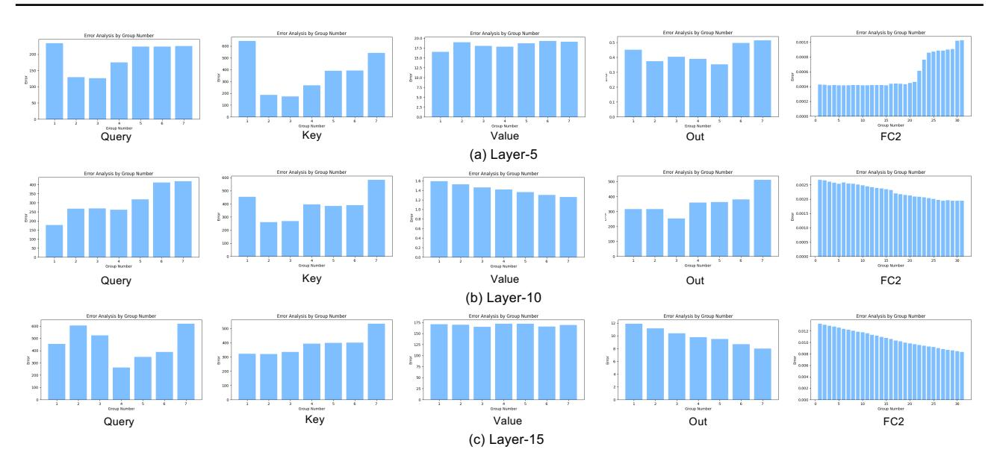
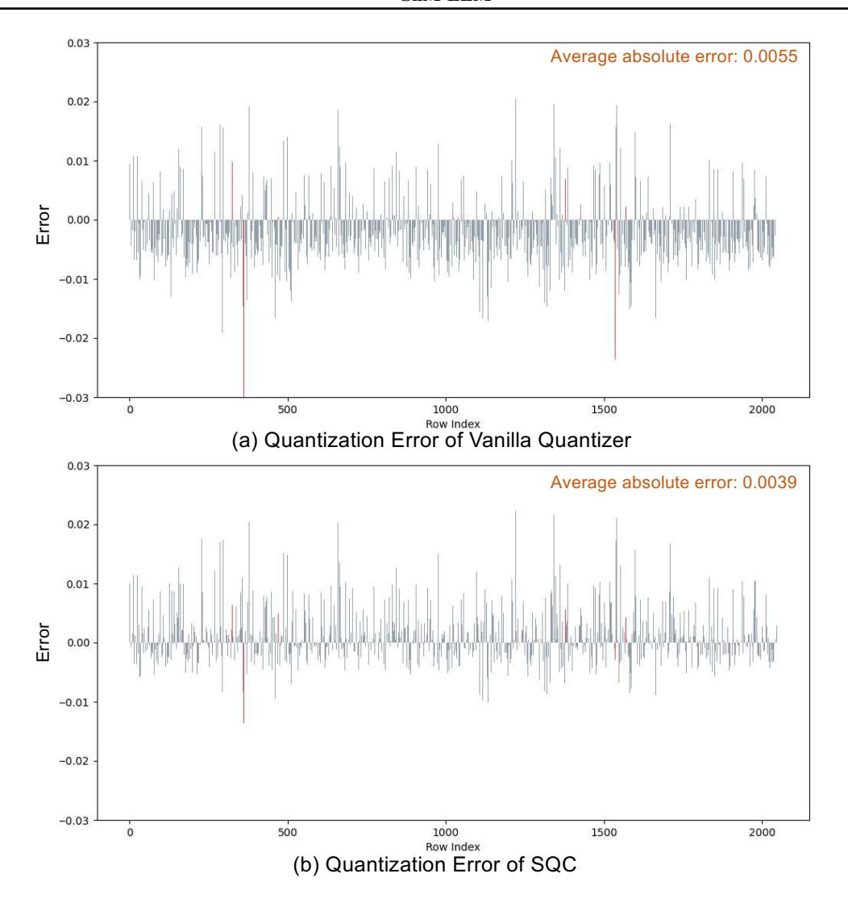

# F. Extension Ablation on Quantization Group-Size

To investigate the impact of different group sizes on the quantization effectiveness of SliM-LLM, we evaluated performance with 256 and 512 columns at a 3-bit level, observing that larger group sizes enhance GPU efficiency during inference. The findings suggest that increased group granularity does not substantially elevate perplexity across four models, indicating that SliM-LLM is robust and conducive to more efficient deployment methods. In contrast, at 2-bit, we assessed group sizes of 64 and 32 columns. With finer group granularity, the models displayed reduced perplex-

Figure 7. Error curves of SBA for select weights in the  $5^{th}$ ,  $10^{th}$ , and  $15^{th}$  layers of OPT-1.3B.

Table 6. Comparison of MSE and KL Divergence in SBA.

| Method        | # W   | OPT-1.3B     | OPT-2.7B     | OPT-6.7B     | OPT-13B      | LLaMA-7B     | LLaMA2-7B    |
|---------------|-------|--------------|--------------|--------------|--------------|--------------|--------------|
| MSE           | 2-bit | 32.50        | 27.58        | 15.14        | 13.28        | 21.94        | 16.86        |
| KL Divergence | 2-bit | <b>30.71</b> | <b>13.26</b> | <b>11.27</b> | <b>10.12</b> | <b>14.58</b> | <b>16.01</b> |

*Table 7.* Ablation results on OPT-6.7B, LLaMA-7B, LLaMA-2-7B, LLaMA-3-8B with SliM-LLM under different group size (#g denotes the group size).

| Precision / PPL↓ | #g  | OPT-6.7B | LLaMA-7B | LLaMA-2-7B | LLaMA-3-8B |
|------------------|-----|----------|----------|------------|------------|
| 3-bit            | 512 | 11.65    | 6.96     | 6.69       | 8.87       |
|                  | 256 | 11.33    | 6.92     | 6.94       | 8.14       |
|                  | 128 | 11.27    | 6.40     | 6.24       | 7.62       |
| 2-bit            | 128 | 14.41    | 14.58    | 16.01      | 39.66      |
|                  | 64  | 13.95    | 13.41    | 15.02      | 29.84      |
|                  | 32  | 12.47    | 11.91    | 11.95      | 16.93      |

ity. This is attributed to smaller groups providing more detailed data representation and utilizing additional quantization parameters, although they also raise computational and storage demands. A group size of 128 strikes a better balance between efficiency and quantization performance.

## G. Extension on Salience Channel Clustering

## G.1. Discussion of Theorem 1

Theorem 1. Given the input calibration activation  $x \in \mathbb{R}^{t \times m}$  with an outlier channel  $x_{:,p}^* \gg x_{:,j}, \forall j \in [0,m], j \neq p$  at the position of channel-p. The trace elements of  $\boldsymbol{H} = \boldsymbol{x}^{\top} \boldsymbol{x}$  will show great outlier value at (p,p), where  $\boldsymbol{H}_{p,p} \gg \boldsymbol{H}_{j,j}, \forall j \in [0,m], j \neq p$ , as  $\boldsymbol{H}_{p,p}$  is produced by  $[\boldsymbol{x}_{:,p}^{*\top} \boldsymbol{x}_{:,p}^*] = \sum_{i=0}^t x_{i,p}^{*2}$ , which further leads to the pa-

rameter salience larger at the  $p^{th}$  channel of weight, where  $\delta_{:,p} > \delta_{:,k}, \delta_{:,k} = \frac{w_{:,k}^2}{[\mathbf{H}^{-1}]_{k-k}^2}, \forall k \in [0,t], k \neq p.$ 

*Proof.* Given  $x \in \mathbb{R}^{t \times m}$  with outlier channel  $x_{:,p}^*$ ,  $p \in [0,m]$ , and other elements with small magnitude  $x_{i,j}$ , where  $x_{q,p}^* \gg x_{i,j}$  and  $i,j \neq q,p$ . We can get the Hessian matrix with Levenberg-Marquardt (Marquardt, 1963) approximation in Eq. (3):

$$\boldsymbol{H} = \begin{pmatrix} x_{11}^2 + \dots & \dots & \dots \\ \vdots & \ddots & \dots & \vdots \\ \vdots & \vdots & x_{p,p}^* + \dots & \vdots \\ \dots & \dots & \dots & \dots \end{pmatrix}$$
(6)

Figure 8. Absolute channel error of the weight of the OPT-1.3B model. The red line represents the quantization error for the locally salient weights, and the lightmauve represents other weights. (a) Vanilla quantizer error on the  $794^{th}$  channel of OPT-1.3B. (b) SQC error on the  $794^{th}$  channel of OPT-1.3B

where  $[x_{:,p}^{*\top}x_{:,p}^{*}]$  will appears at position  $H_{p,p}$ . And following SparseGPT (Frantar & Alistarh, 2023), the inverse matrix of H can be formulated as:

$$\delta_{i,j} = \frac{w_{i,j}^2}{[\operatorname{diag}((\boldsymbol{x}^\top \boldsymbol{x} + \lambda \boldsymbol{I})^{-1})]^2}$$
(7)

where  $(\boldsymbol{x}^{\top}\boldsymbol{x} + \lambda \boldsymbol{I})^{-1}$  is the new representation of Hessian matrix  $\boldsymbol{H}$  for the layer-wise reconstruction problem, and  $\lambda$  is the dampening factor for the Hessian to prevent the collapse of the inverse computation. Additionally, in accordance with the configuration in LLMs (Frantar & Alistarh, 2023; Frantar et al., 2022; Sun et al., 2023), the value of  $\lambda$  set is extremely small ( $\lambda \leq e^{-1}$ ), while the values located at the diagonal of Hessian are large. Therefore, only considering the influence of diagonal elements (Sun et al., 2023),

we can further approximate salience as:

$$\delta_{i,j} = \frac{w_{i,j}^2}{\left[\operatorname{diag}((\boldsymbol{x}^{\top}\boldsymbol{x} + \lambda \boldsymbol{I})^{-1})\right]^2} \approx \frac{w_{i,j}^2}{\left[\left(\operatorname{diag}(\boldsymbol{x}^{\top}\boldsymbol{x})\right)^{-1}\right]^2} = (w_{i,j} \cdot ||\boldsymbol{x}_j||_2^2)^2$$
(8)

Here the diagonal of  $\boldsymbol{x}^{\top}\boldsymbol{x}$  is  $\operatorname{diag}(||\boldsymbol{x}_j||_2^2)$ , and  $||\boldsymbol{x}_j||_2$  evaluates the  $\ell_2$  norm of  $j^{th}$  channel across different tokens. Consequently, it can be summarized that when there is an outlier channel-p, the value of  $||\boldsymbol{x}_p||_2$  is primarily influenced by  $[\boldsymbol{x}_{:,p}^{*\top}\boldsymbol{x}_{:,p}^*]$ . Additionally, since the activation values are relatively large and the differences in weight values are comparatively small, the  $p^{th}$  channel of weights will also exhibit salience.

## G.2. Distribution of salience, activation and weight magnitude

Fig. [9](#page-17-0) illustrates the distribution of salience among certain weights in LLMs. This section provides additional examples to demonstrate how the distribution of weights and input activation characteristics influence the salience of parameters in LLMs. The figure captures seven linear projections in the multi-head self-attention (MHA) and feed-forward block (FFB) layers of the 2 nd and 10th Transformer modules in the LLaMA-7B model.

In line with previous findings [\(Nrusimha et al.,](#page-9-20) [2024;](#page-9-20) [Xiao](#page-10-8) [et al.,](#page-10-8) [2023a\)](#page-10-8), activations demonstrate particularly marked outlier phenomena on anomalous tokens and channels, with extremes differing by more than two orders of magnitude. Notably, distinct anomalous channels are present in the MHA's Query, Key, and Value layers, where outliers vary significantly across different tokens. This pattern is consistent in the FFB layers. We observe that disparities in weight magnitudes are less pronounced than those in activation, thus exerting a reduced impact on outlier channels. Moreover, weights distribute structurally along rows or columns [\(Dettmers et al.,](#page-8-6) [2023;](#page-8-6) [Huang et al.,](#page-9-5) [2024a\)](#page-9-5), affecting the overall distribution of salience from a rowwise perspective (Fig. [9\)](#page-17-0). However, the most prominent salience is predominantly driven by activation across channels (column-wise).

#### G.3. Hessian Diagonal Clustering

Sec. [3.2.1](#page-3-0) demonstrates that outlier tokens in input activations result in significant values at the corresponding positions along the diagonal of the weight Hessian matrix. Additionally, due to the token sink phenomenon [\(Xiao et al.,](#page-10-15) [2023b;](#page-10-15) [Nrusimha et al.,](#page-9-20) [2024\)](#page-9-20), areas around significantly activated key tokens exhibit increased salience, creating clusters of salient regions along the Hessian matrix diagonal. To further elucidate this phenomenon, Fig. [10](#page-17-1) shows the values along the diagonal of the Hessian matrix for selected weights in the 2 nd and 10th layers of the LLaMA-7B model. Within this diagonal, certain positions display pronounced values (indicated in red), whereas others are relatively moderate. In the attention aggregation layer of the 10th layer, the token sink phenomenon results in a pronounced convergence of significant values along the Hessian matrix diagonal, with deep red areas indicating regional clustering. These findings reinforce the influence of input activations on the diagonal of the Hessian matrix, subsequently leading to a clustering phenomenon in the salience distribution of weights across channels.

## H. More Comparisons

In this section, we provide supplementary experiments for SliM-LLM. Tab. [8](#page-18-0) displays the comparative results of SliM-LLM and SliM-LLM+ with other methods on the OPT series models. Tab. [9](#page-18-1) shows the performance of SliM-LLM when quantizing the LLaMA family models on the C4 dataset, while Tab. [10](#page-18-2) also compares the results of SliM-LLM+ on the C4 dataset. In Tab. [11,](#page-18-3) we compared the quantization results of GPTQ, AWQ, and SliM-LLM at 2 bit on the Gemma2 and Mixtral models, demonstrating the greater stability of SliM-LLM across a wider range of model structures. Additionally, in Tab. [12,](#page-19-2) we supplemented the 4-bit results of different quantization methods in the LLaMA series models, showing that SliM-LLM and SliM-LLM+ exhibit the smallest quantization errors at practical 4-bit levels. To provide a comprehensive evaluation across a broader set of benchmarks, we further compared the quantization results on MMLU and MathQA in Tab. [13.](#page-19-3)

