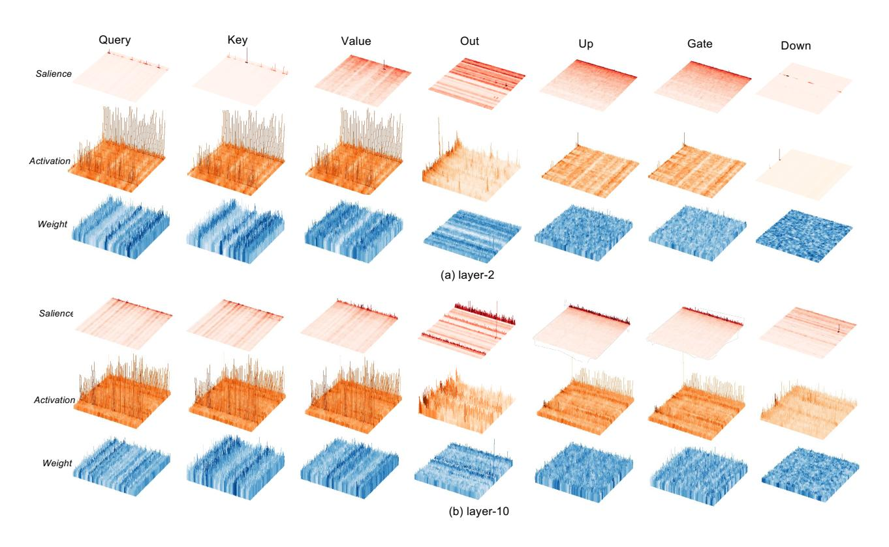
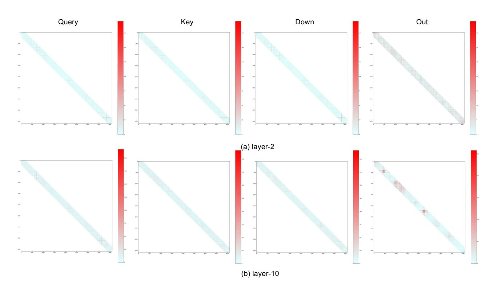

# K. Quantization Performance on Vision Language Models

To further showcase the potential application capabilities of SliM-LLM, in Tab. [15,](#page-19-0) we deploy SliM-LLM on LLaVA-Next-8B [\(Liu et al.,](#page-9-22) [2024\)](#page-9-22) evaluated on 4 benchmarks. The results show that GPTQ, AWQ and SliM-LLM show comparable performance under the 3-bit context. However, when the bit-width is setting as 2, GPTQ and AWQ failed to generate the reasonable answer in each benchmark and get "N" results. SliM-LLM successfully generate the reasonable output and the accuracy is closed to 3-bit model, which presents the superior usability of SliM-LLM to wider environments.

Figure 9. Salience, activation and weight distribution in the 2 nd and 10th layers of LLaMA-7B

Figure 10. Hessian diagonal magnitude in attention layers of 2 nd and 10th layers of LLaMA-7B

Table 8. Quantization results of OPT Models on WikiText2 (group size is 128).

| #W PPL↓ | Method      | 1.3B  | 2.7B  | 6.7B  | 13B   | 30B   | 66B   |
|---------|-------------|-------|-------|-------|-------|-------|-------|
| 16-bit  | -           | 14.63 | 12.47 | 10.86 | 10.12 | 9.56  | 9.34  |
|         | RTN         | 1.2e2 | 3.0e2 | 23.54 | 46.03 | 18.80 | 1.4e6 |
|         | GPTQ        | 16.47 | 13.69 | 11.65 | 10.35 | 9.73  | 10.96 |
|         | AWQ         | 16.32 | 13.58 | 11.41 | 10.68 | 9.85  | 9.60  |
|         | QuIP        | 16.21 | 13.79 | 11.51 | 10.50 | 9.75  | 9.59  |
| 3-bit   | SliM-LLM    | 15.91 | 13.26 | 11.27 | 10.26 | 9.70  | 9.48  |
|         | OmniQuant   | 15.72 | 13.18 | 11.27 | 10.47 | 9.79  | 9.53  |
|         | AffineQuant | 15.61 | 12.98 | 11.18 | 10.51 | 9.81  | -     |
|         | SliM-LLM+   | 15.58 | 12.84 | 11.18 | 10.44 | 9.67  | 9.51  |
|         | RTN         | 1.3e4 | 5.7e4 | 7.8e3 | 7.6e4 | 1.3e4 | 3.6e5 |
|         | GPTQ        | 1.1e2 | 61.59 | 20.18 | 21.36 | 12.71 | 82.10 |
|         | AWQ         | 47.97 | 28.50 | 16.20 | 14.32 | 12.31 | 14.54 |
|         | QuIP        | 41.64 | 28.98 | 18.57 | 16.02 | 11.48 | 10.76 |
| 2-bit   | PB-LLM      | 45.92 | 39.71 | 20.37 | 19.11 | 17.01 | 16.36 |
|         | SliM-LLM    | 30.71 | 24.08 | 14.41 | 13.68 | 11.34 | 10.94 |
|         | OmniQuant   | 23.95 | 18.13 | 14.43 | 12.94 | 11.39 | 30.84 |
|         | SliM-LLM+   | 24.57 | 17.98 | 14.22 | 12.16 | 11.27 | 14.98 |

Table 9. Quantization results of LLaMA Family with statistic quantizer on C4 (group size is 128).

| #W PPL↓ | Method   | 1-7B  | 1-13B | 1-30B | 1-65B | 2-7B  | 2-13B | 2-70B | 3-8B  | 3-70B |
|---------|----------|-------|-------|-------|-------|-------|-------|-------|-------|-------|
| 16-bit  | -        | 7.08  | 6.61  | 5.98  | 5.62  | 6.97  | 6.46  | 5.52  | 9.22  | 6.85  |
|         | APTQ     | 6.24  | -     | -     | -     | -     | -     | -     | -     | -     |
|         | RTN      | 8.62  | 7.49  | 6.58  | 6.10  | 8.40  | 7.18  | 6.02  | 1.1e2 | 22.39 |
| 3-bit   | AWQ      | 7.92  | 7.07  | 6.37  | 5.94  | 7.84  | 6.94  | -     | 11.62 | 8.03  |
|         | GPTQ     | 7.85  | 7.10  | 6.47  | 6.00  | 7.89  | 7.00  | 5.85  | 13.67 | 10.52 |
|         | SliM-LLM | 6.14  | 6.05  | 6.33  | 5.94  | 7.74  | 5.26  | 5.09  | 13.10 | 8.64  |
|         | RTN      | 1.0e3 | 4.5e2 | 99.45 | 17.15 | 4.9e3 | 1.4e2 | 42.13 | 2.5e4 | 4.6e5 |
|         | AWQ      | 1.9e5 | 2.3e5 | 2.4e5 | 7.5e4 | 1.7e5 | 9.4e4 | -     | 2.1e6 | 1.4e6 |
|         | GPTQ     | 34.63 | 15.29 | 11.93 | 11.99 | 33.70 | 20.97 | NAN   | 4.1e4 | 21.82 |
| 2-bit   | QuIP     | 33.74 | 21.94 | 10.95 | 13.99 | 31.94 | 16.16 | 8.17  | 1.3e2 | 22.24 |
|         | PB-LLM   | 49.73 | 26.93 | 17.93 | 11.85 | 29.84 | 19.82 | 8.95  | 79.21 | 33.91 |
|         | SliM-LLM | 32.91 | 13.85 | 11.27 | 10.95 | 16.00 | 9.41  | 7.01  | 1.1e2 | 15.92 |

Table 10. Quantization results of LLaMA-1 and LLaMA-2 models with learnable quantizer on C4.

| #W PPL↓ | Method      | 1-7B  | 1-13B | 1-30B | 1-65B | 2-7B  | 2-13B | 2-70B |
|---------|-------------|-------|-------|-------|-------|-------|-------|-------|
| 16-bit  | -           | 7.08  | 6.61  | 5.98  | 5.62  | 6.97  | 6.46  | 5.52  |
| 3-bit   | OmniQuant   | 7.75  | 7.05  | 6.37  | 5.93  | 7.75  | 6.98  | 5.85  |
|         | AffineQuant | 7.75  | 7.04  | 6.40  | -     | 7.83  | 6.99  | -     |
|         | SliM-LLM+   | 7.75  | 6.91  | 6.36  | 5.96  | 7.71  | 6.90  | 5.85  |
| 2-bit   | OmniQuant   | 12.97 | 10.36 | 9.36  | 8.00  | 15.02 | 11.05 | 8.52  |
|         | AffineQuant | 14.92 | 12.64 | 9.66  | -     | 16.02 | 10.98 | -     |
|         | SliM-LLM+   | 14.99 | 10.22 | 9.33  | 7.52  | 18.18 | 10.24 | 8.40  |

Table 11. PPL Comparison on Gemma2 and Mixtral.

| Model/Evaluation | Method                                   | PPL (wikitext2)           |
|------------------|------------------------------------------|---------------------------|
| Gemma2-9B        | GPTQ 2-bit AWQ 2-bit SliM-LLM 2bit | 186.77 217.83 26.30 |
| Mixtral 8x7B     | GPTQ 2-bit AWQ 2-bit SliM-LLM 2bit | 16.38 3.2e5 7.44    |

Table 12. The PPL results of our proposed method and other methods under 4bit quantization.

| Method    | LLaMA-7B | LLaMA-13B | LLaMA2-7B | LLaMA2-13B | LLaMA3-8B |
|-----------|----------|-----------|-----------|------------|-----------|
| FP16      | 5.68     | 5.09      | 5.47      | 4.88       | 5.75      |
| AWQ       | 5.81     | 5.30      | 5.62      | 4.97       | 6.63      |
| GPTQ      | 5.85     | 5.20      | 5.61      | 4.98       | 6.50      |
| SliM-LLM  | 5.83     | 5.16      | 5.59      | 4.95       | 6.42      |
| Omniquant | 5.77     | -         | 5.58      | -          | -         |
| SliM-LLM+ | 5.75     | -         | 5.57      | -          | -         |

Table 13. The results(%) on MMLU and MathQA for multiple quantized LLaMA models.

| Model      | Method        | Humanities | Social Sciences | STEM  | Other | MMLU  | MathQA |
|------------|---------------|------------|-----------------|-------|-------|-------|--------|
| LLaMA-7B   | GPTQ 2-bit    | 24.87      | 21.84           | 21.79 | 24.01 | 23.32 | 21.11  |
|            | AWQ 2-bit     | 24.21      | 21.71           | 21.25 | 23.98 | 22.95 | 22.21  |
|            | SliM-LLM 2bit | 24.94      | 23.60           | 23.40 | 25.50 | 25.10 | 23.74  |
| LLaMA-13B  | GPTQ 2-bit    | 24.23      | 23.20           | 22.99 | 24.78 | 23.85 | 21.68  |
|            | AWQ 2-bit     | 24.17      | 31.07           | 28.61 | 25.14 | 26.89 | 21.98  |
|            | SliM-LLM 2bit | 25.12      | 31.74           | 29.19 | 26.17 | 27.05 | 23.17  |
| LLaMA2-7B  | GPTQ 2-bit    | 25.02      | 22.13           | 22.61 | 23.17 | 23.44 | 21.07  |
|            | AWQ 2-bit     | 25.12      | 22.79           | 24.26 | 24.01 | 24.51 | 19.06  |
|            | SliM-LLM 2bit | 26.60      | 23.23           | 25.70 | 25.70 | 25.81 | 22.55  |
| LLaMA2-13B | GPTQ 2-bit    | 23.91      | 27.17           | 26.10 | 25.78 | 25.53 | 20.87  |
|            | AWQ 2-bit     | 24.17      | 31.07           | 28.61 | 25.14 | 26.89 | 19.53  |
|            | SliM-LLM 2bit | 26.27      | 32.20           | 29.98 | 26.46 | 27.34 | 23.48  |

Table 14. LLaMA-2-70B results of GPTQ and Slim-LLM on GPU. Group size is set to 128.

| #W    | LLaMA-2-70B | WM    | RM    | PPL↓ | Token/s |
|-------|-------------|-------|-------|------|---------|
| 3-bit | GPTQ        | 28.0G | 34.9G | 3.85 | 6.5     |
|       | SliM-LLM    | 28.0G | 35.2G | 3.67 | 6.2     |
| 2-bit | GPTQ        | 16.4G | 23.3G | 8.78 | 9.7     |
|       | SliM-LLM    | 23.5G | 4.4G  | 6.28 | 8.4     |

Table 15. Quantization results on Vision Language Models (VLMs).

|          | #W | #G  | AI2D | ChartQA | DocVQA | MMBench |
|----------|----|-----|------|---------|--------|---------|
|          | 3  | 128 | 66.2 | 65.1    | 75.6   | 67.4    |
| GPTQ     | 2  | 128 | N    | N       | N      | N       |
|          | 3  | 128 | 67.7 | 65.4    | 74.4   | 68.0    |
| AWQ      | 2  | 128 | N    | N       | N      | N       |
|          | 3  | 128 | 68.2 | 67.5    | 74.8   | 68.9    |
| SliM-LLM | 2  | 128 | 57.2 | 49.3    | 60.6   | 60.9    |

| LLaMA-2-13B    |                                                                                                                                                                                                                                                                                                                                                                                                                               |  |  |  |  |
|----------------|-------------------------------------------------------------------------------------------------------------------------------------------------------------------------------------------------------------------------------------------------------------------------------------------------------------------------------------------------------------------------------------------------------------------------------|--|--|--|--|
|                | Prompt: The eight planets in Solar System are Mercury,                                                                                                                                                                                                                                                                                                                                                                        |  |  |  |  |
|                | GPTQ-2bit: , 10.2. The eight pill o free games of p. 62.2. The way we do this.                                                                                                                                                                                                                                                                                                                                                |  |  |  |  |
|                | Slim-LLM-2bit: Venus, Earth, Mars, Jupiter, Saturn, Uranus and Neptune.                                                                                                                                                                                                                                                                                                                                                       |  |  |  |  |
|                | Prompt: The tallest and most famous tower in France is                                                                                                                                                                                                                                                                                                                                                                        |  |  |  |  |
|                | GPTQ-2bit: is 350 and most recently.                                                                                                                                                                                                                                                                                                                                                                                          |  |  |  |  |
|                | Slim-LLM-2bit: 320 meters high.                                                                                                                                                                                                                                                                                                                                                                                               |  |  |  |  |
|                | Prompt: The 2012 Summer Olympic was held in                                                                                                                                                                                                                                                                                                                                                                                   |  |  |  |  |
| GPTQ-2bit:     | The 2012 Summer Olympic was held in 1016 (a.185) and the 775,000 km from each.                                                                                                                                                                                                                                                                                                                                             |  |  |  |  |
|                | Slim-LLM-2bit: 2012 in London, the United Kingdom.                                                                                                                                                                                                                                                                                                                                                                            |  |  |  |  |
| Vicuna-13B     |                                                                                                                                                                                                                                                                                                                                                                                                                               |  |  |  |  |
|                | Prompt: What are the capitals of Brazil, Mexico and France?                                                                                                                                                                                                                                                                                                                                                                   |  |  |  |  |
|                | GPTQ-2bit: What is the RER score?                                                                                                                                                                                                                                                                                                                                                                                             |  |  |  |  |
| Slim-LLM-2bit: | The capital of Brazil is Brasília, the capital of Mexico is Mexico City, and the capital of France is Paris.                                                                                                                                                                                                                                                                                                               |  |  |  |  |
|                | Prompt: What are the ancient civilizations in Europe?                                                                                                                                                                                                                                                                                                                                                                         |  |  |  |  |
| GPTQ-2bit:     | I am trying to find a book to nook over the life of to 300,000 or so. The ancient civilization is the one in which history books be pop and I have a be, oh, do you know the one the Mayan, the one of the total for Dake.                                                                                                                                                                                              |  |  |  |  |
| Slim-LLM-2bit: | The ancient civilizations in Europe include the Roman Empire, the Byzantine Empire, and the Ottoman Empire.                                                                                                                                                                                                                                                                                                                |  |  |  |  |
|                | Prompt: What are the logical circuits?                                                                                                                                                                                                                                                                                                                                                                                        |  |  |  |  |
| GPTQ-2bit:     | What is the order of the logical cumulated? What is the best strategy to do in a single? What is the most popular to be eaten? What are the most sought?                                                                                                                                                                                                                                                                |  |  |  |  |
| Slim-LLM-2bit: | The logical circuits are the basic components for building the logical functions, which are required for digital computing. These circuits use logic structures and devices that allow the use of Boolean and multiple logic to implement the functional requirements as defined by a problem solving method of computer. In digital computing, circuits perform the logical tasks required for solving problems. |  |  |  |  |

Figure 11. Some examples of conversations. LLaMA-2-13B and Vicuna-13B are chosen to show the case of language supplementary and Q&A ability. And GPTQ-2bit is selected as the comparison. We color the text to show the reasonable or inappropriate responses.