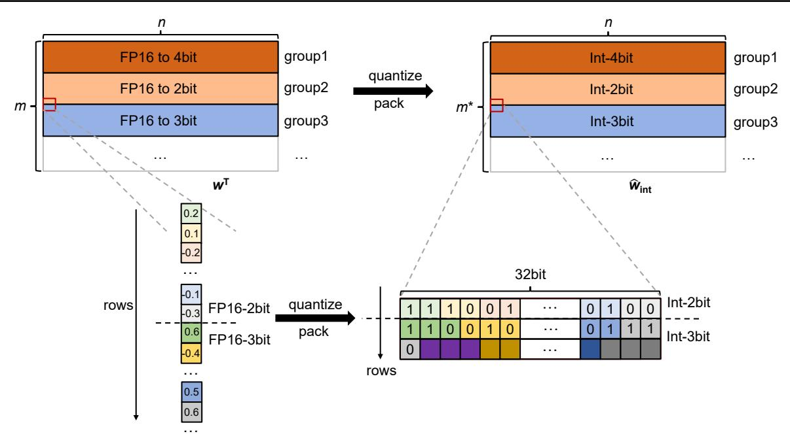

# C. Searching Details of Group-Wise Salience-Determined Bit Allocation

We optimize the mixed-precision configuration based on the output information entropy (KL-divergence), searching for the optimal compensation bit-widths ratio as shown in Eq. (4).

Initially, we rank each group by their average salience, a metric for quantization, and employ a double-pointer that moves simultaneously from both the beginning (lowest salience) and end (highest salience) of the sorted list. This ensures an equal number of groups at low and high bit-widths, effec-

tively balancing the global average bit-widths compensation. We then calculate the relative entropy under the corresponding precision ratio and search for the optimal ratio. Fig 7 displays the search error curves related to the  $2^{nd}$ ,  $10^{th}$ , and  $15^{th}$  Transformer layers in the OPT1.3B model, showcasing the search curves for certain self-attention layers (Query, Key, Value, FC2).

Due to the limited range of the search, extreme scenarios involve either a half (N-1)-bit and half (N+1)-bit without N-bit or all groups being N-bit (uniform precision). Fig 7 demonstrates that lower quantization errors can be

Figure 6. The memory layout shown in the figure is modified based on AutoGPTQ. The transposed original weights  $\mathbf{w}^{\top} \in \mathbb{R}^{m \times n}$  are still divided into multiple groups along the row direction after quantization. The elements within each group are vertically packed into integers and then reassembled into  $\hat{w}_{\text{int}}$ . The figure employs corresponding colors to indicate how each original number is mapped to a specific position within the packed integers after quantization, which finally generates  $\hat{w}_{\text{int}} \in \mathbb{R}^{m^* \times n}$ , where  $m^*$  is compressed from m by packing several low-bit number. Similarly,  $\hat{z}_{\text{int}}$  is also packed into integers to save memory.

achieved under mixed-precision compared to quantization at the uniform bit-width. We also find that multiple low-error precision combinations are possible within a group of weights, allowing SBA to flexibly select the optimal ratio through its versatile search.

#### D. Evluation Function of SBA

In Tab. 6, we employ various objective functions and compare their performance in SBA across different models. Compared to the commonly used Mean Squared Error (MSE) loss, Kullback-Leibler (KL) divergence ensures the distribution of critical activation positions within the model from an information entropy perspective, making it a superior choice for the bit-widths allocation strategy in SBA for the OPT and LLaMA models. When computing KL divergence in this context, we first transform the layer outputs into probability distributions using softmax.

## E. Extension Ablation on SQC

In this section, we visualize the effectiveness of SQC in mitigating the degradation of information in locally salient weights. We observed the absolute error of weights in a randomly selected channel of the quantized OPT-1.3B model. As shown in Fig. 8, the overall absolute error of the weights post-quantization with a standard quantizer was

0.0055, while with SQC it was reduced to 0.0039. This further demonstrates that the search parameter  $\tau$ , as applied in Eq. (5), effectively optimizes the quantizer parameters, thereby reducing quantization errors.

More importantly, SQC effectively perceives the information of locally salient weights, as indicated by the red regions in Fig. 8. Compared to the vanilla quantizer, SQC significantly reduces the error of salient weights. Specifically, the prominent weights at indices 375 in Fig. 8(a) show higher quantization errors, while in Fig. 8(b), this error is effectively reduced. This confirms SQC's ability to perceive locally salient weights, effectively preventing the degradation of critical information.

