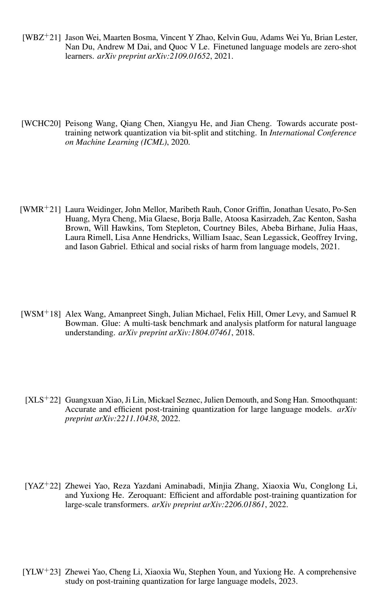

# References

- [BMR+20] Tom Brown, Benjamin Mann, Nick Ryder, Melanie Subbiah, Jared D Kaplan, Prafulla Dhariwal, Arvind Neelakantan, Pranav Shyam, Girish Sastry, Amanda Askell, et al. Language models are few-shot learners. In *Conference on Neural Information Processing Systems (NeurIPS)*, 2020.
- [BSA+23] Stella Biderman, Hailey Schoelkopf, Quentin Anthony, Herbie Bradley, Kyle O'Brien, Eric Hallahan, Mohammad Aflah Khan, Shivanshu Purohit, USVSN Sai Prashanth, Edward Raff, et al. Pythia: A suite for analyzing large language models across training and scaling. *arXiv preprint arXiv:2304.01373*, 2023.
- [CCE+18] Peter Clark, Isaac Cowhey, Oren Etzioni, Tushar Khot, Ashish Sabharwal, Carissa Schoenick, and Oyvind Tafjord. Think you have solved question answering? try arc, the ai2 reasoning challenge. *arXiv preprint arXiv:1803.05457*, 2018.
- [CND+22] Aakanksha Chowdhery, Sharan Narang, Jacob Devlin, Maarten Bosma, Gaurav Mishra, Adam Roberts, Paul Barham, Hyung Won Chung, Charles Sutton, Sebastian Gehrmann, et al. Palm: Scaling language modeling with pathways. *arXiv preprint arXiv:2204.02311*, 2022.
- [DCLT19] Jacob Devlin, Ming-Wei Chang, Kenton Lee, and Kristina Toutanova. BERT: Pretraining of deep bidirectional transformers for language understanding. In *North American Chapter of the Association for Computational Linguistics (NAACL)*, 2019.
- [DLBZ22] Tim Dettmers, Mike Lewis, Younes Belkada, and Luke Zettlemoyer. LLM.int8(): 8-bit matrix multiplication for transformers at scale. *Advances in Neural Information Processing Systems 35: Annual Conference on Neural Information Processing Systems 2022, NeurIPS 2022*, 2022.

- [DZ22] Tim Dettmers and Luke Zettlemoyer. The case for 4-bit precision: k-bit inference scaling laws. *arXiv preprint arXiv:2212.09720*, 2022.
- [FA23] Elias Frantar and Dan Alistarh. Massive language models can be accurately pruned in one-shot. *arXiv preprint arXiv:2301.00774*, 2023.
- [FAHA22] Elias Frantar, Saleh Ashkboos, Torsten Hoefler, and Dan Alistarh. Gptq: Accurate post-training quantization for generative pre-trained transformers. *arXiv preprint arXiv:2210.17323*, 2022.
  - [FSA22] Elias Frantar, Sidak Pal Singh, and Dan Alistarh. Optimal Brain Compression: A framework for accurate post-training quantization and pruning. *arXiv preprint arXiv:2208.11580*, 2022. Accepted to NeurIPS 2022, to appear.
- [GFS+19] Yury Gorbachev, Mikhail Fedorov, Iliya Slavutin, Artyom Tugarev, Marat Fatekhov, and Yaroslav Tarkan. Openvino deep learning workbench: Comprehensive analysis and tuning of neural networks inference. In *Proceedings of the IEEE/CVF International Conference on Computer Vision Workshops*, pages 0–0, 2019.
- [GKD+21] Amir Gholami, Sehoon Kim, Zhen Dong, Zhewei Yao, Michael W Mahoney, and Kurt Keutzer. A survey of quantization methods for efficient neural network inference. *arXiv preprint arXiv:2103.13630*, 2021.
- [GTB+21] Leo Gao, Jonathan Tow, Stella Biderman, Sid Black, Anthony DiPofi, Charles Foster, Laurence Golding, Jeffrey Hsu, Kyle McDonell, Niklas Muennighoff, Jason Phang, Laria Reynolds, Eric Tang, Anish Thite, Ben Wang, Kevin Wang, and Andy Zou. A framework for few-shot language model evaluation, September 2021.
- [HABN+21] Torsten Hoefler, Dan Alistarh, Tal Ben-Nun, Nikoli Dryden, and Alexandra Peste. Sparsity in deep learning: Pruning and growth for efficient inference and training in neural networks. *arXiv preprint arXiv:2102.00554*, 2021.
- [HBM+22] Jordan Hoffmann, Sebastian Borgeaud, Arthur Mensch, Elena Buchatskaya, Trevor Cai, Eliza Rutherford, Diego de Las Casas, Lisa Anne Hendricks, Johannes Welbl, Aidan Clark, et al. Training compute-optimal large language models. *arXiv preprint arXiv:2203.15556*, 2022.
- [HNH+21] Itay Hubara, Yury Nahshan, Yair Hanani, Ron Banner, and Daniel Soudry. Accurate post training quantization with small calibration sets. In *International Conference on Machine Learning (ICML)*, 2021.
- [KHB+21] Daya Khudia, Jianyu Huang, Protonu Basu, Summer Deng, Haixin Liu, Jongsoo Park, and Mikhail Smelyanskiy. Fbgemm: Enabling high-performance low-precision deep learning inference. *arXiv preprint arXiv:2101.05615*, 2021.
- [KMH+20] Jared Kaplan, Sam McCandlish, Tom Henighan, Tom B Brown, Benjamin Chess, Rewon Child, Scott Gray, Alec Radford, Jeffrey Wu, and Dario Amodei. Scaling laws for neural language models. *arXiv preprint arXiv:2001.08361*, 2020.
- [LGT+21] Yuhang Li, Ruihao Gong, Xu Tan, Yang Yang, Peng Hu, Qi Zhang, Fengwei Yu, Wei Wang, and Shi Gu. BRECQ: Pushing the limit of post-training quantization by block reconstruction. In *International Conference on Learning Representations (ICLR)*, 2021.
- [MKM+94] Mitch Marcus, Grace Kim, Mary Ann Marcinkiewicz, Robert MacIntyre, Ann Bies, Mark Ferguson, Karen Katz, and Britta Schasberger. The penn treebank: Annotating predicate argument structure. In *Human Language Technology: Proceedings of a Workshop held at Plainsboro, New Jersey, March 8-11, 1994*, 1994.
- [MXBS16] Stephen Merity, Caiming Xiong, James Bradbury, and Richard Socher. Pointer sentinel mixture models. *arXiv preprint arXiv:1609.07843*, 2016.
- [NAVB+20] Markus Nagel, Rana Ali Amjad, Mart Van Baalen, Christos Louizos, and Tijmen Blankevoort. Up or down? Adaptive rounding for post-training quantization. In *International Conference on Machine Learning (ICML)*, 2020.

- [Neu22] NeuralMagic. DeepSparse, 2022.
- [OEN+22] Catherine Olsson, Nelson Elhage, Neel Nanda, Nicholas Joseph, Nova DasSarma, Tom Henighan, Ben Mann, Amanda Askell, Yuntao Bai, Anna Chen, et al. In-context learning and induction heads. *arXiv preprint arXiv:2209.11895*, 2022.
  - [Ope23] OpenAI. Gpt-4 technical report. *arXiv*, 2023.
- [PGM+19] Adam Paszke, Sam Gross, Francisco Massa, Adam Lerer, James Bradbury, Gregory Chanan, Trevor Killeen, Zeming Lin, Natalia Gimelshein, Luca Antiga, Alban Desmaison, Andreas Kopf, Edward Yang, Zachary DeVito, Martin Raison, Alykhan Tejani, Sasank Chilamkurthy, Benoit Steiner, Lu Fang, Junjie Bai, and Soumith Chintala. PyTorch: An imperative style, high-performance deep learning library. In *Conference on Neural Information Processing Systems (NeurIPS)*. 2019.
- [PPK+22] Gunho Park, Baeseong Park, Se Jung Kwon, Byeongwook Kim, Youngjoo Lee, and Dongsoo Lee. nuQmm: Quantized matmul for efficient inference of large-scale generative language models. *arXiv preprint arXiv:2206.09557*, 2022.
- [RCK+20] Vijay Janapa Reddi, Christine Cheng, David Kanter, Peter Mattson, Guenther Schmuelling, Carole-Jean Wu, Brian Anderson, Maximilien Breughe, Mark Charlebois, William Chou, et al. Mlperf inference benchmark. In *2020 ACM/IEEE 47th Annual International Symposium on Computer Architecture (ISCA)*, pages 446–459. IEEE, 2020.
- [RSR+20] Colin Raffel, Noam Shazeer, Adam Roberts, Katherine Lee, Sharan Narang, Michael Matena, Yanqi Zhou, Wei Li, and Peter Liu. Exploring the limits of transfer learning with a unified text-to-text transformer. *Journal of Machine Learning Research*, 21(140):1–67, 2020.
- [RWC+19] Alec Radford, Jeffrey Wu, Rewon Child, David Luan, Dario Amodei, and Ilya Sutskever. Language models are unsupervised multitask learners. *OpenAI blog*, 1(8):9, 2019.
- [SBBC21] Keisuke Sakaguchi, Ronan Le Bras, Chandra Bhagavatula, and Yejin Choi. Winogrande: an adversarial winograd schema challenge at scale. *Commun. ACM*, 64(9):99–106, 2021.
- [SLP+21] Jianlin Su, Yu Lu, Shengfeng Pan, Ahmed Murtadha, Bo Wen, and Yunfeng Liu. Roformer: Enhanced transformer with rotary position embedding. *arXiv preprint arXiv:2104.09864*, 2021.
- [TLI+23] Hugo Touvron, Thibaut Lavril, Gautier Izacard, Xavier Martinet, Marie-Anne Lachaux, Timothée Lacroix, Baptiste Rozière, Naman Goyal, Eric Hambro, Faisal Azhar, et al. Llama: Open and efficient foundation language models. *arXiv preprint arXiv:2302.13971*, 2023.
  - [TP03] Sandeep Tata and Jignesh M Patel. PiQA: An algebra for querying protein data sets. In *International Conference on Scientific and Statistical Database Management*, 2003.
- [UAE23a] TII UAE. The falcon family of large language models. [https://huggingface.co/](https://huggingface.co/tiiuae/falcon-40b) [tiiuae/falcon-40b](https://huggingface.co/tiiuae/falcon-40b), May 2023.
- [UAE23b] TII UAE. The refined web dataset. [https://huggingface.co/datasets/tiiuae/](https://huggingface.co/datasets/tiiuae/falcon-refinedweb) [falcon-refinedweb](https://huggingface.co/datasets/tiiuae/falcon-refinedweb), May 2023.
  - [Vig19] Jesse Vig. A multiscale visualization of attention in the transformer model. *arXiv preprint arXiv:1906.05714*, 2019.
- [VTM+19] Elena Voita, David Talbot, Fedor Moiseev, Rico Sennrich, and Ivan Titov. Analyzing multi-head self-attention: Specialized heads do the heavy lifting, the rest can be pruned. In *Proceedings of the 57th Annual Meeting of the Association for Computational Linguistics*, pages 5797–5808, Florence, Italy, July 2019. Association for Computational Linguistics.

