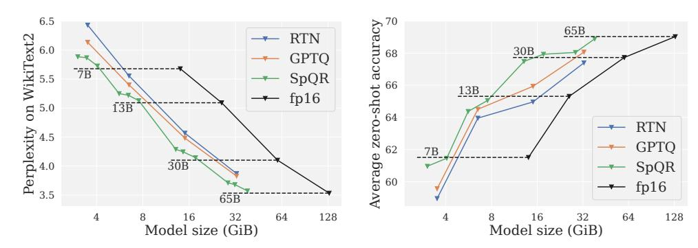
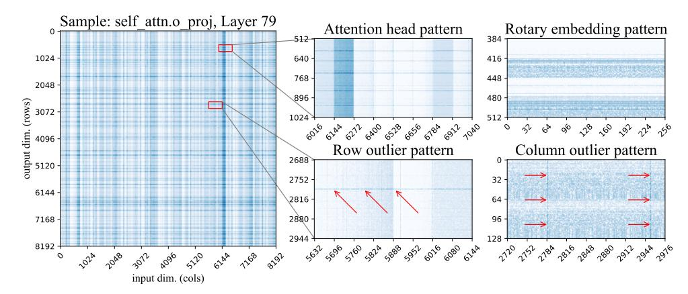
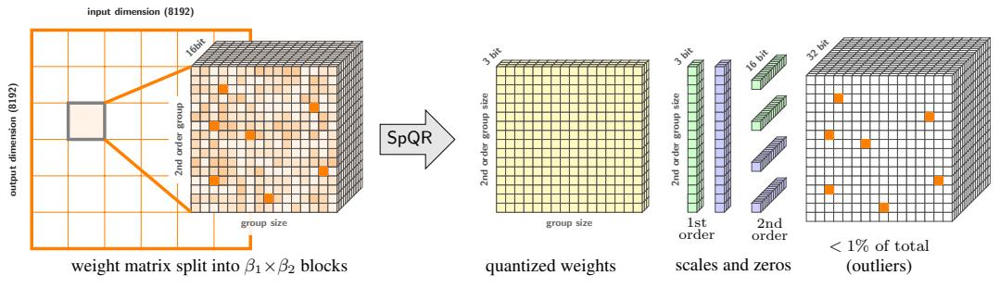

# SpQR: A Sparse-Quantized Representation for Near-Lossless LLM Weight Compression

Tim Dettmers\*<sup>†</sup>
University of Washington

Ruslan Svirschevski\* HSE University & Yandex Vage Egiazarian\* HSE University & Yandex

**Denis Kuznedelev**\* Yandex & Skoltech

Elias Frantar IST Austria Saleh Ashkboos ETH Zurich Alexander Borzunov HSE University & Yandex

Torsten Hoefler ETH Zurich

Dan Alistarh
IST Austria & NeuralMagic

#### Abstract

Recent advances in large language model (LLM) pretraining have led to highquality LLMs with impressive abilities. By compressing such LLMs via quantization to 3-4 bits per parameter, they can fit into memory-limited devices such as laptops and mobile phones, enabling personalized use. However, quantization down to 3-4 bits per parameter usually leads to moderate-to-high accuracy losses, especially for smaller models in the 1-10B parameter range, which are well-suited for edge deployments. To address this accuracy issue, we introduce the Sparse-Quantized Representation (SpQR), a new compressed format and quantization technique which enables for the first time *near-lossless* compression of LLMs across model scales, while reaching similar compression levels to previous methods. SpQR works by identifying and isolating *outlier weights*, which cause particularlylarge quantization errors, and storing them in higher precision, while compressing all other weights to 3-4 bits, and achieves relative accuracy losses of less than 1% in perplexity for highly-accurate LLaMA and Falcon LLMs. This makes it possible to run 33B parameter LLM on a single 24 GB consumer GPU without any performance degradation at 15% speedup thus making powerful LLMs available to consumer without any downsides. SpQR comes with efficient algorithms for both encoding weights into its format, as well as decoding them efficiently at runtime<sup>3</sup>. Specifically, we provide an efficient GPU inference algorithm for SpQR which yields faster inference than 16-bit baselines at similar accuracy, while enabling memory compression gains of more than 4x.

#### <span id="page-0-1"></span>1 Introduction

Pretrained large language models (LLMs) improved rapidly from task-specific performance [WSM+18, DCLT19, RWC+19], to performing well on general tasks if prompted with instructions [BMR+20, WBZ+21, Ope23]. While the improved performance can be attributed to scaling in training data and parameters [KMH+20, CND+22] recent trends focused on smaller models trained on more data, that are easier to use at inference time [HBM+22, BSA+23, TLI+23]. For example, the 7B parameter LLaMA model trained on 1T tokens achieved an average performance only slightly lower than GPT-3 [BMR+20] despite being 25x smaller. Current techniques for LLM compression can shrink these models further by a factor of about 4x, while preserving their performance

<sup>\*</sup>Equal contribution

<sup>†</sup>Corresponding author: dettmers@cs.washington.edu

<span id="page-0-0"></span> $<sup>^3</sup>$ github.com/Vahe1994/SpQR; to be integrated into github.com/TimDettmers/bitsandbytes

<span id="page-1-0"></span>

Figure 1: Compressed LLM performance for LLaMA models. (**left**) LM loss on WikiText2 vs model size. (**right**) Average performance on zero-shot tasks vs model size.

[DLBZ22, XLS<sup>+</sup>22, FAHA22, DZ22]. This yields performance levels comparable to the largest GPT-3 model, with major reductions in terms of memory requirements. With such improvements, well-performing models could be efficiently served on end-user devices, such as laptops.

The main challenge is to compress models enough to fit into such devices while also preserving generative quality. Specifically, studies show that, although accurate, existing techniques for 3 to 4-bit quantization still lead to significant accuracy degradation [DZ22, FAHA22]. Since LLM generation is sequential, depending on previously-generated tokens, small relative errors can accumulate and lead to severely corrupted outputs. To ensure reliable quality, it is critical to design low-bitwidth quantization that does not degrade predictive performance compared to the 16-bit model.

In this work, we introduce Sparse-Quantized Representations (SpQR), a hybrid sparse-quantized format which can compress accurate pretrained LLMs to 3-4 bits per parameter while staying *near-lossless*: specifically, SpQR is the first weight quantization method which is able to reach such compression ratios while inducing end-to-end accuracy error as measured in perplexity of less than 1% relative to the dense baseline. SpQR works by combining two innovations. First, we isolate *outlier weights*, whose quantization we show to induce disproportionately high errors: these weights are kept in high precision, while the other weights are stored in a much lower, e.g. 3-bit, format. Second, we implement a variant of grouped quantization with very small group size, e.g. 16 contiguous elements, but we show that one can quantize the quantization scales themselves to a 3-bit representation.

To convert a given pretrained LLM into SpQR format, we adopt an extended version of the post-training quantization (PTQ) approach recently introduced by GPTQ [FAHA22]. Specifically, the method passes calibration data through the uncompressed model; to compress each layer, it applies a layer-wise solver with respect to the L2 error between the outputs of the uncompressed model, and those of the quantized weights. Our approach splits this process into two steps: an "outlier detection" step, in which we isolate weights whose direct quantization has outsize impact on layer output behavior, and an actual compression step, in which most ( $\geq 99\%$ ) of weights are compressed to low-bitwidth, the outliers are extracted, and the whole representation is rendered more efficient by further compressing the quantization metadata.

Our method is motivated by a new analysis showing that LLM weight quantization errors exhibit both vertical and horizontal group correlations, corresponding to systematic large errors corresponding to input feature dimensions and output hidden dimensions. While outlier input features have been observed before [DLBZ22, XLS<sup>+</sup>22], our work is the first to demonstrate that similar outliers occur *in the weights, for particular output hidden dimensions*. Unlike input feature outliers, the output hidden dimension outliers occur only in small segments for a particular output hidden dimension.

Our quantization algorithm isolates such outliers and efficiently encodes a given model in SpQR format. To exploit the resulting structure, we develop a specialized sparse-matrix multiplication algorithm based on the compressed sparse row (CSR) format. To use SpQR for token-by-token generation, we combine this sparse algorithm together with a dense-quantized matrix multiplication for 3-4 bit weights. With this, SpQR reduces the memory footprint of LLMs by a factor of about 3.4x or more without degradation in accuracy, measured as language modeling loss or perplexity, while also being 20-30% faster for LLM generation compared to 16-bit inference.

#### <span id="page-2-0"></span>2 Related Work

We focus our discussion on related *post-training quantization (PTQ) methods* [NAVB<sup>+</sup>20], referring the reader to the recent survey of Gholami et al. [GKD<sup>+</sup>21] for full background on quantization. PTQ methods are a popular approach for *one-shot compression* of models with various sizes, based on a limited amount of calibration data, using accurate solvers, usually focused on layer-or group-wise compression sub-problems. Most PTQ methods, such as AdaRound [NAVB<sup>+</sup>20], BitSplit [WCHC20], AdaQuant [HNH<sup>+</sup>21], BRECQ [LGT<sup>+</sup>21], or OBQ [FSA22] were designed for vision models or small-scale language models, with less than 100M parameters. All these recent approaches tend to use accurate solvers, which would not scale to GPT-scale models in terms of computational or memory cost, as they are 10-1000x larger in size.

Recently, there has been significant interest in obtaining accurate post-training methods that scale to such massive models. Due to computational constraints, early work such as ZeroQuant [YAZ+22], LLM.int8() [DLBZ22], and nuQmm [PPK+22] used direct rounding of weights to the nearest quantization level, while customizing the quantization granularity (i.e., group size) to trade off space for increased accuracy. LLM.int8() [DLBZ22] suggested isolating "outlier features" which would be quantized separately to higher bit-width. These approaches are able to induce relatively low quantization error, e.g. 5.5% relative LM Loss increase for LLaMA-7B at 4-bit weight quantization, provided that the quantization granularity is low enough. GPTQ [FAHA22] proposed a higher-accuracy approach (e.g., 4% LM Loss increase in the above setting), which works via an approximate large-scale solver for the problem of minimizing the layer-wise squared error.

Dettmers et al. [DZ22] provided an in-depth overview of the accuracy-compression trade-offs underlying these methods, establishing that 4-bit quantization is an optimal point for round-to-nearest-based methods, whereas higher compression can be achieved via data-aware methods such as GPTQ. SparseGPT [FA23] presented an approach to jointly sparsify LLM weights to medium sparsities, together with quantization of the remaining weights to a fixed given bit-width. One common drawback of existing methods is that the accuracy loss relative to the original model is still significant (see Table 1). This is especially relevant to relatively small but easily deployable models, e.g. in the 7-13B parameter range, where existing methods show drastic accuracy drops. We investigate this question here, and provide a new compression format which can lead to near-lossless 3-4 bits compression in this regime.

A related question is that of performing both activation and weight quantization. There is early work [DLBZ22, XLS<sup>+</sup>22, YAZ<sup>+</sup>22], showing that both activations and weights could be quantized to 8-bits with relatively low accuracy impact. These complementary investigations yield interesting insights into the causes of compression error in the case of LLMs. Specifically, [DLBZ22, XLS<sup>+</sup>22] observe the presence of "outlier features" with significantly higher values in the input/output of large LLMs, which induce higher quantization error, and propose different mitigation strategies.

We analyze this phenomenon from the point of view of weight quantization. In particular, we investigate the outlier structure, beyond input feature outliers in the weight matrix. While we find that input feature outliers of the current layer are correlated to hidden unit outliers weight in the previous layer there is not a strict correspondence. Such partially-structured outlier patterns necessitate a fine-grained hybrid compression format that goes beyond algorithms that exploit the column structure of outlier features found in previous work.

Hybrid sparse-quantized formats have been investigated generally for deep networks. Some efficient CPU inference engines [Neu22, GFS<sup>+</sup>19] support a different block sparse-and-quantized format, in which each block of 4 consecutive weights is either completely sparse or quantized to 8-bit format, whereas GPUs support a similar compound format in which every group of 4 weights contains 2 zero weights, and the non-zero weights could be quantized. The FBGEMM package [KHB<sup>+</sup>21] proposed a format in which certain "outlier" weights are quantized separately, to reduce their impact on normalization. However, in this format, "outlier" weights are still quantized to exactly the same bit-width (8-bit) as regular weights; moreover, no procedure is given for converting a model to this format post-training. By contrast, 1) we provide an efficient and accurate post-training compression algorithm which identifies outliers as weights inducing high output error, 2) we propose a format compressing outliers to a higher bit-width relative to regular weights, and 3) our format stores outliers in blocks, allowing for efficient implementation of GPU kernels, which we provide as well.

### <span id="page-3-1"></span>3 **Quantization sensitivity of LLM weights**

#### <span id="page-3-2"></span>3.1 Parameter sensitivity under quantization

Not all parameters in a neural network are equally important. Intuitively, a weight could be seen as sensitive to quantization if its rounding error is large, i.e. it is not close to a quantization point, and/or the inputs it is usually multiplied with a large, amplifying even a small rounding error. These simple notions of sensitivity however disregard the fact that LLMs operate on very large vectors with significant correlations: a weight  $w_a$  may have a large rounding error while being strongly correlated to another weight  $w_b$ , meaning that the error of rounding up  $w_a$  can be well compensated by rounding down  $w_b$ . This idea is exploited by modern quantization algorithms [FAHA22, YAZ<sup>+</sup>22] and can lead to major improvements over vanilla rounding, especially a low bitwidths. Properly capturing this aspect of sensitivity requires a more robust definition.

For computational tractability, we assess sensitivity on a per-layer level using a small set of *calibration inputs* X, collected by running them through the model up to the particular layer. We define the sensitivity  $s_{ij}$  of some weight  $w_{ij}$  in the layer's weight matrix W as the minimum squared difference between the original predictions on X and those of any weight matrix W' where this weight is quantized, i.e.  $w'_{ij} = \text{quant}(w_{ij})$ :

$$s_{ij} = \min_{W'} ||WX - W'X||_2^2$$
 s.t.  $w'_{ij} = \text{quant}(w_{ij})$  (1)

Crucially, all weights of W' except for  $w'_{ij}$  may take on arbitrary, not necessarily quantized, values in order to compensate for the quantization error incurred by rounding  $w_{ij}$ , thus capturing the correlation aspect discussed above. Further, as we allow continuous values, this problem admits a closed-form solution. This can be determined by following the generalized Optimal Brain Surgeon framework [FSA22], where  $(XX^\top)^{-1}$  is the inverse Hessian matrix corresponding to the optimization problem:

<span id="page-3-0"></span>
$$s_{ij} = \frac{(w_{ij} - \text{quant}(w_{ij}))^2}{2(XX^{\top})^{-1}}.$$
 (2)

This saliency measure can be approximated efficiently by quantization solvers, such as GPTQ [FAHA22]. In more detail, GPTQ quantizes weight matrices column-by-column while in each step adjusting the not-yet-quantized part to compensate for the quantization error in a similar sense as defined above. Consequentially, instead of statically deciding all sensitivities in advance, they can be computed dynamically as the algorithm processes each column, by using the inverse of the Hessian subselection corresponding to all not yet quantized weights. This matrix is already efficiently computed by GPTQ and thus does not impose any additional overheads. The main advantage of this approach is that  $s_{ij}$  is always determined based on the most current value of  $w_{ij}$  and thus accounts for adjustments due to previously quantized weights as well.

#### <span id="page-3-3"></span>3.2 Exploring parameter sensitivity

Before we define out main method, SpQR, we provide a motivating analysis of parameter sensitivity which uncovers that the location of sensitive weights in the weight matrix are not random but have particular structures. To highlight these structural elements during the quantization process, we calculate the per-weight sensitivities and visualize them for the popular and highly-accurate LLaMA-65B model [TLI<sup>+</sup>23]. As the quantization method, we use GPTQ quantization to 3-bit, without weight grouping, following [FAHA22]. We use C4 [RSR<sup>+</sup>20] as the calibration dataset, and we estimate the error on 128 sequences of 2048 tokens each. Figure 2 depicts the output projection of the last self-attention layer of LLaMA-65B.

Using the sensitivity analysis, we observe several patterns in the weight matrix, often in a single row or column. Since the large weight matrices in LLaMA-65B have too many rows/columns to be respresentable in a compact image (default:  $8k \times 32k$  pixels) we perform max pooling to visualize the matrices, that is we take the maximum sensitivity in each square of  $32 \times 32$  rows and columns. This max pooling only affects the leftmost image. Using this visualization, we observe that the quantization error patterns vary both by layer type, for example attention vs multilayer perceptron (MLP), and layer depth. In particular, we find that more sensitive outliers are present for deeper layers. (Please see Appendix A for additional results.) We now proceed to categorize outlier structures, taking this attention weight matrix as an exemplar. We make the following observations:

<span id="page-4-0"></span>

Figure 2: Weight log-sensitivities from the last attention layer of LLaMA-65B. Dark-blue shades indicate higher sensitivity. The image on the left is a high-level view, resized to 1:32 scale with max-pooling. The two images in the middle are zoomed in from the main figure. The two images on the right are taken from other weight matrices.

- Row outliers are shown in Figure 2 bottom-center as regions of high sensitivity within one output unit. Some of these patterns span the entire row, while others are partial. In attention layers, some of the partial row outliers correspond to some subset of attention heads. Column outliers appear in Figure 2, bottom-right, showing high sensitivity in select input dimensions (columns) across all rows. The latter are correlated to the "outlier feature" phenomenon reported in Dettmers et al. [DLBZ22].
- Sensitive attention heads. (Figure 2, top-center) regular stripes of width 128 highlight all weights corresponding to one attention head. This could be related to some attention heads having more important functions [VTM+19, Vig19, OEN+22]. The corresponding "stripes" are horizontal for attention Q & K projections, vertical in output projection, and absent from value projections and any MLP weights. Of note, there is significant variation in individual weight sensitivity even within the sensitive heads.
- The Rotary embedding pattern, a repeating vertical pattern of sensitivity with a period of 64 units. We attribute this to the use of rotary embeddings [SLP+21]: each attention head (dim = 128) is split into two halves: the first 64 are "rotated" with cosine, and the other 64 use sine. Both sine and cosine rotation use the same set of frequencies. Typically, the weights that correspond to low-frequency sines and cosines are more sensitive than their high-frequency counterparts, as shown in Figure 2 (top-right). As expected, this pattern is absent from any layer not using rotary embeddings.
- Unstructured outliers. Besides the above, each layer has a number of individual sensitivity weights that do not fit into any of the above patterns. These unstructured outliers occur more frequently for columns with largest input index (i.e. on the right side of the images). This effect is difficult to see on a heatmap, so we provide additional figures and statistical tests in Appendix A. We believe is probably an artefact of the GPTQ algorithm, which compresses one by one, using yet-uncompressed weights to compensate the error. Thus, the rightmost batch of weights accumulates the most error.

Next, we will leverage these findings to propose a compressed representation which can support all these different outlier types.

#### <span id="page-4-1"></span>4 SpQR: A Sensitivity-aware compressed representation

#### <span id="page-4-2"></span>4.1 Overview

Existing LLM quantization algorithms treat low- and high-sensitivity weights equally; however, our above discussion suggests that this may lead to sub-optimal quantization. Ideally, we would want the representation to assign more of its "size budget" to sensitive weights. However, these weights

are scattered in the weight matrix as either individual weights or small groups, for example, partial rows or attention head. To capture this structure, we are introducing two changes to the quantization procedure: one for capturing small sensitive groups, and another for capturing individual outliers.

Capturing small groups of weights with bilevel quantization. In the previous section, we observed several cases where weights behave similarly in small consecutive groups, with abrupt changes between groups, for example for some attention head and partial row outliers (see Figure 4 left, bottom-center). When applying a standard approach, there will be many cases where these weights will be grouped together, sharing the same quantization statistics. To reduce the number of such cases, we use groupwise quantization with extremely small groups, typically of  $\beta_1$ =8 – 32 weights. That is, for every  $\beta_1$  consecutive weights, there is a separate quantization scale and zero-point. This choice runs contrary to current intuition: for instance, the recent work of Yao et al. [YLW+23] explicitly recommends against small groups, arguing that the overhead for storing quantization statistics would outweigh the precision advantages.

To circumvent this issue, we quantize the groupwise statistics themselves using the same quantization algorithm as for weights — asymmetric (min-max) quantization. Because of how min-max quantization works, the range of quantized values will fit to the groups with largest (or smallest) quantization scale, quantizing them perfectly. In other words, we group groupwise statistics from  $\beta_2=16$  consecutive values and quantize them together in the same number of bits, such that groups with atypical quantization parameters end up using more of the "quantization budget". Finally, both first and second-level quantization is directly within the quantization process, allowing the algorithm to compensate the second-level quantization error where possible.

**High-sensitivity outliers.** Our analysis showed the existence of cases where a small percentage of sensitive weights come in small groups (in the self-attention) or individual "outliers" (in the MLP). In some cases, 1% of the weights account for over 75% of the total quantization error. Since these weights appear to lead to high, irreducible error, we choose to keep these outliers in high precision (16-bit). As these outliers are often unstructured, we encode them individually in a rowwise arrangement similar to a compressed-sparse-row (CSR) representation [HABN+21]. This can encode both individual outliers and small structures that do not fit into the above definition of groups.

The procedure for detecting the outliers is described in detail in Alg. 1. If follows a rough two-step procedure: (1) find and isolate outliers as 16-bit weights, (2) quantize the non-outlier "base" weights into 3-4 bit and transfer the remaining quantization into the the 16-bit outliers weights. For the outlier isolation step, the algorithm implements a filtering technique based on the sensitivity criterion in Eq. (2), which is used to isolate and separate outliers from base weights. Globally, for each matrix, the algorithm aims to pick a sensitivity threshold  $\tau$  to obtain the desired number of outliers across the whole model, usually around 1% of weights. Specifically, a particular weight is considered an outlier if keeping the weight in 16-bit reduces the error in Eq. (2) by at least  $\tau$ .

Following this first outlier detection step, we quantize the base weights ignoring all outliers that occur in the same quantization group. As such, the quantization statistics (e.g. scales) are computed by excluding outliers. This results in significant improvements in terms of error, since e.g. the min-max scales will be significantly reduced. The algorithm then proceeds to apply GPTQ to quantize the remaining weights. Interestingly, unlike [DLBZ22], a weight can be chosen to be an outlier not only if it causes error by itself, but also if the GPTQ algorithm can employ this weight to compensate errors from many other weights. Thus, the resulting 16-bit value will contain not the original weight, but a weight that was adjusted to minimize the output error. As such, SpQR goes beyond mere detection of outliers towards the more general notion of isolating and treating outliers that occur *during* the quantization process. Finally, the algorithm gathers and compresses sparse outlier matrix as well as the final quantization statistics with bilevel quantization and returns the compressed weights and their metadata.

Implementation details. Our algorithm also contains several optimizations. As we are using small group sizes, it is often the case that a group contains all positive (or all negative) values. Standard quantizers [FSA22, FAHA22] require the maximum value to be positive and the minimum value to be negative. For small group sizes, removing this requirement results in slightly better quality. As a by-product of quantizing the quantization statistics, our algorithm allows non-integer zero points. We ablate these and other SpQR components in Section 5.

**Algorithm 1** SpQR quantization algorithm: the left snippet describes the full procedure, the right side contains subroutines for bilevel quantization and finding outliers.

```
func fit_quantizer(M, \beta)
func \operatorname{SPQRQUANTIZE}(W,X,b,\beta_1,\beta_2,\tau,\lambda)
Input: W \in \mathcal{R}^{m \times n} — weight matrix, X \in \mathcal{R}^{n \times d} — calibration data,
                                                                                                                  1: \vec{m} := \text{flatten}(M)
                                                                                                                  2: \vec{s}, \vec{z} := \text{vectors}()
                                                                                                                  3: for i = 1, \beta_1, 2\beta_1, \dots dim(m) do
             b — the base number of quantization bits,
                                                                                                                             s_i := \frac{\max(\vec{m}_{i:i+\beta}) - \min(\vec{m}_{i:i+\beta})}{2^b - 1}
            \beta_1, \beta_2 — quantization group sizes,
             \tau — sensitivity outlier threshold
                                                                                                                             z_i := -\min(\vec{m}_{i:i+\beta})/s_i
             \lambda — hessian regularizer,
                                                                                                                  6: return \vec{s}, \vec{z}
                                                                                                                func error(W, H^{ic})
  1: E := \text{float\_matrix}(m, n) // L2 error
                                                                                                                  1: \vec{s}, \vec{z} := \text{fit\_quantizer}(W, \beta_1)
 2: H := 2XX^T // L2 error hessian, \mathcal{R}^{n \times n}
                                                                                                                  2: W_q := \text{quantize}(W, \vec{s}, \vec{z})
  3: H^{ic} := Cholesky((H + \lambda \mathbf{I})^{-1})
                                                                                                                  3: E := (W - W_q)/H^{ic}
 4: Q := int_matrix(m, n) // quantized weight
                                                                                                                  4: \operatorname{return} E^2
 5: \mathcal{O} := \emptyset // a set of all outliers
                                                                                                                func outliers (W, H^{ic}, \mathcal{O})
 6: S := \emptyset // a set of quantization statistics
 7: for i = 1, \beta_1, 2\beta_1, \dots n do
                                                                                                                  1: E_{\text{base}} = \text{error}(W, H^{\text{ic}})
             W_{:,i:i+\beta_1}, \mathcal{O} := \operatorname{outliers}(W_{:,i:i+\beta_1}, H^{\operatorname{ic}}_{i:(i+\beta_1),i:(i+\beta_1)}\mathcal{O})
                                                                                                                  2: for i = 1, ..., \beta_1 do
 9:
             \hat{s}, \hat{z}, \mathcal{S} := \text{fit\_statistics}(W_{:,i:i+\beta_1}, \mathcal{S}, \mathcal{O})
                                                                                                                             loo := \{1, 2, ..., \beta_1\}/\{i\}
             for j = i, \ldots, i + \beta_1 do
10:
                                                                                                                             E_{\rm ol} = \operatorname{error}(W_{:,\rm loo}, H_{\rm loo,loo}^{\rm ic})
                   Q_{:,j} := \operatorname{quantize}(W_{:,j}, \hat{s}, \hat{z})
11:
                                                                                                                             I_o = \operatorname{select}(E_{\text{base}} - E_{\text{ol}} > \tau)
                                                                                                                  5:
12:
                   \vec{w}_q := \text{dequantize}(Q_{:,j}, \hat{s}, \hat{z})
                                                                                                                             \mathcal{O} := \mathcal{O} \cup I_o
                                                                                                                  6:
                   \dot{E_{:,j}} := (\dot{W}_{:,j} - \dot{\vec{w_q}}) / H_{j,j}^{\text{in}} \cdot (1 - \text{is\_outlier}(W_{:,j}, \mathcal{O}))
13:

    return W, O

                   W_{:,j:(i+\beta_1)} := W_{:,j:(i+\beta_1)} - E \cdot H_{i,j:(i+\beta_1)}^{ic}
14:
                                                                                                                func fit statistics(W, S, \mathcal{O})
             W_{:,(i+\beta_1):n} := W_{:,(i+\beta_1):n} - E \cdot H^{\mathrm{ic}}_{i:(i+\beta_1),i:(i+\beta_1)}
                                                                                                                  1: W := W \cdot (1 - is\_outlier(W, O))
15:
                                                                                                                  2: \vec{s}, \vec{z} := \text{fit\_quantizer}(W, \beta_1)
16: S_q, Z_q, S_s, Z_s, S_z, Z_z := gather\_statistics(S)
                                                                                                                  3: //\vec{s} for scales, \vec{z} for zero points
17: W_{sparse} = \text{gather\_outlier\_matrix}(W, \mathcal{O})
                                                                                                                  4: \vec{s}_s, \vec{z}_s := \text{fit\_quantizer}(\vec{s}, \beta_2)
18: return Q, S_q, Z_q, S_s, Z_s, S_z, Z_z, W_{sparse}
                                                                                                                  5: \vec{s}_z, \vec{z}_z := \text{fit\_quantizer}(\vec{z}, \beta_2)
                                                                                                                  6: \vec{s}_q := \text{quantize}(\vec{s}, \vec{s}_s, \vec{z}_s)
func quantize(M, \vec{s}, \vec{z})
                                                                                                                  7: \vec{z}_q := \text{quantize}(\vec{z}, \vec{s}_z, \vec{z}_z)
  1: return |M/\vec{s} + \vec{z} + 0.5|
                                                                                                                  8: \vec{S} := \vec{S} \cup \{s_q, s_s, s_z, z_q, s_z, z_z\}
                                                                                                                  9: \hat{s} := \text{dequantize}(s_q, s_s, s_z)
func dequantize(Q, \vec{s}, \vec{z})
                                                                                                                 10: \hat{z} := \text{dequantize}(z_q, z_s, z_z)
  1: return \vec{s} \cdot (Q - \vec{z})
                                                                                                                11: return \hat{s}, \hat{z}, \mathcal{S}
```

<span id="page-6-1"></span>

Figure 3: A high-level overview of the SpQR representation for a single weight tensor. The right side of the image depicts all stored data types and their dimensions.

#### <span id="page-6-2"></span>4.2 Implementing and Leveraging the Sparse Quantized Representation

Our algorithm converts homogeneous weights into several data structures of various sizes and precisions. Overall, the representation consists of (1) quantized weights, (2) first level quantized quantization statistics, second level quantization statistics, and (3) the CSR outlier indices and values. We summarize the overall structure of SpQR in Figure 3 and describe each component below.

Storing quantized groups. All non-outlier weights are encoded as a structure that contains:

• a  $b_w$ -bit individual weight;

- a bq-bit scale and zero point for each group of size B;
- 16-bit statistics for quantizing groups of B<sup>q</sup> quantization scales and zero-points.

As a particular example for a SpQR representation, consider bw=bq=3 and B<sup>w</sup> = B<sup>q</sup> = 16. The weight matrix is split into groups of B<sup>q</sup> × B<sup>w</sup> = 256 weights. A group contains 256 individual b<sup>w</sup> = 3-bit codes. Every 16 weights use a separate 3-bit scale and zero-point. Finally, there are four 16-bit scalars for the entire group used for second level quantization. To simplify GPU memory access, we keep the quantized values for outlier weights in place and adjust the 16-bit versions to compensate for that. We also store both quantized weights and quantized quantization statistics in a contiguous memory region for each group. When running on a different hardware (e.g. mobile CPUs), it is possible to further reduce the memory footprint by removing the quantized version of outliers. We leave this direction for future work.

Storing outliers. Recall that our outliers are unstructured; for storage, we sort them by their row first and column second, so that outliers in the same row are contiguous in memory. For each outlier, we store two scalars: the 16-bit weight value and the 16-bit column index. For each row, we also store a single 32-bit number—the total number of outliers in the rows up to the current one for efficient inference. This results in an average storage cost of 32.03 to 32.1 bits per sensitive weight. This could be reduced significantly by grouping outliers, which we leave as future work.

Inference with SpQR. To illustrate the practicality of our approach, we design an efficient GPUbased decoding implementation for the SpQR format, focused on the popular token-by-token LLM generation as a use-case.

We leverage the fact that autoregressive inference on GPUs is memory-bound, so high compression rates can hide decoding overheads, to a significant extent. At a high level, our algorithm loads group statistics and the quantized weights into shared memory (SRAM), dequantizes to 16-bits, and then performs matrix multiplication with 16-bit inputs. For handling outliers, we design a sparse matrix algorithm that takes advantage of outliers that occur in rows. Roughly, the algorithm works as follows

First, (1) we divide the matrix into equally sized blocks. Then, each GPU core (thread block) (2) loads a large slice of outliers into shared memory (SRAM), and each GPU core (3) determines if outliers are part of the segment or not. The corresponding weights are (4) loaded from main memory; finally, the matrix multiplication is performed.

This algorithm essentially performs load balancing through steps (1-3), while step (4) tends to have contiguous memory access due to the row-like patterns for the outliers. We will show in Section [5](#page-7-0) that this custom approach is faster than the sparse matrix algorithms in PyTorch.

