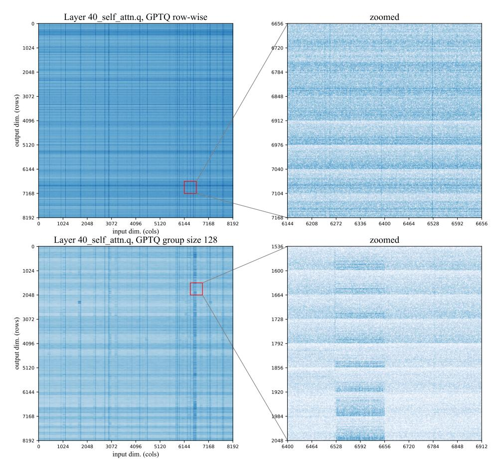
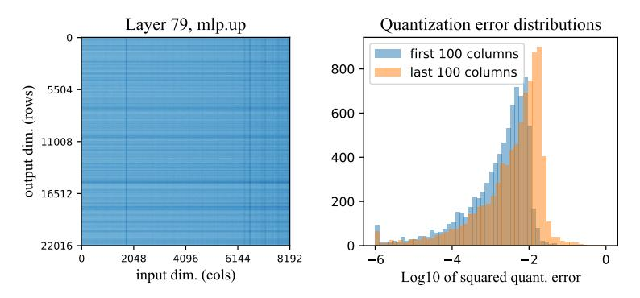
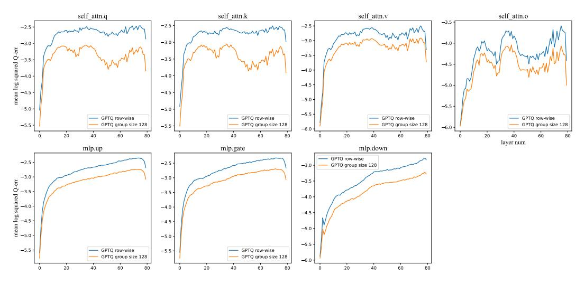
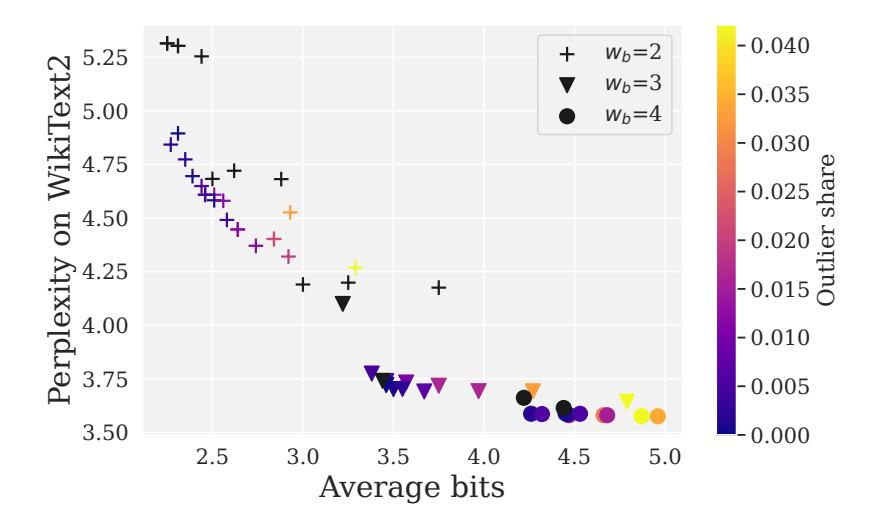

# <span id="page-14-0"></span>A Additional weight sensitivity analysis

In this section, we provide additional visualizations of LLaMA weight sensitivities, as well as additional plots for different layer roles. As we observed earlier in Section [3.2,](#page-3-3) the sensitivity matrices vary based on four main factors:

- the quantization scheme (e.g. row- or group-wise);
- the layer depth, i.e. the index of the corresponding transformer block;
- the role of that weight, e.g. self-attn query / key or MLP up / down projection;
- the location within the chosen weight matrix;

Here, we report additional observations about these factors and elaborate on some of our claims from Section [3.1.](#page-3-2) We also report raw sensitivity matrices for various weight matrices at the end of the supplementary materials.

Relation between sensitivity and the chosen quantization scheme. We compare two configurations of GPTQ 3-bit. The first configuration uses one quantization scale & zero for each row. The second one uses blockwise quantization with one set of statistics for each block of 128 weights.

Figure [5](#page-15-0) demonstrates a typical example of how group size affects sensitivity. In the bottom-right plot, we observe that a subset of weights (width 128) has a significantly higher quantization error

<span id="page-15-0"></span>

Figure 5: The weight sensitivities for LLaMA-65B 40th layer, attention query projection. The color scale represents sensitivity on a logarithmic scale, with higher sensitivity being darker. **(top)** 3-bit GPTO with per-row quantization scales, **(bottom)** 3-bit GPTO with block size 128.

than the rest of the layer. Please note that the color scale represents sensitivity on a logarithmic scale, with higher sensitivity being darker.

On a more detailed examination, we found that this specific group contains a "vertical" outlier, i.e. the corresponding input feature has significantly higher variance, compared to other input dimensions.

In this example, the main effect of GPTQ block size 128 is that the problematic dimension leads to increased sensitivity in a group of  $8192 \times 128$  weights. In turn, GPTQ with per-row statistics has high quantization error across the entire row.

The effect of rotary embeddings. Earlier in Figure 2 we note that attention query and key have a regular pattern of sensitivity that repeats every 64 rows. We attribute this to the fact that LLaMA uses rotary position embeddings. More specifically, this pattern is likely a side-effect of how rotary embeddings are implemented for this model.

To recall, rotary position embeddings are a technique that rotates attention head dimensions by an angle that depends on how many tokens are between key and query [SLP<sup>+</sup>21]. Furthermore, dimensions within each head are rotated with a different frequency. To implement this rotation, LLaMA multiplies each head by a precomputed tensor of sine and cosine functions with a different period. The first half (64 units) of the matrix is multiplied by cosines and the other half (64 units) is multiplied by sines.

To recall, sine and cosine components are equivalent up to a phase shift and show similar behavior in our analysis. In general, we observe that weights that correspond to low-frequency heads (bottom of each semi-head) typically have higher sensitivity. One possible explanation is that high-frequency

heads can be more dependent on position-specific information, such as attending to the previous token — and less dependent on the weights that represent content information. However, this phenomenon merits further investigation and our current understanding should be treated as an educated guess.

**GPTQ** and the effect of quantization order. As we observe earlier in Section 3.2, the rightmost weights in each visualization tend to have higher quantization errors. This is likely a side-effect of the GPTQ algorithm, which compresses weights one input feature at a time, i.e. column by column in a left-to-right direction. Once a column is quantized, the algorithm uses the remaining unquantized weights to compensate for the error. Thus, the rightmost batch of weights accumulates the most error from preceding columns and has the least space to compensate it's "own" quantization error.

<span id="page-16-0"></span>This difference is most pronounced in the earlier layers, where the quantization error is smaller overall (see Figure 6). To further verify this observation, we observe that this effect disappears if we shuffle the weight quantization order in the GPTQ algorithm.



Figure 6: The weight log-sensitivities for a deeper upward projection layer (in particular, this is layer #79). The heatmap on the left represents the sensitivities of each weight, with darker being more sensitive; the histogram on the right captures the sensitivities in the first 100 and last 100 columns (sorted across input dimensions). The latter figure clearly shows that later columns are more sensitive on average.

**Relation between weight sensitivity and layer depth.** In terms of mean squared error, we observe that the first layers of LLaMA tend to have generally lower OBC error (defined as L2 distance between original and quantized layer predictions). To illustrate this, we report the average quantization error of GPTQ-3bit in Figure 7.

<span id="page-16-1"></span>

Figure 7: Figure: mean quantization error (vertical axis) as a function of layer depth (horizontal axis). Each plot corresponds to a different layer role.

The absolute quantization error means little by itself since each quantized layer has a different input/output variance. However, we also observe that the first and last few layers have qualitative differences in behavior. Figures 10 and 11 report weight sensitivities for the first, middle (40th), and last (79th) layer of LLaMA model separately to better illustrate this difference.

### <span id="page-17-0"></span>**B** Experimental Configurations

The SpQR representations proposed in this work have several adjustable hyperparameters that allow for great flexibility in targeting a desired size of the model. We introduce the notation and list the method hyperparameters below:

- $b_w$  number of bits per weight
- $b_s$  number of bits per scale
- $b_z$  number of bits per zero
- $r_o$  outlier rate (fraction of weights that are not quantized)
- $\beta_1$  block size for weight quantization
- $\beta_2$  block size for statistic quantization;
- $\tau$  outlier threshold

The actual number of outliers depends not only on  $\tau$ , but on all other hyperparameters as well. However, for any specific configuration, increasing  $\tau$  leads to reduced number of outliers. To achieve the desired number of outliers, we tune  $\tau$  in [0.1, 1.0] range by binary search with minumum step size 0.05. The vast majority of our configurations are between  $\tau=0.1$  and  $\tau=0.45$ ].

The full configuration we use to compress LLaMA-30B model near-losslessly in Table 1 has the following hyperparameters:  $b_w=4, b_s=b_z=3, \beta_1=\beta_2=16, \tau=0.1$  This translates to the following command line arguments in our supplementary code:

```
python main.py $MODEL custom --custom_data_path=$DATA \
    --wbits 4 --groupsize 16 --perchannel --qq_scale_bits 3 \
    --qq_zero_bits 3 --qq_groupsize 16 --outlier_threshold 0.1 \
    --fit_quantizer_without_outliers --permutation_order act_order
```

### <span id="page-17-1"></span>C Hyperparameter sensitivity

In this section, we analyze how SpQR performance depends on the choice of quantization group sizes. Please recall that the SpQR algorithm uses two types of groups, indexed by parameters  $\beta_1$  and  $\beta_2$ . The first group dimension  $\beta_1$  covers multiple weights for the same input unit, similar to standard blockwise quantization. In turn, the other dimension  $\beta_2$  covers multiple output units, and is used when quantizing quantization scales. In our visualizations,  $\beta_1$  blocks are always horizontal, while  $\beta_2$  are vertical

In Table 5, we evaluate SpQR with varying parameters  $\beta_1$  and  $\beta_2$ . We quantize LLaMA-65B with 3-bit SpQR for weights and statistics and report perplexity on WikiText2, Penn Treebank, and C4 datasets. The upper-left section of the table contains the effective number of bits for each group configuration, and the remaining sections correspond to perplexities on different datasets.

### <span id="page-17-2"></span>D Estimating model size

In this section, we provide a quick way to estimate the compressed model size before running the quantization. We express this estimate in terms of *average bits per parameter* defined as:

$$\bar{b} = \frac{\text{model size in bits}}{\text{number of parameters}} \tag{3}$$

Where model size in bits denotes the total amount of memory - the quantized weights, 1st-order and 2nd-order quantization statistics, outliers and the outlier index - required for the storage of the model. According to Section 4.2, each outlier requires memory storage of  $\sim 32$  bits.

<span id="page-18-1"></span>

|                                                                   |                             |                              | Avera                         | ge bits                       |                         |                         | Wikitext2 Perplexity (3.53) |                             |                               |                              |                               |                        |  |
|-------------------------------------------------------------------|-----------------------------|------------------------------|-------------------------------|-------------------------------|-------------------------|-------------------------|-----------------------------|-----------------------------|-------------------------------|------------------------------|-------------------------------|------------------------|--|
| $\beta_1$ $\beta_2$                                               | 4                           | 8                            | 16                            | 32                            | 64                      | 128                     | 4                           | 8                           | 16                            | 32                           | 64                            | 128                    |  |
| 4                                                                 | 8.5                         | 6.5                          | 5.5                           | 5                             | 4.75                    | 4.625                   | 3.581                       | 3.628                       | 3.715                         | 3.822                        | 4.003                         | 4.23                   |  |
| 8                                                                 | 5.75                        | 4.75                         | 4.25                          | 4                             | 3.875                   | 3.813                   | 3.625                       | 3.64                        | 3.649                         | 3.666                        | 3.688                         | 3.713                  |  |
| 16                                                                | 4.375                       | 3.875                        | 3.625                         | 3.5                           | 3.438                   | 3.406                   | 3.701                       | 3.71                        | 3.728                         | 3.726                        | 3.739                         | 3.741                  |  |
| 32                                                                | 3.688                       | 3.438                        | 3.313                         | 3.25                          | 3.219                   | 3.203                   | 3.803                       | 3.797                       | 3.812                         | 3.812                        | 3.815                         | 3.85                   |  |
| 64                                                                | 3.344                       | 3.219                        | 3.156                         | 3.125                         | 3.109                   | 3.102                   | 3.884                       | 3.901                       | 3.907                         | 3.899                        | 3.928                         | 3.926                  |  |
| 128                                                               | 3.172                       | 3.109                        | 3.078                         | 3.063                         | 3.055                   | 3.051                   | 3.982                       | 3.994                       | 4.005                         | 3.992                        | 4.017                         | 4.013                  |  |
|                                                                   |                             |                              |                               |                               |                         |                         |                             |                             |                               |                              |                               |                        |  |
|                                                                   |                             | C4                           | Perple                        | xity (5.                      | 62)                     |                         |                             | PTI                         | B Perpl                       | exity (6                     | .91)                          |                        |  |
| $\beta_1$ $\beta_2$                                               | 4                           | <b>C4</b> 8                  | Perple                        | 32                            | <b>62</b> )             | 128                     | 4                           | <b>PT</b> 1                 | B Perpl                       | 32                           | <b>.91</b> ) 64               | 128                    |  |
|                                                                   | 4 5.652                     |                              |                               |                               |                         | 128                     | 4 6.934                     |                             |                               |                              |                               | 128<br>7.395           |  |
| $\beta_1$                                                         |                             | 8                            | 16                            | 32                            | 64                      |                         |                             | 8                           | 16                            | 32                           | 64                            |                        |  |
| $\frac{\beta_1}{4}$                                               | 5.652                       | 8<br>5.674                   | 16<br>5.718                   | 32<br>5.796                   | 64<br>5.919             | 6.119                   | 6.934                       | 8 6.965                     | 16<br>7.001                   | 32<br>7.054                  | 64<br>7.194                   | 7.395                  |  |
| $\frac{\beta_1}{4\atop 8}$                                        | 5.652                       | 8<br>5.674<br>5.688          | 16<br>5.718<br>5.696          | 32<br>5.796<br>5.703          | 64<br>5.919<br>5.709    | 6.119<br>5.718          | 6.934                       | 8<br>6.965<br>6.98          | 16<br>7.001<br>6.991          | 32<br>7.054<br>6.99          | 64<br>7.194<br>6.979          | 7.395<br>7.029         |  |
| $ \begin{array}{c c} \beta_1 \\ \hline 4 \\ 8 \\ 16 \end{array} $ | 5.652<br>  5.683<br>  5.735 | 8<br>5.674<br>5.688<br>5.735 | 16<br>5.718<br>5.696<br>5.735 | 32<br>5.796<br>5.703<br>5.738 | 5.919<br>5.709<br>5.741 | 6.119<br>5.718<br>5.749 | 6.934<br>6.962<br>7.018     | 8<br>6.965<br>6.98<br>7.013 | 16<br>7.001<br>6.991<br>7.015 | 32<br>7.054<br>6.99<br>7.016 | 64<br>7.194<br>6.979<br>7.012 | 7.395<br>7.029<br>7.03 |  |

Table 5: Weight block size  $\beta_1$  and statistic block size  $\beta_2$  performance on WikiText2, C4, and Penn Treebank (PTB). The uncompressed baseline value is provided in the corresponding heading.

The storage and computational cost in transformer models are dominated by the linear projections in the attention and feedforward blocks. Consider quantization of a weight matrix (any of these)  $\mathbb{R}^{d_{\text{out}} \times d_{\text{in}}}$  with input dimension  $d_{\text{in}}$  and output dimension  $d_{\text{out}}$ . Then the average number of bits for a given configuration is:

$$\bar{b} \simeq \frac{b_w d_{\rm out} d_{\rm in} + (b_s + b_z) \frac{d_{\rm out} d_{\rm in}}{\beta_1} + 2(16 + 16) \frac{d_{\rm out} d_{\rm in}}{\beta_1 \beta_2}}{d_{\rm out} d_{\rm in}} + 32 r_o = b_w + \frac{b_s + b_z}{\beta_1} + \frac{64}{\beta_1 \beta_2} + 32 r_o \tag{4}$$

Therefore, to increase (decrease) the size of the model one should either increase (decrease) the precision of model weights and quantization statistics or decrease (increase) the block size.

For example, for configuration with  $b_w=3, b_s=3, b_z=3, \beta_1=16, \beta_2=32$  and 0.4% of outliers, the average number of bits is:

$$3 + \frac{3+3}{16} + \frac{64}{16 \cdot 32} + 0.004 \cdot 32 \simeq 3.63$$

#### <span id="page-18-0"></span>E Choice of optimal configuration for fixed average number of bits

As discussed above our method has multiple options for improvement of model performance at the cost of the increase of the model size: number of bits per weight  $w_b$ , groupsizes  $b_1$  and  $b_2$  for 1st and 2nd order quantization and the outlier rate. We evaluated several configurations with various options for the aforementioned parameters on perplexity benchmarks. Results are presented on Figure 8. One can observe that small groups and small fraction of outliers allows to considerably improve model performance, but the gain is diminishing with the number of bits added (when the additional budget from small group is of order 0.1-0.5 of bits per parameter). It is better to store weights in higher precision instead of keeping them in lower precision but with very small groups or keeping large fraction of outliers. In our experiments optimal fraction of outliers is 0.2-0.5% depending on the model and groupsize.

<span id="page-19-2"></span>

Figure 8: Perplexity of WikiText2 vs average number of bits. Different markers denote different  $b_w$ . Black colors correspond to quantization configurations without outliers and the brightness of the color is proportional to the outlier rate.

<span id="page-19-3"></span>

| OPT  |        |          |       |           |       |      |        |          |       |           |       |
|------|--------|----------|-------|-----------|-------|------|--------|----------|-------|-----------|-------|
| Size | Method | Avg bits | Wiki2 | <b>C4</b> | PTB   | Size | Method | Avg bits | Wiki2 | <b>C4</b> | PTB   |
|      | _      | 16.00    | 10.86 | 11.74     | 13.09 |      | _      | 16.00    | 9.56  | 10.69     | 11.84 |
|      | SpQR   | 4.27     | 10.81 | 11.88     | 13.17 |      | SpQR   | 4.26     | 9.50  | 10.73     | 11.88 |
| 6.7B | RTN    | 4        | 12.10 | 13.38     | 16.09 | 30B  | RTN    | 4        | 10.97 | 11.90     | 14.17 |
|      | GPTQ   | 4        | 11.39 | 12.15     | 13.80 |      | GPTQ   | 4        | 9.63  | 10.80     | 11.98 |
|      | SpQR   | 3.94     | 11.04 | 11.98     | 13.33 |      | SpQR   | 3.94     | 9.54  | 10.78     | 11.93 |
|      | -      | 16.00    | 10.12 | 11.20     | 12.34 |      | -      | 16.00    | 9.33  | 10.28     | 11.36 |
|      | SpQR   | 4.27     | 10.22 | 11.27     | 12.41 |      | SpQR   | 4.23     | 9.37  | 10.32     | 11.40 |
| 13B  | RTN    | 4        | 11.32 | 12.35     | 15.4  | 66B  | RTN    | 4        | 110   | 249       | 274   |
|      | GPTQ   | 4        | 10.31 | 11.36     | 12.58 |      | GPTQ   | 4        | 9.55  | 10.50     | 11.58 |
|      | SpQR   | 3.93     | 10.28 | 11.34     | 12.52 |      | SpQR   | 3.91     | 9.32  | 10.35     | 11.43 |

Table 6: Perplexity on WikiText2 [MXBS16], C4 [RSR+20] and Penn Treebank [MKM+94] for SpQR and round-to-nearest (RTN) and GPTQ baselines with OPT. We can see that SpQR reaches performances within 1% of the perplexity with less than 4.3 bits per parameter. We also see that for 4-bits per parameter SpQR significantly improves on GPTQ with an improvement as large as the improvement from RTN to GPTQ.

### <span id="page-19-0"></span>F Additional results for near-lossless compression

In this section we report the list of quantization configurations for OPT in Table 6 on WikiText2, Penn Treebank, and C4 datasets.

In addition we report results for LM eval harness for LLaMa Table 7. and recently released Falcon models - Falcon-7B and Falcon-40B Table 8.

### <span id="page-19-1"></span>G Choice of optimal LLM configuration for specific hardware

In the preceding discussion, we were searching for optimal model configuration given some compression target without targeting any specific hardware or device. However, the question practitioner

LLaMA

<span id="page-20-0"></span>

| Size | Method | Avg bits | Winogrande | Piqa  | Hellaswag | Arc easy | Arc challenge | Avg score |
|------|--------|----------|------------|-------|-----------|----------|---------------|-----------|
|      | –      | 16.00    | 67.09      | 78.32 | 56.41     | 67.38    | 38.23         | 61.492    |
|      | SpQR   | 4.63     | 67.48      | 78.45 | 56.01     | 67.13    | 38.23         | 61.460    |
| 7B   | RTN    | 4        | 64.72      | 76.44 | 53.49     | 63.51    | 36.60         | 58.952    |
|      | GPTQ   | 4        | 65.35      | 77.58 | 54.99     | 63.55    | 36.35         | 59.564    |
|      | SpQR   | 3.45     | 67.48      | 78.13 | 55.27     | 65.87    | 38.05         | 60.960    |
|      | –      | 16.00    | 70.09      | 78.89 | 59.11     | 74.54    | 43.94         | 65.314    |
|      | SpQR   | 4.63     | 69.77      | 78.94 | 59.02     | 74.37    | 43.17         | 65.054    |
| 13B  | RTN    | 4        | 69.61      | 78.24 | 57.34     | 72.56    | 42.58         | 64.066    |
|      | GPTQ   | 4        | 69.06      | 78.40 | 58.04     | 73.23    | 43.26         | 64.398    |
|      | SpQR   | 3.45     | 68.90      | 78.73 | 58.22     | 73.27    | 42.75         | 64.374    |
|      | –      | 16.00    | 72.93      | 80.96 | 62.66     | 75.34    | 46.76         | 67.730    |
|      | SpQR   | 4.69     | 72.93      | 81.01 | 62.50     | 76.05    | 47.18         | 67.934    |
| 30B  | RTN    | 4        | 72.06      | 79.05 | 60.61     | 70.66    | 42.24         | 64.924    |
|      | GPTQ   | 4        | 72.61      | 79.92 | 61.07     | 71.8     | 44.28         | 65.936    |
|      | SpQR   | 3.49     | 73.32      | 80.47 | 61.96     | 74.75    | 46.93         | 67.486    |
|      | –      | 16.00    | 77.43      | 81.50 | 63.95     | 75.17    | 47.10         | 69.030    |
|      | SpQR   | 4.71     | 76.95      | 81.56 | 63.76     | 75.25    | 46.93         | 68.890    |
| 65B  | RTN    | 4        | 75.14      | 81.45 | 62.79     | 72.64    | 44.97         | 67.398    |
|      | GPTQ   | 4        | 75.85      | 80.79 | 62.91     | 74.20    | 46.59         | 68.068    |
|      | SpQR   | 3.52     | 76.09      | 81.18 | 63.54     | 74.37    | 45.05         | 68.046    |

Table 7: LM eval harness results on LLaMA models.

#### Falcon

<span id="page-20-1"></span>

| Size | Method | Avg bits | Winogrande | Piqa  | Hellaswag | Arc easy | Arc challenge | Avg score |
|------|--------|----------|------------|-------|-----------|----------|---------------|-----------|
|      | –      | 16.00    | 67.32      | 79.49 | 57.77     | 74.71    | 40.1 0        | 63.878    |
|      | SpQR   | 4.44     | 67.09      | 79.16 | 57.21     | 73.86    | 38.99         | 63.262    |
| 7B   | RTN    | 4.00     | 65.51      | 77.37 | 51.86     | 68.69    | 33.7          | 59.426    |
|      | GPTQ   | 4.00     | 66.38      | 79.11 | 56.68     | 73.15    | 38.48         | 62.760    |
|      | SpQR   | 3.49     | 67.88      | 79.54 | 57.08     | 74.03    | 39.08         | 63.522    |
|      | –      | 16.00    | 76.62      | 82.32 | 64.06     | 82.03    | 50.26         | 71.058    |
|      | SpQR   | 4.46     | 76.48      | 82.1  | 63.8      | 81.78    | 50.77         | 70.986    |
| 40B  | RTN    | 4.00     | 75.69      | 80.30 | 60.52     | 79.92    | 49.83         | 69.252    |
|      | GPTQ   | 4.00     | 75.93      | 81.23 | 63.05     | 80.85    | 50.00         | 70.212    |
|      | SpQR   | 3.45     | 76.32      | 81.77 | 63.70     | 81.10    | 49.83         | 70.544    |

Table 8: LM eval harness results on Falcon models.

willing to deploy a model for a specific application would ask is: What is the best model and compression setup for a given memory constraint?

<span id="page-21-3"></span>In this section, we provide a list of recommendations for the choice of the best LLaMA model and the corresponding compression level that fits into the device memory (RAM or VRAM) without the need of offloading model parameters and activations. We cover a range of available budgets from mobile devices to high-end workstation GPUs. Recommendations are presented in Table [9.](#page-21-3)

| Device          | Memory (GiB) | LLaMA     | b              |
|-----------------|--------------|-----------|----------------|
| iPhone13        | 4            | 7B        | ≤ 3.5          |
| iPhone14        | 6            | 7B<br>13B | ≃ 4.5<br>≤ 3.5 |
| Consumer laptop | 8            | 13B       | ≤ 4            |
| RTX4070         | 10-12        | 14B       | ≃ 4.5          |
| RTX4080         | 16           | 30B       | ≤ 4            |
| RTX4090         | 24           | 30B       | ≃ 4.5          |
| V100            | 32           | 65B       | ≤ 3.5          |
| A6000           | 48           | 65B       | ≃ 4.5          |

Table 9: Choice of the best LLaMA for a given memory constraint.

