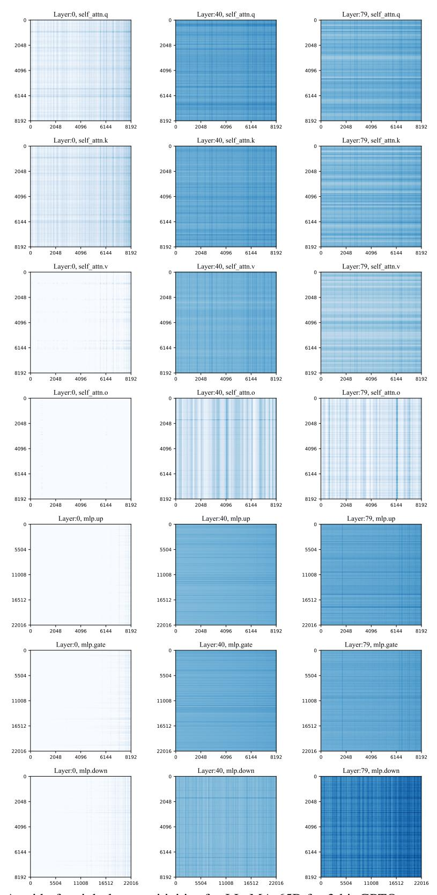
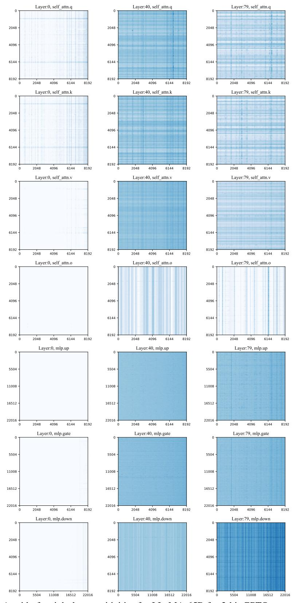

# J Broader impact

Our method enables the deployment of high-quality LLMs in the 7-13B parameters range to memorylimited devices such as laptops and phones. With our method, it is possible to develop specialized 7B LLMs in hassle-free 16-bit and then enable the deployment of such LLMs to phones by applying SpQR. Since SpQR is practically lossless, this ensures a reliable performance level for deployed LLMs which is important for consumer applications. Since mobile phones are ubiquitous and LLMs

| Prompt:    | Every time data scientist Kim ran her new algorithm, it kept outputting the same unexpected result: a recipe for                                                                                                                       |
|------------|----------------------------------------------------------------------------------------------------------------------------------------------------------------------------------------------------------------------------------------------|
| 16bit:     | iced tea. Kim was working on a project to predict the likelihood of a patient being readmitted to the hospital within 30 days of discharge. She was using a machine learning algorithm to analyze the data, and the algorithm |
| SpQR:      | iced tea. Kim was working on a project to predict the likelihood of a patient being readmitted to the hospital within 30 days of discharge. She had been given a dataset of 100,000                                              |
| RTN 4-bit: | iced tea. "I'm not sure what's going on," she said. "I've been running it for days, and it keeps giving me the same result." "I'm not sure what's going on                                                                       |
| Prompt:    | Data scientist Grace was working late one night when she discovered a glitch in the matrix of her data. It spelled out                                                                                                                 |
| 16bit:     | 100% proof that the world was going to end in 10 days. She tried to tell her boss, but he didn't believe her. She tried to tell her friends, but they didn't believe her                                                         |
| SpQR:      | 100% proof that the world was going to end in 10 days. She tried to tell her boss, but he just laughed and said, "I'm not going to believe in some data glitch." She                                                                |
| RTN 4-bit: | 100% in binary code. She was so excited she ran to tell her boss, but he was busy. She ran to tell her colleague, but he was busy. She ran to tell her friend, but she                                                           |
| Prompt:    | Last Tuesday, just as the sun was setting, my neighbor's dog, Rover, started to speak to me in perfect French. He said                                                                                                                 |
| 16bit:     | "Je suis un chien." I was shocked. I said, "Moi aussi." I'm not sure what to make of this. I'm not sure what to make of anything. I'm                                                                                            |
| SpQR:      | not sure what "Je suis un chien." I was shocked. I said, "Rover, you can speak French?" He said, "Oui, je parle francais." I said, "How did you                                                                                     |
| RTN 4-bit: | learn to speak French?" "Bonjour, Monsieur. Je m'appelle Rover. Je suis un chien. Je suis un chien français. Je suis un chien français qui parle français. Je suis un chien français qui parle français              |
| Prompt:    | In a parallel universe where cats are the rulers of Earth, our feline king was pondering his first decree                                                                                                                                 |
| 16bit:     | " to make all dogs illegal. "I"m not sure that"s a good idea," said his chief adviser, a cat named Whiskers. "Why not?" asked the king.                                                                                             |
| SpQR:      | "Because, " to make all dogs illegal. "I"m not sure that"s a good idea," said his chief adviser, a cat named Whiskers. "Why not?" asked the king. "Because,                                                                   |
| RTN 4-bit: | " to make the world a better place for cats. He was about to sign the decree when he was interrupted by a knock on the door. "Come in," he said. The door opened and a cat entered.                                           |

Figure 9: Texts generated by different quantized LLaMA-65B models with the same prompt.

Figure 10: A grid of weight log-sensitivities for LLaMA-65B for 3-bit GPTQ compression with per-row quantization statistics. Each row corresponds to a specific layer type (e.g. attention query, mlp gate), and the columns represent layer depth.

Figure 11: A grid of weight log-sensitivities for LLaMA-65B for 3-bit GPTQ compression with group-wise quantization of block size 128. Each row corresponds to a specific layer type (e.g. attention query, mlp gate), and the columns represent layer depth.

powerful general-purpose tools, SpQR might have a wide-reaching effect on how LLMs are used by the general population to complete useful tasks.

LLMs are inherently a dual-use technology that can bring both significant benefits and serious harm. The ethical and societal risks of LLMs range from deliberate malicious use (e.g. generating spam) and accidental misuse to adverse economic side-effects [\[WMR](#page-13-6)+21]. However, we believe that the marginal impact of SpQR will be positive or neutral since the LLMs we use are already openly available. Better quantization algorithms like SpQR let users with low-end devices run larger and generally more accurate language models. In other words, our algorithm does not create models with new capabilities (and risks): it only makes existing models more accessible.

