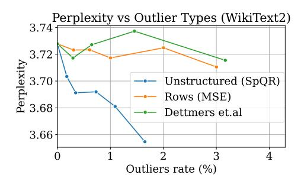

# 5 Experimental Validation

Experimental setup. We focus on three main settings: 1) evaluating what is the most compact representation with which SpQR can replicate the performance of a 16-bit model within 1% perplexity, 2) controlling for the average number of bits per parameter across methods and assess the performance of SpQR compared to round-to-nearest and GPTQ baselines, 3) what is the best trade-off in terms of model size and performance. For these settings, we evaluate the full SpQR algorithm on publicly-available LLMs. We focus on the LLaMA {7, 13, 30, 65}B model family [\[TLI](#page-12-2)+23] and Falcon{7, 40}B model family [\[UAE23a\]](#page-12-10). We quantize LLaMa models using the RedPajama dataset and Falcon models on RefinedWeb dataset [\[UAE23b\]](#page-12-11), publicly-available replicas of the LLaMA and Falcon training data, respectively. In addition, we provide perplexity results for OPT models in Appendix [F.](#page-19-0)

We compare SpQR against two other post-training quantization schemes: GPTQ [\[FAHA22\]](#page-11-2) and simple rounding-to-nearest (RTN) quantization, which is used by most other LLM compression methods [\[DLBZ22,](#page-10-4) [YAZ](#page-13-4)+22]. Both baselines use 4-bit quantization since it provides the best quality to size trade-off [\[DZ22\]](#page-11-3). For SpQR, we consider both 3-bit and 4-bit base quantization, though the resulting model size can be slightly larger due to the presence of outliers.

We evaluate quantized model performance by two metrics. Firstly, we measure *perplexity*, measured on the WikiText2 [\[MXBS16\]](#page-11-13), Penn Treebank [\[MKM](#page-11-14)+94] and C4 [\[RSR](#page-12-5)+20] datasets. Secondly, we measure zero-shot accuracy on five tasks: WinoGrande [\[SBBC21\]](#page-12-12), PiQA [\[TP03\]](#page-12-13), HellaSwag, ARC-easy and ARC-challenge [\[CCE](#page-10-5)+18]. We use the LM Evaluation Harness [\[GTB](#page-11-15)+21] with

#### LLaMa

| Size | Method | Avg bits | Wiki2 | C4   | PTB   | Size | Method | Avg bits | Wiki2 | C4   | PTB  |
|------|--------|----------|-------|------|-------|------|--------|----------|-------|------|------|
|      | –      | 16.00    | 5.68  | 7.08 | 8.80  |      | –      | 16.00    | 4.10  | 5.98 | 7.30 |
|      | SpQR   | 4.63     | 5.73  | 7.13 | 8.88  |      | SpQR   | 4.69     | 4.14  | 6.01 | 7.33 |
| 7B   | RTN    | 4        | 6.43  | 7.93 | 10.30 | 30B  | RTN    | 4        | 4.57  | 6.34 | 7.75 |
|      | GPTQ   | 4        | 6.13  | 7.43 | 9.27  |      | GPTQ   | 4        | 4.48  | 6.20 | 7.54 |
|      | SpQR   | 3.94     | 5.87  | 7.28 | 9.07  |      | SpQR   | 3.89     | 4.25  | 6.08 | 7.38 |
|      | –      | 16.00    | 5.09  | 6.61 | 8.07  |      | –      | 16.00    | 3.53  | 5.62 | 6.91 |
|      | SpQR   | 4.63     | 5.13  | 6.64 | 8.13  |      | SpQR   | 4.71     | 3.57  | 5.64 | 6.93 |
| 13B  | RTN    | 4        | 5.55  | 6.98 | 8.65  | 65B  | RTN    | 4        | 3.87  | 5.85 | 7.17 |
|      | GPTQ   | 4        | 5.40  | 6.84 | 8.44  |      | GPTQ   | 4        | 3.83  | 5.80 | 7.07 |
|      | SpQR   | 3.96     | 5.22  | 6.72 | 8.22  |      | SpQR   | 3.90     | 3.68  | 5.70 | 6.99 |

Table 1: Perplexity on WikiText2 [\[MXBS16\]](#page-11-13), C4 [\[RSR](#page-12-5)+20] and Penn Treebank [\[MKM](#page-11-14)+94] for SpQR and round-to-nearest (RTN) and GPTQ baselines with LLaMa. We can see that SpQR reaches performances within 1% of the perplexity with less than 4.71 bits per parameter. We also see that for 4-bits per parameter SpQR significantly improves on GPTQ with an improvement as large as the improvement from RTN to GPTQ.

recommended parameters. We provide full configurations in Appendix [B,](#page-17-0) as well as code which we plan to release publicly. Our implementation takes around 4.5 hours on the largest model size (65B) on an NVIDIA A100 and about 6 on an A6000.

To control for model size, we evaluate RTN and GPTQ with 4-bit base quantization. For SpQR we use 3-bit base quantization, a group size of 8 with 3-bit for the first quantization, a group size of 64 for the second quantization, and as many outliers as possible to still reach less than 4-bits per parameter on average. We aim to achieve *near-lossless* compression, for which we adopt the definition of the MLCommons benchmark [\[RCK](#page-12-14)+20]: 1% error relative to the uncompressed baseline. In all SpQR evaluations, we choose τ such that the proportion of outliers is under 1%.

Main Results. Figure [1](#page-1-0) measures actual model size versus perplexity on LLaMa models on WikiText2, and accuracy on zero-shot tasks. We observe that SpQR outperforms GPTQ (and correspondingly RTN) at similar model size by a significant margin, especially on smaller models. This improvement comes from both SpQR achieving more compression, while also reducing loss degradation. In addition, if we measure the bits per parameter needed to come within 1% of the 16-bit performance in terms of perplexity, Figure [1](#page-1-0) shows that SpQR with 4.6 to 4.71 bits per parameter approaches the non-quantized models with at most 1% margin of error for all models (see Table [1](#page-8-0) and Table [2](#page-9-1) for exact values).

The second set of results, presented in Table [1](#page-8-0) for LLaMa and Table [2](#page-9-1) for Falcon family models, controls model size by comparing SpQR and baseline methods with 4 bits per parameter. These results show that SpQR improves over previous methods, with the gap between SpQR and the next best method GPTQ being as large as the improvement of GPTQ over naive RTN. For 4-bit, SpQR halves the error relative to the 16-bit baseline compared to GPTQ.

Ablations. The SpQR representation differs from standard quantization methods in two main ways: bilevel quantization with small quantization group size and unstructured outliers. To understand the effect of small group sizes, we compare 3-bit SpQR with group size 16, compressed using 3-bit bilevel quantization, versus a setup with group size 48, keeping quantization statistics in 16-bit. Both configurations result in approximately 3.6 average bits per parameter. For simplicity, neither uses outliers. We report both in Table [3,](#page-9-0) the "3-bit statistics" entry corresponds to group size 16 with 3-bit statistics and "16-bit statistics" stands for group size 16 with 16-bit statistics. Given the same (slightly smaller) memory footprint, using quantized statistics significantly improves language modeling loss.

Next, we ask whether it is necessary to use unstructured outliers, considering two outlier types. First, we use the criterion of Dettmers et al. [\[DZ22\]](#page-11-3) to find column outliers and quantize them in higher precision. The alternative is to treat the entire rows (output units / hidden units / neurons) as outliers: we run SpQR without outliers, then select k output units that have the highest quantization error (i.e.

#### Falcon

| Size | Method | Avg bits | Wiki2 | C4    | PTB    | Size | Method | Avg bits | Wiki2 | C4   | PTB   |
|------|--------|----------|-------|-------|--------|------|--------|----------|-------|------|-------|
|      | _      | 16.00    | 6.59  | 9.50  | 9.90   |      | _      | 16.00    | 5.23  | 7.76 | 7.83  |
|      | SpQR   | 4.44     | 6.64  | 9.58  | 9.97   |      | SpQR   | 4.46     | 5.26  | 7.79 | 7.86  |
| 7B   | RTN    | 4        | 8.73  | 12.56 | 13.76  | 40B  | RTN    | 4        | 6.52  | 9.76 | 10.63 |
|      | GPTQ   | 4        | 6.91  | 9.93  | 10.33  |      | GPTQ   | 4        | 5.36  | 7.95 | 8.01  |
|      | SpQR   | 3.92     | 6.74  | 9.70  | 19.114 |      | SpQR   | 3.90     | 5.29  | 7.85 | 7.91  |

Table 2: Perplexity on WikiText2 [MXBS16], C4 [RSR+20] and Penn Treebank [MKM+94] for SpQR and round-to-nearest (RTN) and GPTQ baselines on Falcon model. We can see that SpQR reaches performances within 1% of the perplexity with less than 4.5 bits per parameter. We also see that for 4-bits per parameter SpQR significantly improves on GPTQ with an improvement as large as the improvement from RTN to GPTO.

| Name              | Wiki2 | C4   | PTB  | Avg bits |
|-------------------|-------|------|------|----------|
| Uncompressed      | 3.53  | 5.62 | 6.91 | 16       |
| GPTQ (4 bit)      | 3.83  | 5.80 | 7.07 | 4        |
| 3-bit statistics  | 3.74  | 5.73 | 7.02 | 3.63     |
| 16-bit statistics | 3.84  | 5.83 | 7.12 | 3.67     |
| Round zero        | 3.75  | 5.76 | 7.01 | 3.63     |
| w/o act order     | 3.74  | 5.76 | 7.05 | 3.63     |

Table 3: Perplexity for LLaMA-65B model.

Figure 4: Different outlier types, LLaMA-65B.

MSE between layer predictions) and treat the entire rows as 16-bit outliers. We compare the three outlier types on top of 3-bit SpQR and report the results in Figure 4. Overall, unstructured outliers reduce perplexity significantly faster than their row counterpart and the criterion of [DZ22], even after accounting for the different memory footprint.

Finally, we analyze the impact of the minor hyperparameter changes that we introduced at the end of Section 4. In Table 3 (bottom), we evaluate quantization errors without these changes. The "Round zero" entry corresponds to a version of SpQR where the zero-point is a 3-bit integer. This reduces the memory footprint of SpQR, but results in a moderate increase in perplexity. Similarly, we evaluate SpQR without the "act order" flag. This option re-orders the input dimensions by the diagonal of the inverse hessian, which was introduced as a part of the GPTQ algorithm. Using this heuristic slightly improves loss, though not as much as from quantized groups.

To summarize, both small quantized groups and unstructured outliers independently improve perplexity and perform better than alternative strategies. SpQR also benefits from using the GPTQ activation order heuristic, though the gain is smaller than from outliers or small groups. Still, we opt to use the same activation order heuristic in the GPTQ baselines to ensure a fair comparison. To further explore the design space of SpQR, we provide an additional hyperparameter study in Appendix C.

**Inference Time.** Finally, we evaluate the inference speed of SpQR for autoregressive inference with a focus on measuring the token generation latency with batch size 1 on a single A100 GPU. We measure inference speed in two setups: i) generating 100 tokens from scratch and ii) adding 100 tokens on top of a 1024-token prefix (prompt). We compare our specialized sparse matrix multiplication algorithm with the algorithm implemented in PyTorch (cuSPARSE). We also compare against a 16-bit baseline. We measure the end-to-end latency as inference steps per second for the full SpQR algorithm, that is for both the dense and sparse multiplication part together.

Results are shown in Table 4. We can see that while standard sparse matrix multiplication in PyTorch is not faster than 16-bit inference, our specialized sparse matrix multiplication algorithm yields speedups of about 20-30%.

| Method fp16 (baseline) |    |     | SpQR (PyTorch) |     |    |     |                                                                                                                | SpQR (optimized) |    |     |     |     |
|---------------------------|----|-----|----------------|-----|----|-----|----------------------------------------------------------------------------------------------------------------|------------------|----|-----|-----|-----|
| LLaMA                     | 7B | 13B | 30B            | 65B | 7B | 13B | 30B                                                                                                            | 65B              | 7B | 13B | 30B | 65B |
| scratch                   |    |     |                |     |    |     | 47 ± 2.3 37 ± 0.8 19 ± 1.1 OOM 30 ± 2.2 24 ± 1.2 8.8 ± 0.4 OOM 57 ± 2.4 44 ± 0.5 22 ± 0.9 12 ± 0.6             |                  |    |     |     |     |
|                           |    |     |                |     |    |     | prefix 1024 46 ± 2.4 31 ± 0.9 17 ± 0.8 OOM 27 ± 1.6 21 ± 1.1 6.5 ± 0.7 OOM 55 ± 2.1 37 ± 0.8 22 ± 1.3 11 ± 0.6 |                  |    |     |     |     |

Table 4: Inference speed comparison (tokens/s), OOM means the model did not fit in an A100 GPU. We see that our optimized SpQR algorithm is faster than the 16-bit baseline and almost 2.0x faster than quantized matrix multiplication + standard PyTorch sparse matrix multiplication baseline.

