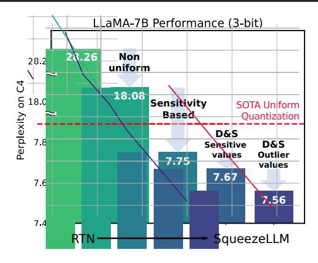
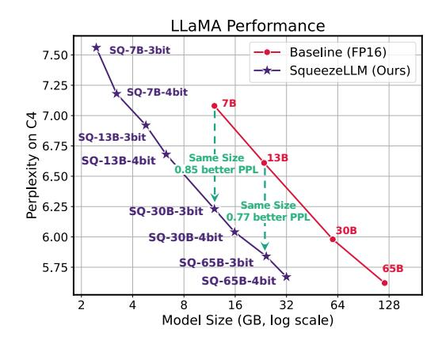

# 1. Introduction

Recent advances in Large Language Models (LLMs) trained on massive text corpora, with up to hundreds of billions of parameters, have showcased their remarkable problemsolving capabilities across various domains [\(Brown et al.,](#page-9-0) [2020;](#page-9-0) [Chowdhery et al.,](#page-9-1) [2023;](#page-9-1) [Du et al.,](#page-9-2) [2022;](#page-9-2) [Hoffmann](#page-10-0) [et al.,](#page-10-0) [2022;](#page-10-0) [Raffel et al.,](#page-10-1) [2020;](#page-10-1) [Scao et al.,](#page-10-2) [2022;](#page-10-2) [Smith](#page-10-3) [et al.,](#page-10-3) [2022;](#page-10-3) [Thoppilan et al.,](#page-10-4) [2022;](#page-10-4) [Touvron et al.,](#page-10-5) [2023a;](#page-10-5) [Zhang et al.,](#page-11-0) [2022\)](#page-11-0). However, deploying these models for inference has been a significant challenge due to their demanding resource requirements. For instance, the LLaMA-65B model requires at least 130GB of RAM to deploy in FP16, which exceeds current GPU capacity. Even storing such large-sized models has become costly and complex.

As will be discussed in Sec. [3,](#page-2-0) the main performance bottleneck in LLM inference for generative tasks is memory bandwidth rather than compute. This means that the speed at which we can load and store parameters becomes the primary latency bottleneck for memory-bound problems, rather than arithmetic computations. However, recent advancements in memory bandwidth technology have been significantly slow, compared to the improvements in computes, leading to the phenomenon known as the Memory Wall [\(Gholami et al.,](#page-9-3) [2024;](#page-9-3) [Patterson,](#page-10-6) [2004\)](#page-10-6). Consequently, researchers have turned their attention to exploring algorithmic methods to overcome this challenge.

One promising approach is quantization, where model parameters are stored at lower precision, instead of the typical 16 or 32-bit precision used for training. For instance, it has been demonstrated that LLM models can be stored in 8-bit precision without performance degradation [\(Yao](#page-11-1) [et al.,](#page-11-1) [2022\)](#page-11-1), where 8-bit quantization not only improves the storage requirements by half but also has the potential to improve inference latency and throughput. As a result, there has been significant research interest in quantizing models to even lower precisions. A pioneering approach is GPTQ [\(Frantar et al.,](#page-9-4) [2022\)](#page-9-4) which uses a training-free quantization technique that achieves near-lossless 4-bit quantization for LLM models with over tens of billions of parameters. However, achieving high quantization performance remains challenging, particularly with lower bit precision and for relatively smaller models (e.g., < 50B parameters).

\*Equal contribution 1UC Berkeley 2 ICSI 3LBNL. Correspondence to: Amir Gholami <amirgh@berkeley.edu>.

Figure 1. (Left) SqueezeLLM incorporates two key approaches: (i) sensitivity-based non-uniform quantization (Sec. [4.1\)](#page-3-0), where quantization bins are allocated closer to sensitive values, and (ii) the Dense-and-Sparse decomposition (Sec. [4.2\)](#page-4-0), which retains both sensitive values and outlier values as full-precision sparse format. When applied to LLaMA-7B with 3-bit quantization, our method outperforms the state-of-the-art methods [\(Frantar et al.,](#page-9-4) [2022;](#page-9-4) [Lin et al.,](#page-10-7) [2023\)](#page-10-7) by a large perplexity margin of over 0.3 on the C4 benchmark. (Right) By applying our methods to LLaMA models of varying sizes, we can achieve improved trade-offs between perplexity and model size.

Contributions. In this paper, we conduct an extensive study of low-bit precision quantization, and we identify limitations in existing approaches. Based on the insight that *the memory, rather than the compute, is the primary bottleneck* in LLM inference with generative tasks, we introduce SqueezeLLM, a post-training quantization framework with a novel *sensitivity-based non-uniform quantization* and *Dense-and-Sparse decomposition*. These techniques enable lossless compression even at precisions as low as 3 bits with reduced model sizes and faster inference without compromising model performance. Our detailed contributions include:

- Sensitivity-based Non-Uniform Quantization: We demonstrate that uniform quantization of prior works is sub-optimal for LLM inference for two reasons. First, the weight distributions in LLMs exhibit clear non-uniform patterns (Fig. [3\)](#page-3-1). Second, the inference computation in prior works does not fully benefit from uniform quantization as the arithmetic is performed in FP16 precision, not in reduced precision. To address these, we propose a novel sensitivity-based non-uniform quantization method to achieve more optimal LLM quantization, which significantly improves the perplexity of 3-bit LLaMA-7B from 28.26 of uniform quantization to 7.75 on C4 (Sec. [4.1\)](#page-3-0).
- Dense-and-Sparse Quantization: The weights in LLMs contain significant outliers, making low-bit quantization extremely challenging. To address this, we propose a simple solution that decomposes weights into dense and sparse components. The sparse part holds outlier values in full precision using efficient sparse storage methods, and the dense part can have a more compact range to aid quantization. By extracting only 0.45% of the weight values as the sparse component, we further improve the perplexity of LLaMA-7B from 7.75 to 7.58 on C4 (Sec. [4.2\)](#page-4-0).

• Evaluation: We extensively test SqueezeLLM on various models on language modeling tasks using the C4 and WikiText2 datasets as well as on the MMLU [\(Hendrycks](#page-10-8) [et al.,](#page-10-8) [2021\)](#page-10-8) and Vicuna benchmarks [\(Chiang et al.,](#page-9-5) [2023\)](#page-9-5) (Sec. [5.3\)](#page-7-0). Furthermore, our deployed models on A6000 GPUs also exhibit significant latency gains of up to 2.4× compared to the FP16 baseline, showcasing the effectiveness of our method in terms of both quantization performance and inference efficiency (Sec. [5.4\)](#page-7-1).

