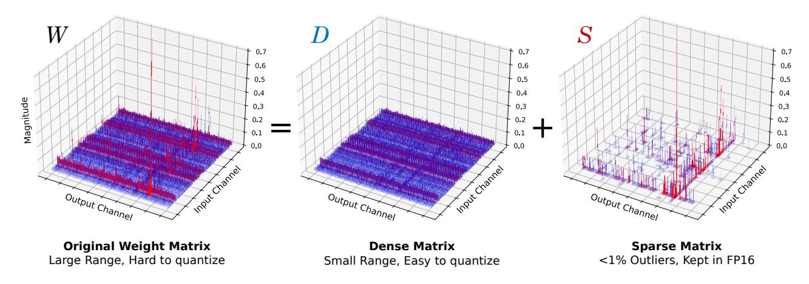

# 2. Related Work

LLM Quantization. In Appendix [A,](#page-12-0) we offer an overview and related works of Transformer quantization, with an emphasis on Post-Training Quantization (PTQ), which is the primary focus of our work. With the increasing popularity of LLMs, *weight-only quantization* has surfaced as a promising approach to reduce memory consumption and enhance inference efficiency. GPTQ [\(Frantar et al.,](#page-9-4) [2022\)](#page-9-4) has been a pioneering work, and AWQ [\(Lin et al.,](#page-10-7) [2023\)](#page-10-7) and SpQR [\(Dettmers et al.,](#page-9-6) [2023\)](#page-9-6) have also suggested the weight-only quantization schemes concurrent to our work. Our work, however, is different in two key aspects. First, our work employs non-uniform quantization, as opposed to uniform quantization of the aforementioned works. In particular, our sensitivity-based non-uniform quantization not only better represents non-uniform distributions of weights, but it also strategically reduces the impact on more sensitive values, thereby enabling more aggressive quantization without performance degradation. Second, while previous works quantize weights in a way that layer-wise output activations remain unaffected, our approach targets preserving the model's final output. This strategy of minimizing the final loss, as shown in Appendix [D.4,](#page-15-0) leads to better quantization performance since it is a direct measure of the end-to-end performance degradation after quantization.

Non-uniform Quantization. For low-bit LLM quantization, (Dettmers et al., 2024) has recently introduced the NF datatype, highlighting the importance of non-uniform quantization. However, our approach differs by offering a more dynamic non-uniform representation that accounts for both weight distributions and sensitivity of values, as opposed to the static, hard-coded NF datatype that assumes the normal distribution of the weights. While previous studies (Han et al., 2016; Xu et al., 2018) have used k-means clustering in quantization, our work pioneers its application in LLM quantization. Furthermore, we introduce the novel sensitivity-based weighted k-means clustering strategy, enabling lossless sub-4-bit quantization by significantly reducing performance degradation, in contrast to the sensitivity-agnostic counterpart (Fig. 1).

Outlier-Aware Quantization. Among the various challenges in low-bit Transformer quantization, one key issue is the presence of outliers (Kovaleva et al., 2021), which can unnecessarily increase the quantization range. To address this issue, outlier-aware quantization methods have been investigated (Bondarenko et al., 2021; Dettmers et al.; Wei et al., 2022; 2023; Xiao et al., 2023). Notably, (Dettmers et al.) keeps outlier activations in floating-point, while (Wei et al., 2022) transfers outlier factors to later layers without affecting functionality. These focus on activations, which is not a concern in our work where all activations are in floating-point. Our Dense-and-Sparse quantization instead tackles weight outliers for low-bit LLM quantization.

Concurrently to our work, SpQR (Dettmers et al., 2023) also explores outlier extraction in the context of weight quantization. While SpQR has shown a promising result on outlier extraction, SqueezeLLM, leveraging sensitivity-based non-uniform quantization, achieves precise quantization with significantly lower (e.g., 0.05%) or even zero sparsity levels. This is critical for both reducing model size and improving inference speed, as higher sparsity often degrades latency. Furthermore, SqueezeLLM uses outlier extraction as a direct solution to prevent outliers from negatively impacting quantization performance, bypassing the need for using the grouping strategy as an indirect solution. This contrasts with SpQR, which relies on fine-grained grouping that leads to increased model size and a more complex quantization process such as the bi-level quantization scheme.

Dense-and-Sparse Decomposition. Matrix decomposition into dense and sparse components has been explored in attention map decomposition (Chen et al., 2021; Dass et al., 2023), leveraging the fact that attention patterns often present low-rank characteristics with a few outliers. To the best of our knowledge, however, our research is the first to apply the dense-and-sparse decomposition strategy to weight matrices to improve quantization performance. Additionally, we uniquely incorporate both outlier and sensitive

Figure 2. Normalized runtime for LLaMA-7B when reducing the bit precision for the weights with sequence lengths of 128 (left) and 2048 (right). Results were obtained using a roofline-based performance model for an A5000 GPU. Reducing only the precision of the weights (and not the activations) is sufficient to obtain significant latency reductions.

values within the sparse matrix, which yields considerable improvement in post-quantization performance.

## 3. Memory Wall

Inference behavior broadly falls into two categories: compute-bound inference that is limited by computational throughput, and memory-bound inference that is bottle-necked by the rate at which data can be fed into the processing cores from memory. Arithmetic intensity, the ratio of compute to memory operations, is a typical metric used to assess this behavior. High and low arithmetic intensity indicates a compute-bound and memory-bound problem, respectively. For memory-bound problems, the speedup can be achieved by reducing the memory traffic rather than compute since the compute units in hardware are often underutilized waiting to receive data from memory.

Generative LLM inference exhibits extremely low arithmetic intensity compared to other workloads1 (Kim et al., 2023). This is because it consists almost entirely of matrix-vector operations, which limits the data reuse as each weight load can only process a single vector for a single token, and cannot be amortized across the multiple vectors for different tokens. This low arithmetic intensity needs to be contrasted with the compute operations on a typical GPU which is orders of magnitude higher than the memory operations.2 The disparity between compute and memory bandwidth, along with the growing memory requirements of deep learning, has been termed the *Memory Wall* problem (Gholami et al., 2024). To further illustrate this problem, we used a simple roofline-based performance modeling approach (Kim et al.,

&lt;sup>1To be precise, we limit this discussion to single batch inference where the arithmetic involves matrix-vector operations. For large batch inference, compute can become important.

 $^2$ For instance, A5000 GPU has peak computational throughput of 222 TeraFLOPs per second, which is 290× higher than the peak memory bandwidth of 768 GigaBytes per second.

2023) to study LLaMA-7B's runtime on an A5000 GPU with different bit precisions (Fig. 2). While we assume that all computations are kept at FP16, we see that the latency decreases linearly as we reduce the bit precision, indicating that the main bottleneck is memory, not compute.

In summary, in generative LLM inference, loading weights into memory is the primary bottleneck, while the cost of dequantization and FP16 computation is relatively small. Thus, by quantizing just the weights to lower precision, while leaving the activations in full precision, we can attain significant speedup as well as reduced model size. Given this insight, the appropriate strategy is to *minimize the memory size even if it may add overhead to arithmetic operations*.

## 4. Methodology

#### 4.1. Sensitivity-Based Non-uniform Quantization

As in Fig. 3 (Top), weight distributions in LLMs demonstrate non-uniform patterns. The main task for quantization is to find an optimal way to allocate distinct quantized values (e.g., 8 for 3 bits) in a way that preserves model performance. A widely used approach in LLM quantization works is uniform quantization, where the weight range is evenly divided into bins. This has two main issues. First, uniformly distributing quantized values is sub-optimal as weight distributions are typically non-uniform. Second, while the main advantage of uniform quantization is efficient integer computation, this does not lead to end-to-end latency improvement in memory-bound LLM inference. Therefore, we have chosen non-uniform quantization, which allows for a more flexible allocation of the representative values.

Finding an optimal non-uniform quantization configuration translates into solving a k-means problem. Given a weight distribution, the goal is to determine k centroids that best represent the values (e.g., k=8 for 3-bit). This optimization problem for non-uniform quantization can be formulated as

$$Q(w)^* = \underset{Q}{\arg\min} ||W - W_Q||_2^2, \tag{1}$$

where W denotes the weights and  $W_Q$  is the corresponding quantized weights (i.e.,  $[Q(w) \text{ for } w \in W]$ ), represented by k distinct values  $\{q_1, \cdots, q_k\}$ . Here, the optimal solution  $Q(w)^*$  can be obtained by 1-dimensional k-means clustering, which clusters the parameters into k clusters and assign the centroid of each cluster as  $q_j$ 's. While this already outperforms uniform quantization, we propose an improved sensitivity-based clustering algorithm.

Sensitivity-Based K-means Clustering. The quantization objective is to represent the model weights with low-bit precision with minimal perturbation in the model output (Dong et al., 2019). While quantization introduces perturbations in each layer, we need to minimize the overall perturbation

Figure 3. (Top) The weight distribution of one output channel in LLaMA-7B. The top-20 sensitive values are marked in red. (Bottom) Weight distributions after 3-bit quantization using uniform and sensitivity-based non-uniform quantization. In the latter case, the quantized values are clustered around the sensitive values.

with respect to the *final loss*, rather than focusing on individual layers, as it provides a more direct measure of the end-to-end performance degradation after quantization (Le-Cun et al., 1990). To achieve this, we need to place the k-means centroids near the values that are more sensitive with respect to the final loss, rather than treating all weight values equally, as in Eq. 1. To determine more sensitive values, we perform Taylor expansion to analyze how the loss changes in response to perturbations in the weights *W*:

$$\mathcal{L}(W_Q) \simeq \mathcal{L}(W) - g^{\top}(W - W_Q) \tag{2}$$

$$+\frac{1}{2}(W-W_Q)^{\top}H(W-W_Q)$$
 (3)

where g and  $H = \mathbb{E}[\frac{\partial^2}{\partial W^2}\mathcal{L}(W)]$  are the gradient and Hessian of the loss at W. Assuming that the model has converged, the gradient g can be approximated as zero which gives us the following formula for computing how much the model gets perturbed after quantization:

$$Q(w)^* = \arg\min_{Q} (W - W_Q)^{\top} H(W - W_Q).$$
 (4)

In the new optimization target, as compared to Eq. 1, the perturbation of each weight after quantization, i.e.,  $W-W_Q$ , is weighted by the scaling factor introduced by the second-order derivative, H. This highlights the importance of minimizing perturbations for weights with large Hessian values, as they have a greater impact on the overall perturbation of the final output. In other words, the second-order derivative serves as a measure of importance for each weight value.

Due to the cost of computing the Hessian, we use an approximation to the Hessian based on the Fisher information matrix  $\mathcal{F}$ , which can be calculated over a sample dataset D

Figure 4. The illustration of the Dense-and-Sparse decomposition. The left figure plots the magnitude of a weight matrix (W) in the LLaMA 65B model, which contains a few outliers. These outliers contribute to the large range of values in the original weight matrix which significantly degrades the quantization performance. This matrix, however, can be decomposed into a sparse matrix S (Right) that contains the outliers and the remaining dense matrix D (Middle). The dense matrix D then exhibits a significantly smaller range, making accurate quantization much easier. The sparse matrix S can be kept in full precision with minimal memory and runtime overhead.

Figure 5. The distributions of the (normalized) absolute weight values, for the output layers in MHA and the down layers in FFN across different layers in LLaMA-7B. Note that the distributions exhibit outlier patterns across all layers, with 99% of the values clustered within  $\sim 10\%$  of the entire range.

as  $H \simeq \mathcal{F} = \frac{1}{|D|} \sum_{d \in D} g_d g_d^{\top}$ . This only requires computing gradient for a set of samples, which can be calculated efficiently with existing frameworks. To make the optimization objective in Eq. 4 more feasible, we further approximate the Fisher information matrix as a diagonal matrix by assuming that the cross-weight interactions are negligible. This simplifies our objective target as follows:

$$Q(w)^* \simeq \underset{Q}{\operatorname{arg\,min}} (W - W_Q)^{\top} \operatorname{diag}(\mathcal{F})(W - W_Q)$$
 (5)

$$= \underset{Q}{\operatorname{arg\,min}} \sum_{i=1}^{N} \mathcal{F}_{ii} (w_i - Q(w_i))^2.$$
 (6)

An important consequence of Eq. 5 is the *weighted* k-means clustering setting, where the centroids will be pulled closer to these sensitive weight values. In Fig. 3, we illustrate the top-20 sensitive values based on the Fisher information of

the exemplary weight distribution. At the bottom, the quantized values assigned by uniform quantization (green) are compared to those assigned by the sensitivity-based k-means approach (purple), which achieves a better trade-off by placing centroids near sensitive values, effectively minimizing quantization error. With 3-bit LLaMA-7B, sensitivity-based non-uniform quantization achieves much lower perplexity of 7.75 compared to the 28.26 perplexity of round-to-nearest uniform quantization on C4 (Fig. 1 and Sec. 5.2)

#### 4.2. Dense-and-Sparse Quantization

Another challenge in low-bit LLM quantization is outlier values (Bondarenko et al., 2021; Dettmers et al.; Wei et al., 2022; 2023). In Fig. 5, we plot the normalized weight distributions of different layers in LLaMA-7B, which demonstrate that  $\sim$ 99.9% of the weights are concentrated in a narrow range of  $\sim$ 10% of the entire distribution. Naively quantizing the weights with a large range will significantly degrade performance, especially at low precisions. However, this also implies opportunity as the range of the weight values can be contracted by a factor of 10 simply by removing a small number of outlier values (e.g., 0.1%), yielding a significant improvement in quantization resolution. This will then help the sensitivity-based k-means centroids to focus more on the sensitive values rather than a few outliers.

Motivated by this, we introduce a method to filter out outliers from the weight matrix W by performing a simple yet effective decomposition into a sparse matrix (S) containing the outliers and the remaining dense matrix (D) that can be quantized much more effectively thanks to its significantly reduced range of values. That is, W = D + S where  $D = W[T_{\min} \le w \le T_{\max}]$  and  $S = W[w < T_{\max}]$ 

Tmin or w > Tmax]. Here, Tmin/max are thresholds that define outliers based on the percentile of the distribution. This Dense-and-Sparse decomposition process is visually illustrated in Fig. [4.](#page-4-3)

Importantly, the overhead of this decomposition is minimal, since the number of outlier values is small (e.g., 0.5% of the entire values). Therefore, the sparse matrix can be stored efficiently using methods like the compressed sparse row (CSR) format. Inference is also straightforward with the decomposition as in W X = DX + SX, two kernels for dense and sparse multiplication can be overlapped, and the sparse part (SX) can benefit from sparse kernels (Sec. [4.3\)](#page-5-1).

Sensitivity-Based Sparse Matrix. In addition to isolating outliers into a sparse matrix, we've also discovered the advantage of precisely representing a small number of highly sensitive weight matrix values. These values can be easily identified based on the Fisher information (Sec. [4.1\)](#page-3-0). This not only maintains sensitive values with FP16 to avoid their impact on the model output, but also prevents the centroids of Eq. [5](#page-4-1) from skewing towards the sensitive values. We have observed that extracting only 0.05% of these sensitive values across layers substantially enhances quantization performance (Appendix [D\)](#page-14-0). Altogether, with 3-bit LLaMA-7B, extracting 0.45% of outlier and sensitive values further reduces the perplexity from 7.67 to 7.56 (Fig. [1](#page-1-0) and Sec. [5.2\)](#page-5-0).

#### 4.3. Dense-and-Sparse Kernel Implementation

To efficiently process non-uniformly quantized values, we implement 3/4-bit CUDA LUT-based kernels for matrixvector multiplication between compressed weight matrices and uncompressed activation vectors. These kernels load the compressed weights and dequantize them piece-by-piece to minimize memory bandwidth utilization. The compressed matrices store 3/4-bit indices, which correspond to LUT entries containing FP16 values associated with the bins obtained from non-uniform quantization. After dequantization, all arithmetic is performed in FP16.

To optimize the handling of our Dense-and-Sparse representation, we develop kernels for sparse matrix-vector multiplication that load a matrix in CSR format and a dense activation vector, inspired by [\(Evtushenko,](#page-9-13) [2019\)](#page-9-13). Since the non-zero entry distributions are highly skewed across rows (Appendix [C\)](#page-13-0), assigning a single thread per row can be inefficient due to uneven workload distribution among threads. Thus, we implement *balanced hybrid kernels* based on [\(Flegar & Quintana-Ort´ı,](#page-9-14) [2017\)](#page-9-14) by assigning an equal number of nonzeros per thread; this leads to additional synchronization across threads due to rows being processed by multiple threads, but leads to a more balanced work assignment. We set the number of threads such that there were 10 nonzeros per thread. The dense non-uniform kernel and balanced sparse kernels are launched in one call to avoid

overhead from summing the outputs from these separate operations.

