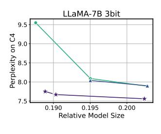
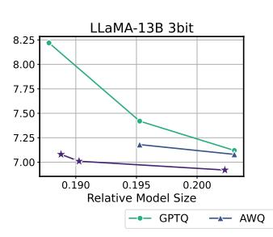
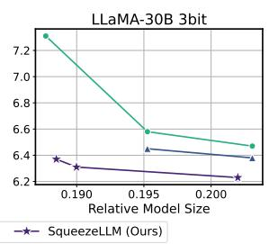

# 5. Evaluations

## 5.1. Experiment Setup

Below is our experiment setup, with more details in Appendix [B.](#page-12-1)

Models and Datasets. We have conducted comprehensive evaluations of SqueezeLLM using various models including LLaMA, LLaMA2 [\(Touvron et al.,](#page-10-5) [2023a;](#page-10-5)[b\)](#page-11-6), OPT [\(Zhang](#page-11-0) [et al.,](#page-11-0) [2022\)](#page-11-0) and Vicuna [\(Chiang et al.,](#page-9-5) [2023\)](#page-9-5) (v1.1 and v1.3). We conduct language modeling evaluation using the C4 [\(Raffel et al.,](#page-10-1) [2020\)](#page-10-1) and WikiText2 [\(Merity et al.,](#page-10-13) [2016\)](#page-10-13) datasets. We further evaluate the domain-specific knowledge and problem-solving ability using MMLU [\(Hendrycks](#page-10-8) [et al.,](#page-10-8) [2021\)](#page-10-8), and the instruction-following ability using the methodology in [\(Chiang et al.,](#page-9-5) [2023\)](#page-9-5).

Baseline Methods. We compare SqueezeLLM against various PTQ methods for LLMs including RTN, GPTQ [\(Frantar](#page-9-4) [et al.,](#page-9-4) [2022\)](#page-9-4), AWQ [\(Lin et al.,](#page-10-7) [2023\)](#page-10-7) and SpQR [\(Dettmers](#page-9-6) [et al.,](#page-9-6) [2023\)](#page-9-6). To ensure a fair comparison, we use GPTQ *with* activation ordering throughout all experiments unless specified, which addresses the significant performance drop that would otherwise occur.

Quantization Details. For SqueezeLLM, we adopt channelwise quantization where each output channel is assigned a separate lookup table. We use 2 different sparsity levels: 0% (dense-only) and 0.45% (0.05% sensitive values and 0.4% outlier values, as discussed in Sec. [4.2\)](#page-4-0). For measuring sensitivity, we use 100 random samples from the Vicuna training set for Vicuna models and C4 training set for the others. While grouping can also be incorporated with our method, we found it sub-optimal as compared to extracting sensitive/outlier values with sparsity (Appendix [D.3\)](#page-15-1).

Latency Profiling. We measure the latency and peak memory usage for generating 128 and 1024 tokens on an A6000 machine using the Torch CUDA profiler. As an official implementation of GPTQ (in particular, the grouped version) is not available, we implement an optimized kernel for single-batch inference based on the most active opensource codebase [\(GPTQ-For-LLaMA\)](#page-10-14).

#### 5.2. Main Results

Tab. [1](#page-6-0) shows quantization results for LLaMA along with the baseline methods. The models are grouped based on their size to better compare size-perplexity trade-offs. See Fig. [6](#page-7-2) for a visual illustration. Below we use LLaMA-7B as the main example to discuss the impact of dense-only and Dense-and-Sparse quantization, and we then discuss how these trends extend to larger models. We provide the full evaluation result on all LLaMA models in Tab. [H.13.](#page-20-0)

Table 1. Perplexity comparison of LLaMA models quantized into 3 and 4 bits using different methods including RTN, GPTQ, AWQ and SpQR on C4 and WikiText-2. We compare the performance of different methodologies by grouping them based on their model sizes. In the first group, we compare dense-only SqueezeLLM with non-grouped GPTQ. In the second group, we compare SqueezeLLM with a sparsity level of 0.45% to GPTQ and AWQ with a group size of 128. For comparison, we add speedup and peak memory usage numbers, which we provide more details in Tab. [H.13.](#page-20-0) Further results for LLaMA-30/65B can be found in Tab. [H.13,](#page-20-0) and results on other models including LLaMA-2 7/13/70B are provided in Appendix [H.1.](#page-20-1)

| LLaMA-7B                                                                     |                                                          |                               | 3-bit                        |                              |                          |                                                          |                              | 4-bit                        |                              |                          |
|------------------------------------------------------------------------------|----------------------------------------------------------|-------------------------------|------------------------------|------------------------------|--------------------------|----------------------------------------------------------|------------------------------|------------------------------|------------------------------|--------------------------|
| Method                                                                       | Avg. Bits (comp. rate)                                | C4                            | PPL (↓) Wiki              | Speedup (↑)               | Mem. (GB, ↓)          | Avg. Bits (comp. rate)                                | C4                           | PPL (↓) Wiki              | Speedup (↑)               | Mem. (GB, ↓)          |
| Baseline                                                                     | 16                                                       | 7.08                          | 5.68                         | 1×                           | 12.7                     | 16                                                       | 7.08                         | 5.68                         | 1×                           | 12.7                     |
| RTN GPTQ SpQR SqueezeLLM                                            | 3 (5.33) 3 (5.33) - 3.02 (5.29)                 | 28.26 9.55 - 7.75    | 25.61 7.55 - 6.32   | 2.3× 2.3× - 2.1×    | 2.9 2.9 - 2.9   | 4 (4.00) 4 (4.00) 3.94 (4.06) 4.05 (3.95)       | 7.73 7.43 7.28 7.21 | 6.29 5.94 5.87 5.79 | 2.0× 2.0× 1.2׆ 1.8× | 3.7 3.7 N/A 3.8 |
| GPTQ (g128, no reorder)‡ GPTQ (g128)‡ AWQ (g128) SqueezeLLM (0.45%) | 3.24 (4.93) 3.24 (4.93) 3.24 (4.93) 3.24 (4.93) | 10.09 7.89 7.90 7.56 | 8.85 6.27 6.44 6.13 | 2.0× 0.2× 2.0× 1.9× | 3.0 3.0 3.0 3.1 | 4.24 (3.77) 4.24 (3.77) 4.24 (3.77) 4.27 (3.75) | 7.80 7.21 7.22 7.18 | 6.07 5.78 5.82 5.77 | 1.6× 0.4× 1.6× 1.7× | 3.8 3.8 3.8 4.0 |
|                                                                              |                                                          |                               |                              |                              |                          |                                                          |                              |                              |                              |                          |
| LLaMA-13B                                                                    |                                                          |                               | 3-bit                        |                              |                          |                                                          |                              | 4-bit                        |                              |                          |
| Method                                                                       | Avg. Bits (comp. rate)                                | C4                            | PPL (↓) Wiki              | Speedup (↑)               | Mem. (GB, ↓)          | Avg. Bits (comp. rate)                                | C4                           | PPL (↓) Wiki              | Speedup (↑)               | Mem. (GB, ↓)          |
| Baseline                                                                     | 16                                                       | 6.61                          | 5.09                         | 1×                           | 24.6                     | 16                                                       | 6.61                         | 5.09                         | 1×                           | 24.6                     |
| RTN GPTQ SpQR SqueezeLLM                                            | 3 (5.33) 3 (5.33) - 3.02 (5.30)                 | 13.24 8.22 - 7.08    | 11.78 6.22 - 5.60   | 2.7× 2.7× - 2.4×    | 5.3 5.3 - 5.4   | 4 (4.00) 4 (4.00) 3.96 (4.04) 4.04 (3.96)       | 6.99 6.84 6.72 6.71 | 5.53 5.29 5.22 5.18 | 2.3× 2.3× 1.2׆ 2.0× | 6.8 6.8 N/A 6.9 |

Dense-only Quantization. In Tab. [1](#page-6-0) (Top), we compare dense-only SqueezeLLM with 0% sparsity level and GPTQ without grouping. With 4-bit quantization, our method exhibits minimal degradation compared to the FP16 baseline, with only ∼0.1 perplexity degradation on C4 and Wiki-Text2, while reducing the model size by 3.95×. Moreover, when compared to non-grouped GPTQ our method shows significant perplexity improvement of up to 0.22.

The performance gap between the two methods becomes more pronounced with 3-bit quantization. SqueezeLLM outperforms GPTQ by a substantial margin of 1.80/1.22 points on C4/WikiText2 with a 5.29× compression rate. This is only 0.67/0.55 points off from the FP16 baseline. This demonstrates the effectiveness of the sensitivity-based non-uniform method for ultra-low-bit quantization.

Dense-and-Sparse Quantization. By leveraging the Denseand-Sparse quantization, we achieve a further reduction in the perplexity gap from the FP16 baseline, as shown in Tab. [1.](#page-6-0) This improvement is particularly significant with 3-bit quantization, where extracting just 0.45% of the values yields around 0.2 perplexity improvement. This enables nearly lossless compression with less than 0.1/0.5 perplexity deviation from the FP16 baseline for 4/3-bit, respectively.

Both GPTQ and AWQ use a grouping strategy to enhance performance with a slight overhead in model size. However, we demonstrate that SqueezeLLM with a sparsity level of 0.45% consistently outperforms both GPTQ/AWQ with a group size of 128 in all scenarios with comparable model sizes. This is more pronounced for 3-bit quantization, where SqueezeLLM with a 0.45% sparsity level outperforms both GPTQ/AWQ with a group size of 128 by up ∼0.3 perplexity.

Results on Larger Models. In Tab. [1](#page-6-0) (13B) and Tab. [H.13](#page-20-0) (30/65B), we observe that the trend in 7B extends to larger models, where SqueezeLLM consistently outperforms other PTQ methods across all models and bit widths. Such a trend is also illustrated in Fig. [6](#page-7-2) for 3-bit quantization where even *dense-only* SqueezeLLM achieves comparable perplexity to *grouped* GPTQ/AWQ. With sparsity, we can further improve perplexity, reducing the gap from the FP16 baseline

† Since SpQR does not release their kernel implementation, we conduct our best-effort comparison using their reported speedup numbers. See Appendix [B](#page-12-1) for details.

‡GPTQ with activation ordering incurs a significant latency penalty as elements in the same channel are associated with different scaling factors, resulting in distributed memory accesses (Sec. [5.4\)](#page-7-1). GPTQ *without* activation ordering alleviates the latency issue at the cost of a substantial perplexity degradation.

Figure 6. Perplexity comparison PTQ methods for 3-bit LLaMA quantization, evaluated on C4. The x-axes are the relative model sizes with respect to the model size in FP16. Different size-perplexity trade-offs are achieved by adjusting the group size for GPTQ and AWQ and the sparsity level for ours. Our quantization method consistently and significantly outperforms GPTQ and AWQ across all model size regimes, with a more pronounced gap in lower-bit and smaller model sizes.

Table 2. Comparison of PTQ methods on zero-shot MMLU accuracy applied to Vicuna v1.1 and v1.3. We add peak memory usage in GB for comparison. Additional results on 5-shot MMLU evaluation can be found in Appendix H.2.

| Method             | Avg.   Vicuna |         | na-7B (v1.1) | n-7B (v1.1) Vicuna-13B (v1.1) |             | Vicuna-7B (v1.3) |             | Vicun   | a-13B (v1.3) | Vicun   | a-33B (v1.3) |
|--------------------|---------------|---------|--------------|-------------------------------|-------------|------------------|-------------|---------|--------------|---------|--------------|
| Method             | bit           | Acc (↑) | Mem (GB, ↓)  | Acc (↑)                       | Mem (GB, ↓) | Acc (†)          | Mem (GB, ↓) | Acc (†) | Mem (GB, ↓)  | Acc (†) | Mem (GB, ↓)  |
| Baseline           | 16            | 39.1%   | 12.7         | 41.2%                         | 24.6        | 40.2%            | 12.7        | 43.3%   | 24.6         | 49.5%   | OOM          |
| AWQ (g128)         | 4.25          | 38.0%   | 3.8          | 40.4%                         | 7.2         | 39.6%            | 3.8         | 42.2%   | 7.2          | 49.5%   | 17.2         |
| SqueezeLLM         | 4.05          | 38.8%   | 3.8          | 39.2%                         | 6.9         | 39.3%            | 3.8         | 44.1%   | 6.9          | 48.0%   | 17.5         |
| SqueezeLLM (0.45%) | 4.26          | 39.4%   | 4.0          | 41.0%                         | 7.3         | 39.5%            | 4.0         | 43.8%   | 7.3          | 49.9%   | 18.7         |
| AWQ (g128)         | 3.25          | 36.5%   | 3.0          | 37.6%                         | 5.7         | 37.4%            | 3.0         | 40.7%   | 5.7          | 46.4%   | 13.2         |
| SqueezeLLM         | 3.02          | 36.0%   | 2.9          | 37.2%                         | 5.4         | 35.1%            | 2.9         | 40.5%   | 5.4          | 46.2%   | 12.5         |
| SqueezeLLM (0.45%) | 3.24          | 37.7%   | 3.1          | 39.4%                         | 5.8         | 37.6%            | 3.1         | 40.8%   | 5.8          | 47.7%   | 14.7         |

to less than 0.1/0.4 perplexity points for 4/3-bit quantization. Notably, with 3-bit quantization, our approach achieves up to a  $2.1\times$  reduction in perplexity gap from the FP16 baseline compared to existing methods. Further ablation studies on our design choices are provided in Appendix D, and additional results on the LLaMA2 and OPT models can be found in Appendix H.1.

#### **5.3. Quantization of Instruction Following Models**

Instruction tuning has emerged as a method for improving the model's ability to respond to user commands. We explore the quantization of instruction-following models to demonstrate the benefits of SqueezeLLM in terms of accuracy preservation by applying it to the Vicuna models, and evaluating the performance with the following approaches.

**MMLU Evaluation.** We first evaluate the baseline and quantized models on the MMLU benchmark where the weighted accuracy in the zero-shot setting is provided in Tab. 2 for Vicuna models. As we can see, 3-bit SqueezeLLM achieves higher accuracy for all models compared to AWQ and also preserves the FP16 baseline accuracy with 4-bit quantization. 5-shot results are provided in Appendix H.2.

**Instruction-Following Ability.** Another approach for evaluating instruction-following ability is to ask GPT-4 to rank the generated responses as presented in (Chiang et al., 2023). As shown in Fig. 7, SqueezeLLM without sparsity achieves near-perfect performance (i.e., 50/50 split) with 4-bit quantization for both Vicuna-7B and 13B, outperforming GPTQ

with the same model size. In the case of 3-bit quantization, SqueezeLLM outperforms both GPTQ and AWQ with comparable model sizes. In the case of the Vicuna-13B model, achieving a near-perfect 50/50 split for 3-bit quantization.

## 5.4. Hardware Deployment and Profiling

We show the latency and peak GPU memory usage of SqueezeLLM in Tab. 3 on an A6000 GPU for different configurations when generating 128 tokens. We observe that the LUT-based non-uniform approach in SqueezeLLM (3rd row) shows up to  $2.4\times$  speedup compared to the FP16 baseline, and exhibits comparable latency and peak memory usage to the uniform quantization of non-grouped GPTQ (2nd row). This indicates that the overhead associated with LUT-based dequantization is small, especially considering the significant perplexity gains it enables.

Additionally, when incorporating sparsity, we still observed latency gains relative to the FP16 baseline. As shown in Tab. 3, keeping 0.45% of parameters in FP16 (4th row) only adds around 10% latency overhead relative to the dense-only implementation, while still resulting in up to  $2.2\times$  speed up compared to the FP16 baseline. In contrast, when accounting for permutation, the GPTQ runtime is degraded heavily (5th row). This latency penalty is due to permutation, which means that elements in the same channel need to be scaled using different scaling factors (which are accessed using group indices); it is challenging for these distributed memory accesses to be performed efficiently, as GPUs rely

Table 3. Latency (s) and peak memory usage (GB) of 3-bit LLaMA when generating 128 tokens on an A6000 GPU. The table compares the FP16 baseline, non-grouped and grouped GPTQ with activation ordering, and SqueezeLLM with different sparsity levels. For comparison, we include bitwidth and perplexity on the C4 benchmark. See Tab. G.11 for additional results on generating 1024 tokens, and see Tab. G.12 for additional benchmarking results on an A100 GPU.

| Method             | Bit   | DDY (GA) | 7B      |         | PDV (GA) | 13B     | (6)     | PDV (GA) | 30B     | (6)     | PPV (GA) | 65B     | (6)     |
|--------------------|-------|----------|---------|---------|----------|---------|---------|----------|---------|---------|----------|---------|---------|
|                    | width | PPL (C4) | Lat (s) | Mem (G) | PPL (C4) | Lat (s) | Mem (G) | PPL (C4) | Lat (s) | Mem (G) | PPL (C4) | Lat (s) | Mem (G) |
| Baseline           | 16    | 7.08     | 3.2     | 12.7    | 6.61     | 5.6     | 24.6    | 5.98     | OOM     | OOM     | 5.62     | OOM     | OOM     |
| GPTQ               | 3     | 9.55     | 1.4     | 2.9     | 8.22     | 2.1     | 5.3     | 7.31     | 4.0     | 12.3    | 6.70     | 6.7     | 24.0    |
| SqueezeLLM         | 3.02  | 7.75     | 1.5     | 2.9     | 7.08     | 2.4     | 5.4     | 6.37     | 4.0     | 12.5    | 5.99     | 7.6     | 24.5    |
| GPTQ (g128)        | 3.25  | 7.89     | 13.7    | 3.0     | 7.12     | 24.2    | 5.6     | 6.47     | 61.9    | 12.9    | 6.01     | 117.8   | 25.1    |
| SqueezeLLM (0.45%) | 3.24  | 7.56     | 1.7     | 3.1     | 6.92     | 2.5     | 5.8     | 6.23     | 4.4     | 14.7    | 5.84     | 8.8     | 28.0    |
|                    |       |          |         |         |          |         |         |          |         |         |          |         |         |
| 4-bit GPTC         | ,     | 50       | 25      | 85      |          |         | GPTQ    | 50       |         | 39      | 71       |         |         |
|                    |       |          |         |         |          |         |         |          |         |         |          |         |         |

Figure 7. Comparison of PTQ methods applied to Vicuna v1.1. Blue / yellow / red represent the number of times that the quantized model won / tied / lost against the baseline FP16 model. This evaluation was performed using the methodology from Vicuna.

heavily on coalesced memory accesses in order to optimally use memory bandwidth. This shows how our Dense-and-Sparse quantization methodology allows for both higher accuracy as well as better performance relative to GPTQ. Additional evaluation results on generating 1024 tokens are provided in Tab. G.11, where we observe a similar trend.

#### 6. Conclusion

We have presented SqueezeLLM which attempts to address the Memory Wall problem associated with generative LLM inference that is memory-bound. SqueezeLLM incorporates two novel ideas that allow ultra-low precision quantization of LLMs with negligible degradation in generation performance: the sensitivity-based non-uniform quantization method; and the Dense-and-Sparse decomposition that resolves the outlier issue. We have evaluated SqueezeLLM on a wide range of models and datasets that assess language modeling, problem-solving, and instruction-following capabilities of quantized models, where we have demonstrated that our quantization method can consistently outperform the previous state-of-the-art methodologies.

#### **Impact Statement**

This paper introduces advancements in machine learning through a method that results in more lightweight models by improving computational efficiency. While this technique will enable broader access to the applications of machine learning technologies across diverse sectors, we do not foresee direct negative social consequences that require specific highlights. Our work aims at fostering innovation and inclusivity in the field, making advanced technologies more available to a wider range of users and developers.

#### Acknowledgements

The authors would like to acknowledge Karttikeya Mangalam, Nicholas Lee, and Thanakul Wattanawong for helpful discussions and brainstorming. We acknowledge gracious support from Google Cloud, Google TRC team, and specifically Jonathan Caton, Jing Li, Jiayu Ye, and Prof. David Patterson. Prof. Keutzer's lab is sponsored by Intel corporation, Intel VLAB team, Intel One-API center of excellence, as well as gracious funding from Furiosa, Berkeley Deep Drive, and BAIR. Michael W. Mahoney would also like to acknowledge a J. P. Morgan Chase Faculty Research Award as well as the DOE, NSF, and IARPA. Sehoon Kim would like to acknowledge the support from the Korea Foundation for Advanced Studies (KFAS). Our conclusions do not necessarily reflect the position or the policy of our sponsors, and no official endorsement should be inferred.

#### References

Bai, H., Zhang, W., Hou, L., Shang, L., Jin, J., Jiang, X., Liu, Q., Lyu, M., and King, I. BinaryBERT: Pushing the limit of BERT quantization. *arXiv preprint arXiv:2012.15701*, 2020.

- Bondarenko, Y., Nagel, M., and Blankevoort, T. Understanding and overcoming the challenges of efficient Transformer quantization. *arXiv preprint arXiv:2109.12948*, 2021.
- Brown, T. B., Mann, B., Ryder, N., Subbiah, M., Kaplan, J., Dhariwal, P., Neelakantan, A., Shyam, P., Sastry, G., Askell, A., et al. Language models are few-shot learners. *arXiv preprint arXiv:2005.14165*, 2020.
- Cai, Y., Yao, Z., Dong, Z., Gholami, A., Mahoney, M. W., and Keutzer, K. ZeroQ: A novel zero shot quantization framework. In *Proceedings of the IEEE/CVF Conference on Computer Vision and Pattern Recognition*, pp. 13169– 13178, 2020.
- Chee, J., Cai, Y., Kuleshov, V., and De Sa, C. M. Quip: 2-bit quantization of large language models with guarantees. *Advances in Neural Information Processing Systems*, 36, 2024.
- Chen, B., Dao, T., Winsor, E., Song, Z., Rudra, A., and Re,´ C. Scatterbrain: Unifying sparse and low-rank attention. *Advances in Neural Information Processing Systems*, 34: 17413–17426, 2021.
- Chiang, W.-L., Li, Z., Lin, Z., Sheng, Y., Wu, Z., Zhang, H., Zheng, L., Zhuang, S., Zhuang, Y., Gonzalez, J. E., Stoica, I., and Xing, E. P. Vicuna: An open-source chatbot impressing gpt-4 with 90%\* chatgpt quality, March 2023. URL [https://lmsys.org/blog/](https://lmsys.org/blog/2023-03-30-vicuna/) [2023-03-30-vicuna/](https://lmsys.org/blog/2023-03-30-vicuna/).
- Chowdhery, A., Narang, S., Devlin, J., Bosma, M., Mishra, G., Roberts, A., Barham, P., Chung, H. W., Sutton, C., Gehrmann, S., et al. Palm: Scaling language modeling with pathways. *Journal of Machine Learning Research*, 24(240):1–113, 2023.
- Chung, I., Kim, B., Choi, Y., Kwon, S. J., Jeon, Y., Park, B., Kim, S., and Lee, D. Extremely low bit transformer quantization for on-device neural machine translation. *arXiv preprint arXiv:2009.07453*, 2020.
- Dass, J., Wu, S., Shi, H., Li, C., Ye, Z., Wang, Z., and Lin, Y. Vitality: Unifying low-rank and sparse approximation for vision transformer acceleration with a linear taylor attention. In *2023 IEEE International Symposium on High-Performance Computer Architecture (HPCA)*, pp. 415–428. IEEE, 2023.
- Dettmers, T., Lewis, M., Belkada, Y., and Zettlemoyer, L. Gpt3. int8 (): 8-bit matrix multiplication for transformers at scale. In *Advances in Neural Information Processing Systems*.

- Dettmers, T., Svirschevski, R., Egiazarian, V., Kuznedelev, D., Frantar, E., Ashkboos, S., Borzunov, A., Hoefler, T., and Alistarh, D. SpQR: A sparse-quantized representation for near-lossless LLM weight compression. *arXiv preprint arXiv:2306.03078*, 2023.
- Dettmers, T., Pagnoni, A., Holtzman, A., and Zettlemoyer, L. Qlora: Efficient finetuning of quantized llms. *Advances in Neural Information Processing Systems*, 36, 2024.
- Dong, Z., Yao, Z., Arfeen, D., Gholami, A., Mahoney, M. W., and Keutzer, K. HAWQ-V2: Hessian Aware trace-Weighted Quantization of neural networks. *NeurIPS'19 workshop on Beyond First-Order Optimization Methods in Machine Learning.*, 2019.
- Du, N., Huang, Y., Dai, A. M., Tong, S., Lepikhin, D., Xu, Y., Krikun, M., Zhou, Y., Yu, A. W., Firat, O., et al. GLAM: Efficient scaling of language models with mixture-of-experts. In *International Conference on Machine Learning*, pp. 5547–5569. PMLR, 2022.
- Egiazarian, V., Panferov, A., Kuznedelev, D., Frantar, E., Babenko, A., and Alistarh, D. Extreme compression of large language models via additive quantization. *arXiv preprint arXiv:2401.06118*, 2024.
- Evtushenko, G. Sparse Matrix-Vector Multiplication with CUDA. *https://medium.com/analytics-vidhya/sparsematrix-vector-multiplication-with-cuda-42d191878e8f*, 2019.
- Flegar, G. and Quintana-Ort´ı, E. S. Balanced csr sparse matrix-vector product on graphics processors. In *Euro-Par 2017: Parallel Processing: 23rd International Conference on Parallel and Distributed Computing, Santiago de Compostela, Spain, August 28–September 1, 2017, Proceedings 23*, pp. 697–709. Springer, 2017.
- Frantar, E., Ashkboos, S., Hoefler, T., and Alistarh, D. GPTQ: Accurate post-training quantization for generative pre-trained transformers. *arXiv preprint arXiv:2210.17323*, 2022.
- Gao, L., Tow, J., Biderman, S., Black, S., DiPofi, A., Foster, C., Golding, L., Hsu, J., McDonell, K., Muennighoff, N., et al. A framework for few-shot language model evaluation, 2021.
- Gholami, A., Kim, S., Dong, Z., Yao, Z., Mahoney, M. W., and Keutzer, K. A survey of quantization methods for efficient neural network inference. *arXiv preprint arXiv:2103.13630*, 2021.
- Gholami, A., Yao, Z., Kim, S., Hooper, C., Mahoney, M. W., and Keutzer, K. Ai and memory wall. *IEEE Micro*, pp. 1–5, 2024.

- GPTQ-For-LLaMA. https://github.com/qwopqwop200/gptqfor-llama.
- Han, S., Mao, H., and Dally, W. J. Deep compression: Compressing deep neural networks with pruning, trained quantization and huffman coding. *International Conference on Learning Representations*, 2016.
- Hendrycks, D., Burns, C., Basart, S., Zou, A., Mazeika, M., Song, D., and Steinhardt, J. Measuring massive multitask language understanding. *Proceedings of the International Conference on Learning Representations (ICLR)*, 2021.
- Hoffmann, J., Borgeaud, S., Mensch, A., Buchatskaya, E., Cai, T., Rutherford, E., Casas, D. d. L., Hendricks, L. A., Welbl, J., Clark, A., et al. Training compute-optimal large language models. *arXiv preprint arXiv:2203.15556*, 2022.
- Huang, Y., Yang, H., Dong, Z., Gudovskiy, D., Okuno, T., Nakata, Y., Du, Y., Zhang, S., and Keutzer, K. Output sensitivity-aware detr quantization. 2023.
- Jeon, Y., Lee, C., Cho, E., and Ro, Y. Mr. BiQ: Posttraining non-uniform quantization based on minimizing the reconstruction error. In *Proceedings of the IEEE/CVF Conference on Computer Vision and Pattern Recognition*, pp. 12329–12338, 2022.
- Kim, S., Gholami, A., Yao, Z., Mahoney, M. W., and Keutzer, K. I-BERT: Integer-only bert quantization. *arXiv preprint arXiv:2101.01321*, 2021.
- Kim, S., Hooper, C., Wattanawong, T., Kang, M., Yan, R., Genc, H., Dinh, G., Huang, Q., Keutzer, K., Mahoney, M. W., Shao, S., and Gholami, A. Full stack optimization of transformer inference: a survey. *arXiv preprint arXiv:2302.14017*, 2023.
- Kovaleva, O., Kulshreshtha, S., Rogers, A., and Rumshisky, A. Bert busters: Outlier dimensions that disrupt transformers. *arXiv preprint arXiv:2105.06990*, 2021.
- LeCun, Y., Denker, J. S., and Solla, S. A. Optimal brain damage. In *Advances in neural information processing systems*, pp. 598–605, 1990.
- Li, X., Liu, Y., Lian, L., Yang, H., Dong, Z., Kang, D., Zhang, S., and Keutzer, K. Q-diffusion: Quantizing diffusion models. In *Proceedings of the IEEE/CVF International Conference on Computer Vision (ICCV)*, pp. 17535–17545, October 2023.
- Lin, J., Tang, J., Tang, H., Yang, S., Dang, X., and Han, S. Awq: Activation-aware weight quantization for llm compression and acceleration. 2023.

- Liu, Y., Yang, H., Dong, Z., Keutzer, K., Du, L., and Zhang, S. NoisyQuant: Noisy bias-enhanced post-training activation quantization for vision transformers. In *Proceedings of the IEEE/CVF Conference on Computer Vision and Pattern Recognition*, pp. 20321–20330, 2023.
- Merity, S., Xiong, C., Bradbury, J., and Socher, R. Pointer sentinel mixture models, 2016.
- Oh, S., Sim, H., Kim, J., and Lee, J. Non-uniform step size quantization for accurate post-training quantization. In *Computer Vision–ECCV 2022: 17th European Conference, Tel Aviv, Israel, October 23–27, 2022, Proceedings, Part XI*, pp. 658–673. Springer, 2022.
- Patterson, D. A. Latency lags bandwith. *Communications of the ACM*, 47(10):71–75, 2004.
- Raffel, C., Shazeer, N., Roberts, A., Lee, K., Narang, S., Matena, M., Zhou, Y., Li, W., and Liu, P. J. Exploring the limits of transfer learning with a unified text-to-text transformer. *The Journal of Machine Learning Research*, 21(1):5485–5551, 2020.
- Scao, T. L., Fan, A., Akiki, C., Pavlick, E., Ilic, S., Hesslow, ´ D., Castagne, R., Luccioni, A. S., Yvon, F., Gall ´ e, M., ´ et al. Bloom: A 176b-parameter open-access multilingual language model. *arXiv preprint arXiv:2211.05100*, 2022.
- Shao, W., Chen, M., Zhang, Z., Xu, P., Zhao, L., Li, Z., Zhang, K., Gao, P., Qiao, Y., and Luo, P. Omniquant: Omnidirectionally calibrated quantization for large language models. *arXiv preprint arXiv:2308.13137*, 2023.
- Shen, S., Dong, Z., Ye, J., Ma, L., Yao, Z., Gholami, A., Mahoney, M. W., and Keutzer, K. Q-BERT: Hessian based ultra low precision quantization of bert. In *Proceedings of the AAAI Conference on Artificial Intelligence*, volume 34, pp. 8815–8821, 2020.
- Shomron, G., Gabbay, F., Kurzum, S., and Weiser, U. Posttraining sparsity-aware quantization. *Advances in Neural Information Processing Systems*, 34:17737–17748, 2021.
- Smith, S., Patwary, M., Norick, B., LeGresley, P., Rajbhandari, S., Casper, J., Liu, Z., Prabhumoye, S., Zerveas, G., Korthikanti, V., et al. Using deepspeed and megatron to train megatron-turing nlg 530b, a large-scale generative language model. *arXiv preprint arXiv:2201.11990*, 2022.
- Thoppilan, R., De Freitas, D., Hall, J., Shazeer, N., Kulshreshtha, A., Cheng, H.-T., Jin, A., Bos, T., Baker, L., Du, Y., et al. Lamda: Language models for dialog applications. *arXiv preprint arXiv:2201.08239*, 2022.
- Touvron, H., Lavril, T., Izacard, G., Martinet, X., Lachaux, M.-A., Lacroix, T., Roziere, B., Goyal, N., Hambro, E., `

- Azhar, F., et al. LLaMA: Open and efficient foundation language models. *arXiv preprint arXiv:2302.13971*, 2023a.
- Touvron, H., Martin, L., Stone, K., Albert, P., Almahairi, A., Babaei, Y., Bashlykov, N., Batra, S., Bhargava, P., Bhosale, S., et al. Llama 2: Open foundation and finetuned chat models. *arXiv preprint arXiv:2307.09288*, 2023b.
- Wei, X., Zhang, Y., Zhang, X., Gong, R., Zhang, S., Zhang, Q., Yu, F., and Liu, X. Outlier suppression: Pushing the limit of low-bit transformer language models. *arXiv preprint arXiv:2209.13325*, 2022.
- Wei, X., Zhang, Y., Li, Y., Zhang, X., Gong, R., Guo, J., and Liu, X. Outlier suppression+: Accurate quantization of large language models by equivalent and optimal shifting and scaling. *arXiv preprint arXiv:2304.09145*, 2023.
- Xiao, G., Lin, J., Seznec, M., Wu, H., Demouth, J., and Han, S. SmoothQuant: Accurate and efficient post-training quantization for large language models. In *Proceedings of the 40th International Conference on Machine Learning*, volume 202 of *Proceedings of Machine Learning Research*, pp. 38087–38099. PMLR, 23–29 Jul 2023.
- Xu, Y., Wang, Y., Zhou, A., Lin, W., and Xiong, H. Deep neural network compression with single and multiple level quantization, 2018.
- Yao, Z., Aminabadi, R. Y., Zhang, M., Wu, X., Li, C., and He, Y. ZeroQuant: Efficient and affordable post-training quantization for large-scale transformers. *arXiv preprint arXiv:2206.01861*, 2022.
- Yuan, Z., Niu, L., Liu, J., Liu, W., Wang, X., Shang, Y., Sun, G., Wu, Q., Wu, J., and Wu, B. RPTQ: Reorderbased post-training quantization for large language models. *arXiv preprint arXiv:2304.01089*, 2023.
- Zadeh, A. H., Edo, I., Awad, O. M., and Moshovos, A. GOBO: Quantizing attention-based nlp models for low latency and energy efficient inference. In *2020 53rd Annual IEEE/ACM International Symposium on Microarchitecture (MICRO)*, pp. 811–824. IEEE, 2020.
- Zafrir, O., Boudoukh, G., Izsak, P., and Wasserblat, M. Q8BERT: Quantized 8bit bert. *arXiv preprint arXiv:1910.06188*, 2019.
- Zhang, S., Roller, S., Goyal, N., Artetxe, M., Chen, M., Chen, S., Dewan, C., Diab, M., Li, X., Lin, X. V., et al. OPT: Open pre-trained transformer language models. *arXiv preprint arXiv:2205.01068*, 2022.
- Zhang, W., Hou, L., Yin, Y., Shang, L., Chen, X., Jiang, X., and Liu, Q. TernaryBERT: Distillation-aware ultra-low bit bert. *arXiv preprint arXiv:2009.12812*, 2020.

- Zhang, Y., Dong, Z., Yang, H., Lu, M., Tseng, C.-C., Guo, Y., Keutzer, K., Du, L., and Zhang, S. Qd-bev: Quantization-aware view-guided distillation for multiview 3d object detection. 2023.
- Zhao, R., Hu, Y., Dotzel, J., De Sa, C., and Zhang, Z. Improving neural network quantization without retraining using outlier channel splitting. In *International conference on machine learning*, pp. 7543–7552. PMLR, 2019.

