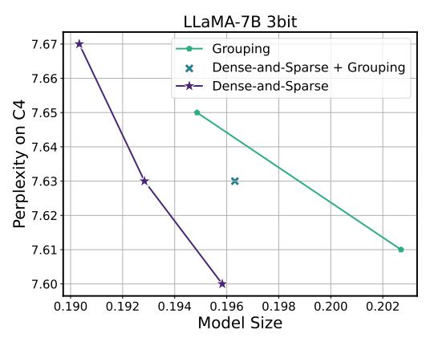

# D. Ablation Studies

#### D.1. Sensitivity-Based Quantization.

In our ablation study, we investigate the impact of sensitivity-based weighted clustering on the performance of non-uniform quantization. In Tab. [D.2,](#page-14-1) we compared the performance of sensitivity-based and sensitivity-agnostic approaches in the context of 3-bit quantization of the LLaMA-7B model. For sensitivity-agnostic quantization, we apply non-weighted k-means clustering at sparsity levels of 0%, 0.05%, and 0.45%. The results demonstrate that while non-uniform quantization alone can reduce the perplexity from 28.26 (of RTN uniform quantization) to 18.08 without considering sensitivity, incorporating sensitivity-based clustering is critical in reducing the perplexity to 7.75. This improvement is consistent across all sparsity levels.

#### D.2. Impact of Sparsity Levels on SqueezeLLM

In Fig. [D.2](#page-14-2) (Left), we present the perplexity results of the 3-bit quantized LLaMA-7B model on the C4 benchmarks, with varying percentages of sensitive values extracted as the sparse matrix, ranging from 0% to 0.2%. The plot demonstrates that the perplexity gain diminishes as the sparsity level of the sensitive values exceeds 0.05%. Therefore, we maintain a fixed sparsity level of 0.05% for the sensitive values throughout all experiments.

Furthermore, in Figure [D.2](#page-14-2) (Right), we compare the performance when the sensitive values are not removed as the sparse matrix (only outlier values are removed) to the case where 0.05% of the sensitive values are removed. In both scenarios, we control the sparsity level by increasing the percentage of outlier values included in the sparse matrix to obtain the trade-off curves. The results indicate that the sparsity configuration with both sensitive values and outlier values consistently outperforms the configuration with only outlier values.

Figure D.3. Model size (normalized by the size of the FP16 model) and perplexity trade-offs of grouping and the Dense-and-Sparse decomposition on 3-bit quantization of LLaMA-7B. Here, we compare SqueezeLLM with (i) grouping using group sizes of 1024 and 512 (green), (ii) a hybrid approach that combines a group size of 1024 with a sparsity level of 0.05% (blue), and (iii) the Dense-and-Sparse decomposition approach with varying sparsity levels (violet). The pure Dense-and-Sparse decomposition always outperforms both grouping and the hybrid approach.

#### D.3. Impact of Grouping on SqueezeLLM

In Fig. D.3, we explore the effectiveness of incorporating grouping into SqueezeLLM as an alternative approach to improve quantization performance. We compare three configurations: SqueezeLLM with (i) grouping using group sizes of 1024 and 512 (green), (ii) a hybrid approach that combines a group size of 1024 with a sparsity level of 0.05% (blue), and (iii) the Dense-and-Sparse decomposition approach with varying sparsity levels (violet), where 0.05% of sensitive values are kept and the percentage of outlier values is adjusted. The results clearly demonstrate that both grouping and the hybrid approach result in suboptimal trade-offs compared to the pure Dense-and-Sparse decomposition approach.

This can be attributed to two factors. First, the Dense-and-Sparse decomposition is a direct solution to the outlier issue. In contrast, while grouping can mitigate the impact of outliers to some extent by isolating them within individual groups, it does not provide a direct solution to this issue. Second, grouping can introduce significant overhead in terms of storage requirements when combined with non-uniform quantization, since it needs to store one LUT per group. This can be a considerable overhead compared to the uniform quantization approach, where only a scaling and zero point value per group need to be stored.

