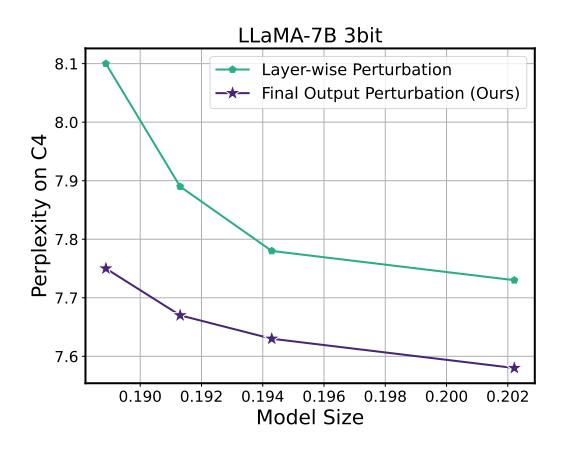

# D.4. Comparison of Optimization Objectives for Non-uniform Quantization: Minimizing Layer-wise Perturbation versus Final Output Perturbation

While our method targets minimizing the perturbation of the final output of the model during quantization, it is worth noting that minimizing the layer-wise perturbation can also be considered as an alternative. Most existing solutions for LLM quantization including GPTQ (Frantar et al., 2022), AWQ (Lin et al., 2023), and SpQR (Dettmers et al., 2023) have used the latter objective, which aims to minimize the perturbation of output activations in individual layers. In this ablation study, we demonstrate that minimizing the final output perturbation is a superior objective to minimizing the layer-wise perturbation.

When minimizing the layer-wise perturbation, the optimization objective for determining the non-uniform quantization configuration can be reformulated as  $\arg\min_Q \|WX - W_QX\|_2^2$ , where X denotes a batch of input activations. This object can be approximated as a weighted k-means clustering problem, where each weight is weighted by the square of the corresponding input activation size. This indeed results in the activation-based sensitivity/importance metric as in the AWQ framework (Lin et al., 2023).

In Fig. D.4, we compare the perplexity on the C4 dataset for 3-bit quantization of the LLaMA-7B model using both objectives. Across all sparsity levels obtained by adjusting the number of outliers being extracted, SqueezeLLM based on final loss perturbation minimization outperforms the alternative of using layer-wise perturbation minimization by a large margin of up to around 0.3 perplexity points.

Figure D.4. Model size (normalized by the size of the FP16 model) and perplexity trade-offs for 3-bit quantization of the LLaMA-7B model using layer-wise perturbation minimization versus final output perturbation minimization as a non-uniform quantization objective. The trade-off is obtained by adjusting the sparsity level of the outliers being extracted. Across all sparsity levels, the OBD framework, which is the foundation for SqueezeLLM, consistently outperforms the OBS framework as an alternative approach.

Table D.3. Perplexity scores on Wikitext2 for the LLaMA-2 7B model, quantized using non-uniform (SqueezeLLM's sensitivity-based quantization) and uniform (RTN) approaches with 3 and 4-bit precision with varying levels of sparsity.

| Bit Width | Sparsity Level (%) | Avg. Bit Width | Uniform (PPL) | Nonuniform (PPL) |
|-----------|--------------------|----------------|---------------|------------------|
| 16-bit    | 0                  | 16             | 5.47          | 5.47             |
|           | 0                  | 4.04           | 6.12          | 5.62             |
|           | 0.05               | 4.09           | 5.95          | 5.59             |
| 4-bit     | 0.45               | 4.26           | 5.95          | <b>5.57</b>      |
|           | 2                  | 5.01           | 5.95          | 5.55             |
|           | 4.5                | 6.20           | 5.94          | 5.53             |
|           | 0                  | 3.02           | 542.00        | 6.18             |
|           | 0.05               | 3.07           | 27.38         | 6.05             |
| 3-bit     | 0.45               | 3.24           | 26.58         | 5.96             |
|           | 1.5                | 3.98           | 25.97         | 5.81             |
|           | 4.5                | 5.18           | 23.58         | 5.73             |

## D.5. Impact of Non-uniform Quantization versus Dense-and-Sparse Decomposition

In Tab. D.3, we perform a detailed analysis to further disambiguate the impact of non-uniform quantization and the Dense-and-Sparse decomposition.

**Uniform vs. Non-uniform Quantization.** As can be seen in Tab. D.3, across all bitwidths and sparsity levels, our non-uniform quantization has noticeable improvements over uniform quantization.

**Sparsity Levels.** Furthermore, we also report the results with varying sparsity levels of the Dense-and-Sparse decomposition in Tab. D.3. As expected, higher levels of sparsity consistently result in improved performance in any scenario. However, there are diminishing returns for larger values of sparse decomposition since only a small portion of the weight values are outliers or sensitive. As a consequence, saving additional values into the sparse format does not help as much beyond a certain level, and instead results in higher average bitwidth. This is in line with the conclusions in the main experiments where we found a sparsity level of 0.45% sufficient for the performance gain.

## D.6. Impact of Dense-and-Sparse Decomposition versus Precision

In Tab. D.4, we additionally demonstrate that increasing the bit width of the dense component results in higher improvement in perplexity compared to increasing the sparsity level. Note that 4-bit LLaMA-2 7B model without any sparsity outperforms the 3-bit counterparts with sparsity levels of 1.5% and 2.5% that have similar or even larger model sizes. This observation aligns with the sensitivity level ablation study in Appendix D.5, since the Dense-and-Sparse decomposition is only effective

Table D.4. Perplexity scores on C4 and WikiText2 for the LLaMA-2 7B model, quantized using SqueezeLLM with 4-bit and 3-bit with different sparsity level. In particular, the sparsity levels of 3-bit quantization are selected to match their average bit widths to that of 4-bit quantization without sparsity.

| Bit Width | Sparsity Level (%) | Avg. Bit Width C4 (PPL)   | WikiText2 (PPL) |
|-----------|--------------------|------------------------------|-----------------|
| 16-bit    | 0                  | 16 6.97                   | 5.47            |
| 4-bit     | 0                  | 4.04 7.12                 | 5.62            |
| 3-bit     | 1.5 2.5         | 3.98 7.35 4.22 7.32 | 5.81 5.80    |

Table E.5. Peak memory requirement in GB when quantizing different LLaMA models.

| Model     | Peak Memory (GB) |
|-----------|------------------|
| LLaMA-7B  | 33               |
| LLaMA-13B | 61               |
| LLaMA-30B | 149              |
| LLaMA-65B | 292              |

Table E.6. End-to-end latency breakdown of quantizing different LLaMA models. Latency is broken down into (i) Fisher information computation on a A100 system and (ii) sensitivity-based k-means clustering on Intel Xeon Gold 6126 with 48 cores. In the last column, we provide the end-to-end time for GPTQ as reported in the original paper.

| Model     | Fisher Computation (min) | K-means (min) | GPTQ (min) |
|-----------|--------------------------|---------------|------------|
| LLaMA-7B  | 0.3                      | 11            | 10         |
| LLaMA-13B | 0.6                      | 17            | 21         |
| LLaMA-30B | 1.3                      | 45            | 45         |
| LLaMA-65B | 2.5                      | 80            | 96         |

to the extent of removing the outliers and sensitive values from the parameters. Increasing the sparsity level beyond that will not be effective and results in diminishing returns.

