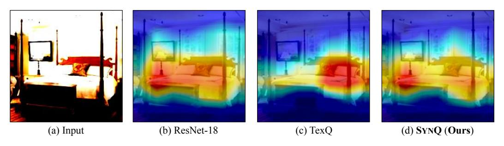

# 1 INTRODUCTION

*How can we accurately quantize a pre-trained model without any data?* Despite the success of deep neural networks in various domains, deploying them on resource-constrained edge devices remains challenging due to the limited computing capabilities. Addressing this challenge involves network compression [\(Cheng et al., 2018;](#page-10-0) [Deng et al., 2020;](#page-10-1) [Park et al., 2024b\)](#page-12-0), where quantization methods [\(Li et al., 2021;](#page-12-1) [Piao et al., 2022;](#page-12-2) [Gholami et al., 2022\)](#page-11-0) represent the full-precision model with low-bit numbers, achieving high compression rate and accelerated inference with minimal performance degradation compared to other methods such as pruning [\(Wang et al., 2022;](#page-13-0) [Park et al.,](#page-12-3) [2024a;](#page-12-3) [He & Xiao, 2024\)](#page-11-1), knowledge distillation [\(Kim et al., 2021;](#page-11-2) [Tran et al., 2022;](#page-13-1) [Cho & Kang,](#page-10-2) [2022;](#page-10-2) [Jeon et al., 2023a;](#page-11-3) [Xie et al., 2023\)](#page-13-2), and low-rank approximation [\(Jang et al., 2023\)](#page-11-4). Zero-shot Quantization (ZSQ) [\(Nagel et al., 2019\)](#page-12-4) further advances this field by permitting quantization without any training data. The importance of this approach is evident in real-world contexts where the training data are unavailable for privacy and security reasons [\(Sharma et al., 2021\)](#page-13-3).

Among the various existing works [\(Yoo et al., 2019;](#page-13-4) [Zhang et al., 2021;](#page-13-5) [Guo et al., 2022\)](#page-11-5), methods that fine-tune the quantized model with the synthetic dataset exhibit outstanding performance [\(Liu](#page-12-5) [et al., 2021a;](#page-12-5) [Zhong et al., 2022b;](#page-13-6) [Fan et al., 2024\)](#page-11-6). Specifically, recent methods generate synthetic samples resembling the real sample distribution by leveraging key aspects from the pre-trained model, such as batch-normalization statistics [\(Cai et al., 2020\)](#page-10-3), latent embeddings [\(Choi et al., 2021\)](#page-10-4), or texture feature distribution [\(Chen et al., 2023\)](#page-10-5). However, we observe that three major limitations still hinder the performance when utilizing synthetic datasets (see Section [3\)](#page-3-0).

- Noise in the synthetic dataset. Synthetic datasets have distinct high-frequency noise unlike real images that concentrate on low frequencies (see Figures [1](#page-1-0) and [5\)](#page-5-0). This discrepancy results in inefficient fine-tuning of quantized models, thereby directly reducing model performance.
- Predictions based on off-target patterns. Quantized model from existing methods rely on incorrect image patterns for predictions (see Figure [2\)](#page-1-1). Such off-target reliance limits the quantized model in identifying key areas necessary for accurate classification.

∗Corresponding Author.

Figure 1: Comparison between (a) real images in ImageNet dataset and (b) generated samples in the synthetic dataset from TexQ [\(Chen et al., 2023\)](#page-10-5). Each set displays samples labeled as timber wolf, tobacco shop, aircraft carrier, and beaker. We present the average magnitude spectrum for a randomly selected batch of 256 images from each dataset, highlighting their distinct differences.

Figure 2: Grad-CAM [\(Selvaraju et al., 2017\)](#page-13-7) plot of the (a) input by the (b) pre-trained ResNet-18 model on ImageNet dataset, the (c) 3bit quantized model by TexQ, and the (d) 3bit quantized model by SYNQ. While TexQ fails to capture the correct image region, SYNQ captures the region closely matching the pre-trained model.

• Misguidance by erroneous hard labels. Hard labels of difficult samples are often incorrect in synthetic dataset, leading to misguided fine-tuning and ultimately harming the model (see Figure [3\)](#page-3-1).

We propose SYNQ (Synthesis-aware Fine-tuning for Zero-shot Quantization), an accurate ZSQ fine-tuning method to overcome the limitations of the existing methods that fine-tune with synthetic datasets. SYNQ clears noise from the generated samples within the synthetic dataset by applying a low-pass filter. Then, SYNQ ensures that the quantized model predicts from the correct image region by optimizing the class activation map (CAM) alignment loss to distill object localization knowledge. Furthermore, SYNQ mitigates misguidance from errors of the pre-trained model by using only soft labels for difficult samples. Experimental results show that SYNQ achieves the state-of-the-art performance, improving the image classification accuracy of the quantized model up to 1.74%p compared to existing methods (see Table [1\)](#page-7-0). SYNQ is both powerful and versatile, seamlessly integrating into any ZSQ methods that fine-tune with synthetic datasets, regardless of model type, quantization bits, or dataset (see Sections [5.2,](#page-7-1) [5.3,](#page-7-2) Appendices [C.6,](#page-18-0) and [C.7\)](#page-18-1).

Our contributions are summarized as follows:

- Observation. Our observations clearly outline three significant challenges faced by existing ZSQ methods utilizing synthetic datasets: 1) noise in synthetic datasets, 2) predictions based on off-target patterns, and 3) misguidance by erroneous hard labels (see Figures [1,](#page-1-0) [2,](#page-1-1) [3,](#page-3-1) and [5\)](#page-5-0).
- Algorithm. We propose SYNQ, an accurate ZSQ method to overcome the limitations of finetuning with synthetic datasets. SYNQ exploits a low-pass filter to minimize noise, aligns the class activation map to ensure prediction from the correct image region, and leverages soft labels for difficult samples to prevent misguidance from erroneous hard labels (see Section [4\)](#page-3-2).
- Experiments. We experimentally show that SYNQ consistently outperforms existing ZSQ methods on various models and datasets, achieving classification accuracy improvement of up to 1.74%p (see Section [5](#page-6-0) and Appendix [C\)](#page-15-0).

Reproducibility. All of our implementation and datasets are available at [https://github.com/](https://github.com/snudm-starlab/SynQ) [snudm-starlab/SynQ](https://github.com/snudm-starlab/SynQ).

### 2 Preliminaries and Problem Definition

We introduce the ZSQ (Zero-shot Quantization) problem and describe the preliminaries. Appendix A contains the detailed descriptions of frequently used notations in this paper.

### 2.1 Zero-shot Quantization

In this work, we follow the typical two-step scheme (Choi et al., 2021; Li et al., 2023a) to quantize a pretrained model. First, we generate the synthetic dataset that resembles the original dataset using the pre-trained model. Second, we fine-tune the quantized model with generated samples.

The goal of the first step is to produce synthetic dataset  $\{\mathbf{x}_i\}_{i=1}^N$  of length N with corresponding labels  $\{\mathbf{y}_i\}_{i=1}^N$ , using the pre-trained model with parameters  $\theta$ . We utilize noise optimization (Cai et al., 2020; Zhong et al., 2022b), where we initialize the synthetic dataset and labels as random Gaussian noises and randomly assigned classes, respectively; we then iteratively update the synthetic dataset  $\{\mathbf{x}_i\}_{i=1}^N$ . Specifically, we minimize Batch Normalization Statistics (BNS) loss  $\mathcal{L}_{BNS}$  and Inception Loss (IL)  $\mathcal{L}_{IL}$  in Equation (1), with hyperparameter  $\alpha$  balancing them.

$$\min_{\{\mathbf{x}_i\}_{i=1}^N} \mathcal{L}_{IL} + \alpha \mathcal{L}_{BNS}, \text{ where } \mathcal{L}_{IL} = \frac{1}{N} \sum_{i=1}^N CE\left(q(\mathbf{x}_i; \theta), \mathbf{y}_i\right),$$

$$\mathcal{L}_{BNS} = \frac{1}{L} \sum_{l=1}^L \left\| \boldsymbol{\mu}^l(\theta) - \boldsymbol{\mu}^l(\theta, \{\mathbf{x}_i\}_{i=1}^N) \right\|_2^2 + \left\| \boldsymbol{\sigma}^l(\theta) - \boldsymbol{\sigma}^l(\theta, \{\mathbf{x}_i\}_{i=1}^N) \right\|_2^2,$$
(1)

where the lth batch normalization (BN) layer of the pre-trained model with parameters  $\theta$  (out of L BN layers) stores the running mean  $\boldsymbol{\mu}^l(\theta)$  and standard deviation  $\boldsymbol{\sigma}^l(\theta)$  of the training dataset. The mean  $\boldsymbol{\mu}^l(\theta,\{\mathbf{x}_i\}_{i=1}^N)$  and standard deviation  $\boldsymbol{\sigma}^l(\theta,\{\mathbf{x}_i\}_{i=1}^N)$  are calculated on  $\{\mathbf{x}_i\}_{i=1}^N$  using  $\theta$ .  $q(\cdot;\theta)$  denotes the probability distribution by parameters  $\theta$  and  $CE(\cdot,\cdot)$  stands for cross-entropy loss.

The goal of the second step is to obtain the quantized model with parameters  $\theta^q$ , using the pre-trained model with parameters  $\theta$  and synthetic dataset  $\{\mathbf{x}_i\}_{i=1}^N$  with labels  $\{\mathbf{y}_i\}_{i=1}^N$ . We first quantize the pre-trained model with Rounding-To-Nearest (RTN) (Gupta et al., 2015), then fine-tune the quantized model with parameters  $\theta^q$  with the synthetic dataset from the previous step. For strong performance, we train the quantized model by minimizing two losses, cross-entropy loss  $CE(\cdot,\cdot)$  with hard label  $\mathbf{y}_i$  and KL divergence loss  $KL(\cdot||\cdot)$  which transfers knowledge from the pre-trained model. Note that we directly update the quantized model, while inferencing with its dequantized parameters. Equation (2) incorporates the two loss functions with balancing hyperparameter  $\lambda_{CE}$ .

$$\min_{\theta^q} \mathcal{L}_{ZSQ} = \min_{\theta^q} \frac{1}{N} \sum_{i=1}^N KL(q(\mathbf{x}_i; \theta) || q(\mathbf{x}_i; \theta^q)) + \lambda_{CE} CE(q(\mathbf{x}_i; \theta^q), \mathbf{y}_i). \tag{2}$$

### 2.2 DIFFICULTY OF AN IMAGE

Difficulty of an image represents how easily the model  $\theta$  can misclassify the image  $\mathbf{x}_i$ . Among various methods (Ribeiro et al., 2016; Lin et al., 2017; Kishida & Nakayama, 2019; Scheidegger et al., 2021) to evaluate the difficulty of the model in correctly classifying an image, we follow the probability-based approach (Li et al., 2019) which is used in previous ZSQ methods (Li et al., 2023a). The difficulty  $\delta(\mathbf{x}_i, \theta)$  is determined by how low the model's predicted probability is for the correct label as described in Equation (3).

$$\delta(\mathbf{x}_i, \theta) = 1 - q_{\mathbf{x}_i}(\mathbf{x}_i; \theta), \tag{3}$$

where  $q_{\mathbf{y}_i}(\mathbf{x}_i; \theta)$  is the probability of label  $\mathbf{y}_i$  predicted by the model with parameters  $\theta$ . This definition employs the true label to specifically highlight the model's ambiguity toward the image. Models display an error rate of 0 for difficulties below 0.5 and an increasing error rate for higher difficulties as shown in Figure 3, indicating either incorrectness or uncertainty in model predictions.

## 2.3 PROBLEM DEFINITION

Given a pre-trained image classification model and quantization bits, Zero-shot Quantization (ZSQ) targets to optimize the quantized model to maintain performance without any real images. We give the formal definition as in Problem [1.](#page-2-3)

Problem 1 (Zero-shot Quantization). *We have a pre-trained model with parameters* θ *and quantization bits* B*. Zero-shot quantization is to optimize the quantized model with parameters* θ q *for maximum accuracy within the* B*bit limit without the use of real data.*

