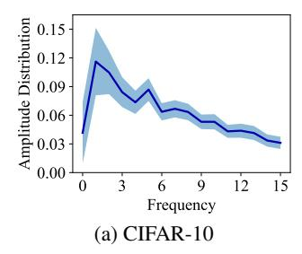
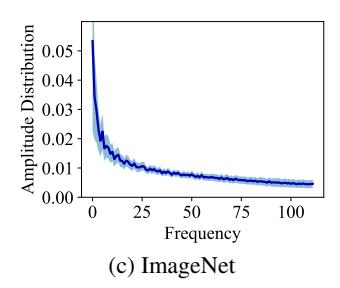
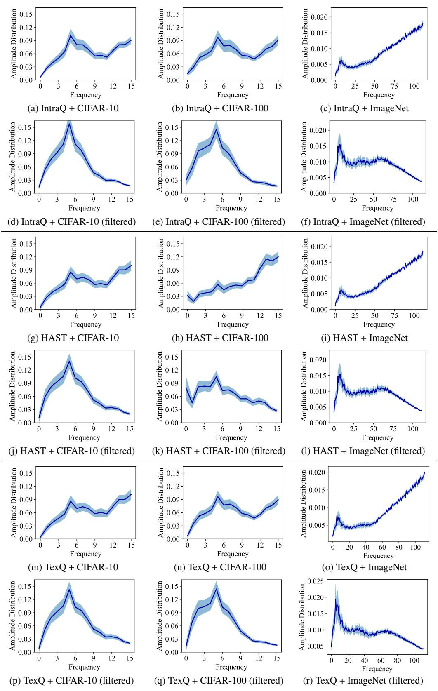
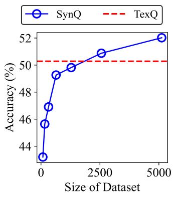

# REFERENCES

- <span id="page-10-13"></span>Ron Banner, Yury Nahshan, and Daniel Soudry. Post training 4-bit quantization of convolutional networks for rapid-deployment. In *NeurIPS*, 2019.
- <span id="page-10-10"></span>Yoonho Boo, Sungho Shin, Jungwook Choi, and Wonyong Sung. Stochastic precision ensemble: self-knowledge distillation for quantized deep neural networks. In *AAAI*, 2021.
- <span id="page-10-15"></span>Alan C Bovik. *Handbook of image and video processing*. Academic press, 2010.
- <span id="page-10-3"></span>Yaohui Cai, Zhewei Yao, Zhen Dong, Amir Gholami, Michael W Mahoney, and Kurt Keutzer. Zeroq: A novel zero shot quantization framework. In *CVPR*, 2020.
- <span id="page-10-7"></span>Aditya Chattopadhay, Anirban Sarkar, Prantik Howlader, and Vineeth N Balasubramanian. Gradcam++: Generalized gradient-based visual explanations for deep convolutional networks. In *WACV*, 2018.
- <span id="page-10-11"></span>Hanting Chen, Yunhe Wang, Chang Xu, Zhaohui Yang, Chuanjian Liu, Boxin Shi, Chunjing Xu, Chao Xu, and Qi Tian. Data-free learning of student networks. In *CVPR*, 2019.
- <span id="page-10-5"></span>Xinrui Chen, Yizhi Wang, Renao Yan, Yiqing Liu, Tian Guan, and Yonghong He. Texq: Zero-shot network quantization with texture feature distribution calibration. In *NeurIPS*, 2023.
- <span id="page-10-0"></span>Yu Cheng, Duo Wang, Pan Zhou, and Tao Zhang. Model compression and acceleration for deep neural networks: The principles, progress, and challenges. *IEEE Signal Processing Magazine*, 35 (1):126–136, 2018.
- <span id="page-10-2"></span>Ikhyun Cho and U Kang. Pea-kd: Parameter-efficient and accurate knowledge distillation on bert. *PLOS ONE*, 17(2):1–12, 02 2022.
- <span id="page-10-14"></span>Jungwook Choi, Zhuo Wang, Swagath Venkataramani, Pierce I-Jen Chuang, Vijayalakshmi Srinivasan, and Kailash Gopalakrishnan. Pact: Parameterized clipping activation for quantized neural networks. *arXiv preprint arXiv:1805.06085*, 2018.
- <span id="page-10-4"></span>Kanghyun Choi, Deokki Hong, Noseong Park, Youngsok Kim, and Jinho Lee. Qimera: Data-free quantization with synthetic boundary supporting samples. In *NeurIPS*, 2021.
- <span id="page-10-8"></span>Kanghyun Choi, Hye Yoon Lee, Deokki Hong, Joonsang Yu, Noseong Park, Youngsok Kim, and Jinho Lee. It's all in the teacher: Zero-shot quantization brought closer to the teacher. In *CVPR*, 2022.
- <span id="page-10-12"></span>Yoojin Choi, Jihwan Choi, Mostafa El-Khamy, and Jungwon Lee. Data-free network quantization with adversarial knowledge distillation. In *CVPRW*, 2020.
- <span id="page-10-6"></span>James W Cooley and John W Tukey. An algorithm for the machine calculation of complex fourier series. *Mathematics of computation*, 19(90):297–301, 1965.
- <span id="page-10-9"></span>J. Deng, W. Dong, R. Socher, L.-J. Li, K. Li, and L. Fei-Fei. Imagenet: A large-scale hierarchical image database. In *CVPR*, 2009.
- <span id="page-10-1"></span>Lei Deng, Guoqi Li, Song Han, Luping Shi, and Yuan Xie. Model compression and hardware acceleration for neural networks: A comprehensive survey. *Proceedings of the IEEE*, 108(4): 485–532, 2020.

- <span id="page-11-15"></span>Tim Dettmers, Artidoro Pagnoni, Ari Holtzman, and Luke Zettlemoyer. Qlora: Efficient finetuning of quantized llms. In *NeurIPS*, 2023.
- <span id="page-11-20"></span>Steven K Esser, Jeffrey L McKinstry, Deepika Bablani, Rathinakumar Appuswamy, and Dharmendra S Modha. Learned step size quantization. In *ICLR*, 2020.
- <span id="page-11-6"></span>Chunxiao Fan, Ziqi Wang, Dan Guo, and Meng Wang. Data-free quantization via pseudo-label filtering. In *CVPR*, 2024.
- <span id="page-11-16"></span>Elias Frantar, Saleh Ashkboos, Torsten Hoefler, and Dan Alistarh. OPTQ: accurate quantization for generative pre-trained transformers. In *ICLR*, 2023.
- <span id="page-11-0"></span>Amir Gholami, Sehoon Kim, Zhen Dong, Zhewei Yao, Michael W Mahoney, and Kurt Keutzer. A survey of quantization methods for efficient neural network inference. In *Low-Power Computer Vision*, pp. 291–326. Chapman and Hall/CRC, 2022.
- <span id="page-11-5"></span>Cong Guo, Yuxian Qiu, Jingwen Leng, Xiaotian Gao, Chen Zhang, Yunxin Liu, Fan Yang, Yuhao Zhu, and Minyi Guo. Squant: On-the-fly data-free quantization via diagonal hessian approximation. In *ICLR*, 2022.
- <span id="page-11-7"></span>Suyog Gupta, Ankur Agrawal, Kailash Gopalakrishnan, and Pritish Narayanan. Deep learning with limited numerical precision. In *ICML*, 2015.
- <span id="page-11-19"></span>Matan Haroush, Itay Hubara, Elad Hoffer, and Daniel Soudry. The knowledge within: Methods for data-free model compression. In *CVPR*, 2020.
- <span id="page-11-10"></span>Kaiming He, Xiangyu Zhang, Shaoqing Ren, and Jian Sun. Deep residual learning for image recognition. In *CVPR*, 2016.
- <span id="page-11-1"></span>Yang He and Lingao Xiao. Structured pruning for deep convolutional neural networks: A survey. *IEEE Transactions on Pattern Analysis and Machine Intelligence*, 46(5):2900–2919, 2024.
- <span id="page-11-13"></span>Benoit Jacob, Skirmantas Kligys, Bo Chen, Menglong Zhu, Matthew Tang, Andrew Howard, Hartwig Adam, and Dmitry Kalenichenko. Quantization and training of neural networks for efficient integer-arithmetic-only inference. In *CVPR*, 2018.
- <span id="page-11-4"></span>Jun-Gi Jang, Chun Quan, Hyun Dong Lee, and U Kang. Falcon: lightweight and accurate convolution based on depthwise separable convolution. *Knowl. Inf. Syst.*, 65(5):2225–2249, 2023.
- <span id="page-11-3"></span>Hyojin Jeon, Seungcheol Park, Jin-Gee Kim, and U Kang. Pet: Parameter-efficient knowledge distillation on transformer. *PLOS ONE*, 18(7):1–21, 07 2023a.
- <span id="page-11-17"></span>Yongkweon Jeon, Chungman Lee, Eulrang Cho, and Yeonju Ro. Mr. biq: Post-training non-uniform quantization based on minimizing the reconstruction error. In *CVPR*, 2022.
- <span id="page-11-11"></span>Yongkweon Jeon, Chungman Lee, and Ho-young Kim. Genie: show me the data for quantization. In *CVPR*, 2023b.
- <span id="page-11-2"></span>Junghun Kim, Jinhong Jung, and U. Kang. Compressing deep graph convolution network with multi-staged knowledge distillation. *PLOS ONE*, 16(8):1–18, 08 2021.
- <span id="page-11-8"></span>Ikki Kishida and Hideki Nakayama. Empirical study of easy and hard examples in CNN training. In *ICONIP*, 2019.
- <span id="page-11-18"></span>Ivan Koryakovskiy, Alexandra Yakovleva, Valentin Buchnev, Temur Isaev, and Gleb Odinokikh. One-shot model for mixed-precision quantization. In *CVPR*, 2023.
- <span id="page-11-12"></span>Alex Krizhevsky, Geoffrey Hinton, et al. Learning multiple layers of features from tiny images. *Technical Report*, 2009.
- <span id="page-11-14"></span>Sunwoo Lee, Jeongwoo Park, and Dongsuk Jeon. Toward efficient low-precision training: Data format optimization and hysteresis quantization. In *ICLR*, 2022.
- <span id="page-11-9"></span>Buyu Li, Yu Liu, and Xiaogang Wang. Gradient harmonized single-stage detector. In *AAAI*, 2019.

- <span id="page-12-6"></span>Huantong Li, Xiangmiao Wu, Fanbing Lv, Daihai Liao, Thomas H Li, Yonggang Zhang, Bo Han, and Mingkui Tan. Hard sample matters a lot in zero-shot quantization. In *CVPR*, 2023a.
- <span id="page-12-1"></span>Yuhang Li, Ruihao Gong, Xu Tan, Yang Yang, Peng Hu, Qi Zhang, Fengwei Yu, Wei Wang, and Shi Gu. Brecq: Pushing the limit of post-training quantization by block reconstruction. In *ICLR*, 2021.
- <span id="page-12-16"></span>Zhikai Li, Liping Ma, Mengjuan Chen, Junrui Xiao, and Qingyi Gu. Patch similarity aware data-free quantization for vision transformers. In *ECCV*, 2022.
- <span id="page-12-18"></span>Zhikai Li, Mengjuan Chen, Junrui Xiao, and Qingyi Gu. Psaq-vit v2: Toward accurate and general data-free quantization for vision transformers. *IEEE Transactions on Neural Networks and Learning Systems*, pp. 1–12, 2023b.
- <span id="page-12-17"></span>Zhikai Li, Junrui Xiao, Lianwei Yang, and Qingyi Gu. Repq-vit: Scale reparameterization for post-training quantization of vision transformers. In *ICCV*, 2023c.
- <span id="page-12-8"></span>Tsung-Yi Lin, Priya Goyal, Ross Girshick, Kaiming He, and Piotr Dollár. Focal loss for dense object detection. In *ICCV*, 2017.
- <span id="page-12-5"></span>Yuang Liu, Wei Zhang, and Jun Wang. Zero-shot adversarial quantization. In *CVPR*, 2021a.
- <span id="page-12-15"></span>Ze Liu, Yutong Lin, Yue Cao, Han Hu, Yixuan Wei, Zheng Zhang, Stephen Lin, and Baining Guo. Swin transformer: Hierarchical vision transformer using shifted windows. In *CVPR*, 2021b.
- <span id="page-12-4"></span>Markus Nagel, Mart van Baalen, Tijmen Blankevoort, and Max Welling. Data-free quantization through weight equalization and bias correction. In *ICCV*, 2019.
- <span id="page-12-20"></span>Markus Nagel, Rana Ali Amjad, Mart Van Baalen, Christos Louizos, and Tijmen Blankevoort. Up or down? adaptive rounding for post-training quantization. In *ICML*, 2020.
- <span id="page-12-3"></span>Seungcheol Park, Hojun Choi, and U Kang. Accurate retraining-free pruning for pretrained encoderbased language models. In *ICLR*, 2024a.
- <span id="page-12-0"></span>Seungcheol Park, Jaehyeon Choi, Sojin Lee, and U Kang. A comprehensive survey of compression algorithms for language models. *arXiv preprint arXiv:2401.15347*, 2024b.
- <span id="page-12-10"></span>Yongchan Park, Jun-Gi Jang, and U Kang. Fast and accurate partial fourier transform for time series data. In *KDD*, 2021.
- <span id="page-12-11"></span>Yongchan Park, Jongjin Kim, and U Kang. Fast multidimensional partial fourier transform with automatic hyperparameter selection. In *KDD*, 2024c.
- <span id="page-12-2"></span>Tairen Piao, Ikhyun Cho, and U. Kang. Sensimix: Sensitivity-aware 8-bit index & 1-bit value mixed precision quantization for bert compression. *PLOS ONE*, 17(4):1–22, 2022.
- <span id="page-12-13"></span>Biao Qian, Yang Wang, Richang Hong, and Meng Wang. Adaptive data-free quantization. In *CVPR*, 2023a.
- <span id="page-12-12"></span>Biao Qian, Yang Wang, Richang Hong, and Meng Wang. Rethinking data-free quantization as a zero-sum game. In *AAAI*, 2023b.
- <span id="page-12-19"></span>Akshat Ramachandran, Souvik Kundu, and Tushar Krishna. Clamp-vit: Contrastive data-free learning for adaptive post-training quantization of vits. In *ECCV*, 2024.
- <span id="page-12-7"></span>Marco Tulio Ribeiro, Sameer Singh, and Carlos Guestrin. "why should i trust you?" explaining the predictions of any classifier. In *KDD*, 2016.
- <span id="page-12-14"></span>Mark Sandler, Andrew Howard, Menglong Zhu, Andrey Zhmoginov, and Liang-Chieh Chen. Mobilenetv2: Inverted residuals and linear bottlenecks. In *CVPR*, 2018.
- <span id="page-12-9"></span>Florian Scheidegger, Roxana Istrate, Giovanni Mariani, Luca Benini, Costas Bekas, and A. Cristiano I. Malossi. Efficient image dataset classification difficulty estimation for predicting deep-learning accuracy. *Vis. Comput.*, 37(6):1593–1610, 2021.

- <span id="page-13-7"></span>Ramprasaath R. Selvaraju, Michael Cogswell, Abhishek Das, Ramakrishna Vedantam, Devi Parikh, and Dhruv Batra. Grad-cam: Visual explanations from deep networks via gradient-based localization. In *ICCV*, 2017.
- <span id="page-13-13"></span>Yuzhang Shang, Zhihang Yuan, Bin Xie, Bingzhe Wu, and Yan Yan. Post-training quantization on diffusion models. In *CVPR*, 2023.
- <span id="page-13-3"></span>Prasen Kumar Sharma, Arun Abraham, and Vikram Nelvoy Rajendiran. A generalized zero-shot quantization of deep convolutional neural networks via learned weights statistics. *IEEE Transactions on Multimedia*, 25:953–965, 2021.
- <span id="page-13-12"></span>Hugo Touvron, Matthieu Cord, Matthijs Douze, Francisco Massa, Alexandre Sablayrolles, and Hervé Jégou. Training data-efficient image transformers & distillation through attention. In *ICML*, 2021.
- <span id="page-13-1"></span>Cuong Tran, Ferdinando Fioretto, Jung-Eun Kim, and Rakshit Naidu. Pruning has a disparate impact on model accuracy. In *NeurIPS*, 2022.
- <span id="page-13-17"></span>Karen Ullrich, Edward Meeds, and Max Welling. Soft weight-sharing for neural network compression. In *ICLR*, 2016.
- <span id="page-13-0"></span>Huanyu Wang, Junjie Liu, Xin Ma, Yang Yong, Zhenhua Chai, and Jianxin Wu. Compressing models with few samples: Mimicking then replacing. In *CVPR*, 2022.
- <span id="page-13-18"></span>Kuan Wang, Zhijian Liu, Yujun Lin, Ji Lin, and Song Han. Haq: Hardware-aware automated quantization with mixed precision. In *CVPR*, 2019.
- <span id="page-13-19"></span>Xiuying Wei, Ruihao Gong, Yuhang Li, Xianglong Liu, and Fengwei Yu. Qdrop: Randomly dropping quantization for extremely low-bit post-training quantization. In *ICLR*, 2022.
- <span id="page-13-20"></span>Ross Wightman. Pytorch image models. [https://github.com/rwightman/](https://github.com/rwightman/pytorch-image-models) [pytorch-image-models](https://github.com/rwightman/pytorch-image-models), 2019.
- <span id="page-13-2"></span>Yi Xie, Huaidong Zhang, Xuemiao Xu, Jianqing Zhu, and Shengfeng He. Towards a smaller student: Capacity dynamic distillation for efficient image retrieval. In *CVPR*, 2023.
- <span id="page-13-10"></span>Shoukai Xu, Haokun Li, Bohan Zhuang, Jing Liu, Jiezhang Cao, Chuangrun Liang, and Mingkui Tan. Generative low-bitwidth data free quantization. In *ECCV*, 2020.
- <span id="page-13-14"></span>Yuhui Xu, Lingxi Xie, Xiaotao Gu, Xin Chen, Heng Chang, Hengheng Zhang, Zhengsu Chen, Xiaopeng Zhang, and Qi Tian. Qa-lora: Quantization-aware low-rank adaptation of large language models. *ICLR*, 2024.
- <span id="page-13-4"></span>Jaemin Yoo, Minyong Cho, Taebum Kim, and U Kang. Knowledge extraction with no observable data. In *NeurIPS*, 2019.
- <span id="page-13-9"></span>Sergey Zagoruyko and Nikos Komodakis. Paying more attention to attention: Improving the performance of convolutional neural networks via attention transfer. In *ICLR*, 2017.
- <span id="page-13-5"></span>Xiangguo Zhang, Haotong Qin, Yifu Ding, Ruihao Gong, Qinghua Yan, Renshuai Tao, Yuhang Li, Fengwei Yu, and Xianglong Liu. Diversifying sample generation for accurate data-free quantization. In *CVPR*, 2021.
- <span id="page-13-15"></span>Yunshan Zhong, Mingbao Lin, Mengzhao Chen, Ke Li, Yunhang Shen, Fei Chao, Yongjian Wu, and Rongrong Ji. Fine-grained data distribution alignment for post-training quantization. In *ECCV*, 2022a.
- <span id="page-13-6"></span>Yunshan Zhong, Mingbao Lin, Gongrui Nan, Jianzhuang Liu, Baochang Zhang, Yonghong Tian, and Rongrong Ji. Intraq: Learning synthetic images with intra-class heterogeneity for zero-shot network quantization. In *CVPR*, 2022b.
- <span id="page-13-8"></span>Bolei Zhou, Aditya Khosla, Agata Lapedriza, Aude Oliva, and Antonio Torralba. Learning deep features for discriminative localization. In *CVPR*, 2016.
- <span id="page-13-16"></span>Yiren Zhou, Seyed-Mohsen Moosavi-Dezfooli, Ngai-Man Cheung, and Pascal Frossard. Adaptive quantization for deep neural network. In *AAAI*, 2018.
- <span id="page-13-11"></span>Baozhou Zhu, Peter Hofstee, Johan Peltenburg, Jinho Lee, and Zaid Alars. Autorecon: Neural architecture search-based reconstruction for data-free. In *IJCAI*, 2021.

### <span id="page-14-0"></span>NOTATION

<span id="page-14-2"></span>We summarize the frequently used notations in the paper as Table 4.

Table 4: Frequently used notations.

| Symbol                                                                                                                                                                                    | Description                                                                                                                                                                                                                                                     |
|-------------------------------------------------------------------------------------------------------------------------------------------------------------------------------------------|-----------------------------------------------------------------------------------------------------------------------------------------------------------------------------------------------------------------------------------------------------------------|
| $\frac{\theta}{\theta^q}$                                                                                                                                                                 | A pre-trained model The quantized model                                                                                                                                                                                                                         |
| $ \begin{cases} \mathbf{x}_i \}_{i=1}^{N} \\ \mathbf{y}_i \}_{i=1}^{N} \\ q(\mathbf{x}_i; \theta) \\ \delta(\mathbf{x}_i; \theta) \\ KL(\cdot    \cdot) \\ CE(\cdot, \cdot) \end{cases} $ | Synthetic samples One-hot encoded labels of synthetic samples Probability distribution of a sample $\mathbf{x}_i$ predicted by parameters $\theta$ Difficulty of a sample $\mathbf{x}_i$ predicted by parameters $\theta$ KL divergence loss Cross-entropy loss |
| $\begin{array}{c} \mathcal{F} \\ \mathbf{G} \\ D_0 \\ \lambda_{CAM} \\ \lambda_{CE} \\ \tau \end{array}$                                                                                  | Fourier transform function Gaussian low-pass filter Filtering hyperparameter Balancing hyperparameter of CAM loss Balancing hyperparameter of CE loss Threshold of difficulty for cross-entropy loss                                                            |

### ALGORITHM

We describe the quantization procedure of SYNQ in Algorithm 1. Note that any technique for generating synthetic datasets is applicable.

```
Algorithm 1 Quantization procedure of SYNQ
```

```
Input: the pre-trained model with parameters \theta, hyperparameters n_{ep}, D_0, \lambda_{CAM}, \lambda_{CE}, and \tau.
 Output: the parameters \theta^q of the quantized model.
     /** Step 1: Generate synthetic dataset **/
 1: Initialize the synthetic dataset \{\mathbf{x}_i\}_{i=1}^N with Gaussian noise.
 2: Randomly assign labels \{y_i\}_{i=1}^N for synthetic dataset.
 3: Optimize \{\mathbf{x}_i\}_{i=1}^N to minimize \mathcal{L}_{IL} + \alpha \mathcal{L}_{BNS}.

     /** Step 2: Fine-tune quantized model **/
 4: Initialize \theta^q following the round-to-nearest scheme.
 5: Apply a low-pass Gaussian filter with a cut-off frequency D_0
     to synthetic samples and obtain \{\mathbf{x}_i^F\}_{i=1}^N.
                                                                                                   ⊳ Idea 1: Low-pass filter
 6: for each epoch in [1, \ldots, n_{ep}] do
          Initialize the total loss \mathcal{L} to zero.
 7:
          for i in [1, \ldots, N] do
 8:
 9:
               Perform forward pass of \theta and \theta^q with synthetic sample \mathbf{x}_i^F.
10:
               Compare gradients and calculate the CAM loss \mathcal{L}_{CAM}.
                                                                                                 ⊳ Idea 2: CAM alignment
               \mathcal{L} \leftarrow \mathcal{L} + KL(q(\mathbf{x}_i; \theta) || q(\mathbf{x}_i; \theta^q)) + \lambda_{CAM} \mathcal{L}_{CAM}
11:
               Calculate \delta(\mathbf{x}_i; \theta)
12:
13:
               if \delta(\mathbf{x}_i; \theta) \leq \tau then

                    \mathcal{L} \leftarrow \mathcal{L} + \lambda_{CE}CE(q(\mathbf{x}_i; \theta^q), \mathbf{y}_i)
14:
               end if
15:
16:
          end for
          Update \theta^q to minimize \mathcal{L}.
17:
18: end for
19: return \theta^q
```

### <span id="page-15-0"></span>C FURTHER DISCUSSION AND EXPERIMENTS

#### <span id="page-15-2"></span>C.1 PROOF OF THEOREM 1

We provide the proof of Theorem 1 as below:

*Proof.* We investigate the time complexity of SYNQ in three steps: synthetic dataset generation, low-pass filter application, and quantized model fine-tuning. First, synthetic dataset generation involves calculating Inception Loss  $\mathcal{L}_{IL}$  and Batch Normalization Statistics Loss  $\mathcal{L}_{BNS}$  for N samples, each requiring a forward pass through the model, resulting in complexity of  $O(NT_{\theta})$ .

Second, applying the low-pass filter  $\mathbf{G}$  involves a Fourier transform  $\mathcal{F}(\cdot)$ , an element-wise multiplication  $\odot$ , and an inverse Fourier transform  $\mathcal{F}^{-1}(\cdot)$  (see Equation 4). Implementing with Fast Fourier Transform(FFT), the time complexity for a single input  $\mathbf{x}$  with size of  $Z \times Z$  is  $O(Z \log Z)$ , O(Z), and  $O(Z \log Z)$  is for  $\mathcal{F}(\mathbf{x})$ ,  $\mathbf{G} \odot \mathcal{F}(\mathbf{x})$ , and  $\mathcal{F}(\mathbf{G} \odot \mathcal{F}(\mathbf{x}))$ , respectively (Cooley & Tukey, 1965). Therefore, the time complexity of this step is  $O(NZ \log Z)$  for N samples.

Lastly, the fine-tuning step involves calculating the loss for N filtered samples, resulting in complexity of  $O(N(T_{\theta} + L \cdot T_{\theta}))$ . Here,  $T_{\theta}$  represents the complexity of computing the cross-entropy and KL divergence losses, and  $L \cdot T_{\theta}$  represents the complexity of computing the Grad-CAM loss  $\mathcal{L}_{CAM}$  across L layers. Generating saliency maps  $S^{\theta}(\mathbf{x})$  for a single input  $\mathbf{x}$  for all L layers using Grad-CAM requires one forward pass and L backward passes, thereby requiring  $O(NLT_{\theta})$  for N samples (Selvaraju et al., 2017). Thus, the complexity of computing  $\mathcal{L}_{CAM}$  (Equation 5) is  $O(NLT_{\theta})$  because aligning the saliency maps  $\mathbf{S}^{\theta}(\mathbf{x}_i)$  and  $\mathbf{S}^{\theta^q}(\mathbf{x}_i)$  is negligible compared to model inference time  $T_{\theta}$ . In summary, this step is simplified to  $O(NLT_{\theta})$ .

Combining these complexities, we get:

$$O(NT_{\theta} + NZ \log Z + NLT_{\theta}) = O(NLT_{\theta}) \quad (: T_{\theta} \gg Z \log Z).$$

#### <span id="page-15-3"></span>C.2 RUNTIME ANALYSIS

We perform a runtime analysis to investigate the computational overhead introduced by SYNQ. For this, we measure the difference in fine-tuning time between the baseline methods with and without SYNQ. For fair comparison, we compare only with noise optimization methods since they do not train a generator model while fine-tuning. Figure 8 depicts the relative contribution of baseline methods to the per-epoch fine-tuning time compared to the approach where SYNQ is added to the baseline method for three baselines, IntraQ (Zhong et al., 2022b), HAST (Li et al., 2023a), and TexQ (Chen et al., 2023). Note that the overhead from SYNQ is marginal, i.e., the added time takes only 17.81% of the total time in average. Thus, SYNQ improves adopted models with minimal sacrifice of quantization time.

<span id="page-15-4"></span>

Figure 8: Runtime analysis of SYNQ. The overhead from SYNQ is marginal.

### <span id="page-15-1"></span>C.3 PREVALENT NOISE IN THE SYNTHETIC DATASET

In Section 4.2 and Figure 5, we empirically analyze the limitation of the exiting ZSQ approaches, i.e., their synthetic datasets contain more high-frequency components compared to real image datasets, clearly indicating a higher level of noise. We investigate this limitation across various ZSQ methods and datasets to demonstrate that it is a widespread issue, not confined to specific scenarios. Figures 9 and 10 show the amplitude distribution of real and synthetic datasets, respectively. We compare three real datasets CIFAR-10, CIFAR-100, and ImageNet with the corresponding synthetic dataset produced by three baseline methods, IntraQ (Zhong et al., 2022b) (first row), HAST (Li et al., 2023a) (third row), and TexQ (Chen et al., 2023) (fifth row). We then apply a low-pass filter ( $D_0 = 50$ ) to mitigate the observed noise. As shown in the figures, the discrepancy in amplitude distribution is observed regardless of the baseline method or dataset. This is effectively mitigated by exploiting the filter that removes high-frequency noise, thereby leading to enhanced quantization performance. In summary, both the limitation of noise in synthetic dataset and effect of low-pass filter (Section 4.2) are evident in a large variety of settings.

<span id="page-16-1"></span>




Figure 9: Amplitude distribution of various real image datasets. See Appendix C.3 for details.

<span id="page-16-2"></span>Table 5: The average per-batch KL-divergence [ $\times 10^{-2}$ ] between the saliency maps of the pre-trained and quantized models trained with different methods and datasets. See Section C.4 for details.

|                              | D 11.        | Synthetic dataset |                  |  |
|------------------------------|--------------|-------------------|------------------|--|
| Method                       | Real dataset | Baseline          | + SYNQ           |  |
| IntraQ (Zhong et al., 2022b) | 3.1973       | 4.0251            | 3.2891 (-18.29%) |  |
| HAST (Li et al., 2023a)      | 3.0976       | 3.9867            | 3.3133 (-16.89%) |  |
| TexQ (Chen et al., 2023)     | 2.9952       | 3.8436            | 3.1542 (-17.94%) |  |

#### <span id="page-16-0"></span>FURTHER ANALYSIS ON CAM PATTERN DISCREPANCY

The observation of "predictions based on off-target patterns" from Figure 2 in Section 3 is intuitive and persuasive, but it is analyzed under limited conditions. We explore the distance between saliency maps derived from Grad-CAM (Selvaraju et al., 2017) to 1) validate this challenge across diverse methods and 2) demonstrate that it applies not only to a few selected images but also to the entire synthetic dataset on average. Table 5 presents the average distance between the saliency maps of the pre-trained model (target) and the quantized models (prediction) trained with various methods and datasets. We compute the KL divergence between the saliency maps of 3-bit quantized ResNet-18 models pre-trained on the ImageNet dataset, treating each saliency map as a distribution, and report the average distance across batches with size of 32. From the result, we have three observations. First, all three baseline methods demonstrate notable CAM discrepancies, emphasizing the generality of this challenge in the ZSO domain. Second, this challenge is significantly mitigated when using real datasets, with a reduction in distance exceeding 20% compared to synthetic datasets. This highlights that training with synthetic datasets exacerbates this problem. Last, adopting SYNQ significantly lowers the CAM discrepancy for all baseline methods, achieving a reduction of approximately 16-18% compared to the baseline. The resulting discrepancy is comparable to that of training with real datasets. Overall, the challenge of CAM pattern discrepancy 1) is evident across multiple methods and 2) is notably reduced by CAM alignment of SYNQ.

### C.5 COMPARISON BETWEEN CAM ALIGNMENT AND FEATURE ALIGNMENT

We compare CAM (Class Activation Map) alignment of our Table 6: Ablation study of two alignproposed SYNQ and feature alignment of HAST (Li et al., 2023a) to mitigate possible misunderstandings and highlight the novelty of the proposed idea. The main difference between CAM alignment and feature alignment lies in their focus on different aspects of the model's behavior. Compared to activation maps that show the response of the model to the given input, CAM emphasizes the region of the model related to the model's prediction, highlighting the most relevant features that contribute to the final decision. This is because CAM is defined based on the magnitude of the gradient with respect to the cross-entropy between the prediction and the label. Con-

<span id="page-16-3"></span>ment techniques. CAM alignment shows superior performance.

| FA       | I2   | I1 & I3 | Accuracy [%]                         |
|----------|------|---------|--------------------------------------|
|          | Base | line    | 43.63                                |
| <b>√</b> | 1    |         | $46.77 \pm 0.30$<br>$48.26 \pm 0.29$ |
| <b>√</b> | /    | 1       | $51.20 \pm 0.30$<br>$52.02 \pm 0.34$ |

<span id="page-17-0"></span>

Figure 10: Amplitude distribution of various synthetic datasets. See Appendix C.3 for details.

<span id="page-18-2"></span>Table 7: Comparison of ZSQ accuracy [%] of the ResNet-18 model pre-trained on the ImageNet dataset, before and after applying SYNQ. Regardless of the baseline method and quantization bits, SYNQ consistently improves the ZSQ accuracy.

|                    |                              |          | W3A3         |       | W4A4     |              |      |
|--------------------|------------------------------|----------|--------------|-------|----------|--------------|------|
| Type               | Method                       | Baseline | + SYNQ       | Imp.  | Baseline | + SYNQ       | Imp. |
|                    | GDFQ (Xu et al., 2020)       | 20.23    | 25.57 ± 0.28 | 5.34  | 60.60    | 61.23 ± 0.21 | 0.63 |
| Generator-based    | Qimera (Choi et al., 2021)   | 1.17     | 32.34 ± 0.30 | 31.17 | 63.84    | 64.28 ± 0.18 | 0.44 |
|                    | AdaDFQ (Qian et al., 2023a)  | 38.10    | 40.56 ± 0.28 | 2.46  | 66.53    | 66.79 ± 0.22 | 0.26 |
|                    | IntraQ (Zhong et al., 2022b) | 45.51    | 50.44 ± 0.42 | 4.93  | 66.47    | 66.73 ± 0.19 | 0.26 |
| Noise Optimization | HAST (Li et al., 2023a)      | 42.58    | 50.69 ± 0.38 | 8.11  | 66.91    | 67.19 ± 0.21 | 0.28 |
|                    | TexQ (Chen et al., 2023)     | 50.28    | 51.58 ± 0.30 | 1.30  | 67.73    | 67.85 ± 0.16 | 0.12 |

sidering that simple fine-tuning methods unintentionally lead the quantized model to rely on incorrect image patterns for predictions, CAM alignment shows clear advantage over feature alignment. By aligning the saliency maps between the original and quantized models, we ensure that the critical predictive regions remain consistent, thereby preserving the interpretability and accuracy of the model's decisions, which is more effective than merely matching activation maps.

We conduct an ablation study to compare the performance. Table [6](#page-16-3) reports the 3bit ZSQ accuracy of ResNet-18 model on ImageNet dataset when applying CAM alignment (I2) and feature alignment (FA). CAM alignment shows clear advantage in performance over feature alignment both with and without other ideas (I1 & I3) of SYNQ.

Furthermore, we compare the computational overhead of two alignments. They have the same time complexity since both maps are obtained by applying backpropagation through the network. In practice, the average training time (in seconds) of the ResNet-18 model per epoch is 113.40 ± 2.28 seconds and 113.27 ± 2.34 seconds for CAM alignment and feature alignment, respectively. Regarding training time, the gap between two methods is negligible. Overall, CAM alignment directly targets the second challenge (prediction based on off-target patterns), thereby showing notable performance enhancement with similar training time compared to the feature alignment of HAST.

## <span id="page-18-0"></span>C.6 APPLICATION ON DIFFERENT BASELINES

We evaluate the ZSQ performance when applying SYNQ on different baselines to investigate the adaptability of the proposed method. Specifically, we select three generator-based baselines (GDFQ [\(Xu](#page-13-10) [et al., 2020\)](#page-13-10), Qimera [\(Choi et al., 2021\)](#page-10-4), and AdaDFQ [\(Qian et al., 2023a\)](#page-12-13)) and three noise optimization baselines (IntraQ [\(Zhong et al., 2022b\)](#page-13-6), HAST [\(Li et al., 2023a\)](#page-12-6), and TexQ [\(Chen et al.,](#page-10-5) [2023\)](#page-10-5)). While generator-based methods simultaneously train the generator and quantized model, noise optimization methods generate the synthetic dataset first and fine-tune with it afterwards. Table [7](#page-18-2) reports the accuracy of quantized models and the percent point improvement ("Imp."). SYNQ consistently enhances the ZSQ performance of for all baseline methods, specifically up to 31.17%p. The increasing effectiveness in lower bit-width experiments highlights the superiority of SYNQ. In overall, SYNQ is powerful and versatile since it is easily integrated with any ZSQ method utilizing synthetic dataset, enhancing their performance across various settings.

### <span id="page-18-1"></span>C.7 ANALYSIS ON ZERO-SHOT POST-TRAINING QUANTIZATION SETTING

In this paper, we mainly discover ZSQ under settings that additional fine-tuning of the quantized model is performed, namely *Quantization-Aware Training (QAT)* setting. However, a recent work, Genie [\(Jeon et al., 2023b\)](#page-11-11) has explored ZSQ under *Post-Training Quantization (PTQ)* setting, where no additional fine-tuning is needed. In this section, we first briefly discuss the preliminaries on uniform quantization. Then, we compare the settings of SYNQ and Genie to mitigate possible misunderstandings and explain why Genie is neglected from our competitors in the main experiments (Table [1\)](#page-7-0). Lastly, we integrate SYNQ with Genie and evaluate its quantization performance to highlight the superior adaptability and broad applicability of SYNQ.

<span id="page-19-1"></span>Table 8: Zero-shot Quantization accuracy [%] of a ResNet-18 model on ImageNet quantized with Genie (Jeon et al., 2023b) as baseline. WPAQ indicates that weights and activations are quantized each into Pbit and Qbit, respectively. SYNQ shows consistent improvements in quantization performance when applied to Genie, across various quantization bits.

| Method                     | W2A2                               | W2A4             | W3A3                               | W4A4                               | Average |
|----------------------------|------------------------------------|------------------|------------------------------------|------------------------------------|---------|
| Genie (Jeon et al., 2023b) | 54.01                              | 65.10            | 66.84                              | 69.66                              | 63.90   |
| + SYNQ (Proposed)          | $\textbf{54.97} \pm \textbf{0.35}$ | $65.88 \pm 0.27$ | $\textbf{67.42} \pm \textbf{0.21}$ | $\textbf{69.88} \pm \textbf{0.19}$ | 64.54   |

**Preliminaries on Uniform Quantization.** We describe the preliminaries on the uniform quantization scheme. Uniform quantization is to represent the weight and activation of a higher-bit given network, within lower bit integers. To perform B bit uniform quantization, we first linearly scale the distribution of weight matrix  $\mathbf{W}$  within a range of  $[-2^{B-1}, 2^{B-1} - 1]$ , then map weight values into equally divided integers following the rounding-to-nearest scheme (Gupta et al., 2015). Given a matrix  $\mathbf{W}$  with the size of quantization granularity, the B bit quantized matrix  $\mathbf{W}^q$  by uniform quantization is calculated as shown in Equation 7.

<span id="page-19-0"></span>
$$\mathbf{W}^{q} = \lfloor \frac{\mathbf{W}}{s} - z + \frac{1}{2} \rfloor, \quad \text{where } s = \frac{\beta - \alpha}{2^{B} - 1} \ , \ z = \frac{\alpha}{s} + 2^{B - 1}, \tag{7}$$

and  $[\alpha,\beta]$  is the clipping range corresponding to  $[-2^{B-1},2^{B-1}-1]$  in integer scale. Properly choosing the clipping range  $[\alpha,\beta]$  for  ${\bf W}$  is essential, as it defines the scaling factor s and zero-point z required for accurate quantization. A commonly used approach, known as  ${\it Min-max\ Quantization}$ , involves setting  $\alpha$  and  $\beta$  to the minimum and maximum values of  ${\bf W}$ , respectively. The key advantage of min-max quantization is its simplicity and effectiveness, requiring no calibration to define the clipping range. This makes it the most essential and unbiased baseline for fair comparison among diverse quantization methods, especially under QAT setting.

However, min-max quantization is vulnerable to outliers, especially when quantizing activation. Outliers significantly expand the range  $[\alpha, \beta]$ , leading to lower precision for the majority of values in **W** during quantization. Parameterized clipping (Choi et al., 2018) mitigates this outlier effects by allowing the range to adapt based on the data distribution. This method leverages a calibration dataset to identify clipping thresholds  $\alpha$  and  $\beta$  that best represent the data distribution for improved quantization precision. Building on this approach, advanced techniques such as adaptive rounding (Nagel et al., 2020), learned step size (Esser et al., 2020), random dropping (Wei et al., 2022), block reconstruction (Li et al., 2021), and scale reparameterization (Li et al., 2023c) have been developed under PTQ settings, further enabling improved quantization without fine-tuning.

A Direct Comparison with Genie (Jeon et al., 2023b). We compare the settings between SYNQ and Genie (Jeon et al., 2023b). Whereas SYNQ optimizes the parameters  $\theta^q$  of the quantized model in QAT, Genie follows a PTQ scheme, focusing on the scale factor s and zero-point z. To achieve this, Genie combines a joint optimization framework for PTQ (Genie-M) for s and soft-bit V (refer to AdaRound (Nagel et al., 2020) and Genie (Jeon et al., 2023b) for details) with advanced techniques such as LSQ (Esser et al., 2020), QDrop (Wei et al., 2022), and BRECQ (Li et al., 2021). Moreover, Genie fixes the quantization bits of the first layer's weights and activation, as well as the last layer's activation, to 8 bits across all experiments. On the other hand, SYNQ and other QAT approaches that are listed in Table 1 uniformly assign bits across all layers, using min-max quantization as the baseline. Due to the differences in quantization strategies and experimental conditions, evaluating Genie alongside zero-shot QAT methods is challenging.

Accuracy in Zero-shot Post-Training Quantization. While Genie's PTQ framework does not support experiments under min-max quantization, our proposed method SYNQ enables synthesis-aware fine-tuning for any ZSQ method that generates and utilizes synthetic datasets. Consequently, we evaluate the ZSQ accuracy under Genie's setting both with and without SYNQ in Table 8. We follow Genie for the experimental settings (see Table 3 and Appendix A of the Genie paper) and carry out implementation using their official code. Note that the size of synthetic dataset is 1,024 for this experiment. Applying SYNQ leads to consistent gains in ZSQ accuracy for Genie across various bit settings, showing an average enhancement of 0.66%p. These results clearly demonstrate the superiority of SYNQ, showcasing its compatibility with diverse quantization techniques other than min-max quantization.

<span id="page-20-2"></span>Table 9: 3bit ZSQ accuracy [%] of a ResNet-18 model pre-trained on ImageNet dataset when four different types of noise is injected into its synthetic dataset. See Section C.8 for details.

| Method                   | D 11     | Noise              |                    |                    |                    |  |  |
|--------------------------|----------|--------------------|--------------------|--------------------|--------------------|--|--|
|                          | Baseline | Gaussian           | Speckle            | S & P              | Uniform            |  |  |
| TexQ (Chen et al., 2023) | 50.28    | 33.01<br>(-34.35%) | 29.80<br>(-40.74%) | 40.82<br>(-18.81%) | 39.85<br>(-20.74%) |  |  |
| SYNQ (Proposed)          | 52.02    | 43.29<br>(-16.78%) | 35.62<br>(-31.53%) | 46.81<br>(-10.01%) | 45.11<br>(-13.28%) |  |  |

#### <span id="page-20-0"></span>C.8 Analysis on the Robustness Towards Noise

We validate the robustness of SYNQ towards different types of noise. Table 9 compares how TexQ and SYNQ perform in quantization when four distinct noise types are introduced into their synthetic datasets. Specifically, we report the 3bit ZSQ accuracy of a ResNet-18 model pre-trained on ImageNet dataset with four types of noise: Gaussian, speckle, Salt-and-Pepper (S & P), and uniform (Bovik, 2010). We have two observations from the result. First, the low-pass filter effectively minimizes accuracy degradation across various noise types, surpassing the baseline in capacity. Second, the effect of low-pass filter and the influence of noise both vary significantly depending on the noise type. Thus, our future work involves tailoring the noise filtering approach to better handle specific noise types in synthetic datasets.

### <span id="page-20-1"></span>C.9 Performance regarding the Size of Synthetic Dataset

We analyze the performance variation of SYNQ according to the size of synthetic dataset. Figure 11 shows the 3bit ZSO accuracy of ResNet-18 model pre-trained on ImageNet dataset. We report the performance while doubling the size of synthetic dataset used for training from 80 to 5,120 images. Note that we compare the model performance trained with 5,120 samples for the main experiments (see Appendix D). We have two observations from the result. First, SYNQ achieves higher performance when trained with a greater number of images. Although the incremental gains begin to drop near 1,000 images and onward, we expect that generating more than 5,120 synthetic images could achieve superior accuracy than the results reported in Table 1. Second, SYNQ outperforms TexQ even when training with only half the dataset, demonstrating the effectiveness of synthesis-aware fine-tuning introduced by SYNO. In overall, SYNO shows better performance compared to the baselines, with performance improving as the synthetic dataset size increases.

<span id="page-20-3"></span>

Figure 11: ZSQ accuracy regarding the size of synthetic dataset. See Appendix C.9 for details.

### <span id="page-20-4"></span>C.10 VISUALIZATION OF SYNTHETIC DATASET

Although SYNQ is applicable to any ZSQ methods that generate a synthetic dataset, investigating 1) the training set utilized for the highest performance and 2) the effect of the low-pass filter (Idea 1) is essential in understanding SYNQ. Figure 12 presents a visualization of images from three synthetic datasets before and after the low-pass filter. These datasets are generated following the baseline method which is detailed in Appendix D, by three different models: a ResNet-20 model pre-trained on CIFAR-10 dataset (Figures 12a and 12b), a ResNet-20 model pre-trained on CIFAR-100 dataset (Figures 12c and 12d), and a ResNet-18 model pre-trained on ImageNet dataset (Figures 12e and 12f). In order to effectively visualize the effect of the low-pass filter, we set the filtering hyperparameter  $D_0$  to 8, 8, and 40 for CIFAR-10, CIFAR-100, and ImageNet datasets, respectively. We have two observations from Figure 12. First, the visualized images show distinct patterns and differences across various classes. Second, the low-pass filter removes noise effectively while preserving essential features in the generated images, which are noticeable especially in lower resolution samples.

<span id="page-21-0"></span>

Figure 12: Visualization of samples within the synthetic dataset before (left) and after (right) the low-pass filter, generated by (a, b) a ResNet-20 model pre-trained on CIFAR-10 dataset, (c, d) a ResNet-20 model pre-trained on CIFAR-100 dataset, and (e, f) a ResNet-18 model pre-trained on ImageNet dataset. See Appendix [C.10](#page-20-4) for details.

<span id="page-22-2"></span>

Figure 13: Hyperparameter analysis of difficulty threshold τ with ResNet-20 (R-20) model pre-trained on CIFAR-10 and CIFAR-100 datasets, and MobileNetV2 (MV2) model pre-trained on ImageNet dataset. See Appendix [C.11](#page-22-1) for details.

