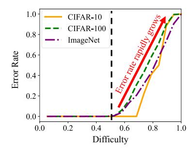

# 3 OBSERVATION

We present the observations that highlight the three major challenges posed to existing methods.

Noise in the synthetic dataset. The synthetic dataset is noisy, as it is produced by noise optimization that starts with a Gaussian noise. In Figure [1,](#page-1-0) we compare (a) real images from the ImageNet dataset with (b) generated samples from the synthetic dataset following TexQ [\(Chen et al., 2023\)](#page-10-5). Generated samples display distinct grainy noise that leads to an evenly distributed frequency magnitude spectrum, in contrast to the real images whose magnitude is primarily concentrated in the low-frequency area. Note that we investigate the frequency magnitude spectrum by applying Fourier transform [\(Cooley &](#page-10-6) [Tukey, 1965;](#page-10-6) [Park et al., 2021;](#page-12-10) [2024c\)](#page-12-11) on images. Moreover, Figure [5](#page-5-0) shows the severe differences in amplitude distributions between (a) real images and (b) generated samples (refer to Appendix [C.3](#page-15-1) for results on other baselines and datasets). This frequency domain discrepancy challenges the quantized model to restore classification performance during fine-tuning.

Predictions based on off-target patterns. Fine-tuning with a synthetic dataset leads the quantized model to rely on incorrect image patterns for predictions. Figure [2](#page-1-1) shows the discriminative regions that Grad-CAM [\(Selvaraju et al., 2017\)](#page-13-7) identifies for the ground-truth class across three models: (a) pre-trained ResNet-18 model on the ImageNet dataset, (b) 3bit quantized model by TexQ [\(Chen et al., 2023\)](#page-10-5), and (c) 3bit quantized model by our SYNQ. Note that TexQ predicts based on wrong regions, unlike the pre-trained model which accurately captures critical regions (refer to Appendix [C.4](#page-16-0) for further analysis). This mismatch definitely harms the quantization performance.

Misguidance by erroneous hard labels. Reliance on erroneous hard labels in the synthetic dataset leads to misguided fine-tuning outcomes. Figure [3](#page-3-1) shows the growing error rates for pre-trained ResNet [\(He et al., 2016\)](#page-11-10) models on CIFAR-10, CIFAR-100, and ImageNet datasets as image difficulty increases. Difficulty of an image is defined as Equation [\(3\)](#page-2-2), detailed in Section [2.2.](#page-2-4) Consequently, the pre-trained model often mislabels samples with a difficulty level over 0.5. These erroneous hard labels of difficult samples damage quantization performance.

Figure 3: Error rates of pre-trained ResNet-20 on CIFAR-10 (yellow) and CIFAR-100 (green), and ResNet-18 on ImageNet (purple) by difficulty. Error rate rapidly grows as the difficulty exceeds 0.5.

